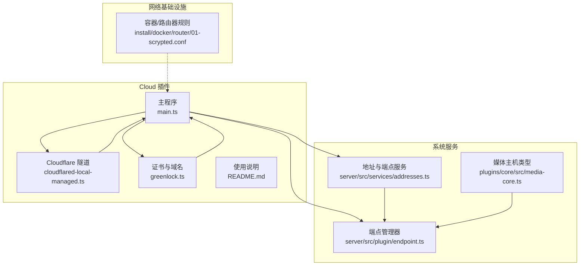
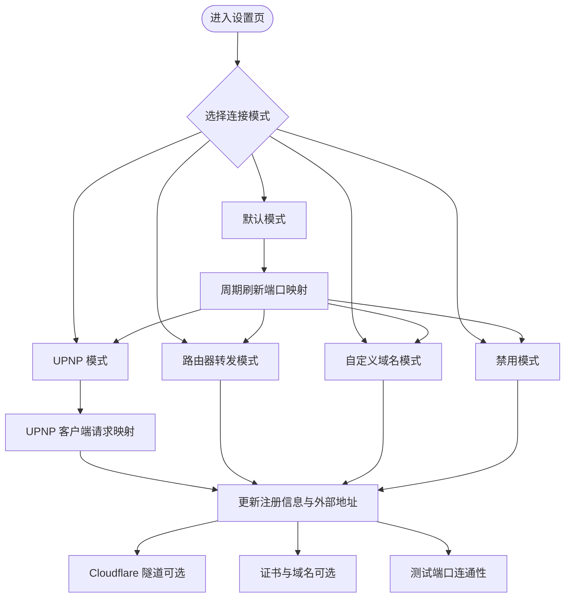
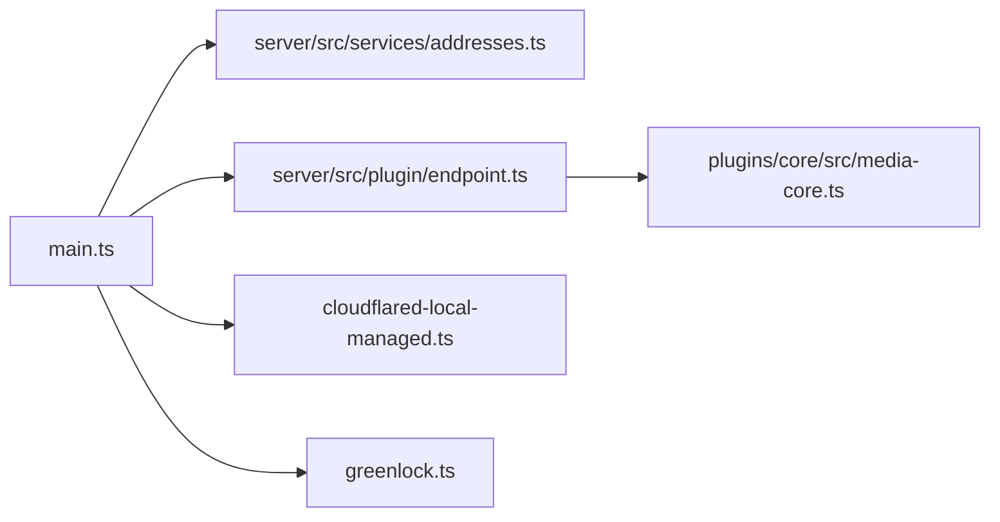

# 远程访问模式

<cite>
**本文引用的文件**
- [plugins/cloud/src/main.ts](file://plugins/cloud/src/main.ts)
- [plugins/cloud/src/cloudflared-local-managed.ts](file://plugins/cloud/src/cloudflared-local-managed.ts)
- [plugins/cloud/src/greenlock.ts](file://plugins/cloud/src/greenlock.ts)
- [plugins/cloud/README.md](file://plugins/cloud/README.md)
- [install/docker/router/01-scrypted.conf](file://install/docker/router/01-scrypted.conf)
- [server/src/services/addresses.ts](file://server/src/services/addresses.ts)
- [server/src/plugin/endpoint.ts](file://server/src/plugin/endpoint.ts)
- [plugins/core/src/media-core.ts](file://plugins/core/src/media-core.ts)
- [plugins/diagnostics/README.md](file://plugins/diagnostics/README.md)
</cite>

## 目录
1. [简介](#简介)
2. [项目结构](#项目结构)
3. [核心组件](#核心组件)
4. [架构总览](#架构总览)
5. [详细组件分析](#详细组件分析)
6. [依赖关系分析](#依赖关系分析)
7. [性能与可靠性考量](#性能与可靠性考量)
8. [故障诊断与排错指南](#故障诊断与排错指南)
9. [结论](#结论)
10. [附录](#附录)

## 简介
本指南面向需要为 Scrypted 部署远程访问能力的用户，系统讲解五种“连接模式”的特性、适用场景、配置步骤、网络要求与注意事项，并说明模式切换机制、配置迁移与兼容性考虑。同时给出家庭网络、企业网络与云服务器等不同环境下的推荐配置方案，并提供可操作的故障诊断方法与常见问题解决方案。

## 项目结构
围绕远程访问的核心实现位于 Cloud 插件（@scrypted/cloud），其通过以下关键模块协同工作：
- 远程访问模式与设置项：在插件主程序中定义并驱动
- Cloudflare 隧道管理：本地化隧道创建与运行
- 自动证书与域名支持：通过 Let’s Encrypt/DuckDNS 等流程生成证书
- 地址与端点管理：系统地址、本地/外部地址、端点路径解析
- 路由器与容器网络：防火墙/转发规则与容器网络表

**图表来源**
- [plugins/cloud/src/main.ts](file://plugins/cloud/src/main.ts)
- [plugins/cloud/src/cloudflared-local-managed.ts](file://plugins/cloud/src/cloudflared-local-managed.ts)
- [plugins/cloud/src/greenlock.ts](file://plugins/cloud/src/greenlock.ts)
- [plugins/cloud/README.md](file://plugins/cloud/README.md)
- [server/src/services/addresses.ts](file://server/src/services/addresses.ts)
- [server/src/plugin/endpoint.ts](file://server/src/plugin/endpoint.ts)
- [plugins/core/src/media-core.ts](file://plugins/core/src/media-core.ts)
- [install/docker/router/01-scrypted.conf](file://install/docker/router/01-scrypted.conf)

**章节来源**
- [plugins/cloud/src/main.ts](file://plugins/cloud/src/main.ts)
- [plugins/cloud/src/cloudflared-local-managed.ts](file://plugins/cloud/src/cloudflared-local-managed.ts)
- [plugins/cloud/src/greenlock.ts](file://plugins/cloud/src/greenlock.ts)
- [plugins/cloud/README.md](file://plugins/cloud/README.md)
- [server/src/services/addresses.ts](file://server/src/services/addresses.ts)
- [server/src/plugin/endpoint.ts](file://server/src/plugin/endpoint.ts)
- [plugins/core/src/media-core.ts](file://plugins/core/src/media-core.ts)
- [install/docker/router/01-scrypted.conf](file://install/docker/router/01-scrypted.conf)

## 核心组件
- 连接模式设置项：定义五种模式（默认、UPNP、路由器转发、自定义域名、禁用）
- UPNP/NAT 端口映射：自动向路由器申请外网端口到内网 HTTPS 端口的映射
- Cloudflare 隧道：可选的公网隧道，支持自定义子域或随机域名
- 自定义域名与证书：通过 DuckDNS/绿盟（Greenlock）等流程获取证书
- 外部地址与端点：根据当前模式动态更新对外可达地址
- 测试端口连通性：内置测试按钮验证从云端到本地的连通性

**章节来源**
- [plugins/cloud/src/main.ts](file://plugins/cloud/src/main.ts)
- [plugins/cloud/src/cloudflared-local-managed.ts](file://plugins/cloud/src/cloudflared-local-managed.ts)
- [plugins/cloud/src/greenlock.ts](file://plugins/cloud/src/greenlock.ts)
- [plugins/cloud/README.md](file://plugins/cloud/README.md)

## 架构总览
下图展示五种模式在系统中的工作流与交互：

**图表来源**
- [plugins/cloud/src/main.ts](file://plugins/cloud/src/main.ts)
- [plugins/cloud/src/cloudflared-local-managed.ts](file://plugins/cloud/src/cloudflared-local-managed.ts)
- [plugins/cloud/src/greenlock.ts](file://plugins/cloud/src/greenlock.ts)

## 详细组件分析

### 默认模式（自动选择最优方案）
- 特点：周期性尝试获取可用的外部地址；优先使用 Cloudflare 隧道或公网 IP；若不可用则回落至禁用模式。
- 适用场景：对网络环境不完全确定、希望系统自动适配的用户。
- 关键行为：
  - 周期性调用端口映射刷新逻辑
  - 若未配置外部地址且未启用隧道，则视为禁用模式
- 注意事项：
  - 首次启动可能需要等待外部地址探测完成
  - 如需强制使用特定模式，建议直接切换到目标模式

**章节来源**
- [plugins/cloud/src/main.ts](file://plugins/cloud/src/main.ts)

### UPNP 模式（适合支持 UPNP 的路由器）
- 特点：通过 UPNP 客户端向路由器申请外网端口到内网 HTTPS 端口的映射。
- 配置步骤：
  1) 在插件设置中选择“UPNP”
  2) 确认路由器已启用 UPNP
  3) 保存后系统会自动尝试映射并更新状态
- 网络要求：
  - 路由器必须支持并启用 UPNP
  - 内网防火墙允许本地 HTTPS 端口
- 注意事项：
  - 若映射失败，检查路由器设置或改用其他模式
  - 状态栏会显示错误提示，按提示排查

**章节来源**
- [plugins/cloud/src/main.ts](file://plugins/cloud/src/main.ts)

### 路由器转发模式（适合静态 IP 或固定端口）
- 特点：手动在路由器上配置端口转发，将外网端口转发到本地 HTTPS 端口。
- 配置步骤：
  1) 在插件设置中设置“From Port”和“Forward Port”
  2) 在路由器上创建端口转发规则，将外网端口映射到服务器内网 IP 的 HTTPS 端口
  3) 在插件中选择“Router Forward”
  4) 保存并重载插件
  5) 使用“测试端口连通性”确认连通
- 网络要求：
  - 路由器支持端口转发
  - 服务器防火墙放行 HTTPS 端口
- 注意事项：
  - “From Port”与“Forward Port”可相同，便于记忆
  - 避免使用被系统占用的端口（如插件自身使用的端口）

**章节来源**
- [plugins/cloud/README.md](file://plugins/cloud/README.md)
- [plugins/cloud/src/main.ts](file://plugins/cloud/src/main.ts)

### 自定义域名模式（适合有公网域名的用户）
- 特点：通过反向代理将域名指向本地 HTTPS 端口，或使用 Cloudflare 隧道提供自定义子域。
- 配置步骤：
  1) 准备公网域名或 Cloudflare 子域
  2) 反向代理将域名流量转发到本地 HTTPS 端口（或启用 Cloudflare 隧道）
  3) 在插件设置中填写“Hostname”，选择“Custom Domain”
  4) 若使用 Cloudflare，可在 Cloudflare 设置中绑定子域并完成授权
- 网络要求：
  - 域名解析到正确出口 IP
  - 反向代理支持 HTTPS 终止（或使用证书）
- 注意事项：
  - 使用 443 端口时必须确保证书有效
  - 若使用 Cloudflare 隧道，可获得随机或自定义子域

**章节来源**
- [plugins/cloud/src/main.ts](file://plugins/cloud/src/main.ts)
- [plugins/cloud/src/cloudflared-local-managed.ts](file://plugins/cloud/src/cloudflared-local-managed.ts)
- [plugins/cloud/src/greenlock.ts](file://plugins/cloud/src/greenlock.ts)
- [plugins/cloud/README.md](file://plugins/cloud/README.md)

### 禁用模式（仅本地网络访问）
- 特点：不暴露到互联网，仅限局域网访问。
- 适用场景：仅在本地网络使用、无需公网访问的场景。
- 注意事项：
  - 云端无法直接访问
  - 如需远程访问，请切换到其他模式

**章节来源**
- [plugins/cloud/src/main.ts](file://plugins/cloud/src/main.ts)

### 模式切换机制、配置迁移与兼容性
- 切换机制：
  - 更改“Connection Mode”后，系统会调度刷新端口映射
  - 不同模式下“From Port/Forward Port”含义不同，UI 会按模式动态显示描述
- 配置迁移：
  - 从“UPNP/路由器转发”迁移到“自定义域名”时，建议先配置好反向代理再切换
  - 从“默认模式”切换到具体模式时，系统会根据当前网络状况进行适配
- 兼容性考虑：
  - 443 端口限制：Cloud 插件不允许直接使用 443，除非配合自定义域名或隧道
  - 隧道与域名冲突：若同时启用隧道与自定义域名，以域名优先
  - 防火墙与路由：确保端口在路由器与主机防火墙均开放

**章节来源**
- [plugins/cloud/src/main.ts](file://plugins/cloud/src/main.ts)

### 不同网络环境下的推荐配置方案
- 家庭网络（普通宽带）
  - 推荐：UPNP 模式（若路由器支持）或“路由器转发模式”
  - 若已有公网域名：自定义域名模式
- 企业网络（严格防火墙）
  - 推荐：路由器转发模式 + 明确的端口策略
  - 若允许公网访问：自定义域名模式 + 反向代理
- 云服务器（弹性 IP/固定公网 IP）
  - 推荐：路由器转发模式（若仍经负载均衡）或自定义域名模式
  - 若使用 Cloudflare：启用隧道并绑定子域

[本节为通用建议，不直接分析具体文件，故无“章节来源”]

### 端口映射与容器/路由器规则
- 容器网络与转发：
  - 容器侧可配置 nftables 规则以支持 SNAT/DNAT 与 FORWARD 链
  - 该规则集用于桥接容器网络与宿主机网络，便于端口转发
- 服务器端地址与端点：
  - 系统维护本地地址列表与外部地址列表，供插件动态更新可达地址

**章节来源**
- [install/docker/router/01-scrypted.conf](file://install/docker/router/01-scrypted.conf)
- [server/src/services/addresses.ts](file://server/src/services/addresses.ts)
- [server/src/plugin/endpoint.ts](file://server/src/plugin/endpoint.ts)

## 依赖关系分析
- Cloud 插件主程序依赖：
  - 系统地址与端点服务：获取本地地址、设置外部地址
  - Cloudflare 隧道客户端：创建与运行隧道
  - 证书管理：通过 Greenlock 获取 DuckDNS 证书
- 端口映射与测试：
  - 通过端点路径与测试接口验证从云端到本地的连通性
- 主机与容器网络：
  - 容器网络规则与主机防火墙共同决定端口可达性

**图表来源**
- [plugins/cloud/src/main.ts](file://plugins/cloud/src/main.ts)
- [plugins/cloud/src/cloudflared-local-managed.ts](file://plugins/cloud/src/cloudflared-local-managed.ts)
- [plugins/cloud/src/greenlock.ts](file://plugins/cloud/src/greenlock.ts)
- [server/src/services/addresses.ts](file://server/src/services/addresses.ts)
- [server/src/plugin/endpoint.ts](file://server/src/plugin/endpoint.ts)
- [plugins/core/src/media-core.ts](file://plugins/core/src/media-core.ts)

**章节来源**
- [plugins/cloud/src/main.ts](file://plugins/cloud/src/main.ts)
- [plugins/cloud/src/cloudflared-local-managed.ts](file://plugins/cloud/src/cloudflared-local-managed.ts)
- [plugins/cloud/src/greenlock.ts](file://plugins/cloud/src/greenlock.ts)
- [server/src/services/addresses.ts](file://server/src/services/addresses.ts)
- [server/src/plugin/endpoint.ts](file://server/src/plugin/endpoint.ts)
- [plugins/core/src/media-core.ts](file://plugins/core/src/media-core.ts)

## 性能与可靠性考量
- 端口映射刷新：
  - 默认每 30 分钟刷新一次，避免长时间无变化导致的过期
- Cloudflare 隧道健康检查：
  - 启动后定期执行健康检查，连续失败达到阈值后自动重启隧道进程
- 外部地址更新：
  - 当域名、隧道或本地地址变化时，及时更新外部可达地址，保证客户端访问稳定

**章节来源**
- [plugins/cloud/src/main.ts](file://plugins/cloud/src/main.ts)

## 故障诊断与排错指南
- 常见问题与解决思路：
  - UPNP 映射失败：检查路由器是否启用 UPNP、端口是否被占用、防火墙是否放行
  - 路由器转发无效：核对路由器规则是否生效、端口是否正确、防火墙策略
  - 自定义域名 443 访问异常：确认证书有效、反向代理正确终止 TLS、域名解析正确
  - 云端无法访问：使用“测试端口连通性”按钮验证，查看日志中的错误提示
- 日志与诊断：
  - 使用诊断插件查看系统日志，定位网络与证书相关问题
  - Cloud 插件控制台会输出登录链接、隧道状态与错误信息
- 快速恢复：
  - 切换到“禁用模式”快速隔离问题
  - 重新启用对应模式并重载插件

**章节来源**
- [plugins/cloud/src/main.ts](file://plugins/cloud/src/main.ts)
- [plugins/cloud/README.md](file://plugins/cloud/README.md)
- [plugins/diagnostics/README.md](file://plugins/diagnostics/README.md)

## 结论
Scrypted 的远程访问模式提供了从自动适配到完全可控的多种方案。通过合理选择模式、正确配置端口映射/反向代理与证书，以及利用内置的健康检查与诊断工具，可以在家庭、企业与云环境下稳定地实现远程访问。建议在生产环境中优先采用“自定义域名模式”或“路由器转发模式”，并结合 Cloudflare 隧道提升可用性与安全性。

## 附录
- 关键术语
  - From Port：路由器外网端口
  - Forward Port：本地 HTTPS 端口
  - 外部地址：可供云端访问的地址集合
  - 隧道：Cloudflare 提供的公网访问通道
- 相关文件索引
  - [plugins/cloud/src/main.ts](file://plugins/cloud/src/main.ts)
  - [plugins/cloud/src/cloudflared-local-managed.ts](file://plugins/cloud/src/cloudflared-local-managed.ts)
  - [plugins/cloud/src/greenlock.ts](file://plugins/cloud/src/greenlock.ts)
  - [plugins/cloud/README.md](file://plugins/cloud/README.md)
  - [install/docker/router/01-scrypted.conf](file://install/docker/router/01-scrypted.conf)
  - [server/src/services/addresses.ts](file://server/src/services/addresses.ts)
  - [server/src/plugin/endpoint.ts](file://server/src/plugin/endpoint.ts)
  - [plugins/core/src/media-core.ts](file://plugins/core/src/media-core.ts)
  - [plugins/diagnostics/README.md](file://plugins/diagnostics/README.md)