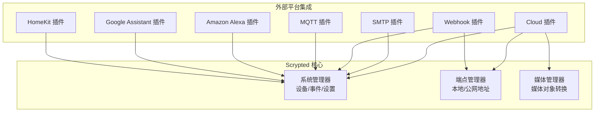
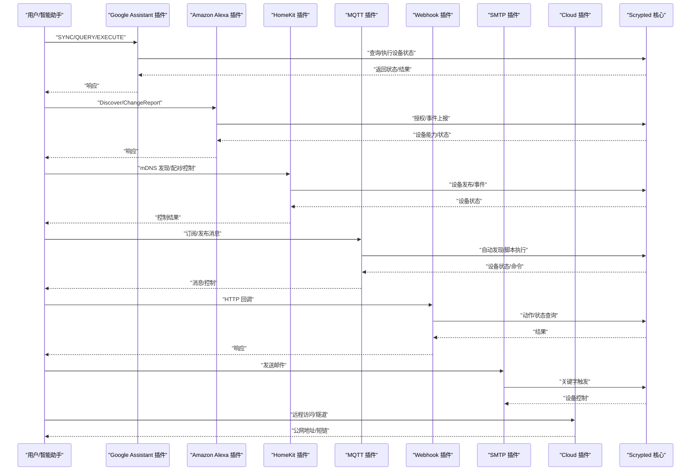
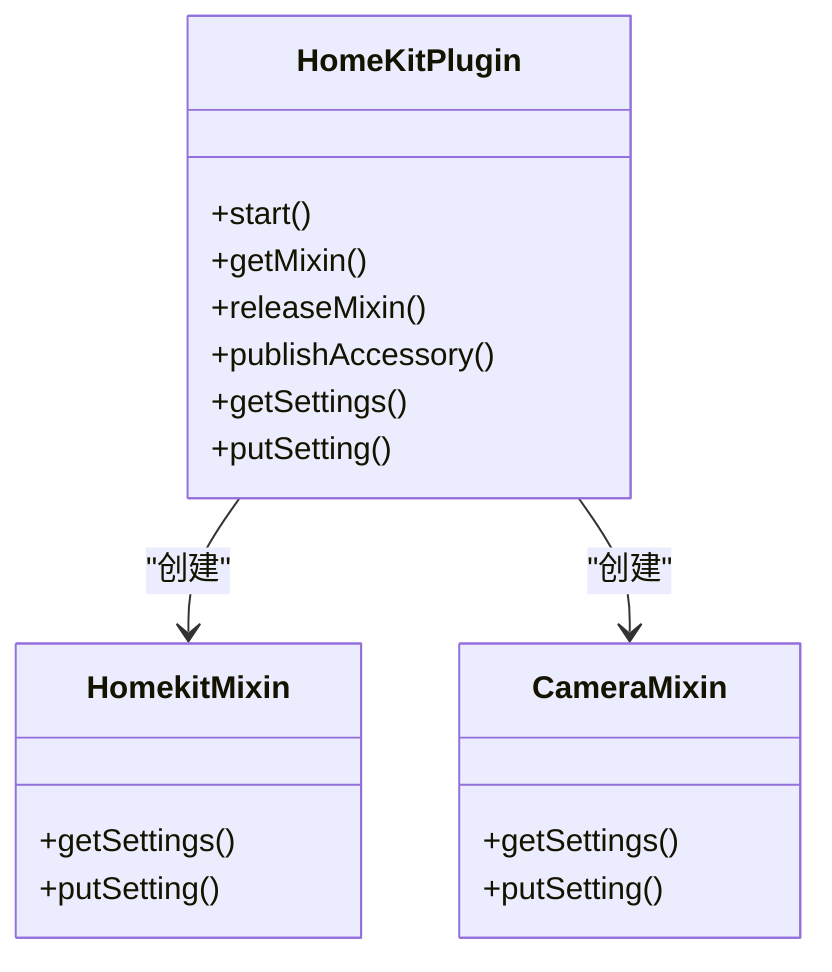
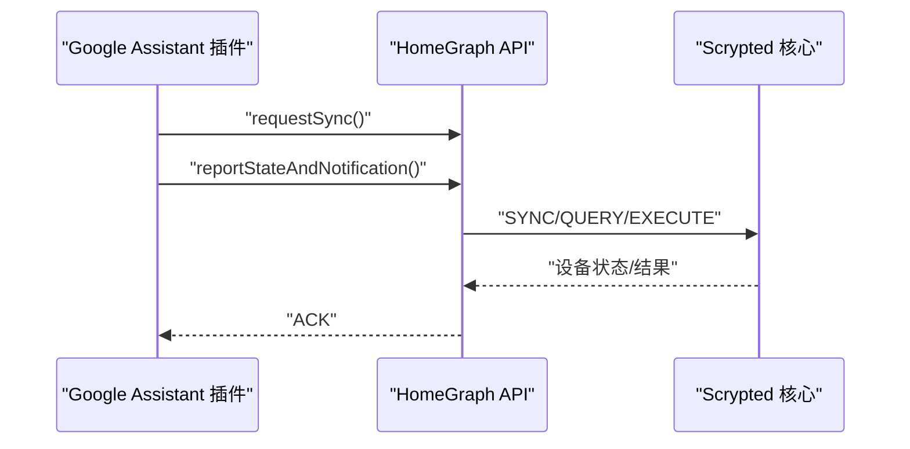
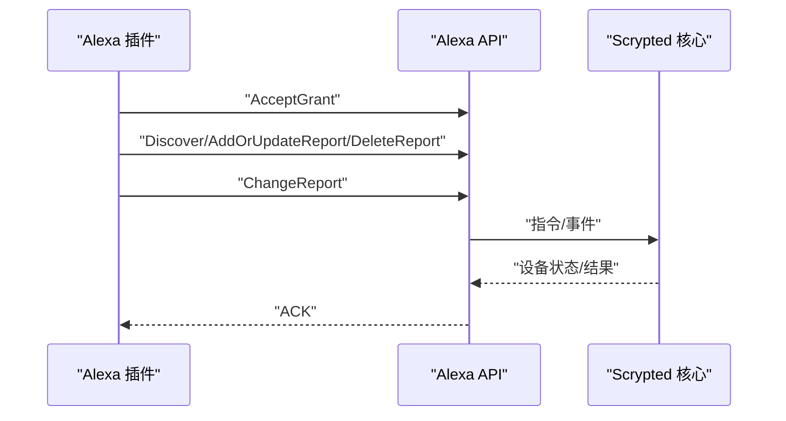
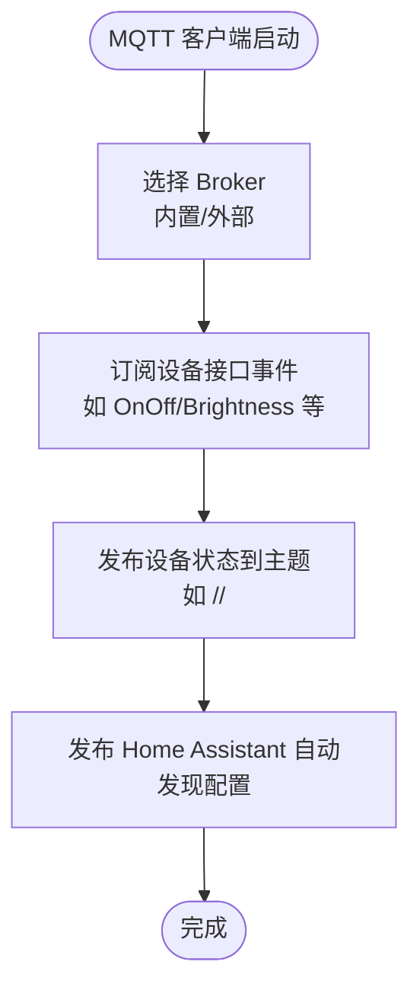
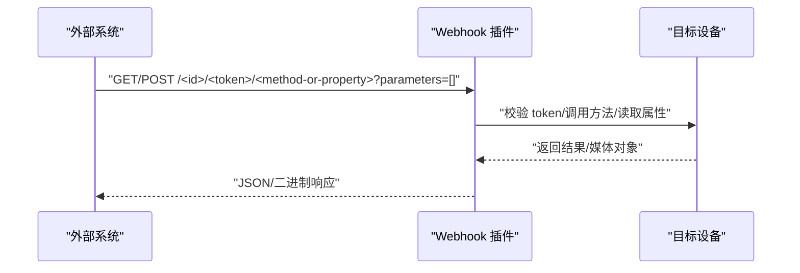
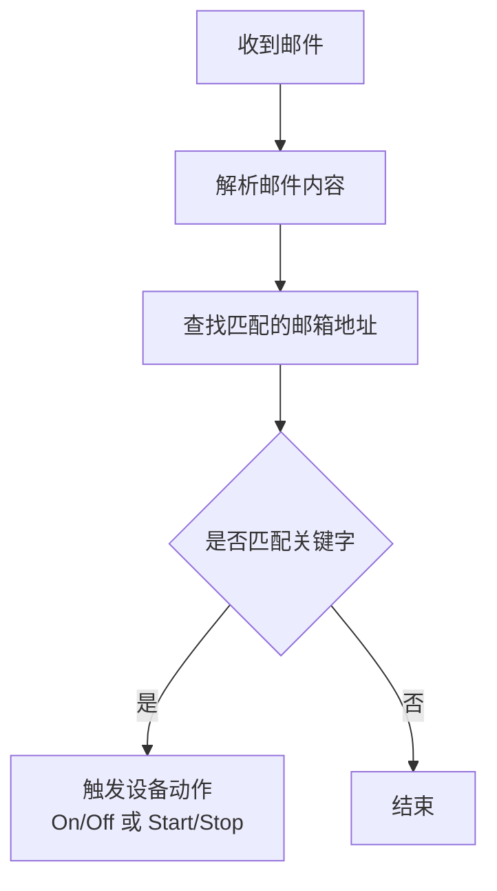
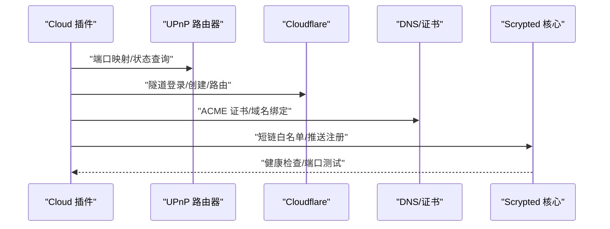
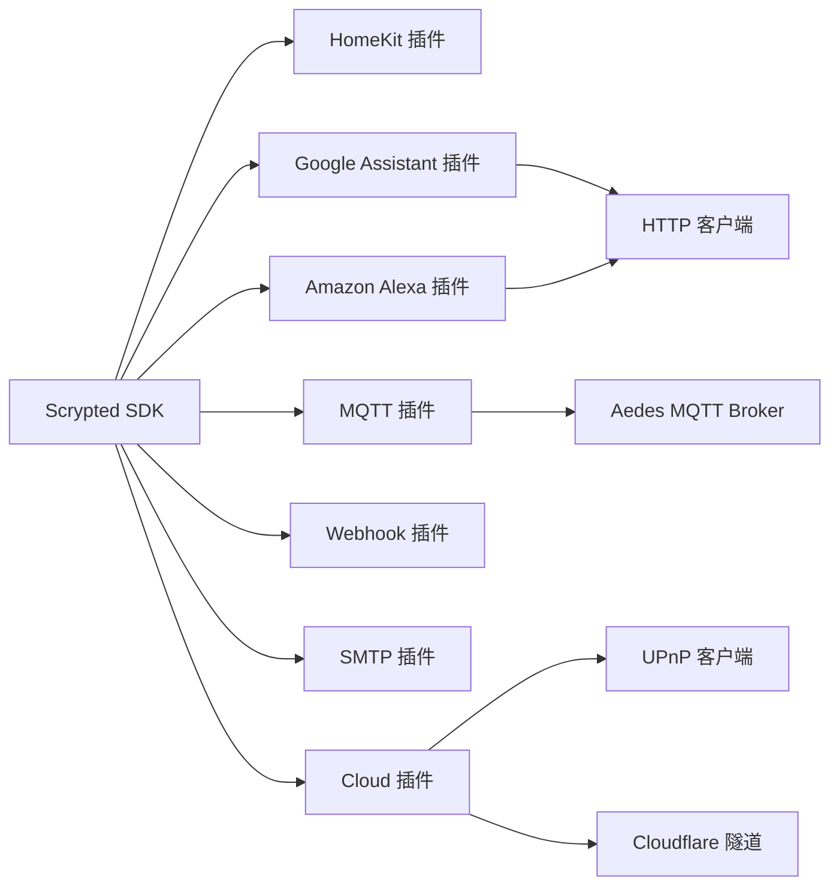

# 外部系统集成

<cite>
**本文引用的文件**
- [plugins/homekit/src/main.ts](file://plugins/homekit/src/main.ts)
- [plugins/google-home/src/main.ts](file://plugins/google-home/src/main.ts)
- [plugins/alexa/src/main.ts](file://plugins/alexa/src/main.ts)
- [plugins/mqtt/src/main.ts](file://plugins/mqtt/src/main.ts)
- [plugins/mqtt/src/autodiscovery.ts](file://plugins/mqtt/src/autodiscovery.ts)
- [plugins/webhook/src/main.ts](file://plugins/webhook/src/main.ts)
- [plugins/smtp/src/main.ts](file://plugins/smtp/src/main.ts)
- [plugins/cloud/src/main.ts](file://plugins/cloud/src/main.ts)
- [plugins/cloud/src/greenlock.ts](file://plugins/cloud/src/greenlock.ts)
- [plugins/cloud/src/cloudflared-local-managed.ts](file://plugins/cloud/src/cloudflared-local-managed.ts)
- [plugins/cloud/src/push.ts](file://plugins/cloud/src/push.ts)
- [plugins/google-home/src/types/index.ts](file://plugins/google-home/src/types/index.ts)
- [plugins/alexa/src/types/index.ts](file://plugins/alexa/src/types/index.ts)
- [plugins/homekit/src/types/index.ts](file://plugins/homekit/src/types/index.ts)
- [plugins/mqtt/fs/examples/button.ts](file://plugins/mqtt/fs/examples/button.ts)
- [plugins/mqtt/fs/examples/motion-sensor.ts](file://plugins/mqtt/fs/examples/motion-sensor.ts)
</cite>

## 目录
1. [简介](#简介)
2. [项目结构](#项目结构)
3. [核心组件](#核心组件)
4. [架构总览](#架构总览)
5. [详细组件分析](#详细组件分析)
6. [依赖关系分析](#依赖关系分析)
7. [性能考量](#性能考量)
8. [故障排除指南](#故障排除指南)
9. [结论](#结论)
10. [附录](#附录)

## 简介
本文件面向 Scrypted 的外部系统集成能力，围绕三大方向展开：主流智能家居平台（HomeKit、Google Assistant、Amazon Alexa）的双向通信机制；云服务集成（NAT 穿透、远程访问、SSL 证书与 DNS 配置）；以及 MQTT 消息总线、Webhook HTTP 回调、SMTP 邮件通知等扩展集成方式。文档同时提供最佳实践与安全建议，并给出排障与监控方法。

## 项目结构
Scrypted 将外部系统集成以“插件”形式组织，每个平台或协议作为独立插件实现。核心目录如下：
- homekit 插件：基于 HAP（HomeKit Accessory Protocol）实现设备发布、mDNS 广播、配对与控制。
- google-home 插件：对接 Google Home Graph API，支持 SYNC/QUERY/EXECUTE/DISCONNECT 请求与本地信令通道。
- alexa 插件：对接 Alexa Smart Home API，支持 Discover/ChangeReport 与 OAuth 授权流程。
- mqtt 插件：内置 Aedes MQTT Broker 或连接外部 Broker，提供自动发现与脚本化设备。
- webhook 插件：为任意设备接口暴露 HTTP 回调端点，支持 GET/POST 动作与状态查询。
- smtp 插件：接收邮件并根据关键字控制设备开关/启停。
- cloud 插件：提供 NAT 穿透、UPnP 转发、Cloudflare 隧道、自签名证书与域名绑定、FCM 推送等云服务能力。

**图表来源**
- [plugins/homekit/src/main.ts:60-487](file://plugins/homekit/src/main.ts#L60-L487)
- [plugins/google-home/src/main.ts:48-650](file://plugins/google-home/src/main.ts#L48-L650)
- [plugins/alexa/src/main.ts:23-736](file://plugins/alexa/src/main.ts#L23-L736)
- [plugins/mqtt/src/main.ts:349-622](file://plugins/mqtt/src/main.ts#L349-L622)
- [plugins/webhook/src/main.ts:95-253](file://plugins/webhook/src/main.ts#L95-L253)
- [plugins/smtp/src/main.ts:74-197](file://plugins/smtp/src/main.ts#L74-L197)
- [plugins/cloud/src/main.ts:36-800](file://plugins/cloud/src/main.ts#L36-L800)

**章节来源**
- [plugins/homekit/src/main.ts:60-487](file://plugins/homekit/src/main.ts#L60-L487)
- [plugins/google-home/src/main.ts:48-650](file://plugins/google-home/src/main.ts#L48-L650)
- [plugins/alexa/src/main.ts:23-736](file://plugins/alexa/src/main.ts#L23-L736)
- [plugins/mqtt/src/main.ts:349-622](file://plugins/mqtt/src/main.ts#L349-L622)
- [plugins/webhook/src/main.ts:95-253](file://plugins/webhook/src/main.ts#L95-L253)
- [plugins/smtp/src/main.ts:74-197](file://plugins/smtp/src/main.ts#L74-L197)
- [plugins/cloud/src/main.ts:36-800](file://plugins/cloud/src/main.ts#L36-L800)

## 核心组件
- HomeKit 插件：通过 HAP 发布 Accessory/Bridge，支持 mDNS 广播、QR 配对码、电池/在线信息注入、摄像头录制回放等。
- Google Assistant 插件：实现 HomeGraph SYNC/QUERY/EXECUTE/DISCONNECT，支持本地信令通道与浏览器 RTCC，具备请求节流与同步队列。
- Amazon Alexa 插件：实现 Discover/ChangeReport，支持多区域端点、OAuth 授权、令牌刷新与设备事件上报。
- MQTT 插件：内置 Aedes Broker（TCP/HTTP），支持外部 Broker 连接；提供自动发现（Home Assistant MQTT Discovery）、脚本化设备与 mixin 发布者。
- Webhook 插件：为设备接口暴露 HTTP 端点，支持动作调用与属性查询，带令牌鉴权与媒体对象响应。
- SMTP 插件：内置 SMTP 服务器，按收件地址分发到对应设备，支持关键字触发开/关/启/停。
- Cloud 插件：提供 NAT 穿透（UPnP/路由器转发/Cloudflare 隧道）、自签名证书、域名绑定、FCM 推送、短链白名单与跨域配置。

**章节来源**
- [plugins/homekit/src/main.ts:60-487](file://plugins/homekit/src/main.ts#L60-L487)
- [plugins/google-home/src/main.ts:48-650](file://plugins/google-home/src/main.ts#L48-L650)
- [plugins/alexa/src/main.ts:23-736](file://plugins/alexa/src/main.ts#L23-L736)
- [plugins/mqtt/src/main.ts:349-622](file://plugins/mqtt/src/main.ts#L349-L622)
- [plugins/webhook/src/main.ts:95-253](file://plugins/webhook/src/main.ts#L95-L253)
- [plugins/smtp/src/main.ts:74-197](file://plugins/smtp/src/main.ts#L74-L197)
- [plugins/cloud/src/main.ts:36-800](file://plugins/cloud/src/main.ts#L36-L800)

## 架构总览
下图展示外部系统与 Scrypted 的交互路径，包括本地与云端两种模式：

**图表来源**
- [plugins/google-home/src/main.ts:266-420](file://plugins/google-home/src/main.ts#L266-L420)
- [plugins/alexa/src/main.ts:314-411](file://plugins/alexa/src/main.ts#L314-L411)
- [plugins/homekit/src/main.ts:369-383](file://plugins/homekit/src/main.ts#L369-L383)
- [plugins/mqtt/src/main.ts:246-339](file://plugins/mqtt/src/main.ts#L246-L339)
- [plugins/webhook/src/main.ts:175-208](file://plugins/webhook/src/main.ts#L175-L208)
- [plugins/smtp/src/main.ts:147-160](file://plugins/smtp/src/main.ts#L147-L160)
- [plugins/cloud/src/main.ts:688-712](file://plugins/cloud/src/main.ts#L688-L712)

## 详细组件分析

### HomeKit 集成
- 设备发布与配对
  - 使用 HAP Storage 与 ControllerStorage 实现持久化与配对状态管理。
  - 支持 Bridge 与 Accessory 两种模式，可为摄像头启用独立 Accessory 模式。
  - mDNS 广播可选择 Ciao/Bonjour/Avahi，支持指定接口与端口。
- 设备类型映射与特性
  - 基于类型映射表支持 Light/Switch/Camera/Doorbell/Lock 等设备类型。
  - 自动注入 Manufacturer/Model/Serial/FirmwareRevision 等信息。
- 在线/电池状态
  - 可选添加 Battery 服务与在线状态服务，提升 HomeKit 兼容性。
- 控制与事件
  - 通过 mixin 为设备提供 HomeKit 特性，监听在线与电池事件并上报。

**图表来源**
- [plugins/homekit/src/main.ts:60-487](file://plugins/homekit/src/main.ts#L60-L487)

**章节来源**
- [plugins/homekit/src/main.ts:60-487](file://plugins/homekit/src/main.ts#L60-L487)

### Google Assistant 集成
- 协议与认证
  - 对接 HomeGraph API，支持 SYNC/QUERY/EXECUTE/DISCONNECT。
  - 本地信令通道通过 WebSocket 与浏览器 RTCC 交互，支持 CORS 白名单。
  - 支持 JWT 与 Scrypted Cloud 推送态/同步。
- 设备类型与能力
  - 类型映射覆盖 Light/Switch/Outlet/Camera/Doorbell/Vacuum/Sensor/Garage/Thermostat/Lock/Fan/Sprinkler 等。
- 状态上报与同步
  - 报告状态采用节流策略，避免频繁上报；同步请求支持批量新设备触发。

**图表来源**
- [plugins/google-home/src/main.ts:516-542](file://plugins/google-home/src/main.ts#L516-L542)
- [plugins/google-home/src/main.ts:266-420](file://plugins/google-home/src/main.ts#L266-L420)

**章节来源**
- [plugins/google-home/src/main.ts:48-650](file://plugins/google-home/src/main.ts#L48-L650)
- [plugins/google-home/src/types/index.ts:1-13](file://plugins/google-home/src/types/index.ts#L1-L13)

### Amazon Alexa 集成
- 协议与授权
  - 实现 AcceptGrant/Discover/ChangeReport，支持多区域端点与 OAuth 刷新。
  - 通过 getAccessToken 获取/刷新令牌，维护 tokenInfo 与 apiEndpoint。
- 设备发现与事件
  - 生成 DiscoveryEndpoint，附加 EndpointHealth 能力；事件上报时附加在线/电池信息。
  - 支持调试模式与设备事件监听。

**图表来源**
- [plugins/alexa/src/main.ts:336-411](file://plugins/alexa/src/main.ts#L336-L411)
- [plugins/alexa/src/main.ts:496-531](file://plugins/alexa/src/main.ts#L496-L531)
- [plugins/alexa/src/main.ts:612-687](file://plugins/alexa/src/main.ts#L612-L687)

**章节来源**
- [plugins/alexa/src/main.ts:23-736](file://plugins/alexa/src/main.ts#L23-L736)
- [plugins/alexa/src/types/index.ts:1-25](file://plugins/alexa/src/types/index.ts#L1-L25)

### MQTT 消息总线
- 内置 Broker 与外部 Broker
  - 可启用 Aedes TCP/HTTP 端口，支持用户名密码认证；也可连接外部 Broker。
  - 设备 mixin 支持订阅/发布，自动将设备属性/接口事件映射为 MQTT 主题。
- 自动发现（Home Assistant）
  - 订阅 homeassistant/status，动态生成传感器/开关/灯等实体配置，支持亮度、色温和 HSV。
  - 提供脚本化设备，允许在 MQTT 主题上直接编写逻辑。
- 示例脚本
  - button.ts：将 ON/OFF 文本映射为二进制状态。
  - motion-sensor.ts：将 ON/OFF 文本映射为运动检测。

**图表来源**
- [plugins/mqtt/src/main.ts:246-339](file://plugins/mqtt/src/main.ts#L246-L339)
- [plugins/mqtt/src/autodiscovery.ts:705-756](file://plugins/mqtt/src/autodiscovery.ts#L705-L756)

**章节来源**
- [plugins/mqtt/src/main.ts:349-622](file://plugins/mqtt/src/main.ts#L349-L622)
- [plugins/mqtt/src/autodiscovery.ts:76-209](file://plugins/mqtt/src/autodiscovery.ts#L76-L209)
- [plugins/mqtt/fs/examples/button.ts:7-13](file://plugins/mqtt/fs/examples/button.ts#L7-L13)
- [plugins/mqtt/fs/examples/motion-sensor.ts:7-13](file://plugins/mqtt/fs/examples/motion-sensor.ts#L7-L13)

### Webhook 集成
- 端点与鉴权
  - 为设备接口暴露 HTTP 端点，路径形如 /endpoint/@scrypted/webhook/<id>/<token>/<method-or-property>。
  - 使用随机 token 鉴权，支持本地/不安全本地/云端端点生成。
- 动作与状态
  - 支持调用设备方法（参数通过 JSON 数组 query 参数传递）与读取属性值。
  - 自动识别媒体对象并返回图片/视频等二进制内容。

**图表来源**
- [plugins/webhook/src/main.ts:110-173](file://plugins/webhook/src/main.ts#L110-L173)
- [plugins/webhook/src/main.ts:175-208](file://plugins/webhook/src/main.ts#L175-L208)

**章节来源**
- [plugins/webhook/src/main.ts:95-253](file://plugins/webhook/src/main.ts#L95-L253)

### SMTP 邮件通知
- 服务器与鉴权
  - 内置 SMTPServer，支持明文端口与禁用 TLS，无需用户名密码即可收信。
- 收件与触发
  - 按收件邮箱地址分发到对应设备 mixin，匹配关键字触发 On/Off 或 Start/Stop。

**图表来源**
- [plugins/smtp/src/main.ts:147-160](file://plugins/smtp/src/main.ts#L147-L160)

**章节来源**
- [plugins/smtp/src/main.ts:74-197](file://plugins/smtp/src/main.ts#L74-L197)

### 云服务集成（NAT 穿透、远程访问、SSL 与 DNS）
- 连接模式
  - 支持 Default/UPNP/Router Forward/Custom Domain/Disabled 等模式。
  - UPnP 自动映射外网端口至内网 HTTPS 端口；路由器转发需手动配置。
- Cloudflare 隧道
  - 支持本地管理隧道（登录、创建、路由 DNS），生成临时/自定义域名。
- SSL 证书与域名
  - 默认自签名证书；支持 DuckDNS ACME 与 Cloudflare 证书；可配置自定义域名。
- 短链与白名单
  - 生成短链并进行用户令牌签名，用于云端访问本地资源。
- 推送与健康检查
  - FCM 推送注册与消息接收；提供端口连通性测试。

**图表来源**
- [plugins/cloud/src/main.ts:475-535](file://plugins/cloud/src/main.ts#L475-L535)
- [plugins/cloud/src/cloudflared-local-managed.ts:116-129](file://plugins/cloud/src/cloudflared-local-managed.ts#L116-L129)
- [plugins/cloud/src/greenlock.ts:10-58](file://plugins/cloud/src/greenlock.ts#L10-L58)
- [plugins/cloud/src/push.ts:11-76](file://plugins/cloud/src/push.ts#L11-L76)

**章节来源**
- [plugins/cloud/src/main.ts:36-800](file://plugins/cloud/src/main.ts#L36-L800)
- [plugins/cloud/src/cloudflared-local-managed.ts:1-129](file://plugins/cloud/src/cloudflared-local-managed.ts#L1-L129)
- [plugins/cloud/src/greenlock.ts:1-58](file://plugins/cloud/src/greenlock.ts#L1-L58)
- [plugins/cloud/src/push.ts:1-76](file://plugins/cloud/src/push.ts#L1-L76)

## 依赖关系分析
- 平台插件依赖 Scrypted SDK 的系统管理器、端点管理器与媒体管理器。
- MQTT 插件依赖 Aedes 与 MQTT 客户端，支持 Home Assistant 自动发现。
- Webhook 插件依赖端点管理器生成公网/本地 URL。
- Cloud 插件依赖 nat-upnp、cloudflared、http-proxy、tls 等模块。
- Google/Amazon 插件依赖 HTTP 客户端与 Google Auth 库。

**图表来源**
- [plugins/mqtt/src/main.ts:349-622](file://plugins/mqtt/src/main.ts#L349-L622)
- [plugins/google-home/src/main.ts:42-44](file://plugins/google-home/src/main.ts#L42-L44)
- [plugins/alexa/src/main.ts:1-14](file://plugins/alexa/src/main.ts#L1-L14)
- [plugins/cloud/src/main.ts:1-27](file://plugins/cloud/src/main.ts#L1-L27)

**章节来源**
- [plugins/mqtt/src/main.ts:349-622](file://plugins/mqtt/src/main.ts#L349-L622)
- [plugins/google-home/src/main.ts:42-44](file://plugins/google-home/src/main.ts#L42-L44)
- [plugins/alexa/src/main.ts:1-14](file://plugins/alexa/src/main.ts#L1-L14)
- [plugins/cloud/src/main.ts:1-27](file://plugins/cloud/src/main.ts#L1-L27)

## 性能考量
- Google Assistant 状态上报采用节流（2 秒窗口），减少网络压力。
- MQTT 自动发现仅在 homeassistant/status 上线时重新发布配置，避免重复。
- Webhook 动作参数通过 JSON 数组传递，建议控制参数大小与频率。
- Cloud 短链白名单与跨域配置需谨慎设置，避免过度放宽导致安全风险。

[本节为通用指导，无需特定文件引用]

## 故障排除指南
- HomeKit
  - 若设备未上线则不会发布，检查在线接口与配对状态；必要时重启插件。
  - mDNS 广播失败可切换广告器（Ciao/Bonjour/Avahi）或指定接口。
- Google Assistant
  - 同步失败或状态异常：检查 JWT 与 Scrypted Cloud 配置；确认本地信令端口可达。
  - 批量新设备触发后延迟同步，等待 10 秒重试。
- Amazon Alexa
  - 授权失败或令牌过期：清理 tokenInfo 后重新授权；检查刷新令牌流程。
  - 设备删除后需上报 DeleteReport，确保已正确上报。
- MQTT
  - 内置 Broker 无法访问：检查 TCP/HTTP 端口与防火墙；确认用户名/密码。
  - 自动发现未生效：确认 homeassistant/status 已上线且 retain 配置正确。
- Webhook
  - 401 无效令牌：核对 mixin 设置中的 token；确保路径完整。
  - 媒体对象未返回：确认设备方法返回媒体对象并检查 Accept 头。
- SMTP
  - 无处理：确认收件地址与 mixin 绑定一致；检查关键字匹配。
- Cloud
  - UPnP 映射失败：检查路由器设置与端口占用；尝试 Router Forward。
  - Cloudflare 隧道：按提示完成登录与路由；确认自定义域名解析。
  - 短链不可用：确认 Cloud 插件已登录并生成有效 token。

**章节来源**
- [plugins/homekit/src/main.ts:316-347](file://plugins/homekit/src/main.ts#L316-L347)
- [plugins/google-home/src/main.ts:488-514](file://plugins/google-home/src/main.ts#L488-L514)
- [plugins/alexa/src/main.ts:276-295](file://plugins/alexa/src/main.ts#L276-L295)
- [plugins/mqtt/src/main.ts:486-520](file://plugins/mqtt/src/main.ts#L486-L520)
- [plugins/webhook/src/main.ts:119-172](file://plugins/webhook/src/main.ts#L119-L172)
- [plugins/smtp/src/main.ts:147-160](file://plugins/smtp/src/main.ts#L147-L160)
- [plugins/cloud/src/main.ts:475-535](file://plugins/cloud/src/main.ts#L475-L535)

## 结论
Scrypted 通过插件化架构实现了与 HomeKit、Google Assistant、Amazon Alexa 的双向通信，结合 MQTT、Webhook、SMTP 等扩展能力，满足家庭自动化与远程访问需求。Cloud 插件进一步提供了 NAT 穿透、隧道与证书管理等企业级功能。合理配置与安全加固（令牌、CORS、白名单）是保障系统稳定与安全的关键。

[本节为总结，无需特定文件引用]

## 附录
- 最佳实践
  - 平台插件：启用自动添加并定期审查设备列表；为摄像头启用独立 Accessory 模式提升稳定性。
  - MQTT：优先使用内置 Broker 便于统一管理；外部 Broker 场景下配置用户名/密码与 TLS。
  - Webhook：为每个设备单独生成 token；限制公网暴露范围，使用本地/不安全本地端点。
  - SMTP：为不同设备设置唯一邮箱地址；严格匹配关键字，避免误触发。
  - Cloud：优先使用 Cloudflare 隧道；自定义域名需配置有效证书；定期测试端口连通性。
- 安全建议
  - 严格控制 CORS 与额外来源；避免在生产环境开启调试日志。
  - 定期轮换 token 与证书；限制短链有效期。
  - 仅在可信网络中启用明文 SMTP/HTTP 端口。

[本节为通用指导，无需特定文件引用]