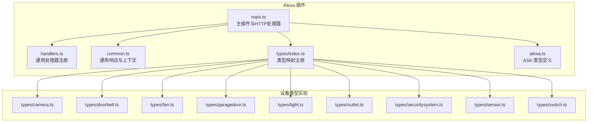
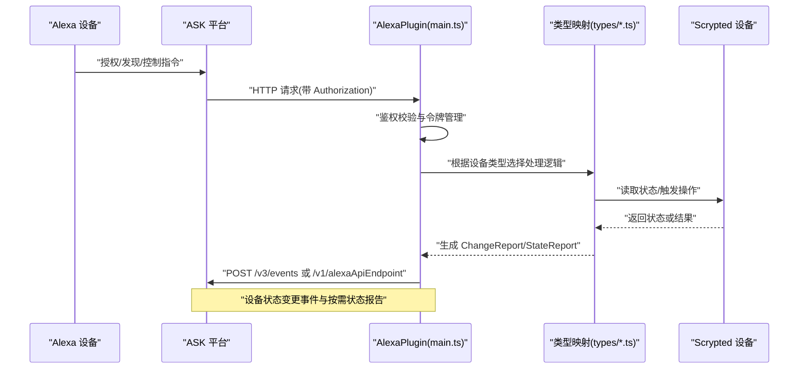
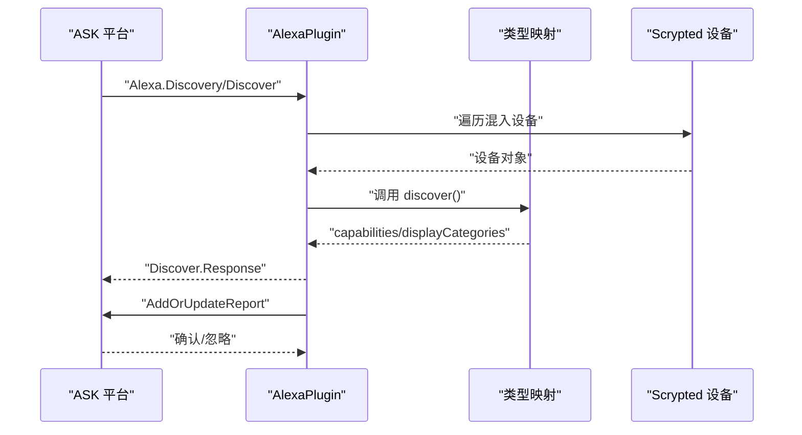
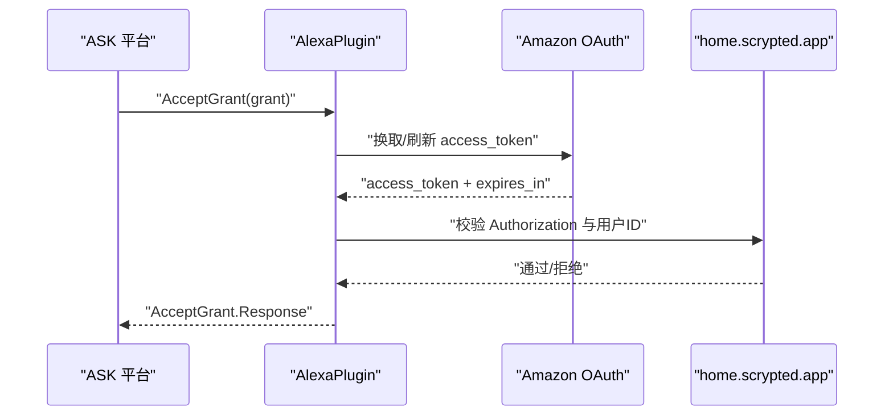
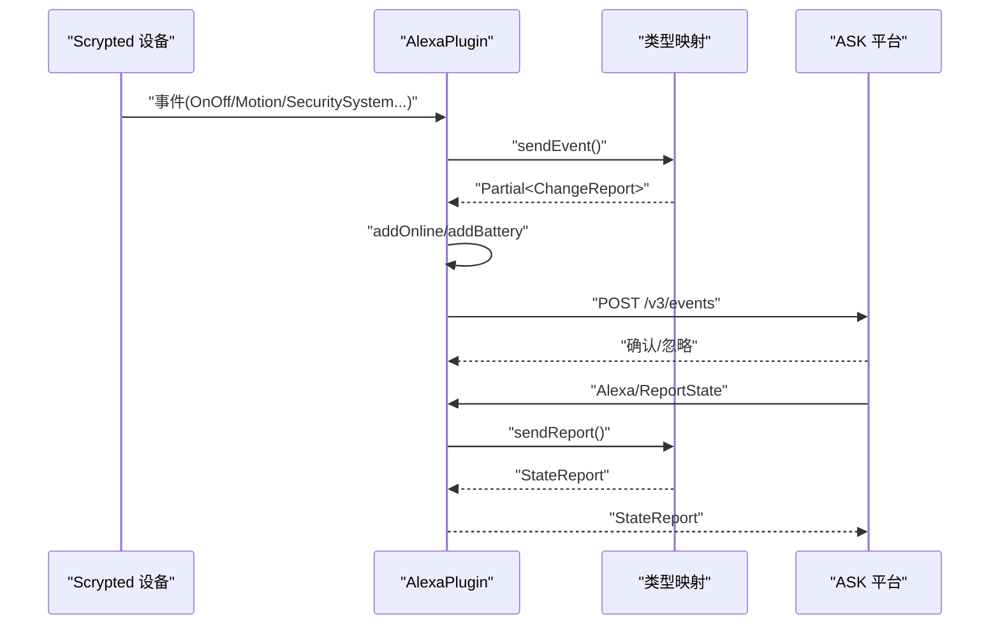
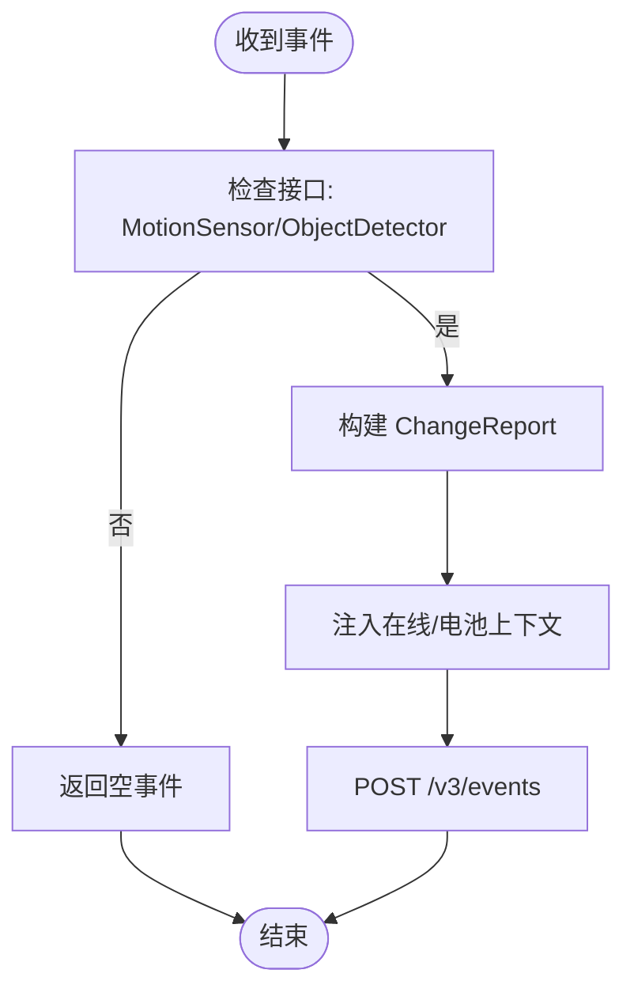
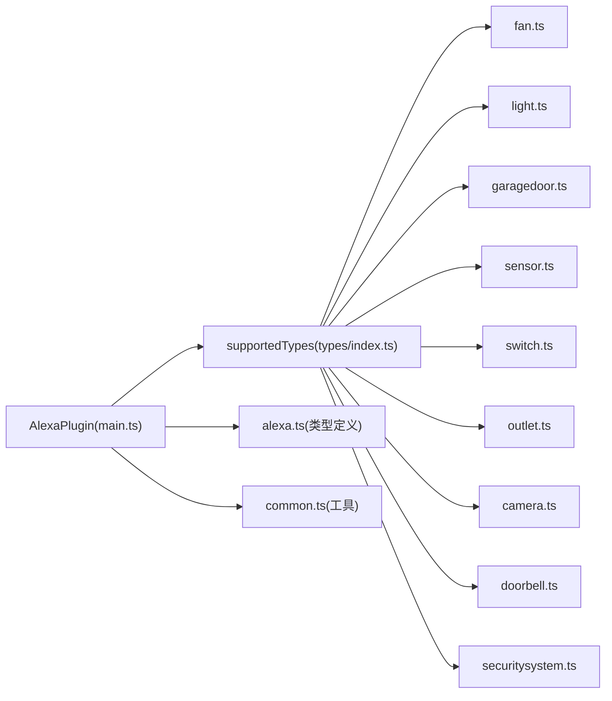

# Alexa 集成

<cite>
**本文引用的文件**
- [main.ts](file://plugins/alexa/src/main.ts)
- [alexa.ts](file://plugins/alexa/src/alexa.ts)
- [handlers.ts](file://plugins/alexa/src/handlers.ts)
- [common.ts](file://plugins/alexa/src/common.ts)
- [types/index.ts](file://plugins/alexa/src/types/index.ts)
- [types/camera.ts](file://plugins/alexa/src/types/camera.ts)
- [types/doorbell.ts](file://plugins/alexa/src/types/doorbell.ts)
- [types/fan.ts](file://plugins/alexa/src/types/fan.ts)
- [types/garagedoor.ts](file://plugins/alexa/src/types/garagedoor.ts)
- [types/light.ts](file://plugins/alexa/src/types/light.ts)
- [types/outlet.ts](file://plugins/alexa/src/types/outlet.ts)
- [types/securitysystem.ts](file://plugins/alexa/src/types/securitysystem.ts)
- [types/sensor.ts](file://plugins/alexa/src/types/sensor.ts)
- [types/switch.ts](file://plugins/alexa/src/types/switch.ts)
</cite>

## 目录
1. [简介](#简介)
2. [项目结构](#项目结构)
3. [核心组件](#核心组件)
4. [架构总览](#架构总览)
5. [详细组件分析](#详细组件分析)
6. [依赖关系分析](#依赖关系分析)
7. [性能考量](#性能考量)
8. [故障排除指南](#故障排除指南)
9. [结论](#结论)
10. [附录](#附录)

## 简介
本文件面向 Scrypted 的 Alexa 集成，系统性阐述 Alexa Skills Kit（ASK）在 Scrypted 中的实现方式与工作机制，覆盖以下主题：
- 设备发现流程：如何向 Alexa 平台上报设备能力与显示类别
- 认证与授权：从 Alexa 授权到本地令牌刷新与失效处理
- 设备状态同步：主动上报与按需状态报告
- 设备类型映射：摄像头、门铃、风扇、车库门、灯泡、插座、安防系统、传感器、开关等
- 语义解析与意图识别：通过 ASK 语义映射与模式控制器实现
- 控制指令转换与事件通知：从 Alexa 指令到 Scrypted 设备接口的转换
- Alexa App 集成与配置建议、故障排除与最佳实践

## 项目结构
Alexa 插件位于 plugins/alexa，核心由以下模块构成：
- 主入口与 HTTP 处理器：负责接收来自 Alexa 的指令、鉴权、设备发现、状态上报与端点同步
- 类型映射：针对不同 Scrypted 设备类型（如 Camera、Light、SecuritySystem 等）定义 discover/sendEvent/sendReport 等行为
- ASK 类型定义：对 Discovery、ChangeReport、StateReport 等进行强类型约束
- 通用工具：错误响应、镜像响应、在线与电池健康上下文注入

**图表来源**
- [main.ts:1-736](file://plugins/alexa/src/main.ts#L1-L736)
- [handlers.ts:1-34](file://plugins/alexa/src/handlers.ts#L1-L34)
- [common.ts:1-131](file://plugins/alexa/src/common.ts#L1-L131)
- [types/index.ts:1-25](file://plugins/alexa/src/types/index.ts#L1-L25)
- [alexa.ts:1-221](file://plugins/alexa/src/alexa.ts#L1-L221)

**章节来源**
- [main.ts:1-736](file://plugins/alexa/src/main.ts#L1-L736)
- [types/index.ts:1-25](file://plugins/alexa/src/types/index.ts#L1-L25)

## 核心组件
- AlexaPlugin：插件主类，实现 MixinProvider 与 HttpRequestHandler，负责：
  - 自动启用混入并监听设备事件
  - 发送设备状态变更事件与按需状态报告
  - 向 Alexa 平台发起设备发现与端点同步
  - 维护与刷新访问令牌，并处理 401/403 失效场景
- 类型映射：通过 supportedTypes 映射 Scrypted 设备类型到 Alexa 能力与事件处理
- ASK 类型：对 Discovery、ChangeReport、StateReport 等进行强类型约束
- 通用工具：统一错误响应、镜像响应、在线与电池健康上下文注入

**章节来源**
- [main.ts:23-138](file://plugins/alexa/src/main.ts#L23-L138)
- [types/index.ts:4-11](file://plugins/alexa/src/types/index.ts#L4-L11)
- [alexa.ts:78-221](file://plugins/alexa/src/alexa.ts#L78-L221)
- [common.ts:4-131](file://plugins/alexa/src/common.ts#L4-L131)

## 架构总览
下图展示 Alexa 插件与 Scrypted 设备、ASK 平台之间的交互路径。

**图表来源**
- [main.ts:612-687](file://plugins/alexa/src/main.ts#L612-L687)
- [handlers.ts:13-34](file://plugins/alexa/src/handlers.ts#L13-L34)
- [types/index.ts:11-25](file://plugins/alexa/src/types/index.ts#L11-L25)

## 详细组件分析

### 设备发现与端点同步
- 插件启动时扫描系统中所有设备，尝试为其启用混入；当设备被添加或移除时，触发端点同步
- 发现流程：
  - onDiscoverEndpoints：收集已混入设备，构建 DiscoveryEndpoint 列表并返回 Discover.Response
  - syncEndpoints：向 Alexa 平台发送 AddOrUpdateReport，完成设备注册
  - deleteEndpoints：设备移除后发送 DeleteReport 清理平台端点
- 端点信息包含 displayCategories 与 capabilities，后者由各类型映射函数生成

**图表来源**
- [main.ts:314-364](file://plugins/alexa/src/main.ts#L314-L364)
- [types/index.ts:5-7](file://plugins/alexa/src/types/index.ts#L5-L7)

**章节来源**
- [main.ts:82-108](file://plugins/alexa/src/main.ts#L82-L108)
- [main.ts:314-364](file://plugins/alexa/src/main.ts#L314-L364)
- [types/index.ts:13-25](file://plugins/alexa/src/types/index.ts#L13-L25)

### 认证与授权机制
- 接收 Alexa.Authorization/AcceptGrant，保存授权码与刷新令牌
- 通过 Amazon OAuth 服务获取/刷新 access_token，并缓存至过期前时间
- 对于 401/403 响应，清除本地 token 以触发重新授权
- 请求入口对接 home.scrypted.app 进行二次鉴权校验，确保配对用户一致

**图表来源**
- [main.ts:496-531](file://plugins/alexa/src/main.ts#L496-L531)
- [main.ts:612-645](file://plugins/alexa/src/main.ts#L612-L645)
- [main.ts:418-494](file://plugins/alexa/src/main.ts#L418-L494)

**章节来源**
- [main.ts:496-531](file://plugins/alexa/src/main.ts#L496-L531)
- [main.ts:612-645](file://plugins/alexa/src/main.ts#L612-L645)
- [main.ts:418-494](file://plugins/alexa/src/main.ts#L418-L494)

### 设备状态同步与事件上报
- 设备事件监听：对混入设备的事件进行过滤与转换，生成 ChangeReport
- 上下文注入：自动注入在线与电池健康属性
- 状态报告：Alexa/ReportState 指令触发按需状态报告
- 错误处理：未匹配的指令返回镜像响应，避免被限流

**图表来源**
- [main.ts:163-220](file://plugins/alexa/src/main.ts#L163-L220)
- [handlers.ts:13-34](file://plugins/alexa/src/handlers.ts#L13-L34)
- [common.ts:8-70](file://plugins/alexa/src/common.ts#L8-L70)

**章节来源**
- [main.ts:163-220](file://plugins/alexa/src/main.ts#L163-L220)
- [handlers.ts:13-34](file://plugins/alexa/src/handlers.ts#L13-L34)
- [common.ts:8-70](file://plugins/alexa/src/common.ts#L8-L70)

### 设备类型映射与能力定义

#### 摄像头（Camera）
- 能力：当具备 RTCSignalingChannel 时，提供摄像头能力；支持运动检测与物体检测事件
- 显示类别：CAMERA
- 事件：MotionSensor/ObjectDetector 事件转换为 ChangeReport；视频门铃同时支持 DoorbellPress

**图表来源**
- [types/camera.ts:18-23](file://plugins/alexa/src/types/camera.ts#L18-L23)
- [types/doorbell.ts:38-62](file://plugins/alexa/src/types/doorbell.ts#L38-L62)

**章节来源**
- [types/camera.ts:1-25](file://plugins/alexa/src/types/camera.ts#L1-L25)
- [types/doorbell.ts:1-64](file://plugins/alexa/src/types/doorbell.ts#L1-L64)

#### 门铃（Doorbell）
- 能力：可选摄像头能力（视频门铃），以及 DoorbellEventSource 事件能力
- 显示类别：优先 CAMERA，再 DOORBELL
- 事件：BinarySensor=true 触发 DoorbellPress

**章节来源**
- [types/doorbell.ts:1-64](file://plugins/alexa/src/types/doorbell.ts#L1-L64)

#### 风扇（Fan）
- 能力：PowerController（powerState）
- 事件：OnOff 变化 -> ChangeReport
- 状态：PowerController.powerState

**章节来源**
- [types/fan.ts:1-72](file://plugins/alexa/src/types/fan.ts#L1-L72)

#### 车库门（GarageDoor）
- 能力：ModeController.GarageDoor.Position（Open/Close）
- 语义映射：将 Open/Lower 与 Raise/Open 映射到 SetMode(Position.Up)，Close/Lower 映射到 SetMode(Position.Down)
- 事件：EntrySensor 变化 -> ChangeReport
- 状态：ModeController.mode

**章节来源**
- [types/garagedoor.ts:1-191](file://plugins/alexa/src/types/garagedoor.ts#L1-L191)

#### 灯泡（Light）
- 能力：PowerController、BrightnessController、ColorTemperatureController、ColorController（按能力存在）
- 事件：OnOff/Brightness/HSV/ColorTemperature 变化 -> ChangeReport
- 状态：多属性聚合到 StateReport

**章节来源**
- [types/light.ts:1-226](file://plugins/alexa/src/types/light.ts#L1-L226)

#### 插座（Outlet）
- 能力：PowerController（powerState）
- 事件：OnOff 变化 -> ChangeReport
- 状态：PowerController.powerState

**章节来源**
- [types/outlet.ts:1-72](file://plugins/alexa/src/types/outlet.ts#L1-L72)

#### 安防系统（SecuritySystem）
- 能力：SecurityPanelController（armState、burglaryAlarm），支持多种布防模式与四数字 PIN 授权
- 事件：mode/triggered 变化 -> ChangeReport
- 状态：armState 与 burglaryAlarm

**章节来源**
- [types/securitysystem.ts:1-180](file://plugins/alexa/src/types/securitysystem.ts#L1-L180)

#### 传感器（Sensor）
- 能力：TemperatureSensor（温度）、ContactSensor（门窗磁）、MotionSensor（人体感应）
- 事件：Thermometer/Motion/EntrySensor 变化 -> ChangeReport
- 状态：三类传感器状态聚合到 StateReport

**章节来源**
- [types/sensor.ts:1-197](file://plugins/alexa/src/types/sensor.ts#L1-L197)

#### 开关（Switch）
- 能力：PowerController（powerState）
- 事件：OnOff 变化 -> ChangeReport
- 状态：PowerController.powerState

**章节来源**
- [types/switch.ts:1-72](file://plugins/alexa/src/types/switch.ts#L1-L72)

### 语义解析、意图识别与槽位提取
- 语义映射：通过 Capability 的 semantics 字段，将 Alexa 动作（如 Open/Lower/Raise）映射到具体指令（如 SetMode）
- 槽位提取：由 Alexa 侧完成，插件侧通过 capability 的 configuration 与 semantics 将自然语言意图映射到具体动作
- 示例：车库门的 ModeController 支持 ordered=false，且通过 actionMappings/stateMappings 将常见表达映射为 SetMode/StateReport

**章节来源**
- [types/garagedoor.ts:82-116](file://plugins/alexa/src/types/garagedoor.ts#L82-L116)

### 设备控制指令转换与事件通知
- 控制入口：插件通过 alexaDeviceHandlers 注册设备级指令处理（如 ReportState）
- 转换机制：根据设备类型与能力，将 Alexa 指令映射到 Scrypted 设备接口（如 openEntry/closeEntry、setBrightness 等）
- 事件通知：设备状态变化通过 sendEvent 生成 ChangeReport 并上报

**章节来源**
- [handlers.ts:13-34](file://plugins/alexa/src/handlers.ts#L13-L34)
- [types/garagedoor.ts:167-189](file://plugins/alexa/src/types/garagedoor.ts#L167-L189)

## 依赖关系分析
- 插件主类依赖类型映射注册表，按设备类型分派 discover/sendEvent/sendReport
- 类型映射依赖 Scrypted 设备接口（OnOff、Brightness、ColorSetting、SecuritySystem 等）
- 事件与状态报告依赖 ASK 类型定义（ChangeReport、StateReport、DiscoveryEndpoint）

**图表来源**
- [types/index.ts:11-25](file://plugins/alexa/src/types/index.ts#L11-L25)
- [main.ts:5-8](file://plugins/alexa/src/main.ts#L5-L8)
- [alexa.ts:178-221](file://plugins/alexa/src/alexa.ts#L178-L221)
- [common.ts:1-131](file://plugins/alexa/src/common.ts#L1-L131)

**章节来源**
- [types/index.ts:11-25](file://plugins/alexa/src/types/index.ts#L11-L25)
- [main.ts:5-8](file://plugins/alexa/src/main.ts#L5-L8)

## 性能考量
- 令牌缓存：access_token 在过期前缓存，减少频繁请求 OAuth 服务
- 事件去噪：仅对受支持的事件接口与设备类型生成 ChangeReport，避免冗余上报
- 批量同步：新增/删除设备时一次性执行 syncEndpoints/deleteEndpoints，降低平台压力
- 端点健康：按需注入在线与电池健康属性，避免无意义上下文

[本节为通用指导，无需“章节来源”]

## 故障排除指南
- 授权失败/401/403：插件会清除本地 token 并提示重新授权；检查 Alexa 授权流程与 home.scrypted.app 校验
- 用户不匹配：若已绑定其他账户，需清空配对密钥后重新配对
- 设备未出现在 Alexa App：确认设备已被混入、已执行端点同步；检查 supportedTypes 是否支持该设备类型
- 事件未上报：检查设备事件是否被过滤（非受支持接口或不在已同步列表中）
- 状态报告为空：确认类型映射的 sendReport 实现是否正确返回上下文

**章节来源**
- [main.ts:290-294](file://plugins/alexa/src/main.ts#L290-L294)
- [main.ts:629-635](file://plugins/alexa/src/main.ts#L629-L635)
- [main.ts:163-190](file://plugins/alexa/src/main.ts#L163-L190)

## 结论
Scrypted 的 Alexa 集成通过类型映射与强类型 ASK 定义，实现了从设备发现、授权、状态同步到控制指令转换的完整链路。借助语义映射与能力配置，插件能够适配多种设备类别并在 Alexa App 中提供一致的用户体验。建议在生产环境中开启调试日志以定位问题，并遵循最小权限与安全最佳实践进行配对与令牌管理。

[本节为总结，无需“章节来源”]

## 附录

### Alexa Skill 开发示例与最佳实践
- 设备发现：确保 discover 返回正确的 displayCategories 与 capabilities；对具备摄像头能力的设备优先声明 CAMERA
- 事件上报：仅对关键事件生成 ChangeReport，避免过度上报；必要时使用 Periodic Poll 与 Physical Interaction 区分
- 语义映射：为复杂设备（如车库门）配置 actionMappings/stateMappings，提升语音交互体验
- 错误处理：对未知指令返回镜像响应，避免直接报错导致限流
- 安全与配对：严格校验 Authorization 与用户 ID；提供清晰的配对提示与重配流程

[本节为通用指导，无需“章节来源”]