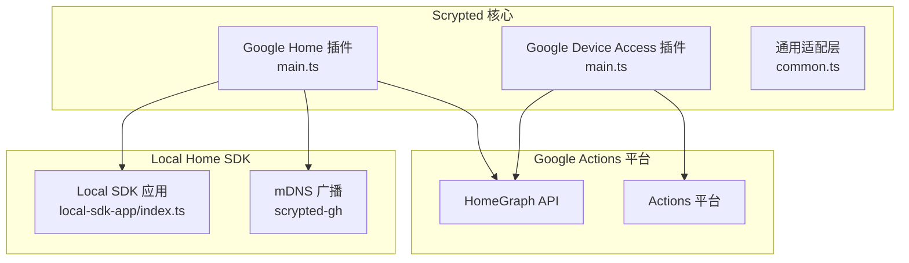
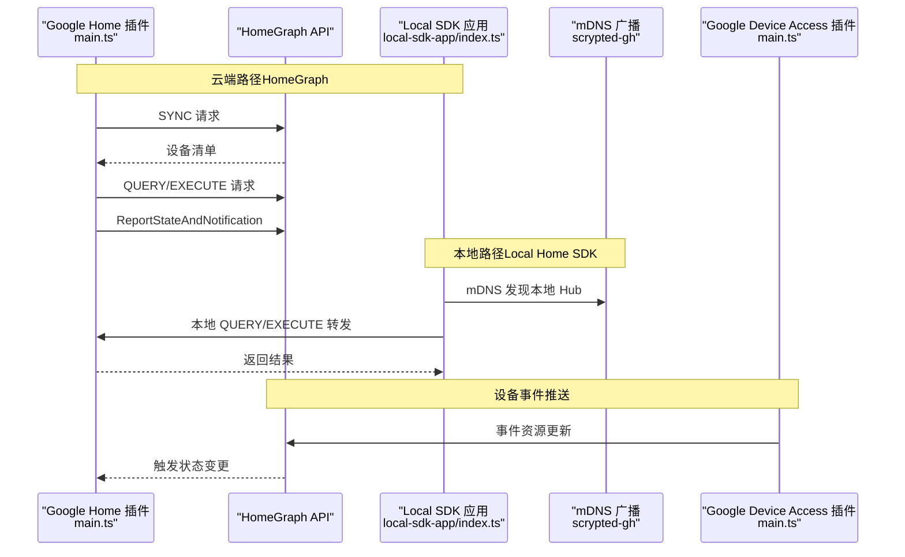
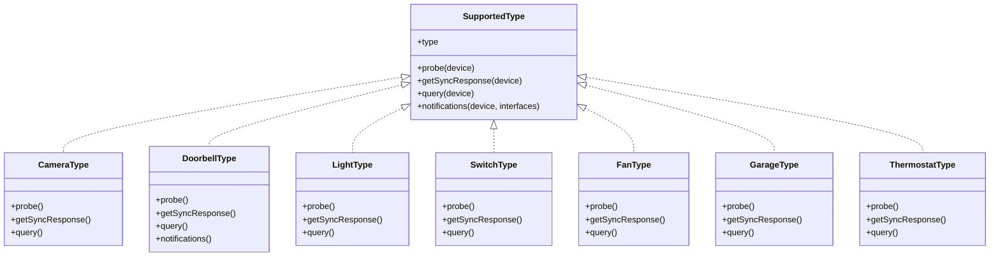
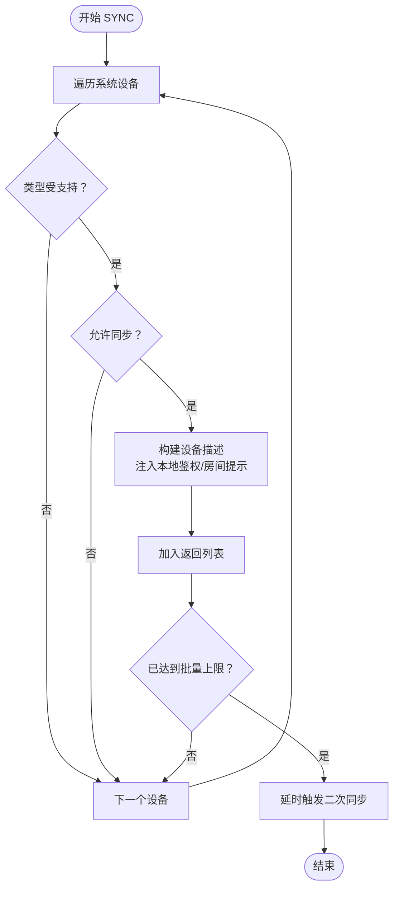
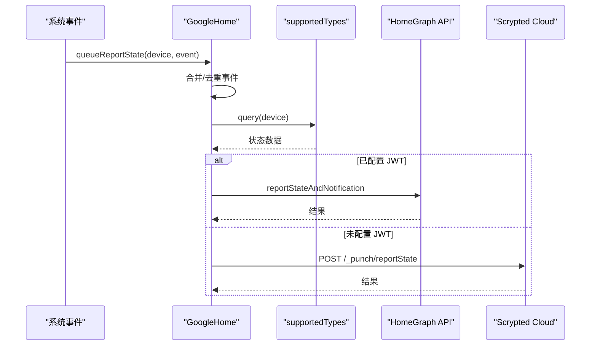
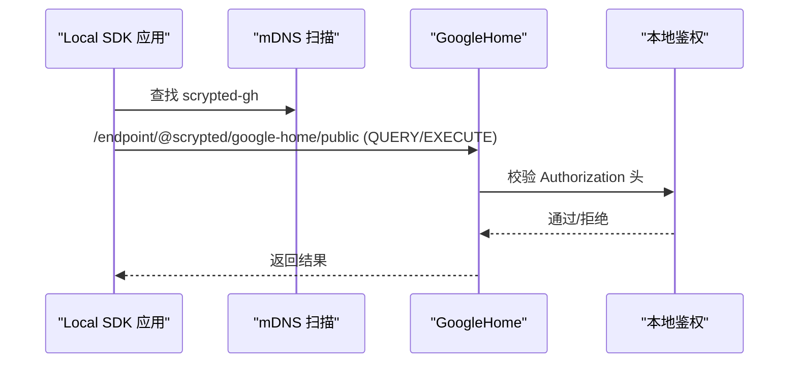
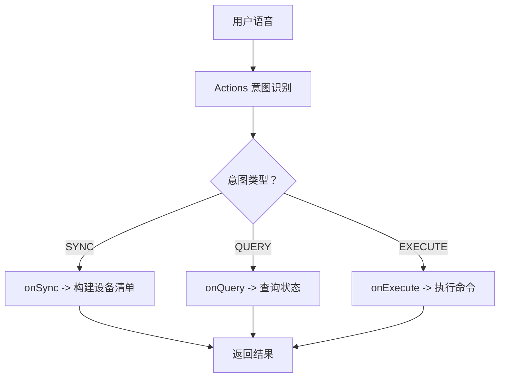
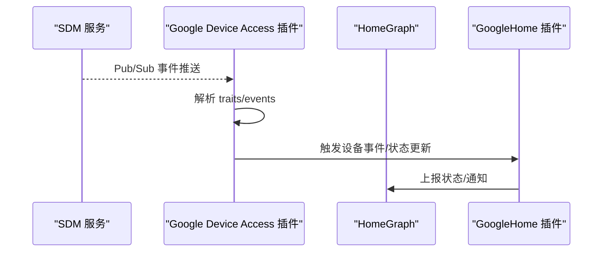
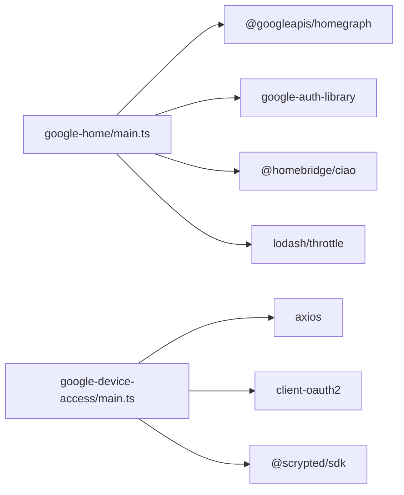

# Google Assistant 集成

<cite>
**本文引用的文件**
- [plugins/google-home/src/main.ts](file://plugins/google-home/src/main.ts)
- [plugins/google-home/src/common.ts](file://plugins/google-home/src/common.ts)
- [plugins/google-home/src/types/camera.ts](file://plugins/google-home/src/types/camera.ts)
- [plugins/google-home/src/types/doorbell.ts](file://plugins/google-home/src/types/doorbell.ts)
- [plugins/google-home/src/types/light.ts](file://plugins/google-home/src/types/light.ts)
- [plugins/google-home/src/types/switch.ts](file://plugins/google-home/src/types/switch.ts)
- [plugins/google-home/src/types/fan.ts](file://plugins/google-home/src/types/fan.ts)
- [plugins/google-home/src/types/garage.ts](file://plugins/google-home/src/types/garage.ts)
- [plugins/google-home/src/types/thermostat.ts](file://plugins/google-home/src/types/thermostat.ts)
- [plugins/google-home/local-sdk-app/index.ts](file://plugins/google-home/local-sdk-app/index.ts)
- [plugins/google-device-access/src/main.ts](file://plugins/google-device-access/src/main.ts)
</cite>

## 目录
1. [简介](#简介)
2. [项目结构](#项目结构)
3. [核心组件](#核心组件)
4. [架构总览](#架构总览)
5. [详细组件分析](#详细组件分析)
6. [依赖分析](#依赖分析)
7. [性能考虑](#性能考虑)
8. [故障排查指南](#故障排查指南)
9. [结论](#结论)
10. [附录：配置与调试](#附录配置与调试)

## 简介
本文件面向 Scrypted 的 Google Assistant 集成，系统性阐述以下内容：
- Google Actions 平台的设备同步机制（SYNC）、设备枚举流程与状态上报策略
- Local Home SDK 的实现原理（设备发现、认证授权、命令处理）
- Google Assistant 的语音命令解析、自然语言处理到设备控制指令的转换过程
- 不同设备类型的映射关系与能力特性（摄像头、门铃、风扇、车库门、灯光、插座、传感器、恒温器等）
- 设备状态管理、事件通知、错误处理与集成配置示例及调试方法

## 项目结构
Scrypted 在 Google Assistant 方向的实现主要由两部分组成：
- Google Home 插件：负责 HomeGraph 同步、查询、执行、状态上报以及 Local Home SDK 的本地代理
- Google Device Access 插件：对接 Google Smart Device Management (SDM)，通过 Pub/Sub 推送事件并提供云侧设备能力

**图表来源**
- [plugins/google-home/src/main.ts:150-170](file://plugins/google-home/src/main.ts#L150-L170)
- [plugins/google-home/local-sdk-app/index.ts:9-38](file://plugins/google-home/local-sdk-app/index.ts#L9-L38)
- [plugins/google-device-access/src/main.ts:540-584](file://plugins/google-device-access/src/main.ts#L540-L584)

**章节来源**
- [plugins/google-home/src/main.ts:1-171](file://plugins/google-home/src/main.ts#L1-L171)
- [plugins/google-home/local-sdk-app/index.ts:1-57](file://plugins/google-home/local-sdk-app/index.ts#L1-L57)
- [plugins/google-device-access/src/main.ts:540-584](file://plugins/google-device-access/src/main.ts#L540-L584)

## 核心组件
- GoogleHome 主类：实现 HttpRequestHandler、EngineIOHandler、MixinProvider、Settings，负责：
  - 设备混入与可见性控制（默认包含/排除策略）
  - HomeGraph SYNC/QUERY/EXECUTE/DISCONNECT 请求处理
  - 状态上报与事件通知（ReportStateAndNotification）
  - Local SDK 本地代理与 mDNS 发布
  - 与 Scrypted Cloud 或 HomeGraph API 进行认证与上报
- supportedTypes 体系：按设备类型注册探测、同步响应、查询与可选通知逻辑
- Local SDK 应用：在本地 Hub 上运行，作为 Google Home 本地代理，转发 QUERY/EXECUTE 到 Scrypted

**章节来源**
- [plugins/google-home/src/main.ts:48-171](file://plugins/google-home/src/main.ts#L48-L171)
- [plugins/google-home/src/common.ts:13-25](file://plugins/google-home/src/common.ts#L13-L25)
- [plugins/google-home/local-sdk-app/index.ts:1-57](file://plugins/google-home/local-sdk-app/index.ts#L1-L57)

## 架构总览
下图展示从 Google Actions 到 Scrypted 的完整链路，包括云端 HomeGraph 与本地 Local SDK 两条路径。

**图表来源**
- [plugins/google-home/src/main.ts:266-308](file://plugins/google-home/src/main.ts#L266-L308)
- [plugins/google-home/src/main.ts:310-361](file://plugins/google-home/src/main.ts#L310-L361)
- [plugins/google-home/src/main.ts:363-420](file://plugins/google-home/src/main.ts#L363-L420)
- [plugins/google-home/src/main.ts:428-514](file://plugins/google-home/src/main.ts#L428-L514)
- [plugins/google-home/local-sdk-app/index.ts:9-38](file://plugins/google-home/local-sdk-app/index.ts#L9-L38)
- [plugins/google-home/src/main.ts:150-170](file://plugins/google-home/src/main.ts#L150-L170)
- [plugins/google-device-access/src/main.ts:605-665](file://plugins/google-device-access/src/main.ts#L605-L665)

## 详细组件分析

### 设备类型映射与能力
- 摄像头（Camera）：支持 CameraStream trait，协议包括 progressive_mp4、webrtc；需要鉴权
- 门铃（Doorbell）：支持 CameraStream 与 ObjectDetection；可上报检测事件
- 灯（Light）：支持 OnOff/Brightness/ColorSetting（HSV/RGB/ColorTemperature）
- 插座（Switch）：支持 OnOff/Brightness
- 风扇（Fan）：支持 OnOff/FanSpeed（仅命令）
- 车库门（Garage）：支持 OpenClose（离散/仅命令/仅查询视接口而定）
- 恒温器（Thermostat）：支持 TemperatureSetting（模式、温度点、单位）

**图表来源**
- [plugins/google-home/src/common.ts:13-25](file://plugins/google-home/src/common.ts#L13-L25)
- [plugins/google-home/src/types/camera.ts:4-30](file://plugins/google-home/src/types/camera.ts#L4-L30)
- [plugins/google-home/src/types/doorbell.ts:6-48](file://plugins/google-home/src/types/doorbell.ts#L6-L48)
- [plugins/google-home/src/types/light.ts:4-62](file://plugins/google-home/src/types/light.ts#L4-L62)
- [plugins/google-home/src/types/switch.ts:4-24](file://plugins/google-home/src/types/switch.ts#L4-L24)
- [plugins/google-home/src/types/fan.ts:4-29](file://plugins/google-home/src/types/fan.ts#L4-L29)
- [plugins/google-home/src/types/garage.ts:4-25](file://plugins/google-home/src/types/garage.ts#L4-L25)
- [plugins/google-home/src/types/thermostat.ts:19-55](file://plugins/google-home/src/types/thermostat.ts#L19-L55)

**章节来源**
- [plugins/google-home/src/common.ts:27-52](file://plugins/google-home/src/common.ts#L27-L52)
- [plugins/google-home/src/types/camera.ts:9-24](file://plugins/google-home/src/types/camera.ts#L9-L24)
- [plugins/google-home/src/types/doorbell.ts:11-27](file://plugins/google-home/src/types/doorbell.ts#L11-L27)
- [plugins/google-home/src/types/light.ts:9-37](file://plugins/google-home/src/types/light.ts#L9-L37)
- [plugins/google-home/src/types/switch.ts:9-15](file://plugins/google-home/src/types/switch.ts#L9-L15)
- [plugins/google-home/src/types/fan.ts:9-21](file://plugins/google-home/src/types/fan.ts#L9-L21)
- [plugins/google-home/src/types/garage.ts:9-18](file://plugins/google-home/src/types/garage.ts#L9-L18)
- [plugins/google-home/src/types/thermostat.ts:24-39](file://plugins/google-home/src/types/thermostat.ts#L24-L39)

### 设备同步机制（HomeGraph SYNC）
- 扫描系统中所有设备，按类型探测是否受支持
- 对每个可同步设备生成 HomeGraph 设备描述，注入本地鉴权信息与房间提示
- 限制首次同步返回设备数量，避免上游失败
- 支持延迟请求二次同步以补齐设备

**图表来源**
- [plugins/google-home/src/main.ts:266-308](file://plugins/google-home/src/main.ts#L266-L308)

**章节来源**
- [plugins/google-home/src/main.ts:266-308](file://plugins/google-home/src/main.ts#L266-L308)

### 设备枚举流程
- 设备混入策略：默认包含新设备，可通过设置或内部标记控制
- 新增/移除设备时触发同步请求
- 设备描述变更（如 id 变化）也会触发同步

**章节来源**
- [plugins/google-home/src/main.ts:181-225](file://plugins/google-home/src/main.ts#L181-L225)
- [plugins/google-home/src/main.ts:118-139](file://plugins/google-home/src/main.ts#L118-L139)

### 状态上报策略（ReportStateAndNotification）
- 基于事件队列合并上报，带节流
- 查询设备当前状态并构造 ReportState 请求
- 若存在通知（如门铃检测），附加通知并设置事件 ID
- 优先使用 HomeGraph API，否则回退到 Scrypted Cloud 提供的上报通道

**图表来源**
- [plugins/google-home/src/main.ts:250-264](file://plugins/google-home/src/main.ts#L250-L264)
- [plugins/google-home/src/main.ts:428-514](file://plugins/google-home/src/main.ts#L428-L514)

**章节来源**
- [plugins/google-home/src/main.ts:428-514](file://plugins/google-home/src/main.ts#L428-L514)

### Local Home SDK 实现（设备发现、认证授权、命令处理）
- 设备发现：通过 mDNS 类型 scrypted-gh 自动发现本地 Hub
- 认证授权：Local SDK 通过本地 Authorization 头与设备 customData 中的 localAuthorization 校验
- 命令处理：Local SDK 将 QUERY/EXECUTE 请求转发至 Scrypted 的 /endpoint/@scrypted/google-home/public，并携带 Authorization 头

**图表来源**
- [plugins/google-home/local-sdk-app/index.ts:9-38](file://plugins/google-home/local-sdk-app/index.ts#L9-L38)
- [plugins/google-home/local-sdk-app/index.ts:58-98](file://plugins/google-home/local-sdk-app/index.ts#L58-L98)
- [plugins/google-home/local-sdk-app/index.ts:99-140](file://plugins/google-home/local-sdk-app/index.ts#L99-L140)
- [plugins/google-home/src/main.ts:584-614](file://plugins/google-home/src/main.ts#L584-L614)

**章节来源**
- [plugins/google-home/local-sdk-app/index.ts:9-38](file://plugins/google-home/local-sdk-app/index.ts#L9-L38)
- [plugins/google-home/local-sdk-app/index.ts:58-98](file://plugins/google-home/local-sdk-app/index.ts#L58-L98)
- [plugins/google-home/local-sdk-app/index.ts:99-140](file://plugins/google-home/local-sdk-app/index.ts#L99-L140)
- [plugins/google-home/src/main.ts:584-614](file://plugins/google-home/src/main.ts#L584-L614)

### 语音命令解析与自然语言处理
- Google Assistant 将用户的自然语言意图转化为 Actions 平台的 SYNC/QUERY/EXECUTE 请求
- GoogleHome 插件根据请求类型分派到对应处理器（onSync/onQuery/onExecute）
- EXECUTE 将命令映射到 supportedTypes 中的命令处理器，最终调用设备接口完成控制

**图表来源**
- [plugins/google-home/src/main.ts:619-632](file://plugins/google-home/src/main.ts#L619-L632)
- [plugins/google-home/src/main.ts:363-420](file://plugins/google-home/src/main.ts#L363-L420)

**章节来源**
- [plugins/google-home/src/main.ts:619-632](file://plugins/google-home/src/main.ts#L619-L632)
- [plugins/google-home/src/main.ts:363-420](file://plugins/google-home/src/main.ts#L363-L420)

### Google Device Access（SDM）事件推送与设备能力
- 通过 OAuth 获取访问令牌，定期刷新设备列表
- 订阅 Pub/Sub 事件，接收资源更新与事件（如运动、人员、门铃）
- 将 SDM 事件映射为 Scrypted 事件（如 BinarySensor、ObjectDetection）
- 支持 WebRTC/RTSP 流媒体会话控制与扩展

**图表来源**
- [plugins/google-device-access/src/main.ts:605-665](file://plugins/google-device-access/src/main.ts#L605-L665)
- [plugins/google-device-access/src/main.ts:579-584](file://plugins/google-device-access/src/main.ts#L579-L584)
- [plugins/google-home/src/main.ts:428-514](file://plugins/google-home/src/main.ts#L428-L514)

**章节来源**
- [plugins/google-device-access/src/main.ts:540-584](file://plugins/google-device-access/src/main.ts#L540-L584)
- [plugins/google-device-access/src/main.ts:605-665](file://plugins/google-device-access/src/main.ts#L605-L665)

## 依赖分析
- GoogleHome 插件依赖：
  - @googleapis/homegraph：HomeGraph API 客户端
  - google-auth-library：JWT/OAuth 认证
  - @homebridge/ciao：mDNS 服务发布
  - lodash/throttle：节流控制
  - @scrypted/sdk：系统事件、设备接口、HTTP/WebSocket 处理
- Google Device Access 插件依赖：
  - client-oauth2：OAuth2 客户端
  - axios：HTTP 请求
  - @scrypted/sdk：设备生命周期、媒体流、事件

**图表来源**
- [plugins/google-home/src/main.ts:1-20](file://plugins/google-home/src/main.ts#L1-L20)
- [plugins/google-device-access/src/main.ts:1-12](file://plugins/google-device-access/src/main.ts#L1-L12)

**章节来源**
- [plugins/google-home/src/main.ts:1-20](file://plugins/google-home/src/main.ts#L1-L20)
- [plugins/google-device-access/src/main.ts:1-12](file://plugins/google-device-access/src/main.ts#L1-L12)

## 性能考虑
- 同步节流：对 requestSync 设置节流，避免频繁触发
- 状态上报合并：基于事件队列合并短时间内的状态变化，降低上报频率
- 设备枚举限流：首次同步限制返回设备数量，后续延时补充
- 本地代理：Local SDK 通过本地端口直连，减少网络往返
- OAuth 刷新：对 SDM 设备列表刷新进行节流，避免频繁拉取

**章节来源**
- [plugins/google-home/src/main.ts:81-84](file://plugins/google-home/src/main.ts#L81-L84)
- [plugins/google-home/src/main.ts:250-264](file://plugins/google-home/src/main.ts#L250-L264)
- [plugins/google-home/src/main.ts:301-305](file://plugins/google-home/src/main.ts#L301-L305)
- [plugins/google-device-access/src/main.ts:579-584](file://plugins/google-device-access/src/main.ts#L579-L584)

## 故障排查指南
- 同步失败
  - 检查设备是否被允许同步（混入策略）
  - 确认 HomeGraph JWT 是否正确配置
  - 首次同步设备过多会被限制，等待延时后二次同步
- 状态不更新
  - 确认事件监听是否生效（queueReportState）
  - 检查 supportedTypes.query 是否抛错
  - 若未配置 JWT，确认 Scrypted Cloud 已安装并提供上报通道
- 本地连接问题
  - 确认 mDNS 类型为 scrypted-gh
  - 校验 Authorization 头与 localAuthorization 一致
  - 检查本地端口与转发路径
- SDM 事件未到达
  - 检查 OAuth 令牌是否过期并自动刷新
  - 确认 Pub/Sub 地址与回调地址正确
  - 查看事件映射（motion/person/chime）是否触发

**章节来源**
- [plugins/google-home/src/main.ts:181-195](file://plugins/google-home/src/main.ts#L181-L195)
- [plugins/google-home/src/main.ts:250-264](file://plugins/google-home/src/main.ts#L250-L264)
- [plugins/google-home/src/main.ts:428-514](file://plugins/google-home/src/main.ts#L428-L514)
- [plugins/google-home/src/main.ts:584-614](file://plugins/google-home/src/main.ts#L584-L614)
- [plugins/google-home/local-sdk-app/index.ts:9-38](file://plugins/google-home/local-sdk-app/index.ts#L9-L38)
- [plugins/google-device-access/src/main.ts:712-732](file://plugins/google-device-access/src/main.ts#L712-L732)
- [plugins/google-device-access/src/main.ts:605-665](file://plugins/google-device-access/src/main.ts#L605-L665)

## 结论
Scrypted 的 Google Assistant 集成通过 HomeGraph 与 Local Home SDK 双通道实现，既满足云端智能中枢的统一管理，也兼顾本地低延迟控制。借助 supportedTypes 体系，可灵活扩展设备类型与能力映射；通过事件驱动的状态上报与节流策略，保证了系统的稳定性与性能。配合 Google Device Access 插件，可进一步打通 SDM 事件与云侧设备生态。

## 附录：配置与调试

### 配置要点
- HomeGraph 认证
  - 在插件设置中配置 JWT（HomeGraph Scope），用于直接上报状态与请求同步
- 本地鉴权
  - 使用 localAuthorization 作为 Local SDK 与本地 Hub 的鉴权头
- 设备混入
  - 默认包含新设备；可通过设置或内部标记控制是否纳入同步
- SDM 集成
  - 配置 Project ID、OAuth Client ID/Secret
  - 在 Google Cloud 中配置 Pub/Sub 回调地址，确保可被外网访问

**章节来源**
- [plugins/google-home/src/main.ts:48-89](file://plugins/google-home/src/main.ts#L48-L89)
- [plugins/google-home/src/main.ts:584-614](file://plugins/google-home/src/main.ts#L584-L614)
- [plugins/google-home/src/main.ts:181-195](file://plugins/google-home/src/main.ts#L181-L195)
- [plugins/google-device-access/src/main.ts:667-702](file://plugins/google-device-access/src/main.ts#L667-L702)

### 调试步骤
- 启用详细日志，观察 SYNC/QUERY/EXECUTE/REPORT 的请求与响应
- 使用浏览器或本地工具验证 /endpoint/@scrypted/google-home/public 的可达性与鉴权
- 在 Local SDK 应用中确认 mDNS 发现与本地端口转发
- 对 SDM 事件，检查 Pub/Sub 回调与事件映射是否正确

**章节来源**
- [plugins/google-home/src/main.ts:544-646](file://plugins/google-home/src/main.ts#L544-L646)
- [plugins/google-home/local-sdk-app/index.ts:58-98](file://plugins/google-home/local-sdk-app/index.ts#L58-L98)
- [plugins/google-device-access/src/main.ts:605-665](file://plugins/google-device-access/src/main.ts#L605-L665)