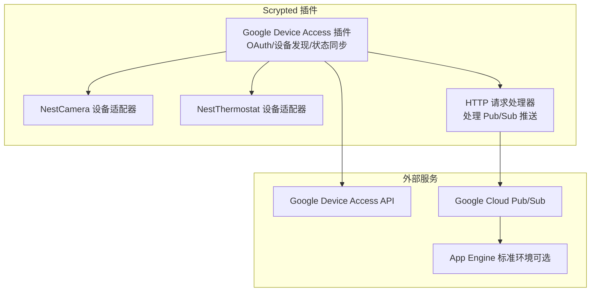
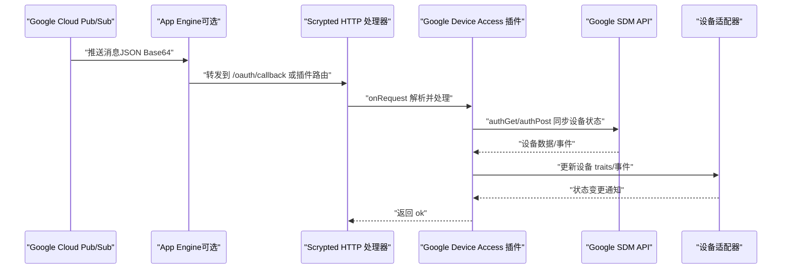
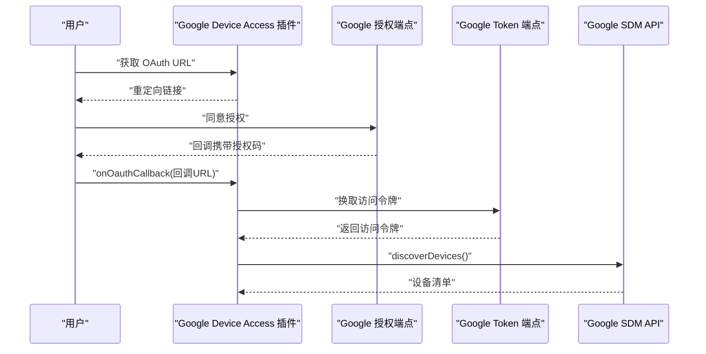
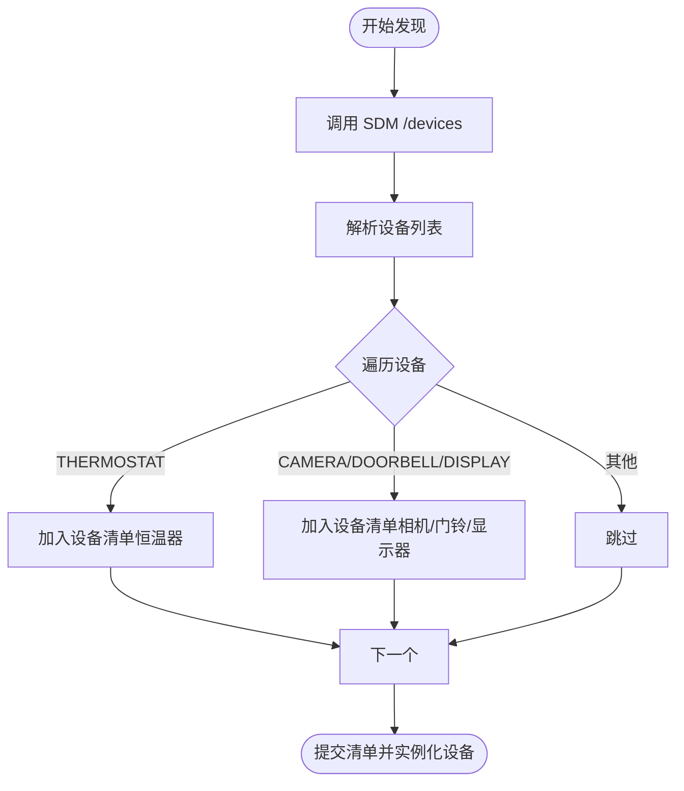
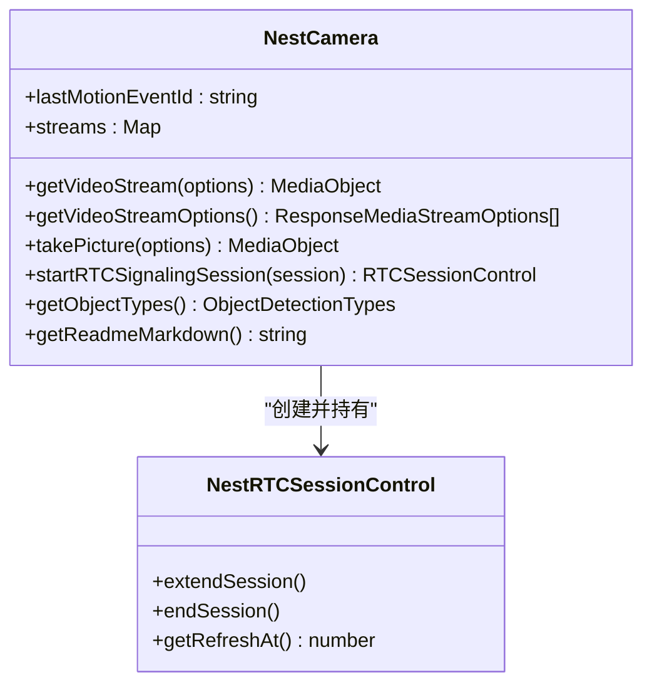
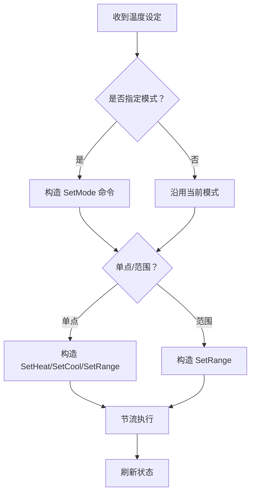
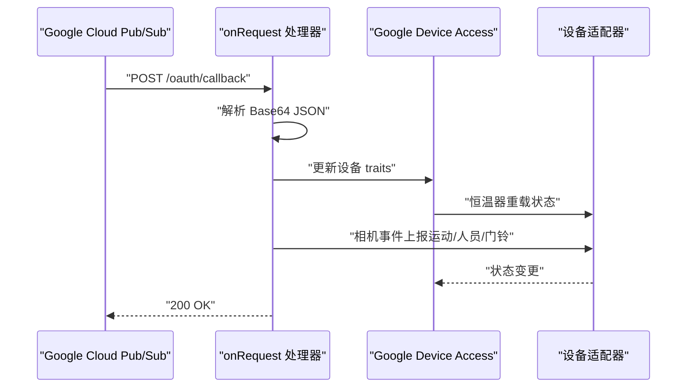
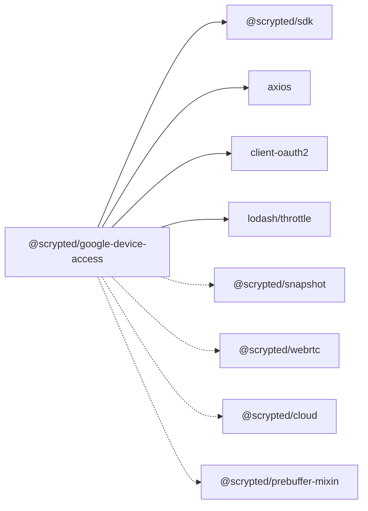

# Google Device Access

<cite>
**本文引用的文件**
- [plugins/google-device-access/src/main.ts](file://plugins/google-device-access/src/main.ts)
- [plugins/google-device-access/README.md](file://plugins/google-device-access/README.md)
- [plugins/google-device-access/fs/README-camera-v1.md](file://plugins/google-device-access/fs/README-camera-v1.md)
- [plugins/google-device-access/fs/README-camera-v2.md](file://plugins/google-device-access/fs/README-camera-v2.md)
- [plugins/google-device-access/pubsub-server/app.yaml](file://plugins/google-device-access/pubsub-server/app.yaml)
- [plugins/google-device-access/pubsub-server/package.json](file://plugins/google-device-access/pubsub-server/package.json)
- [plugins/google-device-access/package.json](file://plugins/google-device-access/package.json)
- [plugins/google-device-access/tsconfig.json](file://plugins/google-device-access/tsconfig.json)
</cite>

## 目录
1. [简介](#简介)
2. [项目结构](#项目结构)
3. [核心组件](#核心组件)
4. [架构总览](#架构总览)
5. [组件详解](#组件详解)
6. [依赖关系分析](#依赖关系分析)
7. [性能与可靠性](#性能与可靠性)
8. [部署与配置指南](#部署与配置指南)
9. [故障排除](#故障排除)
10. [结论](#结论)
11. [附录：完整集成示例步骤](#附录完整集成示例步骤)

## 简介
本文件面向希望在 Scrypted 中集成 Google Device Access（GDA）的开发者与运维人员，系统性解析以下内容：
- Google Device Access API 的实现原理：OAuth 2.0 认证流程、Pub/Sub 消息订阅、设备状态同步机制
- 相机设备的 V1 与 V2 支持差异、设备配置要求、权限管理
- Google Cloud Pub/Sub 服务器的部署与配置、消息格式、事件处理流程
- 设备发现、配对授权、状态上报的技术实现
- GCP 集成配置、防火墙与网络策略、安全注意事项
- 完整的集成示例与常见问题排查

## 项目结构
该插件位于 plugins/google-device-access，核心由三部分组成：
- 主插件实现：负责 OAuth 登录、设备发现、状态同步、媒体流控制
- 相关文档：相机 Gen1/Gen2 使用说明
- Pub/Sub 服务器（可选）：用于接收 GCP Pub/Sub 推送消息并转发到 Scrypted

图表来源
- [plugins/google-device-access/src/main.ts:540-885](file://plugins/google-device-access/src/main.ts#L540-L885)
- [plugins/google-device-access/pubsub-server/app.yaml:15-19](file://plugins/google-device-access/pubsub-server/app.yaml#L15-L19)

章节来源
- [plugins/google-device-access/src/main.ts:1-885](file://plugins/google-device-access/src/main.ts#L1-L885)
- [plugins/google-device-access/README.md:1-112](file://plugins/google-device-access/README.md#L1-L112)

## 核心组件
- OAuth 客户端与登录流程：通过 Google OAuth 2.0 获取访问令牌，刷新令牌并在过期时自动续期
- 设备发现与清单：调用 SDM API 获取设备列表，按类型生成 Scrypted 设备清单
- 设备适配器
  - NestCamera：支持 RTSP 流扩展、WebRTC 信令、事件图片抓取、预缓冲快照
  - NestThermostat：温度设定、模式切换、湿度与温度读数、风扇定时
- HTTP 请求处理器：接收来自 GCP Pub/Sub 的推送，更新设备状态并触发事件上报
- 设置项：Project ID、OAuth 客户端凭据、Pub/Sub 地址

章节来源
- [plugins/google-device-access/src/main.ts:540-885](file://plugins/google-device-access/src/main.ts#L540-L885)
- [plugins/google-device-access/package.json:23-37](file://plugins/google-device-access/package.json#L23-L37)

## 架构总览
下图展示了从 GCP Pub/Sub 到 Scrypted 插件的消息通路，以及设备发现与状态同步的关键交互。

图表来源
- [plugins/google-device-access/src/main.ts:605-665](file://plugins/google-device-access/src/main.ts#L605-L665)
- [plugins/google-device-access/pubsub-server/app.yaml:15-19](file://plugins/google-device-access/pubsub-server/app.yaml#L15-L19)

## 组件详解

### OAuth 2.0 认证与令牌管理
- 凭据来源：插件设置中输入 Project ID、OAuth Client ID、Client Secret；默认值内置以便快速体验
- 授权端点：基于 Project ID 动态拼接授权 URL
- 令牌存储：以 JSON 形式保存在本地存储，启动时加载并检查过期，过期自动刷新
- 回调处理：接收授权码，换取访问令牌，持久化后触发设备发现

图表来源
- [plugins/google-device-access/src/main.ts:738-758](file://plugins/google-device-access/src/main.ts#L738-L758)
- [plugins/google-device-access/src/main.ts:760-778](file://plugins/google-device-access/src/main.ts#L760-L778)

章节来源
- [plugins/google-device-access/src/main.ts:556-577](file://plugins/google-device-access/src/main.ts#L556-L577)
- [plugins/google-device-access/src/main.ts:712-732](file://plugins/google-device-access/src/main.ts#L712-L732)
- [plugins/google-device-access/src/main.ts:738-758](file://plugins/google-device-access/src/main.ts#L738-L758)

### 设备发现与清单生成
- 发现流程：周期性调用 SDM 设备列表接口，合并到本地缓存
- 清单生成：根据设备类型映射到 Scrypted 设备类型与接口集合
  - THERMOSTAT：温度设定、湿度传感器、温度计、开关、设置项
  - CAMERA/DOORBELL/DISPLAY：运动检测、物体检测、说明文档、事件图片或 RTSP/WebRTC
- 设备实例化：首次访问时按 nativeId 创建对应适配器对象

图表来源
- [plugins/google-device-access/src/main.ts:780-862](file://plugins/google-device-access/src/main.ts#L780-L862)

章节来源
- [plugins/google-device-access/src/main.ts:780-862](file://plugins/google-device-access/src/main.ts#L780-L862)

### NestCamera 设备适配器
- 媒体流
  - RTSP：生成/延长 RTSP 流，带刷新时间戳与追踪标识
  - WebRTC：通过信令通道协商 offer/answer，支持会话延长与结束
- 快照与事件图片
  - 若设备具备事件图片能力，则在运动/人员事件发生时抓取最近事件图片
  - 可回退使用预缓冲流生成 JPEG
- 事件上报
  - 运动/人员事件触发运动传感器与物体检测事件
  - 门铃事件触发二进制传感器

图表来源
- [plugins/google-device-access/src/main.ts:134-332](file://plugins/google-device-access/src/main.ts#L134-L332)

章节来源
- [plugins/google-device-access/src/main.ts:134-332](file://plugins/google-device-access/src/main.ts#L134-L332)
- [plugins/google-device-access/fs/README-camera-v1.md:1-8](file://plugins/google-device-access/fs/README-camera-v1.md#L1-L8)
- [plugins/google-device-access/fs/README-camera-v2.md:1-6](file://plugins/google-device-access/fs/README-camera-v2.md#L1-L6)

### NestThermostat 设备适配器
- 状态映射：将 Nest 模式与温度设定映射为 Scrypted 的模式与温度区间
- 写入控制：节流合并命令，先确保模式再设置温度，避免冲突
- 读取刷新：定期从 SDM 拉取最新状态并重载属性

图表来源
- [plugins/google-device-access/src/main.ts:344-538](file://plugins/google-device-access/src/main.ts#L344-L538)

章节来源
- [plugins/google-device-access/src/main.ts:344-538](file://plugins/google-device-access/src/main.ts#L344-L538)

### HTTP 请求处理器与 Pub/Sub 事件处理
- 路由入口：onRequest 接收 GCP Pub/Sub 推送的 JSON（Base64 编码）
- 事件解析：提取 resourceUpdate.trait 与 events 字段
- 状态更新：合并 traits 并针对恒温器重载状态
- 事件上报：运动/人员/门铃事件触发相应传感器与检测事件
- 响应：返回 ok 表示已处理

图表来源
- [plugins/google-device-access/src/main.ts:605-665](file://plugins/google-device-access/src/main.ts#L605-L665)

章节来源
- [plugins/google-device-access/src/main.ts:605-665](file://plugins/google-device-access/src/main.ts#L605-L665)

## 依赖关系分析
- 插件接口与依赖
  - 接口：OauthClient、DeviceProvider、HttpRequestHandler、Settings
  - 依赖：@scrypted/sdk、@scrypted/common、axios、client-oauth2、lodash
  - 插件声明：需要 @scrypted/cloud、@scrypted/prebuffer-mixin 等插件配合
- Pub/Sub 服务器
  - 运行时：Node.js 14（标准环境）
  - 依赖：express、axios、client-oauth2、@google-cloud/datastore（示例）

图表来源
- [plugins/google-device-access/package.json:32-37](file://plugins/google-device-access/package.json#L32-L37)
- [plugins/google-device-access/package.json:39-46](file://plugins/google-device-access/package.json#L39-L46)

章节来源
- [plugins/google-device-access/package.json:23-37](file://plugins/google-device-access/package.json#L23-L37)
- [plugins/google-device-access/package.json:39-46](file://plugins/google-device-access/package.json#L39-L46)
- [plugins/google-device-access/pubsub-server/package.json:19-32](file://plugins/google-device-access/pubsub-server/package.json#L19-L32)

## 性能与可靠性
- 状态拉取节流：设备状态拉取按固定频率节流，避免频繁请求
- 命令节流：恒温器写入命令合并执行，减少 API 调用次数
- 会话生命周期：WebRTC 会话与 RTSP 扩展会话有刷新时间窗口，到期需续期
- 事件时效：事件图片与运动传感器状态有短暂有效期，需及时消费

章节来源
- [plugins/google-device-access/src/main.ts:14-14](file://plugins/google-device-access/src/main.ts#L14-L14)
- [plugins/google-device-access/src/main.ts:351-382](file://plugins/google-device-access/src/main.ts#L351-L382)
- [plugins/google-device-access/src/main.ts:98-132](file://plugins/google-device-access/src/main.ts#L98-L132)
- [plugins/google-device-access/src/main.ts:617-661](file://plugins/google-device-access/src/main.ts#L617-L661)

## 部署与配置指南

### GCP 与 Google Device Access 项目配置
- 创建 OAuth 客户端（Web 应用），授权重定向 URI 包含 Scrypted Cloud 回调地址与 https://www.google.com
- 启用 Smart Device Management API 与 Cloud Pub/Sub API
- 在 Google Device Access 控制台创建项目，记录 Project ID 与 Pub/Sub Topic
- 在 Scrypted 插件设置中填写 Project ID、OAuth Client ID、Client Secret，并登录授权

章节来源
- [plugins/google-device-access/README.md:22-41](file://plugins/google-device-access/README.md#L22-L41)
- [plugins/google-device-access/README.md:42-112](file://plugins/google-device-access/README.md#L42-L112)

### Pub/Sub 推送订阅配置
- 在 GCP Console 创建 Push 订阅，选择之前记录的 Topic
- Endpoint URL 填写来自 Scrypted 插件设置中的“PubSub Address”
- 建议将消息保留时间调整为较短时长，避免积压

章节来源
- [plugins/google-device-access/README.md:102-112](file://plugins/google-device-access/README.md#L102-L112)

### Pub/Sub 服务器部署（可选）
- 运行时：Node.js 14（App Engine 标准环境）
- 基本缩放：最大实例数 1，适合轻量转发场景
- 依赖：express、axios、client-oauth2、@google-cloud/datastore（示例）

章节来源
- [plugins/google-device-access/pubsub-server/app.yaml:15-19](file://plugins/google-device-access/pubsub-server/app.yaml#L15-L19)
- [plugins/google-device-access/pubsub-server/package.json:19-32](file://plugins/google-device-access/pubsub-server/package.json#L19-L32)

### 网络与防火墙
- 公网可达：GCP Pub/Sub 推送需要可达的公网地址
- 端口开放：允许入站 TCP 443（HTTPS）
- 防火墙：仅放行必要的来源 IP 与端口，建议结合 GCP 服务账号与 IAM 控制访问

章节来源
- [plugins/google-device-access/README.md:42-112](file://plugins/google-device-access/README.md#L42-L112)

### 安全注意事项
- 令牌保护：访问令牌与刷新令牌以 JSON 形式保存在本地，注意文件系统权限
- 传输加密：所有与 Google API 的通信均使用 HTTPS
- 最小权限：在 GCP 中为 OAuth 客户端与服务账号授予最小必要权限

章节来源
- [plugins/google-device-access/src/main.ts:712-732](file://plugins/google-device-access/src/main.ts#L712-L732)
- [plugins/google-device-access/src/main.ts:760-778](file://plugins/google-device-access/src/main.ts#L760-L778)

## 故障排除
- 缺少令牌或过期
  - 现象：登录后无法发现设备或报错提示缺失令牌
  - 处理：重新登录授权，确认回调地址正确，检查本地存储中的 token 是否被清空
- Pub/Sub 未收到事件
  - 现象：设备状态不更新、事件无响应
  - 处理：确认订阅已创建且 Endpoint URL 正确；检查 GCP 日志与重试队列；验证 Scrypted 公网可达
- 设备未出现在清单
  - 现象：设备未出现在 Scrypted 设备列表
  - 处理：确认 GDA 项目已授权并选择了相关设备；检查 SDM 返回的设备类型是否受支持
- 相机快照不可用
  - Gen1：若无近期事件，快照可能不可用；启用预缓冲可改善
  - Gen2：不提供快照；启用预缓冲可获得 JPEG
- WebRTC 无法建立
  - 现象：信令失败或不支持 Trickle ICE
  - 处理：确保启用了 WebRTC 协议；检查信令选项与网络连通性

章节来源
- [plugins/google-device-access/src/main.ts:712-732](file://plugins/google-device-access/src/main.ts#L712-L732)
- [plugins/google-device-access/src/main.ts:605-665](file://plugins/google-device-access/src/main.ts#L605-L665)
- [plugins/google-device-access/fs/README-camera-v1.md:1-8](file://plugins/google-device-access/fs/README-camera-v1.md#L1-L8)
- [plugins/google-device-access/fs/README-camera-v2.md:1-6](file://plugins/google-device-access/fs/README-camera-v2.md#L1-L6)

## 结论
本插件通过 OAuth 2.0 与 Google SDM API 实现了对 Nest/Google 设备的统一接入，结合 Pub/Sub 推送完成设备状态实时同步。相机设备同时支持 RTSP 与 WebRTC，恒温器提供精细的温度与模式控制。配合 Scrypted 的插件生态与云端能力，可实现稳定可靠的智能家居设备集成。

## 附录：完整集成示例步骤
- 安装并登录 Scrypted Cloud
- 在 GCP 创建 OAuth 客户端并启用相关 API
- 在 Google Device Access 控制台创建项目并记录 Project ID 与 Topic
- 在 Scrypted 插件设置中填写凭据并登录授权
- 在 GCP 创建 Pub/Sub Push 订阅，Endpoint 填写“PubSub Address”
- 等待设备出现在 Scrypted 并进行功能测试

章节来源
- [plugins/google-device-access/README.md:51-112](file://plugins/google-device-access/README.md#L51-L112)