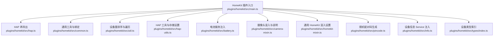
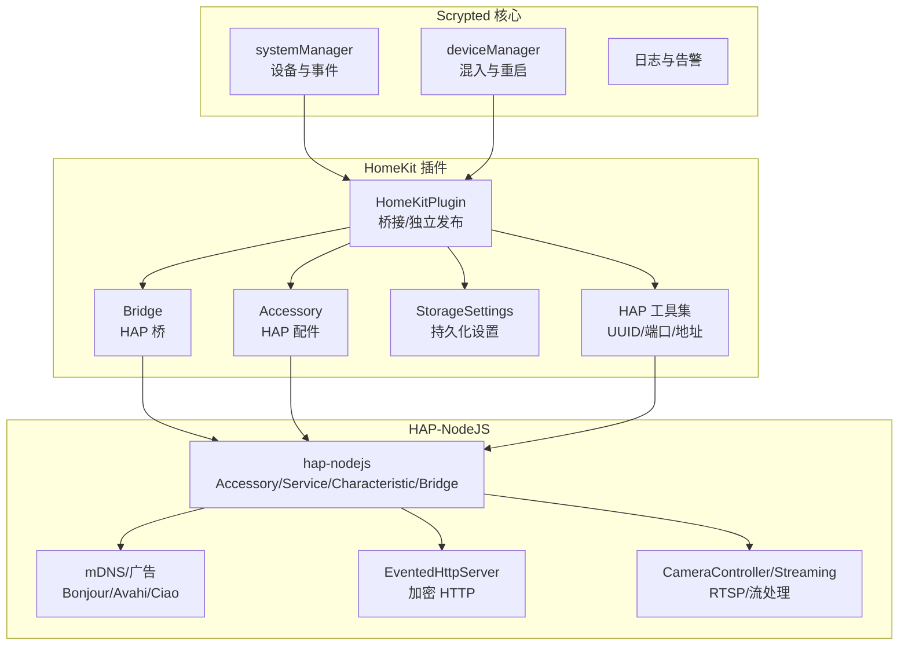
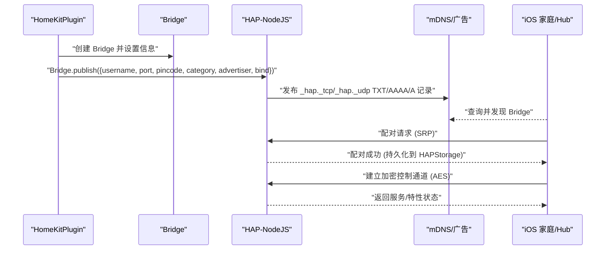
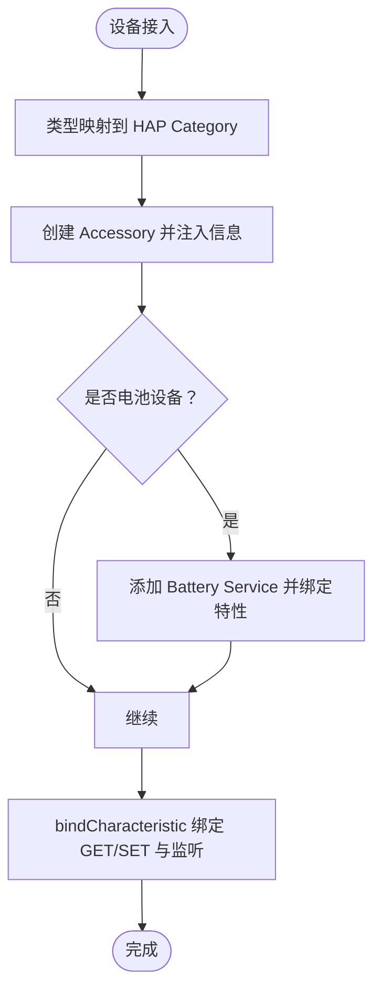
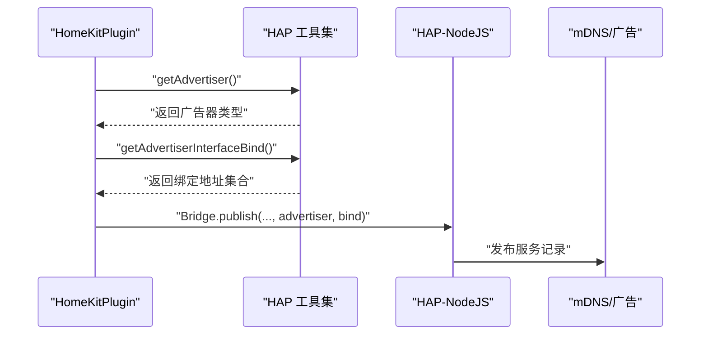
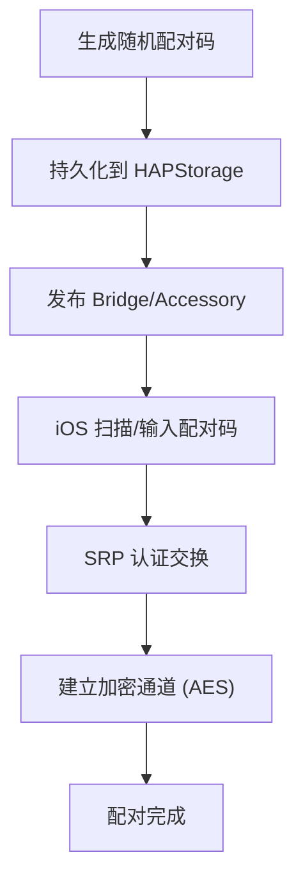
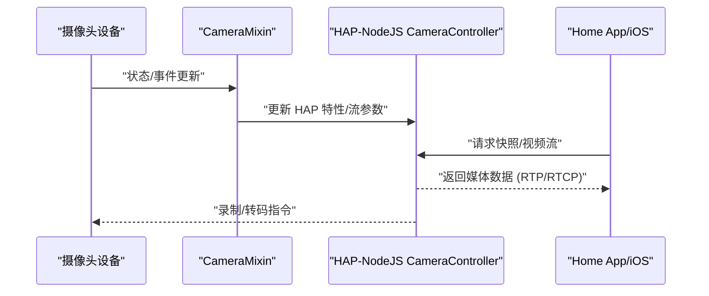
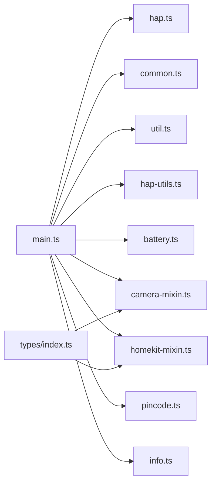

# HomeKit 集成

<cite>
**本文引用的文件**
- [plugins/homekit/src/main.ts](file://plugins/homekit/src/main.ts)
- [plugins/homekit/src/hap.ts](file://plugins/homekit/src/hap.ts)
- [plugins/homekit/src/common.ts](file://plugins/homekit/src/common.ts)
- [plugins/homekit/src/util.ts](file://plugins/homekit/src/util.ts)
- [plugins/homekit/src/hap-utils.ts](file://plugins/homekit/src/hap-utils.ts)
- [plugins/homekit/src/battery.ts](file://plugins/homekit/src/battery.ts)
- [plugins/homekit/src/camera-mixin.ts](file://plugins/homekit/src/camera-mixin.ts)
- [plugins/homekit/src/homekit-mixin.ts](file://plugins/homekit/src/homekit-mixin.ts)
- [plugins/homekit/src/pincode.ts](file://plugins/homekit/src/pincode.ts)
- [plugins/homekit/src/info.ts](file://plugins/homekit/src/info.ts)
- [plugins/homekit/src/types/index.ts](file://plugins/homekit/src/types/index.ts)
- [plugins/homekit/notes/iOS-15.5.md](file://plugins/homekit/notes/iOS-15.5.md)
</cite>

## 目录
1. [简介](#简介)
2. [项目结构](#项目结构)
3. [核心组件](#核心组件)
4. [架构总览](#架构总览)
5. [详细组件分析](#详细组件分析)
6. [依赖关系分析](#依赖关系分析)
7. [性能考虑](#性能考虑)
8. [故障排除指南](#故障排除指南)
9. [结论](#结论)
10. [附录](#附录)

## 简介
本文件面向 Scrypted 的 HomeKit 集成功能，系统性解析 HomeKit Accessory Protocol（HAP）在该项目中的实现方式，涵盖以下主题：
- 基于 HAP-NodeJS 的桥接与独立配件发布、Service/Characteristic 配置与事件绑定
- Bonjour/mDNS 服务发现机制与接口绑定策略
- SRP 认证流程与配对码生成
- AES 加密通信与数据流通道
- 设备类型映射、属性转换与状态同步
- 摄像头集成：RTSP/流处理、录制管理、实时数据流传输
- 电池设备支持、配对流程、存储管理
- 完整的设备配置示例、故障排除与性能优化建议

## 项目结构
HomeKit 插件位于 plugins/homekit，核心入口为 main.ts；通过 types/index.ts 统一导出各类设备类型的适配器；hap.ts 对 hap-nodejs 进行再导出，便于统一引用。

图表来源
- [plugins/homekit/src/main.ts:1-487](file://plugins/homekit/src/main.ts#L1-L487)
- [plugins/homekit/src/hap.ts:1-15](file://plugins/homekit/src/hap.ts#L1-L15)
- [plugins/homekit/src/common.ts:1-49](file://plugins/homekit/src/common.ts#L1-L49)
- [plugins/homekit/src/util.ts:1-57](file://plugins/homekit/src/util.ts#L1-L57)
- [plugins/homekit/src/hap-utils.ts:1-155](file://plugins/homekit/src/hap-utils.ts#L1-L155)
- [plugins/homekit/src/battery.ts:1-20](file://plugins/homekit/src/battery.ts#L1-L20)
- [plugins/homekit/src/camera-mixin.ts:1-153](file://plugins/homekit/src/camera-mixin.ts#L1-L153)
- [plugins/homekit/src/homekit-mixin.ts:1-53](file://plugins/homekit/src/homekit-mixin.ts#L1-L53)
- [plugins/homekit/src/pincode.ts:1-8](file://plugins/homekit/src/pincode.ts#L1-L8)
- [plugins/homekit/src/info.ts:1-19](file://plugins/homekit/src/info.ts#L1-L19)
- [plugins/homekit/src/types/index.ts:1-19](file://plugins/homekit/src/types/index.ts#L1-L19)

章节来源
- [plugins/homekit/src/main.ts:1-487](file://plugins/homekit/src/main.ts#L1-L487)
- [plugins/homekit/src/types/index.ts:1-19](file://plugins/homekit/src/types/index.ts#L1-L19)

## 核心组件
- HomeKitPlugin：插件主类，负责桥接发布、独立配件发布、设备遍历与自动启用、mDNS 广告、连接日志、重启触发等。
- HAP 再导出模块：统一封装 hap-nodejs 的 Accessory、Service、Characteristic、Bridge、Categories、HAPStorage、MDNSAdvertiser 等。
- 通用绑定工具：bindCharacteristic 将 Scrypted 事件映射到 HAP GET/SET，并处理刷新逻辑。
- 设备类型注册：通过 supportedTypes 映射 Scrypted 类型到对应的 Accessory 构造器。
- HAP 工具集：UUID/用户名生成、端口选择、存储设置字典、连接日志、地址选择。
- 电池服务：按需添加电池 Service，同步电量与低电量状态。
- 摄像头混入：提供摄像头专用设置（如 RTP 发送器、调试模式、自动化按钮）、说明文档与性能警告。
- 通用 HomeKit 混入：为任意设备提供配对码、QR 码、端口覆盖、重置配对等设置项。
- 随机配对码：生成符合 HomeKit 规范的 6 位数字分组格式。
- 设备信息注入：将 manufacturer/model/serial/firmware/hardware 注入到 AccessoryInformation Service。

章节来源
- [plugins/homekit/src/main.ts:60-487](file://plugins/homekit/src/main.ts#L60-L487)
- [plugins/homekit/src/hap.ts:1-15](file://plugins/homekit/src/hap.ts#L1-L15)
- [plugins/homekit/src/common.ts:15-49](file://plugins/homekit/src/common.ts#L15-L49)
- [plugins/homekit/src/hap-utils.ts:18-155](file://plugins/homekit/src/hap-utils.ts#L18-L155)
- [plugins/homekit/src/battery.ts:5-20](file://plugins/homekit/src/battery.ts#L5-L20)
- [plugins/homekit/src/camera-mixin.ts:32-153](file://plugins/homekit/src/camera-mixin.ts#L32-L153)
- [plugins/homekit/src/homekit-mixin.ts:8-53](file://plugins/homekit/src/homekit-mixin.ts#L8-L53)
- [plugins/homekit/src/pincode.ts:5-8](file://plugins/homekit/src/pincode.ts#L5-L8)
- [plugins/homekit/src/info.ts:5-19](file://plugins/homekit/src/info.ts#L5-L19)

## 架构总览
下图展示 HomeKit 插件如何与 Scrypted 系统交互，以及与 HAP-NodeJS 的协作关系。

图表来源
- [plugins/homekit/src/main.ts:187-408](file://plugins/homekit/src/main.ts#L187-L408)
- [plugins/homekit/src/hap.ts:1-15](file://plugins/homekit/src/hap.ts#L1-L15)
- [plugins/homekit/src/hap-utils.ts:138-155](file://plugins/homekit/src/hap-utils.ts#L138-L155)

## 详细组件分析

### HAP-NodeJS 使用与桥接发布
- 桥接发布：插件启动时创建 Bridge，设置 Manufacturer/Model/Serial/Firmware 等信息，随后调用 publish 发布到 mDNS。
- 独立配件发布：对于摄像头/门铃等设备，可切换为独立 Accessory 模式，单独生成配对码、QR 码并发布。
- 存储与持久化：通过 HAPStorage.storage 覆盖为 localStorage，确保配对信息、链接材料等持久化。
- 广告器与接口绑定：支持 CIAO、Bonjour、Avahi；接口绑定可选择默认、服务器地址或全部地址。

图表来源
- [plugins/homekit/src/main.ts:369-382](file://plugins/homekit/src/main.ts#L369-L382)
- [plugins/homekit/src/main.ts:439-451](file://plugins/homekit/src/main.ts#L439-L451)
- [plugins/homekit/src/hap-utils.ts:138-155](file://plugins/homekit/src/hap-utils.ts#L138-L155)

章节来源
- [plugins/homekit/src/main.ts:187-408](file://plugins/homekit/src/main.ts#L187-L408)
- [plugins/homekit/src/hap-utils.ts:18-155](file://plugins/homekit/src/hap-utils.ts#L18-L155)

### Accessory、Service 与 Characteristic 配置
- 设备类型到 HAP 类别的映射：通过 typeToCategory 实现摄像头、门铃、风扇、车库门、喷灌、灯泡、门锁、电视、插座、传感器、开关、恒温器、吸尘器等的类别映射。
- 通用绑定：bindCharacteristic 将 Scrypted 接口事件映射到 HAP GET/SET，支持刷新与监听，保证状态同步。
- 设备信息注入：addAccessoryDeviceInfo 将设备制造商、型号、序列号、固件版本、硬件版本注入到 AccessoryInformation Service。
- 电池服务：maybeAddBatteryService 在设备具备电池接口时添加 Battery Service，并同步电量与低电量状态。

图表来源
- [plugins/homekit/src/hap-utils.ts:27-58](file://plugins/homekit/src/hap-utils.ts#L27-L58)
- [plugins/homekit/src/common.ts:27-48](file://plugins/homekit/src/common.ts#L27-L48)
- [plugins/homekit/src/info.ts:5-19](file://plugins/homekit/src/info.ts#L5-L19)
- [plugins/homekit/src/battery.ts:5-20](file://plugins/homekit/src/battery.ts#L5-L20)

章节来源
- [plugins/homekit/src/hap-utils.ts:27-58](file://plugins/homekit/src/hap-utils.ts#L27-L58)
- [plugins/homekit/src/common.ts:15-49](file://plugins/homekit/src/common.ts#L15-L49)
- [plugins/homekit/src/info.ts:5-19](file://plugins/homekit/src/info.ts#L5-L19)
- [plugins/homekit/src/battery.ts:5-20](file://plugins/homekit/src/battery.ts#L5-L20)

### Bonjour 服务发现与接口绑定
- 广告器选择：支持 CIAO、Bonjour、Avahi，默认回退策略由 getAdvertiser 决定。
- 接口绑定：getAdvertiserInterfaceBind 支持默认、服务器地址、全部地址三种策略，用于 mDNS 发布的网络接口选择。
- 连接日志：logConnections 订阅 EventedHTTPServer 的 connection-opened/authenticated 事件，记录已认证客户端地址。

图表来源
- [plugins/homekit/src/main.ts:168-185](file://plugins/homekit/src/main.ts#L168-L185)
- [plugins/homekit/src/main.ts:430-437](file://plugins/homekit/src/main.ts#L430-L437)
- [plugins/homekit/src/hap-utils.ts:138-146](file://plugins/homekit/src/hap-utils.ts#L138-L146)

章节来源
- [plugins/homekit/src/main.ts:168-185](file://plugins/homekit/src/main.ts#L168-L185)
- [plugins/homekit/src/main.ts:430-437](file://plugins/homekit/src/main.ts#L430-L437)
- [plugins/homekit/src/hap-utils.ts:138-146](file://plugins/homekit/src/hap-utils.ts#L138-L146)

### SRP 认证流程与配对码
- 随机配对码：randomPinCode 生成形如 XXXXX-XXX-XXXX 的 6 位数字分组格式。
- 存储设置：createHAPUsernameStorageSettingsDict 提供 mac、pincode、portOverride、qrCode、resetAccessory 等设置项。
- 独立配对：摄像头/门铃等设备可启用独立 Accessory 模式，生成独立配对码与 QR 码。
- 重置配对：resetAccessory 设置允许用户重置配对，触发插件重启以重新发布。

图表来源
- [plugins/homekit/src/pincode.ts:5-8](file://plugins/homekit/src/pincode.ts#L5-L8)
- [plugins/homekit/src/hap-utils.ts:77-136](file://plugins/homekit/src/hap-utils.ts#L77-L136)
- [plugins/homekit/src/main.ts:284-301](file://plugins/homekit/src/main.ts#L284-L301)

章节来源
- [plugins/homekit/src/pincode.ts:5-8](file://plugins/homekit/src/pincode.ts#L5-L8)
- [plugins/homekit/src/hap-utils.ts:77-136](file://plugins/homekit/src/hap-utils.ts#L77-L136)
- [plugins/homekit/src/main.ts:284-301](file://plugins/homekit/src/main.ts#L284-L301)

### AES 加密通信与数据流通道
- 控制通道：HAP-NodeJS 的 EventedHTTPServer 提供基于 SRP 的安全会话与 AES 加密控制通道。
- 数据流通道：CameraController/DataStreamServer 用于视频/音频数据流的发送与接收，结合 RTP/RTCP 与 SRTP（见摄像头相关文件）。
- 连接监控：logConnections 记录已认证连接，便于诊断与审计。

章节来源
- [plugins/homekit/src/hap.ts:8-11](file://plugins/homekit/src/hap.ts#L8-L11)
- [plugins/homekit/src/hap-utils.ts:138-146](file://plugins/homekit/src/hap-utils.ts#L138-L146)

### 设备类型映射、属性转换与状态同步
- 类型映射：typeToCategory 将 Scrypted 设备类型映射到 HAP Categories，确保 Home app 正确显示图标与功能。
- 属性转换：bindCharacteristic 将 Scrypted 接口事件转换为 HAP 特性的 GET/SET，处理刷新与监听，保证状态一致。
- 自动启用：插件启动时根据 supportedTypes 自动为新设备启用 HomeKit 混入，除非显式排除（如 Notifier/Siren）。

章节来源
- [plugins/homekit/src/hap-utils.ts:27-58](file://plugins/homekit/src/hap-utils.ts#L27-L58)
- [plugins/homekit/src/common.ts:27-48](file://plugins/homekit/src/common.ts#L27-L48)
- [plugins/homekit/src/main.ts:219-250](file://plugins/homekit/src/main.ts#L219-L250)

### 摄像头集成：RTSP/流处理、录制管理、实时数据流
- 摄像头混入：CameraMixin 提供摄像头专用设置（RTP 发送器选择、调试模式、状态指示灯），并在说明中强调独立 Accessory 模式的性能优势。
- 性能警告：当摄像头处于 Bridge 模式时发出警告，提示 iOS 15.5+ 会强制通过 Home Hub 转发，导致性能下降。
- 录制管理：通过 VideoClips 提供录制文件与调试模式，配合摄像头类型实现录制管理。
- 流处理：HAP-NodeJS 的 CameraController/Streaming 模块负责 RTSP/流处理与实时数据传输。

图表来源
- [plugins/homekit/src/camera-mixin.ts:32-153](file://plugins/homekit/src/camera-mixin.ts#L32-L153)
- [plugins/homekit/src/hap.ts:9-10](file://plugins/homekit/src/hap.ts#L9-L10)
- [plugins/homekit/src/main.ts:131-144](file://plugins/homekit/src/main.ts#L131-L144)

章节来源
- [plugins/homekit/src/camera-mixin.ts:32-153](file://plugins/homekit/src/camera-mixin.ts#L32-L153)
- [plugins/homekit/src/hap.ts:9-10](file://plugins/homekit/src/hap.ts#L9-L10)
- [plugins/homekit/src/main.ts:131-144](file://plugins/homekit/src/main.ts#L131-L144)

### 电池设备支持与配对流程
- 电池服务：maybeAddBatteryService 在设备具备电池接口时自动添加 Battery Service，并同步电量与低电量状态。
- 配对流程：通过 createHAPUsernameStorageSettingsDict 生成 mac、pincode、portOverride、qrCode、resetAccessory 等设置，支持独立 Accessory 模式下的配对与重置。

章节来源
- [plugins/homekit/src/battery.ts:5-20](file://plugins/homekit/src/battery.ts#L5-L20)
- [plugins/homekit/src/hap-utils.ts:77-136](file://plugins/homekit/src/hap-utils.ts#L77-L136)

### 存储管理与持久化
- HAPStorage 覆盖：插件通过 HAPStorage.storage 将存储实现替换为 localStorage，确保配对信息、链接材料等持久化。
- StorageSettings：为设备与插件提供统一的设置持久化与变更通知机制，支持 onPut/onGet 回调与默认值管理。

章节来源
- [plugins/homekit/src/main.ts:21-54](file://plugins/homekit/src/main.ts#L21-L54)
- [plugins/homekit/src/hap-utils.ts:77-136](file://plugins/homekit/src/hap-utils.ts#L77-L136)

## 依赖关系分析
- 插件入口依赖 HAP 再导出模块与通用工具模块。
- 设备类型注册通过 types/index.ts 导入各类型适配器，形成松耦合扩展点。
- 设备遍历与自动启用依赖 systemManager/deviceManager 事件与存储设置。

图表来源
- [plugins/homekit/src/main.ts:1-60](file://plugins/homekit/src/main.ts#L1-L60)
- [plugins/homekit/src/types/index.ts:1-19](file://plugins/homekit/src/types/index.ts#L1-L19)

章节来源
- [plugins/homekit/src/main.ts:1-60](file://plugins/homekit/src/main.ts#L1-L60)
- [plugins/homekit/src/types/index.ts:1-19](file://plugins/homekit/src/types/index.ts#L1-L19)

## 性能考虑
- 摄像头优先使用独立 Accessory 模式：Bridge 模式下 iOS 15.5+ 会强制通过 Home Hub 转发，导致性能显著下降。CameraMixin 在说明中明确警告并引导用户启用独立模式。
- 端口与广告器：合理选择端口与广告器（CIAO/Bonjour/Avahi）有助于减少网络冲突与提升发现效率。
- 刷新策略：bindCharacteristic 中对 Refresh 接口的处理避免了 HomeKit 主动轮询带来的压力，仅在必要时触发刷新。

章节来源
- [plugins/homekit/src/camera-mixin.ts:41-60](file://plugins/homekit/src/camera-mixin.ts#L41-L60)
- [plugins/homekit/notes/iOS-15.5.md](file://plugins/homekit/notes/iOS-15.5.md)
- [plugins/homekit/src/common.ts:30-38](file://plugins/homekit/src/common.ts#L30-L38)

## 故障排除指南
- 配对失败
  - 检查配对码与 QR 码是否正确生成，确认独立 Accessory 模式下已发布。
  - 查看 logConnections 输出的已认证客户端地址，确认连接来源。
- 摄像头无流或卡顿
  - 启用独立 Accessory 模式，避免 Bridge 强制转发。
  - 在 CameraMixin 设置中调整 RTP 发送器（Scrypted/FFmpeg）与调试模式（转码/录音）。
- 设备未出现在 Home 中
  - 检查 mDNS 广告器与接口绑定设置，确保在目标网络接口上发布。
  - 如需重置配对，使用 resetAccessory 设置并确认插件重启生效。
- 电池设备状态异常
  - 确认设备具备 Battery 接口，检查 Battery Service 是否被正确添加与更新。

章节来源
- [plugins/homekit/src/main.ts:284-301](file://plugins/homekit/src/main.ts#L284-L301)
- [plugins/homekit/src/camera-mixin.ts:85-136](file://plugins/homekit/src/camera-mixin.ts#L85-L136)
- [plugins/homekit/src/hap-utils.ts:138-146](file://plugins/homekit/src/hap-utils.ts#L138-L146)
- [plugins/homekit/src/battery.ts:5-20](file://plugins/homekit/src/battery.ts#L5-L20)

## 结论
Scrypted 的 HomeKit 集成通过 HAP-NodeJS 实现了从设备类型映射、Service/Characteristic 配置、SRP 认证、AES 通信到摄像头流与录制管理的完整链路。插件提供了灵活的桥接与独立配件模式、完善的存储与设置管理、详尽的设备信息注入与电池支持，并针对摄像头性能问题给出了明确的实践建议。通过合理的网络与广告器配置、严格的配对与重置流程，以及对刷新与流处理的优化，可获得稳定可靠的 HomeKit 体验。

## 附录
- 设备类型映射参考：[plugins/homekit/src/hap-utils.ts:27-58](file://plugins/homekit/src/hap-utils.ts#L27-L58)
- 通用绑定工具参考：[plugins/homekit/src/common.ts:27-48](file://plugins/homekit/src/common.ts#L27-L48)
- 摄像头混入设置参考：[plugins/homekit/src/camera-mixin.ts:85-136](file://plugins/homekit/src/camera-mixin.ts#L85-L136)
- 随机配对码生成参考：[plugins/homekit/src/pincode.ts:5-8](file://plugins/homekit/src/pincode.ts#L5-L8)
- 设备信息注入参考：[plugins/homekit/src/info.ts:5-19](file://plugins/homekit/src/info.ts#L5-L19)