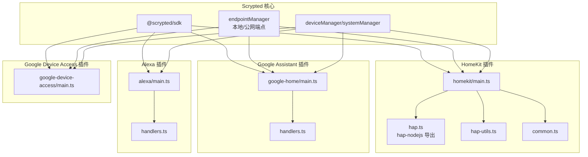
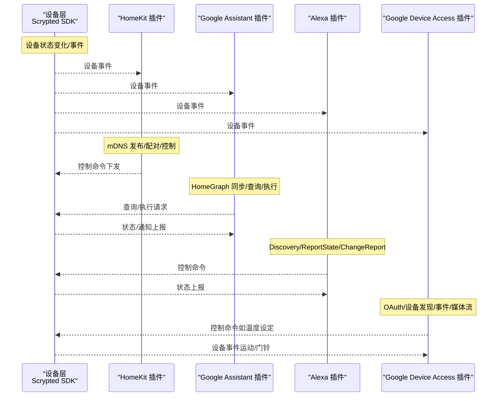
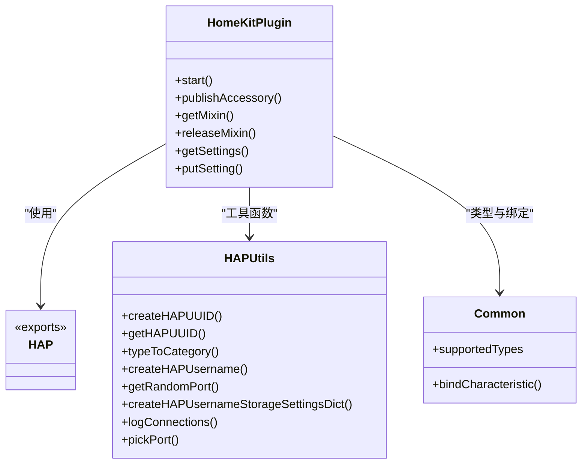
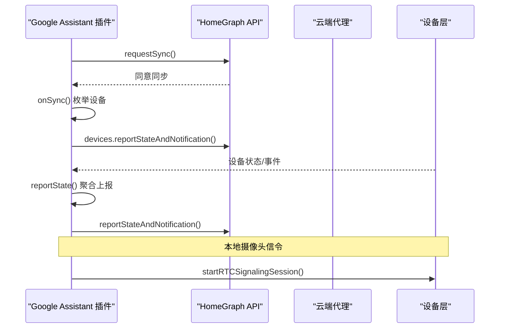
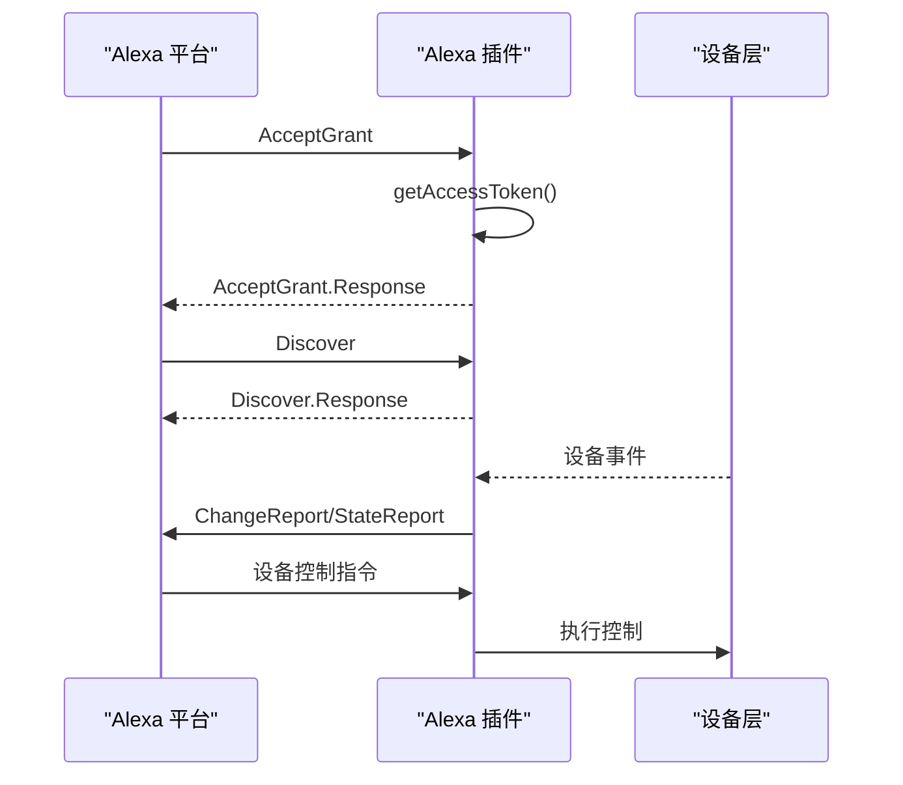
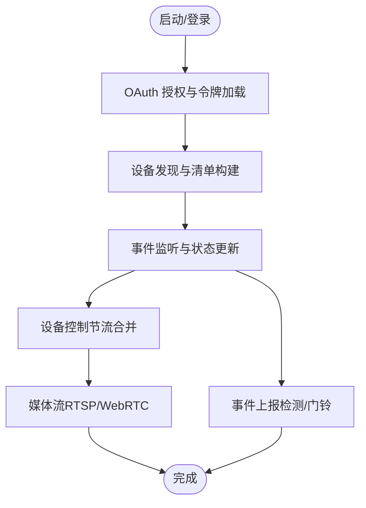
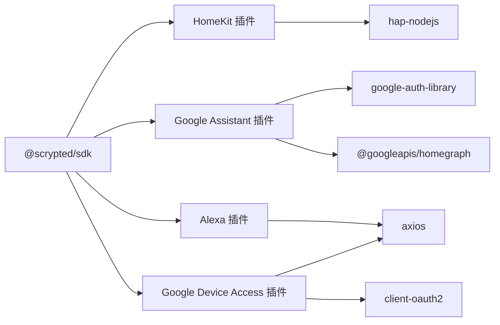

# 智能家居平台集成

<cite>
**本文引用的文件**
- [plugins/homekit/src/main.ts](file://plugins/homekit/src/main.ts)
- [plugins/homekit/src/hap.ts](file://plugins/homekit/src/hap.ts)
- [plugins/homekit/src/hap-utils.ts](file://plugins/homekit/src/hap-utils.ts)
- [plugins/homekit/src/common.ts](file://plugins/homekit/src/common.ts)
- [plugins/homekit/src/pincode.ts](file://plugins/homekit/src/pincode.ts)
- [plugins/homekit/src/address-override.ts](file://plugins/homekit/src/address-override.ts)
- [plugins/google-home/src/main.ts](file://plugins/google-home/src/main.ts)
- [plugins/google-home/src/handlers.ts](file://plugins/google-home/src/handlers.ts)
- [plugins/alexa/src/main.ts](file://plugins/alexa/src/main.ts)
- [plugins/alexa/src/handlers.ts](file://plugins/alexa/src/handlers.ts)
- [plugins/google-device-access/src/main.ts](file://plugins/google-device-access/src/main.ts)
</cite>

## 目录
1. [简介](#简介)
2. [项目结构](#项目结构)
3. [核心组件](#核心组件)
4. [架构总览](#架构总览)
5. [详细组件分析](#详细组件分析)
6. [依赖关系分析](#依赖关系分析)
7. [性能考量](#性能考量)
8. [故障排除指南](#故障排除指南)
9. [结论](#结论)
10. [附录](#附录)

## 简介
本文件面向 Scrypted 智能家居平台的多平台集成能力，系统性梳理 HomeKit、Google Assistant、Amazon Alexa、Google Device Access（Nest/Smart Device Management）等主流生态的双向通信机制与实现要点。内容涵盖认证流程、设备发现、控制协议、状态上报、媒体流、事件推送、配置项与最佳实践，并提供可直接定位到源码的路径指引，便于开发者快速上手与排障。

## 项目结构
- 平台插件按功能模块划分在 plugins 下：
  - HomeKit 插件：负责桥接与发布 HAP 设备，使用 hap-nodejs 实现。
  - Google Assistant 插件：对接 HomeGraph 同步与 SmartHome 协议，支持本地信令通道。
  - Amazon Alexa 插件：对接 Alexa 授权与 Discovery/Event/Control 流程。
  - Google Device Access 插件：对接 SDM（Smart Device Management）API，支持 Nest 设备的 OAuth、设备发现、事件与媒体流。

**图表来源**
- [plugins/homekit/src/main.ts:1-487](file://plugins/homekit/src/main.ts#L1-L487)
- [plugins/homekit/src/hap.ts:1-15](file://plugins/homekit/src/hap.ts#L1-L15)
- [plugins/homekit/src/hap-utils.ts:1-155](file://plugins/homekit/src/hap-utils.ts#L1-L155)
- [plugins/homekit/src/common.ts:1-49](file://plugins/homekit/src/common.ts#L1-L49)
- [plugins/google-home/src/main.ts:1-650](file://plugins/google-home/src/main.ts#L1-L650)
- [plugins/google-home/src/handlers.ts:1-5](file://plugins/google-home/src/handlers.ts#L1-L5)
- [plugins/alexa/src/main.ts:1-736](file://plugins/alexa/src/main.ts#L1-L736)
- [plugins/alexa/src/handlers.ts:1-34](file://plugins/alexa/src/handlers.ts#L1-L34)
- [plugins/google-device-access/src/main.ts:1-885](file://plugins/google-device-access/src/main.ts#L1-L885)

**章节来源**
- [plugins/homekit/src/main.ts:1-487](file://plugins/homekit/src/main.ts#L1-L487)
- [plugins/google-home/src/main.ts:1-650](file://plugins/google-home/src/main.ts#L1-L650)
- [plugins/alexa/src/main.ts:1-736](file://plugins/alexa/src/main.ts#L1-L736)
- [plugins/google-device-access/src/main.ts:1-885](file://plugins/google-device-access/src/main.ts#L1-L885)

## 核心组件
- HomeKit 桥接与发布
  - 使用 HAPStorage、Bridge、Accessory、Service、Characteristic 等实现设备模型与属性映射。
  - 支持 mDNS 广告（CIAO/Bonjour/Avahi 可选）、端口与用户名覆盖、QR 码配对、连接日志。
  - 自动为设备添加电池服务、设备信息服务；支持独立 Accessory 模式与桥接模式。
- Google Assistant 集成
  - 对接 HomeGraph Sync/Query/Execute/Disconnect；支持本地信令通道用于摄像头实时预览。
  - 基于 JWT 或云端代理上报状态与请求同步；带节流与队列优化。
- Amazon Alexa 集成
  - 授权 AcceptGrant；Discovery/ReportState/ChangeReport；设备级控制指令分发。
  - 通过 OAuth 获取访问令牌，周期性同步设备清单，事件上报。
- Google Device Access（SDM/Nest）
  - OAuth 客户端与令牌刷新；设备发现与动态设备清单变更；事件驱动的状态更新；RTSP/WebRTC 媒体流扩展。

**章节来源**
- [plugins/homekit/src/main.ts:60-487](file://plugins/homekit/src/main.ts#L60-L487)
- [plugins/homekit/src/hap.ts:1-15](file://plugins/homekit/src/hap.ts#L1-L15)
- [plugins/homekit/src/hap-utils.ts:17-155](file://plugins/homekit/src/hap-utils.ts#L17-L155)
- [plugins/homekit/src/common.ts:15-49](file://plugins/homekit/src/common.ts#L15-L49)
- [plugins/google-home/src/main.ts:48-650](file://plugins/google-home/src/main.ts#L48-L650)
- [plugins/alexa/src/main.ts:23-736](file://plugins/alexa/src/main.ts#L23-L736)
- [plugins/google-device-access/src/main.ts:540-885](file://plugins/google-device-access/src/main.ts#L540-L885)

## 架构总览
下图展示四大平台的双向通信主路径：设备层（Scrypted SDK）向上游平台暴露接口，平台插件负责协议适配、认证与状态/事件流转。

**图表来源**
- [plugins/homekit/src/main.ts:187-408](file://plugins/homekit/src/main.ts#L187-L408)
- [plugins/google-home/src/main.ts:266-542](file://plugins/google-home/src/main.ts#L266-L542)
- [plugins/alexa/src/main.ts:314-687](file://plugins/alexa/src/main.ts#L314-L687)
- [plugins/google-device-access/src/main.ts:580-862](file://plugins/google-device-access/src/main.ts#L580-L862)

## 详细组件分析

### HomeKit（HAP）实现
- 设备模型与映射
  - 通过 supportedTypes 将 Scrypted 类型映射到 HAP Accessory/Service/Characteristic。
  - 支持独立 Accessory 模式（单设备发布）与桥接模式（多设备桥接）。
- 认证与配对
  - 使用 HAPStorage 存储配对数据；随机生成 PIN 与用户名；支持手动重置配对。
  - 连接建立后记录远端地址，便于审计与诊断。
- 发现与广告
  - mDNS 广告器可选择 CIAO/Bonjour/Avahi；支持绑定特定网络接口或所有接口。
  - 可自定义桥接端口与用户名，避免冲突。
- 媒体与安全视频
  - 摄像头支持录制管理、视频剪辑提供者；电池服务自动注入。
- 关键实现位置
  - 桥接与发布：[plugins/homekit/src/main.ts:366-382](file://plugins/homekit/src/main.ts#L366-L382)
  - 独立 Accessory 发布与重连逻辑：[plugins/homekit/src/main.ts:291-347](file://plugins/homekit/src/main.ts#L291-L347)
  - HAP 导出与 UUID/PIN 工具：[plugins/homekit/src/hap.ts:1-15](file://plugins/homekit/src/hap.ts#L1-L15)、[plugins/homekit/src/hap-utils.ts:11-155](file://plugins/homekit/src/hap-utils.ts#L11-L155)
  - 设备类型映射与监听绑定：[plugins/homekit/src/common.ts:15-49](file://plugins/homekit/src/common.ts#L15-L49)

**图表来源**
- [plugins/homekit/src/main.ts:60-487](file://plugins/homekit/src/main.ts#L60-L487)
- [plugins/homekit/src/hap.ts:1-15](file://plugins/homekit/src/hap.ts#L1-L15)
- [plugins/homekit/src/hap-utils.ts:11-155](file://plugins/homekit/src/hap-utils.ts#L11-L155)
- [plugins/homekit/src/common.ts:15-49](file://plugins/homekit/src/common.ts#L15-L49)

**章节来源**
- [plugins/homekit/src/main.ts:60-487](file://plugins/homekit/src/main.ts#L60-L487)
- [plugins/homekit/src/hap.ts:1-15](file://plugins/homekit/src/hap.ts#L1-L15)
- [plugins/homekit/src/hap-utils.ts:17-155](file://plugins/homekit/src/hap-utils.ts#L17-L155)
- [plugins/homekit/src/common.ts:15-49](file://plugins/homekit/src/common.ts#L15-L49)
- [plugins/homekit/src/pincode.ts:1-8](file://plugins/homekit/src/pincode.ts#L1-L8)
- [plugins/homekit/src/address-override.ts:1-24](file://plugins/homekit/src/address-override.ts#L1-L24)

### Google Assistant（HomeGraph + SmartHome）
- 认证与授权
  - 使用 google-auth-library 获取 HomeGraph 权限；支持 JWT 或云端代理上报。
  - 本地授权头校验，防止未授权访问；支持一次性配对键。
- 设备发现与同步
  - onSync 枚举系统设备，过滤可支持类型并写入 customData（含 localAuthorization）。
  - requestSync 节流，避免频繁触发上游同步。
- 状态查询与上报
  - onQuery 触发设备 refresh 并读取状态；支持通知上报（notifications）。
  - reportState 聚合状态与通知，批量上报至 HomeGraph。
- 控制执行
  - onExecute 分派到 commandHandlers 映射，逐条执行并返回结果。
- 摄像头实时预览
  - 通过本地信令端点与浏览器 RTCSignalingSession 建立信令通道。
- 关键实现位置
  - 同步/查询/执行/断开流程：[plugins/google-home/src/main.ts:266-426](file://plugins/google-home/src/main.ts#L266-L426)
  - 状态上报与请求同步：[plugins/google-home/src/main.ts:428-542](file://plugins/google-home/src/main.ts#L428-L542)
  - 本地信令与摄像头权限：[plugins/google-home/src/main.ts:227-248](file://plugins/google-home/src/main.ts#L227-L248)
  - 命令处理器映射：[plugins/google-home/src/handlers.ts:1-5](file://plugins/google-home/src/handlers.ts#L1-L5)

**图表来源**
- [plugins/google-home/src/main.ts:266-542](file://plugins/google-home/src/main.ts#L266-L542)
- [plugins/google-home/src/handlers.ts:1-5](file://plugins/google-home/src/handlers.ts#L1-L5)

**章节来源**
- [plugins/google-home/src/main.ts:48-650](file://plugins/google-home/src/main.ts#L48-L650)
- [plugins/google-home/src/handlers.ts:1-5](file://plugins/google-home/src/handlers.ts#L1-L5)

### Amazon Alexa（Skill/SDK）
- 授权与配对
  - AcceptGrant 获取授权码并换取访问令牌；保存 tokenInfo 与 API Endpoint。
  - 本地授权头校验，防止未授权访问；支持配对键。
- 设备发现与同步
  - Discover/Discovery/Report 同步设备清单；AddOrUpdate/DeleteReport 增量维护。
- 事件上报
  - ReportState/ChangeReport 上报上下文与事件；自动附加在线/电池信息。
- 控制执行
  - 设备级指令路由到具体 handler，调用设备接口执行。
- 关键实现位置
  - 授权与令牌刷新：[plugins/alexa/src/main.ts:418-494](file://plugins/alexa/src/main.ts#L418-L494)
  - 发现与同步：[plugins/alexa/src/main.ts:314-364](file://plugins/alexa/src/main.ts#L314-L364)
  - 事件上报与发送：[plugins/alexa/src/main.ts:163-220](file://plugins/alexa/src/main.ts#L163-L220)
  - 请求入口与指令分发：[plugins/alexa/src/main.ts:612-687](file://plugins/alexa/src/main.ts#L612-L687)

**图表来源**
- [plugins/alexa/src/main.ts:496-531](file://plugins/alexa/src/main.ts#L496-L531)
- [plugins/alexa/src/main.ts:314-364](file://plugins/alexa/src/main.ts#L314-L364)
- [plugins/alexa/src/main.ts:163-220](file://plugins/alexa/src/main.ts#L163-L220)
- [plugins/alexa/src/main.ts:612-687](file://plugins/alexa/src/main.ts#L612-L687)

**章节来源**
- [plugins/alexa/src/main.ts:23-736](file://plugins/alexa/src/main.ts#L23-L736)
- [plugins/alexa/src/handlers.ts:1-34](file://plugins/alexa/src/handlers.ts#L1-L34)

### Google Device Access（SDM/Nest）
- 认证与 OAuth
  - ClientOAuth2 客户端；加载/刷新令牌；保存 token 到存储。
- 设备发现与动态更新
  - 刷新设备列表，构建 DeviceManifest；根据设备类型映射为 Scrypted 设备。
  - Pub/Sub/HTTP 回调接收事件，更新设备 traits 与状态。
- 控制与状态
  - 温控设备：模式切换、设定温度范围；风扇定时开关；节流合并命令。
  - 摄像头：RTSP/WebRTC 媒体流扩展；事件图片生成；检测事件上报。
- 关键实现位置
  - OAuth 与设置：[plugins/google-device-access/src/main.ts:540-732](file://plugins/google-device-access/src/main.ts#L540-L732)
  - 设备发现与清单变更：[plugins/google-device-access/src/main.ts:780-862](file://plugins/google-device-access/src/main.ts#L780-L862)
  - 事件回调与状态更新：[plugins/google-device-access/src/main.ts:605-665](file://plugins/google-device-access/src/main.ts#L605-L665)
  - 温控设备控制与刷新：[plugins/google-device-access/src/main.ts:344-524](file://plugins/google-device-access/src/main.ts#L344-L524)
  - 摄像头媒体流与事件：[plugins/google-device-access/src/main.ts:134-332](file://plugins/google-device-access/src/main.ts#L134-L332)

**图表来源**
- [plugins/google-device-access/src/main.ts:540-885](file://plugins/google-device-access/src/main.ts#L540-L885)

**章节来源**
- [plugins/google-device-access/src/main.ts:540-885](file://plugins/google-device-access/src/main.ts#L540-L885)

## 依赖关系分析
- 组件耦合
  - 平台插件均依赖 @scrypted/sdk 的 systemManager/deviceManager/endpointManager 提供设备事件、状态与网络端点。
  - HomeKit 依赖 hap-nodejs（通过 hap.ts 导出），并使用 HAPStorage、Bridge、Accessory 等。
  - Google Assistant 依赖 google-auth-library 与 @googleapis/homegraph；内部使用 ciao 作为本地 mDNS 服务。
  - Alexa 依赖 axios 进行 OAuth 与事件上报；使用 uuid 生成消息 ID。
  - Google Device Access 依赖 axios 与 client-oauth2，对接 SDM API。
- 外部依赖与集成点
  - mDNS 广告：HomeKit（CIAO/Bonjour/Avahi）、Google Assistant（ciao）。
  - 云服务：Google HomeGraph、Alexa 授权服务器、Google SDM API。
  - 媒体流：HomeKit（HAP Camera）、Google Assistant（RTCSignaling）、Google Device Access（RTSP/WebRTC）。

**图表来源**
- [plugins/homekit/src/hap.ts:1-15](file://plugins/homekit/src/hap.ts#L1-L15)
- [plugins/google-home/src/main.ts:1-25](file://plugins/google-home/src/main.ts#L1-L25)
- [plugins/alexa/src/main.ts:1-10](file://plugins/alexa/src/main.ts#L1-L10)
- [plugins/google-device-access/src/main.ts:1-12](file://plugins/google-device-access/src/main.ts#L1-L12)

**章节来源**
- [plugins/homekit/src/hap.ts:1-15](file://plugins/homekit/src/hap.ts#L1-L15)
- [plugins/google-home/src/main.ts:1-25](file://plugins/google-home/src/main.ts#L1-L25)
- [plugins/alexa/src/main.ts:1-10](file://plugins/alexa/src/main.ts#L1-L10)
- [plugins/google-device-access/src/main.ts:1-12](file://plugins/google-device-access/src/main.ts#L1-L12)

## 性能考量
- 节流与聚合
  - Google Assistant：reportState 聚合队列与 2 秒节流；requestSync 15 秒内多次变更仅触发一次。
  - Alexa：设备事件上报前缀过滤；温控设备命令合并节流。
  - Google Device Access：设备刷新节流，避免频繁轮询。
- 端口与网络
  - HomeKit 支持随机端口与绑定接口选择，避免冲突与提升稳定性。
- 媒体流
  - Google Device Access 支持 WebRTC/RTSP，结合扩展令牌延长会话，减少重复建立成本。

[本节为通用指导，无需列出具体文件来源]

## 故障排除指南
- HomeKit
  - 配对失败：检查 PIN 与用户名是否正确；查看连接日志中远端地址；必要时重置配对。
  - 发布失败：确认 mDNS 广告器可用（CIAO/Bonjour/Avahi）；检查绑定接口与端口。
  - 独立 Accessory 不在线：确认设备在线事件与自动发布逻辑。
  - 参考路径：[plugins/homekit/src/main.ts:291-347](file://plugins/homekit/src/main.ts#L291-L347)、[plugins/homekit/src/hap-utils.ts:138-146](file://plugins/homekit/src/hap-utils.ts#L138-L146)
- Google Assistant
  - 无法上报状态：检查 JWT 是否有效或云端代理是否可用；确认 HomeGraph 权限。
  - 同步不生效：确认 requestSync 是否被节流；检查 link-tracker 与配对键。
  - 摄像头无画面：检查本地信令端点与授权头；确认浏览器信令会话建立。
  - 参考路径：[plugins/google-home/src/main.ts:488-542](file://plugins/google-home/src/main.ts#L488-L542)、[plugins/google-home/src/main.ts:544-646](file://plugins/google-home/src/main.ts#L544-L646)
- Alexa
  - 未识别设备：检查 Discovery/Report 是否成功；确认 syncedDevices 清单。
  - 授权异常：检查 tokenInfo 与 refresh_token；必要时重新授权。
  - 控制无响应：核对指令分发与设备 handler 映射。
  - 参考路径：[plugins/alexa/src/main.ts:314-364](file://plugins/alexa/src/main.ts#L314-L364)、[plugins/alexa/src/main.ts:418-494](file://plugins/alexa/src/main.ts#L418-L494)
- Google Device Access
  - 无设备：检查 OAuth 与 Project ID；确认 Pub/Sub 地址可达。
  - 事件不更新：检查回调端点与事件映射；确认 traits 更新。
  - 媒体流失败：确认 WebRTC/RTSP 支持与扩展令牌。
  - 参考路径：[plugins/google-device-access/src/main.ts:540-732](file://plugins/google-device-access/src/main.ts#L540-L732)、[plugins/google-device-access/src/main.ts:605-665](file://plugins/google-device-access/src/main.ts#L605-L665)

**章节来源**
- [plugins/homekit/src/main.ts:291-347](file://plugins/homekit/src/main.ts#L291-L347)
- [plugins/homekit/src/hap-utils.ts:138-146](file://plugins/homekit/src/hap-utils.ts#L138-L146)
- [plugins/google-home/src/main.ts:488-646](file://plugins/google-home/src/main.ts#L488-L646)
- [plugins/alexa/src/main.ts:314-494](file://plugins/alexa/src/main.ts#L314-L494)
- [plugins/google-device-access/src/main.ts:540-732](file://plugins/google-device-access/src/main.ts#L540-L732)

## 结论
Scrypted 在四大主流智能家居平台实现了高内聚、低耦合的插件化集成：HomeKit 以 HAP 为核心，强调即插即用与本地安全；Google Assistant 侧重云端同步与本地信令；Alexa 采用 Skill/SDK 模式，强调事件与控制的解耦；Google Device Access 则打通 Nest/SDM 生态，提供设备发现、事件与媒体流的完整链路。通过统一的 SDK 与事件模型，平台在保证易用性的同时，提供了丰富的配置项与可观测性，便于生产环境部署与运维。

[本节为总结性内容，无需列出具体文件来源]

## 附录
- 平台配置要点速查
  - HomeKit
    - mDNS 广告器选择、绑定接口、端口覆盖、配对 PIN/用户名、QR 码、重置配对。
    - 参考路径：[plugins/homekit/src/main.ts:68-120](file://plugins/homekit/src/main.ts#L68-L120)、[plugins/homekit/src/hap-utils.ts:77-136](file://plugins/homekit/src/hap-utils.ts#L77-L136)
  - Google Assistant
    - JWT/云端代理、agentUserId、localAuthorization、请求同步节流。
    - 参考路径：[plugins/google-home/src/main.ts:49-94](file://plugins/google-home/src/main.ts#L49-L94)、[plugins/google-home/src/main.ts:516-542](file://plugins/google-home/src/main.ts#L516-L542)
  - Alexa
    - tokenInfo、pairedUserId、API Endpoint、调试开关、自动添加设备。
    - 参考路径：[plugins/alexa/src/main.ts:24-62](file://plugins/alexa/src/main.ts#L24-L62)
  - Google Device Access
    - Project ID、Client ID/Secret、Pub/Sub 地址、OAuth 回调、刷新频率。
    - 参考路径：[plugins/google-device-access/src/main.ts:667-703](file://plugins/google-device-access/src/main.ts#L667-L703)、[plugins/google-device-access/src/main.ts:738-758](file://plugins/google-device-access/src/main.ts#L738-L758)

**章节来源**
- [plugins/homekit/src/main.ts:68-120](file://plugins/homekit/src/main.ts#L68-L120)
- [plugins/homekit/src/hap-utils.ts:77-136](file://plugins/homekit/src/hap-utils.ts#L77-L136)
- [plugins/google-home/src/main.ts:49-94](file://plugins/google-home/src/main.ts#L49-L94)
- [plugins/alexa/src/main.ts:24-62](file://plugins/alexa/src/main.ts#L24-L62)
- [plugins/google-device-access/src/main.ts:667-703](file://plugins/google-device-access/src/main.ts#L667-L703)