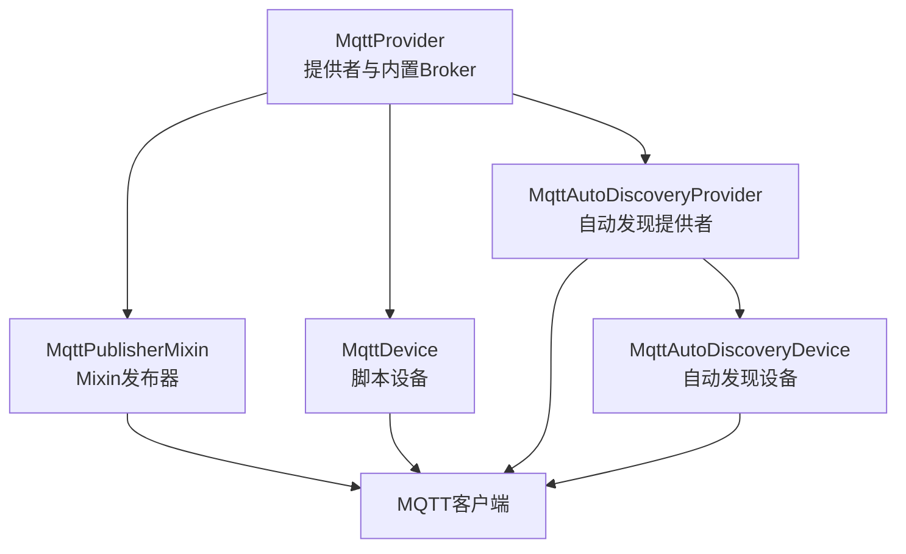
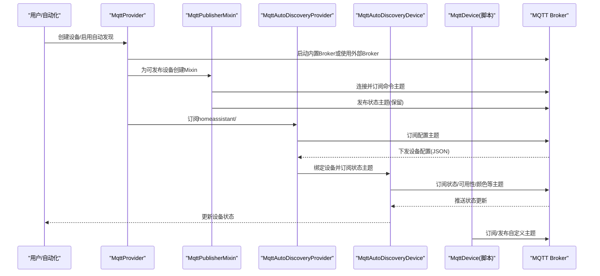
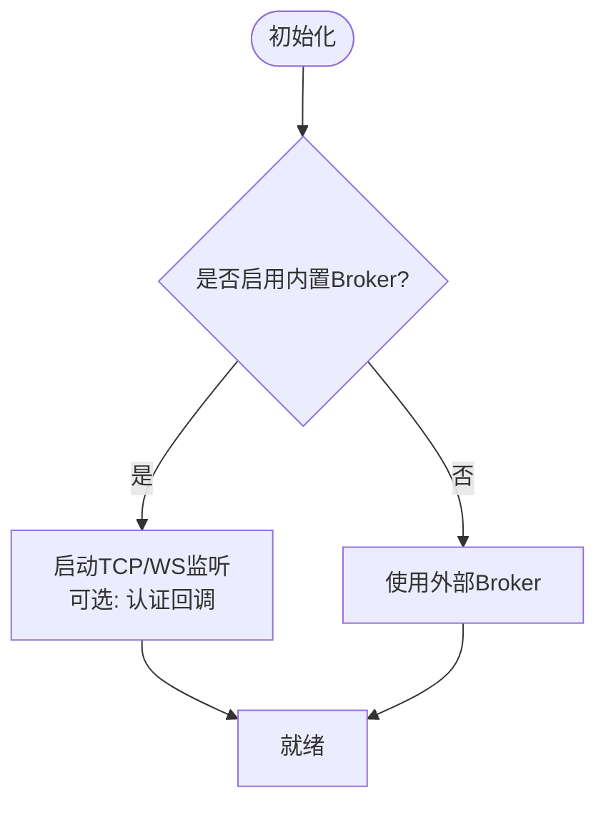
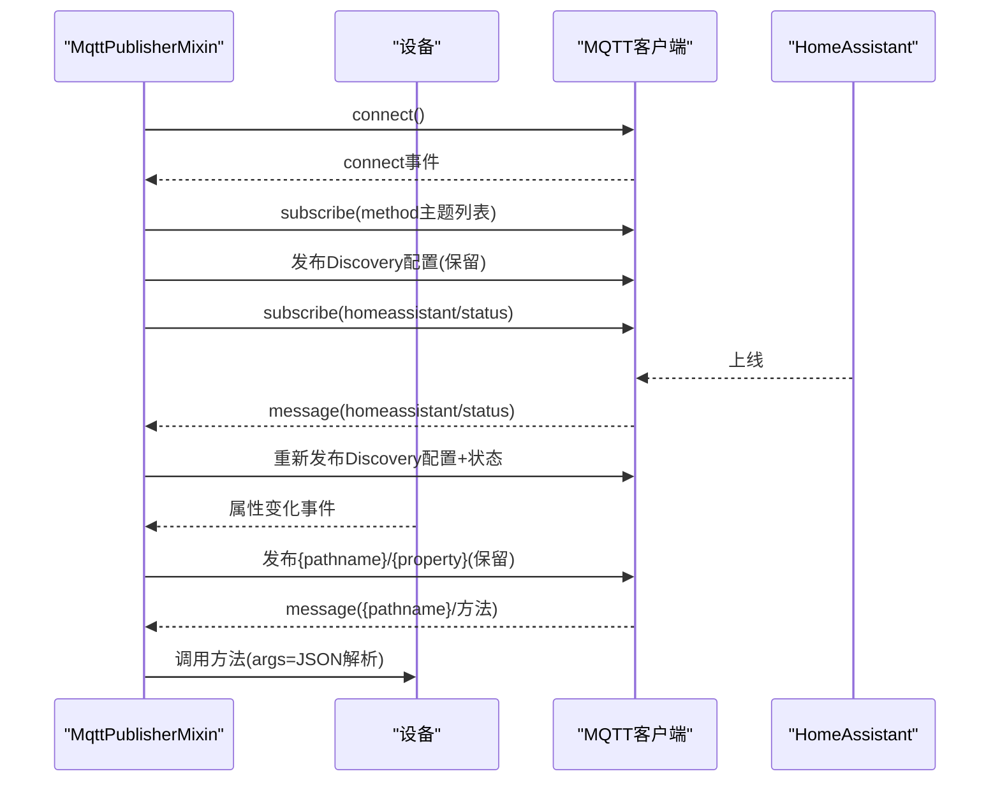
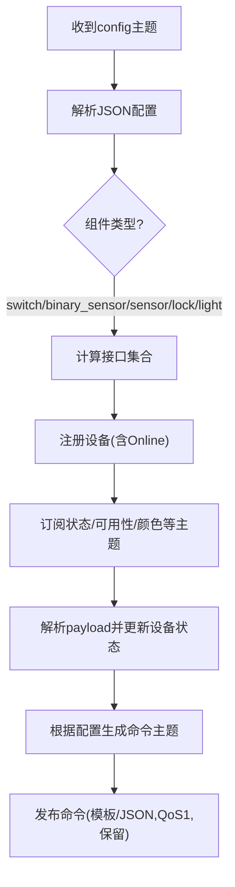
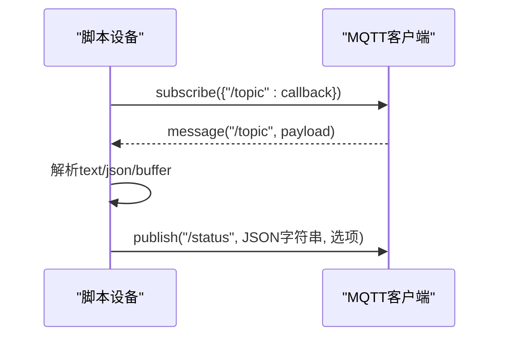
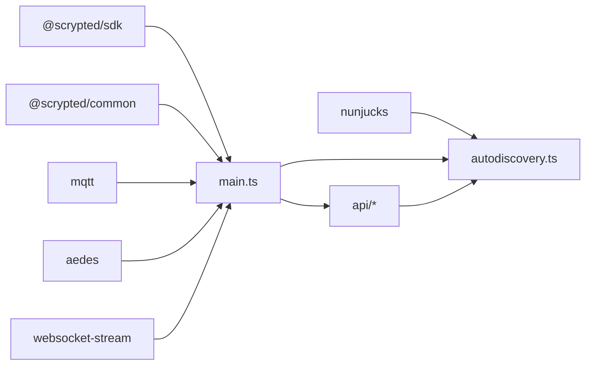

# 消息系统集成

<cite>
**本文引用的文件**
- [plugins/mqtt/src/main.ts](file://plugins/mqtt/src/main.ts)
- [plugins/mqtt/src/autodiscovery.ts](file://plugins/mqtt/src/autodiscovery.ts)
- [plugins/mqtt/src/publishable-types.ts](file://plugins/mqtt/src/publishable-types.ts)
- [plugins/mqtt/src/api/mqtt-client.ts](file://plugins/mqtt/src/api/mqtt-client.ts)
- [plugins/mqtt/src/api/mqtt-device-base.ts](file://plugins/mqtt/src/api/mqtt-device-base.ts)
- [plugins/mqtt/fs/examples/loopback-light.ts](file://plugins/mqtt/fs/examples/loopback-light.ts)
- [plugins/mqtt/fs/examples/button.ts](file://plugins/mqtt/fs/examples/button.ts)
- [plugins/mqtt/package.json](file://plugins/mqtt/package.json)
</cite>

## 目录
1. [简介](#简介)
2. [项目结构](#项目结构)
3. [核心组件](#核心组件)
4. [架构总览](#架构总览)
5. [详细组件分析](#详细组件分析)
6. [依赖关系分析](#依赖关系分析)
7. [性能考量](#性能考量)
8. [故障排查指南](#故障排查指南)
9. [结论](#结论)
10. [附录](#附录)

## 简介
本文件面向 Scrypted 的 MQTT 消息系统集成，围绕以下目标展开：解释 MQTT 在智能家居中的应用与协议要点（主题命名、消息格式、QoS 选择）、客户端实现（连接管理、重连与遗嘱）、自动发现（Home Assistant MQTT Discovery）以及主题组织（控制、状态、事件）。同时覆盖序列化/反序列化处理（JSON、二进制、模板渲染）、MQTT 服务器配置与认证、安全传输建议，以及最佳实践与性能优化。

## 项目结构
Scrypted 的 MQTT 插件位于 plugins/mqtt，核心由 Provider、Mixin、自动发现与脚本设备等模块组成。主要文件职责如下：
- main.ts：提供 MQTT Provider、内置 Broker 启停、脚本设备与自动发现设备的创建与绑定、Mixin 发布者等。
- autodiscovery.ts：实现 Home Assistant MQTT Discovery 协议，解析设备配置、订阅状态、下发命令。
- api/mqtt-client.ts：定义脚本侧 MQTT 客户端接口（订阅、发布、选项）。
- api/mqtt-device-base.ts：设备基类，封装 MQTT 客户端连接、路径前缀与设置项。
- publishable-types.ts：判定设备是否可被发布到 MQTT（排除非公开接口）。
- examples：脚本示例，展示订阅、发布与双向联动。

图示来源
- [plugins/mqtt/src/main.ts:349-619](file://plugins/mqtt/src/main.ts#L349-L619)
- [plugins/mqtt/src/autodiscovery.ts:76-209](file://plugins/mqtt/src/autodiscovery.ts#L76-L209)

章节来源
- [plugins/mqtt/src/main.ts:349-619](file://plugins/mqtt/src/main.ts#L349-L619)
- [plugins/mqtt/src/autodiscovery.ts:76-209](file://plugins/mqtt/src/autodiscovery.ts#L76-L209)

## 核心组件
- MQTT Provider：负责设备生命周期、内置 Aedes Broker 的启停、自动发现设备与脚本设备的创建。
- MQTT 自动发现提供者与设备：解析 Home Assistant Discovery 配置，订阅状态并下发控制命令。
- MQTT 发布者 Mixin：为可发布设备自动发布状态与订阅命令。
- MQTT 脚本设备：通过脚本暴露 MQTT 订阅/发布能力，支持 JSON/文本/Buffer 读取。
- MQTT 设备基类：统一连接逻辑、路径前缀与设置项。
- 可发布类型判定：过滤不可发布的接口，仅对业务接口进行发布。

章节来源
- [plugins/mqtt/src/main.ts:349-619](file://plugins/mqtt/src/main.ts#L349-L619)
- [plugins/mqtt/src/autodiscovery.ts:76-209](file://plugins/mqtt/src/autodiscovery.ts#L76-L209)
- [plugins/mqtt/src/api/mqtt-device-base.ts:6-103](file://plugins/mqtt/src/api/mqtt-device-base.ts#L6-L103)
- [plugins/mqtt/src/publishable-types.ts:3-38](file://plugins/mqtt/src/publishable-types.ts#L3-L38)

## 架构总览
下图展示了 Provider、Mixin、自动发现与脚本设备之间的交互，以及与 MQTT Broker 的连接关系。

图示来源
- [plugins/mqtt/src/main.ts:349-619](file://plugins/mqtt/src/main.ts#L349-L619)
- [plugins/mqtt/src/autodiscovery.ts:76-209](file://plugins/mqtt/src/autodiscovery.ts#L76-L209)

## 详细组件分析

### MQTT Provider（提供者）
- 职责
  - 管理内置 Aedes Broker 的启停（TCP/WS），支持用户名密码认证。
  - 提供“脚本设备”与“自动发现设备”的创建入口。
  - 为可发布设备提供 Mixin，自动发布状态与订阅命令。
- 关键点
  - 内置 Broker：监听 TCP 端口与 HTTP 端口，WebSocket 透传；可配置用户名/密码。
  - 外部 Broker：支持指定外部地址，按需使用 Provider 或设备级设置。
  - 自动发现：首次连接时向 homeassistant/status 订阅，HA 上线后重新发布配置与状态。
- 设置项
  - 开关内置 Broker、外部 Broker 地址、用户名/密码、TCP/HTTP 端口、自动发现 ID。

图示来源
- [plugins/mqtt/src/main.ts:486-520](file://plugins/mqtt/src/main.ts#L486-L520)
- [plugins/mqtt/src/main.ts:412-480](file://plugins/mqtt/src/main.ts#L412-L480)

章节来源
- [plugins/mqtt/src/main.ts:349-619](file://plugins/mqtt/src/main.ts#L349-L619)

### MQTT 发布者 Mixin（MixinPublisher）
- 职责
  - 将设备状态属性发布到 MQTT（保留），订阅命令方法。
  - 自动发布设备接口对应的 HA Discovery 配置，订阅 homeassistant/status。
- 连接策略
  - 优先使用设备级 URL/凭据；否则回退到 Provider 的外部 Broker；最后使用内置 Broker。
  - 连接成功后订阅所有方法名主题，发布当前状态。
- 命令处理
  - 解析 JSON 参数数组，调用设备对应方法。
- 状态发布
  - 遍历设备接口属性，发布到 {pathname}/{property}，保留。

图示来源
- [plugins/mqtt/src/main.ts:160-347](file://plugins/mqtt/src/main.ts#L160-L347)

章节来源
- [plugins/mqtt/src/main.ts:160-347](file://plugins/mqtt/src/main.ts#L160-L347)

### MQTT 自动发现（Home Assistant）
- 协议实现
  - 订阅 homeassistant/<component>/.../config，解析 JSON 配置，动态创建设备。
  - 支持开关、传感器、锁、灯（亮度/色温/HSV）等类型映射。
- 设备绑定
  - 根据配置订阅状态主题，解析 payload 并更新设备状态。
  - 支持模板渲染（nunjucks）以适配不同厂商 payload 结构。
- 控制下发
  - 依据配置生成命令主题，按模板或 JSON 发布命令（含 QoS 与保留）。

图示来源
- [plugins/mqtt/src/autodiscovery.ts:76-209](file://plugins/mqtt/src/autodiscovery.ts#L76-L209)
- [plugins/mqtt/src/autodiscovery.ts:297-432](file://plugins/mqtt/src/autodiscovery.ts#L297-L432)
- [plugins/mqtt/src/autodiscovery.ts:705-756](file://plugins/mqtt/src/autodiscovery.ts#L705-L756)

章节来源
- [plugins/mqtt/src/autodiscovery.ts:76-209](file://plugins/mqtt/src/autodiscovery.ts#L76-L209)
- [plugins/mqtt/src/autodiscovery.ts:297-432](file://plugins/mqtt/src/autodiscovery.ts#L297-L432)
- [plugins/mqtt/src/autodiscovery.ts:705-756](file://plugins/mqtt/src/autodiscovery.ts#L705-L756)

### MQTT 脚本设备（Scriptable）
- 能力
  - 提供 subscribe()/publish() 接口，支持 JSON、text、buffer 读取。
  - 自动拼接 pathname 前缀，避免主题冲突。
- 示例
  - loopback-light：双向联动，命令下发后回写状态。
  - button：订阅按钮事件，驱动二进制传感器。

图示来源
- [plugins/mqtt/src/main.ts:33-155](file://plugins/mqtt/src/main.ts#L33-L155)
- [plugins/mqtt/src/api/mqtt-client.ts:3-20](file://plugins/mqtt/src/api/mqtt-client.ts#L3-L20)
- [plugins/mqtt/fs/examples/loopback-light.ts:14-31](file://plugins/mqtt/fs/examples/loopback-light.ts#L14-L31)
- [plugins/mqtt/fs/examples/button.ts:7-14](file://plugins/mqtt/fs/examples/button.ts#L7-L14)

章节来源
- [plugins/mqtt/src/main.ts:33-155](file://plugins/mqtt/src/main.ts#L33-L155)
- [plugins/mqtt/src/api/mqtt-client.ts:3-20](file://plugins/mqtt/src/api/mqtt-client.ts#L3-L20)
- [plugins/mqtt/fs/examples/loopback-light.ts:14-31](file://plugins/mqtt/fs/examples/loopback-light.ts#L14-L31)
- [plugins/mqtt/fs/examples/button.ts:7-14](file://plugins/mqtt/fs/examples/button.ts#L7-L14)

### MQTT 设备基类与脚本基类
- 设备基类
  - 统一连接逻辑：支持设备级 URL/凭据、外部 Broker、内置 Broker。
  - 自动计算 pathname 前缀，便于多设备隔离。
- 脚本基类
  - 为脚本设备注入 MQTT 能力，提供 subscribe/publish 与事件读取。

章节来源
- [plugins/mqtt/src/api/mqtt-device-base.ts:6-103](file://plugins/mqtt/src/api/mqtt-device-base.ts#L6-L103)

### 可发布类型判定
- 仅对业务接口（如 OnOff、Brightness、Lock 等）进行发布，排除系统/内部/流媒体/检测等接口。
- 用于 Mixin 的 canMixin 判定，避免无意义的主题发布。

章节来源
- [plugins/mqtt/src/publishable-types.ts:3-38](file://plugins/mqtt/src/publishable-types.ts#L3-L38)

## 依赖关系分析
- 外部库
  - mqtt：MQTT 客户端库，提供连接、订阅、发布、事件。
  - aedes：轻量级 MQTT Broker，支持 TCP 与 WebSocket。
  - websocket-stream：将 Aedes 与 HTTP 服务桥接为 WS。
  - nunjucks：模板渲染，用于 Discovery 命令与状态解析。
- 内部依赖
  - @scrypted/sdk：设备接口、事件、系统管理器。
  - @scrypted/common：脚本设备与编译运行环境。

图示来源
- [plugins/mqtt/package.json:33-39](file://plugins/mqtt/package.json#L33-L39)
- [plugins/mqtt/src/main.ts:1-18](file://plugins/mqtt/src/main.ts#L1-L18)
- [plugins/mqtt/src/autodiscovery.ts:1-11](file://plugins/mqtt/src/autodiscovery.ts#L1-L11)

章节来源
- [plugins/mqtt/package.json:33-39](file://plugins/mqtt/package.json#L33-L39)
- [plugins/mqtt/src/main.ts:1-18](file://plugins/mqtt/src/main.ts#L1-L18)
- [plugins/mqtt/src/autodiscovery.ts:1-11](file://plugins/mqtt/src/autodiscovery.ts#L1-L11)

## 性能考量
- QoS 与保留
  - 自动发现下发命令时使用 QoS 1，保留（retain）确保新订阅者立即获得最新状态。
- 订阅粒度
  - Mixin 仅订阅方法主题，避免过度订阅导致带宽与 CPU 压力。
- Payload 大小
  - 内置 Broker 日志会抑制超大 payload 输出，避免控制台刷屏。
- 连接与重连
  - 使用统一连接基类，避免重复监听器泄漏；未显式实现自动重连，建议在上层或外部 Broker 层保障稳定性。
- 模板渲染
  - 仅在自动发现场景使用模板渲染，避免在高频事件中频繁执行。

章节来源
- [plugins/mqtt/src/autodiscovery.ts:449-452](file://plugins/mqtt/src/autodiscovery.ts#L449-L452)
- [plugins/mqtt/src/main.ts:514-519](file://plugins/mqtt/src/main.ts#L514-L519)
- [plugins/mqtt/src/api/mqtt-device-base.ts:94-101](file://plugins/mqtt/src/api/mqtt-device-base.ts#L94-L101)

## 故障排查指南
- 连接失败
  - 检查 Provider 设置：内置 Broker 是否启用、端口是否开放；外部 Broker 地址与凭据是否正确。
  - 设备级设置优先级高于 Provider 设置，确认 pathname 前缀是否一致。
- 无响应或状态不更新
  - 确认 Mixin 已发布 Discovery 配置且订阅了 homeassistant/status；HA 上线后会触发重新发布。
  - 检查设备属性是否可发布（排除系统接口）。
- 命令无效
  - 确认命令主题与模板匹配；检查 payload 字段是否符合设备配置（如 color_mode、brightness_scale）。
- 日志定位
  - Provider/Broker 会在控制台输出连接与消息摘要；脚本设备可在 Console 查看错误堆栈。

章节来源
- [plugins/mqtt/src/main.ts:412-480](file://plugins/mqtt/src/main.ts#L412-L480)
- [plugins/mqtt/src/main.ts:514-519](file://plugins/mqtt/src/main.ts#L514-L519)
- [plugins/mqtt/src/autodiscovery.ts:314-336](file://plugins/mqtt/src/autodiscovery.ts#L314-L336)

## 结论
Scrypted 的 MQTT 集成以 Provider 为核心，结合 Mixin 与自动发现，实现了从设备状态发布、命令订阅到 Home Assistant 生态的无缝对接。通过统一的连接基类与清晰的主题前缀，保证了多设备隔离与可维护性。建议在生产环境中配合外部高可用 Broker、TLS 与细粒度 ACL，进一步提升可靠性与安全性。

## 附录

### 主题命名规范与组织
- 基础前缀
  - 设备级：{pathname}，由 Provider 或设备设置决定。
  - Provider 内置：默认 scrypted/{deviceId}；外部 Broker：可自定义路径。
- 方法命令主题
  - {pathname}/{method}，例如 {pathname}/turnOn。
- 属性状态主题
  - {pathname}/{property}，例如 {pathname}/on、{pathname}/brightness，发布时保留。
- 自动发现配置主题
  - homeassistant/{component}/{node_id}/{iface}/config，保留发布。

章节来源
- [plugins/mqtt/src/main.ts:160-347](file://plugins/mqtt/src/main.ts#L160-L347)
- [plugins/mqtt/src/autodiscovery.ts:705-756](file://plugins/mqtt/src/autodiscovery.ts#L705-L756)

### 消息格式与序列化
- 文本/JSON/二进制
  - 脚本侧事件提供 text/json/buffer 三种读取方式，适配不同 payload。
  - 发布时对象自动 JSON 序列化，Buffer 类型直接发送。
- 模板渲染
  - 自动发现使用 nunjucks 渲染命令与状态模板，支持复杂字段映射（如色温和 HSV）。

章节来源
- [plugins/mqtt/src/api/mqtt-client.ts:3-20](file://plugins/mqtt/src/api/mqtt-client.ts#L3-L20)
- [plugins/mqtt/src/main.ts:132-138](file://plugins/mqtt/src/main.ts#L132-L138)
- [plugins/mqtt/src/autodiscovery.ts:259-264](file://plugins/mqtt/src/autodiscovery.ts#L259-L264)

### QoS 与保留策略
- 命令下发：QoS 1，保留（retain），确保新订阅者立即获得最新指令。
- 状态发布：保留（retain），确保设备上线即可见。
- 事件订阅：默认 QoS 0，避免重复与延迟。

章节来源
- [plugins/mqtt/src/autodiscovery.ts:449-452](file://plugins/mqtt/src/autodiscovery.ts#L449-L452)
- [plugins/mqtt/src/main.ts:185-187](file://plugins/mqtt/src/main.ts#L185-L187)

### MQTT 服务器配置与安全
- 内置 Broker
  - TCP 端口与 HTTP 端口可配置；支持用户名/密码认证回调。
- 外部 Broker
  - 支持任意兼容 MQTT 5/3.1.1 的 Broker；建议启用 TLS 与 ACL。
- 安全建议
  - 强制使用 TLS；限制主题通配符；为不同设备分配独立前缀；定期轮换凭据。

章节来源
- [plugins/mqtt/src/main.ts:486-520](file://plugins/mqtt/src/main.ts#L486-L520)
- [plugins/mqtt/src/api/mqtt-device-base.ts:89-93](file://plugins/mqtt/src/api/mqtt-device-base.ts#L89-L93)

### 最佳实践与性能优化
- 主题设计
  - 固定前缀 + 设备 ID，避免跨设备冲突；命令与状态分离。
- 发布策略
  - 仅发布必要属性；使用保留确保状态可见；避免频繁高频率发布。
- 订阅策略
  - 仅订阅所需主题；避免过多通配符；合理拆分主题层级。
- 自动发现
  - 明确 color_mode/brightness_scale 等配置，减少运行时转换开销。
- 脚本开发
  - 使用模板与 JSON Schema 对齐；在 Console 中调试事件与 payload。

章节来源
- [plugins/mqtt/src/autodiscovery.ts:297-432](file://plugins/mqtt/src/autodiscovery.ts#L297-L432)
- [plugins/mqtt/fs/examples/loopback-light.ts:14-31](file://plugins/mqtt/fs/examples/loopback-light.ts#L14-L31)