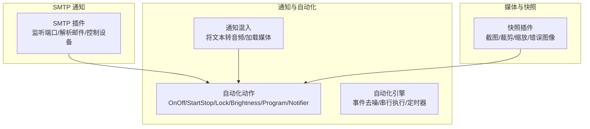
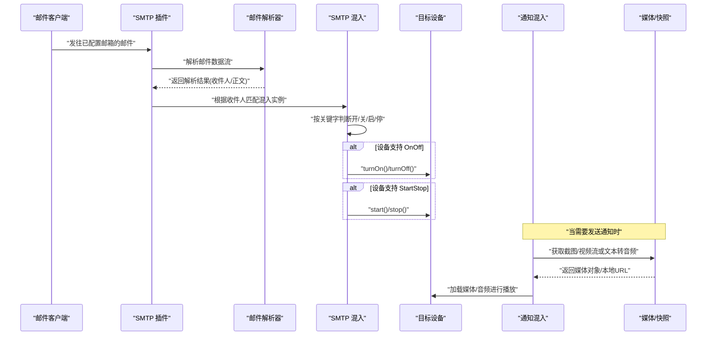
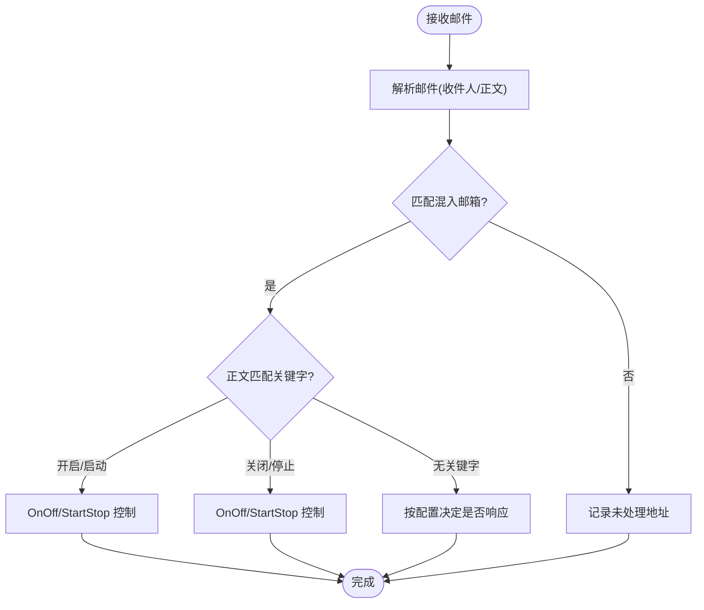
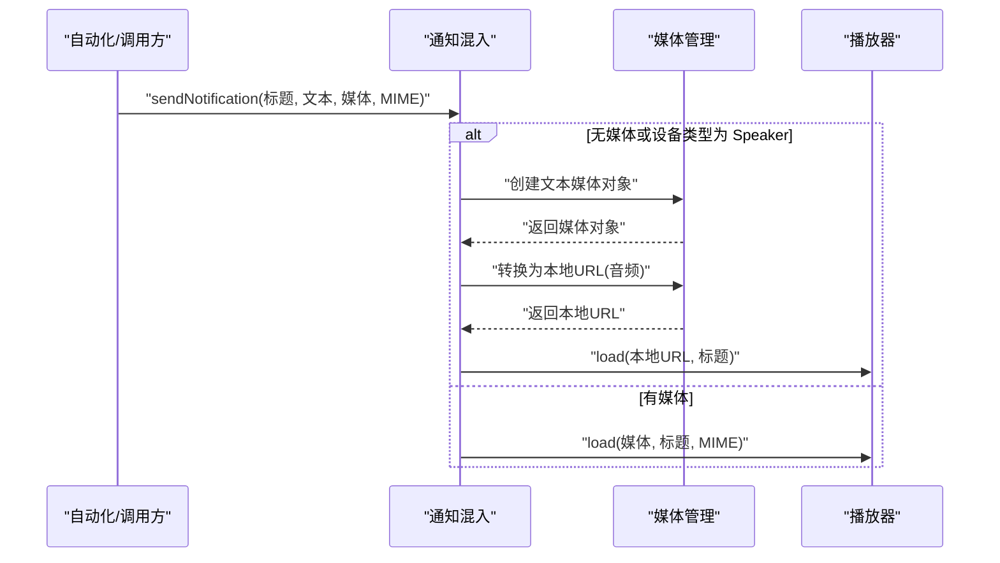
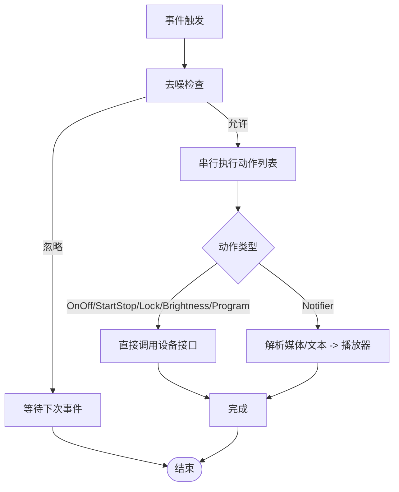
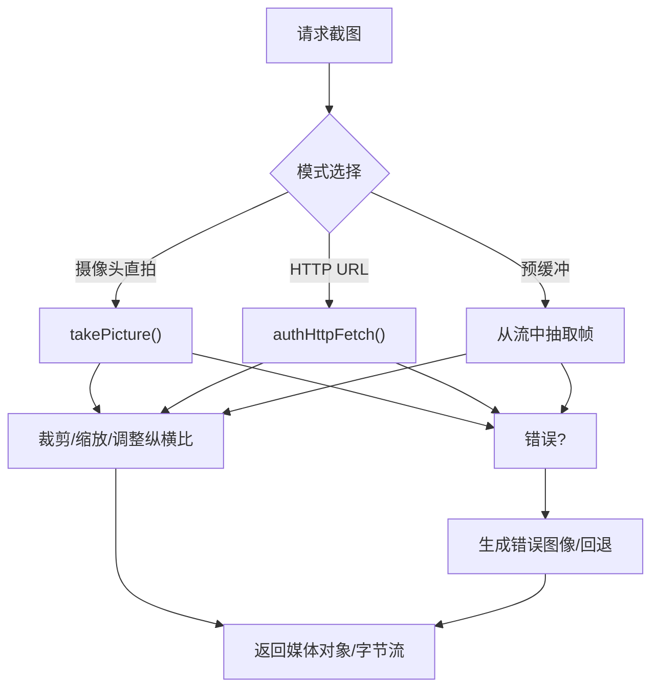
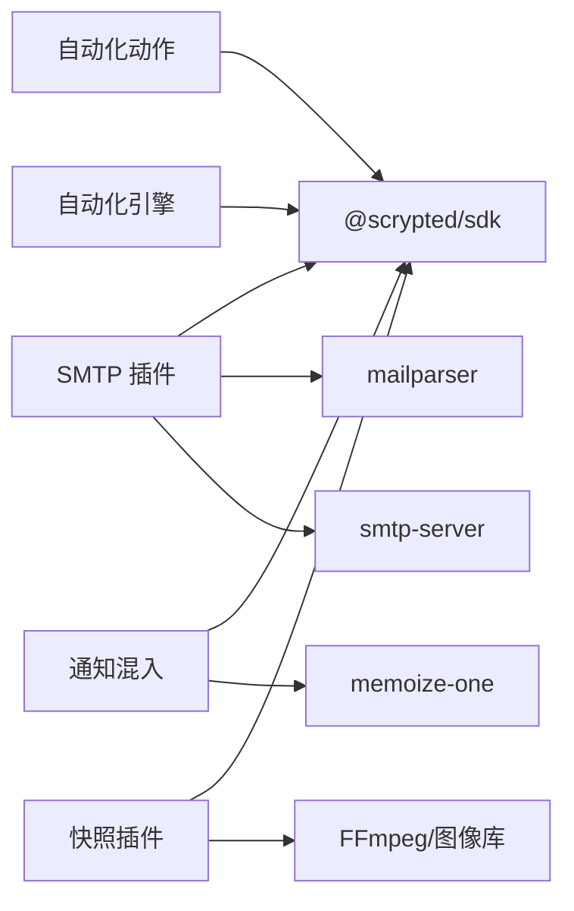

# 通知系统集成

<cite>
**本文引用的文件**
- [plugins/smtp/src/main.ts](file://plugins/smtp/src/main.ts)
- [plugins/smtp/README.md](file://plugins/smtp/README.md)
- [plugins/notifier-mixin/src/main.ts](file://plugins/notifier-mixin/src/main.ts)
- [plugins/core/src/automation-actions.ts](file://plugins/core/src/automation-actions.ts)
- [plugins/core/src/automation.ts](file://plugins/core/src/automation.ts)
- [plugins/snapshot/src/main.ts](file://plugins/snapshot/src/main.ts)
- [sdk/types/src/types.input.ts](file://sdk/types/src/types.input.ts)
</cite>

## 目录
1. [简介](#简介)
2. [项目结构](#项目结构)
3. [核心组件](#核心组件)
4. [架构总览](#架构总览)
5. [详细组件分析](#详细组件分析)
6. [依赖关系分析](#依赖关系分析)
7. [性能考虑](#性能考虑)
8. [故障排查指南](#故障排查指南)
9. [结论](#结论)
10. [附录](#附录)

## 简介
本文件面向 Scrypted 的通知系统集成，重点围绕 SMTP 协议在通知与自动化中的应用进行技术说明。内容涵盖：
- 邮件服务器配置（端口、TLS、认证）、收信解析与设备控制联动
- 通知动作的触发机制（设备状态变化、异常报警、定时提醒、用户操作确认）
- 通知发送实现细节（连接与会话、并发与重试、错误处理）
- 附件处理能力（截图、视频流、媒体对象转换与本地访问）
- SMTP 服务器选择与配置建议（Gmail、Outlook、自建服务器）
- 最佳实践（邮件格式优化、发送频率控制、用户偏好设置）

## 项目结构
与通知系统直接相关的模块主要分布在以下位置：
- SMTP 收信插件：负责监听本地 SMTP 端口，解析邮件并控制设备
- 通知混入插件：为具备播放器接口的设备提供“通知”能力
- 自动化与动作：定义如何将触发事件转化为具体动作（如开关、启动停止、锁具、亮度、程序运行、通知）
- 快照与媒体：提供截图生成、裁剪缩放、错误图像回退、本地媒体 URL 转换等能力
- 类型定义：通知选项与媒体对象的结构化描述

**图表来源**
- [plugins/smtp/src/main.ts:74-197](file://plugins/smtp/src/main.ts#L74-L197)
- [plugins/notifier-mixin/src/main.ts:19-47](file://plugins/notifier-mixin/src/main.ts#L19-L47)
- [plugins/core/src/automation-actions.ts:70-104](file://plugins/core/src/automation-actions.ts#L70-L104)
- [plugins/core/src/automation.ts:30-566](file://plugins/core/src/automation.ts#L30-L566)
- [plugins/snapshot/src/main.ts:159-659](file://plugins/snapshot/src/main.ts#L159-L659)

**章节来源**
- [plugins/smtp/src/main.ts:1-197](file://plugins/smtp/src/main.ts#L1-L197)
- [plugins/notifier-mixin/src/main.ts:1-64](file://plugins/notifier-mixin/src/main.ts#L1-L64)
- [plugins/core/src/automation-actions.ts:1-104](file://plugins/core/src/automation-actions.ts#L1-L104)
- [plugins/core/src/automation.ts:30-566](file://plugins/core/src/automation.ts#L30-L566)
- [plugins/snapshot/src/main.ts:159-659](file://plugins/snapshot/src/main.ts#L159-L659)

## 核心组件
- SMTP 插件（收信触发）：提供本地 SMTP 服务，解析收件人地址，匹配混入实例，按邮件正文关键字控制设备的开关或启停。
- 通知混入（播放器通知）：将文本消息转换为音频 URL 并加载到播放器；支持传入媒体对象或媒体接口标识以获取实时截图/视频流。
- 自动化动作与引擎：将事件映射为具体动作，并提供去噪、串行执行、定时器等控制策略。
- 快照与媒体：提供截图、裁剪、缩放、错误图像回退、本地 URL 转换等能力，支撑通知中图片/视频附件。

**章节来源**
- [plugins/smtp/src/main.ts:9-72](file://plugins/smtp/src/main.ts#L9-L72)
- [plugins/notifier-mixin/src/main.ts:19-47](file://plugins/notifier-mixin/src/main.ts#L19-L47)
- [plugins/core/src/automation-actions.ts:70-104](file://plugins/core/src/automation-actions.ts#L70-L104)
- [plugins/snapshot/src/main.ts:159-659](file://plugins/snapshot/src/main.ts#L159-L659)

## 架构总览
下图展示了从“收到邮件”到“控制设备/发送通知”的整体流程，以及与自动化引擎、通知混入、快照插件的交互。

**图表来源**
- [plugins/smtp/src/main.ts:104-160](file://plugins/smtp/src/main.ts#L104-L160)
- [plugins/notifier-mixin/src/main.ts:24-46](file://plugins/notifier-mixin/src/main.ts#L24-L46)
- [plugins/snapshot/src/main.ts:164-318](file://plugins/snapshot/src/main.ts#L164-L318)

## 详细组件分析

### SMTP 插件（收信触发）
- 功能要点
  - 提供可配置的本地 SMTP 服务，支持端口与 TLS 开关
  - 接受任意用户名与域名的连接（认证可选），解析邮件后按收件人路由至对应混入
  - 混入根据正文关键字控制设备的 OnOff 或 StartStop 行为
- 关键配置
  - SMTP 端口（默认 25，无认证）
  - 是否禁用 TLS（影响 STARTTLS 命令可用性）
- 安全与兼容
  - 允许不安全认证与匿名认证，适合内网或测试环境
  - 解析使用 mailparser，支持多编码与 HTML 文本提取
- 错误处理
  - 解析失败记录错误日志
  - 服务器级错误统一捕获并输出

**图表来源**
- [plugins/smtp/src/main.ts:104-160](file://plugins/smtp/src/main.ts#L104-L160)
- [plugins/smtp/src/main.ts:44-71](file://plugins/smtp/src/main.ts#L44-L71)

**章节来源**
- [plugins/smtp/src/main.ts:74-197](file://plugins/smtp/src/main.ts#L74-L197)
- [plugins/smtp/README.md:1-10](file://plugins/smtp/README.md#L1-L10)

### 通知混入（播放器通知）
- 功能要点
  - 将纯文本消息转换为音频 URL，然后通过播放器加载播放
  - 若传入媒体对象或媒体接口标识，则直接加载该媒体
  - 使用记忆化避免对同一文本重复进行 TTS 转换
- 适用场景
  - 对讲机/门铃播报
  - 扬声器/音响设备的语音提示
  - 与自动化动作配合，实现“收到事件即播报”

**图表来源**
- [plugins/notifier-mixin/src/main.ts:24-46](file://plugins/notifier-mixin/src/main.ts#L24-L46)

**章节来源**
- [plugins/notifier-mixin/src/main.ts:1-64](file://plugins/notifier-mixin/src/main.ts#L1-L64)

### 自动化动作与引擎
- 动作映射
  - OnOff：打开/关闭
  - StartStop：启动/停止
  - Lock：上锁/解锁
  - Brightness：设置亮度
  - Program：运行程序
  - Notifier：发送通知（可带图片/视频）
- 引擎特性
  - 事件去噪：抑制连续相同事件
  - 串行执行：可要求动作执行完毕后再触发
  - 定时器：基于事件源与接口的键值进行复位/重置
- 通知媒体解析
  - 若传入的是设备接口标识（如 Camera/VideoCamera），则自动抓取截图或视频流作为通知媒体

**图表来源**
- [plugins/core/src/automation.ts:480-542](file://plugins/core/src/automation.ts#L480-L542)
- [plugins/core/src/automation-actions.ts:70-104](file://plugins/core/src/automation-actions.ts#L70-L104)

**章节来源**
- [plugins/core/src/automation-actions.ts:1-104](file://plugins/core/src/automation-actions.ts#L1-L104)
- [plugins/core/src/automation.ts:30-566](file://plugins/core/src/automation.ts#L30-L566)

### 快照与媒体（附件支持）
- 截图能力
  - 支持从摄像头直拍、HTTP URL、预缓冲视频帧抽取
  - 可配置默认通道、分辨率、裁剪与缩放、纵横比
- 错误回退
  - 超时/不可用/进行中等错误生成带文字的背景图像
  - 多类错误图像缓存与清理策略
- 本地媒体 URL
  - 将媒体对象转换为本地可访问 URL，便于通知播放或 Web 展示
- 事件/周期性请求的超时与去抖策略

**图表来源**
- [plugins/snapshot/src/main.ts:164-318](file://plugins/snapshot/src/main.ts#L164-L318)
- [plugins/snapshot/src/main.ts:583-644](file://plugins/snapshot/src/main.ts#L583-L644)

**章节来源**
- [plugins/snapshot/src/main.ts:159-659](file://plugins/snapshot/src/main.ts#L159-L659)

### 通知选项与媒体对象
- 通知选项（NotifierOptions）
  - 标题、副标题、正文、语言、方向、标签、时间戳、振动、关键通知、动作按钮、图片等
  - Android 通道、数据载荷等扩展字段
- 媒体对象
  - 支持多种 MIME 类型与本地 URL 访问
  - 与通知混入结合，实现富媒体通知

**章节来源**
- [sdk/types/src/types.input.ts:259-285](file://sdk/types/src/types.input.ts#L259-L285)

## 依赖关系分析
- SMTP 插件依赖
  - SMTPServer：本地 SMTP 服务
  - mailparser：邮件解析
  - Scrypted SDK：系统设备管理、混入基类、存储设置
- 通知混入依赖
  - Scrypted SDK：媒体管理、日志、混入基类
  - memoize-one：文本到语音转换的记忆化
- 自动化与动作
  - 动作映射表：将接口映射到具体实现
  - 自动化引擎：事件注册、去噪、串行执行、定时器
- 快照插件
  - 媒体管理：FFmpeg、图像库（sharp/vips）
  - 权限与认证：HTTP 认证、ACL 校验

**图表来源**
- [plugins/smtp/src/main.ts:1-7](file://plugins/smtp/src/main.ts#L1-L7)
- [plugins/notifier-mixin/src/main.ts:1-6](file://plugins/notifier-mixin/src/main.ts#L1-L6)
- [plugins/core/src/automation-actions.ts:1-8](file://plugins/core/src/automation-actions.ts#L1-L8)
- [plugins/core/src/automation.ts:30-566](file://plugins/core/src/automation.ts#L30-L566)
- [plugins/snapshot/src/main.ts:1-19](file://plugins/snapshot/src/main.ts#L1-L19)

**章节来源**
- [plugins/smtp/src/main.ts:1-7](file://plugins/smtp/src/main.ts#L1-L7)
- [plugins/notifier-mixin/src/main.ts:1-6](file://plugins/notifier-mixin/src/main.ts#L1-L6)
- [plugins/core/src/automation-actions.ts:1-8](file://plugins/core/src/automation-actions.ts#L1-L8)
- [plugins/core/src/automation.ts:30-566](file://plugins/core/src/automation.ts#L30-L566)
- [plugins/snapshot/src/main.ts:1-19](file://plugins/snapshot/src/main.ts#L1-L19)

## 性能考虑
- 连接与并发
  - SMTP 服务采用单实例监听，解析与设备控制为同步流程；建议在高并发场景下评估外部队列或限流
- 文本转语音
  - 使用记忆化减少重复 TTS 转换；错误时重置记忆化函数，避免缓存污染
- 截图与媒体
  - 截图请求带去抖与超时策略；错误图像生成与缓存清理降低 UI 卡顿
  - 图像处理优先使用硬件加速库（sharp/vips），必要时回退到 FFmpeg
- 自动化执行
  - 串行执行与去噪策略避免重复动作；定时器复位可防止频繁触发

[本节为通用指导，无需列出具体文件来源]

## 故障排查指南
- SMTP 无法接收邮件
  - 检查端口与 TLS 设置；确认防火墙开放与路由可达
  - 查看服务器错误日志定位连接/解析问题
- 设备未被控制
  - 确认混入邮箱与收件人一致；核对正文关键字配置
  - 检查设备接口是否包含 OnOff 或 StartStop
- 通知未播放
  - 确认播放器具备 MediaPlayer 接口；检查媒体 URL 是否可访问
  - 若为文本通知，确认 TTS 转换是否成功
- 截图失败
  - 检查摄像头直拍权限、HTTP URL 认证、网络连通性
  - 观察错误图像回退逻辑是否生效

**章节来源**
- [plugins/smtp/src/main.ts:139-144](file://plugins/smtp/src/main.ts#L139-L144)
- [plugins/notifier-mixin/src/main.ts:34-38](file://plugins/notifier-mixin/src/main.ts#L34-L38)
- [plugins/snapshot/src/main.ts:583-606](file://plugins/snapshot/src/main.ts#L583-L606)

## 结论
Scrypted 的通知系统通过“SMTP 收信触发 + 通知混入 + 自动化引擎 + 快照媒体”的组合，实现了从邮件到设备控制与富媒体通知的完整链路。其设计强调易用性与可扩展性：SMTP 插件提供灵活的收信入口，通知混入简化了播放器侧的媒体加载，自动化引擎保障了动作的可靠执行，快照插件提供了高质量的附件素材。在生产环境中，建议结合 TLS、认证与访问控制，合理配置触发条件与频率，确保系统稳定与安全。

[本节为总结性内容，无需列出具体文件来源]

## 附录

### SMTP 服务器选择与配置建议
- Gmail
  - 端口：通常使用加密端口；若启用两步验证，需使用应用专用密码或 OAuth
  - TLS：建议开启 STARTTLS；如遇兼容问题可临时禁用 TLS（仅限内网）
- Outlook/Office 365
  - 端口：常用 587 或 25；建议使用 587 并启用 TLS
  - 认证：建议使用 OAuth 或应用密码
- 自建服务器（Postfix/Exim/Dovecot）
  - 端口：默认 25；可配置 587/465
  - TLS：建议配置证书并启用 STARTTLS
  - 认证：可选 PLAIN/LOGIN 或 CRAM-MD5

[本节为通用配置建议，无需列出具体文件来源]

### 邮件模板设计与定制
- HTML 格式与 CSS
  - 使用内联样式与内嵌资源，提升跨客户端兼容性
  - 避免复杂布局，保持简洁明了
- 图片嵌入
  - 使用 CID 内嵌图片，或通过静态资源托管提供可访问链接
- 动态内容替换
  - 在正文或主题中预留占位符，结合自动化动作进行替换
- 发送频率与用户偏好
  - 通过自动化定时器与去噪策略控制触发频率
  - 提供用户偏好设置（如静音时段、关键词白名单）

[本节为通用设计建议，无需列出具体文件来源]