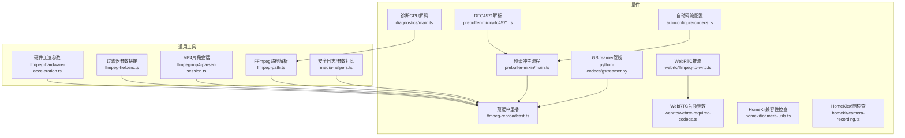
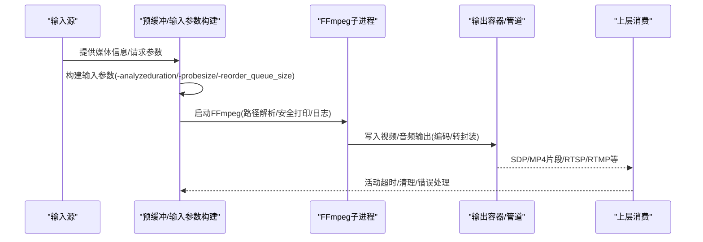
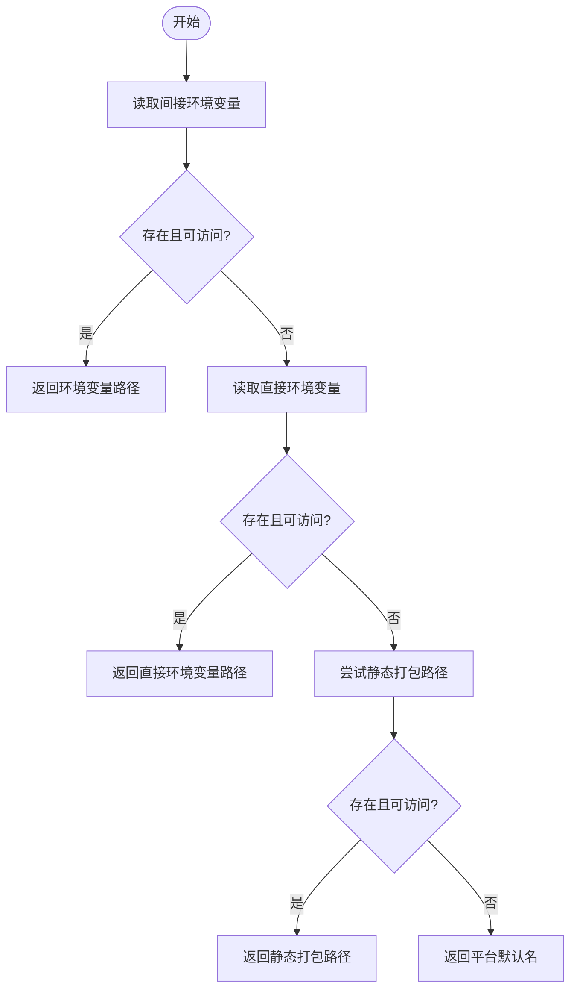
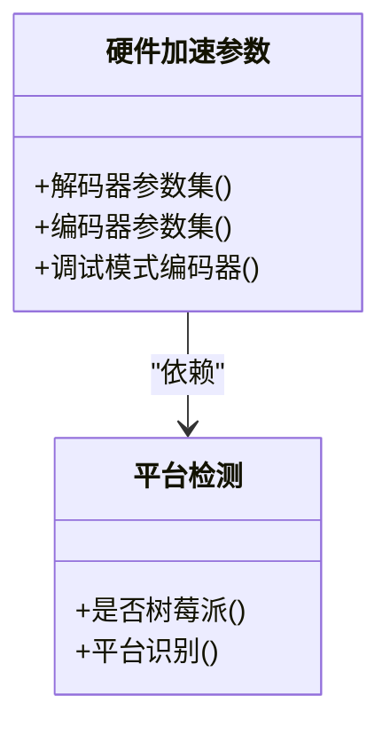
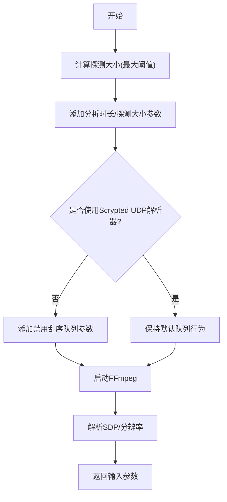
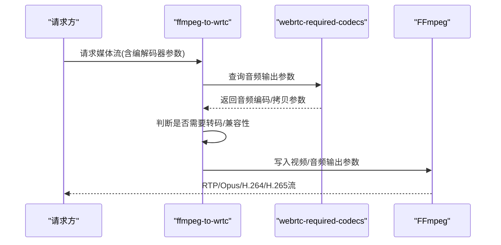
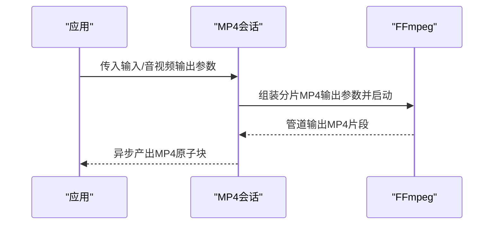
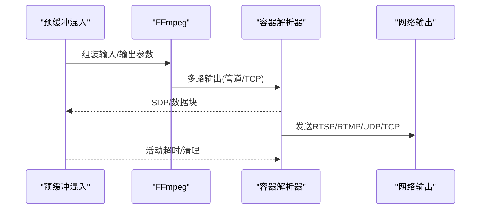
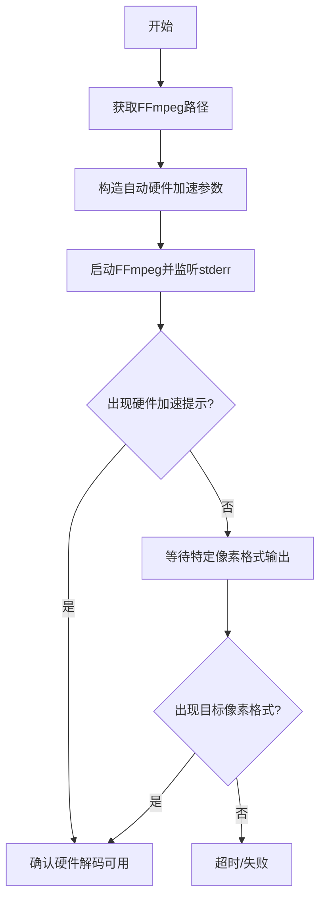
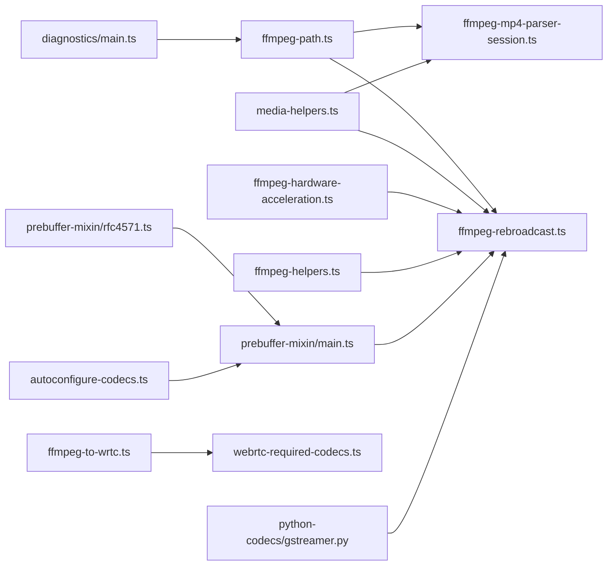

# FFmpeg 集成与编解码

<cite>
**本文引用的文件**
- [ffmpeg-hardware-acceleration.ts](file://common/src/ffmpeg-hardware-acceleration.ts)
- [ffmpeg-helpers.ts](file://common/src/ffmpeg-helpers.ts)
- [ffmpeg-path.ts](file://server/src/plugin/ffmpeg-path.ts)
- [media-helpers.ts](file://server/src/media-helpers.ts)
- [ffmpeg-rebroadcast.ts](file://plugins/prebuffer-mixin/src/ffmpeg-rebroadcast.ts)
- [ffmpeg-mp4-parser-session.ts](file://common/src/ffmpeg-mp4-parser-session.ts)
- [main.ts（诊断插件）](file://plugins/diagnostics/src/main.ts)
- [main.ts（预缓冲混入）](file://plugins/prebuffer-mixin/src/main.ts)
- [rfc4571.ts](file://plugins/prebuffer-mixin/src/rfc4571.ts)
- [webrtc-required-codecs.ts](file://plugins/webrtc/src/webrtc-required-codecs.ts)
- [ffmpeg-to-wrtc.ts](file://plugins/webrtc/src/ffmpeg-to-wrtc.ts)
- [camera-utils.ts](file://plugins/homekit/src/types/camera/camera-utils.ts)
- [camera-recording.ts](file://plugins/homekit/src/types/camera/camera-recording.ts)
- [gstreamer.py](file://plugins/python-codecs/src/gstreamer.py)
- [autoconfigure-codecs.ts](file://common/src/autoconfigure-codecs.ts)
</cite>

## 目录
1. [引言](#引言)
2. [项目结构](#项目结构)
3. [核心组件](#核心组件)
4. [架构总览](#架构总览)
5. [详细组件分析](#详细组件分析)
6. [依赖关系分析](#依赖关系分析)
7. [性能考量](#性能考量)
8. [故障排查指南](#故障排查指南)
9. [结论](#结论)
10. [附录](#附录)

## 引言
本文件面向 Scrypted 的 FFmpeg 集成与编解码系统，系统性阐述以下主题：
- FFmpeg 可执行文件的查找与配置机制
- 编解码器选择策略：硬件加速编解码器的自动检测与优先级排序
- FFmpeg 输入参数构建：RTSP 流参数、输入容器选择、编解码器参数优化
- 媒体转换管道设计：从原始流到目标格式的完整转换链路
- 编解码器权重系统：基于性能与兼容性的最优转换路径选择
- FFmpeg 参数调优指南：缓冲大小、线程数、预设等关键参数建议
- 常见编解码问题的诊断与解决方案

## 项目结构
Scrypted 将 FFmpeg 相关能力分布在通用模块与多个插件中：
- 通用工具层：硬件加速编解码器参数生成、过滤器参数拼接、MP4 片段解析、FFmpeg 路径解析与安全日志
- 插件层：预缓冲重播、WebRTC 推流、HomeKit 录制与兼容性检查、Python GStreamer 码流管线
- 诊断与自动化：诊断插件对 GPU 解码进行验证；自动配置码流参数

图表来源
- [ffmpeg-hardware-acceleration.ts:49-131](file://common/src/ffmpeg-hardware-acceleration.ts#L49-L131)
- [ffmpeg-helpers.ts:1-7](file://common/src/ffmpeg-helpers.ts#L1-L7)
- [ffmpeg-mp4-parser-session.ts:43-65](file://common/src/ffmpeg-mp4-parser-session.ts#L43-L65)
- [ffmpeg-path.ts:5-36](file://server/src/plugin/ffmpeg-path.ts#L5-L36)
- [media-helpers.ts:40-97](file://server/src/media-helpers.ts#L40-L97)
- [ffmpeg-rebroadcast.ts:107-289](file://plugins/prebuffer-mixin/src/ffmpeg-rebroadcast.ts#L107-L289)
- [main.ts（预缓冲混入）:346-1084](file://plugins/prebuffer-mixin/src/main.ts#L346-L1084)
- [rfc4571.ts:98-175](file://plugins/prebuffer-mixin/src/rfc4571.ts#L98-L175)
- [ffmpeg-to-wrtc.ts:184-214](file://plugins/webrtc/src/ffmpeg-to-wrtc.ts#L184-L214)
- [webrtc-required-codecs.ts:88-116](file://plugins/webrtc/src/webrtc-required-codecs.ts#L88-L116)
- [camera-utils.ts:121-141](file://plugins/homekit/src/types/camera/camera-utils.ts#L121-L141)
- [camera-recording.ts:61-100](file://plugins/homekit/src/types/camera/camera-recording.ts#L61-L100)
- [gstreamer.py:325-368](file://plugins/python-codecs/src/gstreamer.py#L325-L368)
- [main.ts（诊断插件）:654-687](file://plugins/diagnostics/src/main.ts#L654-L687)
- [autoconfigure-codecs.ts:141-209](file://common/src/autoconfigure-codecs.ts#L141-L209)

章节来源
- [ffmpeg-hardware-acceleration.ts:1-147](file://common/src/ffmpeg-hardware-acceleration.ts#L1-L147)
- [ffmpeg-helpers.ts:1-8](file://common/src/ffmpeg-helpers.ts#L1-L8)
- [ffmpeg-mp4-parser-session.ts:1-66](file://common/src/ffmpeg-mp4-parser-session.ts#L1-L66)
- [ffmpeg-path.ts:1-38](file://server/src/plugin/ffmpeg-path.ts#L1-L38)
- [media-helpers.ts:1-98](file://server/src/media-helpers.ts#L1-L98)
- [ffmpeg-rebroadcast.ts:1-290](file://plugins/prebuffer-mixin/src/ffmpeg-rebroadcast.ts#L1-L290)
- [main.ts（预缓冲混入）:346-1084](file://plugins/prebuffer-mixin/src/main.ts#L346-L1084)
- [rfc4571.ts:98-175](file://plugins/prebuffer-mixin/src/rfc4571.ts#L98-L175)
- [ffmpeg-to-wrtc.ts:184-214](file://plugins/webrtc/src/ffmpeg-to-wrtc.ts#L184-L214)
- [webrtc-required-codecs.ts:88-116](file://plugins/webrtc/src/webrtc-required-codecs.ts#L88-L116)
- [camera-utils.ts:121-141](file://plugins/homekit/src/types/camera/camera-utils.ts#L121-L141)
- [camera-recording.ts:61-100](file://plugins/homekit/src/types/camera/camera-recording.ts#L61-L100)
- [gstreamer.py:325-368](file://plugins/python-codecs/src/gstreamer.py#L325-L368)
- [main.ts（诊断插件）:654-687](file://plugins/diagnostics/src/main.ts#L654-L687)
- [autoconfigure-codecs.ts:141-209](file://common/src/autoconfigure-codecs.ts#L141-L209)

## 核心组件
- FFmpeg 路径解析：支持环境变量覆盖、静态打包路径回退与平台默认名
- 硬件加速参数：按平台与设备类型返回解码/编码器参数集合
- 安全日志与参数打印：过滤噪声日志、保护输入 URL 密码
- 输入参数构建：RTSP/UDP/TCP 等输入参数、探测时长与队列设置
- WebRTC 输出参数：音频编码器、采样率、码率、缓冲区与 Opus 应用模式
- MP4 片段输出：分片 MP4 输出参数与管道解析
- 预缓冲与重播：多容器输出、SDP 解析、活动超时与清理
- 自动码流配置：分辨率、帧率、关键帧间隔、质量与配置记录

章节来源
- [ffmpeg-path.ts:5-36](file://server/src/plugin/ffmpeg-path.ts#L5-L36)
- [ffmpeg-hardware-acceleration.ts:49-131](file://common/src/ffmpeg-hardware-acceleration.ts#L49-L131)
- [media-helpers.ts:40-97](file://server/src/media-helpers.ts#L40-L97)
- [main.ts（预缓冲混入）:1052-1084](file://plugins/prebuffer-mixin/src/main.ts#L1052-L1084)
- [webrtc-required-codecs.ts:88-116](file://plugins/webrtc/src/webrtc-required-codecs.ts#L88-L116)
- [ffmpeg-mp4-parser-session.ts:33-65](file://common/src/ffmpeg-mp4-parser-session.ts#L33-L65)
- [ffmpeg-rebroadcast.ts:107-289](file://plugins/prebuffer-mixin/src/ffmpeg-rebroadcast.ts#L107-L289)
- [autoconfigure-codecs.ts:141-209](file://common/src/autoconfigure-codecs.ts#L141-L209)

## 架构总览
下图展示从输入源到目标输出的典型链路：输入参数构建 → FFmpeg 子进程 → 多容器输出/解析 → 上层消费。

图表来源
- [main.ts（预缓冲混入）:1052-1084](file://plugins/prebuffer-mixin/src/main.ts#L1052-L1084)
- [ffmpeg-rebroadcast.ts:107-289](file://plugins/prebuffer-mixin/src/ffmpeg-rebroadcast.ts#L107-L289)
- [media-helpers.ts:40-97](file://server/src/media-helpers.ts#L40-L97)
- [ffmpeg-path.ts:5-36](file://server/src/plugin/ffmpeg-path.ts#L5-L36)

## 详细组件分析

### 组件A：FFmpeg 路径解析与配置
- 优先级：环境变量间接变量 → 显式环境变量 → 静态打包路径 → 平台默认名
- 作用：为所有使用 FFmpeg 的模块提供统一可执行文件路径

图表来源
- [ffmpeg-path.ts:5-36](file://server/src/plugin/ffmpeg-path.ts#L5-L36)

章节来源
- [ffmpeg-path.ts:1-38](file://server/src/plugin/ffmpeg-path.ts#L1-L38)

### 组件B：硬件加速编解码器参数生成
- 解码器参数：按平台返回 CUDA/CUVID/VAAPI/V4L2/QuickSync/VideoToolbox 等参数集合
- 编码器参数：按平台返回对应硬件编码器或软件编码器参数集合
- 调试模式：提供 ultrafast、禁用 B 帧等参数以降低延迟

图表来源
- [ffmpeg-hardware-acceleration.ts:49-131](file://common/src/ffmpeg-hardware-acceleration.ts#L49-L131)

章节来源
- [ffmpeg-hardware-acceleration.ts:1-147](file://common/src/ffmpeg-hardware-acceleration.ts#L1-L147)

### 组件C：输入参数构建（RTSP/UDP/TCP）
- 关键参数：分析时长、探测大小、避免乱序队列（在 UDP 场景）
- 预缓冲：根据已缓存字节动态调整探测大小，提升首包速度
- SDP/分辨率解析：结合 RTP/UDP 解析与 SPS，获取分辨率与编解码信息

图表来源
- [main.ts（预缓冲混入）:1052-1084](file://plugins/prebuffer-mixin/src/main.ts#L1052-L1084)
- [rfc4571.ts:98-175](file://plugins/prebuffer-mixin/src/rfc4571.ts#L98-L175)

章节来源
- [main.ts（预缓冲混入）:1052-1084](file://plugins/prebuffer-mixin/src/main.ts#L1052-L1084)
- [rfc4571.ts:98-175](file://plugins/prebuffer-mixin/src/rfc4571.ts#L98-L175)

### 组件D：WebRTC 输出参数与编解码器权重
- 音频：按目标编解码器参数选择 copy 或显式编码器，设置采样率、通道、缓冲区与 Opus 应用模式
- 视频：根据是否需要转码与兼容性决定复制或转码，设置码率、缓冲、最大速率与缩放滤镜
- 权重系统：优先复制，其次在兼容模式下保守码率与帧率，确保跨设备稳定

图表来源
- [ffmpeg-to-wrtc.ts:184-214](file://plugins/webrtc/src/ffmpeg-to-wrtc.ts#L184-L214)
- [webrtc-required-codecs.ts:88-116](file://plugins/webrtc/src/webrtc-required-codecs.ts#L88-L116)

章节来源
- [ffmpeg-to-wrtc.ts:184-214](file://plugins/webrtc/src/ffmpeg-to-wrtc.ts#L184-L214)
- [webrtc-required-codecs.ts:88-116](file://plugins/webrtc/src/webrtc-required-codecs.ts#L88-L116)

### 组件E：MP4 片段输出与解析
- 输出参数：分片 MP4 标志位组合，便于边播边录
- 会话：通过管道输出，异步解析 MP4 原子块

图表来源
- [ffmpeg-mp4-parser-session.ts:43-65](file://common/src/ffmpeg-mp4-parser-session.ts#L43-L65)

章节来源
- [ffmpeg-mp4-parser-session.ts:1-66](file://common/src/ffmpeg-mp4-parser-session.ts#L1-L66)

### 组件F：预缓冲与重播（多容器输出）
- 多容器：RTSP/RTMP/UDP/TCP 等，按需建立管道或 TCP 出口
- SDP 解析：从 FFmpeg 输出中提取 SDP，用于后续协商
- 活动超时：空闲超时自动清理，防止资源泄露

图表来源
- [ffmpeg-rebroadcast.ts:107-289](file://plugins/prebuffer-mixin/src/ffmpeg-rebroadcast.ts#L107-L289)

章节来源
- [ffmpeg-rebroadcast.ts:1-290](file://plugins/prebuffer-mixin/src/ffmpeg-rebroadcast.ts#L1-L290)

### 组件G：诊断与兼容性
- GPU 解码诊断：通过 FFmpeg 自动硬件加速并观察输出，确认硬件解码可用
- HomeKit 兼容性：检查视频编解码器是否为 H.264，必要时提示启用重播插件
- 录制检查：解析 H.264 片段，判断是否包含关键帧

图表来源
- [main.ts（诊断插件）:654-687](file://plugins/diagnostics/src/main.ts#L654-L687)

章节来源
- [main.ts（诊断插件）:654-687](file://plugins/diagnostics/src/main.ts#L654-L687)
- [camera-utils.ts:121-141](file://plugins/homekit/src/types/camera/camera-utils.ts#L121-L141)
- [camera-recording.ts:61-100](file://plugins/homekit/src/types/camera/camera-recording.ts#L61-L100)

### 组件H：自动码流配置
- 根据设备能力与分辨率范围，设定合理的分辨率、帧率、码率、关键帧间隔与质量
- 记录配置以便审计与排障

章节来源
- [autoconfigure-codecs.ts:141-209](file://common/src/autoconfigure-codecs.ts#L141-L209)

## 依赖关系分析
- 低耦合高内聚：硬件加速参数独立于平台检测；输入参数构建与解析器解耦
- 外部依赖：FFmpeg 可执行文件路径由平台与环境变量决定；日志与安全打印由通用模块提供
- 循环依赖规避：各插件仅依赖通用模块接口，未见循环导入

图表来源
- [ffmpeg-path.ts:5-36](file://server/src/plugin/ffmpeg-path.ts#L5-L36)
- [media-helpers.ts:40-97](file://server/src/media-helpers.ts#L40-L97)
- [ffmpeg-hardware-acceleration.ts:49-131](file://common/src/ffmpeg-hardware-acceleration.ts#L49-L131)
- [ffmpeg-helpers.ts:1-7](file://common/src/ffmpeg-helpers.ts#L1-L7)
- [ffmpeg-rebroadcast.ts:107-289](file://plugins/prebuffer-mixin/src/ffmpeg-rebroadcast.ts#L107-L289)
- [ffmpeg-mp4-parser-session.ts:43-65](file://common/src/ffmpeg-mp4-parser-session.ts#L43-L65)
- [main.ts（预缓冲混入）:346-1084](file://plugins/prebuffer-mixin/src/main.ts#L346-L1084)
- [rfc4571.ts:98-175](file://plugins/prebuffer-mixin/src/rfc4571.ts#L98-L175)
- [ffmpeg-to-wrtc.ts:184-214](file://plugins/webrtc/src/ffmpeg-to-wrtc.ts#L184-L214)
- [webrtc-required-codecs.ts:88-116](file://plugins/webrtc/src/webrtc-required-codecs.ts#L88-L116)
- [main.ts（诊断插件）:654-687](file://plugins/diagnostics/src/main.ts#L654-L687)
- [autoconfigure-codecs.ts:141-209](file://common/src/autoconfigure-codecs.ts#L141-L209)
- [gstreamer.py:325-368](file://plugins/python-codecs/src/gstreamer.py#L325-L368)

## 性能考量
- 输入探测优化
  - 动态探测大小：根据预缓冲字节上限设置探测大小，减少首包等待时间
  - 禁用乱序队列：在 UDP 场景下避免额外延迟
- 编码器选择
  - 优先硬件解码/编码器，降低 CPU 占用；软件编码器用于调试与兼容性
  - 转码时采用保守码率与帧率，确保跨设备稳定性
- 日志与安全
  - 过滤噪声日志，仅在检测到音视频后停止高频日志
  - 对输入 URL 敏感参数进行脱敏打印

章节来源
- [main.ts（预缓冲混入）:1052-1084](file://plugins/prebuffer-mixin/src/main.ts#L1052-L1084)
- [ffmpeg-hardware-acceleration.ts:49-131](file://common/src/ffmpeg-hardware-acceleration.ts#L49-L131)
- [ffmpeg-to-wrtc.ts:184-214](file://plugins/webrtc/src/ffmpeg-to-wrtc.ts#L184-L214)
- [media-helpers.ts:40-97](file://server/src/media-helpers.ts#L40-L97)

## 故障排查指南
- 无法找到 FFmpeg
  - 检查环境变量与静态打包路径是否正确；确认平台默认名可用
- GPU 解码不生效
  - 使用诊断插件验证自动硬件加速输出；确认目标像素格式出现
- WebRTC 推流失败
  - 核对音频编码器参数与采样率/通道；确认视频转码参数与缓冲设置
- 预缓冲/重播无输出
  - 检查容器输出参数与 TCP/管道连接；确认 SDP 解析成功
- HomeKit 兼容性告警
  - 确保视频编解码器为 H.264；必要时启用重播插件

章节来源
- [ffmpeg-path.ts:5-36](file://server/src/plugin/ffmpeg-path.ts#L5-L36)
- [main.ts（诊断插件）:654-687](file://plugins/diagnostics/src/main.ts#L654-L687)
- [webrtc-required-codecs.ts:88-116](file://plugins/webrtc/src/webrtc-required-codecs.ts#L88-L116)
- [ffmpeg-rebroadcast.ts:107-289](file://plugins/prebuffer-mixin/src/ffmpeg-rebroadcast.ts#L107-L289)
- [camera-utils.ts:121-141](file://plugins/homekit/src/types/camera/camera-utils.ts#L121-L141)

## 结论
Scrypted 的 FFmpeg 集成以“路径解析 + 硬件加速参数 + 输入参数构建 + 多场景输出”为核心，配合安全日志与诊断工具，形成从输入到输出的完整链路。通过权重化的编解码器选择与保守的转码参数，兼顾性能与兼容性，满足多平台与多设备场景需求。

## 附录
- 关键参数建议
  - 输入探测：根据预缓冲字节设置探测大小；UDP 下禁用乱序队列
  - 转码：保守码率与帧率；必要时启用缩放滤镜；软件编码器用于调试
  - 音频：按目标编解码器参数选择 copy 或显式编码器；设置缓冲与采样率
  - 日志：开启噪声过滤；必要时启用详细日志开关