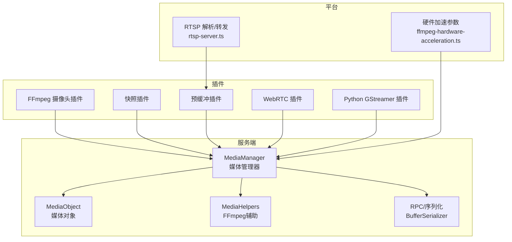
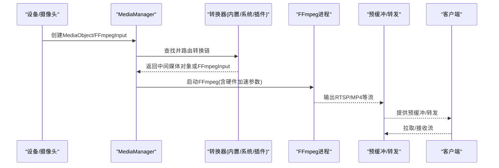
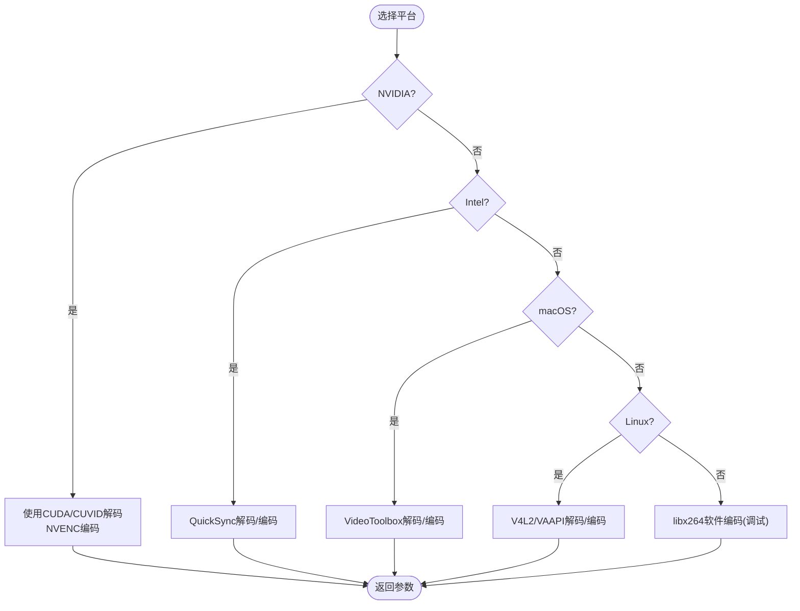
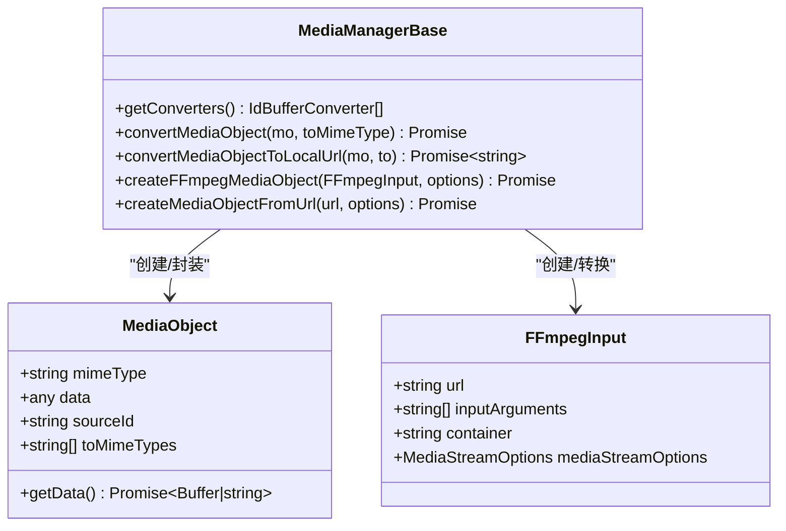
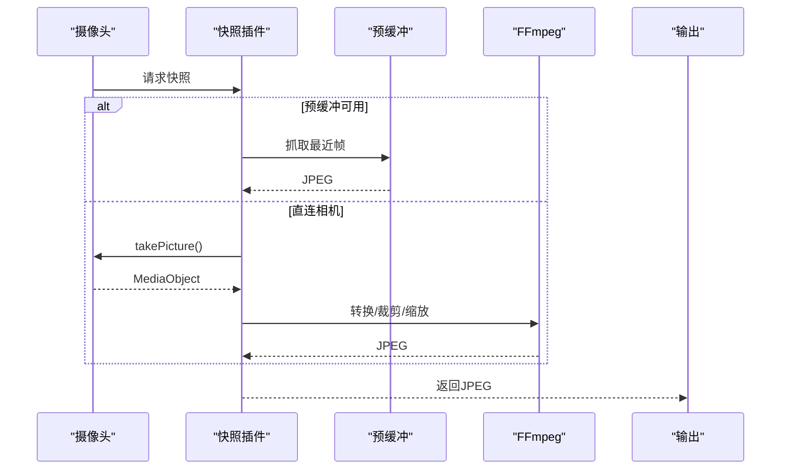
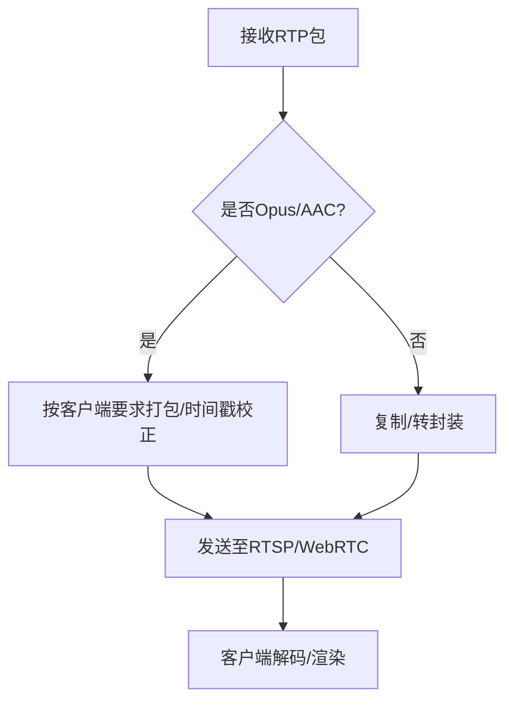
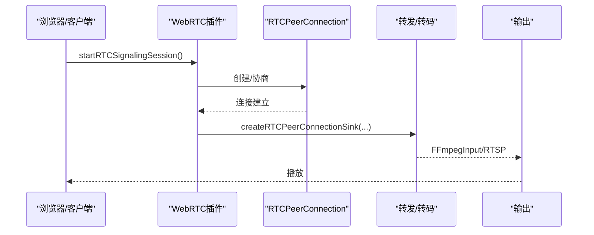
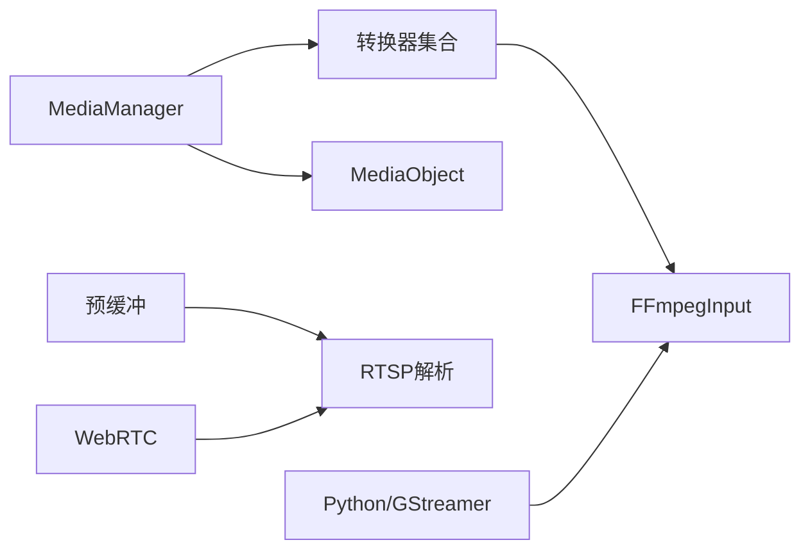

# 媒体处理系统

<cite>
**本文引用的文件**
- [ffmpeg-hardware-acceleration.ts](file://common/src/ffmpeg-hardware-acceleration.ts)
- [media-helpers.ts](file://server/src/media-helpers.ts)
- [mediaobject.ts](file://server/src/plugin/mediaobject.ts)
- [media.ts](file://server/src/plugin/media.ts)
- [types.input.ts](file://sdk/types/src/types.input.ts)
- [main.ts](file://plugins/ffmpeg-camera/src/main.ts)
- [main.ts](file://plugins/snapshot/src/main.ts)
- [main.ts](file://plugins/prebuffer-mixin/src/main.ts)
- [main.ts](file://plugins/webrtc/src/main.ts)
- [gstreamer.py](file://plugins/python-codecs/src/gstreamer.py)
- [gstreamer_postprocess.py](file://plugins/python-codecs/src/gstreamer_postprocess.py)
- [h265-packetizer.ts](file://plugins/webrtc/src/h265-packetizer.ts)
- [onvif-configure.ts](file://plugins/onvif/src/onvif-configure.ts)
- [rfc4571.ts](file://plugins/prebuffer-mixin/src/rfc4571.ts)
- [rtsp-session.ts](file://plugins/prebuffer-mixin/src/rtsp-session.ts)
- [rtsp-server.ts](file://common/src/rtsp-server.ts)
- [rpc.ts](file://server/src/rpc.ts)
- [rpc-buffer-serializer.ts](file://server/src/rpc-buffer-serializer.ts)
- [rpc_reader.py](file://server/python/rpc_reader.py)
- [node-thread-worker.ts](file://server/src/plugin/runtime/node-thread-worker.ts)
</cite>

## 目录
1. [简介](#简介)
2. [项目结构](#项目结构)
3. [核心组件](#核心组件)
4. [架构总览](#架构总览)
5. [详细组件分析](#详细组件分析)
6. [依赖关系分析](#依赖关系分析)
7. [性能考量](#性能考量)
8. [故障排查指南](#故障排查指南)
9. [结论](#结论)
10. [附录](#附录)

## 简介
本技术文档面向 Scrypted 的媒体处理系统，聚焦于 FFmpeg 集成架构与媒体处理流水线，覆盖编解码器选择、硬件加速策略、流媒体处理管道、视频/音频处理机制、媒体对象管理、性能优化与故障恢复等主题。文档以代码级可视化方式呈现系统关键路径，并提供可操作的排障建议与最佳实践。

## 项目结构
Scrypted 的媒体处理由“服务端媒体管理器”“插件化转换器”“平台特定硬件加速”“预缓冲与转发”“WebRTC 转码/代理”等模块协同完成。核心文件分布如下：
- 通用硬件加速与编解码参数：common/src/ffmpeg-hardware-acceleration.ts
- 服务端媒体对象与转换：server/src/plugin/media*.ts、sdk/types/src/types.input.ts
- 常用媒体工具（日志、安全退出）：server/src/media-helpers.ts
- 插件示例：plugins/ffmpeg-camera、plugins/snapshot、plugins/prebuffer-mixin、plugins/webrtc
- Python/GStreamer 辅助：plugins/python-codecs/src/gstreamer*.py
- ONVIF/RTSP/RFC4571 解析：plugins/onvif、plugins/prebuffer-mixin、common/src/rtsp-server.ts
- RPC 与缓冲序列化：server/src/rpc*.ts、server/python/rpc_reader.py、server/src/plugin/runtime/node-thread-worker.ts

图表来源
- [media.ts:40-472](file://server/src/plugin/media.ts#L40-L472)
- [mediaobject.ts:5-25](file://server/src/plugin/mediaobject.ts#L5-L25)
- [media-helpers.ts:1-98](file://server/src/media-helpers.ts#L1-L98)
- [ffmpeg-hardware-acceleration.ts:49-131](file://common/src/ffmpeg-hardware-acceleration.ts#L49-L131)
- [rtsp-server.ts:279-314](file://common/src/rtsp-server.ts#L279-L314)

章节来源
- [media.ts:1-514](file://server/src/plugin/media.ts#L1-L514)
- [media-helpers.ts:1-98](file://server/src/media-helpers.ts#L1-L98)
- [ffmpeg-hardware-acceleration.ts:1-147](file://common/src/ffmpeg-hardware-acceleration.ts#L1-L147)

## 核心组件
- 媒体管理器（MediaManager）
  - 提供媒体对象创建、类型转换、URL/本地化转换、内置/系统/插件转换器注册与路由。
  - 关键实现：convertMediaObject、convert、createFFmpegMediaObject、createMediaObjectFromUrl。
- 媒体对象（MediaObject）
  - 封装 mimeType、data、sourceId、toMimeTypes 等元信息；支持远程代理与 RPC 序列化。
- FFmpeg 输入（FFmpegInput）
  - 统一承载输入 URL、容器、编解码参数、媒体流选项等，贯穿转换与转发链路。
- 硬件加速参数（CodecArgs）
  - 针对不同平台（NVIDIA/CUDA、Intel QuickSync、macOS VideoToolbox、Linux V4L2/VAAPI、ARM Mali）生成解码/编码参数。
- 常用媒体工具
  - 安全退出 FFmpeg 进程、首帧检测日志、敏感参数脱敏打印。

章节来源
- [media.ts:281-311](file://server/src/plugin/media.ts#L281-L311)
- [mediaobject.ts:5-25](file://server/src/plugin/mediaobject.ts#L5-L25)
- [types.input.ts:1936-1966](file://sdk/types/src/types.input.ts#L1936-L1966)
- [ffmpeg-hardware-acceleration.ts:49-131](file://common/src/ffmpeg-hardware-acceleration.ts#L49-L131)
- [media-helpers.ts:11-97](file://server/src/media-helpers.ts#L11-L97)

## 架构总览
媒体处理从“设备采集/外部 URL”开始，经“媒体对象封装与转换”，在“硬件加速/软件转码”与“预缓冲/转发”之间按需切换，最终到达“客户端播放（WebRTC/RTSP/HTTP）”。

图表来源
- [media.ts:313-471](file://server/src/plugin/media.ts#L313-L471)
- [media-helpers.ts:40-71](file://server/src/media-helpers.ts#L40-L71)
- [main.ts:460-719](file://plugins/prebuffer-mixin/src/main.ts#L460-L719)

## 详细组件分析

### FFmpeg 集成与硬件加速
- 平台差异化参数
  - NVIDIA CUDA/CUVID：自动硬件解码，输出 NV12；编码器可选 NVENC。
  - Intel QuickSync：Windows 使用 h264_qsv；Linux 可用 V4L2。
  - macOS VideoToolbox：自动硬件加速。
  - Linux VAAPI/NVIDIA NVENC/V4L2/Mali：按平台启用相应解码/编码器。
- 编解码器选择
  - 解码：优先硬件，失败回退软件解码；编码：默认 libx264（调试模式），可切换硬件编码器。
- 参数生成
  - getH264DecoderArgs/getH264EncoderArgs 返回平台对应的命令行参数字典，便于 UI 展示与选择。

图表来源
- [ffmpeg-hardware-acceleration.ts:49-131](file://common/src/ffmpeg-hardware-acceleration.ts#L49-L131)

章节来源
- [ffmpeg-hardware-acceleration.ts:49-131](file://common/src/ffmpeg-hardware-acceleration.ts#L49-L131)

### 媒体对象管理与转换
- MediaObject
  - 封装 mimeType、data、sourceId、toMimeTypes；支持远程代理属性与 RPC 序列化。
- MediaManager
  - 内置转换器：HTTP/文件/URL 到 MediaObject、FFmpegInput 互转、图像转换等。
  - 路由算法：基于 MIME 类型与权重构建图，使用 Dijkstra 寻找最短转换路径。
  - URL 生成：convertMediaObjectToLocalUrl/ToUrl，支持本地/公网 URL。
- FFmpegInput
  - 统一承载输入参数、容器、媒体流选项，作为转换与转发的输入。

图表来源
- [mediaobject.ts:5-25](file://server/src/plugin/mediaobject.ts#L5-L25)
- [media.ts:281-311](file://server/src/plugin/media.ts#L281-L311)
- [types.input.ts:1936-1966](file://sdk/types/src/types.input.ts#L1936-L1966)

章节来源
- [mediaobject.ts:5-25](file://server/src/plugin/mediaobject.ts#L5-L25)
- [media.ts:313-471](file://server/src/plugin/media.ts#L313-L471)
- [types.input.ts:1936-1966](file://sdk/types/src/types.input.ts#L1936-L1966)

### 视频流处理与格式转换
- FFmpeg 摄像头插件
  - 支持多路输入参数，解析并创建 FFmpegInput，返回 MediaObject。
  - 可配置禁音、音频软静音等。
- 快照插件
  - 优先从预缓冲抓拍，失败回退相机直连或预设 URL；支持裁剪、缩放、模糊、文本叠加。
  - 多路重试与超时控制，错误时生成占位图。
- 预缓冲与转发
  - 持续拉取上游流，维护固定时长的环形缓冲，按需向客户端推送。
  - 自动检测分辨率、码率、编解码器，支持 Scrypted/GStreamer/FFmpeg 三种解析器。
  - 低电量/未充电时可限制后台活动，按需启动。

图表来源
- [main.ts:164-503](file://plugins/snapshot/src/main.ts#L164-L503)
- [main.ts:460-719](file://plugins/prebuffer-mixin/src/main.ts#L460-L719)

章节来源
- [main.ts:110-125](file://plugins/ffmpeg-camera/src/main.ts#L110-L125)
- [main.ts:164-503](file://plugins/snapshot/src/main.ts#L164-L503)
- [main.ts:460-719](file://plugins/prebuffer-mixin/src/main.ts#L460-L719)

### 音频处理与音视频同步
- 音频编解码
  - WebRTC：默认要求 Opus，兼容 G.711/PCMU/PCMA；编码器参数严格匹配采样率/通道/比特率。
  - HomeKit：AAC LC 或 AAC ELD，支持 libfdk_aac；音频缓冲与打包时间严格控制。
- 音视频同步
  - 预缓冲：通过时间戳与 SPS/IDR 关键帧定位同步点，确保首帧一致性。
  - RTSP：Interleaved TCP/UDP 接收，按通道映射与时间戳推进。
  - RFC4571：自定义帧前缀与类型标记，便于区分音视频与解析分辨率。

图表来源
- [h265-packetizer.ts:597-634](file://plugins/webrtc/src/h265-packetizer.ts#L597-L634)
- [main.ts:138-175](file://plugins/prebuffer-mixin/src/rfc4571.ts#L138-L175)
- [rtsp-session.ts:113-148](file://plugins/prebuffer-mixin/src/rtsp-session.ts#L113-L148)

章节来源
- [h265-packetizer.ts:597-634](file://plugins/webrtc/src/h265-packetizer.ts#L597-L634)
- [main.ts:138-175](file://plugins/prebuffer-mixin/src/rfc4571.ts#L138-L175)
- [rtsp-session.ts:113-148](file://plugins/prebuffer-mixin/src/rtsp-session.ts#L113-L148)

### WebRTC 转码/代理与兼容性
- 信令与连接
  - 支持 RTCSignalingChannel/RTCSignalingClient；可透传或按需转码。
  - ICE/TURN/STUN 配置可自定义；IPv4/IPv6 候选过滤（如 6to4 禁用）。
- 转码策略
  - 最大兼容模式：强制参考编解码（如 Opus、PCMU/PCMA），降低客户端适配成本。
  - 云侧转发：将浏览器/客户端的媒体轨道转发到 RTSP/FFmpeg 输入。
- 连接生命周期
  - 建立/协商/连接/关闭；RPC 对象通过数据通道传输，支持缓冲直传。

图表来源
- [main.ts:114-143](file://plugins/webrtc/src/main.ts#L114-L143)
- [main.ts:305-366](file://plugins/webrtc/src/main.ts#L305-L366)
- [main.ts:432-462](file://plugins/webrtc/src/main.ts#L432-L462)

章节来源
- [main.ts:114-143](file://plugins/webrtc/src/main.ts#L114-L143)
- [main.ts:305-366](file://plugins/webrtc/src/main.ts#L305-L366)
- [main.ts:432-462](file://plugins/webrtc/src/main.ts#L432-L462)

### ONVIF/RTSP 设备能力与码率控制
- ONVIF 配置
  - 自动枚举 Profile/编码器/分辨率/帧率/码率/比特率控制等，生成 UrlMediaStreamOptions。
- RTSP 流解析
  - 解析 SDP、提取编解码器、分辨率、关键帧间隔；支持 UDP/TCP 传输模式。
- 码率控制
  - 读取设备配置中的恒定/可变比特率、GOP 长度、帧率范围，指导转码参数。

章节来源
- [onvif-configure.ts:178-202](file://plugins/onvif/src/onvif-configure.ts#L178-L202)
- [rtsp-session.ts:113-148](file://plugins/prebuffer-mixin/src/rtsp-session.ts#L113-L148)
- [types.input.ts:822-831](file://sdk/types/src/types.input.ts#L822-L831)

### Python/GStreamer 辅助与后处理
- GStreamer 管道
  - 支持 TCP/RTSP 输入，自动选择 vtdec_hw/avdec_h264 等解码器；根据容器选择 demux。
- 后处理
  - VA-API 后处理（可选）；支持裁剪/缩放/格式转换（RGBA/GRAY8）。

章节来源
- [gstreamer.py:325-368](file://plugins/python-codecs/src/gstreamer.py#L325-L368)
- [gstreamer_postprocess.py:125-166](file://plugins/python-codecs/src/gstreamer_postprocess.py#L125-L166)

## 依赖关系分析
- 耦合与内聚
  - MediaManager 对转换器的依赖通过 MIME 类型与权重解耦；转换链动态构建，内聚于类型匹配与权重计算。
  - 预缓冲插件与 RTSP 解析器耦合紧密，共同保证首帧同步与分辨率检测。
- 外部依赖
  - FFmpeg 可执行程序路径通过系统环境变量/内置探测获取。
  - WebRTC 依赖 ICE/TURN/STUN 服务器配置；RPC 依赖数据通道与缓冲直传。
- 循环依赖
  - 未发现直接循环；RPC 序列化在服务端与插件间单向传递。

图表来源
- [media.ts:382-421](file://server/src/plugin/media.ts#L382-L421)
- [main.ts:460-719](file://plugins/prebuffer-mixin/src/main.ts#L460-L719)
- [main.ts:305-366](file://plugins/webrtc/src/main.ts#L305-L366)
- [gstreamer.py:325-368](file://plugins/python-codecs/src/gstreamer.py#L325-L368)

章节来源
- [media.ts:382-421](file://server/src/plugin/media.ts#L382-L421)

## 性能考量
- 缓冲策略
  - 预缓冲维持固定时长（约 10 秒），按时间戳滑动窗口清理，避免内存膨胀。
  - 首帧同步：优先 SPS/IDR 关键帧，减少客户端黑屏时间。
- 并发处理
  - WebRTC 插件使用 zygote/fork 管理连接生命周期，避免主线程阻塞。
  - Worker 线程/进程间缓冲直传（TransferList/BufferSerializer），降低拷贝开销。
- 内存管理
  - RPC 缓冲序列化采用 Base64 回退与 Sideband 传输结合；服务端/Python 侧均提供缓冲序列化实现。
  - 预缓冲使用环形数组与定期切片，减少碎片化。
- 码率与分辨率
  - 依据设备能力与客户端需求动态调整；预缓冲阶段检测分辨率与码率，指导后续转码参数。

章节来源
- [main.ts:29-719](file://plugins/prebuffer-mixin/src/main.ts#L29-L719)
- [node-thread-worker.ts:8-40](file://server/src/plugin/runtime/node-thread-worker.ts#L8-L40)
- [rpc-buffer-serializer.ts:14-31](file://server/src/rpc-buffer-serializer.ts#L14-L31)
- [rpc_reader.py:18-52](file://server/python/rpc_reader.py#L18-L52)

## 故障排查指南
- FFmpeg 日志与安全退出
  - 首帧检测后抑制冗余日志；异常退出时先写入“q”再销毁 stdio 并强制 SIGKILL。
- 常见问题
  - 预缓冲无数据：检查上游 URL/权限/网络；确认解析器选择（Scrypted/FFmpeg/TCP/UDP）。
  - WebRTC 协商失败：检查 TURN/STUN 配置；确认 IPv4/IPv6 候选过滤策略。
  - 快照失败：启用调试日志；回退到相机直连或预缓冲；检查裁剪/缩放参数。
- 监控与告警
  - 通过控制台日志与计数器（如当前连接数）观察运行状态；错误图片占位提示用户。

章节来源
- [media-helpers.ts:40-71](file://server/src/media-helpers.ts#L40-L71)
- [main.ts:203-273](file://plugins/webrtc/src/main.ts#L203-L273)
- [main.ts:583-644](file://plugins/snapshot/src/main.ts#L583-L644)

## 结论
Scrypted 的媒体处理系统以 MediaManager 为核心，通过可插拔转换器与 FFmpeg 实现跨平台、可扩展的媒体处理能力。硬件加速参数随平台自动下发，配合预缓冲与 WebRTC 转码/代理，满足多样化的播放与录制场景。通过严格的缓冲策略、RPC 序列化与错误恢复机制，系统在稳定性与性能之间取得平衡。

## 附录
- 关键 API/类型
  - MediaManager.createFFmpegMediaObject、convertMediaObjectToLocalUrl/ToUrl
  - MediaObject、FFmpegInput、UrlMediaStreamOptions
- 常用设置
  - WebRTC：requireOpus、maximumCompatibilityMode、useTurnServer、ICE 地址
  - 预缓冲：解析器选择、输入/输出参数前缀、静音/隐私模式
  - 快照：预缓冲优先、裁剪/缩放、错误占位图

章节来源
- [types.input.ts:1936-1966](file://sdk/types/src/types.input.ts#L1936-L1966)
- [main.ts:203-273](file://plugins/webrtc/src/main.ts#L203-L273)
- [main.ts:314-386](file://plugins/prebuffer-mixin/src/main.ts#L314-L386)
- [main.ts:58-139](file://plugins/snapshot/src/main.ts#L58-L139)