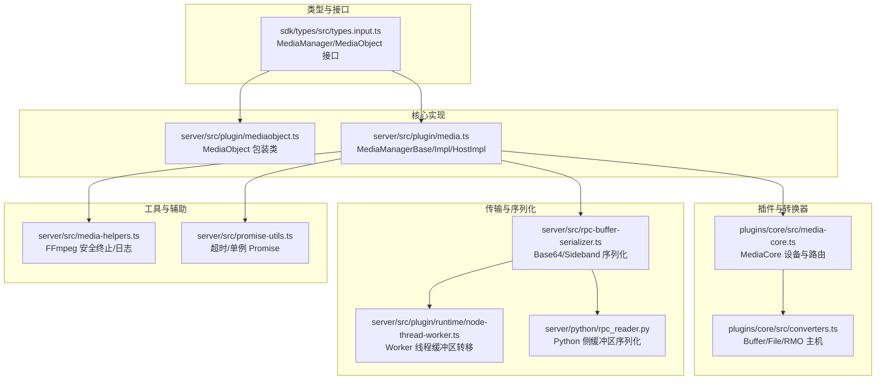
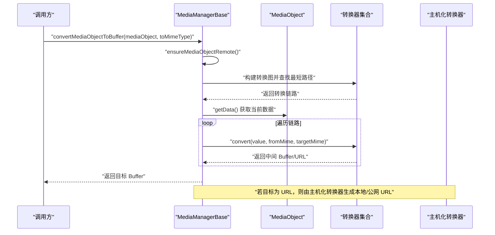
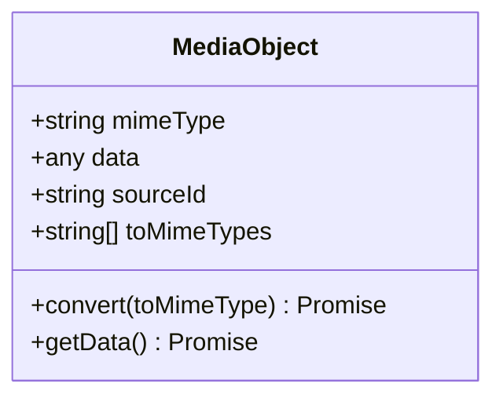
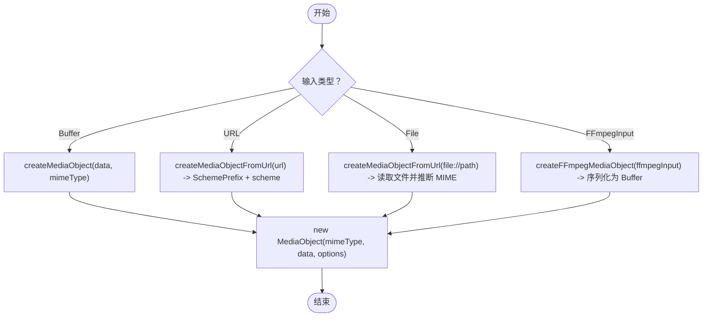
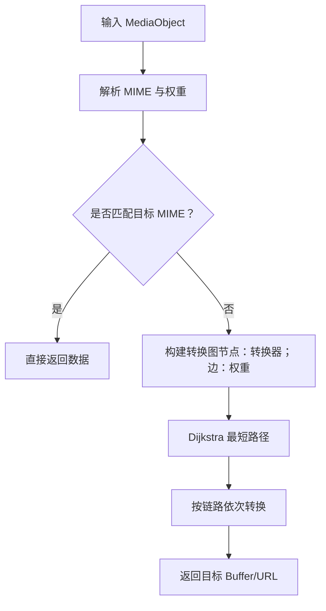
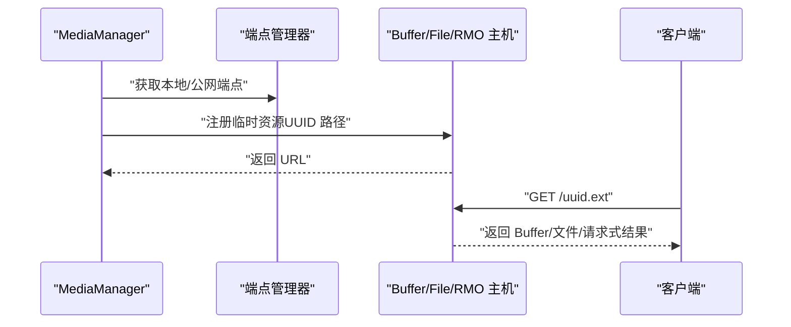
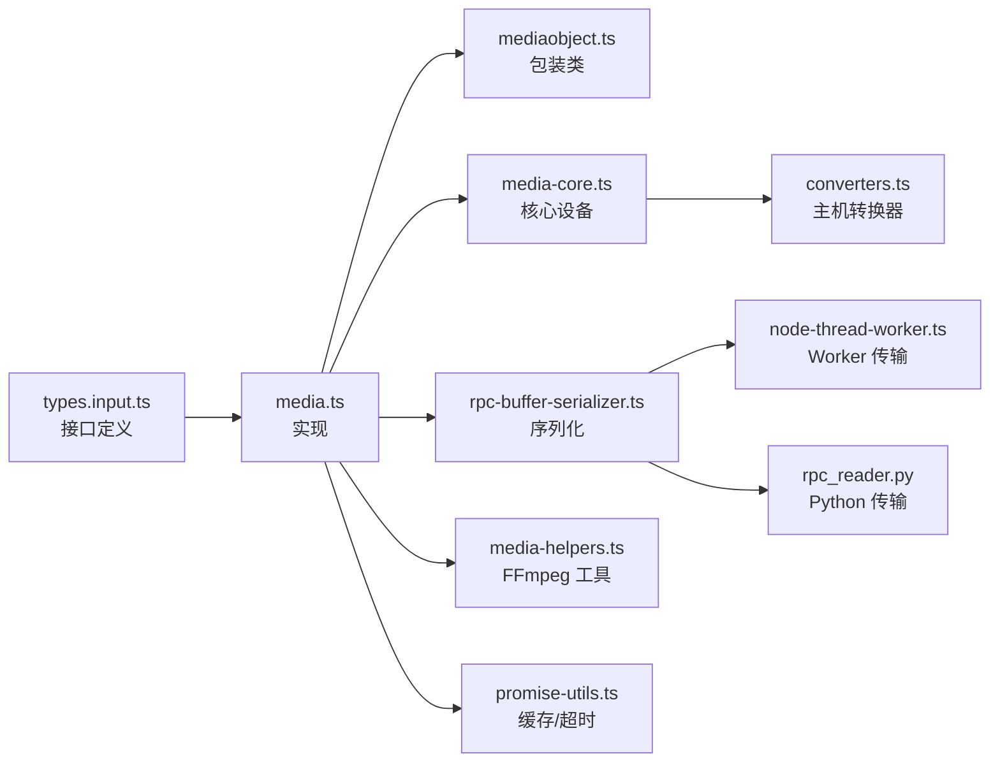

# 媒体对象管理

<cite>
**本文引用的文件**
- [server/src/plugin/mediaobject.ts](file://server/src/plugin/mediaobject.ts)
- [server/src/plugin/media.ts](file://server/src/plugin/media.ts)
- [sdk/types/src/types.input.ts](file://sdk/types/src/types.input.ts)
- [plugins/core/src/media-core.ts](file://plugins/core/src/media-core.ts)
- [plugins/core/src/converters.ts](file://plugins/core/src/converters.ts)
- [server/src/media-helpers.ts](file://server/src/media-helpers.ts)
- [server/src/rpc-buffer-serializer.ts](file://server/src/rpc-buffer-serializer.ts)
- [server/src/plugin/runtime/node-thread-worker.ts](file://server/src/plugin/runtime/node-thread-worker.ts)
- [server/python/rpc_reader.py](file://server/python/rpc_reader.py)
- [server/src/promise-utils.ts](file://server/src/promise-utils.ts)
</cite>

## 目录
1. [简介](#简介)
2. [项目结构](#项目结构)
3. [核心组件](#核心组件)
4. [架构总览](#架构总览)
5. [详细组件分析](#详细组件分析)
6. [依赖分析](#依赖分析)
7. [性能考虑](#性能考虑)
8. [故障排查指南](#故障排查指南)
9. [结论](#结论)
10. [附录](#附录)

## 简介
本文件面向 Scrypted 的媒体对象管理系统，系统性阐述 MediaObject 的设计理念、数据结构、生命周期、内存优化策略；详解媒体对象的创建流程（从原始数据到 MediaObject 的包装）、支持的数据类型（Buffer、URL、文件路径等）；解释媒体对象的转换机制（MIME 类型转换、格式转换、元数据提取）；说明缓存策略（内存缓存、磁盘缓存、缓存失效机制）；详述传输机制（本地传输、网络传输、安全传输）；并提供性能优化建议（并发访问控制、内存使用优化、垃圾回收策略），以及错误处理与异常恢复机制。

## 项目结构
围绕媒体对象管理的关键代码分布在以下模块：
- 类型定义：SDK 类型接口与常量（MIME 类型、MediaObject 接口、MediaManager 接口）
- 核心实现：MediaManager 抽象与具体实现、MediaObject 包装类
- 插件与转换器：内置转换器（HTTP/HTTPS、File、Url→FFmpegInput、FFmpegInput↔MediaStreamUrl 等），以及媒体核心设备与主机化转换器（Buffer/File/RMO 主机）
- 传输与序列化：RPC 缓冲区序列化（Base64 降级与 Sideband 传输）、Node Worker 线程缓冲区转移
- 工具与辅助：FFmpeg 安全终止与日志打印、超时与缓存工具

**图表来源**
- [sdk/types/src/types.input.ts:1898-1972](file://sdk/types/src/types.input.ts#L1898-L1972)
- [server/src/plugin/mediaobject.ts:1-26](file://server/src/plugin/mediaobject.ts#L1-L26)
- [server/src/plugin/media.ts:40-472](file://server/src/plugin/media.ts#L40-L472)
- [plugins/core/src/media-core.ts:1-145](file://plugins/core/src/media-core.ts#L1-L145)
- [plugins/core/src/converters.ts:1-194](file://plugins/core/src/converters.ts#L1-L194)
- [server/src/rpc-buffer-serializer.ts:1-31](file://server/src/rpc-buffer-serializer.ts#L1-L31)
- [server/src/plugin/runtime/node-thread-worker.ts:1-54](file://server/src/plugin/runtime/node-thread-worker.ts#L1-L54)
- [server/python/rpc_reader.py:1-252](file://server/python/rpc_reader.py#L1-L252)
- [server/src/media-helpers.ts:1-98](file://server/src/media-helpers.ts#L1-L98)
- [server/src/promise-utils.ts:1-54](file://server/src/promise-utils.ts#L1-L54)

**章节来源**
- [sdk/types/src/types.input.ts:1898-1972](file://sdk/types/src/types.input.ts#L1898-L1972)
- [server/src/plugin/media.ts:40-472](file://server/src/plugin/media.ts#L40-L472)
- [plugins/core/src/converters.ts:1-194](file://plugins/core/src/converters.ts#L1-L194)

## 核心组件
- MediaObject：对任意数据进行封装，携带 mimeType、可选扩展属性（如 sourceId、toMimeTypes、convert），并通过 RPC 进行跨进程/跨语言传输。
- MediaManagerBase/Impl/HostImpl：负责转换器发现与调度、MIME 转换路径计算、URL 生成（本地/不安全本地/公网）、FFmpeg 输入对象创建、文件存储目录获取。
- 内置转换器：HTTP/HTTPS 拉流转 MediaObject、File 协议读取转 MediaObject、Url→FFmpegInput、FFmpegInput↔MediaStreamUrl 等。
- 转换器主机（Buffer/File/RMO 主机）：将 Buffer、文件路径或请求式媒体对象暴露为本地 URL，支持安全/不安全端点与附件下载头。
- 传输与序列化：RPC 层提供 Base64 降级与 Sideband 无拷贝传输；Node Worker 支持共享 ArrayBuffer 的零拷贝转移；Python 侧同样支持缓冲区侧带传输。
- 工具与辅助：FFmpeg 安全终止与日志过滤、超时与单例 Promise 缓存。

**章节来源**
- [server/src/plugin/mediaobject.ts:5-25](file://server/src/plugin/mediaobject.ts#L5-L25)
- [server/src/plugin/media.ts:40-472](file://server/src/plugin/media.ts#L40-L472)
- [plugins/core/src/converters.ts:14-194](file://plugins/core/src/converters.ts#L14-L194)
- [server/src/rpc-buffer-serializer.ts:1-31](file://server/src/rpc-buffer-serializer.ts#L1-L31)
- [server/src/plugin/runtime/node-thread-worker.ts:8-40](file://server/src/plugin/runtime/node-thread-worker.ts#L8-L40)
- [server/src/media-helpers.ts:11-97](file://server/src/media-helpers.ts#L11-L97)
- [server/src/promise-utils.ts:6-22](file://server/src/promise-utils.ts#L6-L22)

## 架构总览
媒体对象管理采用“接口定义 + 中央转换器调度 + 插件扩展 + 主机化传输”的分层架构。客户端通过 MediaManager 发起转换请求，MediaManagerBase 将媒体对象与系统中所有 BufferConverter/MediaConverter 组成的转换器图进行最短路径搜索，按权重选择最优链路完成转换，并最终输出目标 MIME 的 Buffer 或 URL。

**图表来源**
- [server/src/plugin/media.ts:252-471](file://server/src/plugin/media.ts#L252-L471)
- [plugins/core/src/converters.ts:52-148](file://plugins/core/src/converters.ts#L52-L148)

**章节来源**
- [server/src/plugin/media.ts:252-471](file://server/src/plugin/media.ts#L252-L471)

## 详细组件分析

### MediaObject 数据结构与生命周期
- 数据结构：包含 mimeType、data、sourceId、toMimeTypes、convert 等字段；构造时会将可传输字段标记为代理属性，便于 RPC 传输。
- 生命周期：从创建到转换再到释放。创建阶段通过 createMediaObject/createFFmpegMediaObject/createMediaObjectFromUrl 包装；转换阶段通过 convertMediaObjectToBuffer/convertMediaObjectToLocalUrl 等 API 执行；释放阶段由上层业务或主机化转换器定时清理。

**图表来源**
- [server/src/plugin/mediaobject.ts:5-25](file://server/src/plugin/mediaobject.ts#L5-L25)

**章节来源**
- [server/src/plugin/mediaobject.ts:5-25](file://server/src/plugin/mediaobject.ts#L5-L25)

### 创建流程：从原始数据到 MediaObject
- 支持的数据类型：
  - Buffer：直接作为 data 存储，mimeType 指定类型
  - URL：根据协议动态派生 MIME（SchemePrefix + protocol），内部以字符串形式保存
  - 文件路径：file:// 协议，读取后派生 MIME
  - FFmpeg 输入：将 FFmpegInput 序列化为 Buffer，mimeType 为 FFmpegInput
- 创建入口：
  - createMediaObject：通用创建
  - createMediaObjectFromUrl：从 URL 创建
  - createFFmpegMediaObject：从 FFmpegInput 创建

**图表来源**
- [server/src/plugin/media.ts:297-311](file://server/src/plugin/media.ts#L297-L311)
- [server/src/plugin/mediaobject.ts:8-20](file://server/src/plugin/mediaobject.ts#L8-L20)

**章节来源**
- [server/src/plugin/media.ts:297-311](file://server/src/plugin/media.ts#L297-L311)
- [server/src/plugin/mediaobject.ts:8-20](file://server/src/plugin/mediaobject.ts#L8-L20)

### 转换机制：MIME 类型转换、格式转换、元数据提取
- 转换器发现：遍历系统设备状态，筛选具备 BufferConverter/MediaConverter 接口的设备，组装 IdBufferConverter 列表；内置转换器优先于系统转换器，额外转换器最后加载允许覆盖内置。
- 路径计算：基于 MIME 类型匹配与权重参数（converter-weight）构建有向图，使用 Dijkstra 最短路径算法寻找从源 MIME 到目标 MIME 的最优链路。
- 元数据提取：部分转换器在转换过程中解析并保留 MIME 参数（如目标 MIME 带参数时，会复制到目标类型）。
- 特殊转换器：
  - HTTP/HTTPS：拉取内容并推断 MIME，生成 MediaObject
  - File：读取文件并推断 MIME，或转 FFmpegInput
  - Url→FFmpegInput：将 URL 封装为 FFmpegInput
  - FFmpegInput↔MediaStreamUrl：互转，RTSP 自动设置传输参数

**图表来源**
- [server/src/plugin/media.ts:313-471](file://server/src/plugin/media.ts#L313-L471)

**章节来源**
- [server/src/plugin/media.ts:190-242](file://server/src/plugin/media.ts#L190-L242)
- [server/src/plugin/media.ts:313-471](file://server/src/plugin/media.ts#L313-L471)

### 缓存策略：内存缓存、磁盘缓存、缓存失效机制
- 内存缓存：
  - Buffer/File/RMO 主机在内存中维护短期映射表（BufferHost/FileHost/RMO 主机），键为生成的 UUID 路径，值为数据与 MIME；设置定时器在一段时间后自动删除，避免内存泄漏。
  - 单例 Promise 缓存：对某些操作使用单例 Promise 与缓存时长，减少重复计算与并发压力。
- 磁盘缓存：
  - MediaManager 提供 getFilesPath 获取插件文件存储目录，用于持久化媒体文件（例如截图、录制片段等）。
- 缓存失效：
  - BufferHost：10 分钟
  - RMO 主机：1 小时
  - 单例 Promise：到期后清除
  - 错误图像清理：按时间窗口限制清理频率，避免频繁写入

**章节来源**
- [plugins/core/src/converters.ts:14-66](file://plugins/core/src/converters.ts#L14-L66)
- [plugins/core/src/converters.ts:69-148](file://plugins/core/src/converters.ts#L69-L148)
- [server/src/plugin/media.ts:179-188](file://server/src/plugin/media.ts#L179-L188)
- [server/src/promise-utils.ts:6-22](file://server/src/promise-utils.ts#L6-L22)
- [plugins/snapshot/src/main.ts:567-581](file://plugins/snapshot/src/main.ts#L567-L581)

### 传输机制：本地传输、网络传输、安全传输
- 本地传输：
  - 不安全本地 URL：InsecureLocalUrl，适合局域网内访问
  - 安全本地 URL：LocalUrl，通过受控端点发布
- 网络传输：
  - 公网 URL：Url，对外公开访问
- 安全传输：
  - 通过端点管理器获取受信端点，结合访问控制与 ACL 策略
- 序列化优化：
  - Base64 降级：当对端不支持侧带传输时，使用 Base64 编解码
  - Sideband 传输：通过独立通道传递二进制缓冲区，避免拷贝
  - Worker 线程零拷贝：共享 ArrayBuffer 可直接转移，减少内存占用
  - Python 侧：同样支持缓冲区侧带传输

**图表来源**
- [plugins/core/src/converters.ts:52-148](file://plugins/core/src/converters.ts#L52-L148)
- [server/src/rpc-buffer-serializer.ts:14-31](file://server/src/rpc-buffer-serializer.ts#L14-L31)
- [server/src/plugin/runtime/node-thread-worker.ts:8-40](file://server/src/plugin/runtime/node-thread-worker.ts#L8-L40)
- [server/python/rpc_reader.py:18-40](file://server/python/rpc_reader.py#L18-L40)

**章节来源**
- [plugins/core/src/converters.ts:14-194](file://plugins/core/src/converters.ts#L14-L194)
- [server/src/rpc-buffer-serializer.ts:1-31](file://server/src/rpc-buffer-serializer.ts#L1-L31)
- [server/src/plugin/runtime/node-thread-worker.ts:1-54](file://server/src/plugin/runtime/node-thread-worker.ts#L1-L54)
- [server/python/rpc_reader.py:1-252](file://server/python/rpc_reader.py#L1-L252)

### 转换器与媒体核心设备
- MediaCore：提供 HTTP/HTTPS Buffer 主机、文件主机、RMO 主机，统一将媒体对象暴露为本地 URL；支持按查询参数调整图片尺寸等。
- 转换器主机：
  - BufferHost：将 Buffer 暴露为本地 URL，支持附件下载头
  - FileHost：将文件路径映射为本地 URL，使用哈希命名以利于浏览器缓存
  - RequestMediaObjectHost：延迟请求媒体对象，按需生成并缓存

**章节来源**
- [plugins/core/src/media-core.ts:1-145](file://plugins/core/src/media-core.ts#L1-L145)
- [plugins/core/src/converters.ts:14-194](file://plugins/core/src/converters.ts#L14-L194)

## 依赖分析
- 接口契约：MediaManager 与 MediaObject 在 SDK 类型中定义，确保跨语言/跨进程一致性
- 转换器依赖：MediaManagerBase 依赖系统设备状态枚举 BufferConverter/MediaConverter，动态拼接转换链
- 传输依赖：RPC 序列化器在不同运行时（Node/Python/Worker）提供一致的缓冲区传输能力
- 工具依赖：FFmpeg 辅助函数、超时与缓存工具贯穿媒体处理链路

**图表来源**
- [sdk/types/src/types.input.ts:1898-1972](file://sdk/types/src/types.input.ts#L1898-L1972)
- [server/src/plugin/media.ts:40-472](file://server/src/plugin/media.ts#L40-L472)
- [server/src/plugin/mediaobject.ts:1-26](file://server/src/plugin/mediaobject.ts#L1-L26)
- [plugins/core/src/media-core.ts:1-145](file://plugins/core/src/media-core.ts#L1-L145)
- [plugins/core/src/converters.ts:1-194](file://plugins/core/src/converters.ts#L1-L194)
- [server/src/rpc-buffer-serializer.ts:1-31](file://server/src/rpc-buffer-serializer.ts#L1-L31)
- [server/src/plugin/runtime/node-thread-worker.ts:1-54](file://server/src/plugin/runtime/node-thread-worker.ts#L1-L54)
- [server/python/rpc_reader.py:1-252](file://server/python/rpc_reader.py#L1-L252)
- [server/src/media-helpers.ts:1-98](file://server/src/media-helpers.ts#L1-L98)
- [server/src/promise-utils.ts:1-54](file://server/src/promise-utils.ts#L1-L54)

**章节来源**
- [server/src/plugin/media.ts:190-242](file://server/src/plugin/media.ts#L190-L242)

## 性能考虑
- 并发访问控制：
  - 使用单例 Promise 与缓存时长避免重复计算与并发风暴
  - 超时机制防止长时间阻塞，及时失败回退
- 内存使用优化：
  - 优先使用 Sideband 传输与 Worker 线程零拷贝，减少 Buffer 复制
  - 主机化转换器设置合理过期时间，及时释放内存
- 垃圾回收策略：
  - 定时器清理短期资源；错误图像清理按时间窗口限流
  - FFmpeg 进程安全终止，避免僵尸进程占用资源

**章节来源**
- [server/src/promise-utils.ts:6-22](file://server/src/promise-utils.ts#L6-L22)
- [server/src/rpc-buffer-serializer.ts:14-31](file://server/src/rpc-buffer-serializer.ts#L14-L31)
- [server/src/plugin/runtime/node-thread-worker.ts:8-40](file://server/src/plugin/runtime/node-thread-worker.ts#L8-L40)
- [plugins/core/src/converters.ts:62-66](file://plugins/core/src/converters.ts#L62-L66)
- [plugins/core/src/converters.ts:143-145](file://plugins/core/src/converters.ts#L143-L145)
- [server/src/media-helpers.ts:11-38](file://server/src/media-helpers.ts#L11-L38)

## 故障排查指南
- 转换失败：
  - 检查转换器权重与 MIME 匹配，确认链路可达
  - 查看日志过滤与 FFmpeg 初始输出，定位问题帧/参数
- 传输异常：
  - 若出现 Base64 降级警告，检查对端是否支持 Sideband 传输
  - Worker 线程共享 ArrayBuffer 转移失败时，回退到拷贝传输
- 资源泄露：
  - 确认主机化转换器定时清理是否生效
  - 检查单例 Promise 是否正确过期
- FFmpeg 问题：
  - 使用安全终止函数优雅退出
  - 打印参数时注意隐藏敏感信息（如密码）

**章节来源**
- [server/src/plugin/media.ts:428-430](file://server/src/plugin/media.ts#L428-L430)
- [server/src/media-helpers.ts:40-71](file://server/src/media-helpers.ts#L40-L71)
- [server/src/rpc-buffer-serializer.ts:4-11](file://server/src/rpc-buffer-serializer.ts#L4-L11)
- [server/src/plugin/runtime/node-thread-worker.ts:15-30](file://server/src/plugin/runtime/node-thread-worker.ts#L15-L30)
- [server/src/promise-utils.ts:24-54](file://server/src/promise-utils.ts#L24-L54)

## 结论
Scrypted 的媒体对象管理以清晰的接口定义为基础，通过 MediaManager 的转换器图与权重机制，实现了灵活高效的 MIME 转换与传输。配合内存与磁盘缓存、超时与单例 Promise、以及 Sideband/零拷贝传输，系统在保证功能完整性的同时兼顾了性能与稳定性。实际部署中应关注转换器权重配置、资源清理策略与 FFmpeg 进程管理，以获得最佳体验。

## 附录
- 关键 API 速览（来自类型定义）：
  - MediaManager：convertMediaObject、convertMediaObjectToJSON、convertMediaObjectToBuffer、convertMediaObjectToLocalUrl、convertMediaObjectToUrl、createFFmpegMediaObject、createMediaObjectFromUrl、createMediaObject、getFFmpegPath、getFilesPath
  - MediaObject：mimeType、data、sourceId、toMimeTypes、convert、getData

**章节来源**
- [sdk/types/src/types.input.ts:1915-1972](file://sdk/types/src/types.input.ts#L1915-L1972)