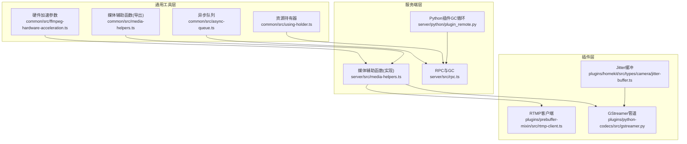
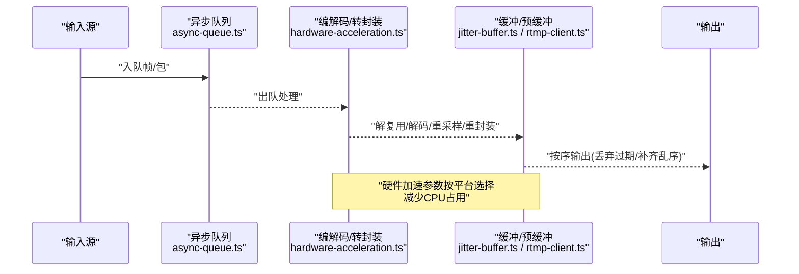
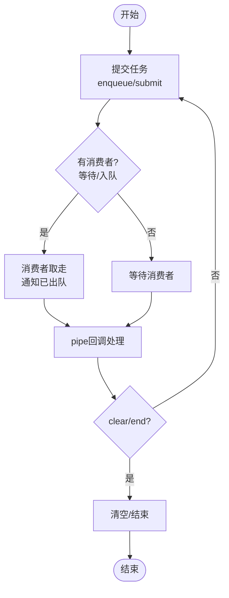
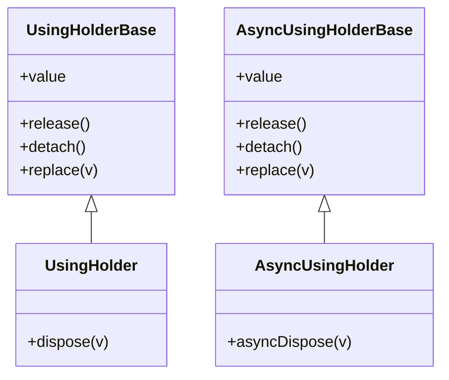
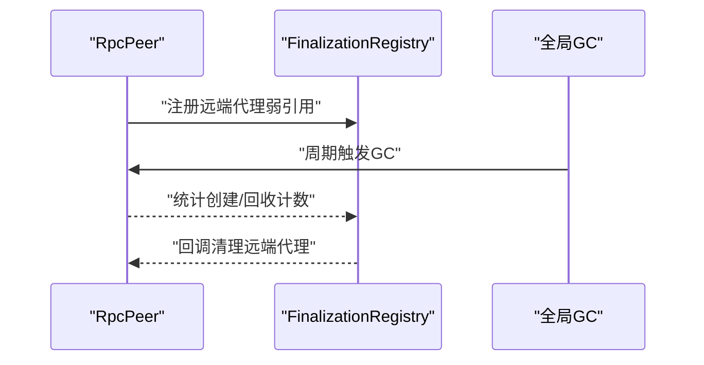
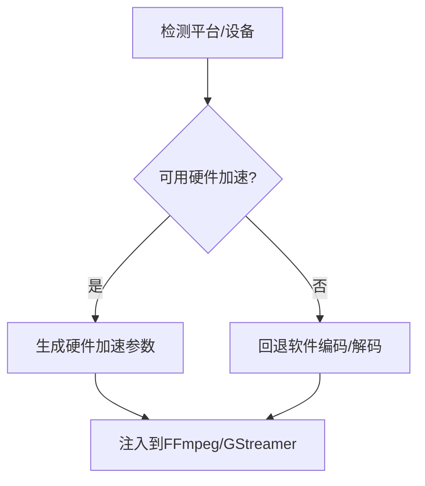
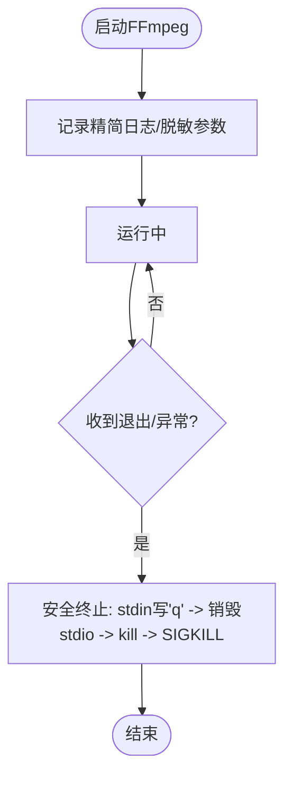
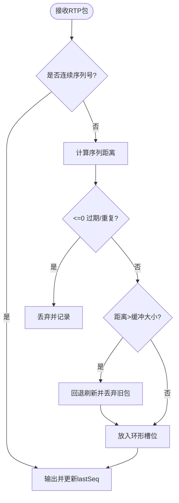
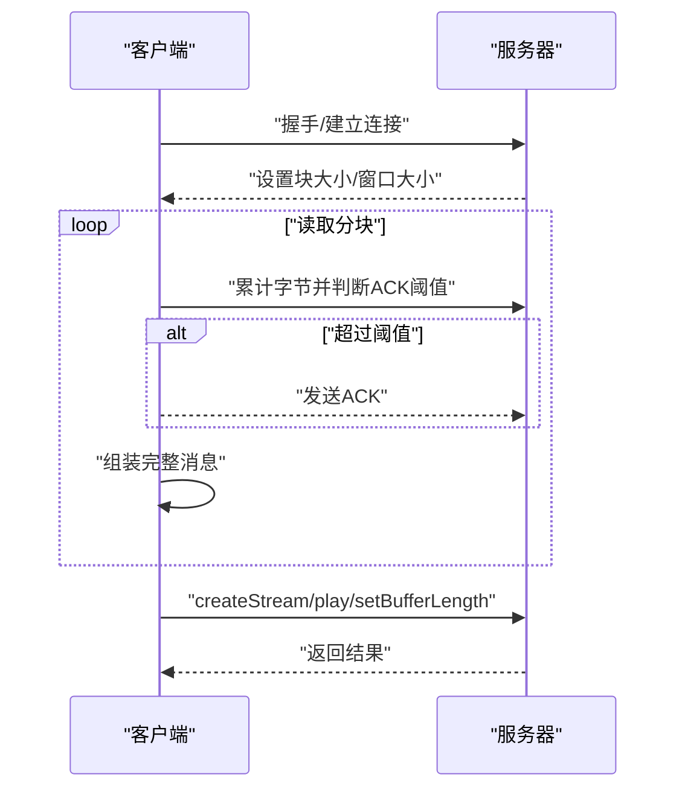
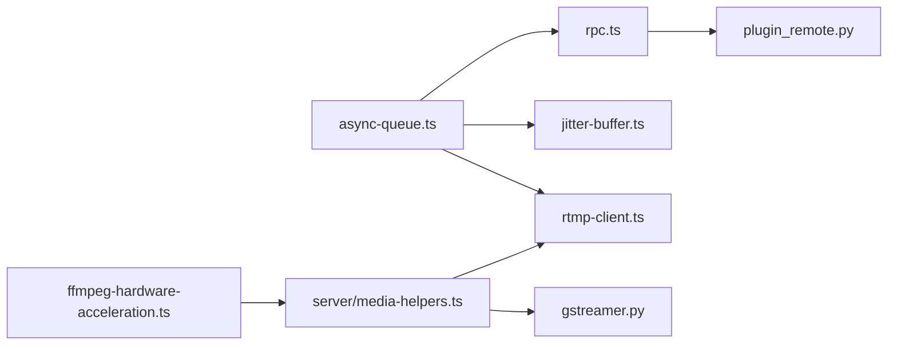

# 性能优化与监控

<cite>
**本文引用的文件**
- [common/src/async-queue.ts](file://common/src/async-queue.ts)
- [common/src/using-holder.ts](file://common/src/using-holder.ts)
- [common/src/ffmpeg-hardware-acceleration.ts](file://common/src/ffmpeg-hardware-acceleration.ts)
- [common/src/media-helpers.ts](file://common/src/media-helpers.ts)
- [server/src/media-helpers.ts](file://server/src/media-helpers.ts)
- [server/src/rpc.ts](file://server/src/rpc.ts)
- [plugins/homekit/src/types/camera/jitter-buffer.ts](file://plugins/homekit/src/types/camera/jitter-buffer.ts)
- [plugins/prebuffer-mixin/src/rtmp-client.ts](file://plugins/prebuffer-mixin/src/rtmp-client.ts)
- [plugins/python-codecs/src/gstreamer.py](file://plugins/python-codecs/src/gstreamer.py)
- [server/python/plugin_remote.py](file://server/python/plugin_remote.py)
</cite>

## 目录
1. [简介](#简介)
2. [项目结构](#项目结构)
3. [核心组件](#核心组件)
4. [架构总览](#架构总览)
5. [详细组件分析](#详细组件分析)
6. [依赖关系分析](#依赖关系分析)
7. [性能考量](#性能考量)
8. [故障排查指南](#故障排查指南)
9. [结论](#结论)
10. [附录](#附录)

## 简介
本文件面向 Scrypted 的媒体处理性能优化与监控，围绕吞吐量、延迟、CPU/内存使用等关键指标，系统梳理并发处理策略（多线程/异步队列/任务调度）、缓冲策略（环形缓冲/滑动窗口/自适应调整）、内存管理（对象池/垃圾回收优化/泄漏检测）、性能监控（实时指标/数据分析/瓶颈定位）与调优实践（参数/资源/负载均衡），并提供诊断工具与常见问题解决方案。

## 项目结构
Scrypted 将媒体处理相关能力分布在通用工具层与服务端/插件层：
- 通用工具层：异步队列、资源持有器、硬件加速参数、媒体辅助函数等
- 服务端层：RPC 远端代理、周期性 GC 触发、媒体进程安全控制
- 插件层：RTMP 客户端、Jitter 缓冲、GStreamer 管道配置等

图示来源
- [common/src/async-queue.ts:1-242](file://common/src/async-queue.ts#L1-L242)
- [common/src/using-holder.ts:1-99](file://common/src/using-holder.ts#L1-L99)
- [common/src/ffmpeg-hardware-acceleration.ts:1-147](file://common/src/ffmpeg-hardware-acceleration.ts#L1-L147)
- [common/src/media-helpers.ts:1-2](file://common/src/media-helpers.ts#L1-L2)
- [server/src/media-helpers.ts:1-98](file://server/src/media-helpers.ts#L1-L98)
- [server/src/rpc.ts:1-858](file://server/src/rpc.ts#L1-L858)
- [server/python/plugin_remote.py:1151-1189](file://server/python/plugin_remote.py#L1151-L1189)
- [plugins/homekit/src/types/camera/jitter-buffer.ts:1-110](file://plugins/homekit/src/types/camera/jitter-buffer.ts#L1-L110)
- [plugins/prebuffer-mixin/src/rtmp-client.ts:1-630](file://plugins/prebuffer-mixin/src/rtmp-client.ts#L1-L630)
- [plugins/python-codecs/src/gstreamer.py:325-368](file://plugins/python-codecs/src/gstreamer.py#L325-L368)

章节来源
- [common/src/async-queue.ts:1-242](file://common/src/async-queue.ts#L1-L242)
- [common/src/using-holder.ts:1-99](file://common/src/using-holder.ts#L1-L99)
- [common/src/ffmpeg-hardware-acceleration.ts:1-147](file://common/src/ffmpeg-hardware-acceleration.ts#L1-L147)
- [common/src/media-helpers.ts:1-2](file://common/src/media-helpers.ts#L1-L2)
- [server/src/media-helpers.ts:1-98](file://server/src/media-helpers.ts#L1-L98)
- [server/src/rpc.ts:1-858](file://server/src/rpc.ts#L1-L858)
- [server/python/plugin_remote.py:1151-1189](file://server/python/plugin_remote.py#L1151-L1189)
- [plugins/homekit/src/types/camera/jitter-buffer.ts:1-110](file://plugins/homekit/src/types/camera/jitter-buffer.ts#L1-L110)
- [plugins/prebuffer-mixin/src/rtmp-client.ts:1-630](file://plugins/prebuffer-mixin/src/rtmp-client.ts#L1-L630)
- [plugins/python-codecs/src/gstreamer.py:325-368](file://plugins/python-codecs/src/gstreamer.py#L325-L368)

## 核心组件
- 异步队列：提供生产者-消费者模型，支持取消信号、批量清空、迭代消费，用于解耦媒体处理阶段与背压控制
- 资源持有器：统一释放逻辑，避免资源泄露；在 RPC 代理生命周期中配合 FinalizationRegistry 实现弱引用与自动清理
- 硬件加速参数：按平台选择最优解码/编码器参数，降低 CPU 占用，提升吞吐
- 媒体辅助函数：安全终止 FFmpeg、打印精简日志、脱敏输出参数，便于性能调试
- RPC 与 GC：周期性触发全局 GC，统计远端代理创建/回收，缓解长时运行内存压力
- 缓冲策略：Jitter 缓冲（序列号容错、丢弃过期包）、RTMP 窗口确认（流量控制）
- Python 插件 GC：子进程定时执行 GC，避免 Python 子进程内存膨胀

章节来源
- [common/src/async-queue.ts:1-242](file://common/src/async-queue.ts#L1-L242)
- [common/src/using-holder.ts:1-99](file://common/src/using-holder.ts#L1-L99)
- [common/src/ffmpeg-hardware-acceleration.ts:1-147](file://common/src/ffmpeg-hardware-acceleration.ts#L1-L147)
- [common/src/media-helpers.ts:1-2](file://common/src/media-helpers.ts#L1-L2)
- [server/src/media-helpers.ts:1-98](file://server/src/media-helpers.ts#L1-L98)
- [server/src/rpc.ts:1-858](file://server/src/rpc.ts#L1-L858)
- [plugins/homekit/src/types/camera/jitter-buffer.ts:1-110](file://plugins/homekit/src/types/camera/jitter-buffer.ts#L1-L110)
- [plugins/prebuffer-mixin/src/rtmp-client.ts:1-630](file://plugins/prebuffer-mixin/src/rtmp-client.ts#L1-L630)
- [server/python/plugin_remote.py:1151-1189](file://server/python/plugin_remote.py#L1151-L1189)

## 架构总览
媒体处理路径从输入到输出贯穿“异步队列 -> 编解码/转封装 -> 缓冲/预缓冲 -> 输出”，期间通过硬件加速与 GC 策略保障吞吐与稳定性。

图示来源
- [common/src/async-queue.ts:1-242](file://common/src/async-queue.ts#L1-L242)
- [common/src/ffmpeg-hardware-acceleration.ts:1-147](file://common/src/ffmpeg-hardware-acceleration.ts#L1-L147)
- [plugins/homekit/src/types/camera/jitter-buffer.ts:1-110](file://plugins/homekit/src/types/camera/jitter-buffer.ts#L1-L110)
- [plugins/prebuffer-mixin/src/rtmp-client.ts:1-630](file://plugins/prebuffer-mixin/src/rtmp-client.ts#L1-L630)

## 详细组件分析

### 组件一：异步队列（并发与背压）
- 设计要点
  - 生产者可直接投递或等待“已出队”信号；消费者可同步 take 或异步 dequeue
  - 支持 AbortSignal 取消，避免阻塞
  - 提供 clear/end，用于优雅关闭与错误传播
  - pipe 配合 for-await-of 实现流式处理
- 性能影响
  - 合理的队列长度与提交/出队节奏可平滑突发流量，避免 CPU 短时峰值
  - 与硬件加速参数结合，可在高 FPS/高分辨率场景下维持稳定吞吐

图示来源
- [common/src/async-queue.ts:1-242](file://common/src/async-queue.ts#L1-L242)

章节来源
- [common/src/async-queue.ts:1-242](file://common/src/async-queue.ts#L1-L242)

### 组件二：资源持有器与 RPC 代理生命周期（内存管理）
- 设计要点
  - UsingHolder/AsyncUsingHolder 提供统一释放接口，避免遗漏
  - RpcPeer 使用 FinalizationRegistry 与 WeakRef 跟踪远端代理，统计创建/回收数量
  - startPeriodicGarbageCollection 周期触发全局 GC，缓解长连接/多插件场景下的内存增长
- 性能影响
  - 正确的释放顺序与弱引用跟踪可显著降低泄漏风险
  - 周期性 GC 在高并发 RPC 场景下有助于回收临时对象

图示来源
- [common/src/using-holder.ts:1-99](file://common/src/using-holder.ts#L1-L99)

图示来源
- [server/src/rpc.ts:1-858](file://server/src/rpc.ts#L1-L858)

章节来源
- [common/src/using-holder.ts:1-99](file://common/src/using-holder.ts#L1-L99)
- [server/src/rpc.ts:1-858](file://server/src/rpc.ts#L1-L858)

### 组件三：硬件加速参数（吞吐与 CPU）
- 设计要点
  - 按平台选择解码/编码器参数，如 CUDA/CUVID/VAAPI/QuickSync/VideoToolbox 等
  - 调试模式提供低延迟编码参数，便于性能对比
- 性能影响
  - 合理启用硬件加速可显著降低 CPU 占用，提高并发能力
  - 不同平台/驱动稳定性不同，需结合实际设备选择

图示来源
- [common/src/ffmpeg-hardware-acceleration.ts:1-147](file://common/src/ffmpeg-hardware-acceleration.ts#L1-L147)
- [plugins/python-codecs/src/gstreamer.py:325-368](file://plugins/python-codecs/src/gstreamer.py#L325-L368)

章节来源
- [common/src/ffmpeg-hardware-acceleration.ts:1-147](file://common/src/ffmpeg-hardware-acceleration.ts#L1-L147)
- [plugins/python-codecs/src/gstreamer.py:325-368](file://plugins/python-codecs/src/gstreamer.py#L325-L368)

### 组件四：媒体辅助函数（日志与进程控制）
- 设计要点
  - 安全终止 FFmpeg：先写退出命令，再销毁 stdio，最后 SIGKILL
  - 初始输出日志过滤与脱敏，避免敏感信息泄露
- 性能影响
  - 合理的日志级别与过滤可降低 I/O 压力
  - 正确的进程退出流程避免僵尸进程与句柄泄漏

图示来源
- [server/src/media-helpers.ts:1-98](file://server/src/media-helpers.ts#L1-L98)
- [common/src/media-helpers.ts:1-2](file://common/src/media-helpers.ts#L1-L2)

章节来源
- [server/src/media-helpers.ts:1-98](file://server/src/media-helpers.ts#L1-L98)
- [common/src/media-helpers.ts:1-2](file://common/src/media-helpers.ts#L1-L2)

### 组件五：Jitter 缓冲（乱序与丢包恢复）
- 设计要点
  - 基于序列号容错，丢弃过期包，按序输出
  - 大跳跃丢包时向前回退刷新，尽量补齐
- 性能影响
  - 合理的抖动缓冲大小可平衡延迟与鲁棒性
  - 对网络波动场景提升播放连续性

图示来源
- [plugins/homekit/src/types/camera/jitter-buffer.ts:1-110](file://plugins/homekit/src/types/camera/jitter-buffer.ts#L1-L110)

章节来源
- [plugins/homekit/src/types/camera/jitter-buffer.ts:1-110](file://plugins/homekit/src/types/camera/jitter-buffer.ts#L1-L110)

### 组件六：RTMP 客户端（窗口确认与预缓冲）
- 设计要点
  - 分块读取、消息组装、窗口确认阈值触发 ACK
  - 设置缓冲长度与窗口大小，抑制拥塞
- 性能影响
  - 合理的窗口与块大小可提升吞吐并避免拥塞
  - 预缓冲长度影响首开延迟与稳态质量

图示来源
- [plugins/prebuffer-mixin/src/rtmp-client.ts:1-630](file://plugins/prebuffer-mixin/src/rtmp-client.ts#L1-L630)

章节来源
- [plugins/prebuffer-mixin/src/rtmp-client.ts:1-630](file://plugins/prebuffer-mixin/src/rtmp-client.ts#L1-L630)

### 组件七：Python 插件 GC（子进程内存控制）
- 设计要点
  - 子进程内每 10 秒触发一次 GC，防止长时间运行内存膨胀
- 性能影响
  - 在 Python 子进程场景下，定期 GC 显著降低内存峰值

章节来源
- [server/python/plugin_remote.py:1151-1189](file://server/python/plugin_remote.py#L1151-L1189)

## 依赖关系分析
- 异步队列被服务端 RPC 与插件处理链路共同使用，作为并发与背压的核心
- 硬件加速参数由媒体辅助函数与 GStreamer 管道共同消费
- Jitter 缓冲与 RTMP 客户端分别作用于不同传输协议，但目标一致：稳定输出
- RPC 层负责跨进程/跨语言的代理生命周期与内存回收

图示来源
- [common/src/async-queue.ts:1-242](file://common/src/async-queue.ts#L1-L242)
- [server/src/rpc.ts:1-858](file://server/src/rpc.ts#L1-L858)
- [plugins/homekit/src/types/camera/jitter-buffer.ts:1-110](file://plugins/homekit/src/types/camera/jitter-buffer.ts#L1-L110)
- [plugins/prebuffer-mixin/src/rtmp-client.ts:1-630](file://plugins/prebuffer-mixin/src/rtmp-client.ts#L1-L630)
- [common/src/ffmpeg-hardware-acceleration.ts:1-147](file://common/src/ffmpeg-hardware-acceleration.ts#L1-L147)
- [server/src/media-helpers.ts:1-98](file://server/src/media-helpers.ts#L1-L98)
- [plugins/python-codecs/src/gstreamer.py:325-368](file://plugins/python-codecs/src/gstreamer.py#L325-L368)
- [server/python/plugin_remote.py:1151-1189](file://server/python/plugin_remote.py#L1151-L1189)

章节来源
- [common/src/async-queue.ts:1-242](file://common/src/async-queue.ts#L1-L242)
- [server/src/rpc.ts:1-858](file://server/src/rpc.ts#L1-L858)
- [plugins/homekit/src/types/camera/jitter-buffer.ts:1-110](file://plugins/homekit/src/types/camera/jitter-buffer.ts#L1-L110)
- [plugins/prebuffer-mixin/src/rtmp-client.ts:1-630](file://plugins/prebuffer-mixin/src/rtmp-client.ts#L1-L630)
- [common/src/ffmpeg-hardware-acceleration.ts:1-147](file://common/src/ffmpeg-hardware-acceleration.ts#L1-L147)
- [server/src/media-helpers.ts:1-98](file://server/src/media-helpers.ts#L1-L98)
- [plugins/python-codecs/src/gstreamer.py:325-368](file://plugins/python-codecs/src/gstreamer.py#L325-L368)
- [server/python/plugin_remote.py:1151-1189](file://server/python/plugin_remote.py#L1151-L1189)

## 性能考量
- 吞吐量
  - 启用硬件加速，合理设置编码参数与像素格式
  - 使用异步队列平滑突发，避免 CPU 短时饱和
- 延迟
  - Jitter 缓冲大小与 RTMP 窗口大小折中；预缓冲长度影响首开
  - 减少不必要的转封装/重采样步骤
- CPU 使用率
  - 优先硬件解码/编码；软件编码仅在调试或兼容性需要时启用
  - 周期性 GC 与资源及时释放
- 内存占用
  - 使用资源持有器与 FinalizationRegistry 管理代理生命周期
  - Python 子进程定期 GC，避免长期运行内存膨胀

## 故障排查指南
- FFmpeg 无法正常退出
  - 使用安全终止流程，确保 stdin 写入退出指令后再销毁 stdio 并最终 SIGKILL
  - 参考路径：[server/src/media-helpers.ts:11-38](file://server/src/media-helpers.ts#L11-L38)
- 日志噪声过大
  - 开启精简日志与过滤规则，必要时开启脱敏输出
  - 参考路径：[server/src/media-helpers.ts:40-71](file://server/src/media-helpers.ts#L40-L71)
- 媒体播放卡顿/乱序
  - 检查 Jitter 缓冲大小与序列号容错逻辑
  - 参考路径：[plugins/homekit/src/types/camera/jitter-buffer.ts:44-110](file://plugins/homekit/src/types/camera/jitter-buffer.ts#L44-L110)
- RTMP 拉流拥塞
  - 调整块大小、窗口大小与缓冲长度，确保 ACK 阈值合理
  - 参考路径：[plugins/prebuffer-mixin/src/rtmp-client.ts:67-175](file://plugins/prebuffer-mixin/src/rtmp-client.ts#L67-L175)
- 内存持续增长
  - 检查资源持有器释放链路与 RPC 代理回收统计
  - 启用周期性 GC 并观察创建/回收计数
  - 参考路径：[server/src/rpc.ts:1-27](file://server/src/rpc.ts#L1-L27)，[common/src/using-holder.ts:1-99](file://common/src/using-holder.ts#L1-L99)
- Python 子进程内存膨胀
  - 确认子进程 GC 循环是否生效
  - 参考路径：[server/python/plugin_remote.py:1171-1189](file://server/python/plugin_remote.py#L1171-L1189)

章节来源
- [server/src/media-helpers.ts:11-38](file://server/src/media-helpers.ts#L11-L38)
- [server/src/media-helpers.ts:40-71](file://server/src/media-helpers.ts#L40-L71)
- [plugins/homekit/src/types/camera/jitter-buffer.ts:44-110](file://plugins/homekit/src/types/camera/jitter-buffer.ts#L44-L110)
- [plugins/prebuffer-mixin/src/rtmp-client.ts:67-175](file://plugins/prebuffer-mixin/src/rtmp-client.ts#L67-L175)
- [server/src/rpc.ts:1-27](file://server/src/rpc.ts#L1-L27)
- [common/src/using-holder.ts:1-99](file://common/src/using-holder.ts#L1-L99)
- [server/python/plugin_remote.py:1171-1189](file://server/python/plugin_remote.py#L1171-L1189)

## 结论
通过“异步队列 + 硬件加速 + 缓冲策略 + 周期性 GC + 资源持有器”的组合拳，Scrypted 在媒体处理场景实现了对吞吐、延迟与资源占用的综合优化。建议在部署时根据设备能力与网络条件，动态调整硬件加速参数、缓冲大小与窗口阈值，并结合周期性 GC 与严格的资源释放策略，以获得稳定且高性能的媒体处理体验。

## 附录
- 参数调优清单
  - 硬件加速：按平台选择解码/编码器，优先 CUDA/CUVID/VAAPI/QuickSync/VideoToolbox
  - 编码参数：调试模式使用低延迟参数，生产环境根据带宽与延迟需求选择
  - 缓冲策略：Jitter 缓冲大小与 RTMP 窗口大小按网络波动调参
  - 背压控制：异步队列长度与提交节奏匹配下游处理能力
- 资源配置建议
  - 服务端：启用周期性 GC，监控远端代理创建/回收计数
  - 插件侧：Python 子进程保持定期 GC
- 负载均衡策略
  - 多路拉流时使用异步队列隔离处理，避免互相阻塞
  - 按硬件能力分配通道，避免单核过载