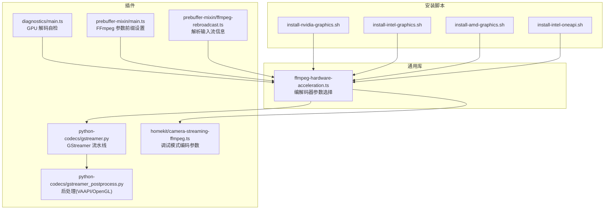
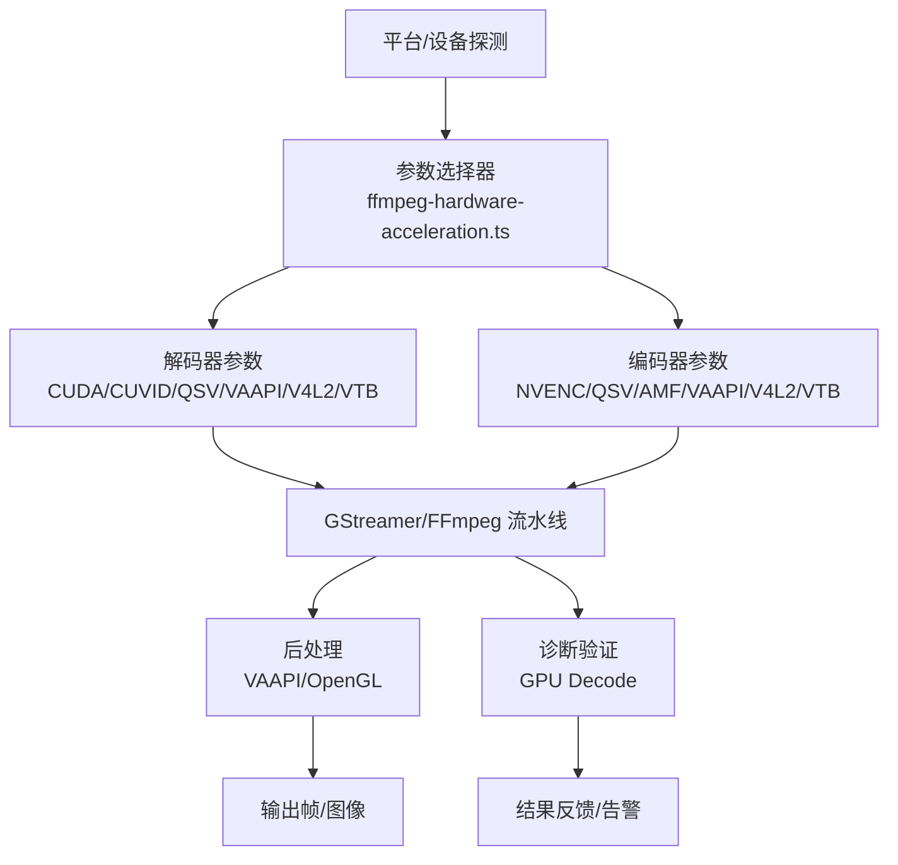
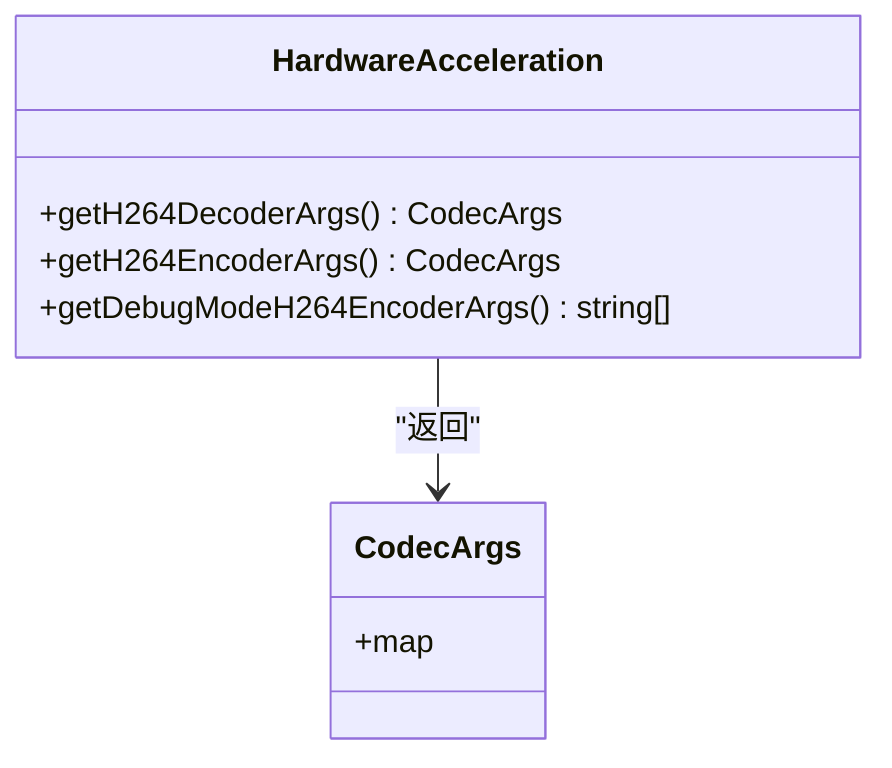
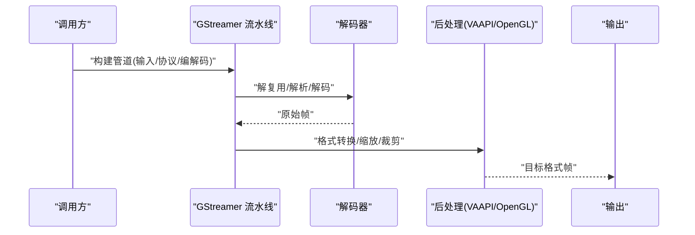
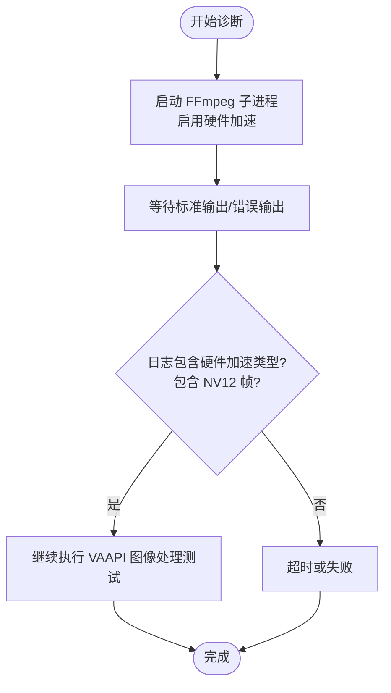
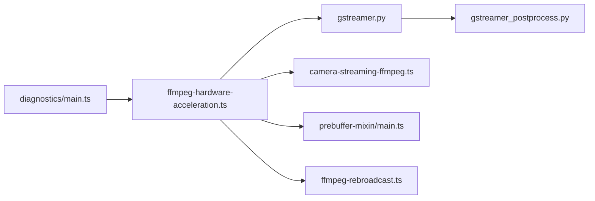

# 硬件加速支持

<cite>
**本文引用的文件**
- [common/src/ffmpeg-hardware-acceleration.ts](file://common/src/ffmpeg-hardware-acceleration.ts)
- [plugins/python-codecs/src/gstreamer.py](file://plugins/python-codecs/src/gstreamer.py)
- [plugins/python-codecs/src/gstreamer_postprocess.py](file://plugins/python-codecs/src/gstreamer_postprocess.py)
- [plugins/diagnostics/src/main.ts](file://plugins/diagnostics/src/main.ts)
- [plugins/homekit/src/types/camera/camera-streaming-ffmpeg.ts](file://plugins/homekit/src/types/camera/camera-streaming-ffmpeg.ts)
- [plugins/prebuffer-mixin/src/ffmpeg-rebroadcast.ts](file://plugins/prebuffer-mixin/src/ffmpeg-rebroadcast.ts)
- [plugins/prebuffer-mixin/src/main.ts](file://plugins/prebuffer-mixin/src/main.ts)
- [install/docker/install-nvidia-graphics.sh](file://install/docker/install-nvidia-graphics.sh)
- [install/docker/install-intel-graphics.sh](file://install/docker/install-intel-graphics.sh)
- [install/docker/install-amd-graphics.sh](file://install/docker/install-amd-graphics.sh)
- [install/docker/install-intel-oneapi.sh](file://install/docker/install-intel-oneapi.sh)
</cite>

## 目录
1. [简介](#简介)
2. [项目结构](#项目结构)
3. [核心组件](#核心组件)
4. [架构总览](#架构总览)
5. [详细组件分析](#详细组件分析)
6. [依赖关系分析](#依赖关系分析)
7. [性能考量](#性能考量)
8. [故障排除指南](#故障排除指南)
9. [结论](#结论)
10. [附录](#附录)

## 简介
本文件面向 Scrypted 的硬件加速支持系统，系统性阐述其在媒体处理中的作用：性能提升、功耗优化与实时性保障，并覆盖三大主流硬件路径：NVIDIA GPU（CUDA/NVENC/NVDISPATCH）、Intel 集成显卡（Quick Sync Video/VAAPI）与 ARM Mali（OpenMAX IL/V4L2）。文档同时给出自动检测机制、配置指南、故障排除与性能调优建议，帮助用户在不同硬件平台上获得稳定高效的视频编解码体验。

## 项目结构
围绕硬件加速的关键代码分布在通用库、插件与安装脚本三类模块中：
- 通用库：提供跨平台的 FFmpeg 编解码器参数选择与调试模式编码参数生成。
- 插件：基于 GStreamer 的流水线构建与后处理；诊断插件对 GPU 解码进行自动化验证；HomeKit 流水线在调试模式下采用软件编码参数；预缓冲混合器提供 FFmpeg 输入/输出参数的可配置前缀。
- 安装脚本：针对 Docker 环境下的 NVIDIA、Intel、AMD 与 Intel OneAPI 的驱动与运行时安装。

**图表来源**
- [common/src/ffmpeg-hardware-acceleration.ts:49-131](file://common/src/ffmpeg-hardware-acceleration.ts#L49-L131)
- [plugins/python-codecs/src/gstreamer.py:309-410](file://plugins/python-codecs/src/gstreamer.py#L309-L410)
- [plugins/python-codecs/src/gstreamer_postprocess.py:125-194](file://plugins/python-codecs/src/gstreamer_postprocess.py#L125-L194)
- [plugins/diagnostics/src/main.ts:654-724](file://plugins/diagnostics/src/main.ts#L654-L724)
- [plugins/homekit/src/types/camera/camera-streaming-ffmpeg.ts:43-69](file://plugins/homekit/src/types/camera/camera-streaming-ffmpeg.ts#L43-L69)
- [plugins/prebuffer-mixin/src/main.ts:314-346](file://plugins/prebuffer-mixin/src/main.ts#L314-L346)
- [plugins/prebuffer-mixin/src/ffmpeg-rebroadcast.ts:55-89](file://plugins/prebuffer-mixin/src/ffmpeg-rebroadcast.ts#L55-L89)
- [install/docker/install-nvidia-graphics.sh:1-55](file://install/docker/install-nvidia-graphics.sh#L1-L55)
- [install/docker/install-intel-graphics.sh:1-121](file://install/docker/install-intel-graphics.sh#L1-L121)
- [install/docker/install-amd-graphics.sh:1-56](file://install/docker/install-amd-graphics.sh#L1-L56)
- [install/docker/install-intel-oneapi.sh:1-18](file://install/docker/install-intel-oneapi.sh#L1-L18)

**章节来源**
- [common/src/ffmpeg-hardware-acceleration.ts:49-131](file://common/src/ffmpeg-hardware-acceleration.ts#L49-L131)
- [plugins/python-codecs/src/gstreamer.py:309-410](file://plugins/python-codecs/src/gstreamer.py#L309-L410)
- [plugins/diagnostics/src/main.ts:654-724](file://plugins/diagnostics/src/main.ts#L654-L724)

## 核心组件
- FFmpeg 硬件加速参数选择器：根据平台与设备类型返回可用的解码/编码器参数集合，涵盖 NVIDIA CUDA/CUVID、Intel QuickSync、VAAPI、V4L2、VideoToolbox 等。
- GStreamer 流水线与后处理：在 Linux 上通过 VAAPI 或 OpenGL 进行硬件后处理；在 macOS 使用安全默认的硬件解码器；在 Windows 使用对应厂商编码器。
- 诊断与验证：通过 FFmpeg 子进程执行自动检测，识别 VAAPI 设备并验证 NV12 输出，辅助判断硬件加速是否生效。
- 调试模式编码参数：在 HomeKit 场景中，调试模式下使用软件编码参数以保证稳定性与一致性。
- 可配置 FFmpeg 参数前缀：允许用户在预缓冲混合器中注入额外的输入/输出参数，便于微调性能与兼容性。
- 安装脚本：为 Docker 环境提供 NVIDIA、Intel、AMD 与 Intel OneAPI 的驱动与运行时安装流程。

**章节来源**
- [common/src/ffmpeg-hardware-acceleration.ts:49-131](file://common/src/ffmpeg-hardware-acceleration.ts#L49-L131)
- [plugins/python-codecs/src/gstreamer.py:309-410](file://plugins/python-codecs/src/gstreamer.py#L309-L410)
- [plugins/diagnostics/src/main.ts:654-724](file://plugins/diagnostics/src/main.ts#L654-L724)
- [plugins/homekit/src/types/camera/camera-streaming-ffmpeg.ts:43-69](file://plugins/homekit/src/types/camera/camera-streaming-ffmpeg.ts#L43-L69)
- [plugins/prebuffer-mixin/src/main.ts:314-346](file://plugins/prebuffer-mixin/src/main.ts#L314-L346)
- [install/docker/install-nvidia-graphics.sh:1-55](file://install/docker/install-nvidia-graphics.sh#L1-L55)
- [install/docker/install-intel-graphics.sh:1-121](file://install/docker/install-intel-graphics.sh#L1-L121)
- [install/docker/install-amd-graphics.sh:1-56](file://install/docker/install-amd-graphics.sh#L1-L56)
- [install/docker/install-intel-oneapi.sh:1-18](file://install/docker/install-intel-oneapi.sh#L1-L18)

## 架构总览
Scrypted 的硬件加速由“参数选择器 + 流水线构建 + 后处理 + 自检 + 安装脚本”构成闭环。参数选择器依据平台与设备特性输出最优编解码器组合；GStreamer/FFmpeg 执行实际的解码与编码；VAAPI/OpenGL 提供硬件后处理；诊断插件验证硬件加速是否启用；安装脚本确保容器内具备正确的驱动与运行时。

**图表来源**
- [common/src/ffmpeg-hardware-acceleration.ts:49-131](file://common/src/ffmpeg-hardware-acceleration.ts#L49-L131)
- [plugins/python-codecs/src/gstreamer.py:309-410](file://plugins/python-codecs/src/gstreamer.py#L309-L410)
- [plugins/python-codecs/src/gstreamer_postprocess.py:125-194](file://plugins/python-codecs/src/gstreamer_postprocess.py#L125-L194)
- [plugins/diagnostics/src/main.ts:654-724](file://plugins/diagnostics/src/main.ts#L654-L724)

## 详细组件分析

### 组件一：FFmpeg 硬件加速参数选择器
- 功能要点
  - 按平台返回解码器参数：NVIDIA CUDA/CUVID、Intel QuickSync、VAAPI、V4L2、VideoToolbox。
  - 按平台返回编码器参数：NVENC、QSV、AMF、VAAPI、V4L2、VideoToolbox。
  - 调试模式编码参数：使用软件编码器与特定像素格式、预设与无B帧等参数，便于问题定位。
- 关键行为
  - 在 macOS 默认启用硬件加速解码；Windows/Linux 分别映射到 QSV/AMF/NVENC 与 VAAPI/V4L2。
  - 在 Raspberry Pi 上保留扩展空间但当前不返回具体参数。
- 复杂度与性能
  - 参数拼接为 O(1) 查找与构造，开销极低；编码器选择影响 CPU/GPU 占用与延迟。

**图表来源**
- [common/src/ffmpeg-hardware-acceleration.ts:49-131](file://common/src/ffmpeg-hardware-acceleration.ts#L49-L131)

**章节来源**
- [common/src/ffmpeg-hardware-acceleration.ts:49-131](file://common/src/ffmpeg-hardware-acceleration.ts#L49-L131)

### 组件二：GStreamer 流水线与后处理
- 功能要点
  - 支持 RTSP/TCP 等输入源，按视频编码选择对应的 depay/parse 步骤。
  - 解码器选择：macOS 使用硬件解码器，其他平台使用安全的软件解码器作为默认，避免崩溃。
  - 后处理：VAAPI、OpenGL（GPU/系统内存）两种路径，支持裁剪与缩放。
- 关键行为
  - 在 Linux 上，当选择 VAAPI 后处理时，流水线会插入相应过滤器链。
  - OpenGL 路径支持 GLMemory 格式与下载回系统内存。
- 性能与兼容性
  - VAAPI/OpenGL 后处理显著降低 CPU 占用，提升实时性；需确保驱动与 ICD 正确安装。

**图表来源**
- [plugins/python-codecs/src/gstreamer.py:309-410](file://plugins/python-codecs/src/gstreamer.py#L309-L410)
- [plugins/python-codecs/src/gstreamer_postprocess.py:125-194](file://plugins/python-codecs/src/gstreamer_postprocess.py#L125-L194)

**章节来源**
- [plugins/python-codecs/src/gstreamer.py:309-410](file://plugins/python-codecs/src/gstreamer.py#L309-L410)
- [plugins/python-codecs/src/gstreamer_postprocess.py:125-194](file://plugins/python-codecs/src/gstreamer_postprocess.py#L125-L194)

### 组件三：诊断与 GPU 解码验证
- 功能要点
  - 通过 FFmpeg 子进程执行自动检测：启用自动硬件加速，尝试播放示例视频并监听输出日志中的硬件加速类型与 NV12 帧输出。
  - 若检测到 VAAPI 并存在 OpenVINO 插件，则进一步执行 VAAPI 图像处理测试。
- 关键行为
  - 设置超时与错误处理，避免长时间阻塞。
  - 将诊断结果写入控制台，便于用户快速定位问题。

**图表来源**
- [plugins/diagnostics/src/main.ts:654-724](file://plugins/diagnostics/src/main.ts#L654-L724)

**章节来源**
- [plugins/diagnostics/src/main.ts:654-724](file://plugins/diagnostics/src/main.ts#L654-L724)

### 组件四：HomeKit 调试模式编码参数
- 功能要点
  - 在调试模式下，使用软件编码参数（如特定像素格式、预设、GOP、帧率等），确保输出一致且可复现。
  - 非调试模式下直接复制视频流，减少处理开销。
- 关键行为
  - 与参数选择器配合，在需要稳定性的场景（如调试/录制）强制使用软件编码。

**章节来源**
- [plugins/homekit/src/types/camera/camera-streaming-ffmpeg.ts:43-69](file://plugins/homekit/src/types/camera/camera-streaming-ffmpeg.ts#L43-L69)
- [common/src/ffmpeg-hardware-acceleration.ts:133-146](file://common/src/ffmpeg-hardware-acceleration.ts#L133-L146)

### 组件五：可配置 FFmpeg 参数前缀
- 功能要点
  - 允许用户在预缓冲混合器中设置 FFmpeg 输入/输出参数前缀，便于注入额外选项（如日志级别、时间戳策略、编码参数等）。
- 关键行为
  - 通过存储项读取并拼接到命令行，不影响默认行为，仅在需要时增强可控性。

**章节来源**
- [plugins/prebuffer-mixin/src/main.ts:314-346](file://plugins/prebuffer-mixin/src/main.ts#L314-L346)

### 组件六：FFmpeg 输入流信息解析
- 功能要点
  - 通过解析 FFmpeg 子进程的标准输出/错误输出，提取视频编解码器等关键信息，用于后续处理或诊断。
- 关键行为
  - 限制解析范围与超时，避免阻塞主流程。

**章节来源**
- [plugins/prebuffer-mixin/src/ffmpeg-rebroadcast.ts:55-89](file://plugins/prebuffer-mixin/src/ffmpeg-rebroadcast.ts#L55-L89)

## 依赖关系分析
- 参数选择器被多处插件依赖，形成统一的编解码器策略入口。
- GStreamer 插件依赖参数选择器提供的解码器/编码器名称，并结合后处理模块实现硬件加速。
- 诊断插件依赖媒体管理器获取 FFmpeg 路径，并通过子进程执行验证。
- 预缓冲混合器通过参数前缀间接影响 FFmpeg 行为，与参数选择器形成互补。

**图表来源**
- [common/src/ffmpeg-hardware-acceleration.ts:49-131](file://common/src/ffmpeg-hardware-acceleration.ts#L49-L131)
- [plugins/python-codecs/src/gstreamer.py:309-410](file://plugins/python-codecs/src/gstreamer.py#L309-L410)
- [plugins/python-codecs/src/gstreamer_postprocess.py:125-194](file://plugins/python-codecs/src/gstreamer_postprocess.py#L125-L194)
- [plugins/diagnostics/src/main.ts:654-724](file://plugins/diagnostics/src/main.ts#L654-L724)
- [plugins/homekit/src/types/camera/camera-streaming-ffmpeg.ts:43-69](file://plugins/homekit/src/types/camera/camera-streaming-ffmpeg.ts#L43-L69)
- [plugins/prebuffer-mixin/src/main.ts:314-346](file://plugins/prebuffer-mixin/src/main.ts#L314-L346)
- [plugins/prebuffer-mixin/src/ffmpeg-rebroadcast.ts:55-89](file://plugins/prebuffer-mixin/src/ffmpeg-rebroadcast.ts#L55-L89)

**章节来源**
- [common/src/ffmpeg-hardware-acceleration.ts:49-131](file://common/src/ffmpeg-hardware-acceleration.ts#L49-L131)
- [plugins/python-codecs/src/gstreamer.py:309-410](file://plugins/python-codecs/src/gstreamer.py#L309-L410)
- [plugins/diagnostics/src/main.ts:654-724](file://plugins/diagnostics/src/main.ts#L654-L724)

## 性能考量
- 硬件加速优先级
  - macOS：默认启用硬件解码，兼顾稳定性与性能。
  - Linux：优先 VAAPI；容器内需正确挂载设备节点与 ICD 文件。
  - Windows：优先 QuickSync/AMF/NVENC，按硬件选择最佳编码器。
- 编解码器选择
  - 解码：CUDA/CUVID 适合 NVIDIA；VAAPI 适合 Intel/Mesa；QSV 适合 Intel；VTB 适合 macOS。
  - 编码：NVENC 适合 NVIDIA；QSV 适合 Intel；AMF 适合 AMD；VAAPI/V4L2 适合 Linux。
- 调试模式
  - 使用软件编码参数可避免硬件相关不稳定因素，便于问题定位与回归测试。
- 参数前缀
  - 通过输入/输出参数前缀微调延迟、码率、GOP、帧率等，平衡质量与性能。

[本节为通用指导，无需列出具体文件来源]

## 故障排除指南
- GPU 解码未生效
  - 使用诊断插件执行 GPU Decode 自检，确认 FFmpeg 输出中包含硬件加速类型与 NV12 帧。
  - 若未检测到 VAAPI，检查容器设备挂载与 ICD 文件是否存在。
- NVIDIA 环境
  - 确认已安装 CUDA 工具链与运行时；容器内 OpenCL ICD 文件可通过脚本生成。
  - 如需 NVENC 编码，请确认驱动版本与 FFmpeg 编译选项支持。
- Intel 环境
  - 安装 VAAPI 驱动与 OpenCL 运行时；注意不同 Ubuntu 版本的仓库差异。
  - Legacy 与最新版本的 Intel Compute Runtime 可能存在冲突，按脚本顺序安装。
- AMD 环境
  - 安装 AMDGPU-PRO 或使用官方安装器；确保 OpenCL 运行时与 ICD 正常加载。
- 调试与参数微调
  - 在 HomeKit 调试模式下强制软件编码，观察稳定性变化。
  - 在预缓冲混合器中添加输入/输出参数前缀，逐步调整延迟与质量。

**章节来源**
- [plugins/diagnostics/src/main.ts:654-724](file://plugins/diagnostics/src/main.ts#L654-L724)
- [install/docker/install-nvidia-graphics.sh:1-55](file://install/docker/install-nvidia-graphics.sh#L1-L55)
- [install/docker/install-intel-graphics.sh:1-121](file://install/docker/install-intel-graphics.sh#L1-L121)
- [install/docker/install-amd-graphics.sh:1-56](file://install/docker/install-amd-graphics.sh#L1-L56)
- [plugins/homekit/src/types/camera/camera-streaming-ffmpeg.ts:43-69](file://plugins/homekit/src/types/camera/camera-streaming-ffmpeg.ts#L43-L69)
- [plugins/prebuffer-mixin/src/main.ts:314-346](file://plugins/prebuffer-mixin/src/main.ts#L314-L346)

## 结论
Scrypted 的硬件加速体系以参数选择器为核心，结合 GStreamer/FFmpeg 流水线与后处理模块，在多平台与多厂商硬件上实现了统一而灵活的加速方案。通过诊断插件与安装脚本，系统能够自动验证硬件加速状态并提供一键安装能力。配合调试模式与参数前缀，用户可在稳定性与性能之间取得最佳平衡。

[本节为总结性内容，无需列出具体文件来源]

## 附录
- 配置清单（概要）
  - NVIDIA：安装 CUDA 工具链与运行时；启用 NVENC/NVDEC。
  - Intel：安装 VAAPI 驱动与 Intel Compute Runtime；启用 QSV。
  - AMD：安装 AMDGPU-PRO 或官方安装器；启用 OpenCL。
  - macOS：启用 VideoToolbox；默认安全解码器。
  - Linux 容器：正确挂载设备节点与 ICD 文件；必要时手动创建 ICD。
- 最佳实践
  - 优先使用硬件解码；在容器中确保设备与 ICD 可见。
  - 避免在不稳定环境下强制硬件编码；必要时切换至软件编码。
  - 使用参数前缀进行渐进式调参，先保证稳定性再追求极致性能。

[本节为通用指导，无需列出具体文件来源]