# 视频流处理

<cite>
**本文引用的文件**   
- [plugins/ffmpeg-camera/src/main.ts](file://plugins/ffmpeg-camera/src/main.ts)
- [plugins/gstreamer-camera/src/main.ts](file://plugins/gstreamer-camera/src/main.ts)
- [plugins/python-codecs/src/main.py](file://plugins/python-codecs/src/main.py)
- [plugins/python-codecs/src/gstreamer.py](file://plugins/python-codecs/src/gstreamer.py)
- [plugins/python-codecs/src/gstreamer_postprocess.py](file://plugins/python-codecs/src/gstreamer_postprocess.py)
- [plugins/python-codecs/src/libav.py](file://plugins/python-codecs/src/libav.py)
- [common/src/ffmpeg-hardware-acceleration.ts](file://common/src/ffmpeg-hardware-acceleration.ts)
- [common/src/autoconfigure-codecs.ts](file://common/src/autoconfigure-codecs.ts)
- [common/src/resolution-utils.ts](file://common/src/resolution-utils.ts)
- [plugins/onvif/src/onvif-api.ts](file://plugins/onvif/src/onvif-api.ts)
- [plugins/onvif/src/onvif-configure.ts](file://plugins/onvif/src/onvif-configure.ts)
- [plugins/hikvision/src/hikvision-camera-api.ts](file://plugins/hikvision/src/hikvision-camera-api.ts)
- [plugins/homekit/src/types/camera/h264-packetizer.ts](file://plugins/homekit/src/types/camera/h264-packetizer.ts)
- [plugins/homekit/src/types/camera/jitter-buffer.ts](file://plugins/homekit/src/types/camera/jitter-buffer.ts)
- [plugins/webrtc/src/ffmpeg-to-wrtc.ts](file://plugins/webrtc/src/ffmpeg-to-wrtc.ts)
- [plugins/webrtc/src/wrtc-to-rtsp.ts](file://plugins/webrtc/src/wrtc-to-rtsp.ts)
- [plugins/prebuffer-mixin/src/rtmp-session.ts](file://plugins/prebuffer-mixin/src/rtmp-session.ts)
- [plugins/prebuffer-mixin/src/main.ts](file://plugins/prebuffer-mixin/src/main.ts)
- [plugins/prebuffer-mixin/src/stream-settings.ts](file://plugins/prebuffer-mixin/src/stream-settings.ts)
- [plugins/objectdetector/src/main.ts](file://plugins/objectdetector/src/main.ts)
- [sdk/types/src/types.input.ts](file://sdk/types/src/types.input.ts)
- [common/src/rtsp-server.ts](file://common/src/rtsp-server.ts)
- [server/src/promise-utils.ts](file://server/src/promise-utils.ts)
- [plugins/snapshot/src/main.ts](file://plugins/snapshot/src/main.ts)
</cite>

## 目录
1. [简介](#简介)
2. [项目结构](#项目结构)
3. [核心组件](#核心组件)
4. [架构总览](#架构总览)
5. [详细组件分析](#详细组件分析)
6. [依赖关系分析](#依赖关系分析)
7. [性能考量](#性能考量)
8. [故障排查指南](#故障排查指南)
9. [结论](#结论)
10. [附录](#附录)

## 简介
本技术文档围绕 Scrypted 的视频流处理系统，系统化梳理从设备采集到客户端播放的完整链路：包括视频帧的捕获、解码、格式转换、编码、封装、传输与播放端接收。重点覆盖以下主题：
- 分辨率调整机制：动态分辨率切换、缩放算法选择、宽高比保持策略
- 码率控制算法：CBR/VBR 切换、自适应码率调整、网络带宽感知
- 编码器选择与配置：H.264、H.265、VP8、VP9 等编码器特点与适用场景
- 实时性保障：延迟控制、缓冲策略、丢帧处理
- 质量优化：主观质量评估、客观指标测量、性能调优建议
- 错误处理与故障恢复

## 项目结构
Scrypted 的视频流处理由“输入源（FFmpeg/GStreamer）+ 解码/转码（Python 扩展）+ 编码/封装（FFmpeg/GStreamer）+ 传输（RTSP/WebRTC/RTMP）+ 接收端（播放器/分析器）”构成。核心模块分布如下：
- 输入与流选项：FFmpeg/GStreamer 摄像机插件负责生成 FFmpegInput 或 GStreamer 命令行参数，并暴露媒体流选项
- 视频帧生成：Python 扩展通过 GStreamer/FFmpeg 管线生成 VideoFrame，支持分辨率裁剪、缩放、格式转换
- 编码与封装：根据平台能力选择硬件/软件编码器；FFmpeg/GStreamer 输出容器与协议
- 传输：RTSP/WebRTC/RTMP 等协议适配，配合 Jitter Buffer、重打包器等
- 预缓冲与合成：预缓冲策略、合成多分辨率流、按需选择目标流
- 自动配置：ONVIF/Hikvision 等设备能力探测与编码参数自动配置
- 工具与辅助：分辨率工具、硬件加速参数、RTSP 服务器、超时与错误图像

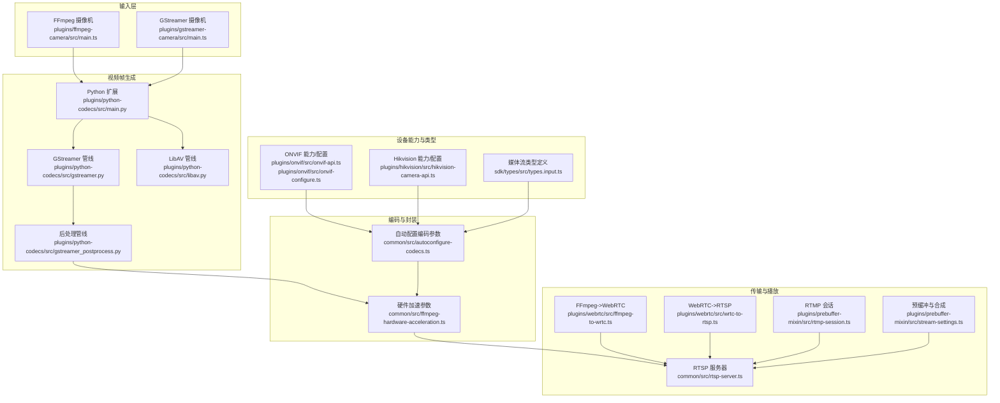

**图表来源**
- [plugins/ffmpeg-camera/src/main.ts:110-125](file://plugins/ffmpeg-camera/src/main.ts#L110-L125)
- [plugins/gstreamer-camera/src/main.ts:88-144](file://plugins/gstreamer-camera/src/main.ts#L88-L144)
- [plugins/python-codecs/src/main.py:54-70](file://plugins/python-codecs/src/main.py#L54-L70)
- [plugins/python-codecs/src/gstreamer.py:309-409](file://plugins/python-codecs/src/gstreamer.py#L309-L409)
- [plugins/python-codecs/src/gstreamer_postprocess.py:36-126](file://plugins/python-codecs/src/gstreamer_postprocess.py#L36-L126)
- [common/src/ffmpeg-hardware-acceleration.ts:49-146](file://common/src/ffmpeg-hardware-acceleration.ts#L49-L146)
- [common/src/autoconfigure-codecs.ts:63-183](file://common/src/autoconfigure-codecs.ts#L63-L183)
- [common/src/rtsp-server.ts:991-1215](file://common/src/rtsp-server.ts#L991-L1215)
- [plugins/webrtc/src/ffmpeg-to-wrtc.ts:55-69](file://plugins/webrtc/src/ffmpeg-to-wrtc.ts#L55-L69)
- [plugins/webrtc/src/wrtc-to-rtsp.ts:49-83](file://plugins/webrtc/src/wrtc-to-rtsp.ts#L49-L83)
- [plugins/prebuffer-mixin/src/rtmp-session.ts:29-83](file://plugins/prebuffer-mixin/src/rtmp-session.ts#L29-L83)
- [plugins/prebuffer-mixin/src/stream-settings.ts:43-267](file://plugins/prebuffer-mixin/src/stream-settings.ts#L43-L267)
- [plugins/onvif/src/onvif-api.ts:197-228](file://plugins/onvif/src/onvif-api.ts#L197-L228)
- [plugins/onvif/src/onvif-configure.ts:63-84](file://plugins/onvif/src/onvif-configure.ts#L63-L84)
- [plugins/hikvision/src/hikvision-camera-api.ts:322-355](file://plugins/hikvision/src/hikvision-camera-api.ts#L322-L355)
- [sdk/types/src/types.input.ts:822-831](file://sdk/types/src/types.input.ts#L822-L831)

**章节来源**
- [plugins/ffmpeg-camera/src/main.ts:17-125](file://plugins/ffmpeg-camera/src/main.ts#L17-L125)
- [plugins/gstreamer-camera/src/main.ts:11-144](file://plugins/gstreamer-camera/src/main.ts#L11-L144)
- [plugins/python-codecs/src/main.py:54-70](file://plugins/python-codecs/src/main.py#L54-L70)
- [plugins/python-codecs/src/gstreamer.py:309-409](file://plugins/python-codecs/src/gstreamer.py#L309-L409)
- [plugins/python-codecs/src/gstreamer_postprocess.py:36-126](file://plugins/python-codecs/src/gstreamer_postprocess.py#L36-L126)
- [common/src/ffmpeg-hardware-acceleration.ts:49-146](file://common/src/ffmpeg-hardware-acceleration.ts#L49-L146)
- [common/src/autoconfigure-codecs.ts:63-183](file://common/src/autoconfigure-codecs.ts#L63-L183)
- [common/src/rtsp-server.ts:991-1215](file://common/src/rtsp-server.ts#L991-L1215)
- [plugins/webrtc/src/ffmpeg-to-wrtc.ts:55-69](file://plugins/webrtc/src/ffmpeg-to-wrtc.ts#L55-L69)
- [plugins/webrtc/src/wrtc-to-rtsp.ts:49-83](file://plugins/webrtc/src/wrtc-to-rtsp.ts#L49-L83)
- [plugins/prebuffer-mixin/src/rtmp-session.ts:29-83](file://plugins/prebuffer-mixin/src/rtmp-session.ts#L29-L83)
- [plugins/prebuffer-mixin/src/stream-settings.ts:43-267](file://plugins/prebuffer-mixin/src/stream-settings.ts#L43-L267)
- [plugins/onvif/src/onvif-api.ts:197-228](file://plugins/onvif/src/onvif-api.ts#L197-L228)
- [plugins/onvif/src/onvif-configure.ts:63-84](file://plugins/onvif/src/onvif-configure.ts#L63-L84)
- [plugins/hikvision/src/hikvision-camera-api.ts:322-355](file://plugins/hikvision/src/hikvision-camera-api.ts#L322-L355)
- [sdk/types/src/types.input.ts:822-831](file://sdk/types/src/types.input.ts#L822-L831)

## 核心组件
- 输入与流选项
  - FFmpeg 摄像机：解析用户输入的命令行参数，生成 FFmpegInput 并创建媒体对象
  - GStreamer 摄像机：通过 gst-launch-1.0 生成 MPEG-TS 流并以 FFmpegInput 形式对外提供
- 视频帧生成
  - Python 扩展：统一入口 generateVideoFrames，内部选择 GStreamer/LibAV 管线，输出 VideoFrame
  - GStreamer 管线：根据视频编解码器选择解码器，设置队列与帧率，生成 GstSample 并转为 Image/Buffer
  - 后处理：支持视频裁剪、转换、缩放、VAAPI/OpenGL 后处理
- 编码与封装
  - 硬件加速参数：按平台选择 CUDA/CUVID/VAAPI/V4L2/QuickSync/VideoToolbox 等
  - 自动配置：基于设备能力与目标场景（本地/远程/低分辨率）选择分辨率、帧率、码率、关键帧间隔、质量
- 传输与播放
  - RTSP 服务器：支持 UDP/TCP，发送 RTP/RTCP，响应 DESCRIBE/PLAY/SETUP 等
  - WebRTC：FFmpeg->WebRTC 或 WebRTC->RTSP，按网络条件选择中分辨率或兼容模式
  - RTMP：预缓冲会话，H264 重打包，音频 AAC 配置
- 预缓冲与合成
  - 预缓冲策略：针对不同目的地（本地/远程/录制）选择默认与可选预缓冲流
  - 合成流：通过合成器创建额外分辨率/码率的流
- 设备能力与类型
  - ONVIF/Hikvision：查询能力、配置编码参数（分辨率、帧率、码率范围、质量、配置类型）
  - 类型定义：媒体流配置接口，包含分辨率、帧率、码率、质量、配置类型等字段

**章节来源**
- [plugins/ffmpeg-camera/src/main.ts:110-125](file://plugins/ffmpeg-camera/src/main.ts#L110-L125)
- [plugins/gstreamer-camera/src/main.ts:88-144](file://plugins/gstreamer-camera/src/main.ts#L88-L144)
- [plugins/python-codecs/src/main.py:54-70](file://plugins/python-codecs/src/main.py#L54-L70)
- [plugins/python-codecs/src/gstreamer.py:309-409](file://plugins/python-codecs/src/gstreamer.py#L309-L409)
- [plugins/python-codecs/src/gstreamer_postprocess.py:36-126](file://plugins/python-codecs/src/gstreamer_postprocess.py#L36-L126)
- [common/src/ffmpeg-hardware-acceleration.ts:49-146](file://common/src/ffmpeg-hardware-acceleration.ts#L49-L146)
- [common/src/autoconfigure-codecs.ts:63-183](file://common/src/autoconfigure-codecs.ts#L63-L183)
- [common/src/rtsp-server.ts:991-1215](file://common/src/rtsp-server.ts#L991-L1215)
- [plugins/webrtc/src/ffmpeg-to-wrtc.ts:55-69](file://plugins/webrtc/src/ffmpeg-to-wrtc.ts#L55-L69)
- [plugins/webrtc/src/wrtc-to-rtsp.ts:49-83](file://plugins/webrtc/src/wrtc-to-rtsp.ts#L49-L83)
- [plugins/prebuffer-mixin/src/rtmp-session.ts:29-83](file://plugins/prebuffer-mixin/src/rtmp-session.ts#L29-L83)
- [plugins/prebuffer-mixin/src/stream-settings.ts:43-267](file://plugins/prebuffer-mixin/src/stream-settings.ts#L43-L267)
- [plugins/onvif/src/onvif-api.ts:197-228](file://plugins/onvif/src/onvif-api.ts#L197-L228)
- [plugins/onvif/src/onvif-configure.ts:63-84](file://plugins/onvif/src/onvif-configure.ts#L63-L84)
- [plugins/hikvision/src/hikvision-camera-api.ts:322-355](file://plugins/hikvision/src/hikvision-camera-api.ts#L322-L355)
- [sdk/types/src/types.input.ts:822-831](file://sdk/types/src/types.input.ts#L822-L831)

## 架构总览
下图展示从设备采集到客户端播放的关键路径与交互：

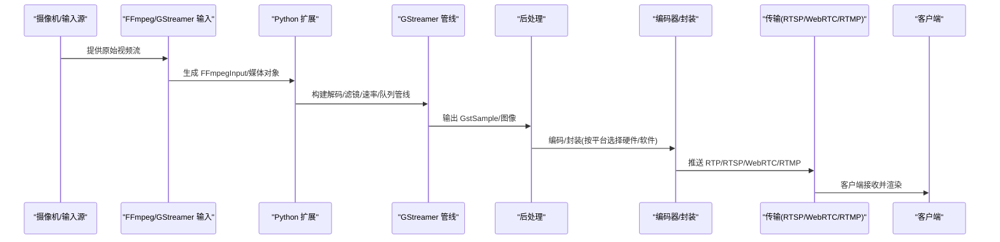

**图表来源**
- [plugins/ffmpeg-camera/src/main.ts:110-125](file://plugins/ffmpeg-camera/src/main.ts#L110-L125)
- [plugins/gstreamer-camera/src/main.ts:88-144](file://plugins/gstreamer-camera/src/main.ts#L88-L144)
- [plugins/python-codecs/src/main.py:54-70](file://plugins/python-codecs/src/main.py#L54-L70)
- [plugins/python-codecs/src/gstreamer.py:309-409](file://plugins/python-codecs/src/gstreamer.py#L309-L409)
- [plugins/python-codecs/src/gstreamer_postprocess.py:36-126](file://plugins/python-codecs/src/gstreamer_postprocess.py#L36-L126)
- [common/src/ffmpeg-hardware-acceleration.ts:49-146](file://common/src/ffmpeg-hardware-acceleration.ts#L49-L146)
- [common/src/rtsp-server.ts:991-1215](file://common/src/rtsp-server.ts#L991-L1215)
- [plugins/webrtc/src/ffmpeg-to-wrtc.ts:55-69](file://plugins/webrtc/src/ffmpeg-to-wrtc.ts#L55-L69)
- [plugins/webrtc/src/wrtc-to-rtsp.ts:49-83](file://plugins/webrtc/src/wrtc-to-rtsp.ts#L49-L83)
- [plugins/prebuffer-mixin/src/rtmp-session.ts:29-83](file://plugins/prebuffer-mixin/src/rtmp-session.ts#L29-L83)

## 详细组件分析

### 组件一：输入与流选项（FFmpeg/GStreamer）
- FFmpeg 摄像机
  - 将用户输入的命令行参数解析为 FFmpegInput，支持多路流；创建媒体对象供上层使用
  - 可配置是否启用音频
- GStreamer 摄像机
  - 通过 gst-launch-1.0 生成 MPEG-TS 流，经 TCP 客户端发送给本地监听端口
  - 支持单实例限制，避免并发占用物理摄像头资源

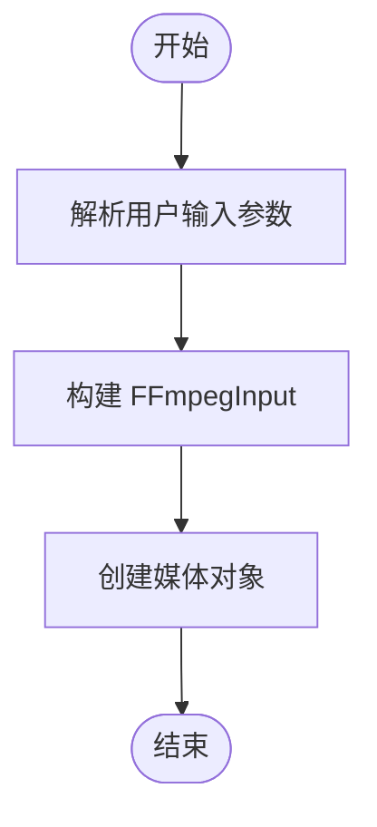

**图表来源**
- [plugins/ffmpeg-camera/src/main.ts:110-125](file://plugins/ffmpeg-camera/src/main.ts#L110-L125)
- [plugins/gstreamer-camera/src/main.ts:88-144](file://plugins/gstreamer-camera/src/main.ts#L88-L144)

**章节来源**
- [plugins/ffmpeg-camera/src/main.ts:17-125](file://plugins/ffmpeg-camera/src/main.ts#L17-L125)
- [plugins/gstreamer-camera/src/main.ts:11-144](file://plugins/gstreamer-camera/src/main.ts#L11-L144)

### 组件二：视频帧生成（GStreamer/LibAV）
- Python 扩展统一入口 generateVideoFrames，内部选择 GStreamer 或 LibAV 管线
- GStreamer 管线
  - 根据视频编解码器选择解码器（H.264/H.265/通用），设置帧率、队列
  - 生成 GstSample，转为 Image/Buffer，支持 JPEG/灰度/RGB 等格式
- 后处理
  - 视频裁剪、转换、缩放、VAAPI/OpenGL 后处理，确保输出格式对齐
  - 处理 4 字节步长对齐问题，必要时进行数据重排

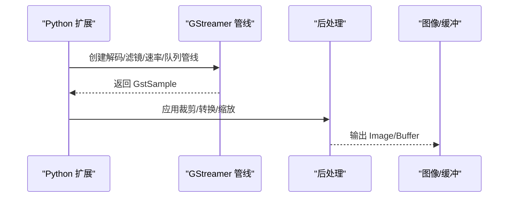

**图表来源**
- [plugins/python-codecs/src/main.py:54-70](file://plugins/python-codecs/src/main.py#L54-L70)
- [plugins/python-codecs/src/gstreamer.py:309-409](file://plugins/python-codecs/src/gstreamer.py#L309-L409)
- [plugins/python-codecs/src/gstreamer_postprocess.py:36-126](file://plugins/python-codecs/src/gstreamer_postprocess.py#L36-L126)

**章节来源**
- [plugins/python-codecs/src/main.py:54-70](file://plugins/python-codecs/src/main.py#L54-L70)
- [plugins/python-codecs/src/gstreamer.py:309-409](file://plugins/python-codecs/src/gstreamer.py#L309-L409)
- [plugins/python-codecs/src/gstreamer_postprocess.py:36-126](file://plugins/python-codecs/src/gstreamer_postprocess.py#L36-L126)

### 组件三：编码器选择与配置（硬件/软件）
- 硬件加速参数
  - 按平台选择 CUDA/CUVID/VAAPI/V4L2/QuickSync/VideoToolbox 等
  - H.264/H.265 编码器映射，调试模式下的 libx264 参数
- 自动配置
  - 基于设备能力（分辨率、帧率、码率、质量、配置类型）与目标场景（本地/远程/低分辨率）选择最优参数
  - 计算目标分辨率、帧率、码率、关键帧间隔、质量等级

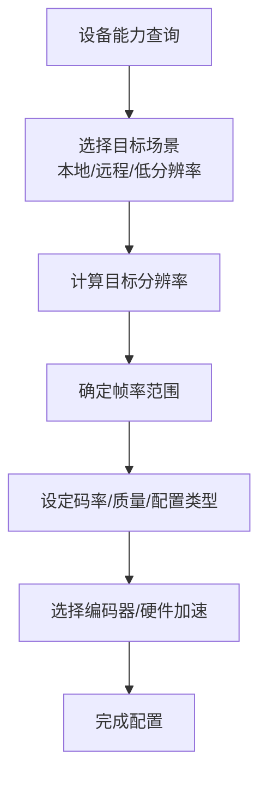

**图表来源**
- [common/src/ffmpeg-hardware-acceleration.ts:49-146](file://common/src/ffmpeg-hardware-acceleration.ts#L49-L146)
- [common/src/autoconfigure-codecs.ts:63-183](file://common/src/autoconfigure-codecs.ts#L63-L183)
- [plugins/onvif/src/onvif-api.ts:197-228](file://plugins/onvif/src/onvif-api.ts#L197-L228)
- [plugins/onvif/src/onvif-configure.ts:63-84](file://plugins/onvif/src/onvif-configure.ts#L63-L84)
- [plugins/hikvision/src/hikvision-camera-api.ts:322-355](file://plugins/hikvision/src/hikvision-camera-api.ts#L322-L355)
- [sdk/types/src/types.input.ts:822-831](file://sdk/types/src/types.input.ts#L822-L831)

**章节来源**
- [common/src/ffmpeg-hardware-acceleration.ts:49-146](file://common/src/ffmpeg-hardware-acceleration.ts#L49-L146)
- [common/src/autoconfigure-codecs.ts:63-183](file://common/src/autoconfigure-codecs.ts#L63-L183)
- [plugins/onvif/src/onvif-api.ts:197-228](file://plugins/onvif/src/onvif-api.ts#L197-L228)
- [plugins/onvif/src/onvif-configure.ts:63-84](file://plugins/onvif/src/onvif-configure.ts#L63-L84)
- [plugins/hikvision/src/hikvision-camera-api.ts:322-355](file://plugins/hikvision/src/hikvision-camera-api.ts#L322-L355)
- [sdk/types/src/types.input.ts:822-831](file://sdk/types/src/types.input.ts#L822-L831)

### 组件四：传输与播放（RTSP/WebRTC/RTMP）
- RTSP 服务器
  - 支持 UDP/TCP 协议，发送 RTP/RTCP，处理 DESCRIBE/PLAY/SETUP/TEARDOWN 等请求
  - 支持本地回环转发，便于预缓冲与合成
- WebRTC
  - FFmpeg->WebRTC：根据网络条件选择中分辨率或兼容模式
  - WebRTC->RTSP：建立 RTCPeerConnection，将 WebRTC 视频转为 RTSP 推送
- RTMP
  - 预缓冲会话，H264 重打包器，音频 AAC 配置，活动定时器与清理

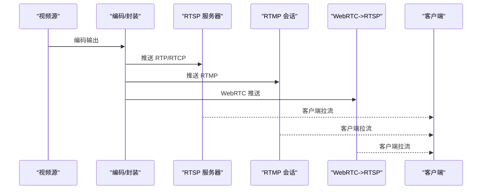

**图表来源**
- [common/src/rtsp-server.ts:991-1215](file://common/src/rtsp-server.ts#L991-L1215)
- [plugins/webrtc/src/ffmpeg-to-wrtc.ts:55-69](file://plugins/webrtc/src/ffmpeg-to-wrtc.ts#L55-L69)
- [plugins/webrtc/src/wrtc-to-rtsp.ts:49-83](file://plugins/webrtc/src/wrtc-to-rtsp.ts#L49-L83)
- [plugins/prebuffer-mixin/src/rtmp-session.ts:29-83](file://plugins/prebuffer-mixin/src/rtmp-session.ts#L29-L83)

**章节来源**
- [common/src/rtsp-server.ts:991-1215](file://common/src/rtsp-server.ts#L991-L1215)
- [plugins/webrtc/src/ffmpeg-to-wrtc.ts:55-69](file://plugins/webrtc/src/ffmpeg-to-wrtc.ts#L55-L69)
- [plugins/webrtc/src/wrtc-to-rtsp.ts:49-83](file://plugins/webrtc/src/wrtc-to-rtsp.ts#L49-L83)
- [plugins/prebuffer-mixin/src/rtmp-session.ts:29-83](file://plugins/prebuffer-mixin/src/rtmp-session.ts#L29-L83)

### 组件五：实时性保障（延迟、缓冲、丢帧）
- 延迟控制
  - GStreamer 管线设置队列（leaky=downstream）、帧率控制（videorate），减少累积延迟
  - WebRTC 中分辨率与兼容模式选择，降低端到端延迟
- 缓冲策略
  - 预缓冲：针对本地/远程录制场景启用预缓冲，提升首帧速度与事件触发稳定性
  - 合成流：按需创建额外分辨率/码率流，满足不同网络条件
- 丢帧处理
  - Jitter Buffer：按序列号顺序刷新，丢弃过期包，处理乱序与重复
  - H.264 重打包：处理 FU-A 分片丢失与连续性校验

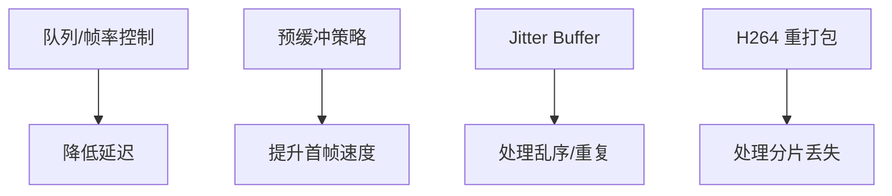

**图表来源**
- [plugins/python-codecs/src/gstreamer.py:377-394](file://plugins/python-codecs/src/gstreamer.py#L377-L394)
- [plugins/prebuffer-mixin/src/stream-settings.ts:43-267](file://plugins/prebuffer-mixin/src/stream-settings.ts#L43-L267)
- [plugins/homekit/src/types/camera/jitter-buffer.ts:51-109](file://plugins/homekit/src/types/camera/jitter-buffer.ts#L51-L109)
- [plugins/homekit/src/types/camera/h264-packetizer.ts:456-475](file://plugins/homekit/src/types/camera/h264-packetizer.ts#L456-L475)

**章节来源**
- [plugins/python-codecs/src/gstreamer.py:377-394](file://plugins/python-codecs/src/gstreamer.py#L377-L394)
- [plugins/prebuffer-mixin/src/stream-settings.ts:43-267](file://plugins/prebuffer-mixin/src/stream-settings.ts#L43-L267)
- [plugins/homekit/src/types/camera/jitter-buffer.ts:51-109](file://plugins/homekit/src/types/camera/jitter-buffer.ts#L51-L109)
- [plugins/homekit/src/types/camera/h264-packetizer.ts:456-475](file://plugins/homekit/src/types/camera/h264-packetizer.ts#L456-L475)

### 组件六：分辨率调整机制（动态切换、缩放、宽高比）
- 动态分辨率切换
  - 预缓冲与合成：根据目的地（本地/远程/低分辨率）选择默认与可选流
  - 自动配置：基于设备能力与目标场景选择分辨率、帧率、码率
- 缩放算法
  - GStreamer videoscale：支持添加边框、对齐步长，确保输出格式兼容
  - 4 字节步长对齐：GRAY8 允许步长填充，其他格式强制 RGBA 输出
- 宽高比保持
  - 工具函数：按宽度计算高度，保持比例一致

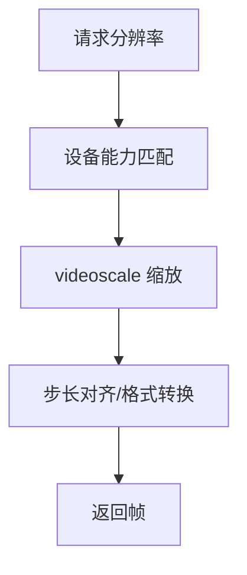

**图表来源**
- [plugins/prebuffer-mixin/src/stream-settings.ts:43-267](file://plugins/prebuffer-mixin/src/stream-settings.ts#L43-L267)
- [common/src/autoconfigure-codecs.ts:63-183](file://common/src/autoconfigure-codecs.ts#L63-L183)
- [plugins/python-codecs/src/gstreamer_postprocess.py:36-126](file://plugins/python-codecs/src/gstreamer_postprocess.py#L36-L126)
- [common/src/resolution-utils.ts:1-5](file://common/src/resolution-utils.ts#L1-L5)

**章节来源**
- [plugins/prebuffer-mixin/src/stream-settings.ts:43-267](file://plugins/prebuffer-mixin/src/stream-settings.ts#L43-L267)
- [common/src/autoconfigure-codecs.ts:63-183](file://common/src/autoconfigure-codecs.ts#L63-L183)
- [plugins/python-codecs/src/gstreamer_postprocess.py:36-126](file://plugins/python-codecs/src/gstreamer_postprocess.py#L36-L126)
- [common/src/resolution-utils.ts:1-5](file://common/src/resolution-utils.ts#L1-L5)

### 组件七：码率控制与自适应（CBR/VBR、带宽感知）
- CBR/VBR 切换
  - 设备能力：ONVIF/Hikvision 支持查询/设置码率控制类型（CBR/VBR）
  - 强制一致性：若设备已配置与期望不一致，抛出错误提示手动修正
- 自适应码率
  - WebRTC：根据网络条件选择中分辨率或兼容模式，降低码率以保证流畅
  - 预缓冲：在本地网络优先使用高质量流，远程场景采用中低分辨率

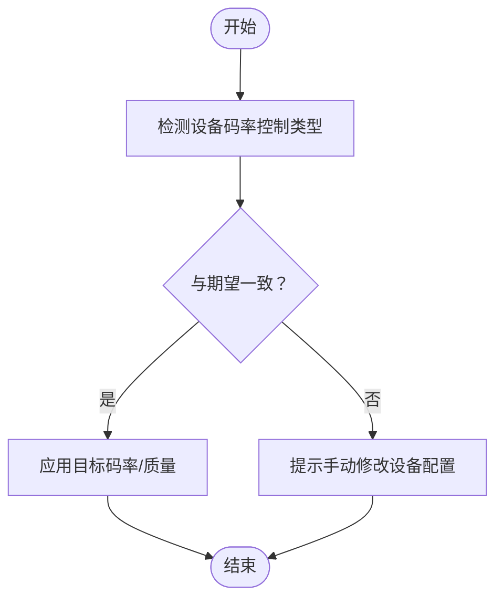

**图表来源**
- [plugins/onvif/src/onvif-configure.ts:63-84](file://plugins/onvif/src/onvif-configure.ts#L63-L84)
- [plugins/hikvision/src/hikvision-camera-api.ts:322-355](file://plugins/hikvision/src/hikvision-camera-api.ts#L322-L355)
- [plugins/webrtc/src/ffmpeg-to-wrtc.ts:55-69](file://plugins/webrtc/src/ffmpeg-to-wrtc.ts#L55-L69)

**章节来源**
- [plugins/onvif/src/onvif-configure.ts:63-84](file://plugins/onvif/src/onvif-configure.ts#L63-L84)
- [plugins/hikvision/src/hikvision-camera-api.ts:322-355](file://plugins/hikvision/src/hikvision-camera-api.ts#L322-L355)
- [plugins/webrtc/src/ffmpeg-to-wrtc.ts:55-69](file://plugins/webrtc/src/ffmpeg-to-wrtc.ts#L55-L69)

### 组件八：视频质量优化（主观/客观、调优建议）
- 主观质量评估
  - 使用预缓冲与合成流，结合不同分辨率/码率对比
  - 对比 WebRTC 与 RTSP 在不同网络条件下的体验
- 客观指标测量
  - 延迟：队列/帧率控制、Jitter Buffer、RTSP/WebRTC 传输时延
  - 丢包/乱序：Jitter Buffer 刷新与丢弃统计
  - 码率：实际输出码率与目标值对比
- 性能调优建议
  - 优先启用硬件加速（CUDA/CUVID/VAAPI/V4L2/QuickSync/VideoToolbox）
  - 合理设置队列与帧率，避免过度缓存
  - 远程场景优先采用中分辨率流，本地场景采用高分辨率流

**章节来源**
- [common/src/ffmpeg-hardware-acceleration.ts:49-146](file://common/src/ffmpeg-hardware-acceleration.ts#L49-L146)
- [plugins/python-codecs/src/gstreamer.py:377-394](file://plugins/python-codecs/src/gstreamer.py#L377-L394)
- [plugins/homekit/src/types/camera/jitter-buffer.ts:51-109](file://plugins/homekit/src/types/camera/jitter-buffer.ts#L51-L109)

### 组件九：错误处理与故障恢复
- 超时与异常
  - Promise 超时工具：超时抛出 TimeoutError，避免长时间阻塞
  - 插件间通信：RPC 结果错误包装，进程安全检查
- 错误图像与清理
  - 快照插件：定期清理错误图像，避免磁盘膨胀
- 传输层健壮性
  - RTSP：Track 不存在、UDP 不可用时的告警与降级
  - RTMP：连接关闭/错误时的清理与重试策略

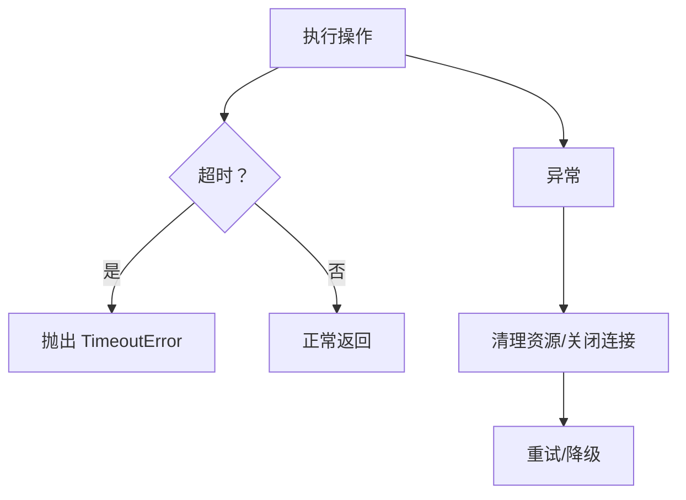

**图表来源**
- [server/src/promise-utils.ts:30-54](file://server/src/promise-utils.ts#L30-L54)
- [plugins/snapshot/src/main.ts:567-584](file://plugins/snapshot/src/main.ts#L567-L584)
- [common/src/rtsp-server.ts:1010-1026](file://common/src/rtsp-server.ts#L1010-L1026)
- [plugins/prebuffer-mixin/src/rtmp-session.ts:29-83](file://plugins/prebuffer-mixin/src/rtmp-session.ts#L29-L83)

**章节来源**
- [server/src/promise-utils.ts:30-54](file://server/src/promise-utils.ts#L30-L54)
- [plugins/snapshot/src/main.ts:567-584](file://plugins/snapshot/src/main.ts#L567-L584)
- [common/src/rtsp-server.ts:1010-1026](file://common/src/rtsp-server.ts#L1010-L1026)
- [plugins/prebuffer-mixin/src/rtmp-session.ts:29-83](file://plugins/prebuffer-mixin/src/rtmp-session.ts#L29-L83)

## 依赖关系分析
- 组件耦合
  - 输入层（FFmpeg/GStreamer）与视频帧生成（Python 扩展）松耦合，通过媒体对象接口对接
  - 编码与封装依赖硬件加速参数与自动配置模块
  - 传输层（RTSP/WebRTC/RTMP）与播放端解码器/重打包器解耦
- 外部依赖
  - GStreamer/FFmpeg/LibAV、ONVIF/Hikvision 设备 API、WebRTC 库
- 循环依赖
  - 未发现直接循环依赖；各模块通过接口与工厂模式解耦

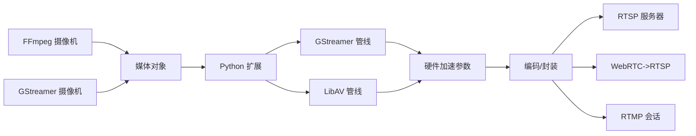

**图表来源**
- [plugins/ffmpeg-camera/src/main.ts:110-125](file://plugins/ffmpeg-camera/src/main.ts#L110-L125)
- [plugins/gstreamer-camera/src/main.ts:88-144](file://plugins/gstreamer-camera/src/main.ts#L88-L144)
- [plugins/python-codecs/src/main.py:54-70](file://plugins/python-codecs/src/main.py#L54-L70)
- [plugins/python-codecs/src/gstreamer.py:309-409](file://plugins/python-codecs/src/gstreamer.py#L309-L409)
- [plugins/python-codecs/src/libav.py:20-46](file://plugins/python-codecs/src/libav.py#L20-L46)
- [common/src/ffmpeg-hardware-acceleration.ts:49-146](file://common/src/ffmpeg-hardware-acceleration.ts#L49-L146)
- [common/src/rtsp-server.ts:991-1215](file://common/src/rtsp-server.ts#L991-L1215)
- [plugins/webrtc/src/wrtc-to-rtsp.ts:49-83](file://plugins/webrtc/src/wrtc-to-rtsp.ts#L49-L83)
- [plugins/prebuffer-mixin/src/rtmp-session.ts:29-83](file://plugins/prebuffer-mixin/src/rtmp-session.ts#L29-L83)

**章节来源**
- [plugins/ffmpeg-camera/src/main.ts:110-125](file://plugins/ffmpeg-camera/src/main.ts#L110-L125)
- [plugins/gstreamer-camera/src/main.ts:88-144](file://plugins/gstreamer-camera/src/main.ts#L88-L144)
- [plugins/python-codecs/src/main.py:54-70](file://plugins/python-codecs/src/main.py#L54-L70)
- [plugins/python-codecs/src/gstreamer.py:309-409](file://plugins/python-codecs/src/gstreamer.py#L309-L409)
- [plugins/python-codecs/src/libav.py:20-46](file://plugins/python-codecs/src/libav.py#L20-L46)
- [common/src/ffmpeg-hardware-acceleration.ts:49-146](file://common/src/ffmpeg-hardware-acceleration.ts#L49-L146)
- [common/src/rtsp-server.ts:991-1215](file://common/src/rtsp-server.ts#L991-L1215)
- [plugins/webrtc/src/wrtc-to-rtsp.ts:49-83](file://plugins/webrtc/src/wrtc-to-rtsp.ts#L49-L83)
- [plugins/prebuffer-mixin/src/rtmp-session.ts:29-83](file://plugins/prebuffer-mixin/src/rtmp-session.ts#L29-L83)

## 性能考量
- 硬件加速优先：在支持平台上启用 CUDA/CUVID/VAAPI/V4L2/QuickSync/VideoToolbox
- 管线优化：合理设置队列与帧率，避免过度缓存导致延迟上升
- 码率与分辨率：远程场景优先中低分辨率，本地场景优先高分辨率
- 传输协议：RTSP 适合稳定网络，WebRTC 适合弱网与浏览器播放
- 预缓冲：针对事件触发与录制场景启用预缓冲，提升首帧速度与稳定性

## 故障排查指南
- 常见问题
  - 设备码率控制类型与期望不一致：根据提示在设备管理界面手动修改
  - RTSP Track 不存在/UDP 不可用：检查服务器状态与网络配置
  - RTMP 连接关闭/错误：确认地址与端口，清理资源并重试
  - 超时：调整超时阈值或优化上游处理
- 建议步骤
  - 启用详细日志，定位问题阶段
  - 逐步替换组件（输入源/编码器/传输协议）以缩小范围
  - 使用工具函数（分辨率计算、硬件参数）验证配置

**章节来源**
- [plugins/onvif/src/onvif-configure.ts:63-84](file://plugins/onvif/src/onvif-configure.ts#L63-L84)
- [plugins/hikvision/src/hikvision-camera-api.ts:322-355](file://plugins/hikvision/src/hikvision-camera-api.ts#L322-L355)
- [common/src/rtsp-server.ts:1010-1026](file://common/src/rtsp-server.ts#L1010-L1026)
- [plugins/prebuffer-mixin/src/rtmp-session.ts:29-83](file://plugins/prebuffer-mixin/src/rtmp-session.ts#L29-L83)
- [server/src/promise-utils.ts:30-54](file://server/src/promise-utils.ts#L30-L54)

## 结论
Scrypted 的视频流处理系统通过“输入层 + 视频帧生成 + 编码封装 + 传输播放”的清晰分层，结合硬件加速、自动配置与预缓冲策略，在保证实时性的前提下实现了灵活的分辨率与码率控制。通过对 ONVIF/Hikvision 等设备能力的深度集成，系统能够实现从设备采集到客户端播放的全链路优化与故障恢复。

## 附录
- 关键流程参考路径
  - 输入与流选项：[plugins/ffmpeg-camera/src/main.ts:110-125](file://plugins/ffmpeg-camera/src/main.ts#L110-L125)，[plugins/gstreamer-camera/src/main.ts:88-144](file://plugins/gstreamer-camera/src/main.ts#L88-L144)
  - 视频帧生成：[plugins/python-codecs/src/main.py:54-70](file://plugins/python-codecs/src/main.py#L54-L70)，[plugins/python-codecs/src/gstreamer.py:309-409](file://plugins/python-codecs/src/gstreamer.py#L309-L409)
  - 编码与封装：[common/src/ffmpeg-hardware-acceleration.ts:49-146](file://common/src/ffmpeg-hardware-acceleration.ts#L49-L146)，[common/src/autoconfigure-codecs.ts:63-183](file://common/src/autoconfigure-codecs.ts#L63-L183)
  - 传输与播放：[common/src/rtsp-server.ts:991-1215](file://common/src/rtsp-server.ts#L991-L1215)，[plugins/webrtc/src/ffmpeg-to-wrtc.ts:55-69](file://plugins/webrtc/src/ffmpeg-to-wrtc.ts#L55-L69)，[plugins/webrtc/src/wrtc-to-rtsp.ts:49-83](file://plugins/webrtc/src/wrtc-to-rtsp.ts#L49-L83)，[plugins/prebuffer-mixin/src/rtmp-session.ts:29-83](file://plugins/prebuffer-mixin/src/rtmp-session.ts#L29-L83)
  - 预缓冲与合成：[plugins/prebuffer-mixin/src/stream-settings.ts:43-267](file://plugins/prebuffer-mixin/src/stream-settings.ts#L43-L267)
  - 设备能力与类型：[plugins/onvif/src/onvif-api.ts:197-228](file://plugins/onvif/src/onvif-api.ts#L197-L228)，[plugins/onvif/src/onvif-configure.ts:63-84](file://plugins/onvif/src/onvif-configure.ts#L63-L84)，[plugins/hikvision/src/hikvision-camera-api.ts:322-355](file://plugins/hikvision/src/hikvision-camera-api.ts#L322-L355)，[sdk/types/src/types.input.ts:822-831](file://sdk/types/src/types.input.ts#L822-L831)