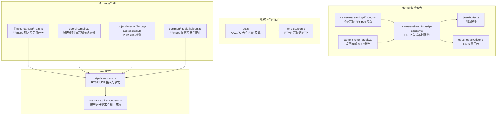
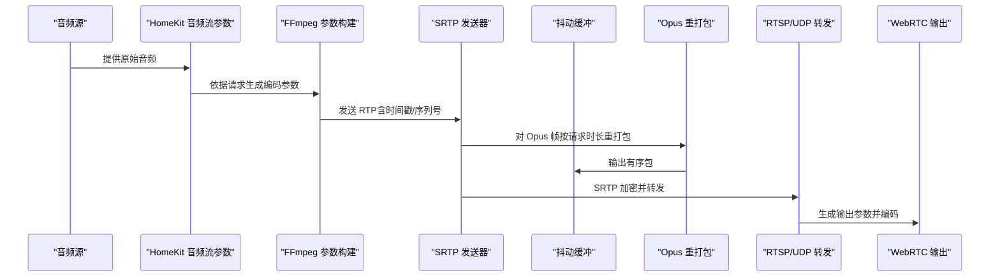
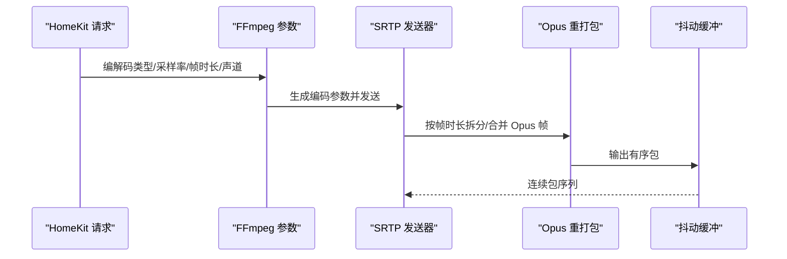
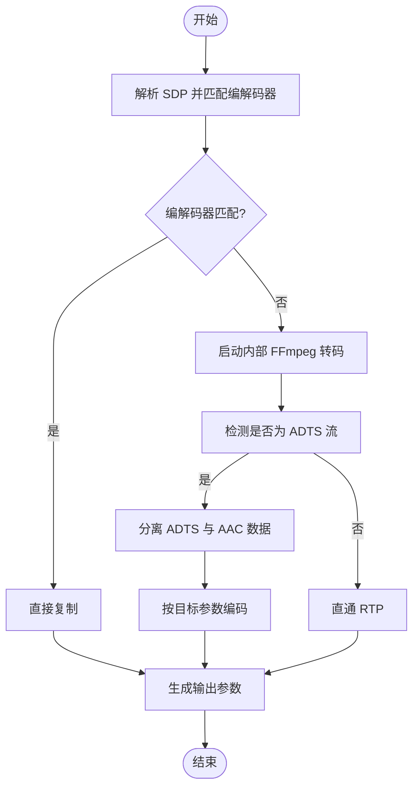
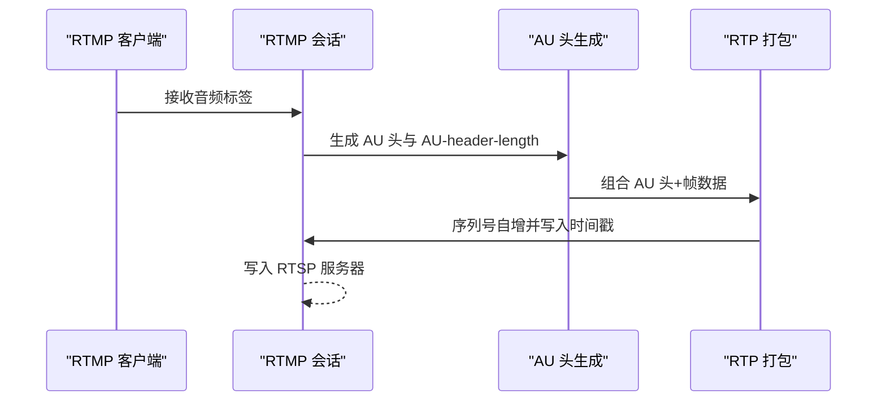
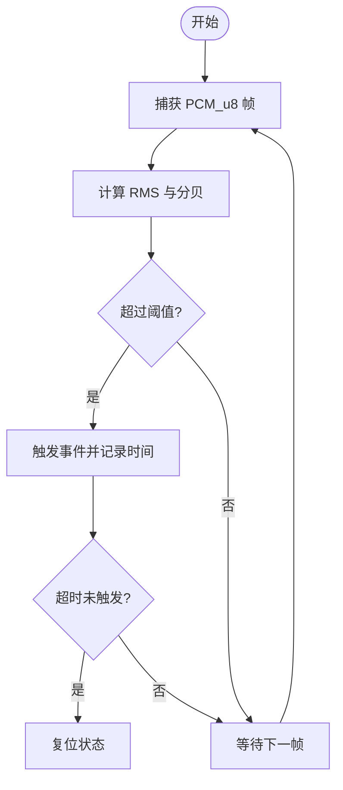
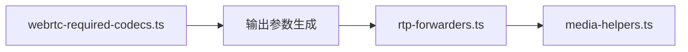

# 音频处理

<cite>
**本文引用的文件**
- [plugins/homekit/src/types/camera/camera-streaming-ffmpeg.ts](file://plugins/homekit/src/types/camera/camera-streaming-ffmpeg.ts)
- [plugins/homekit/src/types/camera/camera-streaming-srtp-sender.ts](file://plugins/homekit/src/types/camera/camera-streaming-srtp-sender.ts)
- [plugins/homekit/src/types/camera/jitter-buffer.ts](file://plugins/homekit/src/types/camera/jitter-buffer.ts)
- [plugins/homekit/src/types/camera/opus-repacketizer.ts](file://plugins/homekit/src/types/camera/opus-repacketizer.ts)
- [plugins/homekit/src/types/camera/camera-return-audio.ts](file://plugins/homekit/src/types/camera/camera-return-audio.ts)
- [plugins/webrtc/src/rtp-forwarders.ts](file://plugins/webrtc/src/rtp-forwarders.ts)
- [plugins/webrtc/src/webrtc-required-codecs.ts](file://plugins/webrtc/src/webrtc-required-codecs.ts)
- [plugins/prebuffer-mixin/src/au.ts](file://plugins/prebuffer-mixin/src/au.ts)
- [plugins/prebuffer-mixin/src/rtmp-session.ts](file://plugins/prebuffer-mixin/src/rtmp-session.ts)
- [plugins/ffmpeg-camera/src/main.ts](file://plugins/ffmpeg-camera/src/main.ts)
- [plugins/doorbird/src/main.ts](file://plugins/doorbird/src/main.ts)
- [plugins/objectdetector/src/ffmpeg-audiosensor.ts](file://plugins/objectdetector/src/ffmpeg-audiosensor.ts)
- [common/src/media-helpers.ts](file://common/src/media-helpers.ts)
</cite>

## 目录
1. [简介](#简介)
2. [项目结构](#项目结构)
3. [核心组件](#核心组件)
4. [架构总览](#架构总览)
5. [详细组件分析](#详细组件分析)
6. [依赖关系分析](#依赖关系分析)
7. [性能考量](#性能考量)
8. [故障排查指南](#故障排查指南)
9. [结论](#结论)
10. [附录](#附录)

## 简介
本文件面向 Scrypted 的音频处理系统，围绕音频采集、处理与传输进行系统化技术说明。重点覆盖以下方面：
- 音频参数配置与转换：采样率、位深、声道数的协商与转换策略
- 编解码器选择与参数：AAC、MP3（通过 FFmpeg）、Opus、G.711（PCMU/PCMA）等在不同场景下的使用
- 音视频同步机制：时间戳对齐、抖动消除、同步偏差校正
- 实时处理策略：缓冲管理、延迟控制、中断处理
- 格式转换流程：采样率转换、声道重排、比特率调整
- 质量优化：信噪比改善、回声消除、噪声抑制
- 错误检测与恢复、常见问题诊断

## 项目结构
Scrypted 的音频处理由多插件协同完成，核心路径如下：
- HomeKit 摄像头音频流：封装 FFmpeg 参数、SRTP 发送、抖动缓冲与 Opus 重打包
- WebRTC 音频转发：RTSP/UDP 接入、音频转码与输出参数生成
- 预缓冲与 RTMP 音频：AAC AU 头生成、RTP 打包与转发
- FFmpeg 摄像头输入：通用 FFmpeg 输入参数与音频开关
- 噪声抑制与语音增强：基于 FFmpeg 过滤器的音频后处理
- 音频传感器：基于 PCM 的响度检测与事件触发

**图表来源**
- [plugins/homekit/src/types/camera/camera-streaming-ffmpeg.ts:14-297](file://plugins/homekit/src/types/camera/camera-streaming-ffmpeg.ts#L14-L297)
- [plugins/homekit/src/types/camera/camera-streaming-srtp-sender.ts:14-180](file://plugins/homekit/src/types/camera/camera-streaming-srtp-sender.ts#L14-L180)
- [plugins/homekit/src/types/camera/jitter-buffer.ts:44-86](file://plugins/homekit/src/types/camera/jitter-buffer.ts#L44-L86)
- [plugins/homekit/src/types/camera/opus-repacketizer.ts:93-119](file://plugins/homekit/src/types/camera/opus-repacketizer.ts#L93-L119)
- [plugins/homekit/src/types/camera/camera-return-audio.ts:1-63](file://plugins/homekit/src/types/camera/camera-return-audio.ts#L1-L63)
- [plugins/webrtc/src/rtp-forwarders.ts:116-601](file://plugins/webrtc/src/rtp-forwarders.ts#L116-L601)
- [plugins/webrtc/src/webrtc-required-codecs.ts:30-116](file://plugins/webrtc/src/webrtc-required-codecs.ts#L30-L116)
- [plugins/prebuffer-mixin/src/au.ts:1-78](file://plugins/prebuffer-mixin/src/au.ts#L1-L78)
- [plugins/prebuffer-mixin/src/rtmp-session.ts:85-116](file://plugins/prebuffer-mixin/src/rtmp-session.ts#L85-L116)
- [plugins/ffmpeg-camera/src/main.ts:17-142](file://plugins/ffmpeg-camera/src/main.ts#L17-L142)
- [plugins/doorbird/src/main.ts:623-651](file://plugins/doorbird/src/main.ts#L623-L651)
- [plugins/objectdetector/src/ffmpeg-audiosensor.ts:80-128](file://plugins/objectdetector/src/ffmpeg-audiosensor.ts#L80-L128)
- [common/src/media-helpers.ts:1-2](file://common/src/media-helpers.ts#L1-L2)

**章节来源**
- [plugins/homekit/src/types/camera/camera-streaming-ffmpeg.ts:14-297](file://plugins/homekit/src/types/camera/camera-streaming-ffmpeg.ts#L14-L297)
- [plugins/webrtc/src/rtp-forwarders.ts:116-601](file://plugins/webrtc/src/rtp-forwarders.ts#L116-L601)

## 核心组件
- HomeKit 音频流参数与发送
  - 构建音频 FFmpeg 参数（编解码器、采样率、比特率、声道）
  - SRTP 发送器：维护首包时间戳、序列号、SSRC，按请求的帧时长与采样率缩放时间戳
  - 抖动缓冲：按序列号顺序输出，丢弃过期包，保证接收端连续性
  - Opus 重打包：根据请求的帧时长拆分/合并帧，维持时间戳单调递增
  - 返回音频 SDP：根据协商的采样率写入频率索引字段
- WebRTC 音频转发
  - RTSP/UDP 接入：解析 SDP，匹配/协商编解码器；必要时启动内部 FFmpeg 转码
  - 输出参数生成：根据目标编解码器生成编码器、采样率、通道、比特率等参数
- 预缓冲与 RTMP 音频
  - AAC AU 头生成：为 RTP 负载生成 AU 头与 AU-header-length
  - RTMP 到 RTP：解析 FLV 音频标签，生成 RTP 包并写入 RTSP 服务器
- FFmpeg 摄像头输入
  - 支持多路输入参数，可禁用音频
- 噪声抑制与语音增强
  - 基于 FFmpeg 过滤器链：噪声抑制、门限压缩、高通/低通滤波、增益提升
- 音频传感器
  - 使用 PCM_u8 捕获音频，计算 RMS 并换算为分贝，超过阈值触发事件

**章节来源**
- [plugins/homekit/src/types/camera/camera-streaming-ffmpeg.ts:138-220](file://plugins/homekit/src/types/camera/camera-streaming-ffmpeg.ts#L138-L220)
- [plugins/homekit/src/types/camera/camera-streaming-srtp-sender.ts:114-173](file://plugins/homekit/src/types/camera/camera-streaming-srtp-sender.ts#L114-L173)
- [plugins/homekit/src/types/camera/jitter-buffer.ts:44-86](file://plugins/homekit/src/types/camera/jitter-buffer.ts#L44-L86)
- [plugins/homekit/src/types/camera/opus-repacketizer.ts:93-119](file://plugins/homekit/src/types/camera/opus-repacketizer.ts#L93-L119)
- [plugins/homekit/src/types/camera/camera-return-audio.ts:1-63](file://plugins/homekit/src/types/camera/camera-return-audio.ts#L1-L63)
- [plugins/webrtc/src/rtp-forwarders.ts:286-329](file://plugins/webrtc/src/rtp-forwarders.ts#L286-L329)
- [plugins/webrtc/src/webrtc-required-codecs.ts:88-116](file://plugins/webrtc/src/webrtc-required-codecs.ts#L88-L116)
- [plugins/prebuffer-mixin/src/au.ts:10-78](file://plugins/prebuffer-mixin/src/au.ts#L10-L78)
- [plugins/prebuffer-mixin/src/rtmp-session.ts:85-116](file://plugins/prebuffer-mixin/src/rtmp-session.ts#L85-L116)
- [plugins/ffmpeg-camera/src/main.ts:127-141](file://plugins/ffmpeg-camera/src/main.ts#L127-L141)
- [plugins/doorbird/src/main.ts:623-651](file://plugins/doorbird/src/main.ts#L623-L651)
- [plugins/objectdetector/src/ffmpeg-audiosensor.ts:80-128](file://plugins/objectdetector/src/ffmpeg-audiosensor.ts#L80-L128)

## 架构总览
下图展示从采集到输出的关键路径与交互：

**图表来源**
- [plugins/homekit/src/types/camera/camera-streaming-ffmpeg.ts:138-220](file://plugins/homekit/src/types/camera/camera-streaming-ffmpeg.ts#L138-L220)
- [plugins/homekit/src/types/camera/camera-streaming-srtp-sender.ts:114-173](file://plugins/homekit/src/types/camera/camera-streaming-srtp-sender.ts#L114-L173)
- [plugins/homekit/src/types/camera/opus-repacketizer.ts:93-119](file://plugins/homekit/src/types/camera/opus-repacketizer.ts#L93-L119)
- [plugins/homekit/src/types/camera/jitter-buffer.ts:44-86](file://plugins/homekit/src/types/camera/jitter-buffer.ts#L44-L86)
- [plugins/webrtc/src/rtp-forwarders.ts:286-329](file://plugins/webrtc/src/rtp-forwarders.ts#L286-L329)
- [plugins/webrtc/src/webrtc-required-codecs.ts:88-116](file://plugins/webrtc/src/webrtc-required-codecs.ts#L88-L116)

## 详细组件分析

### 组件一：HomeKit 音频流参数与发送
- 功能要点
  - 根据 HomeKit 请求的编解码类型（Opus/AAC ELD）生成 FFmpeg 参数
  - 按请求的帧时长与采样率缩放 Opus 时间戳，确保时间轴单调
  - SRTP 发送器负责 SSRC、序列号、RTCP 发送间隔与加密封装
  - 抖动缓冲按序列号顺序输出，丢弃过期包，避免乱序导致的卡顿
- 关键参数
  - 编解码器：libopus 或 libfdk_aac（ELD）
  - 采样率：请求值（kHz）
  - 比特率：请求最大值（kbps），并设置缓冲大小
  - 声道：请求值
  - 帧时长：请求值（20/30/40/60ms）
- 同步与抖动
  - 时间戳按 8kHz 基准的 160 单位乘以采样率与帧时长比例缩放
  - 序列号与抖动缓冲配合，保证连续输出

**图表来源**
- [plugins/homekit/src/types/camera/camera-streaming-ffmpeg.ts:138-167](file://plugins/homekit/src/types/camera/camera-streaming-ffmpeg.ts#L138-L167)
- [plugins/homekit/src/types/camera/camera-streaming-srtp-sender.ts:114-173](file://plugins/homekit/src/types/camera/camera-streaming-srtp-sender.ts#L114-L173)
- [plugins/homekit/src/types/camera/opus-repacketizer.ts:93-119](file://plugins/homekit/src/types/camera/opus-repacketizer.ts#L93-L119)
- [plugins/homekit/src/types/camera/jitter-buffer.ts:44-86](file://plugins/homekit/src/types/camera/jitter-buffer.ts#L44-L86)

**章节来源**
- [plugins/homekit/src/types/camera/camera-streaming-ffmpeg.ts:138-220](file://plugins/homekit/src/types/camera/camera-streaming-ffmpeg.ts#L138-L220)
- [plugins/homekit/src/types/camera/camera-streaming-srtp-sender.ts:114-173](file://plugins/homekit/src/types/camera/camera-streaming-srtp-sender.ts#L114-L173)
- [plugins/homekit/src/types/camera/jitter-buffer.ts:44-86](file://plugins/homekit/src/types/camera/jitter-buffer.ts#L44-L86)
- [plugins/homekit/src/types/camera/opus-repacketizer.ts:93-119](file://plugins/homekit/src/types/camera/opus-repacketizer.ts#L93-L119)

### 组件二：WebRTC 音频转发与编解码器协商
- 功能要点
  - 解析 RTSP SDP，匹配视频/音频编解码器；若不匹配则启动内部 FFmpeg 转码
  - 识别 AAC ADTS 流并分离 ADTS 与 AAC 数据，分别处理
  - 生成输出参数：编码器、采样率、通道、比特率、帧时长（Opus）
- 关键流程
  - RTSP/UDP Setup：尝试 UDP，失败则切换 TCP
  - 音频转码：当 RTSP 音频为 AAC 且带 ADTS 时，先解复用再转码
  - 输出参数：优先“原样复制”，否则按目标编解码器生成参数

**图表来源**
- [plugins/webrtc/src/rtp-forwarders.ts:173-356](file://plugins/webrtc/src/rtp-forwarders.ts#L173-L356)
- [plugins/webrtc/src/rtp-forwarders.ts:300-329](file://plugins/webrtc/src/rtp-forwarders.ts#L300-L329)
- [plugins/webrtc/src/webrtc-required-codecs.ts:30-116](file://plugins/webrtc/src/webrtc-required-codecs.ts#L30-L116)

**章节来源**
- [plugins/webrtc/src/rtp-forwarders.ts:173-356](file://plugins/webrtc/src/rtp-forwarders.ts#L173-L356)
- [plugins/webrtc/src/rtp-forwarders.ts:300-329](file://plugins/webrtc/src/rtp-forwarders.ts#L300-L329)
- [plugins/webrtc/src/webrtc-required-codecs.ts:30-116](file://plugins/webrtc/src/webrtc-required-codecs.ts#L30-L116)

### 组件三：预缓冲与 RTMP 音频
- 功能要点
  - 生成 AAC AU 头与 AU-header-length，用于 RTP 负载
  - 将 RTMP 音频标签解析为 FLV 音频数据，生成 RTP 包并写入 RTSP 服务器
  - 时间戳换算：将毫秒时间戳按 16kHz 换算为 RTP 时间戳
- 关键点
  - AU 头长度限制：AU-header-length 为 16 位，需满足总 AU 头部位数不超过 65535
  - RTMP 到 RTP：构造 RTP 头（序列号、时间戳、负载类型），序列号自增

**图表来源**
- [plugins/prebuffer-mixin/src/au.ts:10-78](file://plugins/prebuffer-mixin/src/au.ts#L10-L78)
- [plugins/prebuffer-mixin/src/rtmp-session.ts:85-116](file://plugins/prebuffer-mixin/src/rtmp-session.ts#L85-L116)

**章节来源**
- [plugins/prebuffer-mixin/src/au.ts:10-78](file://plugins/prebuffer-mixin/src/au.ts#L10-L78)
- [plugins/prebuffer-mixin/src/rtmp-session.ts:85-116](file://plugins/prebuffer-mixin/src/rtmp-session.ts#L85-L116)

### 组件四：FFmpeg 摄像头输入与音频开关
- 功能要点
  - 支持多条 FFmpeg 输入参数，每条对应一个视频流
  - 可通过设置禁用音频或仅启用视频
- 适用场景
  - 当摄像头无音频或需要静音时，可直接在输入侧禁用音频

**章节来源**
- [plugins/ffmpeg-camera/src/main.ts:17-141](file://plugins/ffmpeg-camera/src/main.ts#L17-L141)

### 组件五：噪声抑制与语音增强
- 功能要点
  - 噪声抑制：使用 FFT 域降噪与门限抑制，减少背景噪声与呼吸声
  - 语音增强：高通/低通滤波去除低频 rumble 与高频嘶声，压缩动态范围，提升增益
- 参数示例
  - 噪声抑制：FFT 域降噪 + 门限抑制
  - 语音增强：高/低通 + 压缩 + 增益

**章节来源**
- [plugins/doorbird/src/main.ts:623-651](file://plugins/doorbird/src/main.ts#L623-L651)

### 组件六：音频传感器（响度检测）
- 功能要点
  - 使用 PCM_u8 捕获音频，计算 RMS 并换算为分贝
  - 超过阈值触发事件，超时后自动复位
- 参数
  - 分贝阈值、超时时间（秒）

**图表来源**
- [plugins/objectdetector/src/ffmpeg-audiosensor.ts:80-128](file://plugins/objectdetector/src/ffmpeg-audiosensor.ts#L80-L128)

**章节来源**
- [plugins/objectdetector/src/ffmpeg-audiosensor.ts:80-128](file://plugins/objectdetector/src/ffmpeg-audiosensor.ts#L80-L128)

## 依赖关系分析
- HomeKit 与 WebRTC 的编解码器需求
  - WebRTC 必需的音频编解码器列表包含 Opus、PCMU、PCMA
  - 输出参数生成函数根据目标编解码器决定“复制”或“转码”
- FFmpeg 工具链与日志
  - 通过媒体助手模块打印与安全终止 FFmpeg 进程，便于调试与资源回收

**图表来源**
- [plugins/webrtc/src/webrtc-required-codecs.ts:30-116](file://plugins/webrtc/src/webrtc-required-codecs.ts#L30-L116)
- [plugins/webrtc/src/rtp-forwarders.ts:442-547](file://plugins/webrtc/src/rtp-forwarders.ts#L442-L547)
- [common/src/media-helpers.ts:1-2](file://common/src/media-helpers.ts#L1-L2)

**章节来源**
- [plugins/webrtc/src/webrtc-required-codecs.ts:30-116](file://plugins/webrtc/src/webrtc-required-codecs.ts#L30-L116)
- [plugins/webrtc/src/rtp-forwarders.ts:442-547](file://plugins/webrtc/src/rtp-forwarders.ts#L442-L547)
- [common/src/media-helpers.ts:1-2](file://common/src/media-helpers.ts#L1-L2)

## 性能考量
- 缓冲与延迟
  - 抖动缓冲大小与序列号推进逻辑影响延迟与稳定性
  - Opus 帧时长直接影响包大小与网络适配能力
- 转码开销
  - RTSP 音频非目标编解码器时，内部 FFmpeg 转码带来额外 CPU 开销
  - ADTS 分离与 AAC 原始数据写入需注意管道阻塞
- 网络传输
  - SRTP 发送端需合理设置发送缓冲区大小，避免丢包
  - RTSP/UDP 与 TCP 的选择影响大包传输与稳定性

[本节为通用指导，无需特定文件分析]

## 故障排查指南
- FFmpeg 参数打印与安全终止
  - 使用媒体助手模块打印关键参数，便于定位问题
  - 异常退出时安全终止子进程，避免僵尸进程
- 常见问题
  - Opus 帧时长不匹配：检查 HomeKit 请求帧时长与编码参数中的帧时长一致
  - 抖动导致卡顿：增大抖动缓冲或检查网络丢包
  - AAC ADTS 无法识别：确认 RTSP 音频确为 AAC 且首包包含 ADTS
  - SRTP 加密异常：核对 SRTP Key/Salt 与 Crypto Suite 配置

**章节来源**
- [common/src/media-helpers.ts:1-2](file://common/src/media-helpers.ts#L1-L2)
- [plugins/webrtc/src/rtp-forwarders.ts:520-547](file://plugins/webrtc/src/rtp-forwarders.ts#L520-L547)

## 结论
Scrypted 的音频处理体系以 FFmpeg 为核心，结合 HomeKit/WebRTC 的编解码器协商与参数生成，实现了灵活的音频采集、处理与传输。通过 SRTP 发送、抖动缓冲与 Opus 重打包，系统在不同网络条件下保持了较好的实时性与稳定性。同时，噪声抑制、语音增强与响度检测等后处理能力进一步提升了用户体验。

[本节为总结，无需特定文件分析]

## 附录
- 编解码器选择建议
  - Opus：低延迟、高音质，适合 WebRTC 与实时通话
  - AAC（FDK-AAC）：兼容性好，适合 HomeKit 录制与回放
  - G.711（PCMU/PCMA）：无损但带宽占用较高，适合局域网或低延迟要求场景
- 参数对照表（示例）
  - Opus：采样率 48kHz，通道 2，比特率 40k，帧时长 20/30/40/60ms
  - AAC ELD：采样率 24kHz，通道 1，比特率 24k，AAC ELD Profile
  - PCMU/PCMA：采样率 8kHz，通道 1，无压缩

[本节为概念性内容，无需特定文件分析]