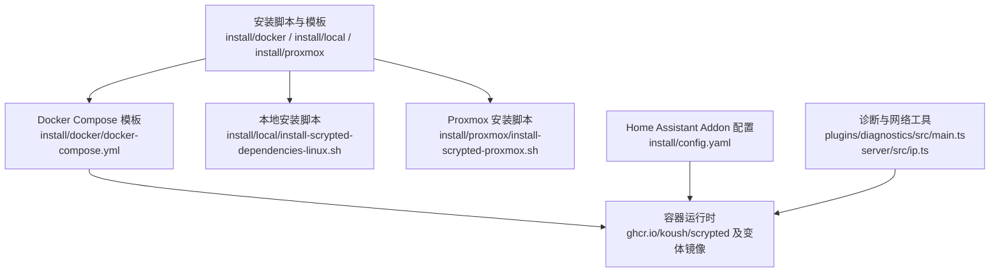
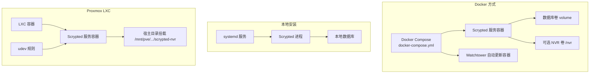
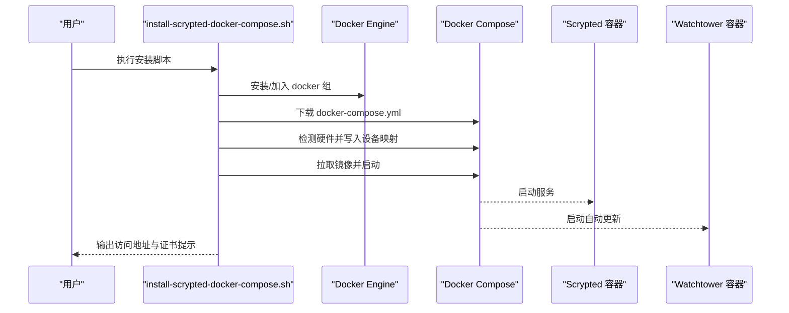
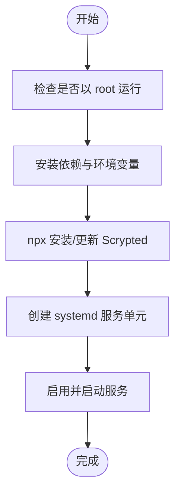
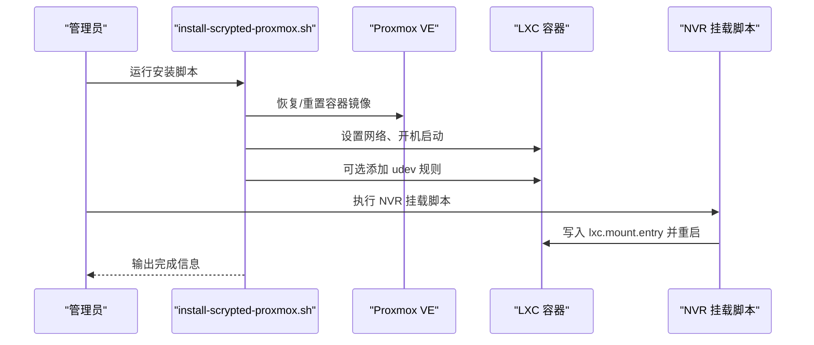
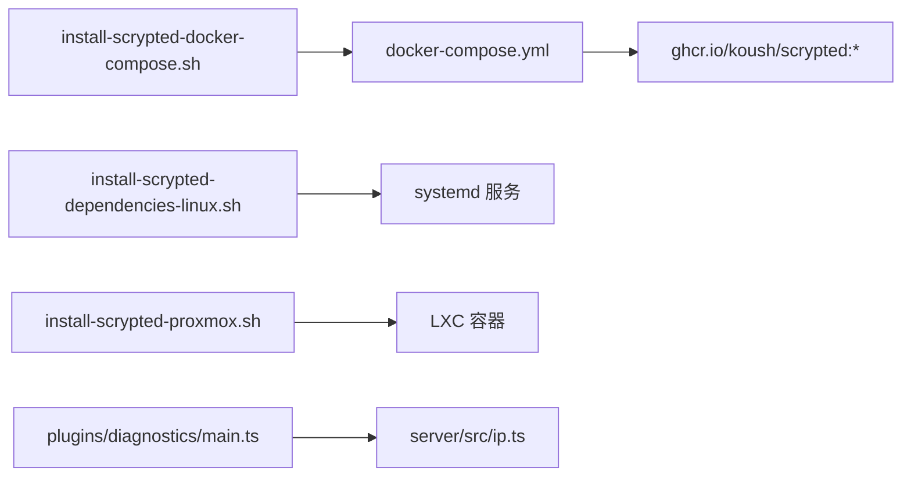

# 快速开始

<cite>
**本文引用的文件**
- [docker-compose.yml](file://install/docker/docker-compose.yml)
- [Dockerfile](file://install/docker/Dockerfile)
- [config.yaml](file://install/config.yaml)
- [install-scrypted-docker-compose.sh](file://install/docker/install-scrypted-docker-compose.sh)
- [install-scrypted-dependencies-linux.sh](file://install/local/install-scrypted-dependencies-linux.sh)
- [install-scrypted-proxmox.sh](file://install/proxmox/install-scrypted-proxmox.sh)
- [docker-compose.sh](file://install/proxmox/docker-compose.sh)
- [setup-scrypted-nvr-volume.sh（Docker）](file://install/docker/setup-scrypted-nvr-volume.sh)
- [setup-scrypted-nvr-volume.sh（Proxmox）](file://install/proxmox/setup-scrypted-nvr-volume.sh)
- [docker-compose-setup.py](file://install/docker/docker-compose-setup.py)
- [README.md](file://README.md)
- [ip.ts](file://server/src/ip.ts)
- [plugins/diagnostics/main.ts](file://plugins/diagnostics/src/main.ts)
- [plugins/cloud/README.md](file://plugins/cloud/README.md)
</cite>

## 目录
1. [简介](#简介)
2. [项目结构](#项目结构)
3. [核心组件](#核心组件)
4. [架构总览](#架构总览)
5. [详细组件分析](#详细组件分析)
6. [依赖关系分析](#依赖关系分析)
7. [性能注意事项](#性能注意事项)
8. [故障排除指南](#故障排除指南)
9. [结论](#结论)
10. [附录](#附录)

## 简介
本指南面向初学者与进阶用户，提供 Scrypted 从零开始的完整安装与配置流程。内容覆盖系统要求、多种安装方式（Docker、本地安装、Proxmox）、Docker Compose 部署步骤与环境变量、卷挂载、首次启动后的基本配置向导（管理员账户、网络、摄像头添加）、常见问题排查、安装验证与基础功能测试。

## 项目结构
本仓库包含服务端、插件生态、SDK、以及多平台安装脚本与模板。与“快速开始”直接相关的核心位置如下：
- 安装脚本与模板：install/docker、install/local、install/proxmox
- Docker Compose 模板与示例：install/docker/docker-compose.yml
- Home Assistant Addon 配置：install/config.yaml
- 诊断与网络地址检测：plugins/diagnostics/src/main.ts、server/src/ip.ts
- 文档入口：README.md

图示来源
- [docker-compose.yml:20-169](file://install/docker/docker-compose.yml#L20-L169)
- [install-scrypted-docker-compose.sh:77-117](file://install/docker/install-scrypted-docker-compose.sh#L77-L117)
- [install-scrypted-dependencies-linux.sh:99-127](file://install/local/install-scrypted-dependencies-linux.sh#L99-L127)
- [install-scrypted-proxmox.sh:129-155](file://install/proxmox/install-scrypted-proxmox.sh#L129-L155)
- [config.yaml:22-28](file://install/config.yaml#L22-L28)

章节来源
- [README.md:7-9](file://README.md#L7-L9)
- [docker-compose.yml:1-169](file://install/docker/docker-compose.yml#L1-L169)
- [config.yaml:1-49](file://install/config.yaml#L1-L49)

## 核心组件
- Docker Compose 编排：定义服务、环境变量、卷、设备映射、网络模式、DNS、自动更新等。
- 本地安装：通过 systemd 管理服务，使用 npx 安装并启动 Scrypted。
- Proxmox LXC：提供一键恢复/重置、存储挂载、udev 规则、CPU 微代码更新等。
- NVR 存储配置：提供针对 Docker 与 Proxmox 的独立脚本，支持磁盘分区、UUID 写入 fstab、容器内挂载路径替换。
- 诊断与网络：内置诊断项检查 IPv4/IPv6 地址可用性、CPU 与内存建议；网络地址过滤与可用性判断。

章节来源
- [docker-compose.yml:25-169](file://install/docker/docker-compose.yml#L25-L169)
- [install-scrypted-docker-compose.sh:101-177](file://install/docker/install-scrypted-docker-compose.sh#L101-L177)
- [install-scrypted-dependencies-linux.sh:102-127](file://install/local/install-scrypted-dependencies-linux.sh#L102-L127)
- [install-scrypted-proxmox.sh:276-306](file://install/proxmox/install-scrypted-proxmox.sh#L276-L306)
- [setup-scrypted-nvr-volume.sh（Docker）:78-159](file://install/docker/setup-scrypted-nvr-volume.sh#L78-L159)
- [setup-scrypted-nvr-volume.sh（Proxmox）:55-74](file://install/proxmox/setup-scrypted-nvr-volume.sh#L55-L74)
- [plugins/diagnostics/main.ts:486-514](file://plugins/diagnostics/src/main.ts#L486-L514)
- [server/src/ip.ts:67-106](file://server/src/ip.ts#L67-L106)

## 架构总览
下图展示三种安装方式的总体架构与交互关系：

图示来源
- [docker-compose.yml:20-169](file://install/docker/docker-compose.yml#L20-L169)
- [install-scrypted-docker-compose.sh:144-177](file://install/docker/install-scrypted-docker-compose.sh#L144-L177)
- [install-scrypted-dependencies-linux.sh:102-127](file://install/local/install-scrypted-dependencies-linux.sh#L102-L127)
- [install-scrypted-proxmox.sh:129-155](file://install/proxmox/install-scrypted-proxmox.sh#L129-L155)
- [docker-compose.sh:36-40](file://install/proxmox/docker-compose.sh#L36-L40)

## 详细组件分析

### 系统要求与硬件建议
- CPU：诊断建议至少 2 核，NVR 建议 4 核以上。
- 内存：普通场景建议 8GB，NVR 建议 16GB。
- 网络：需要可用的 IPv4 地址；IPv6 临时地址会被过滤，仅保留可用的固定地址。
- 设备访问：如需硬件加速或 USB 设备，需在容器中映射相应设备节点。

章节来源
- [plugins/diagnostics/main.ts:498-514](file://plugins/diagnostics/src/main.ts#L498-L514)
- [server/src/ip.ts:67-106](file://server/src/ip.ts#L67-L106)

### Docker 安装与部署
- 使用官方镜像 ghcr.io/koush/scrypted 或其变体（如 nvidia、intel、lite）。
- 主机网络模式（host networking）便于媒体流与发现协议工作。
- 默认数据库卷位于当前目录下的 volume，可按需修改为持久化存储。
- 可选启用 Avahi（主机或容器内二选一），并配置 AppArmor 权限。
- 设备映射：根据宿主机是否存在 /dev/dri、/dev/kfd、/dev/bus/usb 等自动启用。
- DNS：默认使用全局 DNS（如 1.1.1.1、8.8.8.8）以避免本地 DNS 问题。
- 自动更新：watchtower 容器监听 10444 端口，通过 HTTP API 触发更新。

图示来源
- [install-scrypted-docker-compose.sh:62-117](file://install/docker/install-scrypted-docker-compose.sh#L62-L117)
- [docker-compose.yml:56-169](file://install/docker/docker-compose.yml#L56-L169)

章节来源
- [docker-compose.yml:25-169](file://install/docker/docker-compose.yml#L25-L169)
- [Dockerfile:1-22](file://install/docker/Dockerfile#L1-L22)
- [install-scrypted-docker-compose.sh:62-177](file://install/docker/install-scrypted-docker-compose.sh#L62-L177)
- [docker-compose-setup.py:32-45](file://install/docker/docker-compose-setup.py#L32-L45)

### 本地安装（systemd）
- 通过 npx 安装并启动 Scrypted 服务。
- 创建 systemd 服务单元，设置开机自启与自动重启。
- 访问地址 https://localhost:10443（首次会提示接受自签名证书）。

图示来源
- [install-scrypted-dependencies-linux.sh:9-145](file://install/local/install-scrypted-dependencies-linux.sh#L9-L145)

章节来源
- [install-scrypted-dependencies-linux.sh:99-145](file://install/local/install-scrypted-dependencies-linux.sh#L99-L145)

### Proxmox LXC 安装
- 支持从备份镜像恢复/重置，保留数据卷并迁移至新镜像。
- 自动设置网络、开机启动、可选添加 udev 规则以提升硬件加速兼容性。
- Intel CPU 可选择安装 microcode 更新固件。
- 提供 NVR 存储挂载脚本，支持在 LXC 中挂载宿主目录到容器内的 /mnt/nvr/{large|fast}/<name>。

图示来源
- [install-scrypted-proxmox.sh:129-155](file://install/proxmox/install-scrypted-proxmox.sh#L129-L155)
- [install-scrypted-proxmox.sh:276-306](file://install/proxmox/install-scrypted-proxmox.sh#L276-L306)
- [setup-scrypted-nvr-volume.sh（Proxmox）:55-74](file://install/proxmox/setup-scrypted-nvr-volume.sh#L55-L74)

章节来源
- [install-scrypted-proxmox.sh:1-311](file://install/proxmox/install-scrypted-proxmox.sh#L1-L311)
- [docker-compose.sh:13-40](file://install/proxmox/docker-compose.sh#L13-L40)
- [setup-scrypted-nvr-volume.sh（Proxmox）:1-75](file://install/proxmox/setup-scrypted-nvr-volume.sh#L1-L75)

### 首次启动后的基本配置向导
- 访问地址：https://localhost:10443（Docker/本地）或对应主机 IP:10443（Proxmox）。
- 证书：首次访问会提示接受自签名证书，请按浏览器提示继续。
- 管理员账户：首次登录后设置管理员用户名与密码。
- 网络配置：确认 IPv4 地址可用；如需公网访问，参考云接入插件的端口转发说明。
- 摄像头添加：在“设备”页面添加摄像头，选择对应品牌与协议（ONVIF/RTSP/Ring/Hikvision 等），按向导完成配置。

章节来源
- [plugins/cloud/README.md:8-14](file://plugins/cloud/README.md#L8-L14)
- [server/src/ip.ts:67-106](file://server/src/ip.ts#L67-L106)

### NVR 存储配置
- Docker 方式：提供脚本自动停止容器、格式化磁盘、写入 /etc/fstab、替换 docker-compose.yml 中的 /nvr 挂载路径，并重新启动容器。
- Proxmox 方式：在 LXC 配置中追加 lxc.mount.entry，将宿主目录挂载到容器内的 /mnt/nvr/{large|fast}/<name>，并重启容器。

章节来源
- [setup-scrypted-nvr-volume.sh（Docker）:78-159](file://install/docker/setup-scrypted-nvr-volume.sh#L78-L159)
- [setup-scrypted-nvr-volume.sh（Proxmox）:55-74](file://install/proxmox/setup-scrypted-nvr-volume.sh#L55-L74)

## 依赖关系分析
- Docker Compose 依赖于 Docker 引擎与 Compose 插件；镜像来自 ghcr.io/koush/scrypted。
- 本地安装依赖 Node.js 与 systemd；通过 npx 安装并托管服务。
- Proxmox 安装依赖 pct 工具、LXC 容器、宿主存储；可选 udev 规则与 CPU 微代码包。
- 诊断模块依赖系统网络接口与可用地址列表，用于判断 IPv4/IPv6 可用性。

图示来源
- [docker-compose.yml:20-169](file://install/docker/docker-compose.yml#L20-L169)
- [install-scrypted-docker-compose.sh:144-177](file://install/docker/install-scrypted-docker-compose.sh#L144-L177)
- [install-scrypted-dependencies-linux.sh:102-127](file://install/local/install-scrypted-dependencies-linux.sh#L102-L127)
- [install-scrypted-proxmox.sh:129-155](file://install/proxmox/install-scrypted-proxmox.sh#L129-L155)
- [plugins/diagnostics/main.ts:486-514](file://plugins/diagnostics/src/main.ts#L486-L514)
- [server/src/ip.ts:67-106](file://server/src/ip.ts#L67-L106)

章节来源
- [docker-compose.yml:20-169](file://install/docker/docker-compose.yml#L20-L169)
- [install-scrypted-docker-compose.sh:144-177](file://install/docker/install-scrypted-docker-compose.sh#L144-L177)
- [install-scrypted-dependencies-linux.sh:102-127](file://install/local/install-scrypted-dependencies-linux.sh#L102-L127)
- [install-scrypted-proxmox.sh:129-155](file://install/proxmox/install-scrypted-proxmox.sh#L129-L155)
- [plugins/diagnostics/main.ts:486-514](file://plugins/diagnostics/src/main.ts#L486-L514)
- [server/src/ip.ts:67-106](file://server/src/ip.ts#L67-L106)

## 性能注意事项
- 使用主机网络模式（host networking）可降低网络栈开销，有利于视频流传输。
- 启用硬件加速（如 /dev/dri、/dev/kfd、USB 设备）可显著提升解码与推理性能。
- DNS 使用全局服务器（如 1.1.1.1、8.8.8.8）可避免本地 DNS 导致的包下载失败。
- 容器日志驱动默认禁用，避免频繁写入影响存储寿命；如需调试可临时开启。

章节来源
- [docker-compose.yml:123-131](file://install/docker/docker-compose.yml#L123-L131)
- [docker-compose.yml:135-139](file://install/docker/docker-compose.yml#L135-L139)

## 故障排除指南
- 无法访问 Web 界面
  - 确认端口 10443 是否被占用，或防火墙是否放行。
  - 如使用 Docker，确认网络模式为 host；如使用本地安装，确认 systemd 服务已启动。
- 证书不受信任
  - 浏览器提示证书不受信时，按提示“继续前往”或“添加例外”，以便后续配置。
- IPv6 环境连接异常
  - 服务端会优先返回 IPv4 地址；若 IPv4 不可用，需在系统层面修复网络配置。
- 云接入端口转发
  - 路由器需将外部端口转发到服务器的转发端口；注意避开 10443/10444。
- NVIDIA/AMD 硬件加速未生效
  - Docker：确认已安装 NVIDIA Container Toolkit 并使用对应镜像；设备映射已启用。
  - Proxmox：确认 udev 规则已添加，必要时重启 udev 服务。

章节来源
- [plugins/cloud/README.md:8-14](file://plugins/cloud/README.md#L8-L14)
- [server/src/ip.ts:67-106](file://server/src/ip.ts#L67-L106)
- [install-scrypted-docker-compose.sh:101-117](file://install/docker/install-scrypted-docker-compose.sh#L101-L117)
- [install-scrypted-proxmox.sh:276-306](file://install/proxmox/install-scrypted-proxmox.sh#L276-L306)

## 结论
通过本指南，您可以基于 Docker、本地安装或 Proxmox 三种方式快速部署 Scrypted，并完成管理员账户、网络与摄像头的基本配置。遇到问题时，可依据“故障排除指南”逐项排查。建议在生产环境中启用硬件加速、合理的 DNS 与日志策略，并为 NVR 存储准备独立的持久化卷。

## 附录

### A. Docker Compose 环境变量与卷挂载要点
- 环境变量
  - SCRYPTED_WEBHOOK_UPDATE_AUTHORIZATION：用于 watchtower 的更新授权。
  - SCRYPTED_WEBHOOK_UPDATE：更新回调地址。
  - SCRYPTED_DNS_SERVER_0/1：自定义 DNS。
  - SCRYPTED_NVR_VOLUME：容器内 NVR 挂载点（需配合卷使用）。
  - SCRYPTED_DOCKER_AVAHI：启用容器内 Avahi。
- 卷
  - 数据库卷：默认 ./volume:/server/volume。
  - NVR 卷：可挂载宿主目录或网络存储到 /nvr。
- 设备映射
  - /dev/dri、/dev/kfd、/dev/bus/usb 等按需启用。

章节来源
- [docker-compose.yml:25-169](file://install/docker/docker-compose.yml#L25-L169)

### B. 验证安装成功与基础功能测试
- 访问 https://localhost:10443（或对应主机 IP:10443），接受证书后登录。
- 在“诊断”页面查看 IPv4/IPv6 地址、CPU 与内存状态是否满足建议值。
- 添加一台摄像头，确认实时预览与录制（如启用 NVR）正常。
- 如需公网访问，配置路由器端口转发并测试外网连通性。

章节来源
- [plugins/diagnostics/main.ts:486-514](file://plugins/diagnostics/src/main.ts#L486-L514)
- [plugins/cloud/README.md:8-14](file://plugins/cloud/README.md#L8-L14)