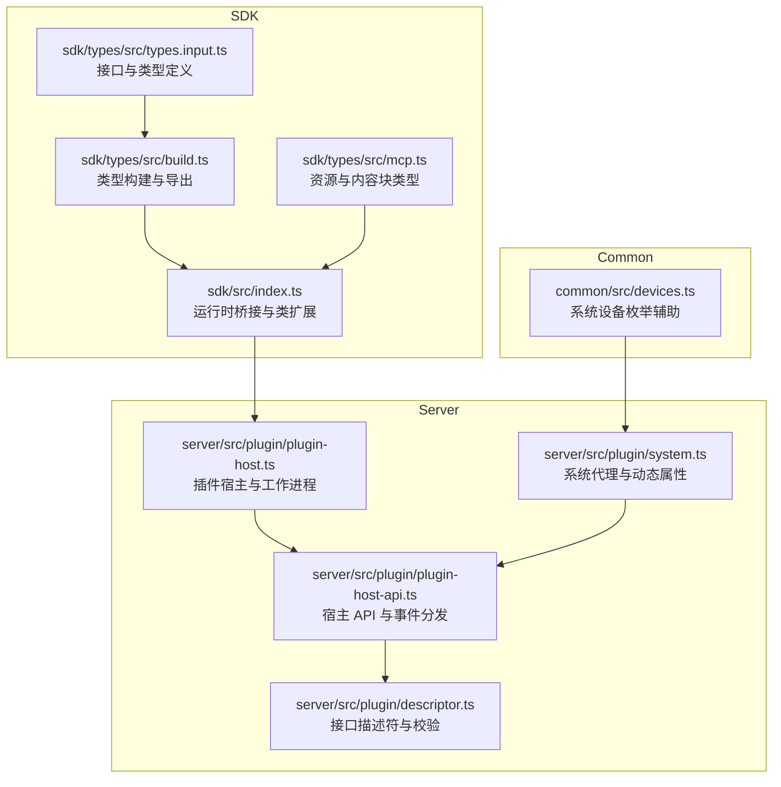
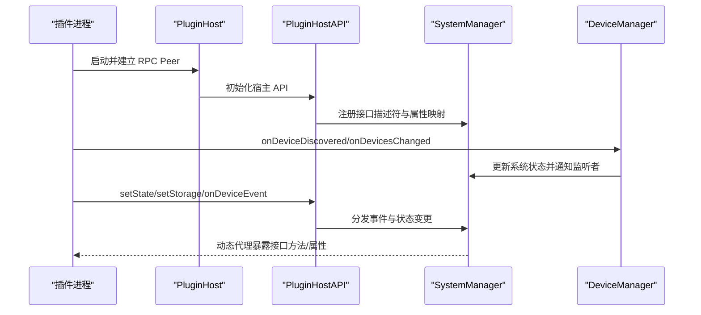
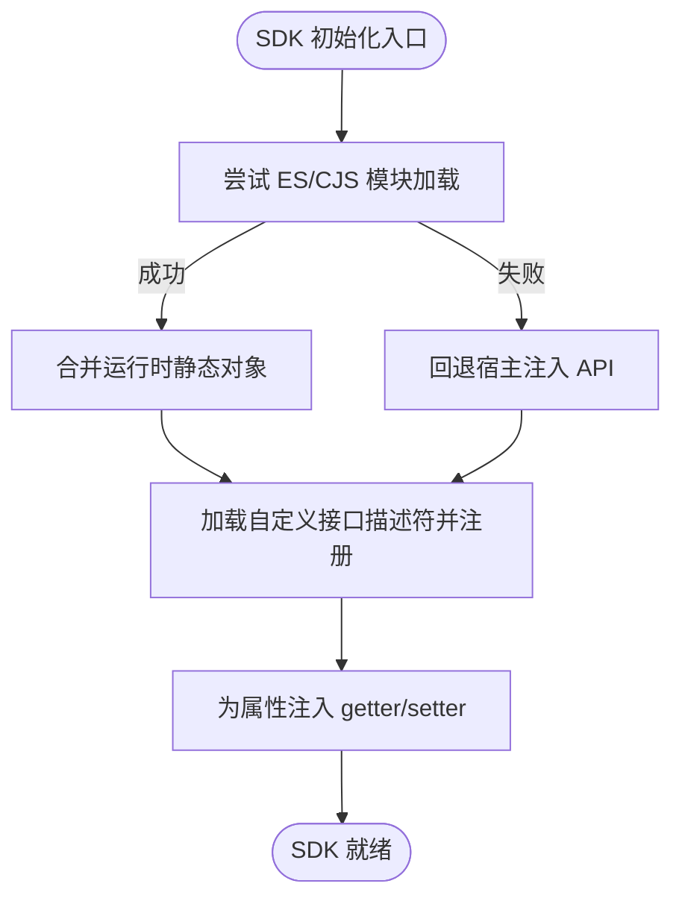
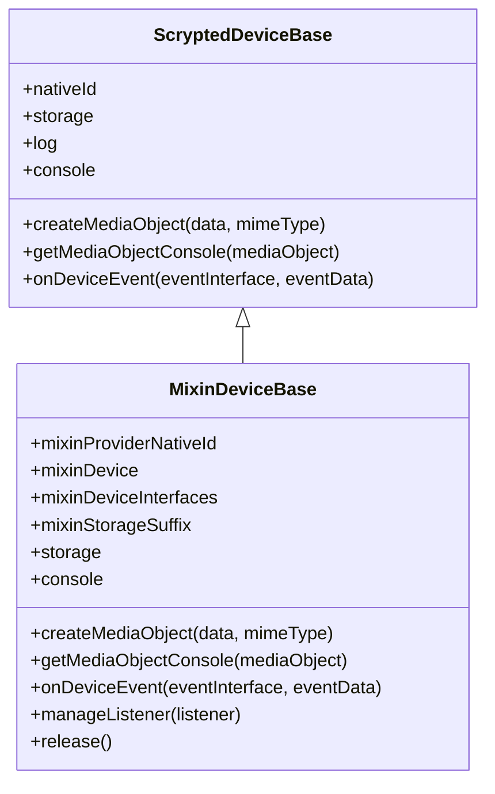
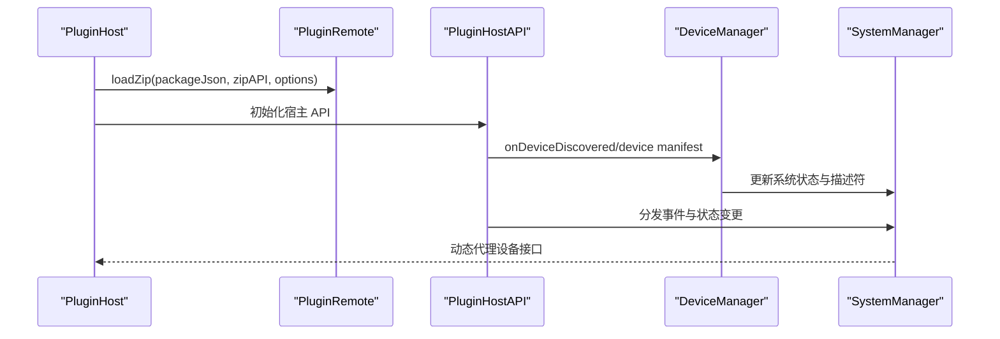
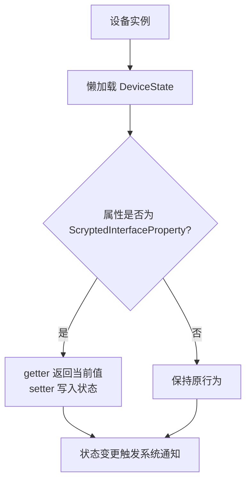
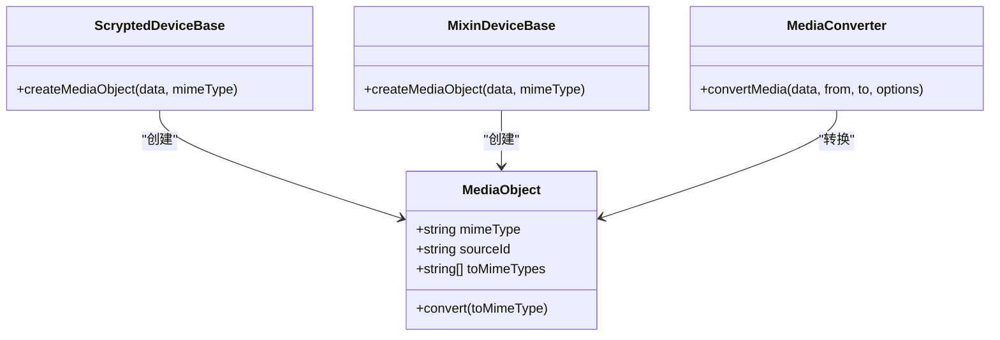
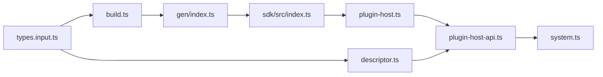

# SDK 概述与 API 参考

<cite>
**本文引用的文件**
- [sdk/src/index.ts](file://sdk/src/index.ts)
- [sdk/types/src/types.input.ts](file://sdk/types/src/types.input.ts)
- [sdk/types/src/build.ts](file://sdk/types/src/build.ts)
- [sdk/types/src/mcp.ts](file://sdk/types/src/mcp.ts)
- [server/src/plugin/plugin-host.ts](file://server/src/plugin/plugin-host.ts)
- [server/src/plugin/plugin-host-api.ts](file://server/src/plugin/plugin-host-api.ts)
- [server/src/plugin/descriptor.ts](file://server/src/plugin/descriptor.ts)
- [server/src/plugin/system.ts](file://server/src/plugin/system.ts)
- [common/src/devices.ts](file://common/src/devices.ts)
- [README.md](file://README.md)
</cite>

## 目录
1. [简介](#简介)
2. [项目结构](#项目结构)
3. [核心组件](#核心组件)
4. [架构总览](#架构总览)
5. [详细组件分析](#详细组件分析)
6. [依赖关系分析](#依赖关系分析)
7. [性能考量](#性能考量)
8. [故障排查指南](#故障排查指南)
9. [结论](#结论)
10. [附录](#附录)

## 简介
本文件为 Scrypted SDK 的全面概述与 API 参考，面向插件开发者与集成工程师，系统阐述 SDK 的核心架构、设计理念、运行时环境、设备接口体系、状态与事件模型、媒体对象与转换机制，并提供可操作的最佳实践与排障建议。读者无需深入底层实现即可高效开发与调试插件。

## 项目结构
Scrypted 采用多模块组织方式：SDK 提供类型与运行时桥接；Server 负责宿主、RPC、设备生命周期与状态管理；Common 提供通用工具；Plugins 为生态插件集合。SDK 与类型生成、插件宿主、描述符校验、系统代理等共同构成完整的开发与运行闭环。

**图表来源**
- [sdk/src/index.ts:1-297](file://sdk/src/index.ts#L1-L297)
- [sdk/types/src/types.input.ts:1-120](file://sdk/types/src/types.input.ts#L1-L120)
- [sdk/types/src/build.ts:1-90](file://sdk/types/src/build.ts#L1-L90)
- [sdk/types/src/mcp.ts:1-75](file://sdk/types/src/mcp.ts#L1-L75)
- [server/src/plugin/plugin-host.ts:1-120](file://server/src/plugin/plugin-host.ts#L1-L120)
- [server/src/plugin/plugin-host-api.ts:1-60](file://server/src/plugin/plugin-host-api.ts#L1-L60)
- [server/src/plugin/descriptor.ts:1-36](file://server/src/plugin/descriptor.ts#L1-L36)
- [server/src/plugin/system.ts:18-50](file://server/src/plugin/system.ts#L18-L50)
- [common/src/devices.ts:1-6](file://common/src/devices.ts#L1-L6)

**章节来源**
- [README.md:1-59](file://README.md#L1-L59)
- [sdk/src/index.ts:1-297](file://sdk/src/index.ts#L1-L297)
- [sdk/types/src/types.input.ts:1-120](file://sdk/types/src/types.input.ts#L1-L120)
- [server/src/plugin/plugin-host.ts:1-120](file://server/src/plugin/plugin-host.ts#L1-L120)

## 核心组件
- 运行时桥接与类扩展
  - ScryptedDeviceBase：设备基类，提供 storage、log、console、createMediaObject、onDeviceEvent 等能力，并通过懒加载访问 DeviceState。
  - MixinDeviceBase：混入设备基类，支持 mixinProviderNativeId、mixinDevice、mixinDeviceInterfaces、mixinStorageSuffix 等，提供混入存储、日志与事件转发。
  - 动态属性代理：在构造阶段为 ScryptedInterfaceProperty 注入 getter/setter，使设备实例可直接读写状态字段（如 on、brightness、colorTemperature 等）。
  - SDK 初始化：优先尝试从 ES/CJS 模块加载运行时静态对象，否则回退到宿主注入的 API，同时加载自定义接口描述符并注册到系统。

- 类型与接口体系
  - ScryptedInterface 枚举覆盖设备能力边界（如 OnOff、Brightness、Camera、VideoCamera、TemperatureSetting、HumiditySetting、Lock、PasswordStore、Scene、Entry、MediaPlayer、MediaConverter、Settings、传感器族等）。
  - ScryptedDevice 定义设备标识、名称、类型、接口集、混入、事件监听等核心契约。
  - MediaObject 作为媒体中间表示，支持转换与元数据标注。

- 插件宿主与系统代理
  - PluginHost：负责插件工作进程启动、RPC Peer 建立、生命周期管理、健康检查与重启策略、Engine.IO/WS 接入。
  - PluginHostAPI：向插件暴露 DeviceManager、SystemManager、MediaManager 等能力，处理设备发现/变更/移除、事件转发、状态设置、混入事件等。
  - 系统代理：基于接口描述符动态暴露设备方法与属性，确保仅允许合法接口与属性参与。

**章节来源**
- [sdk/src/index.ts:10-204](file://sdk/src/index.ts#L10-L204)
- [sdk/types/src/types.input.ts:17-50](file://sdk/types/src/types.input.ts#L17-L50)
- [sdk/types/src/types.input.ts:164-172](file://sdk/types/src/types.input.ts#L164-L172)
- [sdk/types/src/types.input.ts:2382-2486](file://sdk/types/src/types.input.ts#L2382-L2486)
- [server/src/plugin/plugin-host.ts:122-224](file://server/src/plugin/plugin-host.ts#L122-L224)
- [server/src/plugin/plugin-host-api.ts:13-82](file://server/src/plugin/plugin-host-api.ts#L13-L82)
- [server/src/plugin/system.ts:18-50](file://server/src/plugin/system.ts#L18-L50)

## 架构总览
SDK 通过运行时桥接连接插件与服务器，形成“插件进程—RPC—宿主 API—系统状态”的闭环。类型系统由构建脚本从接口定义推导生成，确保客户端与服务端一致。

**图表来源**
- [server/src/plugin/plugin-host.ts:226-274](file://server/src/plugin/plugin-host.ts#L226-L274)
- [server/src/plugin/plugin-host-api.ts:135-160](file://server/src/plugin/plugin-host-api.ts#L135-L160)
- [server/src/plugin/system.ts:18-50](file://server/src/plugin/system.ts#L18-L50)

## 详细组件分析

### 运行时桥接与 SDK 初始化
- 加载策略
  - 优先尝试 ES/CJS 模块加载运行时静态对象，合并到 sdk 对象。
  - 若失败则回退至宿主注入的 API（deviceManager、endpointManager、mediaManager、systemManager 等），并合并 runtimeAPI。
  - 成功后加载 sdk.json 中的自定义接口描述符，调用 systemManager.setScryptedInterfaceDescriptors 注册。
- 设备状态与属性代理
  - 在构造阶段为每个 ScryptedInterfaceProperty 注入 getter/setter，实现“按需懒加载”与“统一写入”。
  - MixinDeviceBase 额外维护监听器集合，释放时统一移除，避免内存泄漏。

**图表来源**
- [sdk/src/index.ts:214-293](file://sdk/src/index.ts#L214-L293)
- [sdk/src/index.ts:169-204](file://sdk/src/index.ts#L169-L204)

**章节来源**
- [sdk/src/index.ts:214-293](file://sdk/src/index.ts#L214-L293)
- [sdk/src/index.ts:169-204](file://sdk/src/index.ts#L169-L204)

### 设备基类与混入基类
- ScryptedDeviceBase
  - 提供 storage、log、console 的延迟初始化与缓存。
  - createMediaObject 自动设置 sourceId。
  - onDeviceEvent 将事件转发给 DeviceManager。
- MixinDeviceBase
  - 维护 mixinProviderNativeId、mixinDevice、mixinDeviceInterfaces、mixinStorageSuffix。
  - 支持混入存储键拼接与混入控制台。
  - onDeviceEvent 转发至 mixin 上下文。
  - manageListener/release 生命周期管理。

**图表来源**
- [sdk/src/index.ts:10-71](file://sdk/src/index.ts#L10-L71)
- [sdk/src/index.ts:87-167](file://sdk/src/index.ts#L87-L167)

**章节来源**
- [sdk/src/index.ts:10-167](file://sdk/src/index.ts#L10-L167)

### 设备接口体系与 API 参考
以下为常用设备接口与其典型方法/属性（以路径引用代替具体代码）：

- 基础控制
  - OnOff：turnOn()/turnOff()，on
  - Brightness：setBrightness(number)，brightness
  - StartStop：start()/stop()，running
  - Pause：pause()/resume()，paused
  - Dock：dock()，docked
  - Lock/PasswordStore：lock()/unlock()，addPassword()/getPasswords()/removePassword()

- 温度与湿度
  - TemperatureSetting：setTemperature(command)，temperatureSetting
  - Thermometer：temperature，temperatureUnit，setTemperatureUnit(unit)
  - HumiditySetting：setHumidity(hum)，humiditySetting

- 灯光与色彩
  - ColorSettingTemperature：setColorTemperature(k)，colorTemperature
  - ColorSettingRgb：setRgb(r,g,b)，rgb
  - ColorSettingHsv：setHsv(h,s,v)，hsv

- 摄像与媒体
  - Camera：takePicture(options)，getPictureOptions()
  - VideoCamera：getVideoStream(options)，getVideoStreamOptions()
  - Microphone：getAudioStream()
  - Display：startDisplay(media)，stopDisplay()
  - Intercom：startIntercom(media)，stopIntercom()
  - VideoRecorder：getRecordingStream(options, prev?)，getRecordingStreamOptions()
  - EventRecorder：getRecordedEvents(options)
  - VideoClips：getVideoClips(options)，getVideoClip(id)，getVideoClipThumbnail(tid,options?)

- 传感器与状态
  - BinarySensor：binaryState
  - MotionSensor/AudioSensor/PowerSensor：motionDetected/audioDetected/powerDetected
  - AmbientLightSensor/LuminanceSensor：ambientLight/luminance
  - OccupancySensor：occupied
  - FloodSensor：flooded
  - PositionSensor：position
  - TamperSensor：tampered
  - Battery/Charger：batteryLevel，chargeState
  - Online：online
  - Sleep：sleeping

- 环境与净化
  - AirPurifier：setAirPurifierState(state)，airPurifierState
  - FilterMaintenance：filterLifeLevel/filterChangeIndication
  - AirQualitySensor：airQuality
  - CO2Sensor/PM25Sensor/PM10Sensor/VOCSensor/NOXSensor：密度指标

- 场景与门锁
  - Scene：activate()/deactivate()，isReversible()
  - Entry/EntrySensor：openEntry()/closeEntry()，entryOpen

- 媒体播放与转换
  - MediaPlayer：load(media, options?)，seek(ms)，skipNext()/skipPrevious()
  - MediaConverter：convertMedia(data, from, to, options?)
  - BufferConverter：convert(data, from, to, options?)（已弃用）

- 设置与系统
  - Settings：getSettings()/putSetting(key, value)
  - DeviceCreator：getCreateDeviceSettings()/createDevice(settings)
  - DeviceDiscovery：discoverDevices(scan?)/adoptDevice(device)
  - DeviceProvider：getDevice(nativeId)/releaseDevice(id, nativeId)

- 事件与状态
  - ScryptedDevice：listen(event, callback)，setName()/setRoom()/setType()/setMixins()/probe()
  - EventDetails：eventId/eventInterface/eventTime/property/mixinId
  - EventListenerRegister：removeListener()

- WebRTC 信令（可选）
  - RTCSignalingSession：createLocalDescription()/setRemoteDescription()/addIceCandidate()
  - RTCSignalingOptions：offer/requiresOffer/requiresAnswer/disableTrickle/disableTurn/proxy/capabilities/userAgent/screen
  - RTCSessionControl：extendSession()/endSession()/setPlayback({audio,video})

- 大模型与嵌入（可选）
  - ChatCompletion：getChatCompletion()/streamChatCompletion(...)
  - TextEmbedding/getImageEmbedding
  - LLMTools：getLLMTools()/callLLMTool(toolCallId, name, params)

- 其他
  - Reboot：reboot()
  - Refresh：getRefreshFrequency()/refresh(refreshInterface, userInitiated)
  - Program：run(variables?)
  - Scriptable：saveScript()/loadScripts()/eval(source, variables?)

**章节来源**
- [sdk/types/src/types.input.ts:164-172](file://sdk/types/src/types.input.ts#L164-L172)
- [sdk/types/src/types.input.ts:2382-2486](file://sdk/types/src/types.input.ts#L2382-L2486)
- [sdk/types/src/types.input.ts:1198-1270](file://sdk/types/src/types.input.ts#L1198-L1270)
- [sdk/types/src/types.input.ts:1453-1457](file://sdk/types/src/types.input.ts#L1453-L1457)
- [sdk/types/src/types.input.ts:1098-1105](file://sdk/types/src/types.input.ts#L1098-L1105)
- [sdk/types/src/types.input.ts:2498-2511](file://sdk/types/src/types.input.ts#L2498-L2511)

### 插件宿主与事件分发
- 插件启动与健康
  - PluginHost：根据 package.json.scrypted.runtime 选择运行时，创建工作进程与 RPC Peer，建立 stdout/stderr 通道与控制台服务。
  - 周期性 ping 与超时检测，异常自动请求重启。
- 事件与状态
  - PluginHostAPI：onMixinEvent/onDeviceEvent/onDevicesChanged/onDeviceDiscovered/onDeviceRemoved/setState/setStorage 等。
  - 系统代理：基于接口描述符动态暴露方法与属性，拦截非法访问。

**图表来源**
- [server/src/plugin/plugin-host.ts:226-274](file://server/src/plugin/plugin-host.ts#L226-L274)
- [server/src/plugin/plugin-host-api.ts:135-160](file://server/src/plugin/plugin-host-api.ts#L135-L160)
- [server/src/plugin/system.ts:18-50](file://server/src/plugin/system.ts#L18-L50)

**章节来源**
- [server/src/plugin/plugin-host.ts:122-224](file://server/src/plugin/plugin-host.ts#L122-L224)
- [server/src/plugin/plugin-host.ts:226-274](file://server/src/plugin/plugin-host.ts#L226-L274)
- [server/src/plugin/plugin-host-api.ts:13-82](file://server/src/plugin/plugin-host-api.ts#L13-L82)
- [server/src/plugin/system.ts:18-50](file://server/src/plugin/system.ts#L18-L50)

### 设备状态管理与事件处理
- 状态字段
  - 通过 ScryptedInterfaceProperty 注入的 getter/setter 实现统一访问，支持懒加载与写入校验。
- 事件模型
  - ScryptedDevice.listen 支持 denoise/watch/mixinId 等选项。
  - onDeviceEvent/onMixinEvent 将事件路由到系统状态管理器，触发监听回调。
- 混入事件
  - MixinDeviceBase.onDeviceEvent 会携带 mixin 上下文，确保事件归属正确。

**图表来源**
- [sdk/src/index.ts:169-204](file://sdk/src/index.ts#L169-L204)

**章节来源**
- [sdk/src/index.ts:169-204](file://sdk/src/index.ts#L169-L204)
- [sdk/types/src/types.input.ts:83-100](file://sdk/types/src/types.input.ts#L83-L100)
- [server/src/plugin/plugin-host-api.ts:51-82](file://server/src/plugin/plugin-host-api.ts#L51-L82)

### 媒体对象与转换
- MediaObject
  - 包含 mimeType/sourceId/toMimeTypes/convert(...) 等字段与方法。
  - ScryptedDeviceBase/MixinDeviceBase.createMediaObject 自动设置 sourceId。
- 转换器
  - MediaConverter.convertMedia 支持跨格式转换。
  - BufferConverter.convert 已弃用，推荐使用 MediaConverter。

**图表来源**
- [sdk/types/src/types.input.ts:298-304](file://sdk/types/src/types.input.ts#L298-L304)
- [sdk/types/src/types.input.ts:1453-1457](file://sdk/types/src/types.input.ts#L1453-L1457)
- [sdk/src/index.ts:42-46](file://sdk/src/index.ts#L42-L46)
- [sdk/src/index.ts:136-140](file://sdk/src/index.ts#L136-L140)

**章节来源**
- [sdk/types/src/types.input.ts:298-304](file://sdk/types/src/types.input.ts#L298-L304)
- [sdk/types/src/types.input.ts:1453-1457](file://sdk/types/src/types.input.ts#L1453-L1457)
- [sdk/src/index.ts:42-46](file://sdk/src/index.ts#L42-L46)
- [sdk/src/index.ts:136-140](file://sdk/src/index.ts#L136-L140)

### 错误处理与最佳实践
- 初始化失败
  - SDK 初始化失败会输出警告/错误日志，建议检查模块加载变量与运行时配置。
- 插件加载失败
  - PluginHost 在加载 Zip 或启动工作进程失败时会记录错误并触发重启流程。
- 事件与状态合法性
  - 描述符校验确保仅允许合法接口与属性参与；非法属性写入会被拒绝。
- 性能与稳定性
  - 使用懒加载与统一状态写入减少不必要的同步开销。
  - 合理使用监听去噪与被动观察，降低事件风暴。

**章节来源**
- [sdk/src/index.ts:245-248](file://sdk/src/index.ts#L245-L248)
- [server/src/plugin/plugin-host.ts:268-273](file://server/src/plugin/plugin-host.ts#L268-L273)
- [server/src/plugin/descriptor.ts:27-35](file://server/src/plugin/descriptor.ts#L27-L35)

## 依赖关系分析
- 类型生成
  - build.ts 从 schema.json 解析接口定义，生成 ScryptedInterfaceDescriptors、ScryptedInterfaceProperty、ScryptedInterfaceMethod 与 DeviceState/DeviceBase。
- 运行时桥接
  - sdk/src/index.ts 依赖 types/input.ts 中的接口定义与 descriptors，动态注入属性代理。
- 插件宿主
  - plugin-host.ts 依赖 runtime 与 cluster 标签，创建工作进程与 RPC Peer。
- 系统代理
  - system.ts 基于 descriptors 动态暴露设备方法与属性，限制非法访问。

**图表来源**
- [sdk/types/src/build.ts:28-82](file://sdk/types/src/build.ts#L28-L82)
- [sdk/src/index.ts:1-7](file://sdk/src/index.ts#L1-L7)
- [server/src/plugin/plugin-host.ts:1-10](file://server/src/plugin/plugin-host.ts#L1-L10)
- [server/src/plugin/plugin-host-api.ts:1-12](file://server/src/plugin/plugin-host-api.ts#L1-L12)
- [server/src/plugin/system.ts:18-27](file://server/src/plugin/system.ts#L18-L27)
- [server/src/plugin/descriptor.ts:1-17](file://server/src/plugin/descriptor.ts#L1-L17)

**章节来源**
- [sdk/types/src/build.ts:28-82](file://sdk/types/src/build.ts#L28-L82)
- [sdk/src/index.ts:1-7](file://sdk/src/index.ts#L1-L7)
- [server/src/plugin/plugin-host.ts:1-10](file://server/src/plugin/plugin-host.ts#L1-L10)
- [server/src/plugin/plugin-host-api.ts:1-12](file://server/src/plugin/plugin-host-api.ts#L1-L12)
- [server/src/plugin/system.ts:18-27](file://server/src/plugin/system.ts#L18-L27)
- [server/src/plugin/descriptor.ts:1-17](file://server/src/plugin/descriptor.ts#L1-L17)

## 性能考量
- 懒加载与缓存
  - storage/log/console 在首次访问时才创建，避免无谓的 IO 与初始化。
- 状态写入优化
  - 通过统一的 DeviceState 写入路径，减少重复更新与无效广播。
- 事件去噪
  - 监听选项支持 denoise，仅在状态变化时触发回调，降低事件风暴。
- 流媒体与预缓冲
  - RequestMediaStreamOptions/ResponseMediaStreamOptions 提供预缓冲与刷新策略提示，结合 allowBatteryPrebuffer 控制电池设备行为。

[本节为通用指导，不直接分析具体文件]

## 故障排查指南
- 插件无法加载
  - 检查 package.json.scrypted.runtime 与运行时标签；查看宿主日志中的“plugin load error”与“plugin failed to start”。
- 事件未到达
  - 确认 onDeviceEvent/onMixinEvent 的 eventInterface 是否在设备接口集中；检查 mixinProviderId 与 mixinTable 映射。
- 状态不生效
  - 确认写入的是合法的 ScryptedInterfaceProperty；检查 setDeviceProperty/setState 的调用时机与权限。
- 媒体转换失败
  - 确认 fromMimeType/toMimeType 与 converters 列表匹配；检查 MediaConverter.convertMedia 的 options。

**章节来源**
- [server/src/plugin/plugin-host.ts:268-273](file://server/src/plugin/plugin-host.ts#L268-L273)
- [server/src/plugin/plugin-host-api.ts:51-82](file://server/src/plugin/plugin-host-api.ts#L51-L82)
- [server/src/plugin/descriptor.ts:27-35](file://server/src/plugin/descriptor.ts#L27-L35)

## 结论
Scrypted SDK 通过清晰的类型系统、运行时桥接与严格的系统代理，为插件提供了稳定、可扩展且高性能的开发框架。遵循本文的架构理解、API 使用规范与最佳实践，可显著提升插件质量与维护效率。

[本节为总结性内容，不直接分析具体文件]

## 附录
- 获取系统全部设备
  - 使用 getAllDevices(systemManager) 获取系统状态中所有设备实例。
- 开发与调试
  - 参考仓库 README 的 VS Code 调试与命令行部署指引。

**章节来源**
- [common/src/devices.ts:3-6](file://common/src/devices.ts#L3-L6)
- [README.md:17-37](file://README.md#L17-L37)