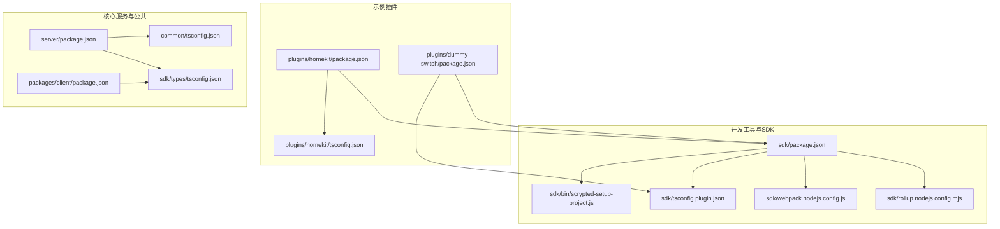
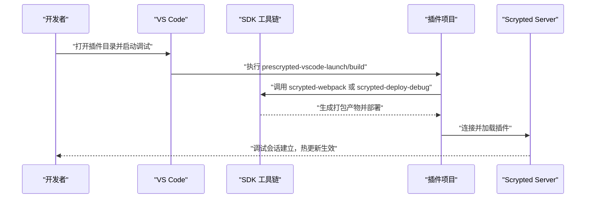
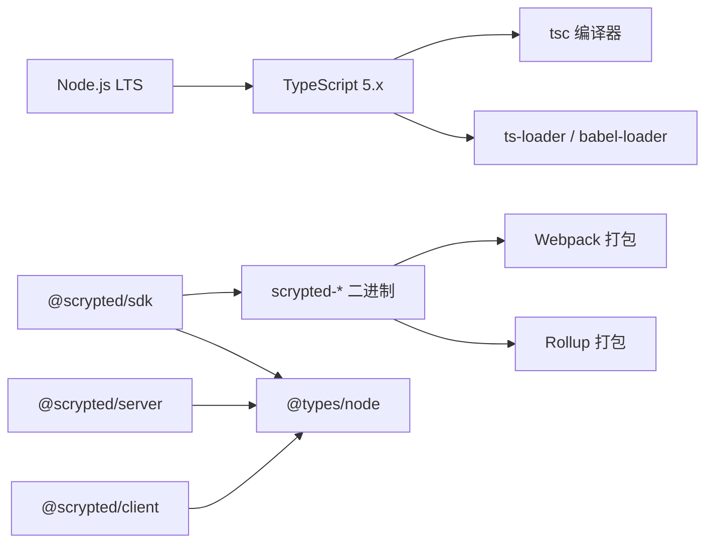

# 开发环境搭建

<cite>
**本文引用的文件**
- [README.md](file://README.md)
- [npm-install.sh](file://npm-install.sh)
- [sdk/package.json](file://sdk/package.json)
- [sdk/bin/scrypted-setup-project.js](file://sdk/bin/scrypted-setup-project.js)
- [sdk/tsconfig.plugin.json](file://sdk/tsconfig.plugin.json)
- [plugins/homekit/package.json](file://plugins/homekit/package.json)
- [plugins/homekit/tsconfig.json](file://plugins/homekit/tsconfig.json)
- [plugins/dummy-switch/package.json](file://plugins/dummy-switch/package.json)
- [server/package.json](file://server/package.json)
- [packages/client/package.json](file://packages/client/package.json)
- [sdk/webpack.nodejs.config.js](file://sdk/webpack.nodejs.config.js)
- [sdk/rollup.nodejs.config.mjs](file://sdk/rollup.nodejs.config.mjs)
- [common/tsconfig.json](file://common/tsconfig.json)
- [sdk/types/tsconfig.json](file://sdk/types/tsconfig.json)
</cite>

## 目录
1. [简介](#简介)
2. [项目结构](#项目结构)
3. [核心组件](#核心组件)
4. [架构总览](#架构总览)
5. [详细组件分析](#详细组件分析)
6. [依赖分析](#依赖分析)
7. [性能考虑](#性能考虑)
8. [故障排除指南](#故障排除指南)
9. [结论](#结论)
10. [附录](#附录)

## 简介
本指南面向希望在 Scrypted 中开发插件的开发者，系统讲解从 Node.js、TypeScript 到 VS Code 工具链与项目模板的完整环境搭建流程，并结合仓库中的实际配置文件给出可操作的步骤与最佳实践。你将学会如何：
- 选择合适的 Node.js 版本（含 LTS 建议）
- 配置 TypeScript 编译参数与 tsconfig
- 使用 VS Code 进行插件调试与部署
- 使用 scrypted-setup-project 快速初始化项目
- 管理依赖与版本兼容性
- 使用构建工具链（Webpack/Rollup）进行打包与优化
- 排查常见开发环境问题

## 项目结构
Scrypted 采用多包（monorepo）组织方式，核心模块包括：
- SDK：插件开发工具与二进制命令入口
- Server：Scrypted 核心服务端
- Common：通用工具与公共类型
- Packages：客户端、CLI、RPC 等周边包
- Plugins：各类设备与功能插件示例
- Sites：静态前端示例

下图展示与“开发环境搭建”直接相关的模块关系与职责：

图表来源
- [sdk/package.json:1-62](file://sdk/package.json#L1-L62)
- [sdk/bin/scrypted-setup-project.js:1-7](file://sdk/bin/scrypted-setup-project.js#L1-L7)
- [sdk/tsconfig.plugin.json:1-13](file://sdk/tsconfig.plugin.json#L1-L13)
- [sdk/webpack.nodejs.config.js:1-160](file://sdk/webpack.nodejs.config.js#L1-L160)
- [sdk/rollup.nodejs.config.mjs:1-142](file://sdk/rollup.nodejs.config.mjs#L1-L142)
- [plugins/homekit/package.json:1-56](file://plugins/homekit/package.json#L1-L56)
- [plugins/homekit/tsconfig.json:1-13](file://plugins/homekit/tsconfig.json#L1-L13)
- [plugins/dummy-switch/package.json:1-45](file://plugins/dummy-switch/package.json#L1-L45)
- [server/package.json:1-73](file://server/package.json#L1-L73)
- [common/tsconfig.json:1-17](file://common/tsconfig.json#L1-L17)
- [sdk/types/tsconfig.json:1-15](file://sdk/types/tsconfig.json#L1-L15)

章节来源
- [README.md:15-59](file://README.md#L15-L59)
- [npm-install.sh:1-37](file://npm-install.sh#L1-L37)

## 核心组件
本节聚焦与“开发环境搭建”直接相关的核心组件与配置要点。

- Node.js 与 TypeScript
  - Node.js：仓库中各包的 devDependencies 指向高版本 @types/node，建议使用长期支持（LTS）版本以获得稳定生态与工具链支持。
  - TypeScript：SDK 与多数包使用 TypeScript 5.x，确保与工具链（tsc、ts-loader、ts-node）兼容。
- SDK 与构建工具
  - SDK 提供 scrypted-setup-project、scrypted-webpack、scrypted-deploy 等二进制命令，用于项目初始化、打包与部署。
  - Webpack 与 Rollup 配置分别针对不同场景（Node.js 打包、多入口导出），需根据插件类型选择合适方案。
- 示例插件
  - HomeKit 与 Dummy Switch 插件展示了标准的 package.json 脚本与 tsconfig 配置，可作为新项目的模板参考。

章节来源
- [sdk/package.json:13-28](file://sdk/package.json#L13-L28)
- [sdk/package.json:31-54](file://sdk/package.json#L31-L54)
- [server/package.json:33-48](file://server/package.json#L33-L48)
- [packages/client/package.json:14-20](file://packages/client/package.json#L14-L20)
- [plugins/homekit/package.json:5-18](file://plugins/homekit/package.json#L5-L18)
- [plugins/homekit/tsconfig.json:1-13](file://plugins/homekit/tsconfig.json#L1-L13)
- [sdk/webpack.nodejs.config.js:79-160](file://sdk/webpack.nodejs.config.js#L79-L160)
- [sdk/rollup.nodejs.config.mjs:73-142](file://sdk/rollup.nodejs.config.mjs#L73-L142)

## 架构总览
下图展示从“本地开发到插件部署”的整体流程，涵盖 Node.js、TypeScript、SDK 工具链与 VS Code 调试路径。

图表来源
- [plugins/homekit/package.json:5-18](file://plugins/homekit/package.json#L5-L18)
- [sdk/package.json:20-28](file://sdk/package.json#L20-L28)
- [README.md:17-37](file://README.md#L17-L37)

章节来源
- [README.md:17-37](file://README.md#L17-L37)
- [plugins/homekit/package.json:5-18](file://plugins/homekit/package.json#L5-L18)
- [sdk/package.json:20-28](file://sdk/package.json#L20-L28)

## 详细组件分析

### Node.js 版本要求与安装建议
- 版本依据
  - server 与 packages/client 的 devDependencies 显示对高版本 @types/node 的需求，建议优先使用 Node.js LTS（如 18.x 或 20.x）以获得更稳定的运行时与生态支持。
  - SDK 与部分插件的 TypeScript 版本为 5.x，确保与 tsc、ts-loader、ts-node 等工具链兼容。
- 安装步骤（建议）
  - 使用官方安装包或版本管理器（如 nvm）安装 LTS 版本。
  - 在项目根目录执行依赖安装脚本，统一拉取子模块与依赖。
- 参考路径
  - [server/package.json:33-48](file://server/package.json#L33-L48)
  - [packages/client/package.json:14-20](file://packages/client/package.json#L14-L20)
  - [sdk/package.json:31-54](file://sdk/package.json#L31-L54)

章节来源
- [server/package.json:33-48](file://server/package.json#L33-L48)
- [packages/client/package.json:14-20](file://packages/client/package.json#L14-L20)
- [sdk/package.json:31-54](file://sdk/package.json#L31-L54)

### TypeScript 环境配置
- SDK 插件默认 tsconfig
  - 采用 commonjs + ES2021，启用 sourceMap 与 moduleResolution Node16，便于与 Node.js 生态兼容。
  - 可通过 scrypted-setup-project 将该配置复制到插件根目录。
- 通用 tsconfig
  - common/tsconfig.json 使用 Node16 模块解析与 esnext 目标，适合通用库与类型生成。
- 插件示例 tsconfig
  - HomeKit 插件采用 Node16 模块解析与 ES2021 目标，与 SDK 默认一致。
- 关键配置项说明
  - module/moduleResolution/target：决定模块解析与目标语法，影响打包器选择与运行时兼容性。
  - sourceMap：开启便于调试与源码映射。
  - resolveJsonModule：允许导入 JSON 模块（部分插件需要）。
- 参考路径
  - [sdk/tsconfig.plugin.json:1-13](file://sdk/tsconfig.plugin.json#L1-L13)
  - [common/tsconfig.json:1-17](file://common/tsconfig.json#L1-L17)
  - [plugins/homekit/tsconfig.json:1-13](file://plugins/homekit/tsconfig.json#L1-L13)

章节来源
- [sdk/tsconfig.plugin.json:1-13](file://sdk/tsconfig.plugin.json#L1-L13)
- [common/tsconfig.json:1-17](file://common/tsconfig.json#L1-L17)
- [plugins/homekit/tsconfig.json:1-13](file://plugins/homekit/tsconfig.json#L1-L13)

### VS Code 开发环境推荐配置
- 启动调试流程
  - 克隆仓库后，先执行依赖安装脚本，再在 VS Code 中打开插件目录（例如 plugins/homekit），即可使用内置调试任务启动插件。
  - 修改插件代码后无需重启 Scrypted Server，即可热更新到运行中的服务器。
- 调试脚本
  - 插件 package.json 中定义了 prescrypted-vscode-launch 与 scrypted-vscode-launch 等脚本，配合 SDK 的 scrypted-deploy-debug 实现一键调试。
- 参考路径
  - [README.md:17-37](file://README.md#L17-L37)
  - [plugins/homekit/package.json:5-18](file://plugins/homekit/package.json#L5-L18)
  - [sdk/package.json:20-28](file://sdk/package.json#L20-L28)

章节来源
- [README.md:17-37](file://README.md#L17-L37)
- [plugins/homekit/package.json:5-18](file://plugins/homekit/package.json#L5-L18)
- [sdk/package.json:20-28](file://sdk/package.json#L20-L28)

### 项目模板与 scrypted-setup-project 使用
- 功能说明
  - scrypted-setup-project 会将 SDK 内置的插件 tsconfig 复制到当前目录，快速完成基础 TypeScript 配置。
- 使用步骤
  - 在插件根目录执行该命令，生成与 SDK 对齐的 tsconfig.json。
- 参考路径
  - [sdk/bin/scrypted-setup-project.js:1-7](file://sdk/bin/scrypted-setup-project.js#L1-L7)
  - [sdk/package.json:20-28](file://sdk/package.json#L20-L28)

章节来源
- [sdk/bin/scrypted-setup-project.js:1-7](file://sdk/bin/scrypted-setup-project.js#L1-L7)
- [sdk/package.json:20-28](file://sdk/package.json#L20-L28)

### 依赖管理与版本兼容性
- 依赖安装脚本
  - npm-install.sh 会初始化子模块、安装核心包（sdk、server、common、packages/*）与常用插件（如 rtsp、ffmpeg-camera、amcrest、onvif、hikvision、unifi-protect、webrtc、homekit），并构建 SDK。
- 版本兼容性要点
  - TypeScript：SDK 与多数包使用 5.x；确保 tsc、ts-loader、ts-node 版本与之匹配。
  - @types/node：server 与 packages/client 的 devDependencies 指向高版本，建议 Node.js LTS 与之对应。
  - 插件示例：Dummy Switch 与 HomeKit 插件展示了标准的脚本与依赖组织方式。
- 参考路径
  - [npm-install.sh:1-37](file://npm-install.sh#L1-L37)
  - [sdk/package.json:31-54](file://sdk/package.json#L31-L54)
  - [server/package.json:33-48](file://server/package.json#L33-L48)
  - [plugins/dummy-switch/package.json:35-42](file://plugins/dummy-switch/package.json#L35-L42)
  - [plugins/homekit/package.json:38-54](file://plugins/homekit/package.json#L38-L54)

章节来源
- [npm-install.sh:1-37](file://npm-install.sh#L1-L37)
- [sdk/package.json:31-54](file://sdk/package.json#L31-L54)
- [server/package.json:33-48](file://server/package.json#L33-L48)
- [plugins/dummy-switch/package.json:35-42](file://plugins/dummy-switch/package.json#L35-L42)
- [plugins/homekit/package.json:38-54](file://plugins/homekit/package.json#L38-L54)

### 开发工具链：代码格式化、类型检查、单元测试
- 类型检查
  - 使用 tsc 进行类型检查与编译，SDK 与 server 的 package.json 中均包含 build 脚本。
- 打包与优化
  - Webpack：适用于 Node.js 环境的单文件打包，支持 Babel 或 ts-loader，可选 Bundle Analyzer。
  - Rollup：适用于多入口导出与 ESM/CommonJS 双格式输出，支持压缩与虚拟模块注入。
- 单元测试
  - 仓库中存在测试文件与测试脚本（如 server/test），可作为插件测试的参考模板。
- 参考路径
  - [sdk/webpack.nodejs.config.js:79-160](file://sdk/webpack.nodejs.config.js#L79-L160)
  - [sdk/rollup.nodejs.config.mjs:73-142](file://sdk/rollup.nodejs.config.mjs#L73-L142)
  - [server/package.json:60-68](file://server/package.json#L60-L68)

章节来源
- [sdk/webpack.nodejs.config.js:79-160](file://sdk/webpack.nodejs.config.js#L79-L160)
- [sdk/rollup.nodejs.config.mjs:73-142](file://sdk/rollup.nodejs.config.mjs#L73-L142)
- [server/package.json:60-68](file://server/package.json#L60-L68)

## 依赖分析
下图展示与“开发环境搭建”相关的依赖关系与版本约束点。

图表来源
- [sdk/package.json:31-54](file://sdk/package.json#L31-L54)
- [server/package.json:29-48](file://server/package.json#L29-L48)
- [packages/client/package.json:14-20](file://packages/client/package.json#L14-L20)
- [sdk/webpack.nodejs.config.js:98-115](file://sdk/webpack.nodejs.config.js#L98-L115)
- [sdk/rollup.nodejs.config.mjs:97-137](file://sdk/rollup.nodejs.config.mjs#L97-L137)

章节来源
- [sdk/package.json:31-54](file://sdk/package.json#L31-L54)
- [server/package.json:29-48](file://server/package.json#L29-L48)
- [packages/client/package.json:14-20](file://packages/client/package.json#L14-L20)
- [sdk/webpack.nodejs.config.js:98-115](file://sdk/webpack.nodejs.config.js#L98-L115)
- [sdk/rollup.nodejs.config.mjs:97-137](file://sdk/rollup.nodejs.config.mjs#L97-L137)

## 性能考虑
- 构建优化
  - 生产模式下启用压缩与最小化，减少插件体积与加载时间。
  - 使用单 chunk 导出（LimitChunkCountPlugin）降低运行时分片开销。
- 调试体验
  - 开启 sourceMap 与源码 URL 注入，提升断点命中率与堆栈可读性。
- 选择打包器
  - Webpack 更适合单入口与复杂 loader 场景；Rollup 更适合多入口与严格模块边界场景。

章节来源
- [sdk/webpack.nodejs.config.js:33-58](file://sdk/webpack.nodejs.config.js#L33-L58)
- [sdk/webpack.nodejs.config.js:138-156](file://sdk/webpack.nodejs.config.js#L138-L156)
- [sdk/rollup.nodejs.config.mjs:113-137](file://sdk/rollup.nodejs.config.mjs#L113-L137)

## 故障排除指南
- 子模块未初始化
  - 症状：找不到 external/* 依赖。
  - 解决：执行依赖安装脚本，自动初始化并更新子模块。
  - 参考路径：[npm-install.sh:9-10](file://npm-install.sh#L9-L10)
- TypeScript 版本不匹配
  - 症状：tsc 报错或工具链冲突。
  - 解决：确保本地 TypeScript 与 SDK/插件要求一致（5.x）。
  - 参考路径：[sdk/package.json](file://sdk/package.json#L51)
- @types/node 版本不匹配
  - 症状：类型错误或编译失败。
  - 解决：使用与 server/packages/client 对应的 @types/node 版本。
  - 参考路径：[server/package.json:33-48](file://server/package.json#L33-L48)
- 插件无法热更新
  - 症状：修改代码后未生效。
  - 解决：确认已使用 VS Code 调试任务，且插件脚本正确调用 scrypted-deploy-debug。
  - 参考路径：[README.md:17-37](file://README.md#L17-L37)
- 打包失败或模块解析错误
  - 症状：Webpack/Rollup 报错。
  - 解决：核对 tsconfig.moduleResolution 与 target；确保 polyfill 别名与依赖安装完整。
  - 参考路径：[sdk/webpack.nodejs.config.js:127-130](file://sdk/webpack.nodejs.config.js#L127-L130)
  - 参考路径：[sdk/rollup.nodejs.config.mjs:95-96](file://sdk/rollup.nodejs.config.mjs#L95-L96)

章节来源
- [npm-install.sh:9-10](file://npm-install.sh#L9-L10)
- [sdk/package.json](file://sdk/package.json#L51)
- [server/package.json:33-48](file://server/package.json#L33-L48)
- [README.md:17-37](file://README.md#L17-L37)
- [sdk/webpack.nodejs.config.js:127-130](file://sdk/webpack.nodejs.config.js#L127-L130)
- [sdk/rollup.nodejs.config.mjs:95-96](file://sdk/rollup.nodejs.config.mjs#L95-L96)

## 结论
通过本指南，你可以基于仓库提供的 SDK、TypeScript 配置与构建工具链，快速搭建 Scrypted 插件开发环境。建议优先使用 Node.js LTS 与 TypeScript 5.x，借助 scrypted-setup-project 初始化项目，配合 VS Code 调试与 SDK 的部署脚本，实现高效迭代与稳定发布。

## 附录
- 快速开始清单
  - 安装 Node.js LTS 与 npm
  - 克隆仓库并执行依赖安装脚本
  - 在 VS Code 中打开插件目录并启动调试
  - 使用 scrypted-setup-project 初始化新项目
  - 选择 Webpack 或 Rollup 进行打包与优化
- 参考路径
  - [README.md:17-37](file://README.md#L17-L37)
  - [npm-install.sh:1-37](file://npm-install.sh#L1-L37)
  - [sdk/bin/scrypted-setup-project.js:1-7](file://sdk/bin/scrypted-setup-project.js#L1-L7)
  - [sdk/package.json:20-28](file://sdk/package.json#L20-L28)