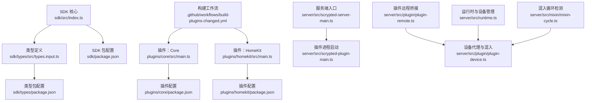
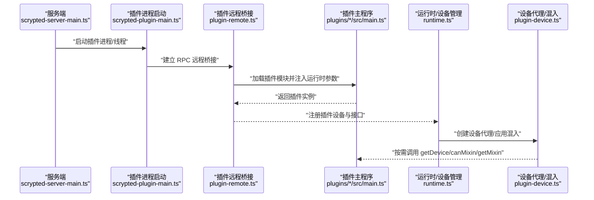
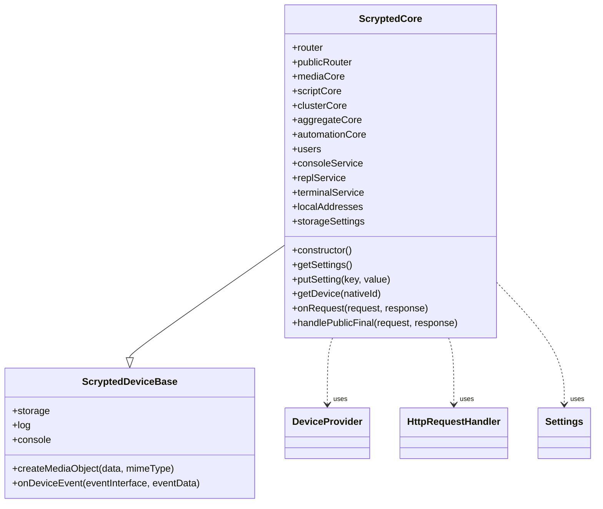
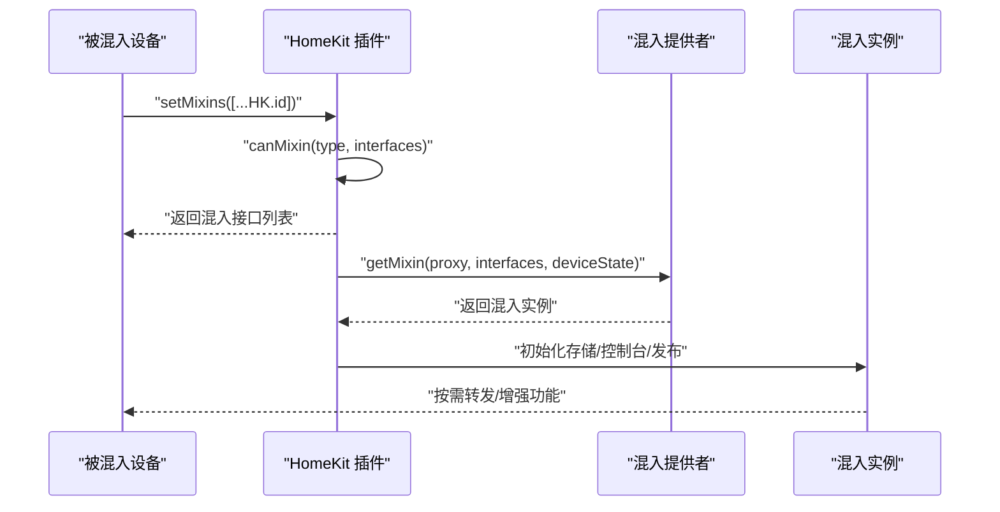
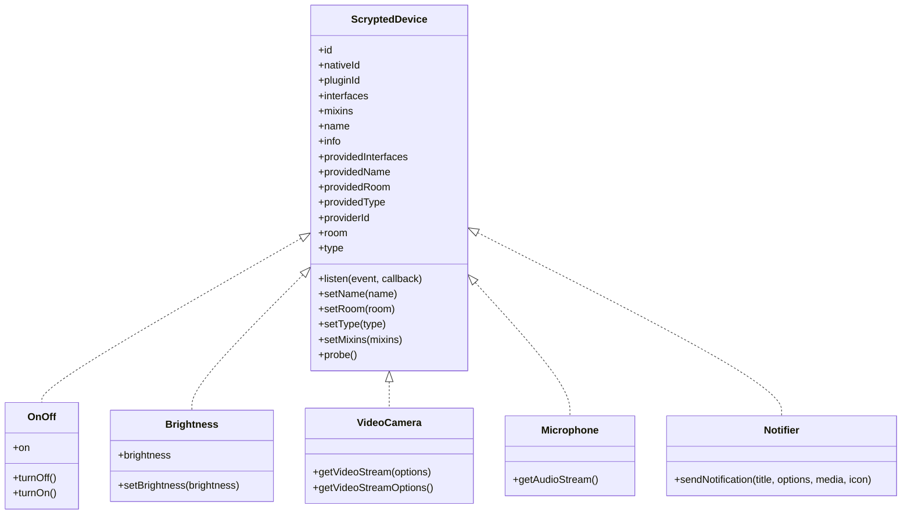

# 插件开发指南

<cite>
**本文引用的文件**
- [README.md](file://README.md)
- [sdk/src/index.ts](file://sdk/src/index.ts)
- [sdk/types/src/types.input.ts](file://sdk/types/src/types.input.ts)
- [sdk/package.json](file://sdk/package.json)
- [sdk/types/package.json](file://sdk/types/package.json)
- [sdk/bin/scrypted-setup-project.js](file://sdk/bin/scrypted-setup-project.js)
- [sdk/bin/index.js](file://sdk/bin/index.js)
- [plugins/core/src/main.ts](file://plugins/core/src/main.ts)
- [plugins/core/package.json](file://plugins/core/package.json)
- [plugins/homekit/src/main.ts](file://plugins/homekit/src/main.ts)
- [plugins/homekit/package.json](file://plugins/homekit/package.json)
- [server/src/plugin/plugin-remote.ts](file://server/src/plugin/plugin-remote.ts)
- [server/src/plugin/plugin-device.ts](file://server/src/plugin/plugin-device.ts)
- [server/src/runtime.ts](file://server/src/runtime.ts)
- [server/src/mixin/mixin-cycle.ts](file://server/src/mixin/mixin-cycle.ts)
- [server/src/scrypted-server-main.ts](file://server/src/scrypted-server-main.ts)
- [server/src/scrypted-plugin-main.ts](file://server/src/scrypted-plugin-main.ts)
- [.github/workflows/build-plugins-changed.yml](file://.github/workflows/build-plugins-changed.yml)
</cite>

## 目录
1. [简介](#简介)
2. [项目结构](#项目结构)
3. [核心组件](#核心组件)
4. [架构总览](#架构总览)
5. [详细组件分析](#详细组件分析)
6. [依赖关系分析](#依赖关系分析)
7. [性能考量](#性能考量)
8. [故障排查指南](#故障排查指南)
9. [结论](#结论)
10. [附录](#附录)

## 简介
本指南面向希望在 Scrypted 平台上开发插件的开发者，系统讲解插件 SDK 的核心概念与 API，覆盖设备插件、协议插件、AI 插件等不同类型的开发模式；提供从环境搭建、项目结构与配置、生命周期管理到调试、打包部署与发布、性能优化与安全最佳实践的完整流程。

## 项目结构
Scrypted 仓库采用多包（monorepo）组织方式，核心 SDK 位于 sdk 目录，类型定义位于 sdk/types，服务端位于 server 目录，官方插件位于 plugins 目录，通用工具库位于 common 与 packages 目录。下图给出与插件开发相关的关键目录与文件映射：

**图表来源**
- [sdk/src/index.ts:1-297](file://sdk/src/index.ts#L1-L297)
- [sdk/types/src/types.input.ts:1-800](file://sdk/types/src/types.input.ts#L1-L800)
- [sdk/package.json:1-62](file://sdk/package.json#L1-L62)
- [sdk/types/package.json:1-17](file://sdk/types/package.json#L1-L17)
- [plugins/core/src/main.ts:1-414](file://plugins/core/src/main.ts#L1-L414)
- [plugins/core/package.json:1-51](file://plugins/core/package.json#L1-L51)
- [plugins/homekit/src/main.ts:1-487](file://plugins/homekit/src/main.ts#L1-L487)
- [plugins/homekit/package.json:1-56](file://plugins/homekit/package.json#L1-L56)
- [server/src/scrypted-server-main.ts:447-488](file://server/src/scrypted-server-main.ts#L447-L488)
- [server/src/scrypted-plugin-main.ts:10-39](file://server/src/scrypted-plugin-main.ts#L10-L39)
- [server/src/plugin/plugin-remote.ts:275-318](file://server/src/plugin/plugin-remote.ts#L275-L318)
- [server/src/plugin/plugin-device.ts:145-383](file://server/src/plugin/plugin-device.ts#L145-L383)
- [server/src/runtime.ts:797-823](file://server/src/runtime.ts#L797-L823)
- [server/src/mixin/mixin-cycle.ts:1-32](file://server/src/mixin/mixin-cycle.ts#L1-L32)
- [.github/workflows/build-plugins-changed.yml:1-51](file://.github/workflows/build-plugins-changed.yml#L1-L51)

**章节来源**
- [README.md:1-59](file://README.md#L1-L59)
- [sdk/src/index.ts:1-297](file://sdk/src/index.ts#L1-L297)
- [sdk/types/src/types.input.ts:1-800](file://sdk/types/src/types.input.ts#L1-L800)
- [plugins/core/src/main.ts:1-414](file://plugins/core/src/main.ts#L1-L414)
- [plugins/homekit/src/main.ts:1-487](file://plugins/homekit/src/main.ts#L1-L487)

## 核心组件
- SDK 入口与静态对象
  - SDK 提供统一的静态对象 sdk，封装 deviceManager、systemManager、mediaManager、endpointManager 等能力，并负责加载运行时模块与接口描述符。
  - 设备基类与混入基类：ScryptedDeviceBase、MixinDeviceBase 提供存储、日志、媒体对象创建、设备状态属性访问与事件派发等能力。
- 类型系统与接口
  - 类型输入文件定义了设备类型、接口集合、事件监听选项、媒体对象、温度/湿度/风扇/温控等标准接口，以及媒体流参数、事件细节等。
- 插件生命周期
  - 服务端通过 scrypted-plugin-main 启动插件进程或线程，使用 plugin-remote 建立 RPC 桥接，插件通过 package.json 中的 scrypted 字段声明类型与接口，服务端据此加载与管理。

**章节来源**
- [sdk/src/index.ts:10-71](file://sdk/src/index.ts#L10-L71)
- [sdk/src/index.ts:87-167](file://sdk/src/index.ts#L87-L167)
- [sdk/src/index.ts:206-293](file://sdk/src/index.ts#L206-L293)
- [sdk/types/src/types.input.ts:17-50](file://sdk/types/src/types.input.ts#L17-L50)
- [sdk/types/src/types.input.ts:16-83](file://sdk/types/src/types.input.ts#L16-L83)
- [server/src/scrypted-plugin-main.ts:10-39](file://server/src/scrypted-plugin-main.ts#L10-L39)
- [server/src/plugin/plugin-remote.ts:281-309](file://server/src/plugin/plugin-remote.ts#L281-L309)

## 架构总览
下图展示从服务端到插件的启动、RPC 桥接、设备代理与混入应用的总体流程：

**图表来源**
- [server/src/scrypted-server-main.ts:447-488](file://server/src/scrypted-server-main.ts#L447-L488)
- [server/src/scrypted-plugin-main.ts:10-39](file://server/src/scrypted-plugin-main.ts#L10-L39)
- [server/src/plugin/plugin-remote.ts:281-309](file://server/src/plugin/plugin-remote.ts#L281-L309)
- [server/src/runtime.ts:797-823](file://server/src/runtime.ts#L797-L823)
- [server/src/plugin/plugin-device.ts:145-383](file://server/src/plugin/plugin-device.ts#L145-L383)

## 详细组件分析

### 设备插件（以 Core 插件为例）
- 角色与职责
  - 作为 DeviceProvider 提供系统级设备（如集群管理、脚本、终端、媒体核心等），并通过 Settings 接口暴露可配置项。
  - 实现 HttpRequestHandler，提供内部/公开路由与静态资源分发。
- 关键点
  - 使用 deviceManager.onDeviceDiscovered 注册系统设备，设置类型与接口。
  - 通过 StorageSettings 统一管理设置项，支持组合框、多选、动态选择等。
  - 通过 Router 组织请求路由，区分公开端点与内部端点。
- 开发要点
  - 在构造函数中尽早注册系统设备，避免后续发现阶段遗漏。
  - 对外公开端点需注意鉴权与路径规范化，防止越权访问。

**图表来源**
- [plugins/core/src/main.ts:27-394](file://plugins/core/src/main.ts#L27-L394)
- [sdk/src/index.ts:10-71](file://sdk/src/index.ts#L10-L71)

**章节来源**
- [plugins/core/src/main.ts:27-394](file://plugins/core/src/main.ts#L27-L394)
- [plugins/core/package.json:25-37](file://plugins/core/package.json#L25-L37)

### 协议插件（以 HomeKit 插件为例）
- 角色与职责
  - 作为 MixinProvider 为其他设备提供 HomeKit 混入，支持自动启用、设备合并、独立配件模式与桥接模式。
  - 通过 Settings 暴露网络与广告器配置，支持随机端口、mDNS 广告器选择、慢速连接地址等。
- 关键点
  - canMixin 根据设备类型与接口判断是否可混入，返回混入所需接口列表。
  - getMixin 返回具体混入实例（如 CameraMixin 或 HomekitMixin），并为每个混入设备维护独立存储与控制台。
  - 发布/取消发布逻辑基于设备在线状态与用户配置，支持快速重载。
- 开发要点
  - 注意混入循环检测与设备合并策略，避免重复暴露或循环依赖。
  - 配置项应尽量持久化到存储，确保重启后行为一致。

**图表来源**
- [plugins/homekit/src/main.ts:410-483](file://plugins/homekit/src/main.ts#L410-L483)
- [server/src/plugin/plugin-device.ts:226-277](file://server/src/plugin/plugin-device.ts#L226-L277)
- [server/src/mixin/mixin-cycle.ts:12-31](file://server/src/mixin/mixin-cycle.ts#L12-L31)

**章节来源**
- [plugins/homekit/src/main.ts:60-483](file://plugins/homekit/src/main.ts#L60-L483)
- [plugins/homekit/package.json:25-37](file://plugins/homekit/package.json#L25-L37)

### AI 插件（以 CoreML/ONNX/OpenCV 等为例）
- 角色与职责
  - 作为 AI/模型推理插件，提供图像/视频帧处理、目标检测、语义分割等能力，通常配合媒体对象转换与事件驱动。
- 开发要点
  - 将模型封装为可复用的服务，提供统一的输入输出规范与错误处理。
  - 利用 MediaObject 的 convert/convertToMimeTypes 能力对接上层消费方。
  - 注意异步与并发控制，避免阻塞主线程。

（本节为概念性说明，不直接分析具体文件）

### 插件 SDK 与类型系统
- SDK 初始化
  - 通过环境变量或运行时参数注入 deviceManager/systemManager/mediaManager 等，动态加载自定义接口描述符。
- 类型与接口
  - 设备类型枚举（如 Camera、Switch、Light、Thermostat、LLM 等）与接口集合（OnOff、Brightness、ColorSettingTemperature、VideoCamera、Microphone、Notifier 等）定义了设备能力边界。
  - 事件系统支持去噪、被动监听、混入事件等选项，便于高效订阅与响应。

**图表来源**
- [sdk/types/src/types.input.ts:17-50](file://sdk/types/src/types.input.ts#L17-L50)
- [sdk/types/src/types.input.ts:166-172](file://sdk/types/src/types.input.ts#L166-L172)
- [sdk/types/src/types.input.ts:176-180](file://sdk/types/src/types.input.ts#L176-L180)
- [sdk/types/src/types.input.ts:712-726](file://sdk/types/src/types.input.ts#L712-L726)
- [sdk/types/src/types.input.ts:691-693](file://sdk/types/src/types.input.ts#L691-L693)
- [sdk/types/src/types.input.ts:290-292](file://sdk/types/src/types.input.ts#L290-L292)

**章节来源**
- [sdk/src/index.ts:206-293](file://sdk/src/index.ts#L206-L293)
- [sdk/types/src/types.input.ts:105-162](file://sdk/types/src/types.input.ts#L105-L162)

## 依赖关系分析
- 插件与服务端
  - 服务端通过 scrypted-plugin-main 启动插件，plugin-remote 负责 RPC 参数注入与模块加载，插件通过 package.json 的 scrypted 字段声明类型与接口。
- 设备代理与混入
  - 运行时根据设备的 mixins 与 canMixin 结果，动态创建混入代理并应用到设备上，形成“设备 + 混入”的叠加能力。
- 循环检测
  - 通过 mixin-cycle 检测混入链路是否存在环，避免递归与死锁。

**图表来源**
- [server/src/scrypted-plugin-main.ts:10-39](file://server/src/scrypted-plugin-main.ts#L10-L39)
- [server/src/plugin/plugin-remote.ts:281-309](file://server/src/plugin/plugin-remote.ts#L281-L309)
- [server/src/runtime.ts:797-823](file://server/src/runtime.ts#L797-L823)
- [server/src/plugin/plugin-device.ts:145-383](file://server/src/plugin/plugin-device.ts#L145-L383)
- [server/src/mixin/mixin-cycle.ts:1-32](file://server/src/mixin/mixin-cycle.ts#L1-L32)

**章节来源**
- [server/src/plugin/plugin-device.ts:226-277](file://server/src/plugin/plugin-device.ts#L226-L277)
- [server/src/mixin/mixin-cycle.ts:12-31](file://server/src/mixin/mixin-cycle.ts#L12-L31)

## 性能考量
- 流媒体与预缓冲
  - 媒体流选项支持预缓冲时间与大小、容器类型、工具（ffmpeg/scrypted/gstreamer）、分辨率与码率等，合理配置可降低延迟与提升稳定性。
- 自适应比特率与反馈
  - 支持包丢失上报、关键帧请求、分辨率调整与估计最大比特率反馈，用于动态适配网络状况。
- 设备状态与事件
  - 使用去噪事件监听减少无效回调；对高频事件进行节流或合并，避免过度刷新。
- 混入与代理
  - 合理设计混入链路，避免深度嵌套与循环；优先使用轻量混入，必要时拆分为多个小混入。

（本节为通用指导，不直接分析具体文件）

## 故障排查指南
- 插件未加载或无法启动
  - 检查服务端日志中的插件启动失败信息，确认插件模块导出与运行时参数注入是否正确。
  - 确认 package.json 的 scrypted 字段与接口声明无误。
- 设备不可用或混入异常
  - 查看运行时移除设备与混入失效的逻辑，确认混入提供者是否仍可用且 canMixin 返回值正确。
  - 使用混入循环检测工具定位环依赖问题。
- 部署与登录
  - 使用 SDK 的部署脚本进行打包与部署，若出现 401，请检查登录凭据与服务器端点。
- 调试技巧
  - 在 VS Code 中直接调试插件，修改后无需重启服务端即可热更新；也可使用命令行构建与部署。

**章节来源**
- [server/src/plugin/plugin-remote.ts:302-308](file://server/src/plugin/plugin-remote.ts#L302-L308)
- [server/src/runtime.ts:804-823](file://server/src/runtime.ts#L804-L823)
- [server/src/plugin/plugin-device.ts:226-245](file://server/src/plugin/plugin-device.ts#L226-L245)
- [sdk/bin/index.js:52-133](file://sdk/bin/index.js#L52-L133)
- [README.md:17-37](file://README.md#L17-L37)

## 结论
通过 SDK 的统一抽象与服务端的 RPC 桥接机制，Scrypted 为插件开发提供了清晰的生命周期与强大的扩展能力。开发者可依据设备类型与协议特性选择合适的插件模式（设备/协议/AI），利用混入机制叠加能力，并遵循性能与安全最佳实践，完成从开发、调试到部署与发布的全流程。

## 附录

### 开发环境搭建
- Node.js 与依赖
  - 使用仓库提供的安装脚本一次性安装服务端与各插件依赖。
- IDE 设置
  - 在 VS Code 中打开对应插件目录，使用内置调试任务启动插件并在运行中热更新。
- TypeScript 配置
  - SDK 提供项目初始化脚本，复制插件专用 tsconfig 模板至项目根目录。

**章节来源**
- [README.md:17-37](file://README.md#L17-L37)
- [sdk/bin/scrypted-setup-project.js:1-7](file://sdk/bin/scrypted-setup-project.js#L1-L7)

### 项目结构与关键文件
- package.json
  - 插件包元数据与脚本，包含 scrypted 字段声明插件类型与接口。
- tsconfig.json
  - 插件专用编译配置，建议继承 SDK 提供的模板。
- plugin.json（由 SDK 自动生成）
  - 由 scrypted-package-json 生成，包含插件清单与接口描述。

**章节来源**
- [plugins/core/package.json:25-37](file://plugins/core/package.json#L25-L37)
- [plugins/homekit/package.json:25-37](file://plugins/homekit/package.json#L25-L37)
- [sdk/package.json:20-28](file://sdk/package.json#L20-L28)

### 生命周期管理
- 初始化
  - 插件进程启动 → 加载运行时参数 → 导出主类实例 → 注册设备与接口。
- 运行时交互
  - 设备代理与混入应用 → 事件监听与状态变更 → 媒体对象创建与转换。
- 销毁
  - 设备移除或插件卸载时清理混入与存储，释放资源。

**章节来源**
- [server/src/scrypted-plugin-main.ts:10-39](file://server/src/scrypted-plugin-main.ts#L10-L39)
- [server/src/plugin/plugin-remote.ts:281-309](file://server/src/plugin/plugin-remote.ts#L281-L309)
- [server/src/runtime.ts:804-823](file://server/src/runtime.ts#L804-L823)

### 代码示例（路径指引）
- 设备控制与状态查询
  - 参考设备基类的属性访问与事件派发方法路径：[sdk/src/index.ts:192-204](file://sdk/src/index.ts#L192-L204)、[sdk/src/index.ts:68-70](file://sdk/src/index.ts#L68-L70)
- 事件处理
  - 参考设备事件监听与去噪选项：[sdk/types/src/types.input.ts:61-78](file://sdk/types/src/types.input.ts#L61-L78)、[sdk/types/src/types.input.ts:85-91](file://sdk/types/src/types.input.ts#L85-L91)
- 混入提供与应用
  - 参考混入提供者接口与设备代理应用：[server/src/plugin/plugin-device.ts:226-277](file://server/src/plugin/plugin-device.ts#L226-L277)
- 媒体对象创建与转换
  - 参考媒体对象创建与混入控制台：[sdk/src/index.ts:42-52](file://sdk/src/index.ts#L42-L52)、[sdk/src/index.ts:136-146](file://sdk/src/index.ts#L136-L146)

### 调试技巧
- VS Code 调试
  - 打开插件目录，使用内置启动配置直接调试；修改后无需重启服务端。
- 日志与错误
  - 使用设备/混入控制台输出诊断信息；关注服务端插件启动失败与设备移除日志。
- 命令行部署
  - 使用 SDK 提供的部署脚本一键打包并部署到指定主机。

**章节来源**
- [README.md:17-37](file://README.md#L17-L37)
- [sdk/bin/index.js:52-133](file://sdk/bin/index.js#L52-L133)

### 打包、部署与发布
- 打包
  - 使用 SDK 的 Webpack 构建脚本生成插件压缩包。
- 部署
  - 通过服务端提供的部署接口上传压缩包并配置插件清单。
- 发布
  - 可通过 npm 包管理与 CI 工作流自动化构建与发布。

**章节来源**
- [sdk/package.json:20-28](file://sdk/package.json#L20-L28)
- [sdk/bin/index.js:52-133](file://sdk/bin/index.js#L52-L133)
- [server/src/scrypted-server-main.ts:447-488](file://server/src/scrypted-server-main.ts#L447-L488)
- [.github/workflows/build-plugins-changed.yml:27-50](file://.github/workflows/build-plugins-changed.yml#L27-L50)