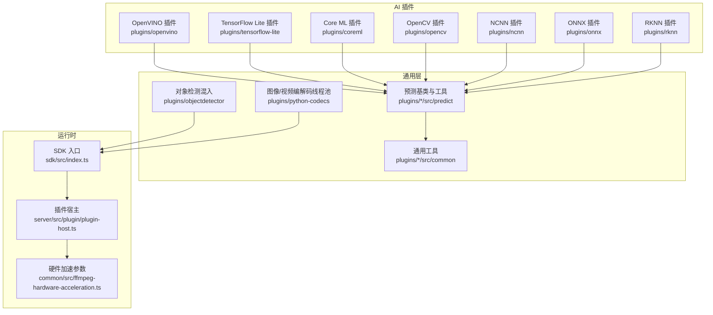
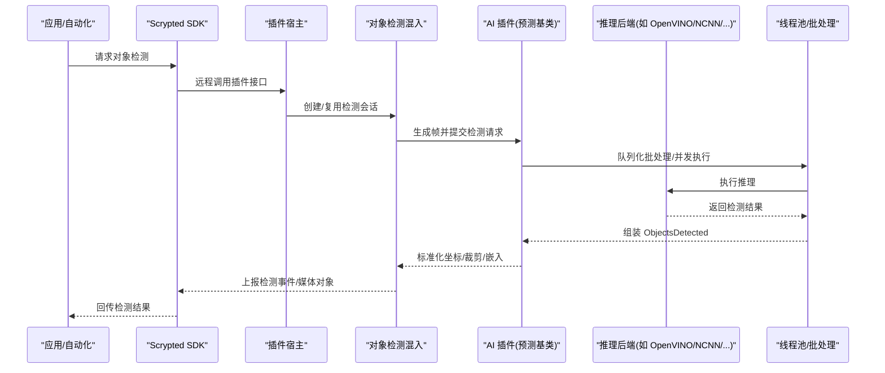
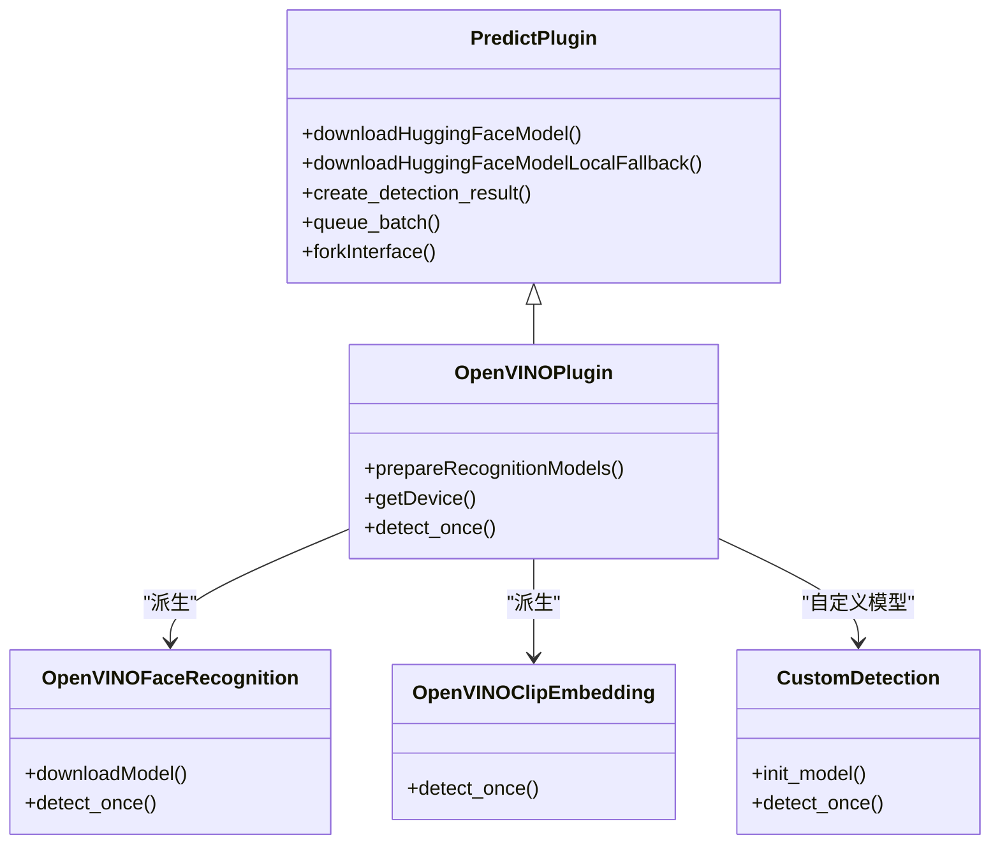
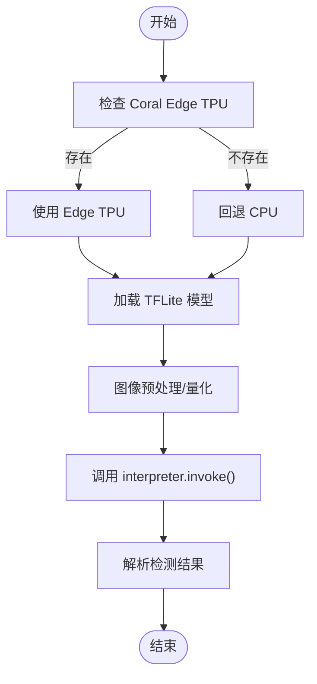
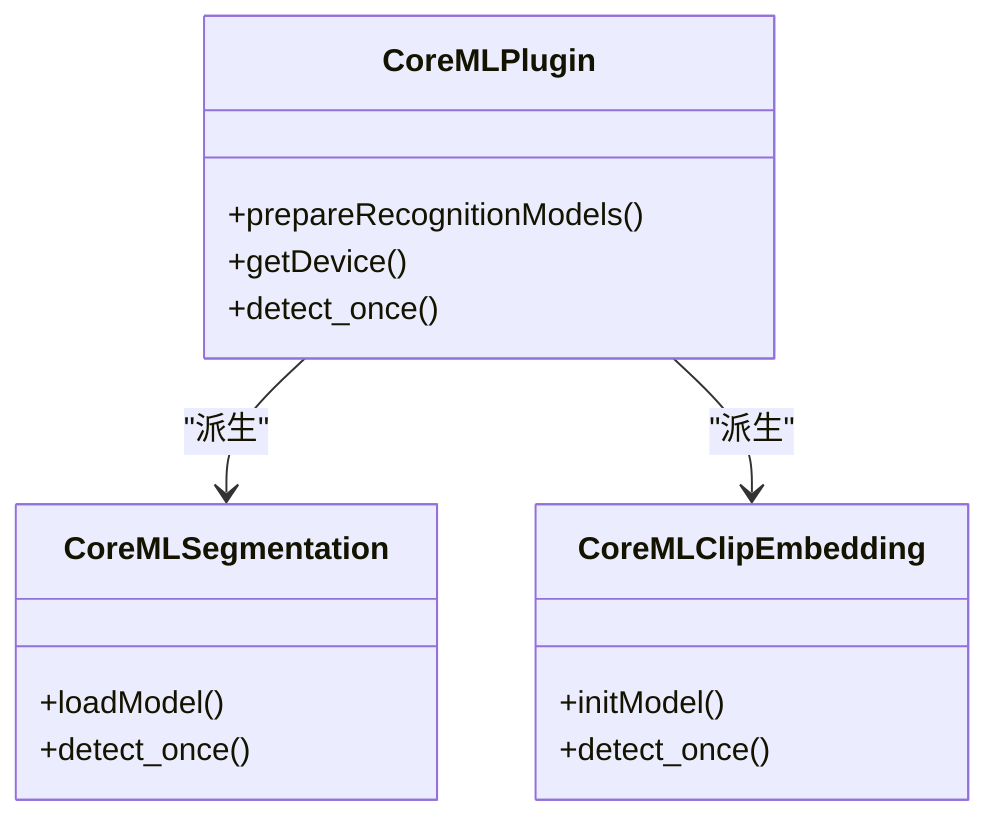
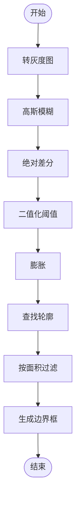
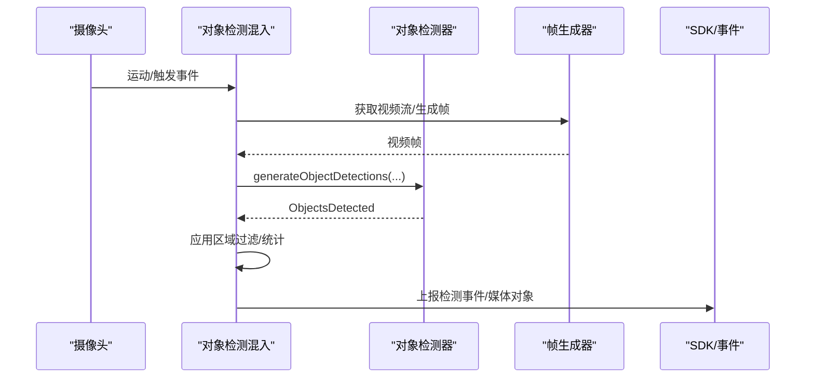
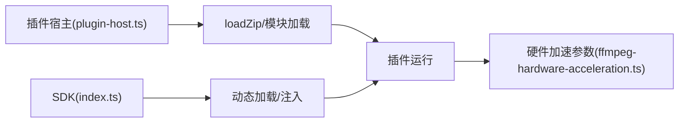

# AI 插件开发

<cite>
**本文引用的文件**
- [plugins/openvino/src/predict/__init__.py](file://plugins/openvino/src/predict/__init__.py)
- [plugins/openvino/src/ov/__init__.py](file://plugins/openvino/src/ov/__init__.py)
- [plugins/openvino/src/ov/face_recognition.py](file://plugins/openvino/src/ov/face_recognition.py)
- [plugins/openvino/src/ov/clip_embedding.py](file://plugins/openvino/src/ov/clip_embedding.py)
- [plugins/openvino/src/predict/custom_detect.py](file://plugins/openvino/src/predict/custom_detect.py)
- [plugins/openvino/src/common/async_infer.py](file://plugins/openvino/src/common/async_infer.py)
- [plugins/openvino/src/common/yolo.py](file://plugins/openvino/src/common/yolo.py)
- [plugins/tensorflow-lite/src/tflite/__init__.py](file://plugins/tensorflow-lite/src/tflite/__init__.py)
- [plugins/tensorflow-lite/src/requirements.txt](file://plugins/tensorflow-lite/src/requirements.txt)
- [plugins/coreml/src/coreml/__init__.py](file://plugins/coreml/src/coreml/__init__.py)
- [plugins/coreml/src/coreml/segment.py](file://plugins/coreml/src/coreml/segment.py)
- [plugins/opencv/src/opencv/__init__.py](file://plugins/opencv/src/opencv/__init__.py)
- [plugins/ncnn/src/nc/__init__.py](file://plugins/ncnn/src/nc/__init__.py)
- [plugins/rknn/src/main.py](file://plugins/rknn/src/main.py)
- [plugins/onnx/src/ort/custom_detection.py](file://plugins/onnx/src/ort/custom_detection.py)
- [plugins/onnx/src/ort/clip_embedding.py](file://plugins/onnx/src/ort/clip_embedding.py)
- [plugins/objectdetector/src/main.ts](file://plugins/objectdetector/src/main.ts)
- [plugins/python-codecs/src/thread.py](file://plugins/python-codecs/src/thread.py)
- [common/src/ffmpeg-hardware-acceleration.ts](file://common/src/ffmpeg-hardware-acceleration.ts)
- [server/src/plugin/plugin-host.ts](file://server/src/plugin/plugin-host.ts)
- [sdk/src/index.ts](file://sdk/src/index.ts)
</cite>

## 目录
1. [简介](#简介)
2. [项目结构](#项目结构)
3. [核心组件](#核心组件)
4. [架构总览](#架构总览)
5. [详细组件分析](#详细组件分析)
6. [依赖分析](#依赖分析)
7. [性能考虑](#性能考虑)
8. [故障排查指南](#故障排查指南)
9. [结论](#结论)
10. [附录](#附录)

## 简介
本文件面向 Scrypted 的 AI 插件开发者，系统性阐述 AI 插件的架构设计与实现原理，覆盖以下主题：
- 深度学习模型集成：TensorFlow Lite、OpenCV、Core ML、ONNX Runtime、OpenVINO、NCNN、RKNN 等框架的适配方式
- 推理引擎管理：模型下载、缓存、设备发现、多设备派生（人脸、文本、分割、CLIP 嵌入）
- 性能优化策略：并发执行、批处理、线程池、输入格式标准化、硬件加速、内存与资源管理
- 计算机视觉插件开发：目标检测、人脸识别、图像分割、文本识别、嵌入生成等算法实现
- 模型管理：模型配置、版本控制、热更新机制、自定义模型创建与分发
- 调试与部署：模型训练、性能测试、部署优化、集群与 Fork 管理

## 项目结构
Scrypted 将 AI 插件按“框架/后端”组织在 plugins 目录下，每个插件封装特定推理后端，并通过统一的 Scrypted SDK 接口暴露对象检测、人脸识别、文本识别、分割、嵌入等能力。

图示来源
- [plugins/openvino/src/predict/__init__.py](file://plugins/openvino/src/predict/__init__.py)
- [plugins/tensorflow-lite/src/tflite/__init__.py](file://plugins/tensorflow-lite/src/tflite/__init__.py)
- [plugins/coreml/src/coreml/__init__.py](file://plugins/coreml/src/coreml/__init__.py)
- [plugins/opencv/src/opencv/__init__.py](file://plugins/opencv/src/opencv/__init__.py)
- [plugins/ncnn/src/nc/__init__.py](file://plugins/ncnn/src/nc/__init__.py)
- [plugins/onnx/src/ort/custom_detection.py](file://plugins/onnx/src/ort/custom_detection.py)
- [plugins/rknn/src/main.py](file://plugins/rknn/src/main.py)
- [plugins/objectdetector/src/main.ts](file://plugins/objectdetector/src/main.ts)
- [plugins/python-codecs/src/thread.py](file://plugins/python-codecs/src/thread.py)
- [sdk/src/index.ts](file://sdk/src/index.ts)
- [server/src/plugin/plugin-host.ts](file://server/src/plugin/plugin-host.ts)
- [common/src/ffmpeg-hardware-acceleration.ts](file://common/src/ffmpeg-hardware-acceleration.ts)

章节来源
- [plugins/openvino/src/predict/__init__.py](file://plugins/openvino/src/predict/__init__.py)
- [plugins/tensorflow-lite/src/tflite/__init__.py](file://plugins/tensorflow-lite/src/tflite/__init__.py)
- [plugins/coreml/src/coreml/__init__.py](file://plugins/coreml/src/coreml/__init__.py)
- [plugins/opencv/src/opencv/__init__.py](file://plugins/opencv/src/opencv/__init__.py)
- [plugins/ncnn/src/nc/__init__.py](file://plugins/ncnn/src/nc/__init__.py)
- [plugins/onnx/src/ort/custom_detection.py](file://plugins/onnx/src/ort/custom_detection.py)
- [plugins/rknn/src/main.py](file://plugins/rknn/src/main.py)
- [plugins/objectdetector/src/main.ts](file://plugins/objectdetector/src/main.ts)
- [plugins/python-codecs/src/thread.py](file://plugins/python-codecs/src/thread.py)
- [sdk/src/index.ts](file://sdk/src/index.ts)
- [server/src/plugin/plugin-host.ts](file://server/src/plugin/plugin-host.ts)
- [common/src/ffmpeg-hardware-acceleration.ts](file://common/src/ffmpeg-hardware-acceleration.ts)

## 核心组件
- 预测基类与通用工具：提供模型下载、缓存、输入预处理、批处理队列、集群 Fork、设备发现与设置项等通用能力
- 后端插件：各框架的实现（OpenVINO、TensorFlow Lite、Core ML、OpenCV、NCNN、ONNX Runtime、RKNN），负责具体模型加载、推理与结果解析
- 对象检测混入：统一的对象检测生命周期、帧生成、区域过滤、运动传感器协同、性能监控与节流
- 图像/视频编解码线程池：将耗时的图像转换与编解码从事件循环中移出，提升并发与稳定性
- 硬件加速参数：跨平台 FFmpeg 硬件加速参数配置，支持 CUDA、CUVID、QuickSync、V4L2、VideoToolbox 等

章节来源
- [plugins/openvino/src/predict/__init__.py](file://plugins/openvino/src/predict/__init__.py)
- [plugins/openvino/src/common/yolo.py](file://plugins/openvino/src/common/yolo.py)
- [plugins/objectdetector/src/main.ts](file://plugins/objectdetector/src/main.ts)
- [plugins/python-codecs/src/thread.py](file://plugins/python-codecs/src/thread.py)
- [common/src/ffmpeg-hardware-acceleration.ts](file://common/src/ffmpeg-hardware-acceleration.ts)

## 架构总览
AI 插件遵循“统一接口 + 多后端实现”的模式。上层通过 Scrypted SDK 获取对象检测器、人脸识别器、文本识别器、分割器、嵌入器等设备；底层由各框架插件完成模型加载与推理；通用层提供输入格式标准化、批处理、并发与集群分发。

图示来源
- [plugins/openvino/src/predict/__init__.py](file://plugins/openvino/src/predict/__init__.py)
- [plugins/objectdetector/src/main.ts](file://plugins/objectdetector/src/main.ts)
- [plugins/python-codecs/src/thread.py](file://plugins/python-codecs/src/thread.py)
- [server/src/plugin/plugin-host.ts](file://server/src/plugin/plugin-host.ts)
- [sdk/src/index.ts](file://sdk/src/index.ts)

## 详细组件分析

### OpenVINO 插件
- 设备发现与派生：通过设备管理器注册内置设备（人脸识别、文本识别、分割、CLIP 嵌入），并支持自定义检测设备
- 模型下载与缓存：从 Hugging Face Hub 下载模型快照，离线回退，避免网络问题导致失败
- 推理执行：根据可用设备选择 AUTO/GPU/NPU/…，异步执行准备与预测线程池
- 结果解析：YOLOv9/YOLOv10 等解析器，支持非极大值抑制、坐标变换、嵌入生成

图示来源
- [plugins/openvino/src/predict/__init__.py](file://plugins/openvino/src/predict/__init__.py)
- [plugins/openvino/src/ov/__init__.py](file://plugins/openvino/src/ov/__init__.py)
- [plugins/openvino/src/ov/face_recognition.py](file://plugins/openvino/src/ov/face_recognition.py)
- [plugins/openvino/src/ov/clip_embedding.py](file://plugins/openvino/src/ov/clip_embedding.py)
- [plugins/openvino/src/predict/custom_detect.py](file://plugins/openvino/src/predict/custom_detect.py)

章节来源
- [plugins/openvino/src/predict/__init__.py](file://plugins/openvino/src/predict/__init__.py)
- [plugins/openvino/src/ov/__init__.py](file://plugins/openvino/src/ov/__init__.py)
- [plugins/openvino/src/ov/face_recognition.py](file://plugins/openvino/src/ov/face_recognition.py)
- [plugins/openvino/src/ov/clip_embedding.py](file://plugins/openvino/src/ov/clip_embedding.py)
- [plugins/openvino/src/predict/custom_detect.py](file://plugins/openvino/src/predict/custom_detect.py)
- [plugins/openvino/src/common/async_infer.py](file://plugins/openvino/src/common/async_infer.py)
- [plugins/openvino/src/common/yolo.py](file://plugins/openvino/src/common/yolo.py)

### TensorFlow Lite 插件
- 设备与模型：自动探测 Coral Edge TPU，否则回退 CPU；支持多种默认模型与标签映射
- 输入预处理：量化/非量化路径，支持快速路径与通用路径；批量输入与输出细节处理
- 推理执行：每线程独立 interpreter，YOLO 或通用检测流程

图示来源
- [plugins/tensorflow-lite/src/tflite/__init__.py](file://plugins/tensorflow-lite/src/tflite/__init__.py)
- [plugins/tensorflow-lite/src/requirements.txt](file://plugins/tensorflow-lite/src/requirements.txt)

章节来源
- [plugins/tensorflow-lite/src/tflite/__init__.py](file://plugins/tensorflow-lite/src/tflite/__init__.py)
- [plugins/tensorflow-lite/src/requirements.txt](file://plugins/tensorflow-lite/src/requirements.txt)

### Core ML 插件
- 设备发现：人脸识别、文本识别、分割、CLIP 嵌入
- 模型加载：从本地 mlpackage 加载，解析输入尺寸与标签
- 推理执行：队列化批处理，YOLOv9 解析，坐标转换

图示来源
- [plugins/coreml/src/coreml/__init__.py](file://plugins/coreml/src/coreml/__init__.py)
- [plugins/coreml/src/coreml/segment.py](file://plugins/coreml/src/coreml/segment.py)

章节来源
- [plugins/coreml/src/coreml/__init__.py](file://plugins/coreml/src/coreml/__init__.py)
- [plugins/coreml/src/coreml/segment.py](file://plugins/coreml/src/coreml/segment.py)

### OpenCV 插件
- 算法：基于帧差法的运动检测，支持阈值、面积、模糊半径等参数
- 输入格式：灰度图，尺寸缩放与坐标转换
- 并发：图像转换在独立线程池执行

图示来源
- [plugins/opencv/src/opencv/__init__.py](file://plugins/opencv/src/opencv/__init__.py)

章节来源
- [plugins/opencv/src/opencv/__init__.py](file://plugins/opencv/src/opencv/__init__.py)

### NCNN 插件
- 设备发现：人脸识别、文本识别、分割
- 模型加载：Vulkan 计算启用，param/bin 文件加载
- 推理执行：BHWC 到 BCHW 转置、归一化、YOLOv9 解析

章节来源
- [plugins/ncnn/src/nc/__init__.py](file://plugins/ncnn/src/nc/__init__.py)

### RKNN 插件
- 入口：提供 create_scrypted_plugin 工厂函数，用于插件初始化

章节来源
- [plugins/rknn/src/main.py](file://plugins/rknn/src/main.py)

### ONNX Runtime 插件
- 自定义检测：多提供者（CUDA、DirectML、CPU）初始化，线程池与执行器
- CLIP 嵌入：文本与视觉模型并行推理，嵌入拼接与导出

章节来源
- [plugins/onnx/src/ort/custom_detection.py](file://plugins/onnx/src/ort/custom_detection.py)
- [plugins/onnx/src/ort/clip_embedding.py](file://plugins/onnx/src/ort/clip_embedding.py)

### 对象检测混入（Computer Vision Pipeline）
- 生命周期：检测会话管理、帧生成、后处理、事件上报
- 区域过滤：多边形包含/相交、排除/包含/观察模式、类别过滤
- 性能监控：采样 FPS、低水位/高水位控制、系统压力提示
- 与运动传感器协同：替换/辅助/默认三种模式

图示来源
- [plugins/objectdetector/src/main.ts](file://plugins/objectdetector/src/main.ts)

章节来源
- [plugins/objectdetector/src/main.ts](file://plugins/objectdetector/src/main.ts)

### 图像/视频编解码线程池
- 将图像转换、颜色空间转换、编解码等阻塞操作放入独立线程池，避免阻塞事件循环
- 提供 to_thread 封装，确保多线程安全与资源释放

章节来源
- [plugins/python-codecs/src/thread.py](file://plugins/python-codecs/src/thread.py)

## 依赖分析
- 插件宿主加载：插件以 zip 方式加载，支持远程加载与本地路径切换，异常时记录并抛出
- SDK 初始化：动态加载 SDK 模块，兼容 ES/CJS，注入运行时 API
- 硬件加速：跨平台 FFmpeg 参数映射，自动选择最优硬件加速方案

图示来源
- [server/src/plugin/plugin-host.ts](file://server/src/plugin/plugin-host.ts)
- [sdk/src/index.ts](file://sdk/src/index.ts)
- [common/src/ffmpeg-hardware-acceleration.ts](file://common/src/ffmpeg-hardware-acceleration.ts)

章节来源
- [server/src/plugin/plugin-host.ts](file://server/src/plugin/plugin-host.ts)
- [sdk/src/index.ts](file://sdk/src/index.ts)
- [common/src/ffmpeg-hardware-acceleration.ts](file://common/src/ffmpeg-hardware-acceleration.ts)

## 性能考虑
- 并发与批处理
  - 批处理队列：PredictPlugin 维护 batch 队列，定时 flush，减少频繁上下文切换
  - 线程池：OpenVINO/NCNN/Core ML/ONNX 等均使用独立线程池执行准备与预测
  - 图像转换：to_thread 将颜色空间转换、PIL 操作移出主线程
- 输入标准化
  - 统一输入格式（RGB/RGBA/YCbCr）、尺寸与填充策略，避免重复转换
  - 支持 pad 模式，保证模型输入尺寸一致
- 硬件加速
  - CUDA/CUVID/QuickSync/V4L2/VideoToolbox 等参数自动选择，降低 CPU 占用
- 资源管理
  - 模型缓存与离线回退，避免网络波动影响
  - 定期重启策略（部分插件）缓解内存泄漏风险
- 性能监控
  - 对象检测混入统计 10 秒采样窗口内的检测频率，超过阈值发出系统性能警告

章节来源
- [plugins/openvino/src/predict/__init__.py](file://plugins/openvino/src/predict/__init__.py)
- [plugins/openvino/src/common/async_infer.py](file://plugins/openvino/src/common/async_infer.py)
- [plugins/python-codecs/src/thread.py](file://plugins/python-codecs/src/thread.py)
- [common/src/ffmpeg-hardware-acceleration.ts](file://common/src/ffmpeg-hardware-acceleration.ts)
- [plugins/objectdetector/src/main.ts](file://plugins/objectdetector/src/main.ts)

## 故障排查指南
- 插件加载失败
  - 检查插件 zip 加载日志与错误堆栈，确认依赖安装与路径正确
  - 参考插件宿主加载流程与异常处理
- 模型下载/缓存问题
  - 使用本地回退模式，确认缓存目录权限与网络可达性
  - 关注 IPv6 解析顺序问题，必要时调整 DNS 或网络策略
- 推理超时或崩溃
  - 启用批处理与线程池，限制单次推理时间，必要时触发插件重启
  - 检查输入尺寸/格式是否符合模型要求
- 硬件加速无效
  - 核对 FFmpeg 参数映射，确认驱动与环境变量配置
  - 在不同平台验证加速器可用性（CUDA、QuickSync、V4L2、VideoToolbox）

章节来源
- [server/src/plugin/plugin-host.ts](file://server/src/plugin/plugin-host.ts)
- [plugins/openvino/src/predict/__init__.py](file://plugins/openvino/src/predict/__init__.py)
- [common/src/ffmpeg-hardware-acceleration.ts](file://common/src/ffmpeg-hardware-acceleration.ts)

## 结论
Scrypted 的 AI 插件体系通过统一的预测基类与多后端实现，实现了模型加载、推理执行、结果解析与设备派生的标准化流程。结合并发批处理、线程池、输入标准化与硬件加速，能够在不同平台上获得稳定且高效的计算机视觉能力。开发者可基于现有插件模板快速扩展新的模型与算法，并通过统一的设置项与设备发现机制无缝接入 Scrypted 生态。

## 附录
- 开发建议
  - 使用 PredictPlugin 基类，统一实现 detect_once/detect_batch 与输入格式标准化
  - 优先采用线程池与批处理，避免阻塞事件循环
  - 提供设备发现与设置项，支持用户选择模型与参数
  - 实现离线回退与定期重启策略，提升鲁棒性
- 调试技巧
  - 使用对象检测混入的区域过滤与统计功能定位误检
  - 通过硬件加速参数验证不同平台的性能差异
  - 使用 SDK 的 RPC 日志与插件宿主日志定位问题