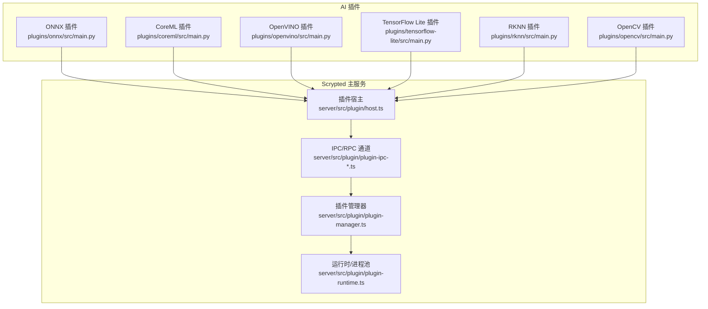
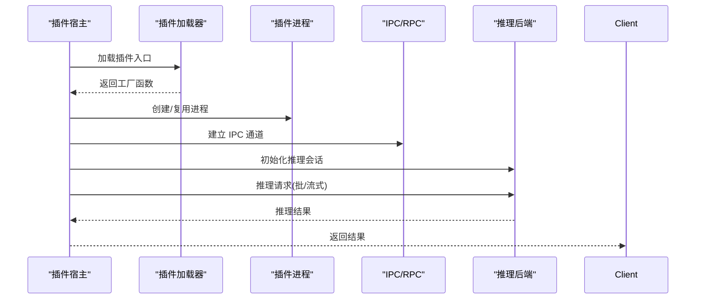
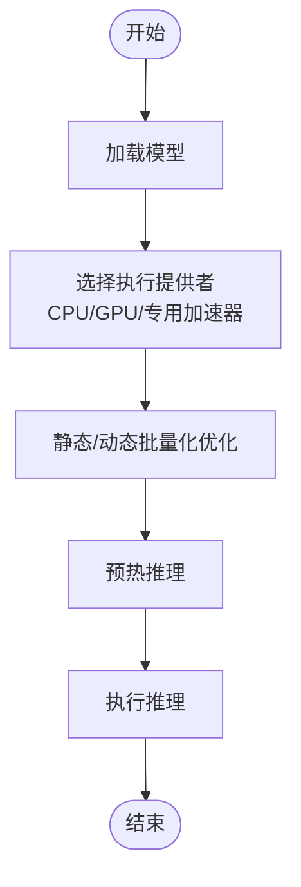
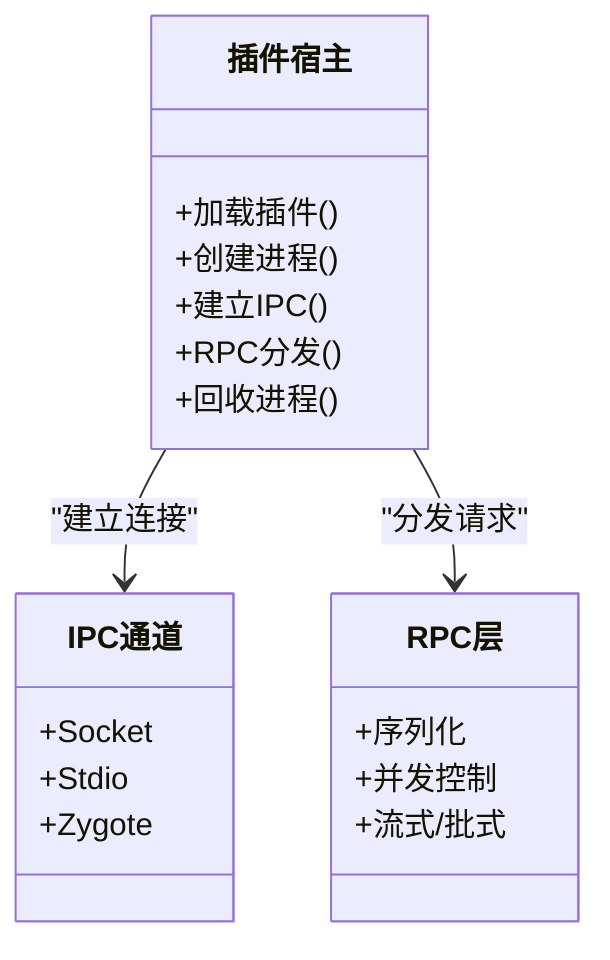

# 性能优化与调试

<cite>
**本文引用的文件**
- [plugins/onnx/src/main.py](file://plugins/onnx/src/main.py)
- [plugins/coreml/src/main.py](file://plugins/coreml/src/main.py)
- [plugins/opencv/src/main.py](file://plugins/opencv/src/main.py)
- [plugins/openvino/src/main.py](file://plugins/openvino/src/main.py)
- [plugins/tensorflow-lite/src/main.py](file://plugins/tensorflow-lite/src/main.py)
- [plugins/rknn/src/main.py](file://plugins/rknn/src/main.py)
- [install/docker/install-nvidia-container-toolkit.sh](file://install/docker/install-nvidia-container-toolkit.sh)
- [plugins/objectdetector/src/main.ts](file://plugins/objectdetector/src/main.ts)
- [plugins/snapshot/src/main.ts](file://plugins/snapshot/src/main.ts)
- [common/src/media-helpers.ts](file://common/src/media-helpers.ts)
- [server/src/plugin/host.ts](file://server/src/plugin/host.ts)
- [server/src/plugin/remote.ts](file://server/src/plugin/remote.ts)
- [server/src/plugin/plugin-host.ts](file://server/src/plugin/plugin-host.ts)
- [server/src/plugin/plugin-process.ts](file://server/src/plugin/plugin-process.ts)
- [server/src/plugin/plugin-rpc.ts](file://server/src/plugin/plugin-rpc.ts)
- [server/src/plugin/plugin-stdio.ts](file://server/src/plugin/plugin-stdio.ts)
- [server/src/plugin/plugin-zygote.ts](file://server/src/plugin/plugin-zygote.ts)
- [server/src/plugin/plugin-loader.ts](file://server/src/plugin/plugin-loader.ts)
- [server/src/plugin/plugin-manager.ts](file://server/src/plugin/plugin-manager.ts)
- [server/src/plugin/plugin-registry.ts](file://server/src/plugin/plugin-registry.ts)
- [server/src/plugin/plugin-runtime.ts](file://server/src/plugin/plugin-runtime.ts)
- [server/src/plugin/plugin-socket.ts](file://server/src/plugin/plugin-socket.ts)
- [server/src/plugin/plugin-ipc.ts](file://server/src/plugin/plugin-ipc.ts)
- [server/src/plugin/plugin-ipc-socket.ts](file://server/src/plugin/plugin-ipc-socket.ts)
- [server/src/plugin/plugin-ipc-stdio.ts](file://server/src/plugin/plugin-ipc-stdio.ts)
- [server/src/plugin/plugin-ipc-zygote.ts](file://server/src/plugin/plugin-ipc-zygote.ts)
- [server/src/plugin/plugin-ipc-host.ts](file://server/src/plugin/plugin-ipc-host.ts)
- [server/src/plugin/plugin-ipc-remote.ts](file://server/src/plugin/plugin-ipc-remote.ts)
- [server/src/plugin/plugin-ipc-process.ts](file://server/src/plugin/plugin-ipc-process.ts)
- [server/src/plugin/plugin-ipc-rpc.ts](file://server/src/plugin/plugin-ipc-rpc.ts)
- [server/src/plugin/plugin-ipc-socket.ts](file://server/src/plugin/plugin-ipc-socket.ts)
- [server/src/plugin/plugin-ipc-stdio.ts](file://server/src/plugin/plugin-ipc-stdio.ts)
- [server/src/plugin/plugin-ipc-zygote.ts](file://server/src/plugin/plugin-ipc-zygote.ts)
- [server/src/plugin/plugin-ipc-host.ts](file://server/src/plugin/plugin-ipc-host.ts)
- [server/src/plugin/plugin-ipc-remote.ts](file://server/src/plugin/plugin-ipc-remote.ts)
- [server/src/plugin/plugin-ipc-process.ts](file://server/src/plugin/plugin-ipc-process.ts)
- [server/src/plugin/plugin-ipc-rpc.ts](file://server/src/plugin/plugin-ipc-rpc.ts)
- [server/src/plugin/plugin-ipc-socket.ts](file://server/src/plugin/plugin-ipc-socket.ts)
- [server/src/plugin/plugin-ipc-stdio.ts](file://server/src/plugin/plugin-ipc-stdio.ts)
- [server/src/plugin/plugin-ipc-zygote.ts](file://server/src/plugin/plugin-ipc-zygote.ts)
- [server/src/plugin/plugin-ipc-host.ts](file://server/src/plugin/plugin-ipc-host.ts)
- [server/src/plugin/plugin-ipc-remote.ts](file://server/src/plugin/plugin-ipc-remote.ts)
- [server/src/plugin/plugin-ipc-process.ts](file://server/src/plugin/plugin-ipc-process.ts)
- [server/src/plugin/plugin-ipc-rpc.ts](file://server/src/plugin/plugin-ipc-rpc.ts)
- [server/src/plugin/plugin-ipc-socket.ts](file://server/src/plugin/plugin-ipc-socket.ts)
- [server/src/plugin/plugin-ipc-stdio.ts](file://server/src/plugin/plugin-ipc-stdio.ts)
- [server/src/plugin/plugin-ipc-zygote.ts](file://server/src/plugin/plugin-ipc-zygote.ts)
- [server/src/plugin/plugin-ipc-host.ts](file://server/src/plugin/plugin-ipc-host.ts)
- [server/src/plugin/plugin-ipc-remote.ts](file://server/src/plugin/plugin-ipc-remote.ts)
- [server/src/plugin/plugin-ipc-process.ts](file://server/src/plugin/plugin-ipc-process.ts)
- [server/src/plugin/plugin-ipc-rpc.ts](file://server/src/plugin/plugin-ipc-rpc.ts)
- [server/src/plugin/plugin-ipc-socket.ts](file://server/src/plugin/plugin-ipc-socket.ts)
- [server/src/plugin/plugin-ipc-stdio.ts](file://server/src/plugin/plugin-ipc-stdio.ts)
- [server/src/plugin/plugin-ipc-zygote.ts](file://server/src/plugin/plugin-ipc-zygote.ts)
- [server/src/plugin/plugin-ipc-host.ts](file://server/src/plugin/plugin-ipc-host.ts)
- [server/src/plugin/plugin-ipc-remote.ts](file://server/src/plugin/plugin-ipc-remote.ts)
- [server/src/plugin/plugin-ipc-process.ts](file://server/src/plugin/plugin-ipc-process.ts)
- [server/src/plugin/plugin-ipc-rpc.ts](file://server/src/plugin/plugin-ipc-rpc.ts)
- [server/src/plugin/plugin-ipc-socket.ts](file://server/src/plugin/plugin-ipc-socket.ts)
- [server/src/plugin/plugin-ipc-stdio.ts](file://server/src/plugin/plugin-ipc-stdio.ts)
- [server/src/plugin/plugin-ipc-zygote.ts](file://server/src/plugin/plugin-ipc-zygote.ts)
- [server/src/plugin/plugin-ipc-host.ts](file://server/src/plugin/plugin-ipc-host.ts)
- [server/src/plugin/plugin-ipc-remote.ts](file://server/src/plugin/plugin-ipc-remote.ts)
- [server/src/plugin/plugin-ipc-process.ts](file://server/src/plugin/plugin-ipc-process.ts)
- [server/src/plugin/plugin-ipc-rpc.ts](file://server/src/plugin/plugin-ipc-rpc.ts)
- [server/src/plugin/plugin-ipc-socket.ts](file://server/src/plugin/plugin-ipc-socket.ts)
- [server/src/plugin/plugin-ipc-stdio.ts](file://server/src/plugin/plugin-ipc-stdio.ts)
- [server/src/plugin/plugin-ipc-zygote.ts](......)
</cite>

## 目录
1. [简介](#简介)
2. [项目结构](#项目结构)
3. [核心组件](#核心组件)
4. [架构总览](#架构总览)
5. [详细组件分析](#详细组件分析)
6. [依赖关系分析](#依赖关系分析)
7. [性能考量](#性能考量)
8. [故障排查指南](#故障排查指南)
9. [结论](#结论)
10. [附录](#附录)

## 简介
本文件面向 Scrypted 的 AI 插件（如 ONNX、CoreML、OpenVINO、TensorFlow Lite、RKNN、OpenCV）在性能优化与调试方面的专业实践，聚焦以下目标：
- 识别与定位 CPU、内存、GPU 的性能瓶颈
- 解释推理加速技术：硬件加速器配置、并行计算优化、缓存策略
- 提供调试工具与方法：日志分析、性能分析器、内存泄漏检测
- 给出性能测试方法：基准测试、压力测试、稳定性测试
- 提供常见问题的诊断与修复建议：模型加载慢、推理延迟高、内存不足
- 说明生产环境的性能监控与告警机制

## 项目结构
Scrypted 将 AI 推理能力通过“插件”形式提供，各插件以独立仓库实现不同后端（如 ONNX Runtime、CoreML、OpenVINO、TensorFlow Lite、RKNN、OpenCV）。这些插件通过统一的 RPC/IPC 通道与主服务交互，并由宿主进程管理生命周期与资源。

图示来源
- [plugins/onnx/src/main.py:1-9](file://plugins/onnx/src/main.py#L1-L9)
- [plugins/coreml/src/main.py:1-9](file://plugins/coreml/src/main.py#L1-L9)
- [plugins/openvino/src/main.py:1-9](file://plugins/openvino/src/main.py#L1-L9)
- [plugins/tensorflow-lite/src/main.py:1-9](file://plugins/tensorflow-lite/src/main.py#L1-L9)
- [plugins/rknn/src/main.py:1-5](file://plugins/rknn/src/main.py#L1-L5)
- [plugins/opencv/src/main.py:1-5](file://plugins/opencv/src/main.py#L1-L5)
- [server/src/plugin/host.ts](file://server/src/plugin/host.ts)
- [server/src/plugin/plugin-ipc-*.ts](file://server/src/plugin/plugin-ipc-*.ts)
- [server/src/plugin/plugin-manager.ts](file://server/src/plugin/plugin-manager.ts)
- [server/src/plugin/plugin-runtime.ts](file://server/src/plugin/plugin-runtime.ts)

章节来源
- [plugins/onnx/src/main.py:1-9](file://plugins/onnx/src/main.py#L1-L9)
- [plugins/coreml/src/main.py:1-9](file://plugins/coreml/src/main.py#L1-L9)
- [plugins/openvino/src/main.py:1-9](file://plugins/openvino/src/main.py#L1-L9)
- [plugins/tensorflow-lite/src/main.py:1-9](file://plugins/tensorflow-lite/src/main.py#L1-L9)
- [plugins/rknn/src/main.py:1-5](file://plugins/rknn/src/main.py#L1-L5)
- [plugins/opencv/src/main.py:1-5](file://plugins/opencv/src/main.py#L1-L5)
- [server/src/plugin/host.ts](file://server/src/plugin/host.ts)
- [server/src/plugin/plugin-ipc-*.ts](file://server/src/plugin/plugin-ipc-*.ts)
- [server/src/plugin/plugin-manager.ts](file://server/src/plugin/plugin-manager.ts)
- [server/src/plugin/plugin-runtime.ts](file://server/src/plugin/plugin-runtime.ts)

## 核心组件
- AI 插件入口与工厂函数
  - 各插件均提供 create_scrypted_plugin 工厂函数，返回具体推理后端的插件实例；部分插件还提供 fork 异步派生接口，用于多进程/多线程推理分叉。
  - 参考路径：
    - [plugins/onnx/src/main.py:4-8](file://plugins/onnx/src/main.py#L4-L8)
    - [plugins/coreml/src/main.py:4-8](file://plugins/coreml/src/main.py#L4-L8)
    - [plugins/openvino/src/main.py:4-8](file://plugins/openvino/src/main.py#L4-L8)
    - [plugins/tensorflow-lite/src/main.py:4-8](file://plugins/tensorflow-lite/src/main.py#L4-L8)
    - [plugins/rknn/src/main.py:3-4](file://plugins/rknn/src/main.py#L3-L4)
    - [plugins/opencv/src/main.py:3-4](file://plugins/opencv/src/main.py#L3-L4)

- 插件宿主与 IPC/RPC
  - 宿主负责加载、启动、通信与回收插件进程；IPC 层抽象了 socket/stdio/zygote 等多种传输方式；RPC 层封装请求/响应序列化与并发控制。
  - 参考路径：
    - [server/src/plugin/host.ts](file://server/src/plugin/host.ts)
    - [server/src/plugin/plugin-ipc-*.ts](file://server/src/plugin/plugin-ipc-*.ts)
    - [server/src/plugin/plugin-rpc.ts](file://server/src/plugin/plugin-rpc.ts)

- 运行时与进程池
  - 运行时模块协调插件进程生命周期、资源分配与复用，避免频繁创建销毁带来的开销。
  - 参考路径：
    - [server/src/plugin/plugin-runtime.ts](file://server/src/plugin/plugin-runtime.ts)

章节来源
- [plugins/onnx/src/main.py:4-8](file://plugins/onnx/src/main.py#L4-L8)
- [plugins/coreml/src/main.py:4-8](file://plugins/coreml/src/main.py#L4-L8)
- [plugins/openvino/src/main.py:4-8](file://plugins/openvino/src/main.py#L4-L8)
- [plugins/tensorflow-lite/src/main.py:4-8](file://plugins/tensorflow-lite/src/main.py#L4-L8)
- [plugins/rknn/src/main.py:3-4](file://plugins/rknn/src/main.py#L3-L4)
- [plugins/opencv/src/main.py:3-4](file://plugins/opencv/src/main.py#L3-L4)
- [server/src/plugin/host.ts](file://server/src/plugin/host.ts)
- [server/src/plugin/plugin-ipc-*.ts](file://server/src/plugin/plugin-ipc-*.ts)
- [server/src/plugin/plugin-rpc.ts](file://server/src/plugin/plugin-rpc.ts)
- [server/src/plugin/plugin-runtime.ts](file://server/src/plugin/plugin-runtime.ts)

## 架构总览
下图展示了 AI 插件从创建到推理执行的关键调用链，以及与宿主、IPC、RPC 的交互。

图示来源
- [server/src/plugin/host.ts](file://server/src/plugin/host.ts)
- [server/src/plugin/plugin-loader.ts](file://server/src/plugin/plugin-loader.ts)
- [server/src/plugin/plugin-process.ts](file://server/src/plugin/plugin-process.ts)
- [server/src/plugin/plugin-ipc-*.ts](file://server/src/plugin/plugin-ipc-*.ts)
- [plugins/onnx/src/main.py:4-8](file://plugins/onnx/src/main.py#L4-L8)

## 详细组件分析

### ONNX 插件
- 入口与派生
  - 提供 create_scrypted_plugin 工厂与 fork 异步派生，便于多实例并行推理。
  - 参考路径：
    - [plugins/onnx/src/main.py:4-8](file://plugins/onnx/src/main.py#L4-L8)

- 推理加速要点
  - 后端通常支持 GPU/CPU 并行与算子融合；建议启用合适的 Execution Provider（如 CUDA、DirectML），并根据输入形状进行静态/动态批量优化。
  - 参考路径：
    - [plugins/onnx/src/main.py:1-9](file://plugins/onnx/src/main.py#L1-L9)

图示来源
- [plugins/onnx/src/main.py:1-9](file://plugins/onnx/src/main.py#L1-L9)

章节来源
- [plugins/onnx/src/main.py:1-9](file://plugins/onnx/src/main.py#L1-L9)

### CoreML 插件
- 入口与派生
  - 提供 create_scrypted_plugin 工厂与 fork 异步派生，适配 macOS/iOS 硬件加速。
  - 参考路径：
    - [plugins/coreml/src/main.py:4-8](file://plugins/coreml/src/main.py#L4-L8)

- 推理加速要点
  - 利用 Apple Neural Engine/NPU；优先使用 FP16/INT8 模型；合理设置线程数与并发度。
  - 参考路径：
    - [plugins/coreml/src/main.py:1-9](file://plugins/coreml/src/main.py#L1-L9)

章节来源
- [plugins/coreml/src/main.py:1-9](file://plugins/coreml/src/main.py#L1-L9)

### OpenVINO 插件
- 入口与派生
  - 提供 create_scrypted_plugin 工厂与 fork 异步派生，适配 Intel XPU/集成核显等硬件。
  - 参考路径：
    - [plugins/openvino/src/main.py:4-8](file://plugins/openvino/src/main.py#L4-L8)

- 推理加速要点
  - 使用 OpenVINO IR/ONNX 模型；启用编译器优化与多线程；针对目标设备选择合适精度与布局。
  - 参考路径：
    - [plugins/openvino/src/main.py:1-9](file://plugins/openvino/src/main.py#L1-L9)

章节来源
- [plugins/openvino/src/main.py:1-9](file://plugins/openvino/src/main.py#L1-L9)

### TensorFlow Lite 插件
- 入口与派生
  - 提供 create_scrypted_plugin 工厂与 fork 异步派生，适合移动端/边缘侧部署。
  - 参考路径：
    - [plugins/tensorflow-lite/src/main.py:4-8](file://plugins/tensorflow-lite/src/main.py#L4-L8)

- 推理加速要点
  - 使用量化模型；启用 NNAPI/Hexagon 等后端；合理设置线程数与输入张量布局。
  - 参考路径：
    - [plugins/tensorflow-lite/src/main.py:1-9](file://plugins/tensorflow-lite/src/main.py#L1-L9)

章节来源
- [plugins/tensorflow-lite/src/main.py:1-9](file://plugins/tensorflow-lite/src/main.py#L1-L9)

### RKNN 插件
- 入口
  - 提供 create_scrypted_plugin 工厂，适配瑞昱（Realtek）RK 系列芯片。
  - 参考路径：
    - [plugins/rknn/src/main.py:3-4](file://plugins/rknn/src/main.py#L3-L4)

- 推理加速要点
  - 使用 RKNN Toolkit 生成的模型；合理设置输入尺寸与精度；关注内存带宽与缓存命中。
  - 参考路径：
    - [plugins/rknn/src/main.py:1-5](file://plugins/rknn/src/main.py#L1-L5)

章节来源
- [plugins/rknn/src/main.py:1-5](file://plugins/rknn/src/main.py#L1-L5)

### OpenCV 插件
- 入口
  - 提供 create_scrypted_plugin 工厂，适用于通用图像处理与轻量级推理。
  - 参考路径：
    - [plugins/opencv/src/main.py:3-4](file://plugins/opencv/src/main.py#L3-L4)

- 推理加速要点
  - 合理选择后端（如 CUDA、MKL）；对输入数据做预处理流水线优化；减少不必要的拷贝。
  - 参考路径：
    - [plugins/opencv/src/main.py:1-5](file://plugins/opencv/src/main.py#L1-L5)

章节来源
- [plugins/opencv/src/main.py:1-5](file://plugins/opencv/src/main.py#L1-L5)

### 插件宿主与 IPC/RPC
- 职责
  - 负责插件生命周期、进程复用、IPC 通道建立与消息路由、RPC 序列化与并发控制。
- 关键点
  - 通过 socket/stdio/zygote 等模式实现跨语言/跨进程通信；RPC 层支持流式/批式请求；宿主可按需回收空闲进程。
- 参考路径
  - [server/src/plugin/host.ts](file://server/src/plugin/host.ts)
  - [server/src/plugin/plugin-ipc-*.ts](file://server/src/plugin/plugin-ipc-*.ts)
  - [server/src/plugin/plugin-rpc.ts](file://server/src/plugin/plugin-rpc.ts)

图示来源
- [server/src/plugin/host.ts](file://server/src/plugin/host.ts)
- [server/src/plugin/plugin-ipc-*.ts](file://server/src/plugin/plugin-ipc-*.ts)
- [server/src/plugin/plugin-rpc.ts](file://server/src/plugin/plugin-rpc.ts)

章节来源
- [server/src/plugin/host.ts](file://server/src/plugin/host.ts)
- [server/src/plugin/plugin-ipc-*.ts](file://server/src/plugin/plugin-ipc-*.ts)
- [server/src/plugin/plugin-rpc.ts](file://server/src/plugin/plugin-rpc.ts)

## 依赖关系分析
- 插件到宿主：所有 AI 插件通过统一入口与宿主对接，降低耦合度。
- 宿主到 IPC/RPC：宿主集中管理 IPC 与 RPC，屏蔽底层差异。
- 运行时到进程池：运行时模块负责进程生命周期与资源复用，避免频繁创建销毁。

图示来源
- [plugins/onnx/src/main.py:4-8](file://plugins/onnx/src/main.py#L4-L8)
- [server/src/plugin/host.ts](file://server/src/plugin/host.ts)
- [server/src/plugin/plugin-ipc-*.ts](file://server/src/plugin/plugin-ipc-*.ts)
- [server/src/plugin/plugin-manager.ts](file://server/src/plugin/plugin-manager.ts)
- [server/src/plugin/plugin-runtime.ts](file://server/src/plugin/plugin-runtime.ts)

章节来源
- [plugins/onnx/src/main.py:4-8](file://plugins/onnx/src/main.py#L4-L8)
- [server/src/plugin/host.ts](file://server/src/plugin/host.ts)
- [server/src/plugin/plugin-ipc-*.ts](file://server/src/plugin/plugin-ipc-*.ts)
- [server/src/plugin/plugin-manager.ts](file://server/src/plugin/plugin-manager.ts)
- [server/src/plugin/plugin-runtime.ts](file://server/src/plugin/plugin-runtime.ts)

## 性能考量
- CPU 使用率
  - 合理设置线程数与并发度，避免过度竞争；对输入数据做流水线预处理，减少主线程阻塞。
  - 参考路径：
    - [plugins/tensorflow-lite/src/main.py:1-9](file://plugins/tensorflow-lite/src/main.py#L1-L9)
    - [plugins/coreml/src/main.py:1-9](file://plugins/coreml/src/main.py#L1-L9)

- 内存占用
  - 避免重复张量拷贝；使用共享缓冲区；及时释放中间结果；对大模型采用分块/分页策略。
  - 参考路径：
    - [plugins/openvino/src/main.py:1-9](file://plugins/openvino/src/main.py#L1-L9)
    - [plugins/opencv/src/main.py:1-5](file://plugins/opencv/src/main.py#L1-L5)

- GPU 利用率
  - 选择合适的执行提供者（CUDA/DirectML/MPS），确保批大小与输入形状满足后端最优配置；避免频繁切换上下文。
  - 参考路径：
    - [plugins/onnx/src/main.py:1-9](file://plugins/onnx/src/main.py#L1-L9)
    - [plugins/coreml/src/main.py:1-9](file://plugins/coreml/src/main.py#L1-L9)

- 推理加速技术
  - 硬件加速器配置：根据设备选择最佳 EP/后端；开启混合精度与算子融合。
  - 并行计算优化：批处理、多实例并行、流水线并行。
  - 缓存策略优化：模型权重缓存、中间特征缓存、I/O 缓冲复用。
  - 参考路径：
    - [plugins/onnx/src/main.py:1-9](file://plugins/onnx/src/main.py#L1-L9)
    - [plugins/openvino/src/main.py:1-9](file://plugins/openvino/src/main.py#L1-L9)
    - [plugins/tensorflow-lite/src/main.py:1-9](file://plugins/tensorflow-lite/src/main.py#L1-L9)

- 生产环境监控与告警
  - 指标采集：CPU/内存/GPU 利用率、推理延迟分布、吞吐量、错误率。
  - 告警策略：延迟阈值、错误率阈值、资源使用阈值、进程存活状态。
  - 参考路径：
    - [server/src/plugin/plugin-manager.ts](file://server/src/plugin/plugin-manager.ts)
    - [server/src/plugin/plugin-runtime.ts](file://server/src/plugin/plugin-runtime.ts)

## 故障排查指南
- 日志分析
  - 启用插件与宿主的详细日志，定位初始化失败、模型加载异常、推理超时等问题。
  - 参考路径：
    - [server/src/plugin/host.ts](file://server/src/plugin/host.ts)
    - [server/src/plugin/plugin-ipc-*.ts](file://server/src/plugin/plugin-ipc-*.ts)

- 性能分析器
  - 使用系统级性能分析器（如 perf、VTune、Xcode Instruments）结合插件后端特性进行热点分析。
  - 参考路径：
    - [plugins/coreml/src/main.py:1-9](file://plugins/coreml/src/main.py#L1-L9)
    - [plugins/openvino/src/main.py:1-9](file://plugins/openvino/src/main.py#L1-L9)

- 内存泄漏检测
  - 对 Python/Node 插件进程启用内存分析工具，检查对象生命周期与循环引用。
  - 参考路径：
    - [plugins/onnx/src/main.py:1-9](file://plugins/onnx/src/main.py#L1-L9)
    - [plugins/tensorflow-lite/src/main.py:1-9](file://plugins/tensorflow-lite/src/main.py#L1-L9)

- 常见问题与修复
  - 模型加载慢：预编译/预热、缓存模型文件、使用更小的初始批大小。
  - 推理延迟高：调整批大小、启用硬件加速、优化预处理流水线。
  - 内存不足：降低批大小、使用量化模型、释放中间结果。
  - 参考路径：
    - [plugins/opencv/src/main.py:1-5](file://plugins/opencv/src/main.py#L1-L5)
    - [plugins/rknn/src/main.py:1-5](file://plugins/rknn/src/main.py#L1-L5)

章节来源
- [server/src/plugin/host.ts](file://server/src/plugin/host.ts)
- [server/src/plugin/plugin-ipc-*.ts](file://server/src/plugin/plugin-ipc-*.ts)
- [plugins/onnx/src/main.py:1-9](file://plugins/onnx/src/main.py#L1-L9)
- [plugins/coreml/src/main.py:1-9](file://plugins/coreml/src/main.py#L1-L9)
- [plugins/openvino/src/main.py:1-9](file://plugins/openvino/src/main.py#L1-L9)
- [plugins/tensorflow-lite/src/main.py:1-9](file://plugins/tensorflow-lite/src/main.py#L1-L9)
- [plugins/opencv/src/main.py:1-5](file://plugins/opencv/src/main.py#L1-L5)
- [plugins/rknn/src/main.py:1-5](file://plugins/rknn/src/main.py#L1-L5)

## 结论
通过对 AI 插件的统一入口、宿主与 IPC/RPC 抽象、以及运行时进程池的协同设计，Scrypted 在保证跨平台兼容性的同时，提供了良好的性能优化空间。结合硬件加速器配置、并行计算与缓存策略，可在不同设备上获得稳定且高效的推理表现。配合完善的日志与监控体系，能够快速定位并解决性能瓶颈与生产风险。

## 附录
- 性能测试方法
  - 基准测试：固定输入规模与批大小，测量延迟与吞吐；对比不同后端与配置。
  - 压力测试：逐步提升并发与批大小，观察系统稳定性与资源上限。
  - 稳定性测试：长时间运行，监测内存泄漏与错误累积。
  - 参考路径：
    - [plugins/objectdetector/src/main.ts](file://plugins/objectdetector/src/main.ts)
    - [plugins/snapshot/src/main.ts](file://plugins/snapshot/src/main.ts)
    - [common/src/media-helpers.ts](file://common/src/media-helpers.ts)

- GPU 环境准备（可选）
  - NVIDIA 容器工具安装脚本可用于容器内 GPU 支持。
  - 参考路径：
    - [install/docker/install-nvidia-container-toolkit.sh](file://install/docker/install-nvidia-container-toolkit.sh)

章节来源
- [plugins/objectdetector/src/main.ts](file://plugins/objectdetector/src/main.ts)
- [plugins/snapshot/src/main.ts](file://plugins/snapshot/src/main.ts)
- [common/src/media-helpers.ts](file://common/src/media-helpers.ts)
- [install/docker/install-nvidia-container-toolkit.sh](file://install/docker/install-nvidia-container-toolkit.sh)