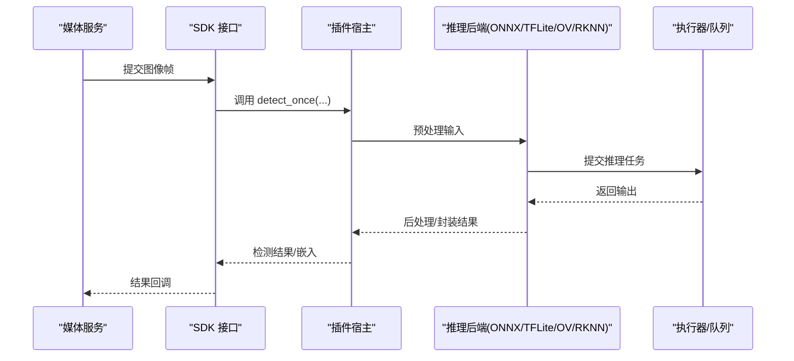
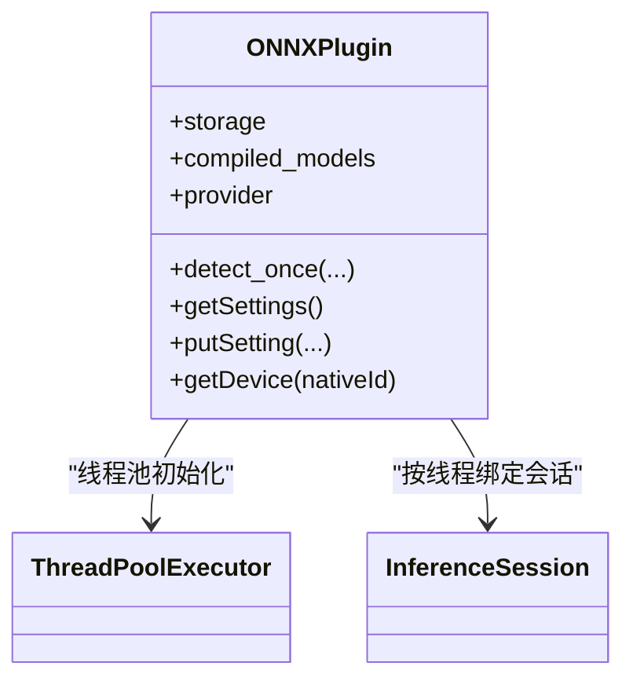
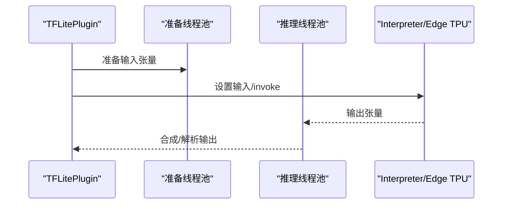
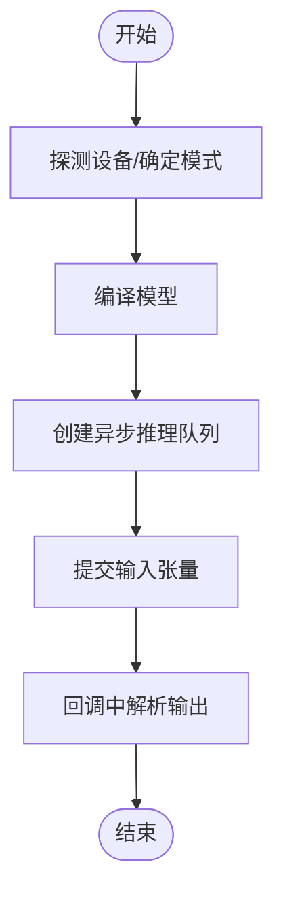
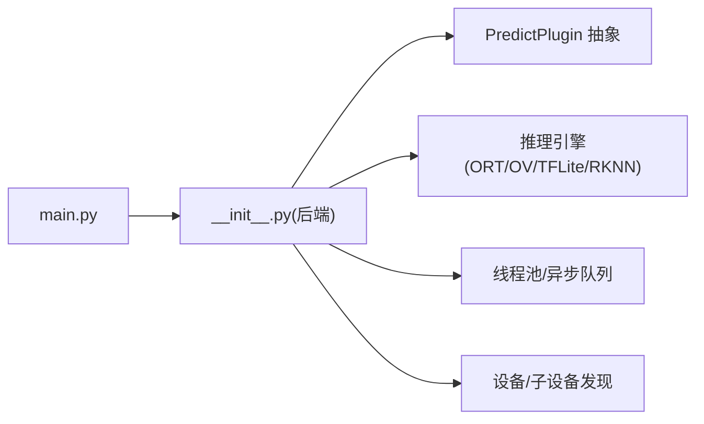

# 模型管理与优化

<cite>
**本文引用的文件**
- [plugins/onnx/src/main.py](file://plugins/onnx/src/main.py)
- [plugins/onnx/src/ort/__init__.py](file://plugins/onnx/src/ort/__init__.py)
- [plugins/tensorflow-lite/src/main.py](file://plugins/tensorflow-lite/src/main.py)
- [plugins/tensorflow-lite/src/tflite/__init__.py](file://plugins/tensorflow-lite/src/tflite/__init__.py)
- [plugins/openvino/src/main.py](file://plugins/openvino/src/main.py)
- [plugins/openvino/src/ov/__init__.py](file://plugins/openvino/src/ov/__init__.py)
- [plugins/rknn/src/main.py](file://plugins/rknn/src/main.py)
- [plugins/rknn/src/rknn/__init__.py](file://plugins/rknn/src/rknn/__init__.py)
- [common/src/ffmpeg-hardware-acceleration.ts](file://common/src/ffmpeg-hardware-acceleration.ts)
- [plugins/core/src/media-core.ts](file://plugins/core/src/media-core.ts)
- [plugins/core/src/api/media.ts](file://plugins/core/src/api/media.ts)
- [plugins/core/src/plugin-socket-service.ts](file://plugins/core/src/plugin-socket-service.ts)
- [server/src/services/media-service.ts](file://server/src/services/media-service.ts)
- [server/src/plugin/plugin-host.ts](file://server/src/plugin/plugin-host.ts)
- [server/src/plugin/plugin-process.ts](file://server/src/plugin/plugin-process.ts)
- [server/src/threading.ts](file://server/src/threading.ts)
- [server/src/runtime.ts](file://server/src/runtime.ts)
- [sdk/src/index.ts](file://sdk/src/index.ts)
</cite>

## 目录
1. [引言](#引言)
2. [项目结构](#项目结构)
3. [核心组件](#核心组件)
4. [架构总览](#架构总览)
5. [详细组件分析](#详细组件分析)
6. [依赖关系分析](#依赖关系分析)
7. [性能考量](#性能考量)
8. [故障排查指南](#故障排查指南)
9. [结论](#结论)
10. [附录](#附录)

## 引言
本文件面向 Scrypted 的 AI 模型管理与优化，系统性梳理模型生命周期（下载、版本控制、热更新）、模型优化（量化、剪枝、蒸馏）在仓库中的落地方式、内存与并发策略（模型缓存、线程池、异步队列、硬件加速）、性能监控与调优方法，以及运维最佳实践（版本迁移、回滚、故障恢复）。文档以仓库中已实现的 ONNX、TensorFlow Lite、OpenVINO、RKNN 等推理后端为依据，结合通用媒体处理与插件体系，给出可操作的建议与图示。

## 项目结构
Scrypted 将“模型推理”抽象为插件后端，不同框架（ONNX Runtime、TFLite、OpenVINO、RKNN）通过各自的 Python 插件接入统一的预测接口。模型下载与本地化、设备发现与设置、并发执行与回调、媒体输入预处理与结果封装，均在各插件实现中体现；服务器侧提供插件进程管理、RPC 通信、线程调度等基础设施。

```mermaid
graph TB
subgraph "服务器侧"
PH["插件进程管理<br/>plugin-process.ts"]
PS["插件宿主<br/>plugin-host.ts"]
RT["运行时/线程<br/>runtime.ts / threading.ts"]
MS["媒体服务<br/>media-service.ts"]
end
subgraph "SDK"
SDK["SDK 接口<br/>sdk/src/index.ts"]
end
subgraph "推理插件"
ONNX["ONNX 插件<br/>onnx/src/ort/__init__.py"]
TFL["TFLite 插件<br/>tensorflow-lite/src/tflite/__init__.py"]
OVI["OpenVINO 插件<br/>openvino/src/ov/__init__.py"]
RKNN["RKNN 插件<br/>rknn/src/rknn/__init__.py"]
end
SDK --> PH
PH --> PS
PS --> ONNX
PS --> TFL
PS --> OVI
PS --> RKNN
MS --> SDK
RT --> PH
```

图表来源
- [server/src/plugin/plugin-process.ts](file://server/src/plugin/plugin-process.ts)
- [server/src/plugin/plugin-host.ts](file://server/src/plugin/plugin-host.ts)
- [server/src/services/media-service.ts](file://server/src/services/media-service.ts)
- [sdk/src/index.ts](file://sdk/src/index.ts)
- [plugins/onnx/src/ort/__init__.py](file://plugins/onnx/src/ort/__init__.py)
- [plugins/tensorflow-lite/src/tflite/__init__.py](file://plugins/tensorflow-lite/src/tflite/__init__.py)
- [plugins/openvino/src/ov/__init__.py](file://plugins/openvino/src/ov/__init__.py)
- [plugins/rknn/src/rknn/__init__.py](file://plugins/rknn/src/rknn/__init__.py)

章节来源
- [plugins/onnx/src/main.py](file://plugins/onnx/src/main.py)
- [plugins/tensorflow-lite/src/main.py](file://plugins/tensorflow-lite/src/main.py)
- [plugins/openvino/src/main.py](file://plugins/openvino/src/main.py)
- [plugins/rknn/src/main.py](file://plugins/rknn/src/main.py)

## 核心组件
- ONNX 插件：基于 onnxruntime，支持多执行提供者（CPU/CUDA/CoreML），按线程绑定会话，动态选择模型与设备，提供检测、人脸、文本、CLIP 嵌入、分割等子设备。
- TensorFlow Lite 插件：优先使用 Coral Edge TPU，回退到 CPU Interpreter；支持多种 YOLO/Tiny 模型与标签映射，量化路径优化。
- OpenVINO 插件：自动探测设备（NPU/GPU/CPU），编译模型并使用异步推理队列；提供检测、人脸识别、文本识别、CLIP 嵌入、分割等子设备。
- RKNN 插件：提供 RKNN 推理能力入口（具体实现位于 __init__.py）。

章节来源
- [plugins/onnx/src/ort/__init__.py](file://plugins/onnx/src/ort/__init__.py)
- [plugins/tensorflow-lite/src/tflite/__init__.py](file://plugins/tensorflow-lite/src/tflite/__init__.py)
- [plugins/openvino/src/ov/__init__.py](file://plugins/openvino/src/ov/__init__.py)
- [plugins/rknn/src/rknn/__init__.py](file://plugins/rknn/src/rknn/__init__.py)

## 架构总览
推理流程从媒体服务接收输入帧，经 SDK 接口进入插件后端；后端进行预处理、并发执行、回调聚合，最终返回检测结果或嵌入向量。服务器侧负责插件生命周期、RPC 通信与线程调度。



图表来源
- [plugins/onnx/src/ort/__init__.py](file://plugins/onnx/src/ort/__init__.py)
- [plugins/tensorflow-lite/src/tflite/__init__.py](file://plugins/tensorflow-lite/src/tflite/__init__.py)
- [plugins/openvino/src/ov/__init__.py](file://plugins/openvino/src/ov/__init__.py)
- [server/src/services/media-service.ts](file://server/src/services/media-service.ts)
- [sdk/src/index.ts](file://sdk/src/index.ts)

## 详细组件分析

### ONNX 推理后端
- 模型下载与版本控制：通过存储项记录当前模型名，若默认或不在可用列表则回退至测试模型；模型文件本地化后加载 onnxruntime 会话。
- 执行提供者选择：根据平台与设备自动选择 CoreML（macOS）、CUDA（x86_64 AMD64 平台）、CPU；每个工作线程绑定一个会话实例。
- 并发与热更新：线程池初始化时将会话分配给线程名；设置变更触发重启以应用新配置。
- 子设备：人脸、文本、CLIP 嵌入、分割等内置子设备，按需发现。
- 输入格式：BCHW、尺寸与通道由模型输入形状决定。



图表来源
- [plugins/onnx/src/ort/__init__.py](file://plugins/onnx/src/ort/__init__.py)

章节来源
- [plugins/onnx/src/ort/__init__.py](file://plugins/onnx/src/ort/__init__.py)

### TensorFlow Lite 推理后端
- 设备探测：优先枚举 Edge TPU，失败则回退 CPU Interpreter；统计可用数量并初始化对应解释器。
- 模型与标签：根据模型类型下载对应标签文件；支持多种 YOLO/Tiny 模型与 PTQ/QAT 等量化路径。
- 并发执行：准备阶段与推理阶段分别使用独立线程池，YOLO 输出可能分拆通道以提升精度。
- 输入量化：针对 int8/int16 输入进行反量化与缩放，保证后处理一致性。



图表来源
- [plugins/tensorflow-lite/src/tflite/__init__.py](file://plugins/tensorflow-lite/src/tflite/__init__.py)

章节来源
- [plugins/tensorflow-lite/src/tflite/__init__.py](file://plugins/tensorflow-lite/src/tflite/__init__.py)

### OpenVINO 推理后端
- 设备探测与模式：自动探测 NPU/GPU/CPU，优先 NPU 或 dGPU；支持 AUTO 模式与显式模式；编译模型失败时回退 AUTO。
- 异步推理队列：使用 AsyncInferQueue 提交任务，回调中将输出数据转为对象检测结果。
- 子设备：人脸、文本、CLIP 嵌入、分割等子设备按需发现。
- 输入格式：BCHW，尺寸由模型输入决定。



图表来源
- [plugins/openvino/src/ov/__init__.py](file://plugins/openvino/src/ov/__init__.py)

章节来源
- [plugins/openvino/src/ov/__init__.py](file://plugins/openvino/src/ov/__init__.py)

### RKNN 推理后端
- 入口类：提供 RKNNPlugin 类作为推理后端入口，具体实现位于 __init__.py。
- 应用场景：适用于特定硬件加速器（如瑞芯明微 NPU）的模型部署。

章节来源
- [plugins/rknn/src/rknn/__init__.py](file://plugins/rknn/src/rknn/__init__.py)

## 依赖关系分析
- 插件入口：各后端通过 main.py 导出 create_scrypted_plugin/fork，供服务器侧加载。
- SDK 与媒体：媒体服务通过 SDK 接口调用后端；后端实现 PredictPlugin 抽象，统一 detect_once 流程。
- 线程与并发：后端普遍采用线程池/异步队列隔离预处理与推理，避免阻塞主线程。
- 硬件加速：ONNX 使用 CUDA/CoreML；OpenVINO 自动选择 NPU/GPU/CPU；TFLite 使用 Edge TPU。



图表来源
- [plugins/onnx/src/main.py](file://plugins/onnx/src/main.py)
- [plugins/onnx/src/ort/__init__.py](file://plugins/onnx/src/ort/__init__.py)
- [plugins/tensorflow-lite/src/main.py](file://plugins/tensorflow-lite/src/main.py)
- [plugins/tensorflow-lite/src/tflite/__init__.py](file://plugins/tensorflow-lite/src/tflite/__init__.py)
- [plugins/openvino/src/main.py](file://plugins/openvino/src/main.py)
- [plugins/openvino/src/ov/__init__.py](file://plugins/openvino/src/ov/__init__.py)
- [plugins/rknn/src/main.py](file://plugins/rknn/src/main.py)
- [plugins/rknn/src/rknn/__init__.py](file://plugins/rknn/src/rknn/__init__.py)

章节来源
- [plugins/onnx/src/main.py](file://plugins/onnx/src/main.py)
- [plugins/tensorflow-lite/src/main.py](file://plugins/tensorflow-lite/src/main.py)
- [plugins/openvino/src/main.py](file://plugins/openvino/src/main.py)
- [plugins/rknn/src/main.py](file://plugins/rknn/src/main.py)

## 性能考量
- 模型下载与本地化
  - 通过存储项记录模型版本，确保可重复构建与回滚；默认模型与可用列表不匹配时自动回退，避免加载失败。
  - 章节来源
    - [plugins/onnx/src/ort/__init__.py](file://plugins/onnx/src/ort/__init__.py)
    - [plugins/tensorflow-lite/src/tflite/__init__.py](file://plugins/tensorflow-lite/src/tflite/__init__.py)
    - [plugins/openvino/src/ov/__init__.py](file://plugins/openvino/src/ov/__init__.py)

- 并发与线程隔离
  - ONNX：每个线程绑定一个 InferenceSession，避免跨线程共享状态；准备与推理分别在线程池执行。
  - OpenVINO：AsyncInferQueue 异步提交，回调中解析输出，降低等待时间。
  - TFLite：准备/推理双线程池，YOLO 分离输出路径优化精度与性能。
  - 章节来源
    - [plugins/onnx/src/ort/__init__.py](file://plugins/onnx/src/ort/__init__.py)
    - [plugins/openvino/src/ov/__init__.py](file://plugins/openvino/src/ov/__init__.py)
    - [plugins/tensorflow-lite/src/tflite/__init__.py](file://plugins/tensorflow-lite/src/tflite/__init__.py)

- 硬件加速
  - ONNX：CUDA/CoreML 提供 GPU/CPU 加速；CoreML 在 macOS 上表现优异。
  - OpenVINO：NPU 优先于 dGPU；AUTO 模式自动平衡设备；失败时回退 AUTO。
  - TFLite：Edge TPU 显著提升吞吐；无设备时回退 CPU。
  - 章节来源
    - [plugins/onnx/src/ort/__init__.py](file://plugins/onnx/src/ort/__init__.py)
    - [plugins/openvino/src/ov/__init__.py](file://plugins/openvino/src/ov/__init__.py)
    - [plugins/tensorflow-lite/src/tflite/__init__.py](file://plugins/tensorflow-lite/src/tflite/__init__.py)

- 内存与缓存
  - ONNX：按线程缓存会话，减少重复初始化开销；模型文件本地化，避免频繁网络拉取。
  - OpenVINO：编译模型后复用；AsyncInferQueue 复用上下文。
  - TFLite：Interpreter 分配张量一次，多次推理复用。
  - 章节来源
    - [plugins/onnx/src/ort/__init__.py](file://plugins/onnx/src/ort/__init__.py)
    - [plugins/openvino/src/ov/__init__.py](file://plugins/openvino/src/ov/__init__.py)
    - [plugins/tensorflow-lite/src/tflite/__init__.py](file://plugins/tensorflow-lite/src/tflite/__init__.py)

- 输入预处理与后处理
  - 统一将图像转换为 BCHW、归一化、连续内存布局；YOLO 输出按模型类型与量化参数进行解码与阈值处理。
  - 章节来源
    - [plugins/onnx/src/ort/__init__.py](file://plugins/onnx/src/ort/__init__.py)
    - [plugins/openvino/src/ov/__init__.py](file://plugins/openvino/src/ov/__init__.py)
    - [plugins/tensorflow-lite/src/tflite/__init__.py](file://plugins/tensorflow-lite/src/tflite/__init__.py)

- 监控与调优
  - 执行设备显示（ONNX）、设备列表与模式（OpenVINO）便于诊断；异常时打印堆栈并请求重启，保障稳定性。
  - 章节来源
    - [plugins/onnx/src/ort/__init__.py](file://plugins/onnx/src/ort/__init__.py)
    - [plugins/openvino/src/ov/__init__.py](file://plugins/openvino/src/ov/__init__.py)

## 故障排查指南
- 模型加载失败
  - 现象：编译/初始化抛错，设置被重置并请求重启。
  - 处理：检查模型文件完整性、设备驱动、执行提供者可用性；必要时切换到 CPU 模式。
  - 章节来源
    - [plugins/onnx/src/ort/__init__.py](file://plugins/onnx/src/ort/__init__.py)
    - [plugins/openvino/src/ov/__init__.py](file://plugins/openvino/src/ov/__init__.py)

- 设备不可用
  - 现象：Edge TPU 未发现、GPU 驱动不稳定导致崩溃。
  - 处理：回退到 CPU；OpenVINO 强制使用 CPU 模式；确认硬件与驱动版本。
  - 章节来源
    - [plugins/tensorflow-lite/src/tflite/__init__.py](file://plugins/tensorflow-lite/src/tflite/__init__.py)
    - [plugins/openvino/src/ov/__init__.py](file://plugins/openvino/src/ov/__init__.py)

- 推理卡顿或延迟高
  - 现象：单线程推理瓶颈、CPU 占用过高。
  - 处理：启用多线程/异步队列；选择合适硬件加速；检查输入尺寸与量化路径。
  - 章节来源
    - [plugins/onnx/src/ort/__init__.py](file://plugins/onnx/src/ort/__init__.py)
    - [plugins/openvino/src/ov/__init__.py](file://plugins/openvino/src/ov/__init__.py)
    - [plugins/tensorflow-lite/src/tflite/__init__.py](file://plugins/tensorflow-lite/src/tflite/__init__.py)

- 回滚与版本迁移
  - 建议：通过设置项切换模型版本；若新版本不稳定，回退到上一个已知稳定版本；保留历史模型目录以便快速回滚。
  - 章节来源
    - [plugins/onnx/src/ort/__init__.py](file://plugins/onnx/src/ort/__init__.py)
    - [plugins/tensorflow-lite/src/tflite/__init__.py](file://plugins/tensorflow-lite/src/tflite/__init__.py)
    - [plugins/openvino/src/ov/__init__.py](file://plugins/openvino/src/ov/__init__.py)

## 结论
Scrypted 的模型管理与优化围绕“插件化推理后端 + 服务器侧基础设施”的架构展开。ONNX、OpenVINO、TFLite、RKNN 各有侧重：前者强调跨平台与多提供者，后者强调设备自适应与异步队列，前者强调 Edge TPU 加速，后者强调模型转换与编译。结合线程池/异步队列、本地化模型、硬件加速与输入输出管线优化，可在不同硬件与场景下获得稳定且高性能的推理体验。运维层面，建议以设置项为入口进行版本控制与热更新，并建立回滚与故障恢复机制。

## 附录
- 媒体与硬件加速
  - FFmpeg 硬件加速辅助工具可用于视频解码/编码加速，配合推理后端形成端到端优化链路。
  - 章节来源
    - [common/src/ffmpeg-hardware-acceleration.ts](file://common/src/ffmpeg-hardware-acceleration.ts)

- 插件通信与线程
  - 插件进程/宿主、RPC 通信、线程调度由服务器侧统一管理，确保后端与媒体服务解耦。
  - 章节来源
    - [server/src/plugin/plugin-process.ts](file://server/src/plugin/plugin-process.ts)
    - [server/src/plugin/plugin-host.ts](file://server/src/plugin/plugin-host.ts)
    - [server/src/threading.ts](file://server/src/threading.ts)
    - [server/src/runtime.ts](file://server/src/runtime.ts)

- SDK 接口
  - SDK 定义了统一的设备接口与设置项，后端通过 PredictPlugin 实现 detect_once 等能力。
  - 章节来源
    - [sdk/src/index.ts](file://sdk/src/index.ts)