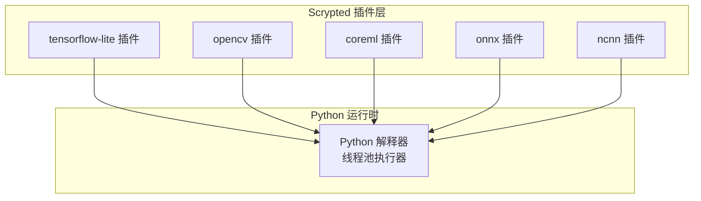
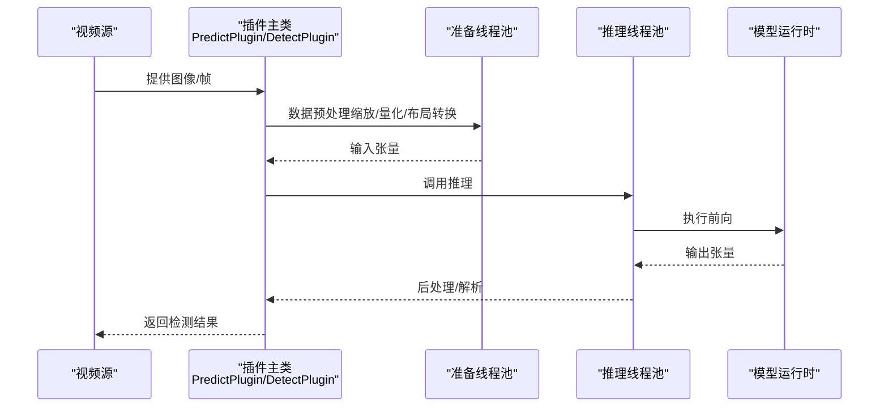
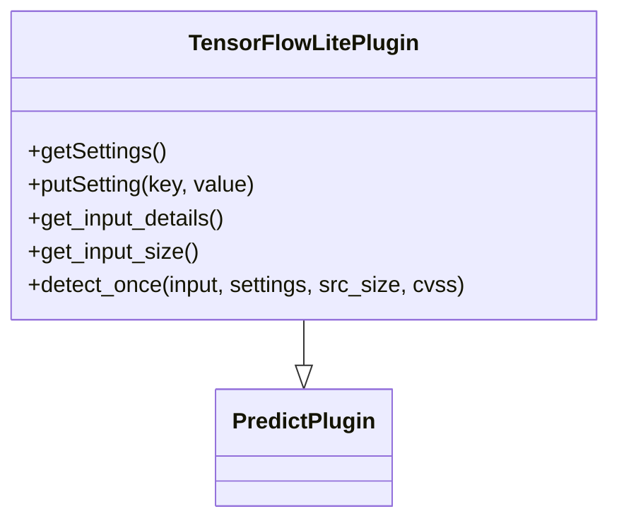
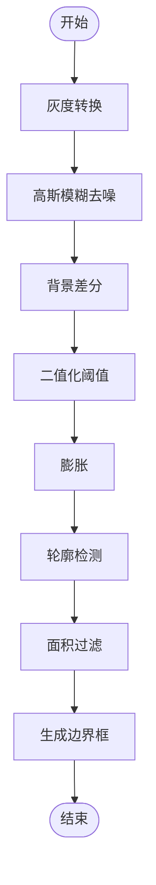
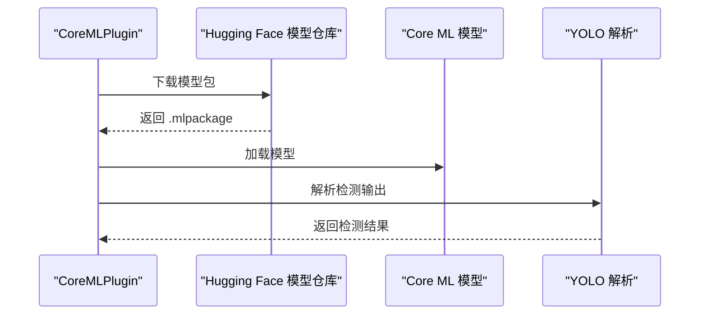
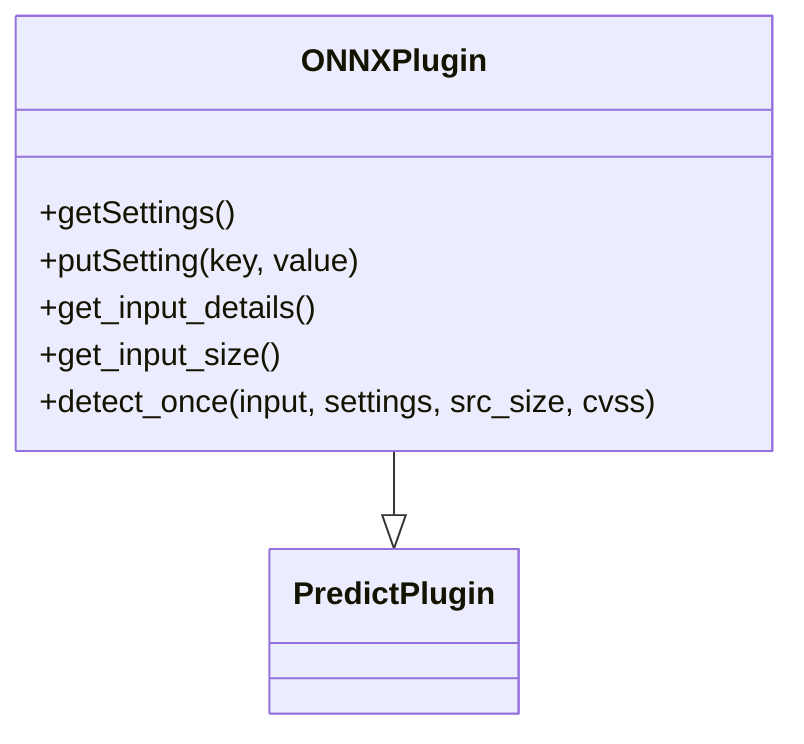
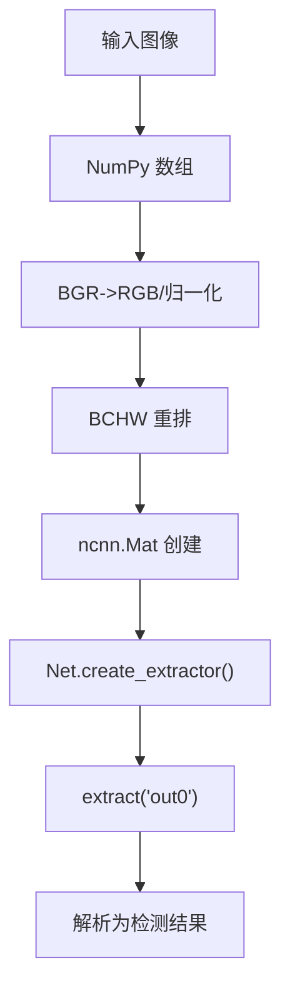

# 深度学习框架集成

<cite>
**本文引用的文件**
- [plugins/tensorflow-lite/src/main.py](file://plugins/tensorflow-lite/src/main.py)
- [plugins/tensorflow-lite/src/tflite/__init__.py](file://plugins/tensorflow-lite/src/tflite/__init__.py)
- [plugins/opencv/src/main.py](file://plugins/opencv/src/main.py)
- [plugins/opencv/src/opencv/__init__.py](file://plugins/opencv/src/opencv/__init__.py)
- [plugins/coreml/src/main.py](file://plugins/coreml/src/main.py)
- [plugins/coreml/src/coreml/__init__.py](file://plugins/coreml/src/coreml/__init__.py)
- [plugins/onnx/src/main.py](file://plugins/onnx/src/main.py)
- [plugins/onnx/src/ort/__init__.py](file://plugins/onnx/src/ort/__init__.py)
- [plugins/ncnn/src/main.py](file://plugins/ncnn/src/main.py)
- [plugins/ncnn/src/nc/__init__.py](file://plugins/ncnn/src/nc/__init__.py)
</cite>

## 目录
1. [简介](#简介)
2. [项目结构](#项目结构)
3. [核心组件](#核心组件)
4. [架构总览](#架构总览)
5. [详细组件分析](#详细组件分析)
6. [依赖分析](#依赖分析)
7. [性能考量](#性能考量)
8. [故障排查指南](#故障排查指南)
9. [结论](#结论)
10. [附录](#附录)

## 简介
本文件面向 Scrypted 的深度学习框架集成，系统梳理并解读以下框架在 Scrypted 中的实现方式与使用要点：TensorFlow Lite、OpenCV（运动检测）、Core ML、ONNX Runtime、NCNN。内容涵盖：
- 各框架特点、适用场景与性能表现
- Python 环境配置与依赖管理（通过各插件 requirements）
- 模型加载、推理优化、线程池与内存管理策略
- 典型使用示例（模型转换、批量推理、实时处理）
- 框架选型决策因素与性能对比建议

## 项目结构
Scrypted 将每个深度学习框架封装为独立插件，采用统一的插件入口与预测基类，确保一致的设备发现、设置与推理接口。

图表来源
- [plugins/tensorflow-lite/src/main.py:1-9](file://plugins/tensorflow-lite/src/main.py#L1-L9)
- [plugins/opencv/src/main.py:1-5](file://plugins/opencv/src/main.py#L1-L5)
- [plugins/coreml/src/main.py:1-9](file://plugins/coreml/src/main.py#L1-L9)
- [plugins/onnx/src/main.py:1-9](file://plugins/onnx/src/main.py#L1-L9)
- [plugins/ncnn/src/main.py:1-9](file://plugins/ncnn/src/main.py#L1-L9)

章节来源
- [plugins/tensorflow-lite/src/main.py:1-9](file://plugins/tensorflow-lite/src/main.py#L1-L9)
- [plugins/opencv/src/main.py:1-5](file://plugins/opencv/src/main.py#L1-L5)
- [plugins/coreml/src/main.py:1-9](file://plugins/coreml/src/main.py#L1-L9)
- [plugins/onnx/src/main.py:1-9](file://plugins/onnx/src/main.py#L1-L9)
- [plugins/ncnn/src/main.py:1-9](file://plugins/ncnn/src/main.py#L1-L9)

## 核心组件
- 统一入口函数：各插件均提供 create_scrypted_plugin 工厂函数，返回对应 Plugin 实例；部分插件还提供 fork 支持以启用多进程/多线程推理。
- 预测基类：各框架插件继承 PredictPlugin 或 DetectPlugin，复用通用的设备发现、设置持久化、检测结果封装等能力。
- 线程池与并发：通过 ThreadPoolExecutor 将模型推理与数据准备解耦到不同线程，避免阻塞事件循环。
- 设备发现与子设备：部分插件动态注册人脸识别、文本识别、CLIP 嵌入、分割等子设备，支持按需扩展。

章节来源
- [plugins/tensorflow-lite/src/main.py:4-8](file://plugins/tensorflow-lite/src/main.py#L4-L8)
- [plugins/opencv/src/main.py:3-4](file://plugins/opencv/src/main.py#L3-L4)
- [plugins/coreml/src/main.py:4-8](file://plugins/coreml/src/main.py#L4-L8)
- [plugins/onnx/src/main.py:4-8](file://plugins/onnx/src/main.py#L4-L8)
- [plugins/ncnn/src/main.py:4-8](file://plugins/ncnn/src/main.py#L4-L8)

## 架构总览
下图展示从视频帧输入到检测结果输出的关键流程，以及各框架在推理阶段的差异点（如是否使用硬件加速、是否需要量化适配）。

图表来源
- [plugins/tensorflow-lite/src/tflite/__init__.py:227-325](file://plugins/tensorflow-lite/src/tflite/__init__.py#L227-L325)
- [plugins/opencv/src/opencv/__init__.py:112-168](file://plugins/opencv/src/opencv/__init__.py#L112-L168)
- [plugins/coreml/src/coreml/__init__.py:217-228](file://plugins/coreml/src/coreml/__init__.py#L217-L228)
- [plugins/onnx/src/ort/__init__.py:287-319](file://plugins/onnx/src/ort/__init__.py#L287-L319)
- [plugins/ncnn/src/nc/__init__.py:230-266](file://plugins/ncnn/src/nc/__init__.py#L230-L266)

## 详细组件分析

### TensorFlow Lite 插件
- 特点与适用场景
  - 支持 Coral Edge TPU 自动发现与加速；若不可用则回退至 CPU Interpreter。
  - 内置多种 YOLO 系列模型，覆盖不同精度与速度权衡。
  - 对量化输入进行快速路径优化，减少浮点运算开销。
- 关键实现要点
  - 多解释器初始化：根据可用 TPU 数量创建多个 tflite.Interpreter，并绑定到线程池工作线程。
  - 输入尺寸与通道：从输入细节中提取宽高通道，统一为 (w,h,c)。
  - 推理流程：prepare -> predict -> post_process 分离，分别在不同线程池执行。
  - 标签解析：支持 scrypted 自定义标签与 COCO 类别。
- 使用示例
  - 模型选择：在设置中切换模型，重启后生效。
  - 实时检测：detect_once 在单帧上完成预处理、推理与后处理。
  - 批量处理：可基于线程池扩展批量推理（参考其他插件的批量模式）。

图表来源
- [plugins/tensorflow-lite/src/tflite/__init__.py:71-325](file://plugins/tensorflow-lite/src/tflite/__init__.py#L71-L325)

章节来源
- [plugins/tensorflow-lite/src/tflite/__init__.py:71-325](file://plugins/tensorflow-lite/src/tflite/__init__.py#L71-L325)

### OpenCV 插件（运动检测）
- 特点与适用场景
  - 基于背景差分法的轻量级运动检测，适合边缘设备或对实时性要求高的场景。
  - 参数化阈值、面积与模糊半径，便于调参优化误报与漏报。
- 关键实现要点
  - 输入格式：强制灰度输入，降低计算与内存占用。
  - 输入尺寸：与 TensorFlow Lite 保持一致的输入大小，便于流水线复用。
  - 推理流程：generateObjectDetections 生成会话，逐帧检测并返回边界框列表。
- 使用示例
  - 参数调节：通过设置调整面积阈值、像素变化阈值与模糊半径。
  - 图像检测：run_detection_image 将视频帧转灰度并进行运动区域提取。

图表来源
- [plugins/opencv/src/opencv/__init__.py:112-168](file://plugins/opencv/src/opencv/__init__.py#L112-L168)

章节来源
- [plugins/opencv/src/opencv/__init__.py:43-262](file://plugins/opencv/src/opencv/__init__.py#L43-L262)

### Core ML 插件
- 特点与适用场景
  - 面向 Apple 平台的原生加速，支持 macOS 上的 Metal 性能提升。
  - 动态注册人脸识别、文本识别、CLIP 嵌入与分割等子设备。
- 关键实现要点
  - 模型下载与本地缓存：通过 Hugging Face 模型仓库下载 mlpackage。
  - 输入维度：从模型 spec 中读取输入尺寸与名称。
  - 推理：使用 MLModel.predict，YOLO 结果解析由通用模块完成。
- 使用示例
  - 子设备发现：首次启动时注册内置功能设备，后续可直接使用。
  - 设置切换：在设置中更换模型，触发重启以应用新模型。

图表来源
- [plugins/coreml/src/coreml/__init__.py:94-106](file://plugins/coreml/src/coreml/__init__.py#L94-L106)
- [plugins/coreml/src/coreml/__init__.py:223-228](file://plugins/coreml/src/coreml/__init__.py#L223-L228)

章节来源
- [plugins/coreml/src/coreml/__init__.py:71-229](file://plugins/coreml/src/coreml/__init__.py#L71-L229)

### ONNX Runtime 插件
- 特点与适用场景
  - 跨平台执行提供者（CPU/CUDA/CoreML），自动选择最优后端。
  - 支持多 GPU 设备 ID 绑定，便于多卡并行。
- 关键实现要点
  - 执行提供者优先级：macOS 优先 CoreML，x86_64 平台优先 CUDA，最后回退 CPU。
  - 输入布局：BCHW，float32，[0..1] 归一化。
  - 推理：prepare -> run -> parse 流水线，支持 YOLOv9/v10/NAS 等变体。
- 使用示例
  - 多 GPU：在设置中勾选多个设备 ID，实现多卡推理。
  - 模型切换：更换模型后请求重启以重新编译会话。

图表来源
- [plugins/onnx/src/ort/__init__.py:55-319](file://plugins/onnx/src/ort/__init__.py#L55-L319)

章节来源
- [plugins/onnx/src/ort/__init__.py:55-320](file://plugins/onnx/src/ort/__init__.py#L55-L320)

### NCNN 插件
- 特点与适用场景
  - 轻量高效的移动端推理引擎，支持 Vulkan 加速。
  - 适用于资源受限设备上的目标检测任务。
- 关键实现要点
  - 模型加载：param/bin 文件分离，启用 Vulkan 计算。
  - 输入尺寸：固定 320x320，必要时进行 reshape/squeeze。
  - 推理：prepare -> ncnn.Mat -> extract -> parse 流水线。
- 使用示例
  - 子设备：动态注册人脸、文本与分割子设备。
  - 模型切换：通过设置更换模型，重启后生效。

图表来源
- [plugins/ncnn/src/nc/__init__.py:230-266](file://plugins/ncnn/src/nc/__init__.py#L230-L266)

章节来源
- [plugins/ncnn/src/nc/__init__.py:79-268](file://plugins/ncnn/src/nc/__init__.py#L79-L268)

## 依赖分析
- 统一依赖管理
  - 各插件通过各自 requirements.txt 管理 Python 依赖，遵循“插件内聚、依赖隔离”的原则。
  - 依赖安装通常在打包或运行时由 Scrypted 的 Python 管理机制完成。
- 模型来源
  - TensorFlow Lite：GitHub 仓库托管的 .tflite 模型。
  - Core ML/ONNX/NCNN：Hugging Face 模型仓库，提供 .mlpackage/.onnx/best_converted.* 等文件。
- 执行提供者与硬件加速
  - TensorFlow Lite：Coral Edge TPU 优先，否则 CPU。
  - ONNX Runtime：CoreML（macOS）、CUDA（x86_64）、CPU 回退。
  - NCNN：Vulkan 开启，移动端友好。
  - OpenCV：纯 CPU，参数可调。

章节来源
- [plugins/tensorflow-lite/src/tflite/__init__.py:136-180](file://plugins/tensorflow-lite/src/tflite/__init__.py#L136-L180)
- [plugins/coreml/src/coreml/__init__.py:94-97](file://plugins/coreml/src/coreml/__init__.py#L94-L97)
- [plugins/onnx/src/ort/__init__.py:95-131](file://plugins/onnx/src/ort/__init__.py#L95-L131)
- [plugins/ncnn/src/nc/__init__.py:106-113](file://plugins/ncnn/src/nc/__init__.py#L106-L113)

## 性能考量
- 线程池与并发
  - 将“准备输入”和“执行推理”拆分到不同线程池，避免阻塞事件循环，提高吞吐。
  - TensorFlow Lite/ONNX/NCNN 为每个工作线程绑定一个模型实例，减少锁竞争。
- 内存与数据布局
  - 统一输入布局（如 BCHW）与数据类型（float32/[0..1]），减少重复转换。
  - TensorFlow Lite 对量化输入提供快速路径，避免不必要的浮点运算。
- 硬件加速
  - Edge TPU/CoreML/CUDA/Vulkan 可显著降低延迟，应优先启用。
  - 多 GPU/多卡：ONNX Runtime 支持多设备 ID，按需扩展。
- 实时性与批处理
  - OpenCV 运动检测适合低延迟场景；深度学习检测更适合准确率优先的场景。
  - 批处理可通过线程池扩展，但需注意内存峰值与队列长度。

## 故障排查指南
- 模型加载失败
  - 检查模型文件是否存在且完整（Hugging Face 下载、本地缓存）。
  - ONNX 插件在初始化异常时会回滚设置并请求重启，确认日志输出。
- 设备不可用
  - TensorFlow Lite：Edge TPU 未被识别时会回退 CPU；检查驱动与权限。
  - ONNX Runtime：确认执行提供者顺序与可用性（CoreML/CUDA/CPU）。
- 推理错误
  - 检查输入尺寸与数据类型是否符合模型要求（BCHW、float32、[0..1]）。
  - OpenCV：确保输入为灰度格式，必要时进行灰度转换。
- 设置不生效
  - 更换模型或设备 ID 后需重启插件以重新编译会话或加载模型。

章节来源
- [plugins/onnx/src/ort/__init__.py:123-131](file://plugins/onnx/src/ort/__init__.py#L123-L131)
- [plugins/tensorflow-lite/src/tflite/__init__.py:168-170](file://plugins/tensorflow-lite/src/tflite/__init__.py#L168-L170)
- [plugins/opencv/src/opencv/__init__.py:26-40](file://plugins/opencv/src/opencv/__init__.py#L26-L40)

## 结论
- 选型建议
  - Apple 生态优先 Core ML；Windows/Linux/x86_64 且有 NVIDIA 显卡优先 ONNX Runtime+CUDA；移动端或资源受限设备优先 NCNN；通用跨平台且需要 TPU 的场景优先 TensorFlow Lite。
- 最佳实践
  - 使用统一的线程池拆分准备与推理；启用硬件加速；统一输入布局与数据类型；合理设置模型与参数以平衡准确率与延迟。
- 扩展方向
  - 可在现有框架基础上增加更多子设备（如 OCR、姿态估计）与模型变体，完善批处理与流式推理能力。

## 附录
- 常见使用场景
  - 模型转换：将训练好的模型转换为对应格式（.tflite/.mlpackage/.onnx/best_converted.*），并上传至模型仓库。
  - 批量推理：基于线程池扩展批量输入，减少上下文切换开销。
  - 实时处理：OpenCV 运动检测适合低延迟场景；深度学习检测适合高准确率场景。
- 框架对比摘要
  - TensorFlow Lite：易部署、TPU 加速、量化友好。
  - OpenCV：轻量、参数可调、CPU 友好。
  - Core ML：Apple 原生、Metal 加速、生态完善。
  - ONNX Runtime：跨平台、多后端、多 GPU 支持。
  - NCNN：移动端高效、Vulkan 加速、模型小。