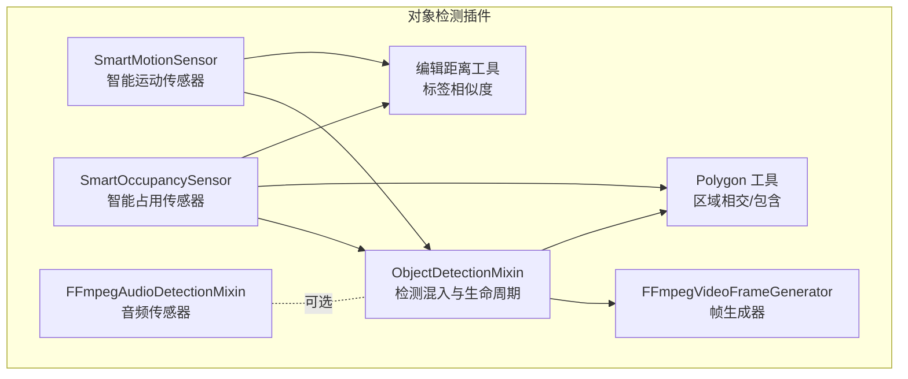
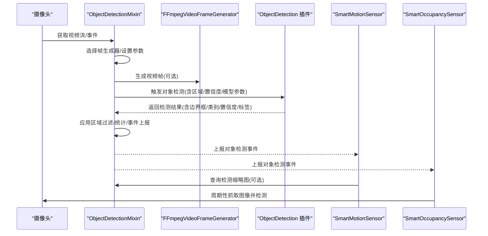
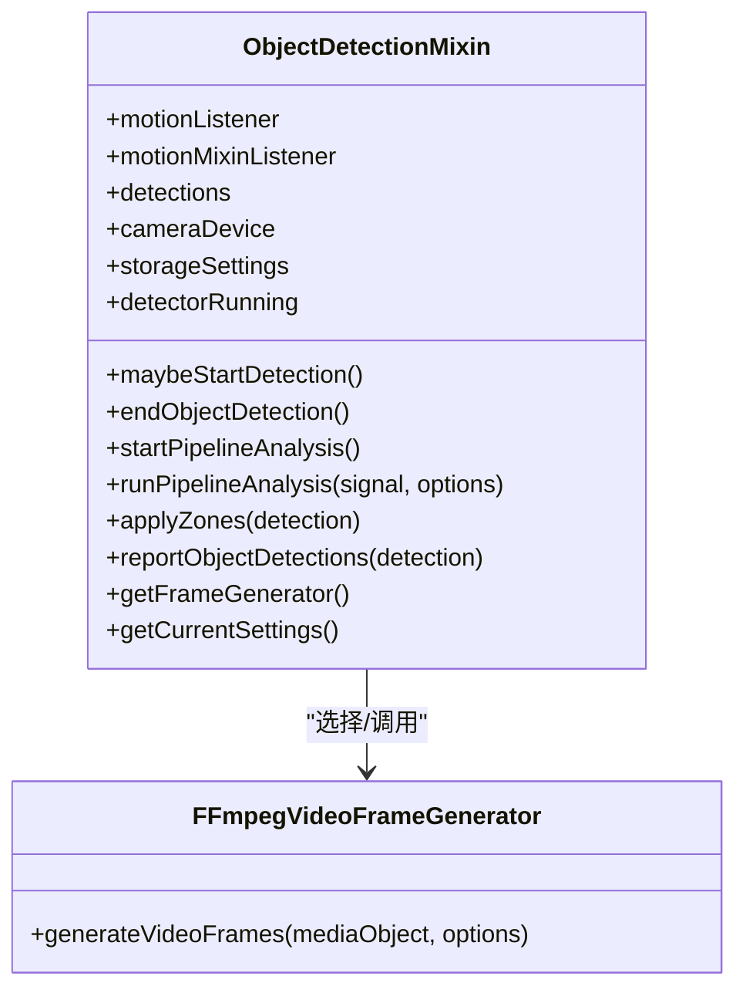
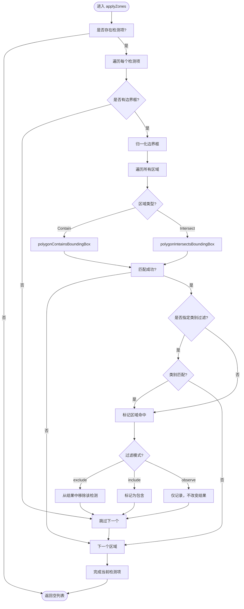
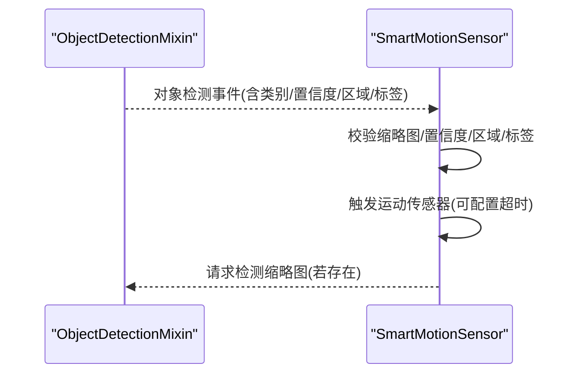
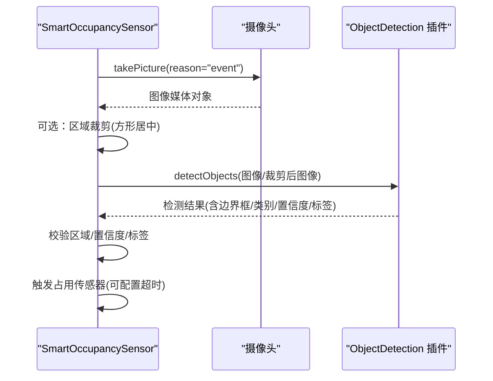
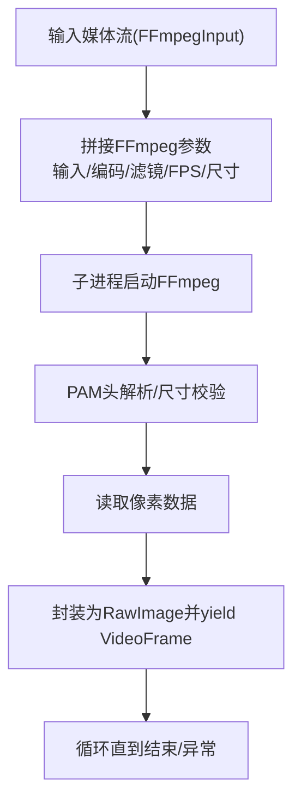
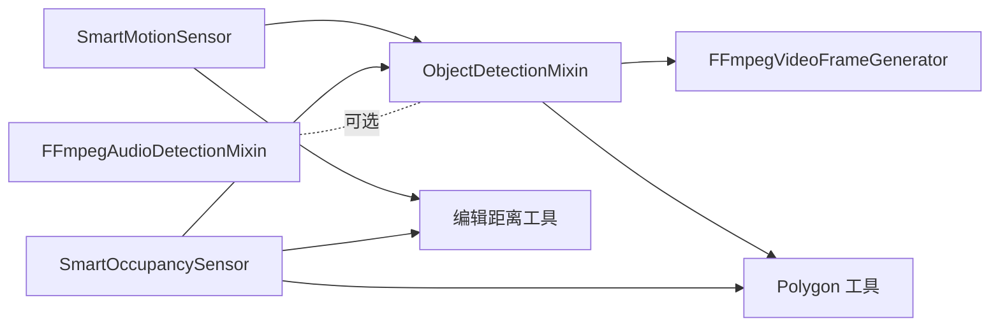

# 计算机视觉插件

<cite>
**本文引用的文件**
- [plugins/objectdetector/src/main.ts](file://plugins/objectdetector/src/main.ts)
- [plugins/objectdetector/src/smart-motionsensor.ts](file://plugins/objectdetector/src/smart-motionsensor.ts)
- [plugins/objectdetector/src/smart-occupancy-sensor.ts](file://plugins/objectdetector/src/smart-occupancy-sensor.ts)
- [plugins/objectdetector/src/polygon.ts](file://plugins/objectdetector/src/polygon.ts)
- [plugins/objectdetector/src/ffmpeg-videoframes.ts](file://plugins/objectdetector/src/ffmpeg-videoframes.ts)
- [plugins/objectdetector/src/ffmpeg-audiosensor.ts](file://plugins/objectdetector/src/ffmpeg-audiosensor.ts)
- [plugins/objectdetector/src/edit-distance.ts](file://plugins/objectdetector/src/edit-distance.ts)
- [plugins/objectdetector/README.md](file://plugins/objectdetector/README.md)
- [plugins/objectdetector/package.json](file://plugins/objectdetector/package.json)
</cite>

## 目录
1. [简介](#简介)
2. [项目结构](#项目结构)
3. [核心组件](#核心组件)
4. [架构总览](#架构总览)
5. [组件详解](#组件详解)
6. [依赖关系分析](#依赖关系分析)
7. [性能与优化](#性能与优化)
8. [故障排查指南](#故障排查指南)
9. [结论](#结论)
10. [附录：开发示例与最佳实践](#附录开发示例与最佳实践)

## 简介
本文件面向 Scrypted 计算机视觉插件开发者，系统性解析目标检测、人脸识别、图像分割等算法在 Scrypted 中的实现与集成方式。重点围绕 ObjectDetectionMixin 的设计与运行机制，涵盖检测管道构建、帧生成器选择、检测结果处理与过滤、智能传感器（智能运动传感器、智能占用传感器）工作原理，以及多边形区域检测、检测框处理与过滤模式等核心能力。同时提供完整的开发示例、性能优化策略与调试技巧。

## 项目结构
该插件位于 plugins/objectdetector，主要由以下模块组成：
- 主入口与混入逻辑：ObjectDetectionMixin 负责将对象检测能力注入到任意摄像头设备，并管理检测生命周期、帧生成、结果过滤与事件上报。
- 智能传感器：SmartMotionSensor 与 SmartOccupancySensor 将检测结果转化为可被自动化使用的运动/占用传感器。
- 几何工具：polygon 提供多边形与检测框的相交/包含判断，支持区域过滤。
- 帧生成器：ffmpeg-videoframes 提供基于 FFmpeg 的视频帧生成器，用于将媒体流转换为逐帧图像序列。
- 音频传感器：ffmpeg-audiosensor 提供音频阈值触发能力，作为补充传感器。
- 编辑距离：edit-distance 提供标签相似度匹配能力，用于智能传感器的标签识别。

**图表来源**
- [plugins/objectdetector/src/main.ts:50-159](file://plugins/objectdetector/src/main.ts#L50-L159)
- [plugins/objectdetector/src/smart-motionsensor.ts:8-133](file://plugins/objectdetector/src/smart-motionsensor.ts#L8-L133)
- [plugins/objectdetector/src/smart-occupancy-sensor.ts:11-121](file://plugins/objectdetector/src/smart-occupancy-sensor.ts#L11-L121)
- [plugins/objectdetector/src/polygon.ts:57-92](file://plugins/objectdetector/src/polygon.ts#L57-L92)
- [plugins/objectdetector/src/ffmpeg-videoframes.ts:52-175](file://plugins/objectdetector/src/ffmpeg-videoframes.ts#L52-L175)
- [plugins/objectdetector/src/ffmpeg-audiosensor.ts:28-148](file://plugins/objectdetector/src/ffmpeg-audiosensor.ts#L28-L148)
- [plugins/objectdetector/src/edit-distance.ts:35-75](file://plugins/objectdetector/src/edit-distance.ts#L35-L75)

**章节来源**
- [plugins/objectdetector/README.md:1-20](file://plugins/objectdetector/README.md#L1-L20)
- [plugins/objectdetector/package.json:1-55](file://plugins/objectdetector/package.json#L1-L55)

## 核心组件
- ObjectDetectionMixin：将对象检测能力注入到摄像头设备，负责启动/停止检测会话、选择帧生成器、执行检测、应用区域过滤、聚合统计与事件上报。
- SmartMotionSensor：将特定类别的检测结果映射为运动传感器事件，支持最小置信度、区域过滤、标签匹配与缩略图要求。
- SmartOccupancySensor：周期性抓取图像进行检测，支持区域裁剪、最小置信度、标签匹配与占用超时。
- Polygon 工具：提供多边形与检测框的相交/包含判断，支持归一化坐标与历史路径兼容修复。
- FFmpegVideoFrameGenerator：将媒体流转换为逐帧 RGB/灰度图像，支持 FPS 控制与尺寸调整。
- FFmpegAudioDetectionMixin：通过 RTP 接收 PCM 数据，计算 RMS 并转为分贝阈值触发音频传感器。
- 编辑距离工具：Levenshtein 距离，支持字符相似度映射，用于标签模糊匹配。

**章节来源**
- [plugins/objectdetector/src/main.ts:50-159](file://plugins/objectdetector/src/main.ts#L50-L159)
- [plugins/objectdetector/src/smart-motionsensor.ts:8-133](file://plugins/objectdetector/src/smart-motionsensor.ts#L8-L133)
- [plugins/objectdetector/src/smart-occupancy-sensor.ts:11-121](file://plugins/objectdetector/src/smart-occupancy-sensor.ts#L11-L121)
- [plugins/objectdetector/src/polygon.ts:57-92](file://plugins/objectdetector/src/polygon.ts#L57-L92)
- [plugins/objectdetector/src/ffmpeg-videoframes.ts:52-175](file://plugins/objectdetector/src/ffmpeg-videoframes.ts#L52-L175)
- [plugins/objectdetector/src/ffmpeg-audiosensor.ts:28-148](file://plugins/objectdetector/src/ffmpeg-audiosensor.ts#L28-L148)
- [plugins/objectdetector/src/edit-distance.ts:35-75](file://plugins/objectdetector/src/edit-distance.ts#L35-L75)

## 架构总览
下图展示了从摄像头输入到检测结果输出的整体流程，以及智能传感器如何消费这些结果。

**图表来源**
- [plugins/objectdetector/src/main.ts:345-537](file://plugins/objectdetector/src/main.ts#L345-L537)
- [plugins/objectdetector/src/ffmpeg-videoframes.ts:171-175](file://plugins/objectdetector/src/ffmpeg-videoframes.ts#L171-L175)
- [plugins/objectdetector/src/smart-motionsensor.ts:176-260](file://plugins/objectdetector/src/smart-motionsensor.ts#L176-L260)
- [plugins/objectdetector/src/smart-occupancy-sensor.ts:196-301](file://plugins/objectdetector/src/smart-occupancy-sensor.ts#L196-L301)

## 组件详解

### ObjectDetectionMixin：检测混入与生命周期
- 设备绑定与事件监听：根据是否具备硬件运动传感器，分别监听外部运动事件或内部运动状态变化，控制检测会话启停。
- 检测会话管理：启动/结束检测、记录开始时间、分析截止时间；在“分析模式”下延长检测窗口以支持手动查看。
- 帧生成器选择：优先使用内置解码器；否则从系统中选择可用的 VideoFrameGenerator（如 WebAssembly、GStreamer、LibAV、FFmpeg），并支持用户自定义默认解码器。
- 检测循环：持续从检测服务获取结果，应用区域过滤，统计静止/移动/过滤对象，按需生成 JPEG 缩略图并缓存，上报对象检测事件。
- 区域过滤：支持包含/相交两种模式，支持排除/包含/观察三种过滤模式；对运动传感器提供默认包含区域以减少误报。
- 性能监控：统计每秒检测帧数，超过阈值时发出警告提示，避免系统过载。

**图表来源**
- [plugins/objectdetector/src/main.ts:50-159](file://plugins/objectdetector/src/main.ts#L50-L159)
- [plugins/objectdetector/src/ffmpeg-videoframes.ts:52-175](file://plugins/objectdetector/src/ffmpeg-videoframes.ts#L52-L175)

**章节来源**
- [plugins/objectdetector/src/main.ts:124-159](file://plugins/objectdetector/src/main.ts#L124-L159)
- [plugins/objectdetector/src/main.ts:209-236](file://plugins/objectdetector/src/main.ts#L209-L236)
- [plugins/objectdetector/src/main.ts:299-343](file://plugins/objectdetector/src/main.ts#L299-L343)
- [plugins/objectdetector/src/main.ts:345-386](file://plugins/objectdetector/src/main.ts#L345-L386)
- [plugins/objectdetector/src/main.ts:437-537](file://plugins/objectdetector/src/main.ts#L437-L537)
- [plugins/objectdetector/src/main.ts:555-630](file://plugins/objectdetector/src/main.ts#L555-L630)
- [plugins/objectdetector/src/main.ts:632-648](file://plugins/objectdetector/src/main.ts#L632-L648)
- [plugins/objectdetector/src/main.ts:703-715](file://plugins/objectdetector/src/main.ts#L703-L715)

### 多边形区域检测与过滤
- 归一化坐标：将像素坐标转换为相对坐标，便于跨分辨率一致判断。
- 相交/包含：多边形与检测框相交或完全包含时判定命中；支持历史路径兼容修复。
- 过滤模式：包含/排除/观察三种模式；观察模式不参与过滤，仅用于自动化触发。

**图表来源**
- [plugins/objectdetector/src/polygon.ts:57-92](file://plugins/objectdetector/src/polygon.ts#L57-L92)
- [plugins/objectdetector/src/polygon.ts:95-118](file://plugins/objectdetector/src/polygon.ts#L95-L118)
- [plugins/objectdetector/src/main.ts:555-630](file://plugins/objectdetector/src/main.ts#L555-L630)

**章节来源**
- [plugins/objectdetector/src/polygon.ts:57-92](file://plugins/objectdetector/src/polygon.ts#L57-L92)
- [plugins/objectdetector/src/polygon.ts:95-118](file://plugins/objectdetector/src/polygon.ts#L95-L118)
- [plugins/objectdetector/src/main.ts:555-630](file://plugins/objectdetector/src/main.ts#L555-L630)

### 智能运动传感器（SmartMotionSensor）
- 功能：将特定类别的检测结果映射为运动传感器事件，支持最小置信度、区域过滤、标签匹配与缩略图要求。
- 触发条件：满足类别、区域、标签与置信度阈值；可配置检测超时，超时后自动复位。
- 事件监听：监听目标摄像头的对象检测事件，匹配后触发运动传感器并缓存最近一次检测缩略图。

**图表来源**
- [plugins/objectdetector/src/smart-motionsensor.ts:176-260](file://plugins/objectdetector/src/smart-motionsensor.ts#L176-L260)
- [plugins/objectdetector/src/smart-motionsensor.ts:148-157](file://plugins/objectdetector/src/smart-motionsensor.ts#L148-L157)

**章节来源**
- [plugins/objectdetector/src/smart-motionsensor.ts:8-133](file://plugins/objectdetector/src/smart-motionsensor.ts#L8-L133)
- [plugins/objectdetector/src/smart-motionsensor.ts:176-260](file://plugins/objectdetector/src/smart-motionsensor.ts#L176-L260)

### 智能占用传感器（SmartOccupancySensor）
- 功能：周期性抓取摄像头图像进行检测，支持区域裁剪、最小置信度、标签匹配与占用超时。
- 图像处理：可对指定区域进行方形裁剪，提升检测性能；将裁剪后的边界框坐标还原到原图坐标系。
- 触发条件：满足类别、区域、标签与置信度阈值；占用超时后自动复位。

**图表来源**
- [plugins/objectdetector/src/smart-occupancy-sensor.ts:196-284](file://plugins/objectdetector/src/smart-occupancy-sensor.ts#L196-L284)
- [plugins/objectdetector/src/smart-occupancy-sensor.ts:210-267](file://plugins/objectdetector/src/smart-occupancy-sensor.ts#L210-L267)

**章节来源**
- [plugins/objectdetector/src/smart-occupancy-sensor.ts:11-121](file://plugins/objectdetector/src/smart-occupancy-sensor.ts#L11-L121)
- [plugins/objectdetector/src/smart-occupancy-sensor.ts:196-301](file://plugins/objectdetector/src/smart-occupancy-sensor.ts#L196-L301)

### 帧生成器（FFmpegVideoFrameGenerator）
- 输入：媒体流（FFmpegInput），可选格式（RGB/RGBA/Gray）、FPS、尺寸调整。
- 输出：逐帧图像（RGB/RGBA/Gray），通过 PAM 流读取，封装为 MediaObject。
- 使用场景：当检测插件未内置解码器时，由该生成器提供帧序列给检测服务。

**图表来源**
- [plugins/objectdetector/src/ffmpeg-videoframes.ts:52-175](file://plugins/objectdetector/src/ffmpeg-videoframes.ts#L52-L175)

**章节来源**
- [plugins/objectdetector/src/ffmpeg-videoframes.ts:52-175](file://plugins/objectdetector/src/ffmpeg-videoframes.ts#L52-L175)

### 音频传感器（FFmpegAudioDetectionMixin）
- 输入：摄像头音频流（PCM_U8，单声道，8kHz）。
- 处理：RTP 解包，计算 RMS 并换算为分贝，超过阈值触发音频传感器。
- 复位：在设定的超时时间内无新事件则复位。

**章节来源**
- [plugins/objectdetector/src/ffmpeg-audiosensor.ts:28-148](file://plugins/objectdetector/src/ffmpeg-audiosensor.ts#L28-L148)

### 标签相似度（编辑距离）
- 用途：智能传感器在匹配标签时，允许一定编辑距离的近似匹配，提高鲁棒性。
- 实现：Levenshtein 距离，支持字符相似度映射（如 0/O/D）。

**章节来源**
- [plugins/objectdetector/src/edit-distance.ts:35-75](file://plugins/objectdetector/src/edit-distance.ts#L35-L75)

## 依赖关系分析
- ObjectDetectionMixin 依赖：
  - FFmpegVideoFrameGenerator（可选）：当检测插件未内置解码器时使用。
  - Polygon 工具：区域过滤。
  - Scrypted SDK：事件监听、媒体对象、系统设备管理。
- 智能传感器依赖：
  - ObjectDetectionMixin 或摄像头提供的对象检测事件。
  - 编辑距离工具：标签模糊匹配。
- 音频传感器独立于对象检测，但可与摄像头混入组合使用。

**图表来源**
- [plugins/objectdetector/src/main.ts:50-159](file://plugins/objectdetector/src/main.ts#L50-L159)
- [plugins/objectdetector/src/smart-motionsensor.ts:8-133](file://plugins/objectdetector/src/smart-motionsensor.ts#L8-L133)
- [plugins/objectdetector/src/smart-occupancy-sensor.ts:11-121](file://plugins/objectdetector/src/smart-occupancy-sensor.ts#L11-L121)
- [plugins/objectdetector/src/polygon.ts:57-92](file://plugins/objectdetector/src/polygon.ts#L57-L92)
- [plugins/objectdetector/src/ffmpeg-videoframes.ts:52-175](file://plugins/objectdetector/src/ffmpeg-videoframes.ts#L52-L175)
- [plugins/objectdetector/src/ffmpeg-audiosensor.ts:28-148](file://plugins/objectdetector/src/ffmpeg-audiosensor.ts#L28-L148)
- [plugins/objectdetector/src/edit-distance.ts:35-75](file://plugins/objectdetector/src/edit-distance.ts#L35-L75)

**章节来源**
- [plugins/objectdetector/src/main.ts:50-159](file://plugins/objectdetector/src/main.ts#L50-L159)
- [plugins/objectdetector/src/smart-motionsensor.ts:8-133](file://plugins/objectdetector/src/smart-motionsensor.ts#L8-L133)
- [plugins/objectdetector/src/smart-occupancy-sensor.ts:11-121](file://plugins/objectdetector/src/smart-occupancy-sensor.ts#L11-L121)

## 性能与优化
- 帧率与节流：当检测帧率低于阈值时，系统会清理低性能会话以恢复性能。
- 分析模式：在“分析模式”下延长检测窗口，便于人工确认；结束后自动退出。
- 解码器选择：优先使用内置解码器；否则从系统中选择高性能帧生成器。
- 区域裁剪：智能占用传感器支持对检测区域进行方形裁剪，降低计算量。
- 超时与复位：运动/占用/音频传感器均支持超时复位，避免长期占用资源。
- 日志与告警：长时间检测会打印警告日志，提示优化系统性能。

**章节来源**
- [plugins/objectdetector/src/main.ts:25-34](file://plugins/objectdetector/src/main.ts#L25-L34)
- [plugins/objectdetector/src/main.ts:468-471](file://plugins/objectdetector/src/main.ts#L468-L471)
- [plugins/objectdetector/src/smart-occupancy-sensor.ts:213-261](file://plugins/objectdetector/src/smart-occupancy-sensor.ts#L213-L261)
- [plugins/objectdetector/src/ffmpeg-videoframes.ts:58-75](file://plugins/objectdetector/src/ffmpeg-videoframes.ts#L58-L75)

## 故障排查指南
- 检测无输出：
  - 检查是否选择了正确的帧生成器或检测插件是否内置解码器。
  - 查看检测循环中的状态更新日志，确认卡在哪个阶段。
- 区域过滤无效：
  - 确认区域点数量与顺序正确，且已归一化。
  - 检查过滤模式（包含/排除/观察）与区域类型（相交/包含）设置。
- 智能传感器不触发：
  - 检查最小置信度、区域过滤、标签匹配与缩略图要求设置。
  - 确认对象检测事件确实包含所需字段（边界框、类别、标签）。
- 音频传感器误触发：
  - 调整分贝阈值与超时时间，避免环境噪声影响。
- 性能问题：
  - 降低帧率或启用内置解码器。
  - 合理设置区域裁剪，减少检测范围。
  - 关注长时间检测告警，及时优化策略。

**章节来源**
- [plugins/objectdetector/src/main.ts:395-406](file://plugins/objectdetector/src/main.ts#L395-L406)
- [plugins/objectdetector/src/smart-motionsensor.ts:196-250](file://plugins/objectdetector/src/smart-motionsensor.ts#L196-L250)
- [plugins/objectdetector/src/smart-occupancy-sensor.ts:144-194](file://plugins/objectdetector/src/smart-occupancy-sensor.ts#L144-L194)
- [plugins/objectdetector/src/ffmpeg-audiosensor.ts:102-125](file://plugins/objectdetector/src/ffmpeg-audiosensor.ts#L102-L125)

## 结论
该插件通过 ObjectDetectionMixin 将对象检测能力无缝注入到任意摄像头设备，并提供灵活的区域过滤、置信度与标签匹配机制。结合智能运动/占用传感器，可将检测结果转化为平台通用的自动化事件。通过 FFmpeg 帧生成器与多种过滤策略，能够在保证准确性的前提下兼顾性能与资源消耗。

## 附录：开发示例与最佳实践
- 自定义检测算法集成步骤
  - 选择/实现帧生成器：若检测插件未内置解码器，使用 FFmpegVideoFrameGenerator 提供帧序列。
  - 配置区域与过滤：在混入设置中添加多边形区域，选择包含/排除/观察模式与区域类型。
  - 设置置信度与标签：根据业务需求设置最小置信度与标签匹配规则。
  - 监听事件并上报：在检测循环中应用过滤与统计，必要时生成缩略图并上报事件。
- 性能优化策略
  - 优先使用内置解码器；否则选择高性能帧生成器。
  - 合理设置帧率与输入尺寸，避免过度采样。
  - 使用区域裁剪减少计算量；仅在必要时启用标签识别。
  - 定期检查长时间检测告警，优化检测策略。
- 调试技巧
  - 利用检测循环中的状态日志定位卡顿阶段。
  - 在分析模式下延长检测窗口，便于人工确认。
  - 对音频传感器调整阈值与超时，减少误报。

**章节来源**
- [plugins/objectdetector/src/main.ts:345-537](file://plugins/objectdetector/src/main.ts#L345-L537)
- [plugins/objectdetector/src/ffmpeg-videoframes.ts:52-175](file://plugins/objectdetector/src/ffmpeg-videoframes.ts#L52-L175)
- [plugins/objectdetector/src/smart-motionsensor.ts:176-260](file://plugins/objectdetector/src/smart-motionsensor.ts#L176-L260)
- [plugins/objectdetector/src/smart-occupancy-sensor.ts:196-301](file://plugins/objectdetector/src/smart-occupancy-sensor.ts#L196-L301)