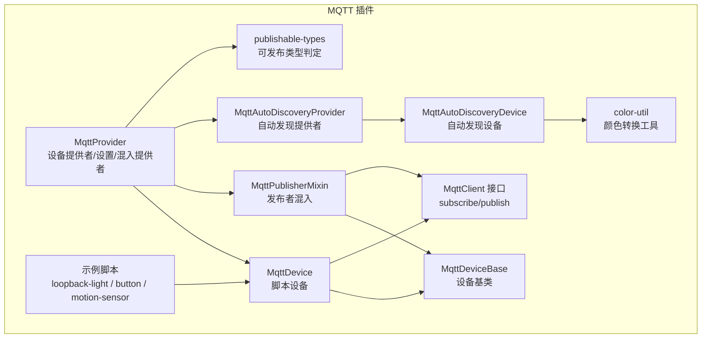
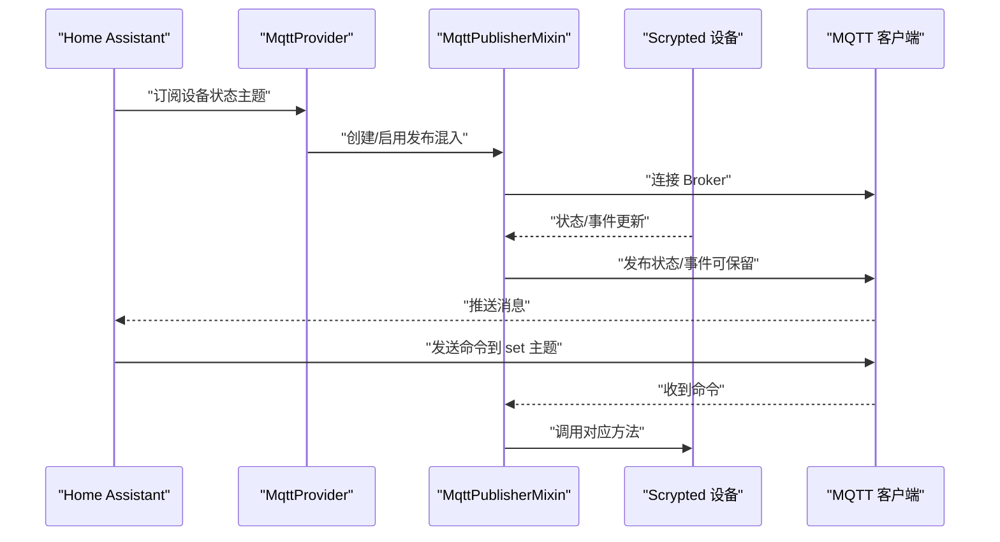
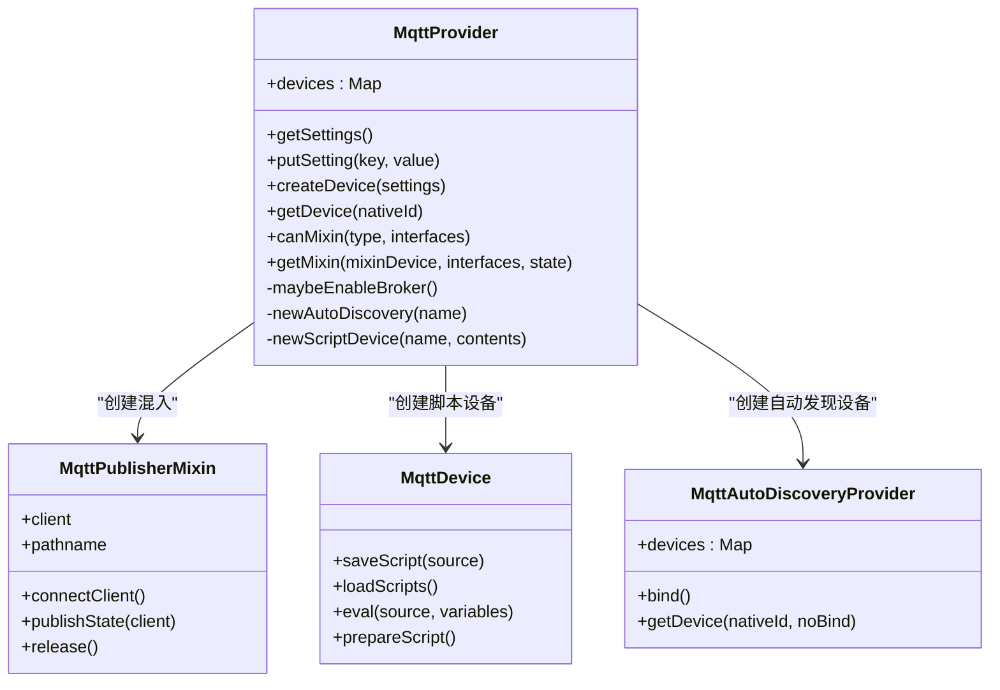
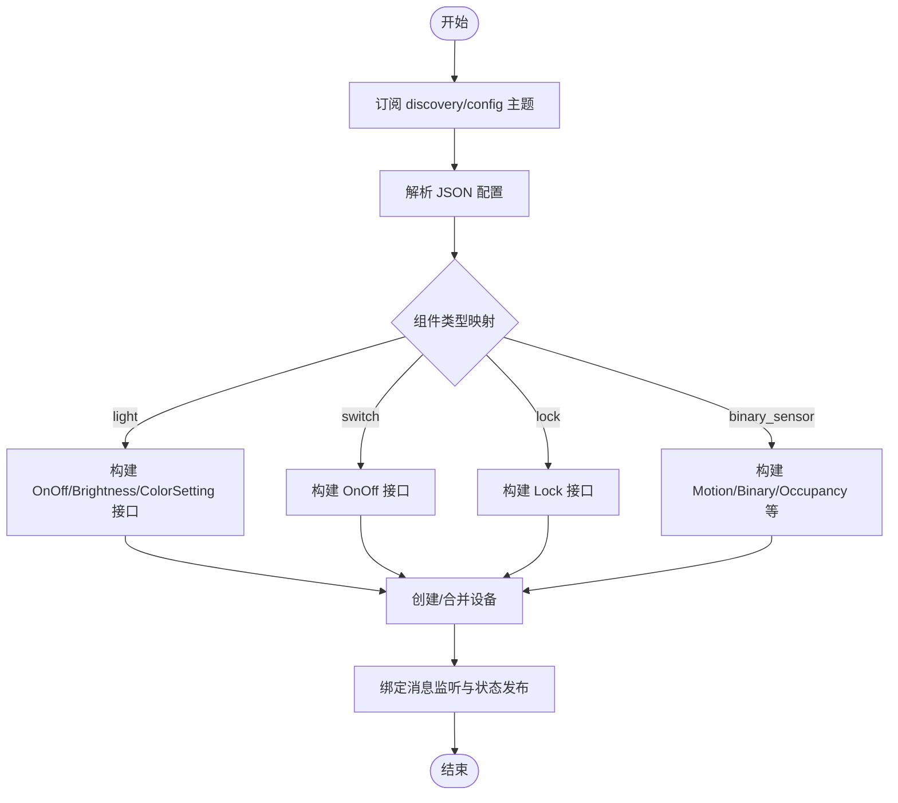
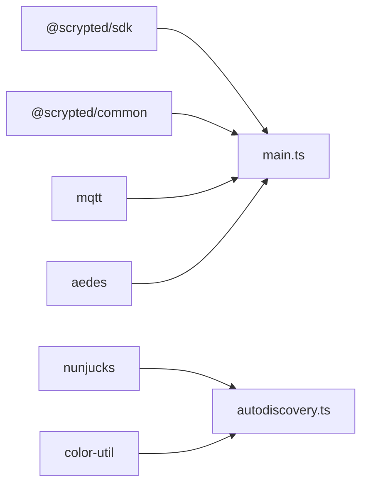

# MQTT 协议插件开发

<cite>
**本文引用的文件**
- [plugins/mqtt/src/main.ts](file://plugins/mqtt/src/main.ts)
- [plugins/mqtt/src/autodiscovery.ts](file://plugins/mqtt/src/autodiscovery.ts)
- [plugins/mqtt/src/api/mqtt-device-base.ts](file://plugins/mqtt/src/api/mqtt-device-base.ts)
- [plugins/mqtt/src/api/mqtt-client.ts](file://plugins/mqtt/src/api/mqtt-client.ts)
- [plugins/mqtt/src/publishable-types.ts](file://plugins/mqtt/src/publishable-types.ts)
- [plugins/mqtt/src/color-util.ts](file://plugins/mqtt/src/color-util.ts)
- [plugins/mqtt/README.md](file://plugins/mqtt/README.md)
- [plugins/mqtt/package.json](file://plugins/mqtt/package.json)
- [plugins/mqtt/fs/examples/loopback-light.ts](file://plugins/mqtt/fs/examples/loopback-light.ts)
- [plugins/mqtt/fs/examples/button.ts](file://plugins/mqtt/fs/examples/button.ts)
- [plugins/mqtt/fs/examples/motion-sensor.ts](file://plugins/mqtt/fs/examples/motion-sensor.ts)
</cite>

## 目录
1. [简介](#简介)
2. [项目结构](#项目结构)
3. [核心组件](#核心组件)
4. [架构总览](#架构总览)
5. [详细组件分析](#详细组件分析)
6. [依赖关系分析](#依赖关系分析)
7. [性能考量](#性能考量)
8. [故障排查指南](#故障排查指南)
9. [结论](#结论)
10. [附录](#附录)

## 简介
本指南面向在 Scrypted 平台上开发 MQTT 协议插件的工程师，系统讲解如何基于 Scrypted 的设备模型与 MQTT 客户端能力，实现物联网设备的双向通信：既可作为 MQTT 发布者（向外部 Broker 上报设备状态与事件），也可作为订阅者（从外部 Broker 订阅命令并驱动设备）。文档覆盖以下关键主题：
- MQTT 客户端实现：连接管理、主题订阅、消息发布、QoS 与保留策略
- 设备基类与混入（Mixin）：设备属性映射、状态同步、命令处理
- 自动发现（Home Assistant MQTT Discovery）：协议支持、设备配置自动生成
- 设备创建与配置：连接参数、主题格式、设备类型映射
- 集成场景：传感器数据上报、开关控制、状态反馈
- 安全与可靠性：认证、连接重试、消息持久化建议

## 项目结构
MQTT 插件位于 plugins/mqtt 目录，核心源码集中在 src 及其子目录，示例脚本位于 fs/examples。主要模块划分如下：
- 主入口与提供者：MqttProvider、MqttDevice、MqttPublisherMixin
- 自动发现：MqttAutoDiscoveryProvider、MqttAutoDiscoveryDevice、自动发现配置与订阅
- 设备基类与接口：MqttDeviceBase、MqttClient 接口定义
- 类型判定：publishable-types（判断设备是否可发布）
- 颜色工具：color-util（HSL/HSV/XY/RGB 转换与色域约束）
- 示例脚本：loopback-light、button、motion-sensor 等

图表来源
- [plugins/mqtt/src/main.ts:338-396](file://plugins/mqtt/src/main.ts#L338-L396)
- [plugins/mqtt/src/autodiscovery.ts:76-209](file://plugins/mqtt/src/autodiscovery.ts#L76-L209)
- [plugins/mqtt/src/api/mqtt-device-base.ts:6-102](file://plugins/mqtt/src/api/mqtt-device-base.ts#L6-L102)
- [plugins/mqtt/src/api/mqtt-client.ts:1-21](file://plugins/mqtt/src/api/mqtt-client.ts#L1-L21)
- [plugins/mqtt/src/publishable-types.ts:3-38](file://plugins/mqtt/src/publishable-types.ts#L3-L38)
- [plugins/mqtt/src/color-util.ts:1-345](file://plugins/mqtt/src/color-util.ts#L1-L345)
- [plugins/mqtt/fs/examples/loopback-light.ts:1-42](file://plugins/mqtt/fs/examples/loopback-light.ts#L1-L42)
- [plugins/mqtt/fs/examples/button.ts:1-15](file://plugins/mqtt/fs/examples/button.ts#L1-L15)
- [plugins/mqtt/fs/examples/motion-sensor.ts:1-16](file://plugins/mqtt/fs/examples/motion-sensor.ts#L1-L16)

章节来源
- [plugins/mqtt/README.md:1-9](file://plugins/mqtt/README.md#L1-L9)
- [plugins/mqtt/package.json:1-48](file://plugins/mqtt/package.json#L1-L48)

## 核心组件
- MqttProvider：插件主提供者，负责：
  - 启用/禁用内置 Aedes MQTT Broker（TCP/HTTP/WebSocket）
  - 提供设备创建（脚本设备与自动发现设备）
  - 混入提供者：为可发布的设备添加 MQTT 发布能力
- MqttDevice：脚本设备，封装 MQTT 客户端，允许用户通过脚本订阅/发布主题并绑定到设备属性
- MqttPublisherMixin：混入，为任意 Scrypted 设备添加 MQTT 发布能力，自动将设备状态与事件发布到 MQTT
- MqttAutoDiscoveryProvider/MqttAutoDiscoveryDevice：自动发现提供者与设备，解析 Home Assistant MQTT Discovery 配置，动态创建设备并建立双向映射
- MqttDeviceBase：通用 MQTT 基类，统一连接逻辑与路径前缀
- MqttClient 接口：脚本侧订阅/发布 API
- publishable-types：判定设备是否可发布到 MQTT
- color-util：颜色空间转换与色域约束，用于灯控设备的 HSV/XY 映射

章节来源
- [plugins/mqtt/src/main.ts:349-619](file://plugins/mqtt/src/main.ts#L349-L619)
- [plugins/mqtt/src/autodiscovery.ts:76-209](file://plugins/mqtt/src/autodiscovery.ts#L76-L209)
- [plugins/mqtt/src/api/mqtt-device-base.ts:6-102](file://plugins/mqtt/src/api/mqtt-device-base.ts#L6-L102)
- [plugins/mqtt/src/api/mqtt-client.ts:1-21](file://plugins/mqtt/src/api/mqtt-client.ts#L1-L21)
- [plugins/mqtt/src/publishable-types.ts:3-38](file://plugins/mqtt/src/publishable-types.ts#L3-L38)
- [plugins/mqtt/src/color-util.ts:1-345](file://plugins/mqtt/src/color-util.ts#L1-L345)

## 架构总览
MQTT 插件在 Scrypted 中扮演双重角色：
- 作为客户端：订阅外部 Broker 的状态主题，将消息映射到设备属性；发布命令到设备的 set 主题
- 作为发布者：监听设备状态变化与事件，将状态与事件发布到 MQTT（可选保留）

图表来源
- [plugins/mqtt/src/main.ts:160-347](file://plugins/mqtt/src/main.ts#L160-L347)
- [plugins/mqtt/src/autodiscovery.ts:705-756](file://plugins/mqtt/src/autodiscovery.ts#L705-L756)

## 详细组件分析

### 组件一：MqttProvider（提供者与混入提供者）
职责与流程：
- 管理内置 Aedes Broker 的启停与端口配置
- 提供“设备创建”能力，支持脚本设备与自动发现设备
- 作为 MixinProvider，为可发布的设备注入发布能力

关键点：
- 连接优先级：设备级 URL > 外部 Broker（当内置 Broker 关闭） > 内置 Broker
- 设置项：启用 Broker、外部 Broker 地址、用户名/密码、TCP/HTTP 端口
- 自动发现 ID：随机生成，用于 HA Discovery 的唯一标识

图表来源
- [plugins/mqtt/src/main.ts:349-619](file://plugins/mqtt/src/main.ts#L349-L619)
- [plugins/mqtt/src/autodiscovery.ts:76-209](file://plugins/mqtt/src/autodiscovery.ts#L76-L209)

章节来源
- [plugins/mqtt/src/main.ts:349-619](file://plugins/mqtt/src/main.ts#L349-L619)

### 组件二：MqttDeviceBase（设备基类）
职责与流程：
- 统一 MQTT 客户端连接逻辑
- 解析 URL，确定 pathname 前缀
- 支持用户名/密码认证

关键点：
- 连接优先级与 pathname 规则
- 重新连接时移除旧监听器并关闭旧连接

章节来源
- [plugins/mqtt/src/api/mqtt-device-base.ts:53-101](file://plugins/mqtt/src/api/mqtt-device-base.ts#L53-L101)

### 组件三：MqttClient 接口（脚本侧 API）
职责与流程：
- subscribe：批量订阅主题，回调中提供 text/json/buffer
- publish：发布消息，支持 retain 选项

关键点：
- 主题拼接：在脚本中使用相对路径，运行时自动加上 pathname 前缀
- 数据类型：对象自动序列化为 JSON 字符串

章节来源
- [plugins/mqtt/src/api/mqtt-client.ts:1-21](file://plugins/mqtt/src/api/mqtt-client.ts#L1-L21)
- [plugins/mqtt/src/main.ts:99-140](file://plugins/mqtt/src/main.ts#L99-L140)

### 组件四：MqttDevice（脚本设备）
职责与流程：
- 保存/加载脚本，支持 Monaco 默认值
- 在 eval 中注入 mqtt 对象，绑定订阅/发布
- 将收到的消息映射到设备属性（如 on/brightness）

关键点：
- 脚本模板：默认回环灯示例，演示双向状态同步
- 错误处理：捕获启动异常并输出到控制台

章节来源
- [plugins/mqtt/src/main.ts:33-155](file://plugins/mqtt/src/main.ts#L33-L155)
- [plugins/mqtt/fs/examples/loopback-light.ts:14-41](file://plugins/mqtt/fs/examples/loopback-light.ts#L14-L41)

### 组件五：MqttPublisherMixin（发布者混入）
职责与流程：
- 监听设备状态与事件变化，发布到 MQTT
- 订阅设备命令主题（如 set），调用设备方法
- 自动发现：首次连接时发布 HA Discovery 配置，监听 homeassistant/status 以重发

关键点：
- 发布策略：状态主题保留（retain: true），命令主题不保留
- QoS：发布时使用 QoS 1（部分实现）
- pathname：根据连接来源（设备级/外部/内置）自动计算

章节来源
- [plugins/mqtt/src/main.ts:160-347](file://plugins/mqtt/src/main.ts#L160-L347)
- [plugins/mqtt/src/autodiscovery.ts:705-756](file://plugins/mqtt/src/autodiscovery.ts#L705-L756)

### 组件六：自动发现（Home Assistant MQTT Discovery）
职责与流程：
- 订阅 discovery 前缀下的 config 主题
- 解析组件类型（light/switch/lock/binary_sensor 等），推导 Scrypted 接口
- 动态创建设备并绑定消息监听
- 将设备状态映射到 MQTT 主题，或将 MQTT 命令映射到设备方法

关键点：
- 组件映射：light → OnOff/Brightness/ColorSetting（按 color_mode 推导）
- 颜色模式：支持 hs/xy/color_temp，结合 color-util 实现色域约束
- 模板渲染：使用 nunjucks 渲染 value_template 与命令模板

图表来源
- [plugins/mqtt/src/autodiscovery.ts:19-209](file://plugins/mqtt/src/autodiscovery.ts#L19-L209)
- [plugins/mqtt/src/autodiscovery.ts:229-432](file://plugins/mqtt/src/autodiscovery.ts#L229-L432)

章节来源
- [plugins/mqtt/src/autodiscovery.ts:76-209](file://plugins/mqtt/src/autodiscovery.ts#L76-L209)
- [plugins/mqtt/src/autodiscovery.ts:229-432](file://plugins/mqtt/src/autodiscovery.ts#L229-L432)
- [plugins/mqtt/src/autodiscovery.ts:611-756](file://plugins/mqtt/src/autodiscovery.ts#L611-L756)

### 组件七：颜色工具（color-util）
职责与流程：
- HSV/XY/RGB 互转
- 色域约束：针对 Hue 系列模型的色域范围与最近可显示色计算
- 用于自动发现设备的颜色温度与色坐标映射

章节来源
- [plugins/mqtt/src/color-util.ts:1-345](file://plugins/mqtt/src/color-util.ts#L1-L345)

## 依赖关系分析
- 外部库：aedes（内置 Broker）、mqtt（客户端）、nunjucks（模板渲染）、websocket-stream（WebSocket 支持）
- 内部依赖：@scrypted/sdk（设备模型与接口）、@scrypted/common（脚本执行环境）

图表来源
- [plugins/mqtt/package.json:33-39](file://plugins/mqtt/package.json#L33-L39)
- [plugins/mqtt/src/main.ts:1-18](file://plugins/mqtt/src/main.ts#L1-L18)
- [plugins/mqtt/src/autodiscovery.ts:1-11](file://plugins/mqtt/src/autodiscovery.ts#L1-L11)

章节来源
- [plugins/mqtt/package.json:33-39](file://plugins/mqtt/package.json#L33-L39)

## 性能考量
- 连接复用：混入与脚本设备均复用同一 MQTT 客户端实例，避免重复连接
- 订阅去重：自动发现设备对相同主题仅注册一次回调集合
- 发布策略：状态主题保留（retain）减少新订阅者的等待时间
- 模板渲染：nunjucks 渲染在必要时进行，避免频繁解析
- 颜色计算：仅在需要时进行 HSV/XY 转换与色域修正

## 故障排查指南
常见问题与定位要点：
- 连接失败
  - 检查用户名/密码与 Broker 地址配置
  - 查看 Provider 设置项与 Broker 端口
- 订阅不到消息
  - 确认 pathname 前缀与主题格式一致
  - 检查脚本中 subscribe 的主题是否正确拼接
- 发布未生效
  - 确认发布主题与设备命令主题一致
  - 检查 retain 选项与 QoS 设置
- 自动发现未创建设备
  - 确认 discovery 前缀与 config 主题格式
  - 检查组件类型映射与配置字段完整性
- 颜色不正确
  - 检查色域模型与色坐标范围
  - 确认 color_mode 与模板渲染结果

章节来源
- [plugins/mqtt/src/main.ts:246-339](file://plugins/mqtt/src/main.ts#L246-L339)
- [plugins/mqtt/src/autodiscovery.ts:314-432](file://plugins/mqtt/src/autodiscovery.ts#L314-L432)

## 结论
Scrypted 的 MQTT 插件通过统一的设备基类与混入机制，实现了设备与 MQTT 的无缝对接。它既能作为发布者上报状态与事件，也能作为订阅者接收命令并驱动设备。自动发现进一步简化了设备接入流程，使 Home Assistant 用户能够零代码快速集成多种设备类型。开发者可基于脚本设备与混入扩展复杂场景，结合颜色工具与模板渲染实现丰富的交互体验。

## 附录

### A. MQTT 客户端实现要点
- 连接管理
  - 优先级：设备级 URL > 外部 Broker > 内置 Broker
  - 认证：用户名/密码可分别配置
- 主题订阅
  - 支持批量订阅，回调提供 text/json/buffer
  - 脚本中主题为相对路径，运行时自动拼接 pathname
- 消息发布
  - 对象自动序列化为 JSON
  - 支持 retain 选项
- QoS 与保留
  - 混入发布状态时使用 QoS 1（部分实现）
  - 状态主题采用 retain 以确保新订阅者立即获得最新状态

章节来源
- [plugins/mqtt/src/api/mqtt-device-base.ts:53-101](file://plugins/mqtt/src/api/mqtt-device-base.ts#L53-L101)
- [plugins/mqtt/src/api/mqtt-client.ts:1-21](file://plugins/mqtt/src/api/mqtt-client.ts#L1-L21)
- [plugins/mqtt/src/main.ts:99-140](file://plugins/mqtt/src/main.ts#L99-L140)
- [plugins/mqtt/src/main.ts:184-195](file://plugins/mqtt/src/main.ts#L184-L195)
- [plugins/mqtt/src/main.ts:305-307](file://plugins/mqtt/src/main.ts#L305-L307)

### B. 设备基类与混入开发模式
- 设备属性映射
  - 自动发现设备将 MQTT 状态映射到 OnOff/Brightness/Lock/ColorSetting 等属性
  - 使用 value_template 与命令模板实现灵活的数据格式
- 状态同步
  - 混入监听设备状态变化并发布到 MQTT
  - 自动发现设备监听状态主题并更新本地属性
- 命令处理
  - 订阅 set 主题，解析 JSON 并调用设备方法
  - 支持 payload_on/off 与自定义模板

章节来源
- [plugins/mqtt/src/main.ts:178-196](file://plugins/mqtt/src/main.ts#L178-L196)
- [plugins/mqtt/src/autodiscovery.ts:396-432](file://plugins/mqtt/src/autodiscovery.ts#L396-L432)
- [plugins/mqtt/src/autodiscovery.ts:455-496](file://plugins/mqtt/src/autodiscovery.ts#L455-L496)

### C. 自动发现（Home Assistant MQTT Discovery）
- 协议支持
  - 组件类型：switch/light/lock/binary_sensor/sensor
  - 接口推导：根据 color_mode 与 device_class 推断 Scrypted 接口
- 配置生成
  - 为每个接口生成独立的 discovery config 主题
  - 使用 unique_id 与节点标识避免冲突
- 模板与回调
  - 使用 nunjucks 渲染 value_template 与命令模板
  - 订阅 set 主题并触发对应设备方法

章节来源
- [plugins/mqtt/src/autodiscovery.ts:19-75](file://plugins/mqtt/src/autodiscovery.ts#L19-L75)
- [plugins/mqtt/src/autodiscovery.ts:611-756](file://plugins/mqtt/src/autodiscovery.ts#L611-L756)

### D. 创建与配置示例
- 脚本设备（回环灯）
  - 订阅 set 主题，发布状态到 status 主题
  - 双向同步：设备状态变更与外部命令均影响对方
- 传感器设备（按钮/人体）
  - 订阅文本主题，映射到 BinarySensor/MotionSensor
  - 使用 handleTypes 快速声明接口

章节来源
- [plugins/mqtt/fs/examples/loopback-light.ts:14-41](file://plugins/mqtt/fs/examples/loopback-light.ts#L14-L41)
- [plugins/mqtt/fs/examples/button.ts:7-14](file://plugins/mqtt/fs/examples/button.ts#L7-L14)
- [plugins/mqtt/fs/examples/motion-sensor.ts:7-15](file://plugins/mqtt/fs/examples/motion-sensor.ts#L7-L15)

### E. 与 IoT 设备的集成方式
- 传感器：订阅状态主题，映射到相应传感器接口
- 开关/灯：订阅 set 主题，调用 OnOff/Brightness/Lock/ColorSetting 方法
- 状态反馈：通过混入或脚本发布状态主题，支持 retain

章节来源
- [plugins/mqtt/src/main.ts:160-347](file://plugins/mqtt/src/main.ts#L160-L347)
- [plugins/mqtt/src/autodiscovery.ts:229-432](file://plugins/mqtt/src/autodiscovery.ts#L229-L432)

### F. 安全认证、连接重试、消息持久化
- 认证
  - 支持用户名/密码认证
  - 内置 Broker 可配置鉴权回调
- 连接重试
  - 断线后自动重连（由底层客户端处理）
  - 混入在 connect 事件中重新订阅与发布状态
- 消息持久化
  - 状态主题采用 retain 以实现“最后已知状态”
  - 建议外部 Broker 启用持久会话（cleanSession=false）以保证离线消息恢复

章节来源
- [plugins/mqtt/src/main.ts:495-520](file://plugins/mqtt/src/main.ts#L495-L520)
- [plugins/mqtt/src/main.ts:299-312](file://plugins/mqtt/src/main.ts#L299-L312)
- [plugins/mqtt/src/main.ts:185-187](file://plugins/mqtt/src/main.ts#L185-L187)