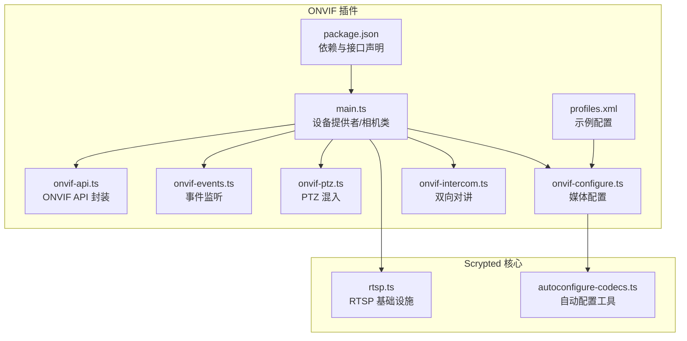
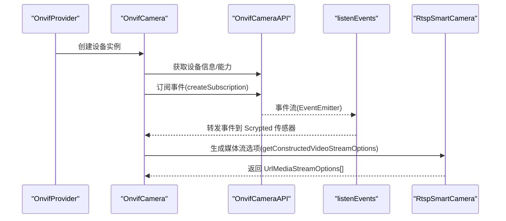
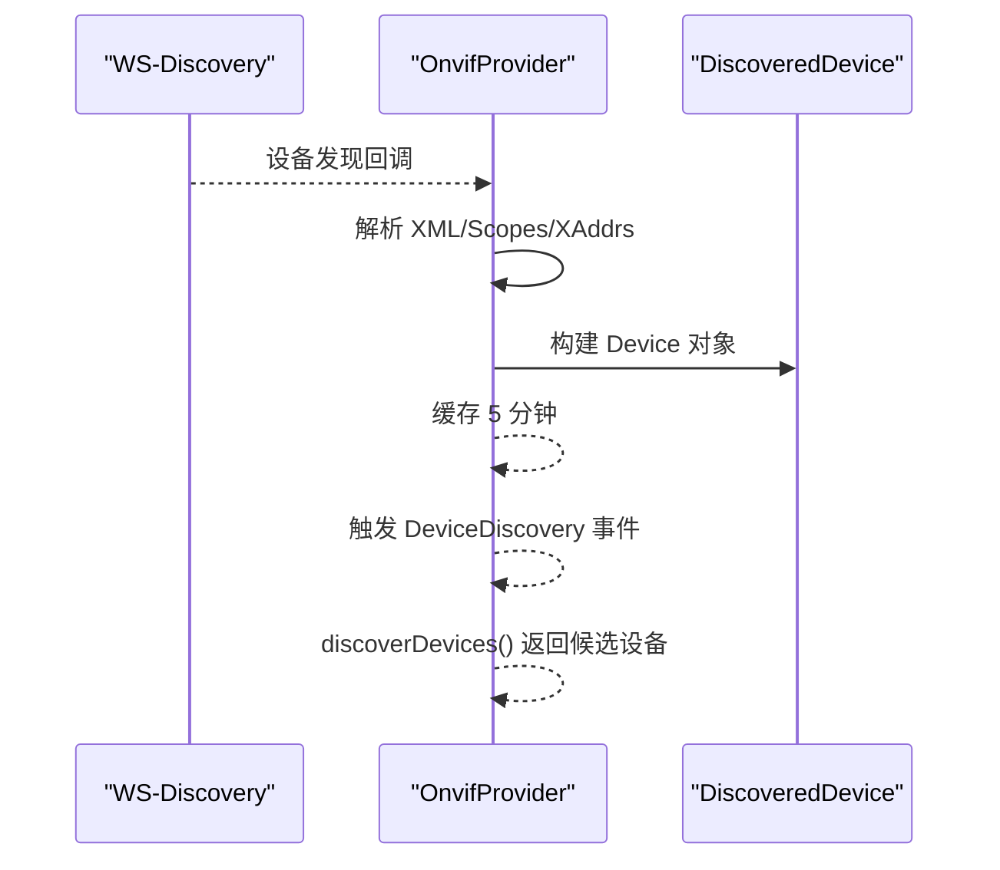
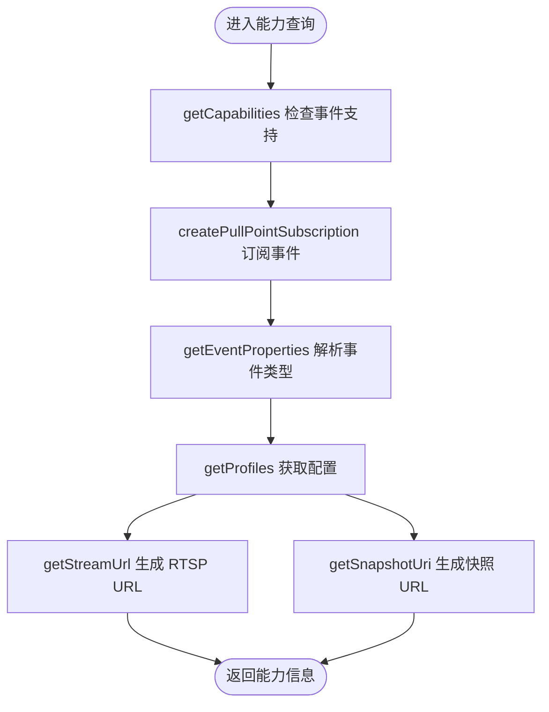
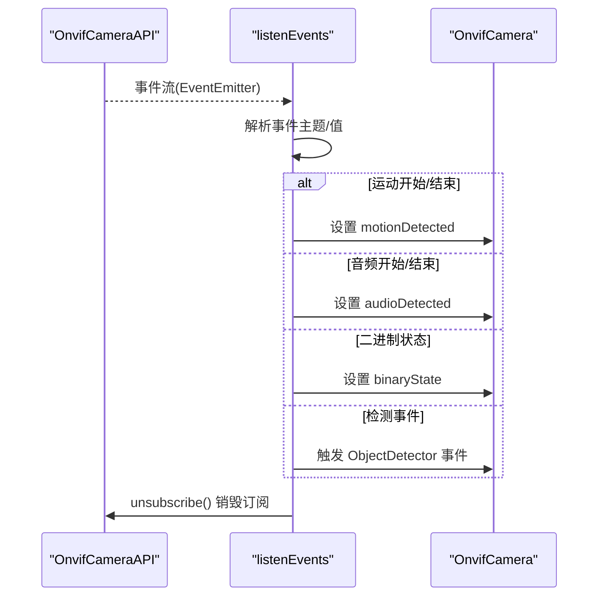
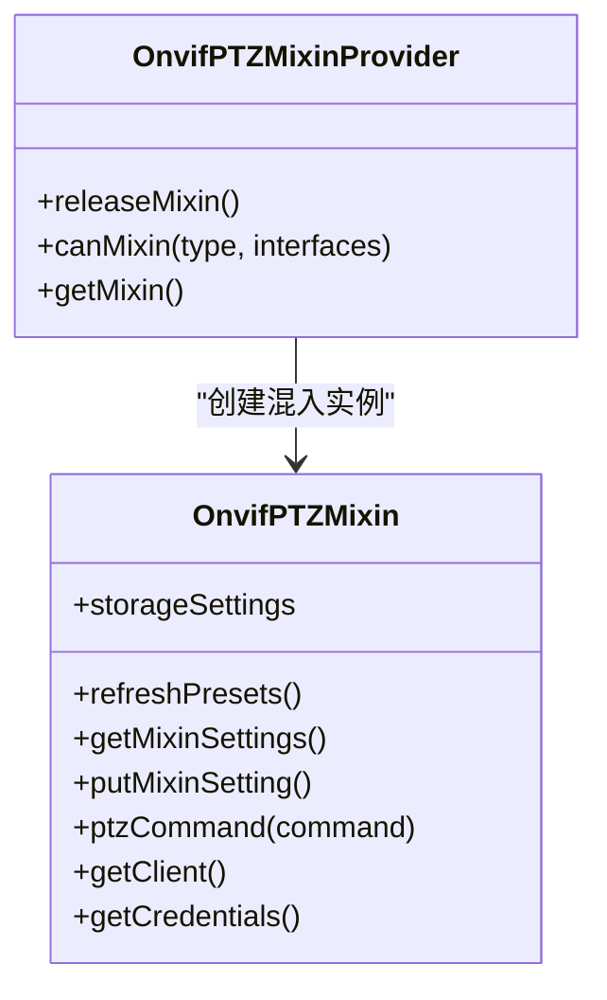
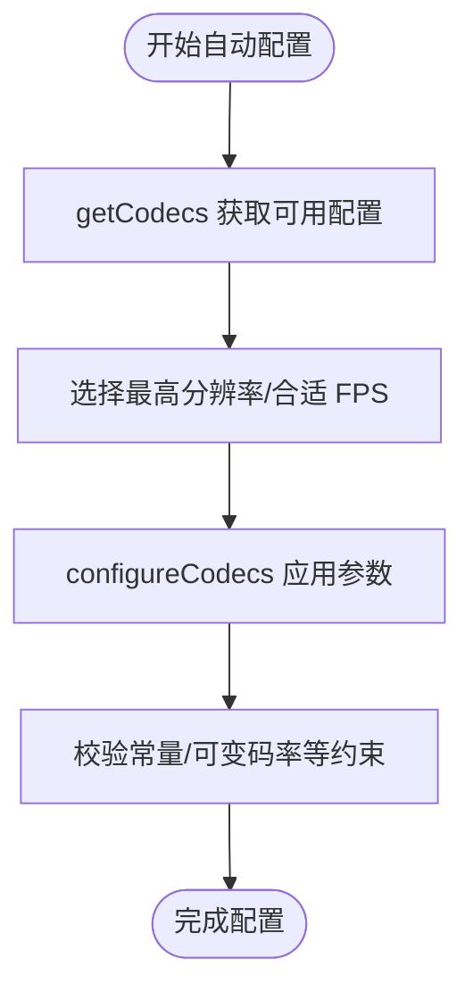
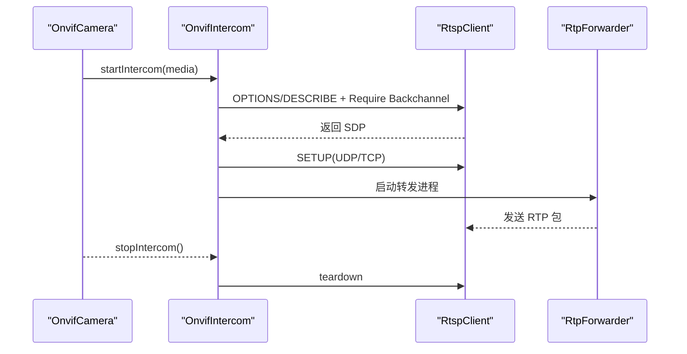
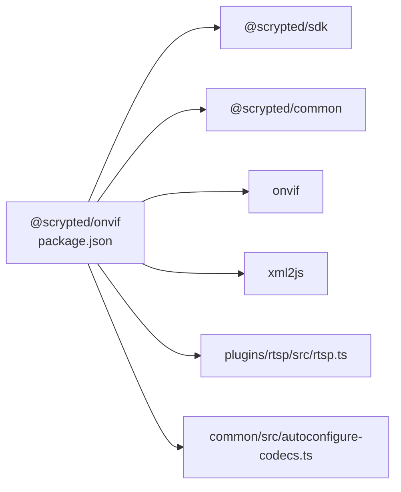

# ONVIF 协议插件开发

<cite>
**本文档引用的文件**
- [main.ts](file://plugins/onvif/src/main.ts)
- [onvif-api.ts](file://plugins/onvif/src/onvif-api.ts)
- [onvif-events.ts](file://plugins/onvif/src/onvif-events.ts)
- [onvif-ptz.ts](file://plugins/onvif/src/onvif-ptz.ts)
- [onvif-configure.ts](file://plugins/onvif/src/onvif-configure.ts)
- [onvif-intercom.ts](file://plugins/onvif/src/onvif-intercom.ts)
- [package.json](file://plugins/onvif/package.json)
- [README.md](file://plugins/onvif/README.md)
- [profiles.xml](file://plugins/onvif/xml-dumps/profiles.xml)
- [rtsp.ts](file://plugins/rtsp/src/rtsp.ts)
- [autoconfigure-codecs.ts](file://common/src/autoconfigure-codecs.ts)
</cite>

## 目录
1. [简介](#简介)
2. [项目结构](#项目结构)
3. [核心组件](#核心组件)
4. [架构总览](#架构总览)
5. [详细组件分析](#详细组件分析)
6. [依赖关系分析](#依赖关系分析)
7. [性能考虑](#性能考虑)
8. [故障排除指南](#故障排除指南)
9. [结论](#结论)
10. [附录](#附录)

## 简介
本技术指南面向在 Scrypted 平台上开发 ONVIF 协议插件的工程师，系统性阐述 ONVIF 协议在 Scrypted 中的实现架构与关键功能，包括设备发现、设备描述、媒体配置、事件系统、PTZ 控制以及双向对讲（Intercom）等。文档同时覆盖安全认证、证书管理、连接超时处理等关键技术点，并提供摄像头设备的完整集成示例流程，帮助开发者快速上手并高质量完成 ONVIF 设备接入。

## 项目结构
ONVIF 插件位于 plugins/onvif 目录下，采用模块化设计，核心文件包括：
- 主入口与设备提供者：main.ts
- ONVIF API 封装：onvif-api.ts
- 事件监听与处理：onvif-events.ts
- PTZ 混入实现：onvif-ptz.ts
- 媒体配置与自动配置：onvif-configure.ts
- 双向对讲实现：onvif-intercom.ts
- 包配置与依赖声明：package.json
- 示例 XML 配置：xml-dumps/profiles.xml
- 通用自动配置工具：common/src/autoconfigure-codecs.ts
- RTSP 基础设施：plugins/rtsp/src/rtsp.ts

图表来源
- [main.ts:1-622](file://plugins/onvif/src/main.ts#L1-L622)
- [onvif-api.ts:1-399](file://plugins/onvif/src/onvif-api.ts#L1-L399)
- [onvif-events.ts:1-96](file://plugins/onvif/src/onvif-events.ts#L1-L96)
- [onvif-ptz.ts:1-247](file://plugins/onvif/src/onvif-ptz.ts#L1-L247)
- [onvif-configure.ts:1-216](file://plugins/onvif/src/onvif-configure.ts#L1-L216)
- [onvif-intercom.ts:1-195](file://plugins/onvif/src/onvif-intercom.ts#L1-L195)
- [package.json:1-54](file://plugins/onvif/package.json#L1-L54)
- [profiles.xml:1-367](file://plugins/onvif/xml-dumps/profiles.xml#L1-L367)
- [rtsp.ts:1-200](file://plugins/rtsp/src/rtsp.ts#L1-L200)
- [autoconfigure-codecs.ts:1-200](file://common/src/autoconfigure-codecs.ts#L1-L200)

章节来源
- [main.ts:1-622](file://plugins/onvif/src/main.ts#L1-L622)
- [package.json:1-54](file://plugins/onvif/package.json#L1-L54)

## 核心组件
- 设备提供者与相机类：负责设备发现、创建、设置管理、媒体流选项生成、事件监听、重启、OSD 文字叠加等。
- ONVIF API 封装：封装 onvif 库调用，提供设备信息、事件类型、媒体流 URL、快照、OSD、编码配置等能力。
- 事件系统：统一事件订阅、过滤与转发，支持运动、音频、二进制状态、检测事件等。
- PTZ 控制：提供绝对/相对/连续/预置位/回 HOME 等多种移动方式，支持预设位管理。
- 媒体配置：自动配置视频/音频编码参数，兼容不同厂商差异，提供配置校验与回退策略。
- 双向对讲：基于 RTSP/ONVIF Backchannel 实现音频上行传输，支持 UDP/TCP 传输模式与 RTP 打包。
- 自动配置工具：通用的自动配置策略，按分辨率与带宽目标优化多路码流。

章节来源
- [main.ts:16-332](file://plugins/onvif/src/main.ts#L16-L332)
- [onvif-api.ts:53-399](file://plugins/onvif/src/onvif-api.ts#L53-L399)
- [onvif-events.ts:5-96](file://plugins/onvif/src/onvif-events.ts#L5-L96)
- [onvif-ptz.ts:6-247](file://plugins/onvif/src/onvif-ptz.ts#L6-L247)
- [onvif-configure.ts:63-216](file://plugins/onvif/src/onvif-configure.ts#L63-L216)
- [onvif-intercom.ts:15-195](file://plugins/onvif/src/onvif-intercom.ts#L15-L195)
- [autoconfigure-codecs.ts:43-200](file://common/src/autoconfigure-codecs.ts#L43-L200)

## 架构总览
ONVIF 插件通过 Scrypted 的 DeviceProvider 接口暴露设备，内部使用 onvif 库与 RTSP 基础设施协作，实现设备发现、能力查询、事件订阅、媒体配置与 PTZ/对讲控制等功能。

图表来源
- [main.ts:334-622](file://plugins/onvif/src/main.ts#L334-L622)
- [onvif-api.ts:266-291](file://plugins/onvif/src/onvif-api.ts#L266-L291)
- [onvif-events.ts:15-96](file://plugins/onvif/src/onvif-events.ts#L15-L96)
- [rtsp.ts:153-200](file://plugins/rtsp/src/rtsp.ts#L153-L200)

## 详细组件分析

### 设备发现与注册
- WS-Discovery 设备发现：OnvifProvider 监听 onvif.Discovery 的 device 事件，解析 ProbeMatches，提取设备 URN、XAddrs、Scopes 等信息，构建 Device 对象并缓存 5 分钟。
- 发现结果：discoverDevices 返回可添加的设备列表，支持一键创建或 Adopt 设备。
- 设备创建：createDevice 支持自动配置、跳过验证、设置用户名密码、HTTP 端口等；创建后更新设备信息、尝试探测双向对讲能力并挂载 PTZ 混入。

图表来源
- [main.ts:358-438](file://plugins/onvif/src/main.ts#L358-L438)
- [main.ts:580-619](file://plugins/onvif/src/main.ts#L580-L619)

章节来源
- [main.ts:358-438](file://plugins/onvif/src/main.ts#L358-L438)
- [main.ts:580-619](file://plugins/onvif/src/main.ts#L580-L619)

### 设备描述与能力查询
- 设备信息：通过 getDeviceInformation 获取序列号、制造商、固件版本、型号等。
- 事件能力：通过 getCapabilities 判断是否支持 WSPullPointSupport，随后创建订阅。
- 事件类型：getEventProperties 解析规则引擎对象检测器，建立事件名到类别的映射。
- 媒体能力：getProfiles 获取所有配置，getStreamUrl 生成 RTSP 地址，getSnapshotUri 获取 JPEG 快照地址。

图表来源
- [onvif-api.ts:248-334](file://plugins/onvif/src/onvif-api.ts#L248-L334)

章节来源
- [onvif-api.ts:248-334](file://plugins/onvif/src/onvif-api.ts#L248-L334)

### 事件系统实现
- 事件订阅：supportsEvents + createSubscription，确保设备支持拉取点订阅。
- 事件过滤与分发：listenEvents 监听 onvif 事件，根据主题命名空间与值进行分类，触发运动、音频、二进制状态、检测等事件。
- 事件去抖：对运动事件采用定时器去抖，避免短时闪烁与未发送停止事件导致的状态异常。
- 事件销毁：destroy 时取消订阅并清理定时器。

图表来源
- [onvif-api.ts:94-169](file://plugins/onvif/src/onvif-api.ts#L94-L169)
- [onvif-events.ts:5-96](file://plugins/onvif/src/onvif-events.ts#L5-L96)

章节来源
- [onvif-api.ts:94-169](file://plugins/onvif/src/onvif-api.ts#L94-L169)
- [onvif-events.ts:5-96](file://plugins/onvif/src/onvif-events.ts#L5-L96)

### PTZ 控制实现
- PTZ 混入：OnvifPTZMixin 提供设置项（支持轴、移动类型、预设位），并从设备缓存预设位。
- 移动命令：支持绝对、相对、连续、预置位、HOME 等命令，速度参数按轴配置。
- 预设位管理：通过 getPresets 获取并缓存，设置时反向映射为键值对。
- 权限与接口：OnvifPTZMixinProvider 仅对具备 VideoCamera/Settings 的摄像头开放 PTZ 接口。

图表来源
- [onvif-ptz.ts:6-247](file://plugins/onvif/src/onvif-ptz.ts#L6-L247)

章节来源
- [onvif-ptz.ts:6-247](file://plugins/onvif/src/onvif-ptz.ts#L6-L247)

### 媒体配置与自动配置
- 编解码映射：定义 ONVIF 与 FFmpeg 编解码器之间的映射关系，支持 H.264/H.265/AAC/PCM 等。
- 自动配置策略：autoconfigureCodecs 根据分辨率与带宽目标选择最优码流组合，按本地/远程/低分辨率三档配置。
- 手动配置：configureCodecs 支持指定编码、分辨率、帧率、码率、GOP、质量、音频编解码等参数。
- 回退与错误提示：当设备不支持编码配置时发出警告；对常量/可变码率等约束进行校验并提示用户手动调整。

图表来源
- [onvif-configure.ts:63-176](file://plugins/onvif/src/onvif-configure.ts#L63-L176)
- [autoconfigure-codecs.ts:43-200](file://common/src/autoconfigure-codecs.ts#L43-L200)

章节来源
- [onvif-configure.ts:63-176](file://plugins/onvif/src/onvif-configure.ts#L63-L176)
- [autoconfigure-codecs.ts:43-200](file://common/src/autoconfigure-codecs.ts#L43-L200)

### 双向对讲（Intercom）
- Backchannel 探测：通过 RTSP DESCRIBE + Require: www.onvif.org/ver20/backchannel 检测音频回传通道。
- 传输模式：优先 UDP（RTP/AVP），失败则回退 TCP（RTP/AVP/TCP interleaved）。
- RTP 打包：将 FFmpeg 输出的音频帧打包为 RTP，设置 payloadType、SSRC、序号等，按时间戳合并小包。
- 连接生命周期：startIntercom 启动转发进程，stopIntercom 安全关闭。

图表来源
- [onvif-intercom.ts:45-195](file://plugins/onvif/src/onvif-intercom.ts#L45-L195)

章节来源
- [onvif-intercom.ts:45-195](file://plugins/onvif/src/onvif-intercom.ts#L45-L195)

### 相机类与媒体流
- OnvifCamera 继承自 RtspSmartCamera，负责设备信息更新、OSD 文字叠加、截图、媒体流选项生成、重启等。
- 媒体流选项：getConstructedVideoStreamOptions 通过 OnvifCameraAPI.getCodecs 获取 RTSP URL、分辨率、帧率、码率、编解码等信息。
- 事件监听：listenEvents 在设备启动时创建订阅并转发事件。

章节来源
- [main.ts:16-332](file://plugins/onvif/src/main.ts#L16-L332)
- [rtsp.ts:153-200](file://plugins/rtsp/src/rtsp.ts#L153-L200)

## 依赖关系分析
- 外部依赖：onvif（ONVIF 客户端）、xml2js（XML 解析）、@scrypted/common（通用工具）、@scrypted/sdk（Scrypted SDK）。
- 内部依赖：与 RTSP 插件共享基础设施，与通用自动配置工具协作完成媒体配置。
- 接口声明：package.json 中声明 DeviceProvider、DeviceCreator、DeviceDiscovery 等接口。

图表来源
- [package.json:36-47](file://plugins/onvif/package.json#L36-L47)
- [main.ts:1-14](file://plugins/onvif/src/main.ts#L1-L14)

章节来源
- [package.json:36-47](file://plugins/onvif/package.json#L36-L47)

## 性能考虑
- 媒体配置优化：自动配置工具按分辨率与带宽目标选择最优码流组合，减少不必要的高分辨率/高码率场景。
- 事件去抖：运动事件采用定时器去抖，降低频繁状态切换带来的资源消耗。
- 连接复用：OnvifCameraAPI 缓存 RTSP/Snapshot URL，避免重复请求。
- 超时与重试：快照请求与 HTTP 请求设置合理超时，异常时进行降级处理（如回退到视频流截图）。

## 故障排除指南
- 设备无法发现：检查网络连通性、端口可达性、WS-Discovery 是否启用；确认 onvif.Discovery 是否收到响应。
- 事件不生效：确认设备支持 WSPullPointSupport；若不支持，仍可尝试订阅，但稳定性可能下降。
- 快照失败：部分设备不支持 JPEG 快照，插件会回退到视频流截图；可在设备设置中禁用快照或调整超时。
- PTZ 不可用：确认设备具备 PTZ 能力并在混入中启用；检查预设位是否正确缓存。
- 双向对讲失败：优先 UDP，失败时回退 TCP；检查音频编解码匹配与网络连通性。
- 自动配置失败：某些参数需在设备 Web 界面手动设置（如常量/可变码率），插件会在配置时明确提示。

章节来源
- [onvif-api.ts:336-364](file://plugins/onvif/src/onvif-api.ts#L336-L364)
- [onvif-events.ts:15-96](file://plugins/onvif/src/onvif-events.ts#L15-L96)
- [onvif-intercom.ts:77-96](file://plugins/onvif/src/onvif-intercom.ts#L77-L96)
- [onvif-configure.ts:169-175](file://plugins/onvif/src/onvif-configure.ts#L169-L175)

## 结论
ONVIF 插件在 Scrypted 中实现了完整的 ONVIF 设备接入链路，涵盖设备发现、能力查询、事件订阅、媒体配置、PTZ 控制与双向对讲。通过模块化设计与自动配置工具，插件能够适配多种厂商设备并提供一致的用户体验。建议在实际部署中结合设备特性进行参数微调，并关注事件与媒体流的稳定性与性能表现。

## 附录

### ONVIF 摄像头设备集成示例流程
- 设备发现：通过 WS-Discovery 获取设备信息，填充用户名/密码/HTTP 端口。
- 设备创建：createDevice 自动配置（可选），验证设备信息与 PTZ 能力。
- 注册设备：设置 IP、HTTP 端口、设备信息，尝试探测双向对讲能力。
- 挂载混入：若支持 PTZ，则将其作为混入挂载到摄像头设备。
- 状态同步：启动事件监听，将 ONVIF 事件映射为 Scrypted 传感器状态。

章节来源
- [main.ts:465-543](file://plugins/onvif/src/main.ts#L465-L543)
- [main.ts:602-619](file://plugins/onvif/src/main.ts#L602-L619)

### 关键技术点
- 安全认证：OnvifCameraAPI 使用 http-auth-fetch 进行认证，支持用户名/密码传递。
- 证书管理：authHttpFetch 默认忽略证书校验（rejectUnauthorized=false），便于调试；生产环境建议配置可信证书。
- 连接超时：快照请求与 HTTP 请求设置超时参数，避免长时间阻塞。
- 事件过滤：stripNamespaces 清理命名空间，统一事件主题格式；针对特定厂商事件（如 Reolink、Mobotix）做特殊处理。

章节来源
- [onvif-api.ts:69-79](file://plugins/onvif/src/onvif-api.ts#L69-L79)
- [onvif-api.ts:26-42](file://plugins/onvif/src/onvif-api.ts#L26-L42)
- [onvif-api.ts:358-363](file://plugins/onvif/src/onvif-api.ts#L358-L363)