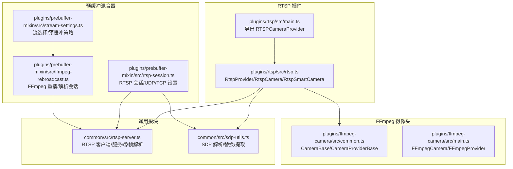
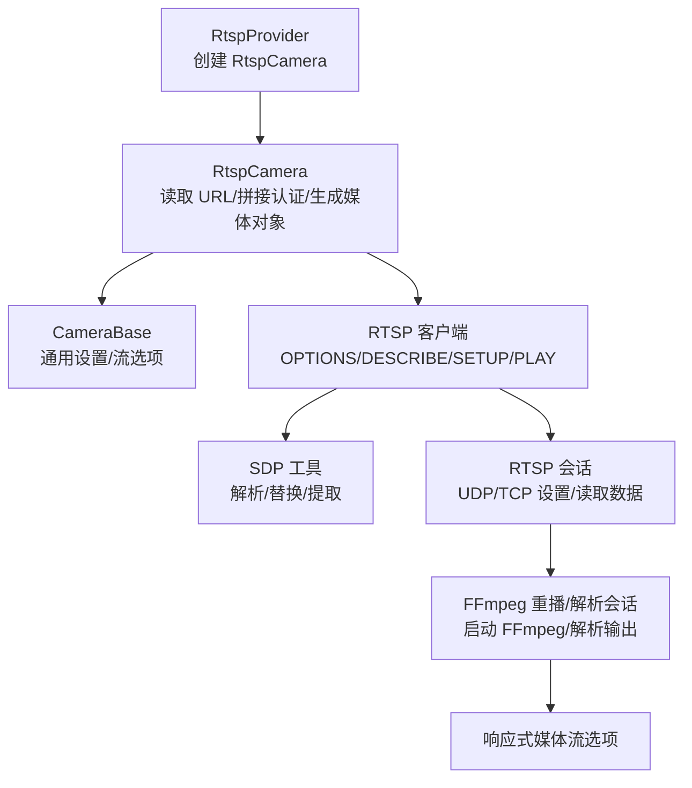
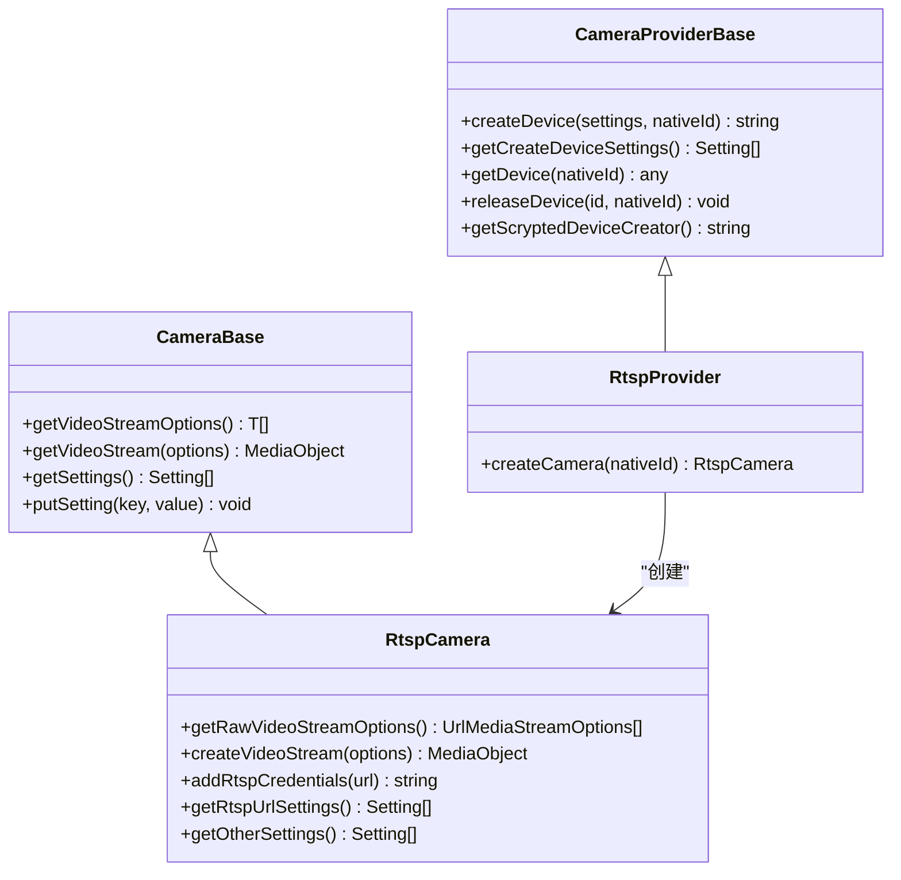
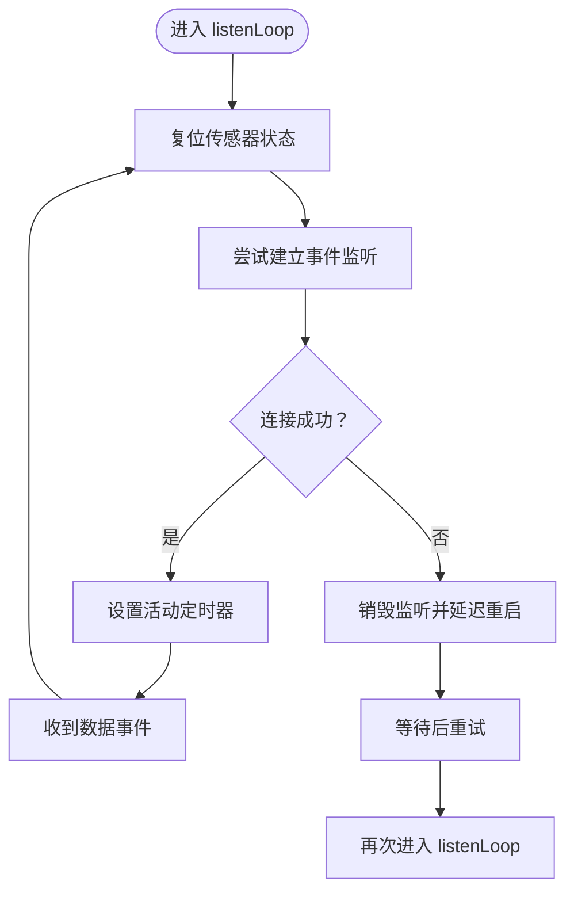
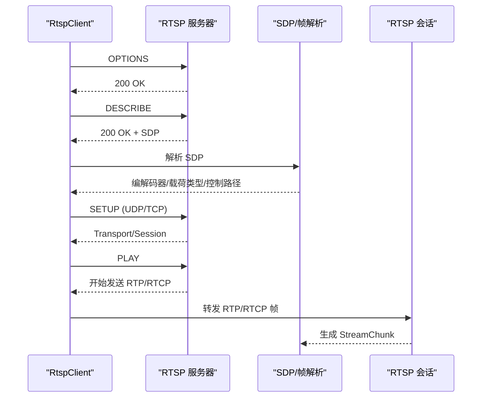
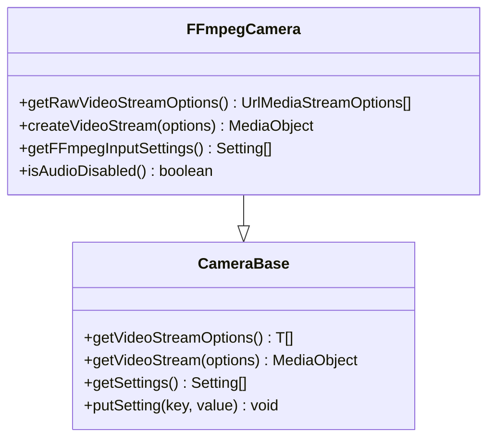
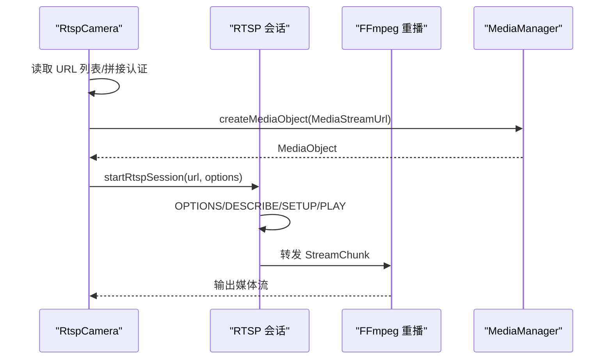
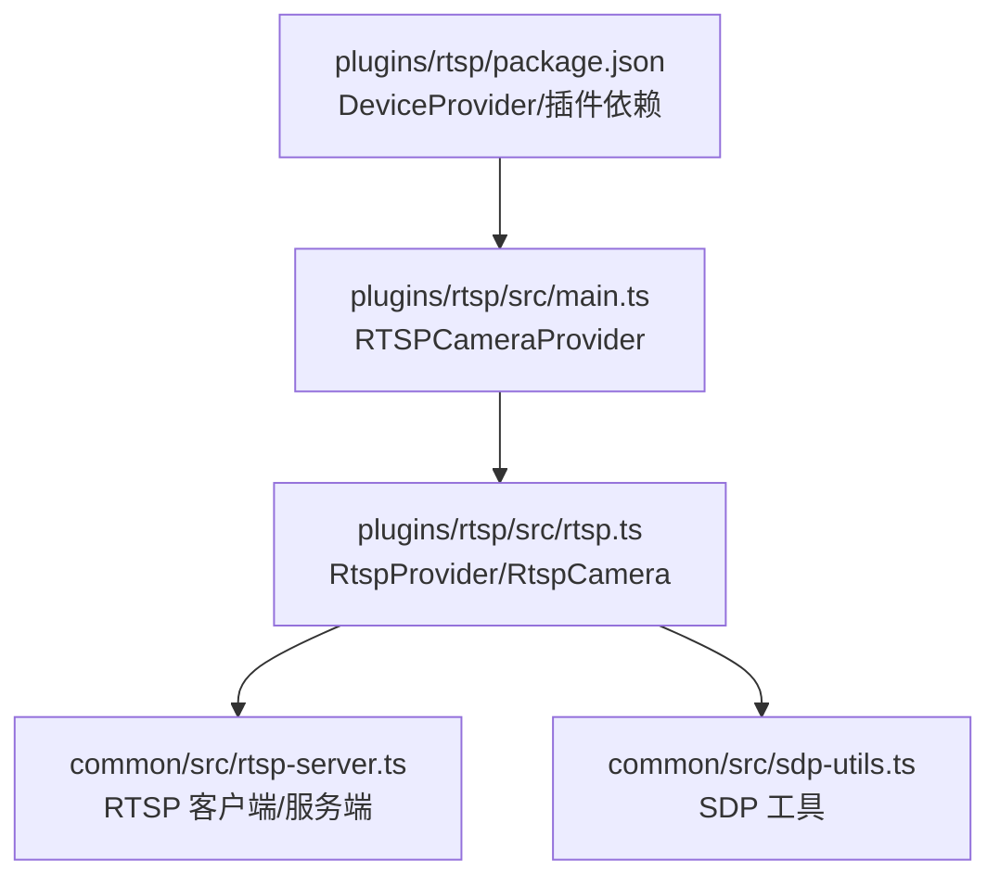

# RTSP 协议插件开发

<cite>
**本文引用的文件**
- [plugins/rtsp/src/main.ts](file://plugins/rtsp/src/main.ts)
- [plugins/rtsp/src/rtsp.ts](file://plugins/rtsp/src/rtsp.ts)
- [plugins/ffmpeg-camera/src/common.ts](file://plugins/ffmpeg-camera/src/common.ts)
- [plugins/ffmpeg-camera/src/main.ts](file://plugins/ffmpeg-camera/src/main.ts)
- [common/src/rtsp-server.ts](file://common/src/rtsp-server.ts)
- [common/src/sdp-utils.ts](file://common/src/sdp-utils.ts)
- [plugins/prebuffer-mixin/src/rtsp-session.ts](file://plugins/prebuffer-mixin/src/rtsp-session.ts)
- [plugins/prebuffer-mixin/src/ffmpeg-rebroadcast.ts](file://plugins/prebuffer-mixin/src/ffmpeg-rebroadcast.ts)
- [plugins/prebuffer-mixin/src/stream-settings.ts](file://plugins/prebuffer-mixin/src/stream-settings.ts)
- [plugins/rtsp/README.md](file://plugins/rtsp/README.md)
- [plugins/rtsp/package.json](file://plugins/rtsp/package.json)
</cite>

## 目录
1. [简介](#简介)
2. [项目结构](#项目结构)
3. [核心组件](#核心组件)
4. [架构总览](#架构总览)
5. [详细组件分析](#详细组件分析)
6. [依赖关系分析](#依赖关系分析)
7. [性能考量](#性能考量)
8. [故障排查指南](#故障排查指南)
9. [结论](#结论)
10. [附录](#附录)

## 简介
本文件面向 RTSP 协议插件开发者，系统性阐述 Scrypted 中 RTSP 设备接入与流媒体处理的实现方式，覆盖 RTSP 会话管理、SDP 协商、RTP/RTCP 传输机制；详解 RtspProvider 的继承与扩展、getScryptedDeviceCreator 的实现；说明 RTSP 流媒体初始化、连接建立与命令交互流程；给出摄像头设备创建与配置示例（含流参数、分辨率、码率控制）；介绍与 FFmpeg 摄像头插件的协作；并提供常见问题排查与性能优化建议。

## 项目结构
RTSP 插件位于 plugins/rtsp，其核心类 RtspCamera 继承自通用的 CameraBase，并通过 RtspProvider 实现设备发现与创建。RTSP 通用能力由 common 模块提供，包括 RTSP 客户端/服务端解析、SDP 解析工具、RTP/RTCP 帧处理等。预缓冲混合器（prebuffer-mixin）负责与 RTSP 服务器交互、协商 SDP、建立 UDP/TCP 通道并进行数据转发。

**图表来源**
- [plugins/rtsp/src/main.ts:1-8](file://plugins/rtsp/src/main.ts#L1-L8)
- [plugins/rtsp/src/rtsp.ts:20-383](file://plugins/rtsp/src/rtsp.ts#L20-L383)
- [plugins/ffmpeg-camera/src/common.ts:1-185](file://plugins/ffmpeg-camera/src/common.ts#L1-L185)
- [plugins/ffmpeg-camera/src/main.ts:1-155](file://plugins/ffmpeg-camera/src/main.ts#L1-L155)
- [common/src/rtsp-server.ts:1-1235](file://common/src/rtsp-server.ts#L1-L1235)
- [common/src/sdp-utils.ts:1-411](file://common/src/sdp-utils.ts#L1-L411)
- [plugins/prebuffer-mixin/src/rtsp-session.ts:1-235](file://plugins/prebuffer-mixin/src/rtsp-session.ts#L1-L235)
- [plugins/prebuffer-mixin/src/ffmpeg-rebroadcast.ts:1-290](file://plugins/prebuffer-mixin/src/ffmpeg-rebroadcast.ts#L1-L290)
- [plugins/prebuffer-mixin/src/stream-settings.ts:1-268](file://plugins/prebuffer-mixin/src/stream-settings.ts#L1-L268)

**章节来源**
- [plugins/rtsp/src/main.ts:1-8](file://plugins/rtsp/src/main.ts#L1-L8)
- [plugins/rtsp/src/rtsp.ts:20-383](file://plugins/rtsp/src/rtsp.ts#L20-L383)
- [plugins/ffmpeg-camera/src/common.ts:1-185](file://plugins/ffmpeg-camera/src/common.ts#L1-L185)
- [plugins/ffmpeg-camera/src/main.ts:1-155](file://plugins/ffmpeg-camera/src/main.ts#L1-L155)
- [common/src/rtsp-server.ts:1-1235](file://common/src/rtsp-server.ts#L1-L1235)
- [common/src/sdp-utils.ts:1-411](file://common/src/sdp-utils.ts#L1-L411)
- [plugins/prebuffer-mixin/src/rtsp-session.ts:1-235](file://plugins/prebuffer-mixin/src/rtsp-session.ts#L1-L235)
- [plugins/prebuffer-mixin/src/ffmpeg-rebroadcast.ts:1-290](file://plugins/prebuffer-mixin/src/ffmpeg-rebroadcast.ts#L1-L290)
- [plugins/prebuffer-mixin/src/stream-settings.ts:1-268](file://plugins/prebuffer-mixin/src/stream-settings.ts#L1-L268)

## 核心组件
- RtspProvider：设备提供者基类，负责创建 RtspCamera 实例并暴露设备创建入口。
- RtspCamera：具体 RTSP 摄像头设备，负责从存储中读取 RTSP URL 列表、拼接认证信息、生成媒体对象。
- RtspSmartCamera：智能摄像头抽象，封装事件监听循环、传感器状态复位、URL/端口覆盖、超时重启等逻辑。
- RTSP 客户端/服务端：在 common 模块中实现，支持 OPTIONS/DESCRIBE/SETUP/PLAY/TEARDOWN 等命令，解析 SDP，处理 RTP/RTCP 帧。
- SDP 工具：解析/修改 SDP，提取编解码器、载荷类型、参数集等。
- 预缓冲 RTSP 会话：在 prebuffer-mixin 中，完成 RTSP 描述、SETUP（UDP/TCP）、PLAY、读取与转发数据包。
- FFmpeg 摄像头基类：提供通用的 URL/FFmpeg 输入参数配置与视频流创建能力，RTSP 插件复用该基类以统一接口。

**章节来源**
- [plugins/rtsp/src/rtsp.ts:20-383](file://plugins/rtsp/src/rtsp.ts#L20-L383)
- [common/src/rtsp-server.ts:1-1235](file://common/src/rtsp-server.ts#L1-L1235)
- [common/src/sdp-utils.ts:1-411](file://common/src/sdp-utils.ts#L1-L411)
- [plugins/prebuffer-mixin/src/rtsp-session.ts:1-235](file://plugins/prebuffer-mixin/src/rtsp-session.ts#L1-L235)
- [plugins/ffmpeg-camera/src/common.ts:1-185](file://plugins/ffmpeg-camera/src/common.ts#L1-L185)

## 架构总览
下图展示 RTSP 插件在 Scrypted 中的整体架构：设备提供者 RtspProvider 创建 RtspCamera；RtspCamera 通过通用 CameraBase 提供流选项与媒体对象；RTSP 会话在预缓冲混合器中通过 common 模块的 RTSP 客户端与 SDP 工具完成描述、SETUP、PLAY 并转发到 FFmpeg 解析器。

**图表来源**
- [plugins/rtsp/src/rtsp.ts:20-383](file://plugins/rtsp/src/rtsp.ts#L20-L383)
- [common/src/rtsp-server.ts:1-1235](file://common/src/rtsp-server.ts#L1-L1235)
- [common/src/sdp-utils.ts:1-411](file://common/src/sdp-utils.ts#L1-L411)
- [plugins/prebuffer-mixin/src/rtsp-session.ts:1-235](file://plugins/prebuffer-mixin/src/rtsp-session.ts#L1-L235)
- [plugins/prebuffer-mixin/src/ffmpeg-rebroadcast.ts:1-290](file://plugins/prebuffer-mixin/src/ffmpeg-rebroadcast.ts#L1-L290)

## 详细组件分析

### RtspProvider 与 RtspCamera
- RtspProvider 继承自 CameraProviderBase，重写 createCamera 返回 RtspCamera 实例，并通过 getScryptedDeviceCreator 暴露“RTSP Camera”作为设备创建入口。
- RtspCamera 继承自 CameraBase，实现：
  - 从存储读取 RTSP URL 列表，兼容旧版单 URL 存储格式并迁移；
  - 为 URL 添加用户名/密码认证（空密码需保留冒号以避免解析错误）；
  - 将 URL 包装为 MediaStreamUrl 媒体对象返回；
  - 提供 RTSP URL 设置项与调试开关；
  - 隐藏快照能力（RTSP 不提供），提示安装快照插件。

**图表来源**
- [plugins/rtsp/src/rtsp.ts:20-145](file://plugins/rtsp/src/rtsp.ts#L20-L145)
- [plugins/ffmpeg-camera/src/common.ts:117-185](file://plugins/ffmpeg-camera/src/common.ts#L117-L185)

**章节来源**
- [plugins/rtsp/src/rtsp.ts:20-145](file://plugins/rtsp/src/rtsp.ts#L20-L145)
- [plugins/ffmpeg-camera/src/common.ts:117-185](file://plugins/ffmpeg-camera/src/common.ts#L117-L185)

### RtspSmartCamera 与事件监听循环
- RtspSmartCamera 在构造后异步进入 listenLoop，周期性尝试建立事件监听，遇到错误或空闲超时自动重启；
- 支持调试日志、传感器状态复位、URL/端口覆盖、超时重启等；
- 抽象方法 takeSmartCameraPicture 用于拍照（智能功能）。

**图表来源**
- [plugins/rtsp/src/rtsp.ts:153-231](file://plugins/rtsp/src/rtsp.ts#L153-L231)

**章节来源**
- [plugins/rtsp/src/rtsp.ts:153-231](file://plugins/rtsp/src/rtsp.ts#L153-L231)

### RTSP 会话管理与 SDP 协商
- 预缓冲 RTSP 会话通过 common 模块的 RtspClient 发送 OPTIONS/DESCRIBE，解析 SDP；
- 根据是否启用 UDP 决定 SETUP 方式：UDP 使用 dgram 发送探测包，TCP 使用 interleaved 通道；
- 过滤 SDP 中多余段，仅保留首个视频段与必要音频段（可软静音）；
- 启动 PLAY 后进入 readLoop，将 RTP/RTCP 数据转换为内部 StreamChunk 并上报。

**图表来源**
- [plugins/prebuffer-mixin/src/rtsp-session.ts:63-190](file://plugins/prebuffer-mixin/src/rtsp-session.ts#L63-L190)
- [common/src/rtsp-server.ts:427-800](file://common/src/rtsp-server.ts#L427-L800)
- [common/src/sdp-utils.ts:316-353](file://common/src/sdp-utils.ts#L316-L353)

**章节来源**
- [plugins/prebuffer-mixin/src/rtsp-session.ts:63-190](file://plugins/prebuffer-mixin/src/rtsp-session.ts#L63-L190)
- [common/src/rtsp-server.ts:427-800](file://common/src/rtsp-server.ts#L427-L800)
- [common/src/sdp-utils.ts:316-353](file://common/src/sdp-utils.ts#L316-L353)

### FFmpeg 摄像头插件集成
- FFmpegCamera 复用 CameraBase，提供 FFmpeg 输入参数设置、多路流配置、音频开关等；
- 通过 mediaManager.createFFmpegMediaObject 创建 FFmpeg 媒体对象；
- 与 RTSP 插件共享 UrlMediaStreamOptions 接口，便于统一流管理。

**图表来源**
- [plugins/ffmpeg-camera/src/main.ts:17-142](file://plugins/ffmpeg-camera/src/main.ts#L17-L142)
- [plugins/ffmpeg-camera/src/common.ts:10-115](file://plugins/ffmpeg-camera/src/common.ts#L10-L115)

**章节来源**
- [plugins/ffmpeg-camera/src/main.ts:17-142](file://plugins/ffmpeg-camera/src/main.ts#L17-L142)
- [plugins/ffmpeg-camera/src/common.ts:10-115](file://plugins/ffmpeg-camera/src/common.ts#L10-L115)

### 流媒体初始化与连接建立
- 初始化时，RtspCamera 从存储读取 RTSP URL 列表，拼接认证信息，生成 MediaStreamUrl；
- 预缓冲会话通过 RtspClient 完成 RTSP 描述、SETUP（UDP/TCP）、PLAY；
- FFmpeg 重播会话根据解析器输出参数启动 FFmpeg，建立 TCP 或管道，持续转发数据。

**图表来源**
- [plugins/rtsp/src/rtsp.ts:79-85](file://plugins/rtsp/src/rtsp.ts#L79-L85)
- [plugins/prebuffer-mixin/src/rtsp-session.ts:192-228](file://plugins/prebuffer-mixin/src/rtsp-session.ts#L192-L228)
- [plugins/prebuffer-mixin/src/ffmpeg-rebroadcast.ts:107-200](file://plugins/prebuffer-mixin/src/ffmpeg-rebroadcast.ts#L107-L200)

**章节来源**
- [plugins/rtsp/src/rtsp.ts:79-85](file://plugins/rtsp/src/rtsp.ts#L79-L85)
- [plugins/prebuffer-mixin/src/rtsp-session.ts:192-228](file://plugins/prebuffer-mixin/src/rtsp-session.ts#L192-L228)
- [plugins/prebuffer-mixin/src/ffmpeg-rebroadcast.ts:107-200](file://plugins/prebuffer-mixin/src/ffmpeg-rebroadcast.ts#L107-L200)

### 设备创建与配置示例
- 设备创建：通过 RtspProvider.getCreateDeviceSettings 提供“添加摄像头”入口，创建后在系统中注册为摄像头设备；
- 流参数设置：在 RtspCamera 中通过 getRtspUrlSettings 提供 RTSP URL 列表（支持多路流），以及调试开关；
- 分辨率与码率控制：通过预缓冲混合器的流设置（stream-settings）选择本地/远程/低分辨率/录制等流，并可启用合成流（转码）；
- 认证与端口覆盖：RtspSmartCamera 支持 IP 地址、HTTP/RTSP 端口覆盖与 URL 覆盖，便于适配不同厂商设备。

**章节来源**
- [plugins/rtsp/src/rtsp.ts:97-144](file://plugins/rtsp/src/rtsp.ts#L97-L144)
- [plugins/prebuffer-mixin/src/stream-settings.ts:43-267](file://plugins/prebuffer-mixin/src/stream-settings.ts#L43-L267)
- [plugins/rtsp/src/rtsp.ts:239-376](file://plugins/rtsp/src/rtsp.ts#L239-L376)

## 依赖关系分析
- 插件元数据：package.json 声明类型为 DeviceProvider，依赖 @scrypted/prebuffer-mixin 与 @scrypted/snapshot；
- 运行时依赖：RTSP 插件依赖 common 模块的 RTSP 客户端/服务端与 SDP 工具；
- 设备提供者：RTSPCameraProvider 继承 RtspProvider，实现 getScryptedDeviceCreator；
- 通用基类：RtspCamera 继承 CameraBase，复用 FFmpeg 摄像头通用能力。

**图表来源**
- [plugins/rtsp/package.json:26-39](file://plugins/rtsp/package.json#L26-L39)
- [plugins/rtsp/src/main.ts:1-8](file://plugins/rtsp/src/main.ts#L1-L8)
- [plugins/rtsp/src/rtsp.ts:377-383](file://plugins/rtsp/src/rtsp.ts#L377-L383)
- [common/src/rtsp-server.ts:1-1235](file://common/src/rtsp-server.ts#L1-L1235)
- [common/src/sdp-utils.ts:1-411](file://common/src/sdp-utils.ts#L1-L411)

**章节来源**
- [plugins/rtsp/package.json:26-39](file://plugins/rtsp/package.json#L26-L39)
- [plugins/rtsp/src/main.ts:1-8](file://plugins/rtsp/src/main.ts#L1-L8)
- [plugins/rtsp/src/rtsp.ts:377-383](file://plugins/rtsp/src/rtsp.ts#L377-L383)
- [common/src/rtsp-server.ts:1-1235](file://common/src/rtsp-server.ts#L1-L1235)
- [common/src/sdp-utils.ts:1-411](file://common/src/sdp-utils.ts#L1-L411)

## 性能考量
- 预缓冲策略：通过 stream-settings 控制哪些流启用预缓冲，降低首次加载延迟；默认优先选择本地网络高分辨率流，远程场景选择中等分辨率流；
- UDP/TCP 选择：UDP 可减少 RTSP 信令开销，但需要 NAT/防火墙放行；TCP 更稳定，适合复杂网络环境；
- 码率与分辨率：根据网络带宽与设备能力选择合适分辨率；必要时启用合成流进行转码；
- 活动超时与心跳：RTSP 会话具备活动超时与定期 GET_PARAMETER/OPTIONS 心跳，避免长时间无数据导致连接中断；
- FFmpeg 参数：合理设置 pkt_size、编码器参数与缓冲区大小，提升稳定性与吞吐量。

[本节为通用指导，无需特定文件引用]

## 故障排查指南
- 认证失败：确认 RTSP URL 中用户名/密码正确；若密码为空，确保保留冒号以避免客户端解析异常；
- 无法建立 RTSP 会话：检查 OPTIONS/DESCRIBE 是否返回 200；确认服务器支持所需传输协议（UDP/TCP）；
- SDP 无视频段：过滤逻辑仅保留首个视频段与必要音频段，确认摄像头 SDP 是否包含有效视频段；
- RTP/RTCP 接收异常：检查 UDP 端口映射与防火墙；确认 SETUP 返回的 server_port 与探测包发送；
- 空闲超时：若长时间无数据，会话将自动重启；适当调整请求超时与心跳间隔；
- MJPEG 兼容性：检测到 MJPEG 时应提示改为 H264；可通过合成流或摄像头 Web 界面调整。

**章节来源**
- [plugins/rtsp/src/rtsp.ts:48-67](file://plugins/rtsp/src/rtsp.ts#L48-L67)
- [plugins/prebuffer-mixin/src/rtsp-session.ts:63-190](file://plugins/prebuffer-mixin/src/rtsp-session.ts#L63-L190)
- [plugins/prebuffer-mixin/src/stream-settings.ts:91-97](file://plugins/prebuffer-mixin/src/stream-settings.ts#L91-L97)

## 结论
RTSP 插件通过 RtspProvider/RtspCamera 实现对 RTSP 设备的统一接入，结合 common 模块的 RTSP 客户端与 SDP 工具，以及预缓冲混合器的会话管理与 FFmpeg 重播，形成完整的流媒体处理链路。开发者可在 RtspProvider 基础上扩展厂商特定能力（如事件监听、URL/端口覆盖），并通过流设置灵活控制分辨率、码率与预缓冲策略，满足本地与远程场景需求。

[本节为总结，无需特定文件引用]

## 附录
- 插件说明与依赖：参见 RTSP 插件 README 与 package.json；
- 设备创建入口：getScryptedDeviceCreator 返回“RTSP Camera”。

**章节来源**
- [plugins/rtsp/README.md:1-6](file://plugins/rtsp/README.md#L1-L6)
- [plugins/rtsp/package.json:26-39](file://plugins/rtsp/package.json#L26-L39)
- [plugins/rtsp/src/rtsp.ts:377-383](file://plugins/rtsp/src/rtsp.ts#L377-L383)