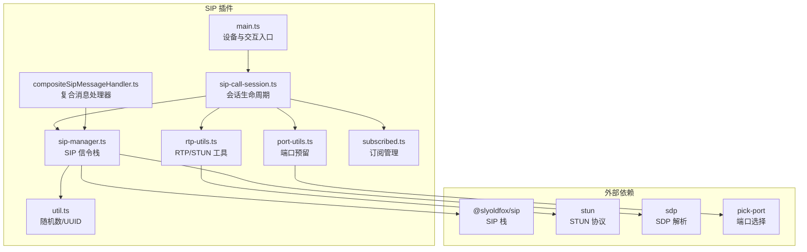
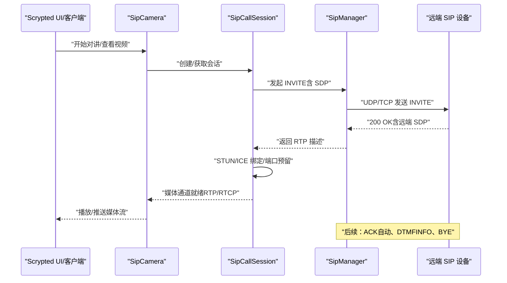
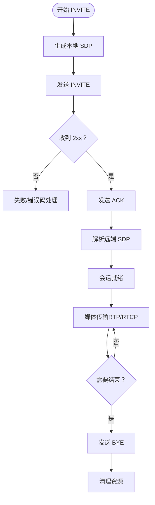
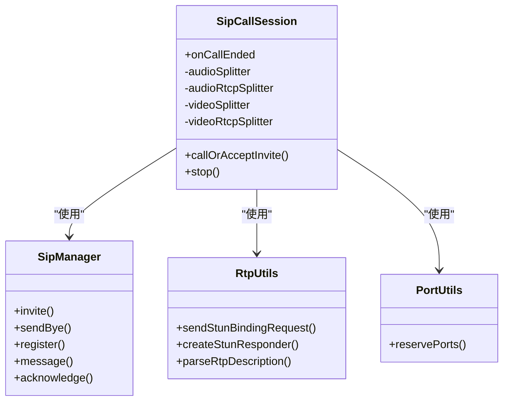
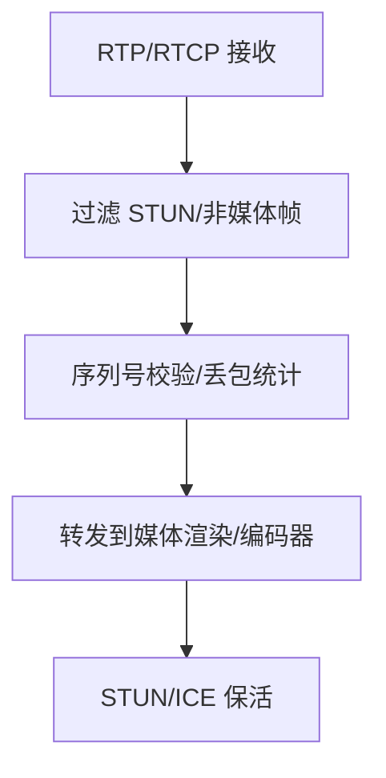
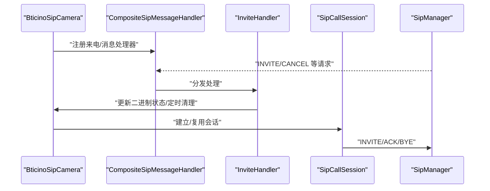
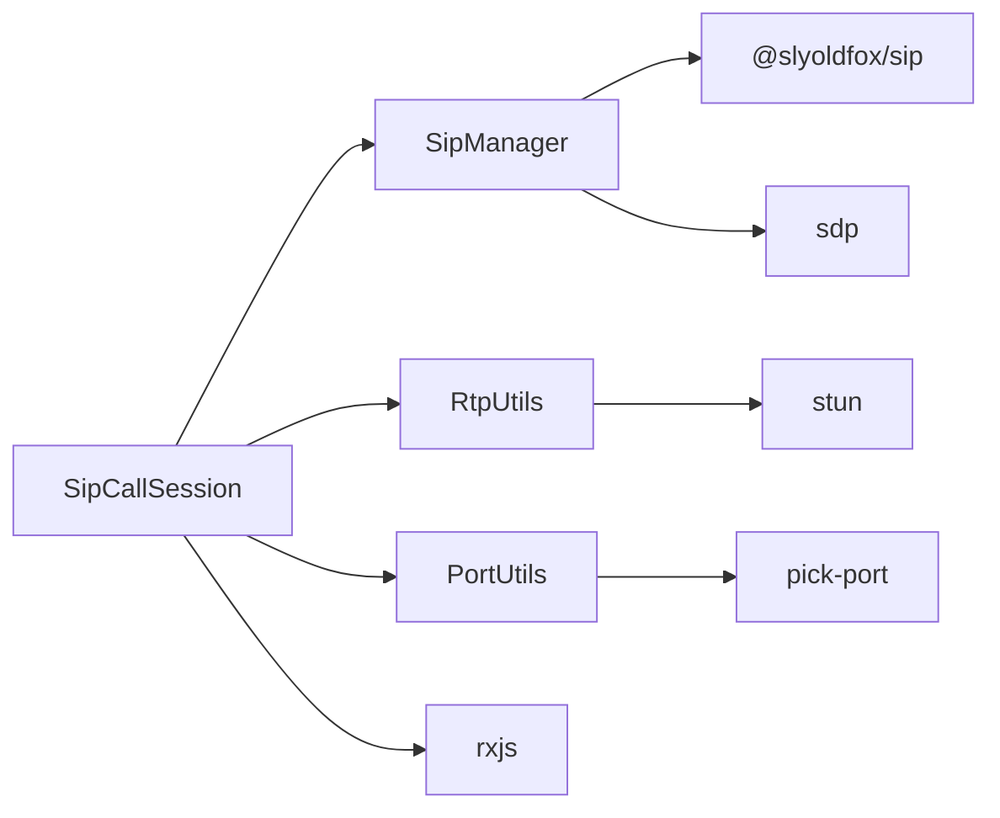

# SIP 协议插件开发

<cite>
**本文引用的文件**
- [plugins/sip/src/main.ts](file://plugins/sip/src/main.ts)
- [plugins/sip/src/sip-manager.ts](file://plugins/sip/src/sip-manager.ts)
- [plugins/sip/src/sip-call-session.ts](file://plugins/sip/src/sip-call-session.ts)
- [plugins/sip/src/rtp-utils.ts](file://plugins/sip/src/rtp-utils.ts)
- [plugins/sip/src/port-utils.ts](file://plugins/sip/src/port-utils.ts)
- [plugins/sip/src/util.ts](file://plugins/sip/src/util.ts)
- [plugins/sip/src/subscribed.ts](file://plugins/sip/src/subscribed.ts)
- [plugins/sip/src/compositeSipMessageHandler.ts](file://plugins/sip/src/compositeSipMessageHandler.ts)
- [plugins/sip/README.md](file://plugins/sip/README.md)
- [plugins/sip/package.json](file://plugins/sip/package.json)
- [plugins/bticino/src/bticino-camera.ts](file://plugins/bticino/src/bticino-camera.ts)
- [plugins/bticino/src/bticino-inviteHandler.ts](file://plugins/bticino/src/bticino-inviteHandler.ts)
- [plugins/hikvision-doorbell/src/sip-manager.ts](file://plugins/hikvision-doorbell/src/sip-manager.ts)
</cite>

## 目录
1. [简介](#简介)
2. [项目结构](#项目结构)
3. [核心组件](#核心组件)
4. [架构总览](#架构总览)
5. [详细组件分析](#详细组件分析)
6. [依赖关系分析](#依赖关系分析)
7. [性能考量](#性能考量)
8. [故障排查指南](#故障排查指南)
9. [结论](#结论)
10. [附录：配置与使用示例](#附录配置与使用示例)

## 简介
本文件面向在 Scrypted 平台上开发 SIP 协议插件的工程师，系统化阐述 SIP 信令与 RTP 媒体在 VoIP 场景下的实现方式与集成架构。内容覆盖：
- SIP 信令处理流程（INVITE、SDP、ACK、BYE）
- 会话管理（状态跟踪、媒体绑定、超时与清理）
- RTP 处理（音频编解码、STUN/ICE 绑定、Jitter Buffer 思路、DTMF）
- 设备创建与配置（账号、注册、通话建立）
- 与门禁、对讲等场景的集成
- 错误处理、网络异常恢复与性能优化建议

## 项目结构
SIP 插件位于 plugins/sip，核心模块围绕“SIP 信令 + RTP 媒体”两条主线展开，并通过 Scrypted SDK 提供设备能力。

图示来源
- [plugins/sip/src/main.ts:15-498](file://plugins/sip/src/main.ts#L15-L498)
- [plugins/sip/src/sip-manager.ts:148-533](file://plugins/sip/src/sip-manager.ts#L148-L533)
- [plugins/sip/src/sip-call-session.ts:12-206](file://plugins/sip/src/sip-call-session.ts#L12-L206)
- [plugins/sip/src/rtp-utils.ts:1-131](file://plugins/sip/src/rtp-utils.ts#L1-L131)
- [plugins/sip/src/port-utils.ts:1-63](file://plugins/sip/src/port-utils.ts#L1-L63)
- [plugins/sip/src/util.ts:1-15](file://plugins/sip/src/util.ts#L1-L15)
- [plugins/sip/src/subscribed.ts:1-14](file://plugins/sip/src/subscribed.ts#L1-L14)
- [plugins/sip/src/compositeSipMessageHandler.ts:1-15](file://plugins/sip/src/compositeSipMessageHandler.ts#L1-L15)

章节来源
- [plugins/sip/README.md:1-4](file://plugins/sip/README.md#L1-L4)
- [plugins/sip/package.json:1-50](file://plugins/sip/package.json#L1-L50)

## 核心组件
- SipCamProvider/SipCamera：Scrypted 设备提供者与门铃设备实现，负责设备发现、设置项、双向语音、视频流输出。
- SipManager：SIP 信令栈封装，负责 INVITE/ACK/BYE/REGISTER/MESSAGE 等请求发送与响应处理、SDP 解析、GRUU/DNS 域名改写、日志与调试。
- SipCallSession：会话生命周期管理，负责 RTP/RTCP 分离器、STUN/ICE 绑定、端口预留、会话结束清理。
- RtpUtils：RTP/RTCP 消息解析、payload 类型判断、序列号提取、STUN 请求/响应处理、ICE SRTP 参数解析。
- PortUtils：连续端口预留，避免 FFmpeg 默认占用下一个端口导致冲突。
- CompositeSipMessageHandler：组合式 SIP 请求处理器，便于扩展多场景处理逻辑（如 Bticino 的来电事件）。

章节来源
- [plugins/sip/src/main.ts:15-498](file://plugins/sip/src/main.ts#L15-L498)
- [plugins/sip/src/sip-manager.ts:148-533](file://plugins/sip/src/sip-manager.ts#L148-L533)
- [plugins/sip/src/sip-call-session.ts:12-206](file://plugins/sip/src/sip-call-session.ts#L12-L206)
- [plugins/sip/src/rtp-utils.ts:1-131](file://plugins/sip/src/rtp-utils.ts#L1-L131)
- [plugins/sip/src/port-utils.ts:1-63](file://plugins/sip/src/port-utils.ts#L1-L63)
- [plugins/sip/src/compositeSipMessageHandler.ts:1-15](file://plugins/sip/src/compositeSipMessageHandler.ts#L1-L15)

## 架构总览
SIP 插件在 Scrypted 中以 DeviceProvider 形式暴露设备能力，设备通过 SIP 与远端（门禁/对讲机）进行信令交互，随后建立 RTP 媒体通道完成音视频传输。整体流程如下：

图示来源
- [plugins/sip/src/sip-manager.ts:413-478](file://plugins/sip/src/sip-manager.ts#L413-L478)
- [plugins/sip/src/sip-call-session.ts:99-174](file://plugins/sip/src/sip-call-session.ts#L99-L174)
- [plugins/sip/src/main.ts:167-264](file://plugins/sip/src/main.ts#L167-L264)

## 详细组件分析

### SIP 信令处理（INVITE/ACK/BYE/REGISTER/MESSAGE）
- INVITE：构造本地 SDP（音频/视频），发送 INVITE；收到 200 OK 后自动发送 ACK，解析远端 SDP 获取媒体地址与端口。
- ACK：由 SipManager 在收到 2xx 时异步发送，确保会话建立。
- BYE：主动结束会话，带超时保护。
- REGISTER：向 Registrar 注册 UA，支持过期时间与可选认证。
- MESSAGE：发送纯文本消息（如 Bticino 的 ASWM 状态查询/控制）。
- 域名与 GRUU 改写：针对特定设备（如 Bticino）在发送前重写 To/From/URI，保证 DNS 解析正确性。

图示来源
- [plugins/sip/src/sip-manager.ts:310-386](file://plugins/sip/src/sip-manager.ts#L310-L386)
- [plugins/sip/src/sip-manager.ts:413-478](file://plugins/sip/src/sip-manager.ts#L413-L478)
- [plugins/sip/src/sip-manager.ts:517-522](file://plugins/sip/src/sip-manager.ts#L517-L522)

章节来源
- [plugins/sip/src/sip-manager.ts:148-533](file://plugins/sip/src/sip-manager.ts#L148-L533)

### 会话管理与媒体绑定
- 端口预留：使用连续 UDP 端口，避免 FFmpeg 默认占用下一个端口引发冲突。
- RTP/RTCP 分离：为音频/视频分别创建 UDP 分离器，必要时启用 rtcp-mux。
- STUN/ICE：若远端 SDP 包含 ICE 凭据，则进行 STUN 绑定并维持连接；否则周期性发送 STUN 保持 NAT 穿越。
- 会话结束：统一通过 onCallEnded 订阅触发清理，关闭 sockets、销毁 SIP 管理器。

图示来源
- [plugins/sip/src/sip-call-session.ts:12-206](file://plugins/sip/src/sip-call-session.ts#L12-L206)
- [plugins/sip/src/sip-manager.ts:148-533](file://plugins/sip/src/sip-manager.ts#L148-L533)
- [plugins/sip/src/rtp-utils.ts:1-131](file://plugins/sip/src/rtp-utils.ts#L1-L131)
- [plugins/sip/src/port-utils.ts:1-63](file://plugins/sip/src/port-utils.ts#L1-L63)

章节来源
- [plugins/sip/src/sip-call-session.ts:12-206](file://plugins/sip/src/sip-call-session.ts#L12-L206)
- [plugins/sip/src/rtp-utils.ts:1-131](file://plugins/sip/src/rtp-utils.ts#L1-L131)
- [plugins/sip/src/port-utils.ts:1-63](file://plugins/sip/src/port-utils.ts#L1-L63)

### RTP 流处理与 Jitter Buffer
- RTP/RTCP：通过 dgram 分离器接收/转发，区分 STUN 与媒体数据，统计序列号变化评估丢包。
- 编解码与格式：SIP 插件侧默认使用 PCMU（音频），Bticino 示例中使用 Speex/H.264；具体编解码策略由远端设备与 SDP 决定。
- Jitter Buffer：当前实现未内置专用缓冲区，但通过 STUN/ICE 保持 NAT 穿越与端口开放，降低丢包与抖动影响；如需更强健的缓冲，可在媒体链路层引入 FFmpeg 的音频缓冲或自定义队列。

图示来源
- [plugins/sip/src/rtp-utils.ts:35-101](file://plugins/sip/src/rtp-utils.ts#L35-L101)
- [plugins/sip/src/sip-call-session.ts:113-159](file://plugins/sip/src/sip-call-session.ts#L113-L159)

章节来源
- [plugins/sip/src/rtp-utils.ts:1-131](file://plugins/sip/src/rtp-utils.ts#L1-L131)
- [plugins/sip/src/sip-call-session.ts:99-174](file://plugins/sip/src/sip-call-session.ts#L99-L174)

### DTMF 与消息扩展
- DTMF：通过 INFO 携带 application/dtmf-relay 内容发送按键事件。
- 文本消息：通过 MESSAGE 发送纯文本，适用于状态查询或控制指令（如 Bticino 的 ASWM 开关）。

章节来源
- [plugins/sip/src/sip-manager.ts:400-408](file://plugins/sip/src/sip-manager.ts#L400-L408)
- [plugins/sip/src/sip-manager.ts:501-515](file://plugins/sip/src/sip-manager.ts#L501-L515)
- [plugins/bticino/src/bticino-inviteHandler.ts:1-32](file://plugins/bticino/src/bticino-inviteHandler.ts#L1-L32)

### 设备与场景集成
- 门铃/对讲设备：SipCamera 实现 Intercom/Camera/VideoCamera/BinarySensor，支持双向语音与视频流输出。
- Bticino 场景：通过 CompositeSipMessageHandler 与 InviteHandler 处理来电事件，结合 PersistentSipManager 实现长连接与状态管理。
- Hikvision 门铃：独立的 SIP 管理器实现，展示不同厂商的 INVITE/ACK/BYE 状态机与注册流程。

图示来源
- [plugins/bticino/src/bticino-camera.ts:34-670](file://plugins/bticino/src/bticino-camera.ts#L34-L670)
- [plugins/bticino/src/bticino-inviteHandler.ts:1-32](file://plugins/bticino/src/bticino-inviteHandler.ts#L1-L32)
- [plugins/sip/src/compositeSipMessageHandler.ts:1-15](file://plugins/sip/src/compositeSipMessageHandler.ts#L1-L15)

章节来源
- [plugins/bticino/src/bticino-camera.ts:34-670](file://plugins/bticino/src/bticino-camera.ts#L34-L670)
- [plugins/bticino/src/bticino-inviteHandler.ts:1-32](file://plugins/bticino/src/bticino-inviteHandler.ts#L1-L32)
- [plugins/hikvision-doorbell/src/sip-manager.ts:52-750](file://plugins/hikvision-doorbell/src/sip-manager.ts#L52-L750)

## 依赖关系分析
- 内部依赖：SipCallSession 依赖 SipManager、RtpUtils、PortUtils；SipManager 依赖 @slyoldfox/sip、sdp；RtpUtils 依赖 stun。
- 外部依赖：pick-port 用于端口预留；rxjs 用于事件与订阅管理；Scrypted SDK 提供设备接口与媒体转换。

图示来源
- [plugins/sip/src/sip-call-session.ts:12-206](file://plugins/sip/src/sip-call-session.ts#L12-L206)
- [plugins/sip/src/sip-manager.ts:148-533](file://plugins/sip/src/sip-manager.ts#L148-L533)
- [plugins/sip/src/rtp-utils.ts:1-131](file://plugins/sip/src/rtp-utils.ts#L1-L131)
- [plugins/sip/src/port-utils.ts:1-63](file://plugins/sip/src/port-utils.ts#L1-L63)
- [plugins/sip/package.json:36-44](file://plugins/sip/package.json#L36-L44)

章节来源
- [plugins/sip/package.json:1-50](file://plugins/sip/package.json#L1-L50)

## 性能考量
- NAT 穿越与保活：优先启用 ICE（STUN Binding）；若不支持则周期性发送 STUN 保持端口开放。
- 端口预留：连续端口分配避免 FFmpeg 默认抢占下一个端口导致失败。
- 媒体路径：尽量减少不必要的转码，利用 FFmpeg 的“复制”模式传输音频/视频，降低 CPU 占用。
- 事件驱动：使用 RxJS 订阅会话结束与 STUN 定时器，避免轮询带来的开销。
- 日志与调试：开启 debugSip 可输出完整 SIP 报文，便于定位问题，但生产环境建议关闭以减少 IO。

## 故障排查指南
- INVITE 失败：检查远端地址、域名改写（domain/from/to）、网络连通性与防火墙。
- 无媒体：确认远端 SDP 是否包含 ICE 凭据；若无 ICE，需确保 STUN/保活正常工作。
- BYE 未达：BYE 已带超时保护，若仍无法结束，检查网络阻断或远端异常。
- 端口冲突：使用 reservePorts 连续预留端口，避免 FFmpeg 默认端口被占用。
- DTMF 不生效：确认 Content-Type 为 application/dtmf-relay，且远端支持该载荷。

章节来源
- [plugins/sip/src/sip-manager.ts:310-386](file://plugins/sip/src/sip-manager.ts#L310-L386)
- [plugins/sip/src/sip-call-session.ts:113-159](file://plugins/sip/src/sip-call-session.ts#L113-L159)
- [plugins/sip/src/port-utils.ts:1-63](file://plugins/sip/src/port-utils.ts#L1-L63)

## 结论
SIP 插件在 Scrypted 中通过清晰的分层设计实现了 SIP 信令与 RTP 媒体的协同：SipManager 负责协议细节，SipCallSession 管理会话生命周期，RtpUtils 提供 STUN/ICE 能力，PortUtils 保障端口稳定。结合 Bticino/Hikvision 等场景，插件可灵活适配多种设备与业务形态。建议在生产环境中强化错误处理、完善日志与监控，并根据实际网络条件调整保活策略与缓冲策略。

## 附录：配置与使用示例

### SIP 设备创建与配置
- 设备类型：门铃（Doorbell），具备 Intercom、Camera、VideoCamera、BinarySensor 能力。
- 关键设置项（SipCamera）：
  - 用户名/密码：用于外链快照访问（可选）
  - RTSP 流 URL：相机提供的 RTSP 地址（可多路）
  - SIP From/To：SIP URI，From 中包含本地监听 IP 与端口（默认 5060）

章节来源
- [plugins/sip/src/main.ts:41-104](file://plugins/sip/src/main.ts#L41-L104)

### SIP 账号与注册
- 使用 REGISTER 将 UA 注册到 Registrar，设置过期时间与 Contact。
- 若远端要求认证，SipManager 内部已处理域名改写与 GRUU 扩展头。

章节来源
- [plugins/sip/src/sip-manager.ts:483-496](file://plugins/sip/src/sip-manager.ts#L483-L496)

### 通话建立流程
- 本地生成 SDP（音频/视频），发送 INVITE。
- 收到 200 OK 后自动发送 ACK，并解析远端 SDP。
- 建立 RTP/RTCP 分离器，进行 STUN/ICE 绑定或周期性 STUN 保活。
- 媒体通道建立后，开始播放/推送媒体流。

章节来源
- [plugins/sip/src/sip-manager.ts:413-478](file://plugins/sip/src/sip-manager.ts#L413-L478)
- [plugins/sip/src/sip-call-session.ts:99-174](file://plugins/sip/src/sip-call-session.ts#L99-L174)

### 与门禁/对讲场景集成
- Bticino：通过 CompositeSipMessageHandler 与 InviteHandler 处理来电事件，BinarySensor 表示按钮按下；PersistentSipManager 保持会话可用。
- Hikvision 门铃：独立 SIP 管理器，实现 INVITE/ACK/BYE 状态机与注册流程。

章节来源
- [plugins/bticino/src/bticino-camera.ts:34-670](file://plugins/bticino/src/bticino-camera.ts#L34-L670)
- [plugins/bticino/src/bticino-inviteHandler.ts:1-32](file://plugins/bticino/src/bticino-inviteHandler.ts#L1-L32)
- [plugins/hikvision-doorbell/src/sip-manager.ts:52-750](file://plugins/hikvision-doorbell/src/sip-manager.ts#L52-L750)