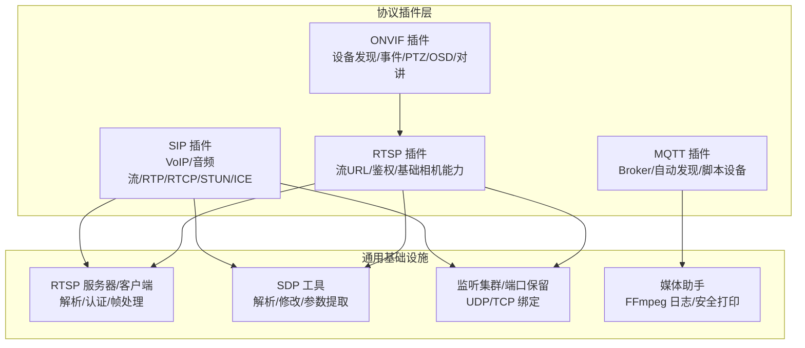
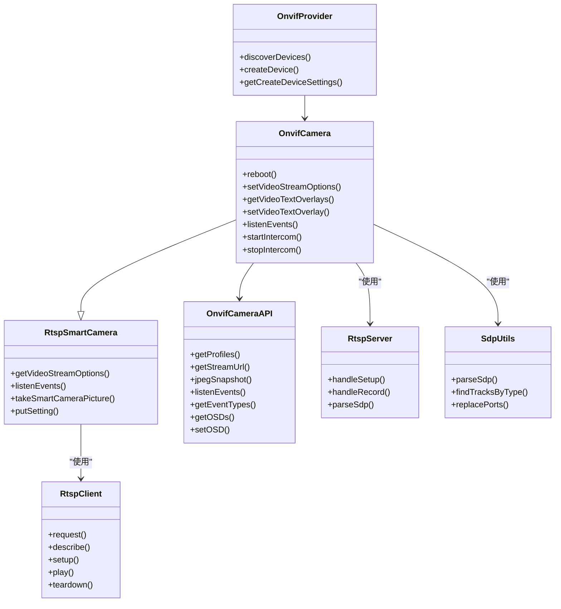
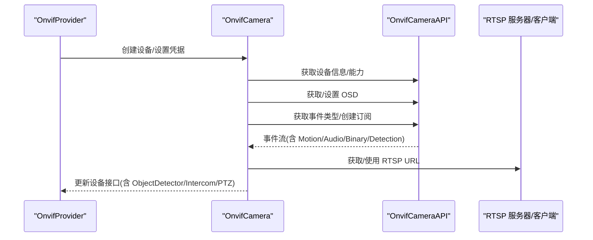
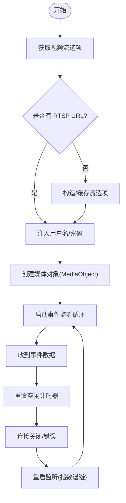
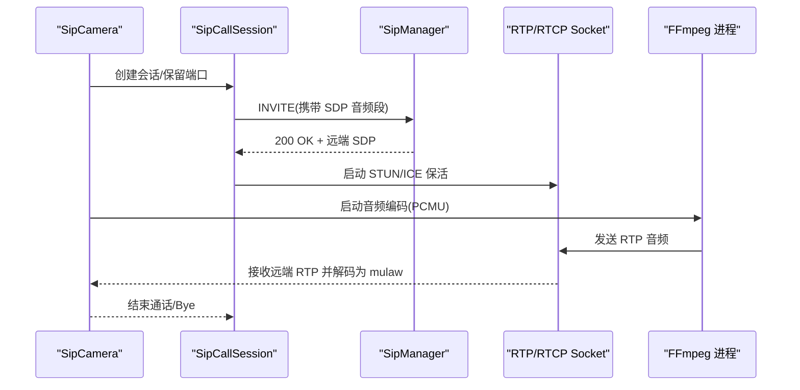
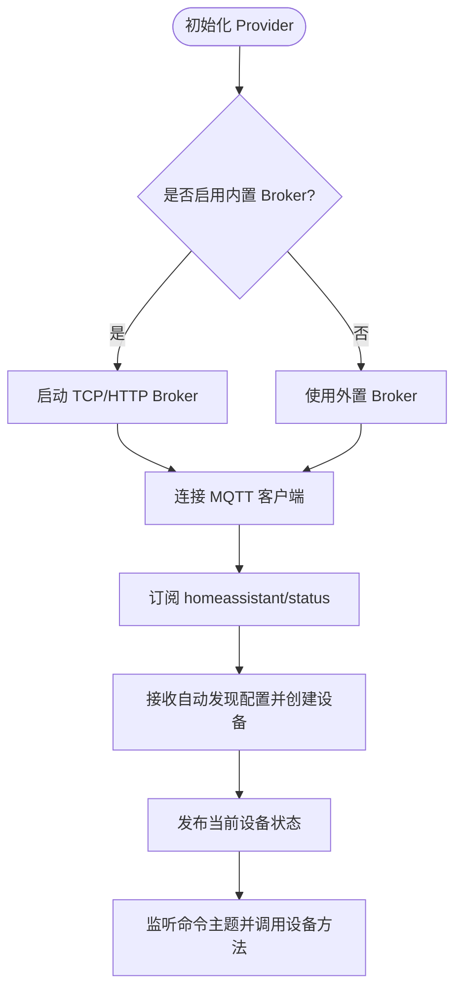
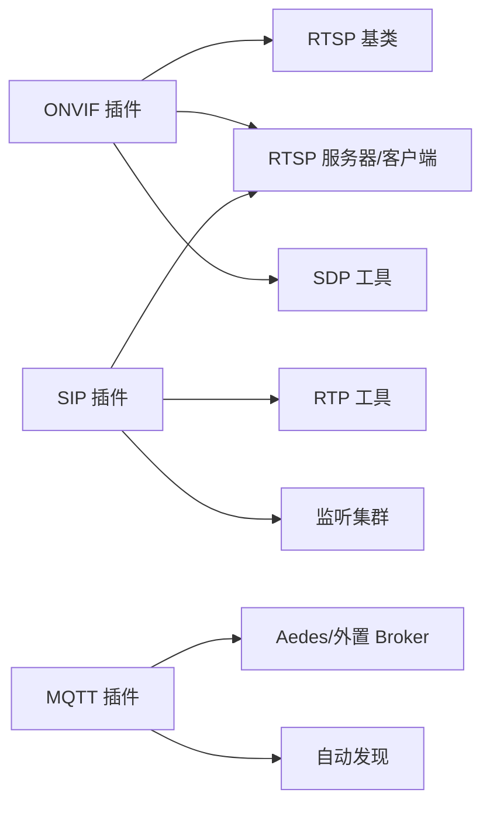

# 协议插件开发

<cite>
**本文引用的文件**
- [plugins/onvif/src/main.ts](file://plugins/onvif/src/main.ts)
- [plugins/onvif/src/onvif-api.ts](file://plugins/onvif/src/onvif-api.ts)
- [plugins/onvif/src/onvif-events.ts](file://plugins/onvif/src/onvif-events.ts)
- [plugins/rtsp/src/rtsp.ts](file://plugins/rtsp/src/rtsp.ts)
- [plugins/rtsp/src/main.ts](file://plugins/rtsp/src/main.ts)
- [common/src/rtsp-server.ts](file://common/src/rtsp-server.ts)
- [common/src/sdp-utils.ts](file://common/src/sdp-utils.ts)
- [plugins/sip/src/main.ts](file://plugins/sip/src/main.ts)
- [plugins/sip/src/sip-call-session.ts](file://plugins/sip/src/sip-call-session.ts)
- [plugins/sip/src/rtp-utils.ts](file://plugins/sip/src/rtp-utils.ts)
- [plugins/mqtt/src/main.ts](file://plugins/mqtt/src/main.ts)
- [plugins/mqtt/src/autodiscovery.ts](file://plugins/mqtt/src/autodiscovery.ts)
- [plugins/mqtt/src/api/mqtt-client.ts](file://plugins/mqtt/src/api/mqtt-client.ts)
</cite>

## 目录
1. [引言](#引言)
2. [项目结构](#项目结构)
3. [核心组件](#核心组件)
4. [架构总览](#架构总览)
5. [详细组件分析](#详细组件分析)
6. [依赖关系分析](#依赖关系分析)
7. [性能考虑](#性能考虑)
8. [故障排查指南](#故障排查指南)
9. [结论](#结论)
10. [附录](#附录)

## 引言
本技术指南面向 Scrypted 协议插件开发者，系统讲解如何基于 Scrypted 的统一框架开发网络协议插件，覆盖 RTSP、ONVIF、SIP、MQTT 等协议的适配与集成要点。文档从设计原理、实现模式、数据解析、消息处理到流媒体处理、事件订阅、信令协商、主题订阅与发布、连接管理等方面进行深入剖析，并提供错误处理、连接重试、性能优化等最佳实践，帮助开发者快速构建稳定高效的协议插件。

## 项目结构
Scrypted 将协议能力抽象为 Provider 与 Camera 基类，配合通用的媒体与网络工具（如 RTSP 解析器、SDP 工具、监听集群等），形成可复用的插件开发骨架。ONVIF 插件在 RTSP 基础上扩展了设备发现、事件订阅、PTZ 控制、OSD 文字叠加、两步语音对讲等能力；SIP 插件实现了 VoIP 通话、RTP/RTCP 传输、STUN/ICE 辅助、FFmpeg 音频编解码与转发；MQTT 插件支持内置/外置 Broker、自动发现 Home Assistant、脚本化设备与状态发布订阅；RTSP 插件提供统一的流媒体 URL 管理与鉴权注入。

图示来源
- [plugins/onvif/src/main.ts:1-622](file://plugins/onvif/src/main.ts#L1-L622)
- [plugins/rtsp/src/rtsp.ts:1-383](file://plugins/rtsp/src/rtsp.ts#L1-L383)
- [common/src/rtsp-server.ts:1-800](file://common/src/rtsp-server.ts#L1-L800)
- [common/src/sdp-utils.ts:1-411](file://common/src/sdp-utils.ts#L1-L411)
- [plugins/sip/src/main.ts:1-498](file://plugins/sip/src/main.ts#L1-L498)
- [plugins/mqtt/src/main.ts:1-629](file://plugins/mqtt/src/main.ts#L1-L629)

章节来源
- [plugins/onvif/src/main.ts:1-622](file://plugins/onvif/src/main.ts#L1-L622)
- [plugins/rtsp/src/rtsp.ts:1-383](file://plugins/rtsp/src/rtsp.ts#L1-L383)
- [common/src/rtsp-server.ts:1-800](file://common/src/rtsp-server.ts#L1-L800)
- [common/src/sdp-utils.ts:1-411](file://common/src/sdp-utils.ts#L1-L411)
- [plugins/sip/src/main.ts:1-498](file://plugins/sip/src/main.ts#L1-L498)
- [plugins/mqtt/src/main.ts:1-629](file://plugins/mqtt/src/main.ts#L1-L629)

## 核心组件
- ONVIF 智能相机与 Provider：继承 RTSP 智能相机基类，扩展设备信息、事件订阅、OSD 文字叠加、两步语音对讲、自动配置编码参数、PTZ 混入提供者等。
- RTSP 相机与 Provider：提供 RTSP 流 URL 管理、用户名密码注入、视频流选项、事件监听循环与重连、端口与地址覆盖设置。
- RTSP 服务器/客户端：实现 RTSP 信令解析、认证（Basic/Digest）、TCP 复用数据帧、SDP 提取、H264/H265 NALU 类型识别与关键帧定位。
- SDP 工具：解析/生成/修改 SDP，提取负载类型、参数集（SPS/PPS/VPS）、媒体段方向与控制标识，便于 RTP/RTCP 参数协商。
- SIP 会话与 RTP 工具：封装 SIP INVITE/OK/Bye 流程，RTP/RTCP 分离或复用，STUN/ICE 辅助打洞保活，RTP 负载类型与序列号处理。
- MQTT Provider 与自动发现：内置/外置 Broker、自动发现 Home Assistant、脚本化设备、状态发布与方法调用订阅、颜色温度/HSV 映射。
- 监听集群与媒体助手：统一的端口保留与绑定策略、FFmpeg 安全打印与日志输出，保障多实例与跨平台兼容性。

章节来源
- [plugins/onvif/src/main.ts:16-332](file://plugins/onvif/src/main.ts#L16-L332)
- [plugins/rtsp/src/rtsp.ts:21-383](file://plugins/rtsp/src/rtsp.ts#L21-L383)
- [common/src/rtsp-server.ts:279-800](file://common/src/rtsp-server.ts#L279-L800)
- [common/src/sdp-utils.ts:160-411](file://common/src/sdp-utils.ts#L160-L411)
- [plugins/sip/src/main.ts:15-498](file://plugins/sip/src/main.ts#L15-L498)
- [plugins/mqtt/src/main.ts:349-629](file://plugins/mqtt/src/main.ts#L349-L629)

## 架构总览
下图展示了 ONVIF 插件如何在 RTSP 基础上扩展能力，以及与 ONVIF API、事件订阅、RTSP 服务器/客户端、SDP 工具之间的交互关系。

图示来源
- [plugins/onvif/src/main.ts:16-332](file://plugins/onvif/src/main.ts#L16-L332)
- [plugins/onvif/src/onvif-api.ts:53-399](file://plugins/onvif/src/onvif-api.ts#L53-L399)
- [common/src/rtsp-server.ts:279-383](file://common/src/rtsp-server.ts#L279-L383)
- [common/src/sdp-utils.ts:316-353](file://common/src/sdp-utils.ts#L316-L353)

章节来源
- [plugins/onvif/src/main.ts:16-332](file://plugins/onvif/src/main.ts#L16-L332)
- [plugins/onvif/src/onvif-api.ts:53-399](file://plugins/onvif/src/onvif-api.ts#L53-L399)
- [common/src/rtsp-server.ts:279-383](file://common/src/rtsp-server.ts#L279-L383)
- [common/src/sdp-utils.ts:316-353](file://common/src/sdp-utils.ts#L316-L353)

## 详细组件分析

### ONVIF 协议插件
- 设备发现：通过 onvif.Discovery 接收设备 Probe 响应，解析 XML 中的 XAddrs、Scopes，构造待发现设备列表，支持扫描与 Adopt。
- 事件订阅：创建 PullPoint 订阅，解析事件 Topic 与值，标准化为 Motion/Audio/Binary/Detection 等事件，带去抖动与超时控制。
- 编码配置：读取设备 Profile 与编码能力，动态选择 H264/H265、分辨率、帧率、码率范围，支持一键自动配置。
- OSD 文字叠加：查询/设置 OSD 文本，处理只读文本类型差异。
- 两步语音对讲：通过 OnvifIntercom 与 RTSP URL 进行双向音频播放与接收，结合事件与 UI 设置。
- PTZ 控制：通过混入提供者将 PTZ 能力附加到已发现的设备。

图示来源
- [plugins/onvif/src/main.ts:334-622](file://plugins/onvif/src/main.ts#L334-L622)
- [plugins/onvif/src/onvif-api.ts:53-399](file://plugins/onvif/src/onvif-api.ts#L53-L399)
- [plugins/onvif/src/onvif-events.ts:5-96](file://plugins/onvif/src/onvif-events.ts#L5-L96)

章节来源
- [plugins/onvif/src/main.ts:334-622](file://plugins/onvif/src/main.ts#L334-L622)
- [plugins/onvif/src/onvif-api.ts:53-399](file://plugins/onvif/src/onvif-api.ts#L53-L399)
- [plugins/onvif/src/onvif-events.ts:5-96](file://plugins/onvif/src/onvif-events.ts#L5-L96)

### RTSP 协议插件
- 流媒体处理：统一管理 RTSP 流 URL，注入用户名/密码，提供视频流选项与媒体对象创建。
- 事件监听循环：持续监听事件源，遇到错误/空闲超时自动重启监听，保证长连接稳定性。
- SDP 协商：通过 SDP 工具解析媒体段、负载类型、参数集，用于后续 RTP/RTCP 参数与预缓冲关键帧定位。
- RTSP 服务器/客户端：支持 Basic/Digest 认证、TCP 数据帧复用、OPTIONS/DESCRIBE/SETUP/PLAY/TEARDOWN 等信令流程。

图示来源
- [plugins/rtsp/src/rtsp.ts:21-145](file://plugins/rtsp/src/rtsp.ts#L21-L145)
- [plugins/rtsp/src/rtsp.ts:153-226](file://plugins/rtsp/src/rtsp.ts#L153-L226)
- [common/src/rtsp-server.ts:379-800](file://common/src/rtsp-server.ts#L379-L800)

章节来源
- [plugins/rtsp/src/rtsp.ts:21-145](file://plugins/rtsp/src/rtsp.ts#L21-L145)
- [plugins/rtsp/src/rtsp.ts:153-226](file://plugins/rtsp/src/rtsp.ts#L153-L226)
- [common/src/rtsp-server.ts:379-800](file://common/src/rtsp-server.ts#L379-L800)

### SIP 协议插件
- VoIP 通话：通过 SipCallSession 发起 INVITE，协商 SDP（音频 PCMU），建立 RTP/RTCP 通道。
- 音频流处理：使用 FFmpeg 将本地音频流编码为 PCMU，经 RTP 发送至远端；同时接收远端 RTP 并解码为 mulaw 输出。
- 信令协商：支持 STUN/ICE 打洞保活，若不支持则周期发送 STUN Binding 请求维持端口映射。
- 端口管理：通过监听集群保留连续的 RTP/RTCP 端口，确保本地与远端端口正确映射。

图示来源
- [plugins/sip/src/main.ts:15-498](file://plugins/sip/src/main.ts#L15-L498)
- [plugins/sip/src/sip-call-session.ts:12-206](file://plugins/sip/src/sip-call-session.ts#L12-L206)
- [plugins/sip/src/rtp-utils.ts:1-131](file://plugins/sip/src/rtp-utils.ts#L1-L131)

章节来源
- [plugins/sip/src/main.ts:15-498](file://plugins/sip/src/main.ts#L15-L498)
- [plugins/sip/src/sip-call-session.ts:12-206](file://plugins/sip/src/sip-call-session.ts#L12-L206)
- [plugins/sip/src/rtp-utils.ts:1-131](file://plugins/sip/src/rtp-utils.ts#L1-L131)

### MQTT 协议插件
- 连接管理：支持内置 Aedes Broker（TCP/HTTP）与外置 Broker，按需启用，支持用户名/密码认证。
- 主题订阅：自动发现 Home Assistant 设备，根据配置订阅状态主题，映射到 Scrypted 设备属性。
- 消息发布：将设备状态与方法调用发布到对应主题，支持 retain 与 QoS。
- 脚本化设备：提供脚本设备能力，允许用户编写 MQTT 处理脚本，动态订阅/发布消息。

图示来源
- [plugins/mqtt/src/main.ts:349-629](file://plugins/mqtt/src/main.ts#L349-L629)
- [plugins/mqtt/src/autodiscovery.ts:76-209](file://plugins/mqtt/src/autodiscovery.ts#L76-L209)

章节来源
- [plugins/mqtt/src/main.ts:349-629](file://plugins/mqtt/src/main.ts#L349-L629)
- [plugins/mqtt/src/autodiscovery.ts:76-209](file://plugins/mqtt/src/autodiscovery.ts#L76-L209)

## 依赖关系分析
- ONVIF 插件依赖 RTSP 基类与 RTSP 服务器/客户端，通过 OnvifCameraAPI 封装 onvif 库，使用 SDP 工具解析媒体参数。
- SIP 插件依赖监听集群与 RTP 工具，结合 FFmpeg 进行音频编解码与转发。
- MQTT 插件依赖 Aedes Broker 或外置 Broker，结合自动发现模块与脚本设备实现灵活的消息处理。
- 共享工具：RTSP 服务器/客户端与 SDP 工具被多个协议插件共享，提升一致性与可维护性。

图示来源
- [plugins/onvif/src/main.ts:16-332](file://plugins/onvif/src/main.ts#L16-L332)
- [common/src/rtsp-server.ts:279-383](file://common/src/rtsp-server.ts#L279-L383)
- [common/src/sdp-utils.ts:160-411](file://common/src/sdp-utils.ts#L160-L411)
- [plugins/sip/src/main.ts:15-498](file://plugins/sip/src/main.ts#L15-L498)
- [plugins/mqtt/src/main.ts:349-629](file://plugins/mqtt/src/main.ts#L349-L629)

章节来源
- [plugins/onvif/src/main.ts:16-332](file://plugins/onvif/src/main.ts#L16-L332)
- [common/src/rtsp-server.ts:279-383](file://common/src/rtsp-server.ts#L279-L383)
- [common/src/sdp-utils.ts:160-411](file://common/src/sdp-utils.ts#L160-L411)
- [plugins/sip/src/main.ts:15-498](file://plugins/sip/src/main.ts#L15-L498)
- [plugins/mqtt/src/main.ts:349-629](file://plugins/mqtt/src/main.ts#L349-L629)

## 性能考虑
- RTSP 预缓冲与关键帧定位：利用 SDP 工具与 RTSP 服务器解析器，定位 H264/H265 关键帧（SPS/IDR/CRA/VPS/SPS/PPS），减少首帧等待时间。
- 事件监听与空闲重连：RTSP 智能相机的事件监听循环在错误/空闲超时时自动重启，避免长时间无响应导致的连接失效。
- FFmpeg 安全与日志：统一使用安全打印与日志输出，避免大包日志影响性能；音频编码采用 PCMU（8kHz/单声道）以降低带宽与延迟。
- 端口保留与绑定：通过监听集群保留连续的 RTP/RTCP 端口，减少 NAT/防火墙问题带来的重试成本。
- MQTT 自动发现与状态发布：仅在连接建立后一次性发布状态，减少冗余消息；命令订阅采用精确主题匹配，降低 CPU 开销。

## 故障排查指南
- ONVIF 设备无事件或事件不稳定
  - 检查设备是否支持 WSPullPoint；若不支持，尝试直接订阅并观察事件流。
  - 对于运动事件缺失/误报，使用去抖动与超时机制，必要时切换为“开始/停止”事件模式。
  - 参考路径：[plugins/onvif/src/onvif-events.ts:5-96](file://plugins/onvif/src/onvif-events.ts#L5-L96)
- RTSP 认证失败或连接中断
  - 确认 Basic/Digest 认证头解析与重试逻辑；检查 URL 中用户名/密码注入是否正确。
  - 使用 RTSP 服务器/客户端的日志输出定位帧魔法校验失败或非法帧头。
  - 参考路径：[common/src/rtsp-server.ts:427-777](file://common/src/rtsp-server.ts#L427-L777)
- SIP 音频无声或卡顿
  - 确认 SDP 中音频负载类型为 PCMU；检查 RTP/RTCP 端口映射与 STUN/ICE 保活。
  - 若设备不支持 ICE，确认 STUN Binding 请求周期与端口保持策略。
  - 参考路径：[plugins/sip/src/rtp-utils.ts:1-131](file://plugins/sip/src/rtp-utils.ts#L1-L131)
- MQTT 无法连接或自动发现无效
  - 检查内置 Broker 是否启用及端口配置；确认 homeassistant/status 主题订阅与消息格式。
  - 核对自动发现配置的 unique_id 与节点标识，确保设备正确合并与绑定。
  - 参考路径：[plugins/mqtt/src/main.ts:349-629](file://plugins/mqtt/src/main.ts#L349-L629)

章节来源
- [plugins/onvif/src/onvif-events.ts:5-96](file://plugins/onvif/src/onvif-events.ts#L5-L96)
- [common/src/rtsp-server.ts:427-777](file://common/src/rtsp-server.ts#L427-L777)
- [plugins/sip/src/rtp-utils.ts:1-131](file://plugins/sip/src/rtp-utils.ts#L1-L131)
- [plugins/mqtt/src/main.ts:349-629](file://plugins/mqtt/src/main.ts#L349-L629)

## 结论
Scrypted 的协议插件开发以 Provider/Camera 基类为核心，结合 RTSP/SDP 工具、监听集群与媒体助手，形成统一的协议适配与流媒体处理框架。ONVIF 插件在 RTSP 基础上扩展了设备发现、事件订阅、OSD 与对讲；SIP 插件实现了完整的 VoIP 通话与 RTP/RTCP 传输；MQTT 插件提供了内置/外置 Broker 与自动发现能力。遵循本文的最佳实践，可在保证稳定性的同时获得良好的性能表现。

## 附录
- 开发框架建议
  - 使用 Provider/Camera 基类作为起点，按需扩展事件监听、流 URL 管理、认证注入与能力探测。
  - 对于需要复杂信令/媒体处理的协议，优先复用 RTSP/SDP 工具与监听集群，减少重复造轮子。
  - 对于脚本化需求，参考 MQTT 插件的脚本设备与自动发现模式，提供灵活的用户扩展能力。
- 错误处理与重试
  - 事件监听循环中对错误与空闲超时进行统一处理，避免资源泄漏与连接僵死。
  - SIP 与 RTSP 信令中区分认证失败与网络异常，采用差异化重试策略。
- 性能优化
  - 利用 SDP 工具与 RTSP 解析器进行关键帧定位与预缓冲，缩短首帧时间。
  - 采用 PCMU/8kHz/单声道音频与合适的 pkt_size，平衡质量与带宽。
  - 在 MQTT 中使用 retain 与精确主题订阅，降低消息冗余与 CPU 占用。