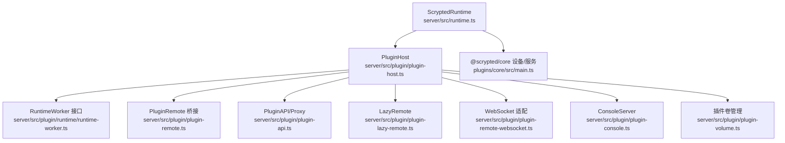
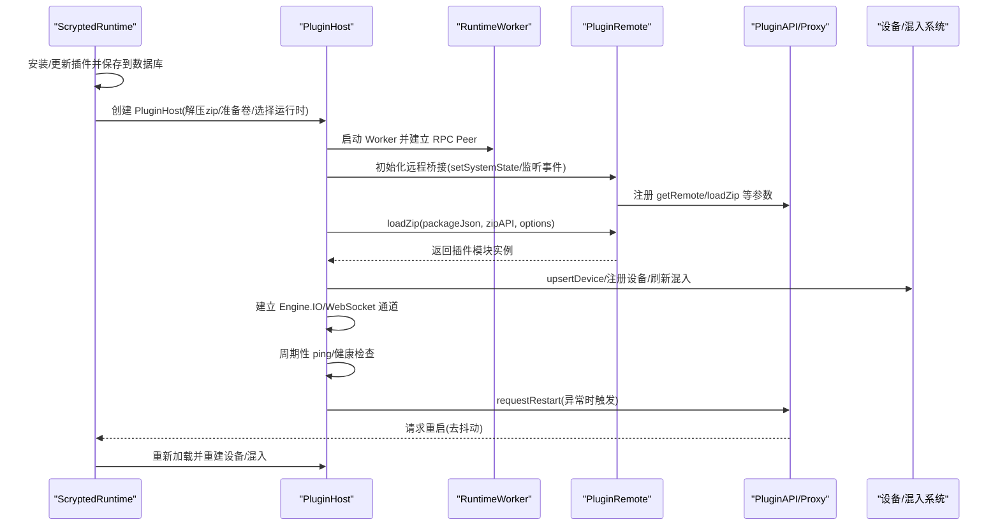
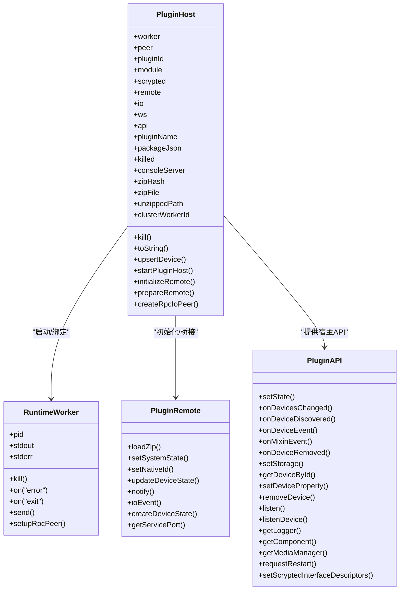
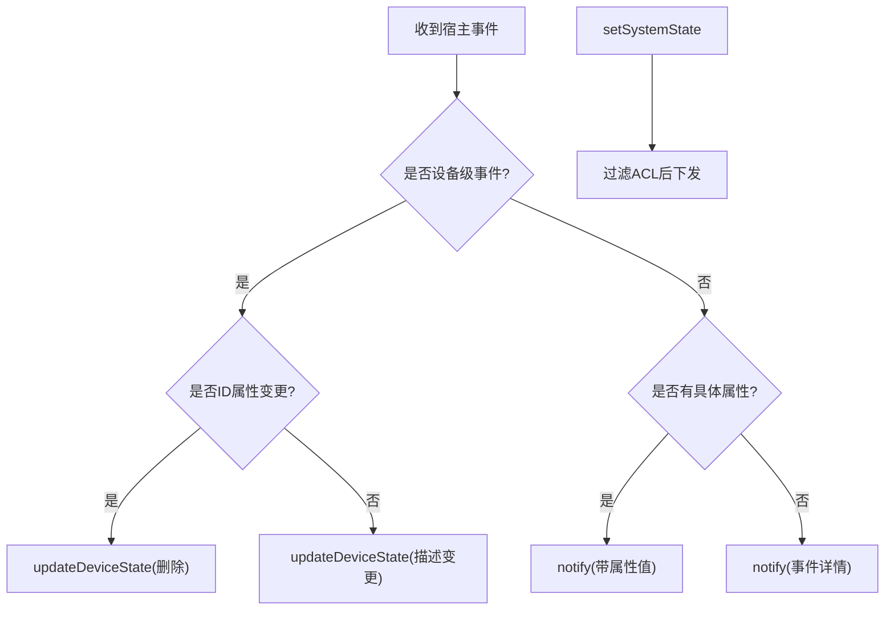
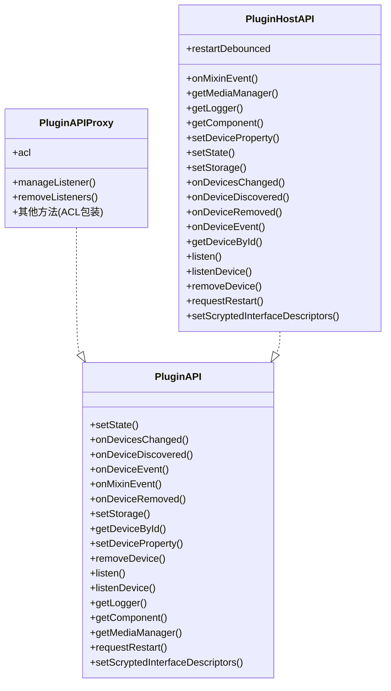
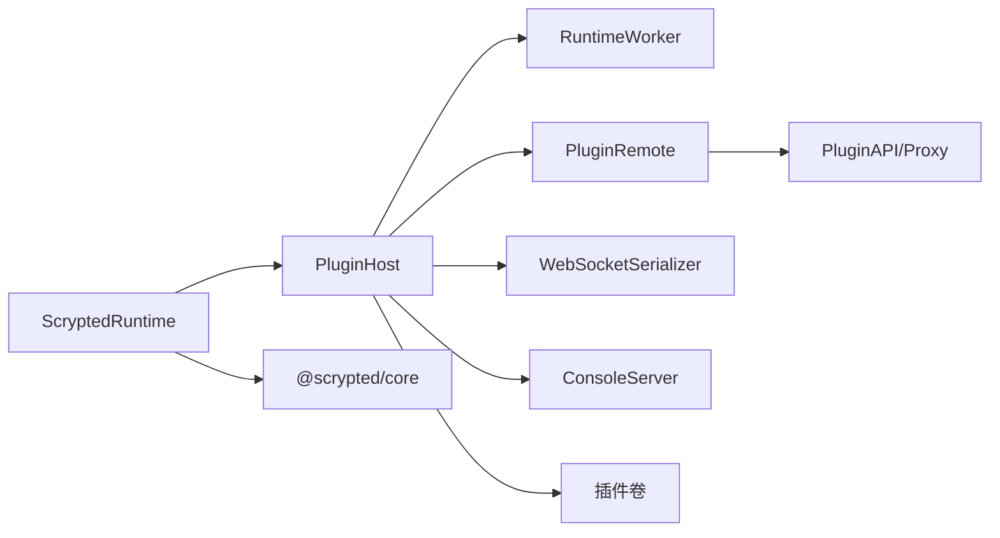

# 插件生命周期管理

<cite>
**本文引用的文件**
- [server/src/plugin/plugin-host.ts](file://server/src/plugin/plugin-host.ts)
- [server/src/plugin/plugin-remote.ts](file://server/src/plugin/plugin-remote.ts)
- [server/src/plugin/plugin-api.ts](file://server/src/plugin/plugin-api.ts)
- [server/src/plugin/plugin-host-api.ts](file://server/src/plugin/plugin-host-api.ts)
- [server/src/plugin/plugin-lazy-remote.ts](file://server/src/plugin/plugin-lazy-remote.ts)
- [server/src/plugin/plugin-remote-websocket.ts](file://server/src/plugin/plugin-remote-websocket.ts)
- [server/src/plugin/plugin-console.ts](file://server/src/plugin/plugin-console.ts)
- [server/src/plugin/runtime/runtime-worker.ts](file://server/src/plugin/runtime/runtime-worker.ts)
- [server/src/runtime.ts](file://server/src/runtime.ts)
- [server/src/plugin/plugin-volume.ts](file://server/src/plugin/plugin-volume.ts)
- [server/src/plugin/plugin-state-check.ts](file://server/src/plugin/plugin-state-check.ts)
- [plugins/core/src/main.ts](file://plugins/core/src/main.ts)
</cite>

## 目录
1. [引言](#引言)
2. [项目结构](#项目结构)
3. [核心组件](#核心组件)
4. [架构总览](#架构总览)
5. [详细组件分析](#详细组件分析)
6. [依赖关系分析](#依赖关系分析)
7. [性能考量](#性能考量)
8. [故障排除指南](#故障排除指南)
9. [结论](#结论)
10. [附录](#附录)

## 引言
本文件面向 Scrypted 插件生命周期管理，系统化阐述从插件加载、初始化、运行期管理到资源清理的全链路机制；解释宿主环境如何通过进程隔离与 RPC 通道实现稳定运行；说明插件间通信（RPC、事件、数据共享）与系统集成（设备注册、接口暴露、权限控制）；并给出热重载与更新、最佳实践与调试排障建议。

## 项目结构
围绕插件生命周期的关键目录与文件：
- server/src/plugin：插件宿主、远程桥接、API、WebSocket、控制台、卷管理、状态校验等
- server/src/runtime.ts：Scrypted 运行时入口，负责安装/卸载、重启、设备代理、HTTP/WebSocket/Engine.IO 等接入
- plugins/core/src/main.ts：核心内置插件示例，展示设备发现、服务端口、集群工作节点维护等

图示来源
- [server/src/runtime.ts:64-176](file://server/src/runtime.ts#L64-L176)
- [server/src/plugin/plugin-host.ts:38-224](file://server/src/plugin/plugin-host.ts#L38-L224)
- [server/src/plugin/plugin-remote.ts:13-92](file://server/src/plugin/plugin-remote.ts#L13-L92)
- [server/src/plugin/plugin-api.ts:15-39](file://server/src/plugin/plugin-api.ts#L15-L39)
- [server/src/plugin/plugin-lazy-remote.ts:10-74](file://server/src/plugin/plugin-lazy-remote.ts#L10-L74)
- [server/src/plugin/plugin-remote-websocket.ts:73-152](file://server/src/plugin/plugin-remote-websocket.ts#L73-L152)
- [server/src/plugin/plugin-console.ts:181-331](file://server/src/plugin/plugin-console.ts#L181-L331)
- [server/src/plugin/plugin-volume.ts:5-33](file://server/src/plugin/plugin-volume.ts#L5-L33)
- [plugins/core/src/main.ts:27-414](file://plugins/core/src/main.ts#L27-L414)

章节来源
- [server/src/runtime.ts:64-176](file://server/src/runtime.ts#L64-L176)
- [server/src/plugin/plugin-host.ts:38-224](file://server/src/plugin/plugin-host.ts#L38-L224)
- [server/src/plugin/plugin-remote.ts:13-92](file://server/src/plugin/plugin-remote.ts#L13-L92)
- [server/src/plugin/plugin-api.ts:15-39](file://server/src/plugin/plugin-api.ts#L15-L39)
- [server/src/plugin/plugin-lazy-remote.ts:10-74](file://server/src/plugin/plugin-lazy-remote.ts#L10-L74)
- [server/src/plugin/plugin-remote-websocket.ts:73-152](file://server/src/plugin/plugin-remote-websocket.ts#L73-L152)
- [server/src/plugin/plugin-console.ts:181-331](file://server/src/plugin/plugin-console.ts#L181-L331)
- [server/src/plugin/plugin-volume.ts:5-33](file://server/src/plugin/plugin-volume.ts#L5-L33)
- [plugins/core/src/main.ts:27-414](file://plugins/core/src/main.ts#L27-L414)

## 核心组件
- PluginHost：插件宿主，负责解压插件包、选择运行时、启动 Worker、建立 RPC Peer、设置 IO/WebSocket 通道、健康检查与自动重启、设备注册与状态同步、控制台服务等
- PluginRemote：在插件侧构建“远端”对象，注入系统状态、设备状态、事件通知、WebSocket 连接、媒体管理等能力
- PluginAPI/PluginAPIProxy：宿主向插件暴露的 API，支持设备变更、事件监听、日志、媒体、重启请求、接口描述符等；Proxy 层可按 ACL 进行访问控制
- LazyRemote：延迟远端，构造即入队命令，待真正连接后批量执行，保证状态上报顺序
- WebSocket 适配：将 Engine.IO/WebSocket 封装为 RPC 序列化对象，便于跨边界调用
- ConsoleServer：提供插件标准输出/错误流的读写端口，支持按设备/混入粒度的控制台
- 插件卷管理：确保插件工作目录存在，隔离存储与缓存
- 运行时 Worker 接口：抽象不同运行时（如 Node、自定义）的进程生命周期与消息通道

章节来源
- [server/src/plugin/plugin-host.ts:38-224](file://server/src/plugin/plugin-host.ts#L38-L224)
- [server/src/plugin/plugin-remote.ts:13-92](file://server/src/plugin/plugin-remote.ts#L13-L92)
- [server/src/plugin/plugin-api.ts:15-39](file://server/src/plugin/plugin-api.ts#L15-L39)
- [server/src/plugin/plugin-lazy-remote.ts:10-74](file://server/src/plugin/plugin-lazy-remote.ts#L10-L74)
- [server/src/plugin/plugin-remote-websocket.ts:73-152](file://server/src/plugin/plugin-remote-websocket.ts#L73-L152)
- [server/src/plugin/plugin-console.ts:181-331](file://server/src/plugin/plugin-console.ts#L181-L331)
- [server/src/plugin/plugin-volume.ts:5-33](file://server/src/plugin/plugin-volume.ts#L5-L33)
- [server/src/plugin/runtime/runtime-worker.ts:6-38](file://server/src/plugin/runtime/runtime-worker.ts#L6-L38)

## 架构总览
下图展示一次完整的插件生命周期：从运行时安装插件、创建宿主、解压与加载、建立 RPC/IO/WebSocket 通道、设备注册与事件传播、健康检查与自动重启、控制台与卷管理。

图示来源
- [server/src/runtime.ts:620-760](file://server/src/runtime.ts#L620-L760)
- [server/src/plugin/plugin-host.ts:122-224](file://server/src/plugin/plugin-host.ts#L122-L224)
- [server/src/plugin/plugin-remote.ts:109-318](file://server/src/plugin/plugin-remote.ts#L109-L318)
- [server/src/plugin/plugin-api.ts:15-39](file://server/src/plugin/plugin-api.ts#L15-L39)
- [server/src/plugin/plugin-host-api.ts:28-42](file://server/src/plugin/plugin-host-api.ts#L28-L42)

## 详细组件分析

### 组件一：PluginHost（插件宿主）
职责与流程要点：
- 解压与准备：根据插件 zip 计算哈希，解压至插件卷，准备运行时环境变量
- 运行时选择：依据 package.json 的 runtime 或设备声明的自定义运行时，选择对应 Worker Host
- Worker 启动：创建 RpcPeer，绑定 Worker 的 stdout/stderr，建立 ConsoleServer
- 远程桥接：setupPluginRemote 设置系统状态、事件监听、设备状态更新、WebSocket 连接
- Engine.IO/WebSocket：为插件提供 IO 通道，映射到设备的 EngineIOHandler
- 健康检查：周期性 ping，超时则请求重启
- 设备注册：upsertDevice 支持新设备发现、接口变化、刷新场景下的无效化与重建

图示来源
- [server/src/plugin/plugin-host.ts:38-224](file://server/src/plugin/plugin-host.ts#L38-L224)
- [server/src/plugin/runtime/runtime-worker.ts:6-38](file://server/src/plugin/runtime/runtime-worker.ts#L6-L38)
- [server/src/plugin/plugin-remote.ts:182-314](file://server/src/plugin/plugin-remote.ts#L182-L314)
- [server/src/plugin/plugin-api.ts:15-39](file://server/src/plugin/plugin-api.ts#L15-L39)

章节来源
- [server/src/plugin/plugin-host.ts:38-224](file://server/src/plugin/plugin-host.ts#L38-L224)
- [server/src/plugin/runtime/runtime-worker.ts:6-38](file://server/src/plugin/runtime/runtime-worker.ts#L6-L38)
- [server/src/plugin/plugin-remote.ts:182-314](file://server/src/plugin/plugin-remote.ts#L182-L314)
- [server/src/plugin/plugin-api.ts:15-39](file://server/src/plugin/plugin-api.ts#L15-L39)

### 组件二：PluginRemote（远程桥接）
职责与流程要点：
- 注入系统状态：setSystemState 将受 ACL 过滤后的系统状态下发给插件
- 事件分发：监听宿主事件，过滤后转发到插件；对设备级事件进行特殊处理（删除/描述变更）
- WebSocket：通过 WebSocketSerializer 将连接封装为 RPC 对象，供插件使用
- 加载插件：loadZip 接收 zipAPI 与选项，返回插件模块实例
- 设备状态：setNativeId/updateDeviceState/notify 提供设备状态与事件的双向同步

图示来源
- [server/src/plugin/plugin-remote.ts:26-85](file://server/src/plugin/plugin-remote.ts#L26-L85)
- [server/src/plugin/plugin-remote.ts:275-279](file://server/src/plugin/plugin-remote.ts#L275-L279)
- [server/src/plugin/plugin-remote.ts:238-273](file://server/src/plugin/plugin-remote.ts#L238-L273)

章节来源
- [server/src/plugin/plugin-remote.ts:13-92](file://server/src/plugin/plugin-remote.ts#L13-L92)
- [server/src/plugin/plugin-remote.ts:26-85](file://server/src/plugin/plugin-remote.ts#L26-L85)
- [server/src/plugin/plugin-remote.ts:275-279](file://server/src/plugin/plugin-remote.ts#L275-L279)
- [server/src/plugin/plugin-remote.ts:238-273](file://server/src/plugin/plugin-remote.ts#L238-L273)

### 组件三：PluginAPI 与 PluginAPIProxy（宿主 API）
职责与流程要点：
- 宿主向插件暴露统一 API，包括设备变更、事件、日志、媒体、重启、接口描述符等
- Proxy 层在 ACL 存在时拒绝敏感操作或过滤事件，确保访问安全
- 宿主 API 在 PluginHostAPI 中实现，包含设备属性设置、设备发现/移除、重启去抖动等

图示来源
- [server/src/plugin/plugin-api.ts:15-39](file://server/src/plugin/plugin-api.ts#L15-L39)
- [server/src/plugin/plugin-api.ts:71-158](file://server/src/plugin/plugin-api.ts#L71-L158)
- [server/src/plugin/plugin-host-api.ts:13-197](file://server/src/plugin/plugin-host-api.ts#L13-L197)

章节来源
- [server/src/plugin/plugin-api.ts:15-39](file://server/src/plugin/plugin-api.ts#L15-L39)
- [server/src/plugin/plugin-api.ts:71-158](file://server/src/plugin/plugin-api.ts#L71-L158)
- [server/src/plugin/plugin-host-api.ts:13-197](file://server/src/plugin/plugin-host-api.ts#L13-L197)

### 组件四：LazyRemote（延迟远端）
职责与流程要点：
- 构造即入队命令，等待远程就绪后再批量执行，避免状态上报顺序错乱
- 提供与 PluginRemote 相同的方法签名，内部异步等待远程可用

章节来源
- [server/src/plugin/plugin-lazy-remote.ts:10-74](file://server/src/plugin/plugin-lazy-remote.ts#L10-L74)

### 组件五：WebSocket 与 Engine.IO 通道
职责与流程要点：
- WebSocketSerializer 将连接封装为 RPC 对象，供插件侧使用
- PluginHost 在 Engine.IO 服务器上为每个连接建立 ioEvent 回调，转发到插件
- 插件通过 WebSocketConnection 发送/关闭消息，实现双向通信

章节来源
- [server/src/plugin/plugin-remote-websocket.ts:73-152](file://server/src/plugin/plugin-remote-websocket.ts#L73-L152)
- [server/src/plugin/plugin-host.ts:151-201](file://server/src/plugin/plugin-host.ts#L151-L201)

### 组件六：ConsoleServer（控制台）
职责与流程要点：
- 为插件 stdout/stderr 建立读写端口，支持按设备/混入粒度输出
- 控制台缓冲区上限与时间戳标记，便于调试与历史回溯
- 支持销毁与清理，释放网络资源

章节来源
- [server/src/plugin/plugin-console.ts:181-331](file://server/src/plugin/plugin-console.ts#L181-L331)

### 组件七：插件卷管理与状态校验
职责与流程要点：
- 插件卷：确保插件工作目录存在，隔离存储与缓存
- 状态校验：禁止对只读属性或 RPC 代理类型赋值，防止破坏设备描述与混入表

章节来源
- [server/src/plugin/plugin-volume.ts:5-33](file://server/src/plugin/plugin-volume.ts#L5-L33)
- [server/src/plugin/plugin-state-check.ts:5-24](file://server/src/plugin/plugin-state-check.ts#L5-L24)

### 组件八：运行时与自动重启
职责与流程要点：
- ScryptedRuntime 安装/卸载/重启插件，探测 Worker 错误/退出并自动重启
- 去抖动重启策略，避免频繁重启导致雪崩
- 插件设备探针：首次加载后对设备进行探测，确保接口可用

章节来源
- [server/src/runtime.ts:620-760](file://server/src/runtime.ts#L620-L760)
- [server/src/runtime.ts:644-689](file://server/src/runtime.ts#L644-L689)
- [server/src/runtime.ts:722-744](file://server/src/runtime.ts#L722-L744)

### 组件九：系统集成与设备注册
职责与流程要点：
- 设备注册：upsertDevice 支持新设备发现、接口变化、刷新场景下的无效化与重建
- 混入表重建：invalidatePluginMixins 与 invalidateMixins 保证混入链正确
- 权限控制：AccessControls 在 PluginRemote 侧过滤系统状态与事件

章节来源
- [server/src/plugin/plugin-host.ts:90-120](file://server/src/plugin/plugin-host.ts#L90-L120)
- [server/src/runtime.ts:493-542](file://server/src/runtime.ts#L493-L542)
- [server/src/plugin/plugin-remote.ts:26-59](file://server/src/plugin/plugin-remote.ts#L26-L59)

### 组件十：热重载与更新机制
职责与流程要点：
- 运行时安装 NPM 包：下载 tarball、解析 package.json、递归安装依赖、保存到数据库并安装插件
- 自动重启：Worker 错误/退出触发重启；去抖动策略避免频繁重启
- 设备探针：重启后对设备进行探测，确保接口可用

章节来源
- [server/src/runtime.ts:544-618](file://server/src/runtime.ts#L544-L618)
- [server/src/runtime.ts:644-689](file://server/src/runtime.ts#L644-L689)
- [server/src/runtime.ts:722-744](file://server/src/runtime.ts#L722-L744)

## 依赖关系分析
- 运行时依赖：ScryptedRuntime 作为中枢，协调插件安装、设备代理、HTTP/WebSocket/Engine.IO、集群与服务控制
- 插件宿主依赖：PluginHost 依赖运行时 Worker Host、IO/WebSocket、远程桥接、控制台与卷管理
- 插件侧依赖：PluginRemote 依赖 RpcPeer、BufferSerializer、WebSocketSerializer、系统状态与事件

图示来源
- [server/src/runtime.ts:64-176](file://server/src/runtime.ts#L64-L176)
- [server/src/plugin/plugin-host.ts:38-224](file://server/src/plugin/plugin-host.ts#L38-L224)
- [server/src/plugin/plugin-remote.ts:13-92](file://server/src/plugin/plugin-remote.ts#L13-L92)
- [server/src/plugin/plugin-api.ts:15-39](file://server/src/plugin/plugin-api.ts#L15-L39)
- [server/src/plugin/plugin-remote-websocket.ts:73-152](file://server/src/plugin/plugin-remote-websocket.ts#L73-L152)
- [server/src/plugin/plugin-console.ts:181-331](file://server/src/plugin/plugin-console.ts#L181-L331)
- [server/src/plugin/plugin-volume.ts:5-33](file://server/src/plugin/plugin-volume.ts#L5-L33)
- [plugins/core/src/main.ts:27-414](file://plugins/core/src/main.ts#L27-L414)

章节来源
- [server/src/runtime.ts:64-176](file://server/src/runtime.ts#L64-L176)
- [server/src/plugin/plugin-host.ts:38-224](file://server/src/plugin/plugin-host.ts#L38-L224)
- [server/src/plugin/plugin-remote.ts:13-92](file://server/src/plugin/plugin-remote.ts#L13-L92)
- [server/src/plugin/plugin-api.ts:15-39](file://server/src/plugin/plugin-api.ts#L15-L39)
- [server/src/plugin/plugin-remote-websocket.ts:73-152](file://server/src/plugin/plugin-remote-websocket.ts#L73-L152)
- [server/src/plugin/plugin-console.ts:181-331](file://server/src/plugin/plugin-console.ts#L181-L331)
- [server/src/plugin/plugin-volume.ts:5-33](file://server/src/plugin/plugin-volume.ts#L5-L33)
- [plugins/core/src/main.ts:27-414](file://plugins/core/src/main.ts#L27-L414)

## 性能考量
- IO 缓冲与压缩：Engine.IO 服务启用 perMessageDeflate，提升大文件传输效率
- 健康检查与自动重启：定期 ping，超时触发重启，降低长时间无响应风险
- 控制台缓冲上限：限制日志缓冲大小，避免内存膨胀
- 设备探针：仅在必要时探测，减少不必要的开销
- 插件卷隔离：避免跨插件冲突，减少磁盘争用

## 故障排除指南
常见问题与定位步骤：
- 插件无法启动
  - 检查运行时选择与 Worker 启动日志
  - 查看 ConsoleServer 输出与日志告警
  - 确认 zip 解压与插件卷权限
- 插件无响应
  - 观察健康检查 ping 是否超时
  - 检查 ACL 是否拒绝了关键事件或属性
- 设备未显示或接口不生效
  - 使用 upsertDevice 后检查接口变化与刷新标志
  - 触发 invalidatePluginDevice 与重建混入表
- WebSocket/Engine.IO 通信异常
  - 核对连接 URL 与连接回调
  - 检查 ioEvent 事件分发与关闭回调
- 日志与调试
  - 使用 ConsoleServer 的读写端口查看实时输出
  - 结合 ACL 过滤确认事件可见性

章节来源
- [server/src/plugin/plugin-host.ts:307-325](file://server/src/plugin/plugin-host.ts#L307-L325)
- [server/src/plugin/plugin-remote.ts:26-59](file://server/src/plugin/plugin-remote.ts#L26-L59)
- [server/src/plugin/plugin-console.ts:181-331](file://server/src/plugin/plugin-console.ts#L181-L331)
- [server/src/plugin/plugin-host.ts:151-201](file://server/src/plugin/plugin-host.ts#L151-L201)

## 结论
Scrypted 的插件生命周期管理以 PluginHost 为核心，结合 PluginRemote、PluginAPI/Proxy、WebSocket/Engine.IO 通道与 ConsoleServer，形成从加载、初始化、运行、通信到资源清理的闭环。运行时通过健康检查与自动重启保障稳定性，ACL 与状态校验确保安全性与一致性。该体系为插件热重载、系统集成与调试提供了坚实基础。

## 附录
- 最佳实践
  - 避免在插件中直接修改只读属性，遵循 setState 与 onDevicesChanged
  - 使用 ACL 明确事件与属性可见范围
  - 合理使用 ConsoleServer 输出调试信息，避免阻塞主循环
  - 在设备注册时区分新发现与接口变更，避免重复实例化
- 典型用例
  - 设备发现：onDeviceDiscovered -> upsertDevice -> 探针
  - 事件监听：listen/listenDevice -> ACL 包装 -> 事件过滤
  - WebSocket 通信：Engine.IO 连接 -> ioEvent -> 插件侧 onConnection