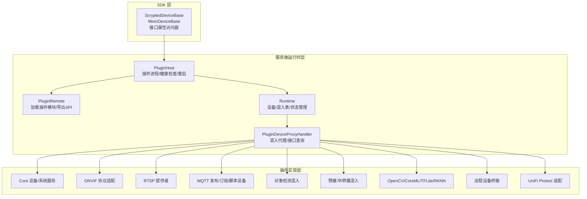
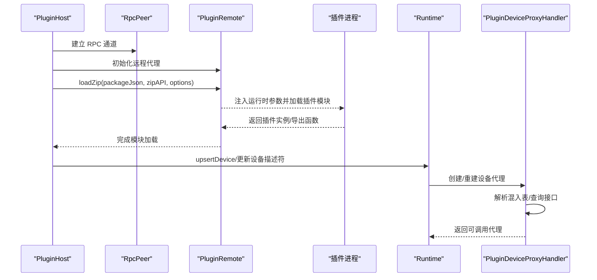
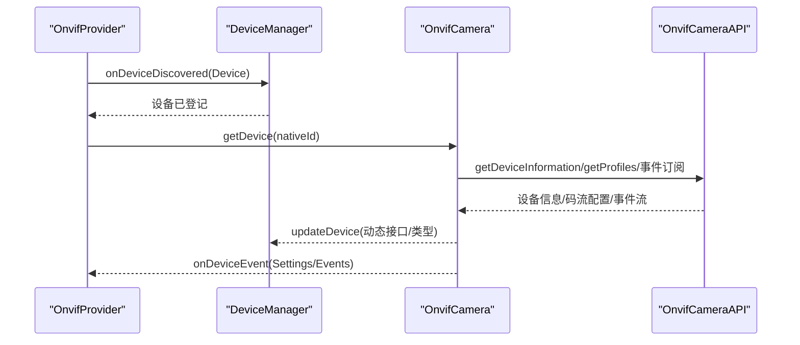
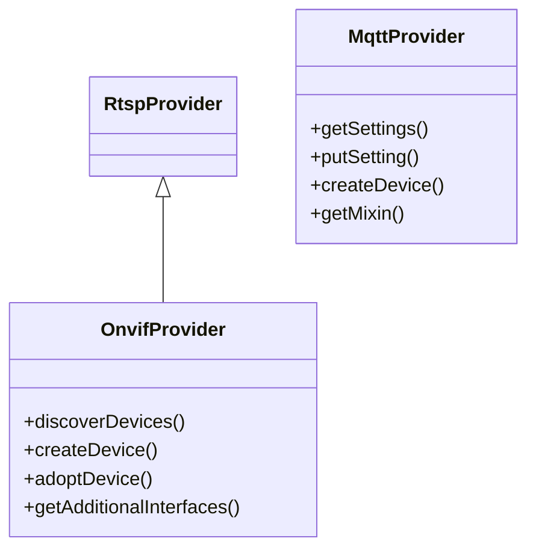
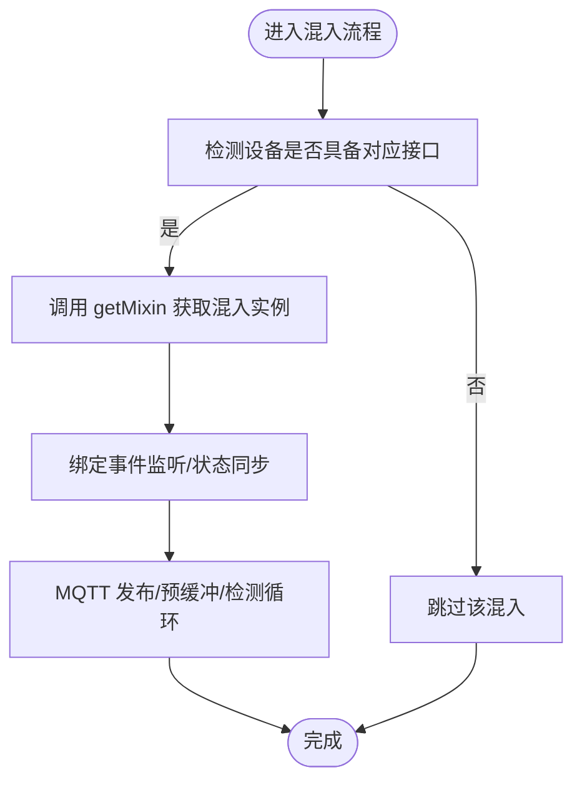
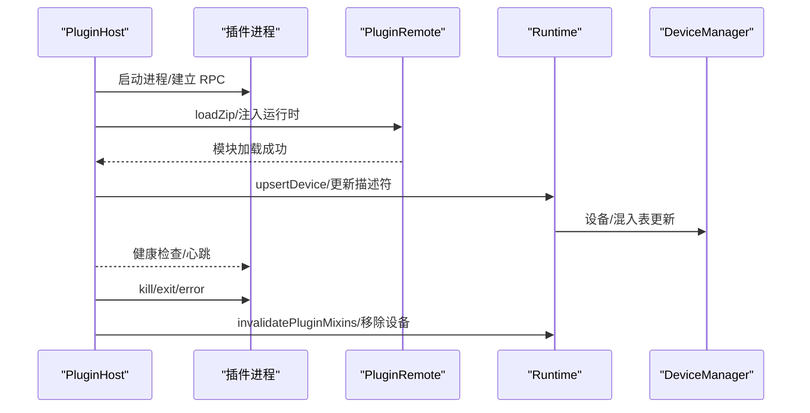
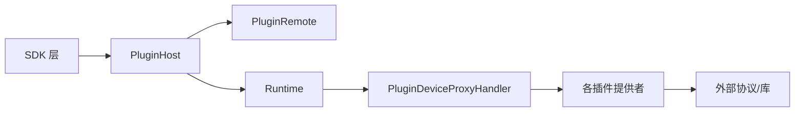

# 插件类型与开发模式

<cite>
**本文引用的文件**
- [sdk/src/index.ts](file://sdk/src/index.ts)
- [server/src/plugin/plugin-host.ts](file://server/src/plugin/plugin-host.ts)
- [server/src/plugin/plugin-device.ts](file://server/src/plugin/plugin-device.ts)
- [server/src/plugin/plugin-remote.ts](file://server/src/plugin/plugin-remote.ts)
- [server/src/runtime.ts](file://server/src/runtime.ts)
- [server/src/scrypted-plugin-main.ts](file://server/src/scrypted-plugin-main.ts)
- [plugins/core/src/main.ts](file://plugins/core/src/main.ts)
- [plugins/onvif/src/main.ts](file://plugins/onvif/src/main.ts)
- [plugins/rtsp/src/main.ts](file://plugins/rtsp/src/main.ts)
- [plugins/mqtt/src/main.ts](file://plugins/mqtt/src/main.ts)
- [plugins/objectdetector/src/main.ts](file://plugins/objectdetector/src/main.ts)
- [plugins/prebuffer-mixin/src/main.ts](file://plugins/prebuffer-mixin/src/main.ts)
- [plugins/coreml/src/main.py](file://plugins/coreml/src/main.py)
- [plugins/opencv/src/main.py](file://plugins/opencv/src/main.py)
- [plugins/tensorflow-lite/src/main.py](file://plugins/tensorflow-lite/src/main.py)
- [plugins/rknn/src/main.py](file://plugins/rknn/src/main.py)
- [plugins/remote/src/main.ts](file://plugins/remote/src/main.ts)
- [plugins/unifi-protect/src/main.ts](file://plugins/unifi-protect/src/main.ts)
</cite>

## 目录
1. [引言](#引言)
2. [项目结构](#项目结构)
3. [核心组件](#核心组件)
4. [架构总览](#架构总览)
5. [详细组件分析](#详细组件分析)
6. [依赖关系分析](#依赖关系分析)
7. [性能考量](#性能考量)
8. [故障排查指南](#故障排查指南)
9. [结论](#结论)
10. [附录](#附录)

## 引言
本文件面向希望在 Scrypted 平台上开发各类插件的开发者，系统性地梳理设备插件、协议插件（RTSP、ONVIF、MQTT）、AI 插件（OpenCV、CoreML、TensorFlow Lite、RKNN）以及混入插件（MqttPublisherMixin、PrebufferMixin、ObjectDetectionMixin）的开发模式与最佳实践，并结合源码对插件生命周期、运行时交互、资源清理、插件间通信与协作进行深入解析。

## 项目结构
Scrypted 的插件体系由“SDK 层”“服务端运行时层”“具体插件实现层”三部分组成：
- SDK 层：提供统一的设备基类、混入基类、状态访问器、媒体对象创建等能力，屏蔽底层 RPC/序列化细节。
- 服务端运行时层：负责插件进程生命周期、远程代理、设备描述符更新、混入表重建、HTTP/WebSocket/Engine.IO 转发等。
- 具体插件实现层：按类型实现设备发现、状态管理、控制接口、AI 推理与优化、协议适配与事件处理等。

图示来源
- [sdk/src/index.ts:10-204](file://sdk/src/index.ts#L10-L204)
- [server/src/plugin/plugin-host.ts:122-224](file://server/src/plugin/plugin-host.ts#L122-L224)
- [server/src/plugin/plugin-remote.ts:281-318](file://server/src/plugin/plugin-remote.ts#L281-L318)
- [server/src/runtime.ts:797-823](file://server/src/runtime.ts#L797-L823)
- [server/src/plugin/plugin-device.ts:145-174](file://server/src/plugin/plugin-device.ts#L145-L174)

章节来源
- [sdk/src/index.ts:10-204](file://sdk/src/index.ts#L10-L204)
- [server/src/plugin/plugin-host.ts:122-224](file://server/src/plugin/plugin-host.ts#L122-L224)
- [server/src/plugin/plugin-remote.ts:281-318](file://server/src/plugin/plugin-remote.ts#L281-L318)
- [server/src/runtime.ts:797-823](file://server/src/runtime.ts#L797-L823)
- [server/src/plugin/plugin-device.ts:145-174](file://server/src/plugin/plugin-device.ts#L145-L174)

## 核心组件
- 设备基类与混入基类
  - ScryptedDeviceBase：提供 storage、log、console、createMediaObject、onDeviceEvent、设备状态属性访问器等。
  - MixinDeviceBase：用于混入场景，封装 mixinProviderNativeId、mixinDeviceInterfaces、mixinStorageSuffix、事件监听注册与释放等。
- 运行时与设备代理
  - PluginHost：启动插件进程、健康检查、IO/WebSocket/Engine.IO 通道、远程 API 暴露、插件模块加载。
  - PluginDeviceProxyHandler：动态代理设备与混入，支持 QueryInterface 查询、Mixin 应用、ACL 控制。
  - Runtime：维护设备与混入表、状态管理、设备移除与混入失效。
- 插件远程代理
  - PluginRemote：负责加载 zip 包、注入运行时参数、暴露宿主 API 给插件侧。

章节来源
- [sdk/src/index.ts:10-204](file://sdk/src/index.ts#L10-L204)
- [server/src/plugin/plugin-host.ts:122-224](file://server/src/plugin/plugin-host.ts#L122-L224)
- [server/src/plugin/plugin-device.ts:145-174](file://server/src/plugin/plugin-device.ts#L145-L174)
- [server/src/plugin/plugin-remote.ts:281-318](file://server/src/plugin/plugin-remote.ts#L281-L318)
- [server/src/runtime.ts:797-823](file://server/src/runtime.ts#L797-L823)

## 架构总览
下图展示从插件进程启动到设备代理、混入应用、状态与事件流转的关键路径。

图示来源
- [server/src/plugin/plugin-host.ts:226-274](file://server/src/plugin/plugin-host.ts#L226-L274)
- [server/src/plugin/plugin-remote.ts:281-318](file://server/src/plugin/plugin-remote.ts#L281-L318)
- [server/src/runtime.ts:797-823](file://server/src/runtime.ts#L797-L823)
- [server/src/plugin/plugin-device.ts:145-174](file://server/src/plugin/plugin-device.ts#L145-L174)

## 详细组件分析

### 设备插件开发（以 ONVIF 为例）
- 设备发现
  - ONVIF 提供者通过 onvif.Discovery 监听设备，解析 XAddrs/Scopes，构造 Device 并上报 deviceManager.onDeviceDiscovered。
  - 支持扫描 discoverDevices 与 adoptDevice 流程，自动配置与 PTZ 能力探测。
- 状态管理
  - 设备信息（manufacturer/model/serialNumber 等）通过 OnvifCamera.updateDeviceInfo 动态更新；接口集合根据 onvifDetector/onvifDoorbell/onvifTwoWay 等设置动态增删。
  - putSetting 触发客户端重连与流配置刷新。
- 控制接口实现
  - reboot、takeSmartCameraPicture、setVideoStreamOptions、getVideoTextOverlays/setVideoTextOverlay、intercom 控制等。
- 事件与混入
  - listenEvents 订阅 ONVIF 事件；PTZ 混入通过 MixinProvider 注入。

图示来源
- [plugins/onvif/src/main.ts:334-463](file://plugins/onvif/src/main.ts#L334-L463)
- [plugins/onvif/src/main.ts:16-332](file://plugins/onvif/src/main.ts#L16-L332)

章节来源
- [plugins/onvif/src/main.ts:16-332](file://plugins/onvif/src/main.ts#L16-L332)
- [plugins/onvif/src/main.ts:334-463](file://plugins/onvif/src/main.ts#L334-L463)

### 协议插件开发（RTSP、ONVIF、MQTT）
- RTSP
  - RTSP 提供者继承自 RtspProvider，作为 ONVIF 的基础能力，提供 getScryptedDeviceCreator 等。
- ONVIF
  - 在 ONVIF 基础上扩展事件、OSD、PTZ、互听等能力，动态增删接口，支持自动配置与门铃/双向音频场景。
- MQTT
  - 内置 Aedes Broker（可选），支持脚本设备、自动发现（Home Assistant）、发布/订阅、设备状态回传与事件转发。

图示来源
- [plugins/rtsp/src/main.ts:3-7](file://plugins/rtsp/src/main.ts#L3-L7)
- [plugins/onvif/src/main.ts:334-622](file://plugins/onvif/src/main.ts#L334-L622)
- [plugins/mqtt/src/main.ts:349-621](file://plugins/mqtt/src/main.ts#L349-L621)

章节来源
- [plugins/rtsp/src/main.ts:3-7](file://plugins/rtsp/src/main.ts#L3-L7)
- [plugins/onvif/src/main.ts:334-622](file://plugins/onvif/src/main.ts#L334-L622)
- [plugins/mqtt/src/main.ts:349-621](file://plugins/mqtt/src/main.ts#L349-L621)

### AI 插件开发（OpenCV、CoreML、TensorFlow Lite、RKNN）
- 统一入口
  - 各 AI 插件通过 create_scrypted_plugin 导出插件实例，并在需要时提供 fork 预热能力。
- 开发要点
  - 将推理封装为可复用的设备或混入，提供模型加载、输入格式转换、推理执行、结果后处理与可视化输出。
  - 结合对象检测混入（见下节）实现检测结果聚合、区域过滤、运动辅助等高级特性。
  - 注意性能：合理选择硬件加速（GPU/NPU）、批处理、线程池与内存池，避免阻塞主线程。

章节来源
- [plugins/coreml/src/main.py:1-9](file://plugins/coreml/src/main.py#L1-L9)
- [plugins/opencv/src/main.py:1-5](file://plugins/opencv/src/main.py#L1-L5)
- [plugins/tensorflow-lite/src/main.py:1-9](file://plugins/tensorflow-lite/src/main.py#L1-L9)
- [plugins/rknn/src/main.py:1-5](file://plugins/rknn/src/main.py#L1-L5)

### 混入插件开发（MqttPublisherMixin、PrebufferMixin、ObjectDetectionMixin）
- MqttPublisherMixin
  - 将任意设备的状态与事件发布到 MQTT，支持 HA 自动发现、保留消息、方法调用转发。
  - 可配置外部/内置 Broker、用户名密码、主题前缀。
- PrebufferMixin
  - 预缓冲与转播 RTSP/RTMP 流，支持多解析器（Scrypted/FFmpeg）、SDP 解析、分辨率/码率检测、电池/充电状态下的按需预缓冲。
  - 提供合成流、FFmpeg 输入/输出参数、静音转播等高级选项。
- ObjectDetectionMixin
  - 将对象检测/运动检测能力以混入方式叠加到摄像头，支持区域过滤、排除/包含策略、观察模式、后处理与检测图像保留。

图示来源
- [plugins/mqtt/src/main.ts:599-619](file://plugins/mqtt/src/main.ts#L599-L619)
- [plugins/prebuffer-mixin/src/main.ts:44-150](file://plugins/prebuffer-mixin/src/main.ts#L44-L150)
- [plugins/objectdetector/src/main.ts:50-160](file://plugins/objectdetector/src/main.ts#L50-L160)

章节来源
- [plugins/mqtt/src/main.ts:599-619](file://plugins/mqtt/src/main.ts#L599-L619)
- [plugins/prebuffer-mixin/src/main.ts:44-150](file://plugins/prebuffer-mixin/src/main.ts#L44-L150)
- [plugins/objectdetector/src/main.ts:50-160](file://plugins/objectdetector/src/main.ts#L50-L160)

### 插件生命周期管理（初始化、运行时交互、资源清理）
- 初始化
  - PluginHost 启动指定 runtime（默认 node，可自定义），准备 zip/解压路径，建立 RpcPeer，创建 ConsoleServer。
  - 加载插件模块，注入 deviceManager/systemManager/mediaManager/endpointManager 等运行时 API。
- 运行时交互
  - 插件通过 PluginRemote 暴露 API，Runtime 维护设备与混入表，设备代理支持动态查询接口与混入应用。
  - HTTP/Engine.IO/WebSocket 请求经由 Runtime 转发至插件实现。
- 资源清理
  - kill/exit/error 时断开 RPC、关闭 IO/WebSocket、销毁 ConsoleServer、invalidatePluginMixins、移除设备与状态。
  - 设备移除时递归删除子设备、失效混入、清理存储。

图示来源
- [server/src/plugin/plugin-host.ts:330-463](file://server/src/plugin/plugin-host.ts#L330-L463)
- [server/src/plugin/plugin-remote.ts:281-318](file://server/src/plugin/plugin-remote.ts#L281-L318)
- [server/src/runtime.ts:466-473](file://server/src/runtime.ts#L466-L473)
- [server/src/runtime.ts:797-823](file://server/src/runtime.ts#L797-L823)

章节来源
- [server/src/plugin/plugin-host.ts:330-463](file://server/src/plugin/plugin-host.ts#L330-L463)
- [server/src/plugin/plugin-remote.ts:281-318](file://server/src/plugin/plugin-remote.ts#L281-L318)
- [server/src/runtime.ts:466-473](file://server/src/runtime.ts#L466-L473)
- [server/src/runtime.ts:797-823](file://server/src/runtime.ts#L797-L823)

### 插件间通信与协作
- 远程设备桥接
  - Remote 插件通过 client.systemManager.getSystemState() 拉取远端设备列表，过滤后以本地设备形式注册，实现跨节点设备聚合。
- UniFi Protect 适配
  - 通过 discoverDevicesInternal 与 adoptDeviceInternal 将远端设备映射成本地设备，支持失败回退与 NAT 映射。
- 混入协作
  - 设备代理在 QueryInterface 时查找混入表，确保接口可用性；混入通过 MixinDeviceBase 管理事件监听与存储隔离。

章节来源
- [plugins/remote/src/main.ts:256-318](file://plugins/remote/src/main.ts#L256-L318)
- [plugins/unifi-protect/src/main.ts:516-539](file://plugins/unifi-protect/src/main.ts#L516-L539)
- [server/src/plugin/plugin-device.ts:420-441](file://server/src/plugin/plugin-device.ts#L420-L441)

## 依赖关系分析
- 组件耦合
  - SDK 层与服务端运行时通过 RpcPeer 解耦；插件通过 PluginRemote 间接访问宿主 API。
  - 设备代理与混入表强相关，Runtime 负责混入表重建与失效。
- 外部依赖
  - ONVIF 使用第三方库进行发现与 API 调用；MQTT 使用 aedes 与 mqtt 客户端；AI 插件通过 Python 扩展提供推理能力。

图示来源
- [sdk/src/index.ts:10-204](file://sdk/src/index.ts#L10-L204)
- [server/src/plugin/plugin-host.ts:122-224](file://server/src/plugin/plugin-host.ts#L122-L224)
- [server/src/plugin/plugin-device.ts:145-174](file://server/src/plugin/plugin-device.ts#L145-L174)

章节来源
- [sdk/src/index.ts:10-204](file://sdk/src/index.ts#L10-L204)
- [server/src/plugin/plugin-host.ts:122-224](file://server/src/plugin/plugin-host.ts#L122-L224)
- [server/src/plugin/plugin-device.ts:145-174](file://server/src/plugin/plugin-device.ts#L145-L174)

## 性能考量
- 对象检测与视频分析
  - 采用采样历史计算 FPS，超过阈值时主动降级或停止分析，避免系统过载。
  - 支持多种 VideoFrameGenerator（WASM/FFmpeg/GStreamer/LibAV），按需选择以平衡性能与兼容性。
- 预缓冲与转播
  - 10 秒预缓冲窗口，自动清理过期数据；根据电池/充电状态决定是否启用持续预缓冲。
  - 支持 UDP/TCP、Scrypted/FFmpeg 解析器切换，降低 CPU 占用。
- MQTT 发布
  - 仅发布必要属性/事件，使用保留消息；HA 自动发现减少重复配置。

章节来源
- [plugins/objectdetector/src/main.ts:25-35](file://plugins/objectdetector/src/main.ts#L25-L35)
- [plugins/objectdetector/src/main.ts:545-553](file://plugins/objectdetector/src/main.ts#L545-L553)
- [plugins/prebuffer-mixin/src/main.ts:29-30](file://plugins/prebuffer-mixin/src/main.ts#L29-L30)
- [plugins/prebuffer-mixin/src/main.ts:777-787](file://plugins/prebuffer-mixin/src/main.ts#L777-L787)
- [plugins/mqtt/src/main.ts:299-339](file://plugins/mqtt/src/main.ts#L299-L339)

## 故障排查指南
- 插件启动失败
  - 检查 PluginHost 日志与 ConsoleServer 输出；确认 zip 解压、loadZip 成功；查看 RPC 心跳与健康检查。
- 设备不可用或接口未实现
  - 使用 QueryInterface 检查混入表；确认设备代理已重建；核对 providedInterfaces 与 mixinTable。
- MQTT 不工作
  - 确认 Broker 是否启用、认证信息、主题前缀；检查客户端连接/断开日志与消息订阅。
- ONVIF 无事件/无法截图
  - 检查 onvifDetector 标记、事件类型、HTTP/RTSP 端口与凭证；必要时重新自动配置。

章节来源
- [server/src/plugin/plugin-host.ts:307-325](file://server/src/plugin/plugin-host.ts#L307-L325)
- [server/src/plugin/plugin-device.ts:420-441](file://server/src/plugin/plugin-device.ts#L420-L441)
- [plugins/mqtt/src/main.ts:486-520](file://plugins/mqtt/src/main.ts#L486-L520)
- [plugins/onvif/src/main.ts:186-199](file://plugins/onvif/src/main.ts#L186-L199)

## 结论
Scrypted 的插件体系以 SDK 抽象统一设备与混入行为，以 PluginHost/PluginRemote/PluginDeviceProxyHandler 实现稳定的运行时交互与混入表管理。开发者可基于此快速实现设备发现、状态管理、控制接口、协议适配与 AI 推理，并通过混入模式实现功能增强与设备装饰器模式。遵循本文的生命周期管理、性能优化与故障排查建议，可显著提升插件稳定性与用户体验。

## 附录
- 最佳实践清单
  - 设备发现：使用 deviceManager.onDeviceDiscovered/ onDevicesChanged 批量注册；保持 nativeId 唯一性。
  - 状态管理：通过 ScryptedDeviceBase 的属性访问器读写设备状态；变更后及时触发 updateDescriptor/invalidate。
  - 控制接口：严格区分方法与属性；对耗时操作异步化并提供进度反馈。
  - 协议适配：统一错误处理与超时重试；支持自动配置与能力探测。
  - AI 推理：模型缓存与预热；输入格式标准化；结果后处理与可视化。
  - 混入：事件监听与释放；存储隔离；ACL 控制；HA 自动发现。
  - 生命周期：健康检查与自动重启；退出清理；设备移除与混入失效。
  - 通信协作：远程设备桥接与 NAT 映射；跨节点设备聚合；插件间事件广播。