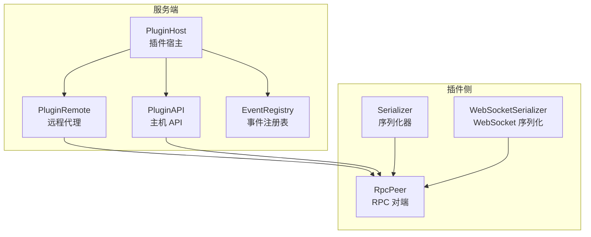
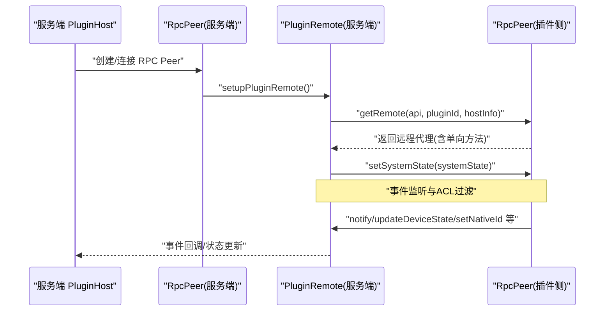
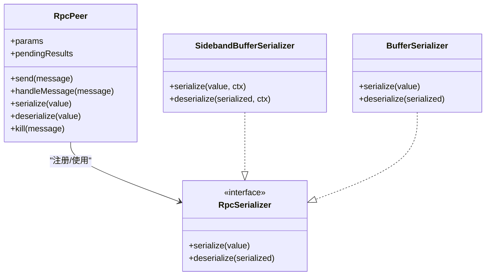
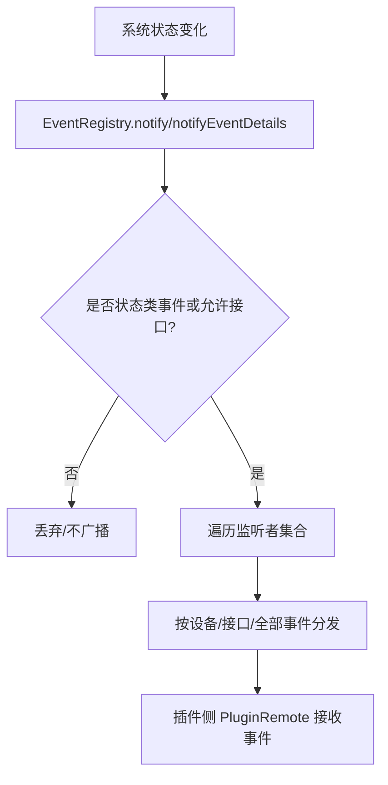
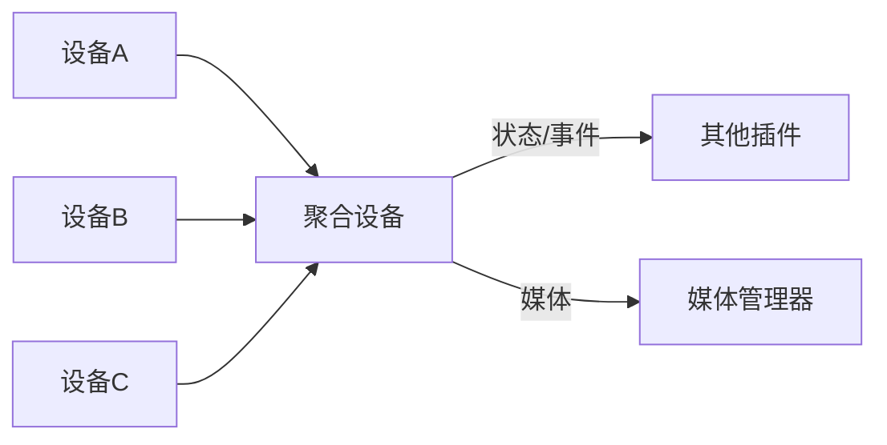
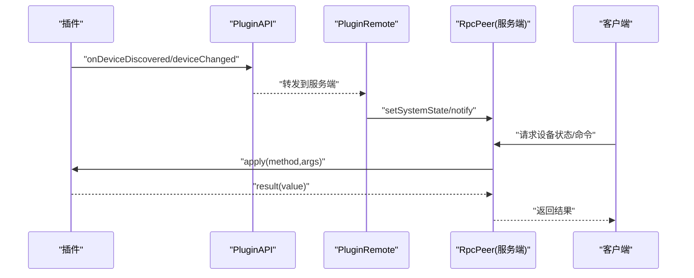
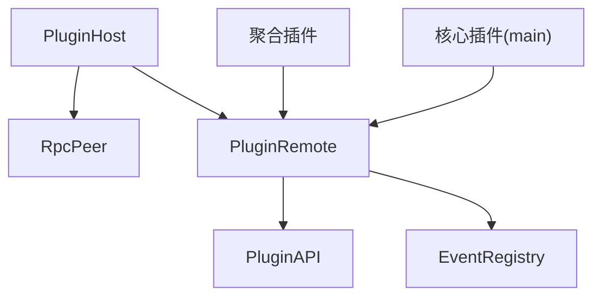

# 插件间通信与协作

<cite>
**本文引用的文件**
- [rpc.ts](file://server/src/rpc.ts)
- [rpc-serializer.ts](file://server/src/rpc-serializer.ts)
- [rpc-buffer-serializer.ts](file://server/src/rpc-buffer-serializer.ts)
- [plugin-host.ts](file://server/src/plugin/plugin-host.ts)
- [plugin-remote.ts](file://server/src/plugin/plugin-remote.ts)
- [plugin-api.ts](file://server/src/plugin/plugin-api.ts)
- [event-registry.ts](file://server/src/event-registry.ts)
- [aggregate.ts](file://plugins/core/src/aggregate.ts)
- [devices.ts](file://common/src/devices.ts)
- [main.ts（核心插件）](file://plugins/core/src/main.ts)
- [main.ts（示例插件：dummy-switch）](file://plugins/dummy-switch/src/main.ts)
- [rpc-iterator-test.ts](file://server/test/rpc-iterator-test.ts)
- [rpc-duplex-test.ts](file://server/test/rpc-duplex-test.ts)
</cite>

## 目录
1. [引言](#引言)
2. [项目结构](#项目结构)
3. [核心组件](#核心组件)
4. [架构总览](#架构总览)
5. [详细组件分析](#详细组件分析)
6. [依赖关系分析](#依赖关系分析)
7. [性能考量](#性能考量)
8. [故障排查指南](#故障排查指南)
9. [结论](#结论)
10. [附录](#附录)

## 引言
本指南聚焦于 Scrypted 的插件间通信与协作机制，围绕 RPC 调用、事件系统、数据流传输、序列化与反序列化、事件驱动架构、数据共享与一致性、以及开发示例展开。目标是帮助开发者在不深入源码的前提下，理解并高效地实现设备发现、状态同步、命令转发、设备聚合与功能组合等常见场景。

## 项目结构
Scrypted 的插件通信由服务端与插件侧共同完成：
- 服务端负责管理插件生命周期、建立 RPC 连接、事件分发与访问控制、媒体与系统状态管理。
- 插件通过 RPC 与服务端交互，暴露设备接口、接收系统状态、上报事件、执行设备操作。
- 核心插件提供设备聚合、自动化、集群、终端、脚本等系统级能力。

图示来源
- [plugin-host.ts:122-224](file://server/src/plugin/plugin-host.ts#L122-L224)
- [plugin-remote.ts:13-92](file://server/src/plugin/plugin-remote.ts#L13-L92)
- [plugin-api.ts:15-39](file://server/src/plugin/plugin-api.ts#L15-L39)
- [event-registry.ts:26-104](file://server/src/event-registry.ts#L26-L104)
- [rpc.ts:285-456](file://server/src/rpc.ts#L285-L456)
- [rpc-serializer.ts:5-23](file://server/src/rpc-serializer.ts#L5-L23)

章节来源
- [plugin-host.ts:38-224](file://server/src/plugin/plugin-host.ts#L38-L224)
- [plugin-remote.ts:13-92](file://server/src/plugin/plugin-remote.ts#L13-L92)
- [plugin-api.ts:15-39](file://server/src/plugin/plugin-api.ts#L15-L39)
- [event-registry.ts:26-104](file://server/src/event-registry.ts#L26-L104)

## 核心组件
- RpcPeer：RPC 对端，负责消息编解码、参数与结果序列化、代理对象管理、超时与错误传播。
- Serializer：消息序列化器，支持 JSON + 二进制旁路传输，保障大对象高效传输。
- PluginHost：服务端插件宿主，负责启动插件进程、建立 RPC Peer、健康检查、IO/WebSocket 通道。
- PluginRemote：服务端侧的“远程”代理，向插件暴露系统状态、事件通知、设备管理等能力，并标记单向方法。
- PluginAPI：插件侧可调用的服务端 API，提供设备变更、事件监听、日志、媒体管理等能力。
- EventRegistry：事件注册与分发中心，支持系统级与设备级事件监听，过滤与去噪。

章节来源
- [rpc.ts:285-456](file://server/src/rpc.ts#L285-L456)
- [rpc-serializer.ts:5-85](file://server/src/rpc-serializer.ts#L5-L85)
- [rpc-buffer-serializer.ts:3-31](file://server/src/rpc-buffer-serializer.ts#L3-L31)
- [plugin-host.ts:38-224](file://server/src/plugin/plugin-host.ts#L38-L224)
- [plugin-remote.ts:13-92](file://server/src/plugin/plugin-remote.ts#L13-L92)
- [plugin-api.ts:15-39](file://server/src/plugin/plugin-api.ts#L15-L39)
- [event-registry.ts:26-104](file://server/src/event-registry.ts#L26-L104)

## 架构总览
下图展示了服务端与插件之间的 RPC 通道、事件分发与访问控制链路：

图示来源
- [plugin-host.ts:276-328](file://server/src/plugin/plugin-host.ts#L276-L328)
- [plugin-remote.ts:13-92](file://server/src/plugin/plugin-remote.ts#L13-L92)
- [rpc.ts:697-800](file://server/src/rpc.ts#L697-L800)

章节来源
- [plugin-host.ts:276-328](file://server/src/plugin/plugin-host.ts#L276-L328)
- [plugin-remote.ts:13-92](file://server/src/plugin/plugin-remote.ts#L13-L92)
- [rpc.ts:697-800](file://server/src/rpc.ts#L697-L800)

## 详细组件分析

### RPC 通信与序列化
- 消息类型：apply（调用）、result（结果）、param（参数）、finalize（代理释放）。
- 参数与结果：通过 RpcPeer.serialize/deserialize 实现，支持基础类型、错误对象、代理对象、自定义序列化器。
- 单向方法：通过标记属性实现，如 PluginRemote 中的 notify、updateDeviceState 等。
- 二进制传输：SidebandBufferSerializer 将 Buffer 作为旁路二进制发送，避免 JSON 编码开销。
- 错误传播：RPCResultError 包装远端错误栈与上下文，便于定位问题。

图示来源
- [rpc.ts:285-456](file://server/src/rpc.ts#L285-L456)
- [rpc-buffer-serializer.ts:3-31](file://server/src/rpc-buffer-serializer.ts#L3-L31)

章节来源
- [rpc.ts:29-800](file://server/src/rpc.ts#L29-L800)
- [rpc-serializer.ts:5-85](file://server/src/rpc-serializer.ts#L5-L85)
- [rpc-buffer-serializer.ts:3-31](file://server/src/rpc-buffer-serializer.ts#L3-L31)

### 事件驱动架构
- 事件注册：EventRegistry 提供系统级与设备级事件监听，支持 mixin 事件命名。
- 事件分发：PluginRemote 在收到系统状态后，按 ACL 过滤并转发到插件；插件通过 notify/updateDeviceState 上报事件。
- 去噪策略：仅对状态类事件或白名单接口进行广播，减少噪声。

图示来源
- [event-registry.ts:55-103](file://server/src/event-registry.ts#L55-L103)
- [plugin-remote.ts:62-85](file://server/src/plugin/plugin-remote.ts#L62-L85)

章节来源
- [event-registry.ts:26-104](file://server/src/event-registry.ts#L26-L104)
- [plugin-remote.ts:62-85](file://server/src/plugin/plugin-remote.ts#L62-L85)

### 插件间协作模式
- 设备聚合：核心插件提供聚合设备，将多个设备的同名接口值聚合（平均、逻辑与/或、锁状态优先等），并生成新的视频拼接流。
- 功能组合：通过 MixinProvider 与 Settings 组合不同设备的能力，形成复合设备。
- 共享资源：通过 PluginRemote 的 setSystemState 与事件通知，实现跨插件的状态共享与一致性。

图示来源
- [aggregate.ts:140-280](file://plugins/core/src/aggregate.ts#L140-L280)
- [plugin-remote.ts:26-85](file://server/src/plugin/plugin-remote.ts#L26-L85)

章节来源
- [aggregate.ts:1-281](file://plugins/core/src/aggregate.ts#L1-L281)
- [plugin-remote.ts:13-92](file://server/src/plugin/plugin-remote.ts#L13-L92)

### 数据共享与一致性
- 系统状态：PluginRemote.setSystemState 将服务端系统状态下发至插件，插件据此构建本地设备视图。
- 访问控制：ACL 过滤设备接口与属性，确保事件与状态的最小暴露面。
- 事件一致性：通过 EventRegistry 的事件去噪与过滤，保证只广播必要的状态变更。

章节来源
- [plugin-remote.ts:26-85](file://server/src/plugin/plugin-remote.ts#L26-L85)
- [event-registry.ts:55-103](file://server/src/event-registry.ts#L55-L103)

### 开发示例与最佳实践
- 设备发现与状态同步：插件通过 PluginAPI.onDeviceDiscovered/onDevicesChanged 报告新设备；通过 PluginRemote.notify/updateDeviceState 同步状态。
- 命令转发：服务端通过 RpcPeer 调用插件侧设备方法，插件侧实现具体动作并返回结果。
- 异步迭代器：RpcPeer 支持 AsyncIterator，用于流式数据传输（如媒体帧）。
- 双工通信：通过 createRpcDuplexSerializer 建立 TCP/WS 双工通道，支持旁路二进制与 JSON 混合传输。

图示来源
- [plugin-api.ts:15-39](file://server/src/plugin/plugin-api.ts#L15-L39)
- [plugin-remote.ts:178-310](file://server/src/plugin/plugin-remote.ts#L178-L310)
- [rpc.ts:697-800](file://server/src/rpc.ts#L697-L800)

章节来源
- [plugin-api.ts:15-39](file://server/src/plugin/plugin-api.ts#L15-L39)
- [plugin-remote.ts:178-310](file://server/src/plugin/plugin-remote.ts#L178-L310)
- [rpc.ts:697-800](file://server/src/rpc.ts#L697-L800)

## 依赖关系分析
- PluginHost 依赖 RpcPeer 与 Serializer，负责启动插件进程、建立 IO/WebSocket 通道、健康检查与重启。
- PluginRemote 依赖 RpcPeer 的参数与方法，向插件暴露系统状态与事件能力，并设置单向方法。
- EventRegistry 与 PluginRemote 协作，实现事件的过滤与分发。
- 核心插件（Aggregate、Automation、Cluster 等）通过 PluginAPI 与 PluginRemote 与其他插件协作。

图示来源
- [plugin-host.ts:38-224](file://server/src/plugin/plugin-host.ts#L38-L224)
- [plugin-remote.ts:13-92](file://server/src/plugin/plugin-remote.ts#L13-L92)
- [event-registry.ts:26-104](file://server/src/event-registry.ts#L26-L104)
- [main.ts（核心插件）:27-321](file://plugins/core/src/main.ts#L27-L321)

章节来源
- [plugin-host.ts:38-224](file://server/src/plugin/plugin-host.ts#L38-L224)
- [plugin-remote.ts:13-92](file://server/src/plugin/plugin-remote.ts#L13-L92)
- [event-registry.ts:26-104](file://server/src/event-registry.ts#L26-L104)
- [main.ts（核心插件）:27-321](file://plugins/core/src/main.ts#L27-L321)

## 性能考量
- 二进制旁路传输：使用 SidebandBufferSerializer 避免大对象 JSON 编解码开销，提升媒体与大数据传输效率。
- 单向方法：对高频事件（如 notify、updateDeviceState）标记为单向，降低往返延迟与内存占用。
- 健康检查与自动重启：PluginHost 定期 ping 插件，超时则请求重启，保障长连稳定性。
- 异步迭代器：支持流式消费，避免一次性加载大量数据。
- 事件去噪：仅广播状态类事件与白名单接口，减少网络与 CPU 压力。

章节来源
- [rpc-buffer-serializer.ts:14-31](file://server/src/rpc-buffer-serializer.ts#L14-L31)
- [plugin-host.ts:289-325](file://server/src/plugin/plugin-host.ts#L289-L325)
- [plugin-remote.ts:182-190](file://server/src/plugin/plugin-remote.ts#L182-L190)
- [event-registry.ts:55-103](file://server/src/event-registry.ts#L55-L103)

## 故障排查指南
- RPC 结果错误：当远端抛出异常时，RpcPeer 会将其包装为 RPCResultError 并携带对端上下文信息，便于定位。
- Peer 被杀死：当 Peer.kill 被调用或连接断开，pendingResults 会被拒绝，需在上层捕获并重试或降级。
- 事件未到达：检查 ACL 是否拒绝了事件或属性；确认 EventRegistry 的过滤条件与事件类型。
- 媒体流异常：确认 Serializer 使用了 SidebandBufferSerializer 并正确传递二进制旁路缓冲区。
- 插件无响应：查看 PluginHost 的健康检查日志与重启记录。

章节来源
- [rpc.ts:229-240](file://server/src/rpc.ts#L229-L240)
- [rpc.ts:439-456](file://server/src/rpc.ts#L439-L456)
- [plugin-host.ts:289-325](file://server/src/plugin/plugin-host.ts#L289-L325)
- [plugin-remote.ts:26-85](file://server/src/plugin/plugin-remote.ts#L26-L85)

## 结论
Scrypted 的插件间通信以 RpcPeer 为核心，结合 Serializer 的 JSON+旁路二进制传输，实现了高性能、低延迟的 RPC 与事件系统。通过 PluginRemote 与 PluginAPI，服务端与插件之间建立了清晰的职责边界：服务端负责状态、事件与资源管理，插件负责设备实现与业务逻辑。配合事件去噪、ACL 过滤与健康检查，整体系统具备良好的扩展性与可靠性。

## 附录
- 示例测试：rpc-iterator-test 展示了异步迭代器在 RPC 中的使用；rpc-duplex-test 展示了双工 Serializer 的建立与调用。
- 设备聚合：核心插件通过聚合策略与媒体拼接，演示了多设备能力组合的实际应用。

章节来源
- [rpc-iterator-test.ts:1-47](file://server/test/rpc-iterator-test.ts#L1-L47)
- [rpc-duplex-test.ts:1-31](file://server/test/rpc-duplex-test.ts#L1-L31)
- [aggregate.ts:140-280](file://plugins/core/src/aggregate.ts#L140-L280)