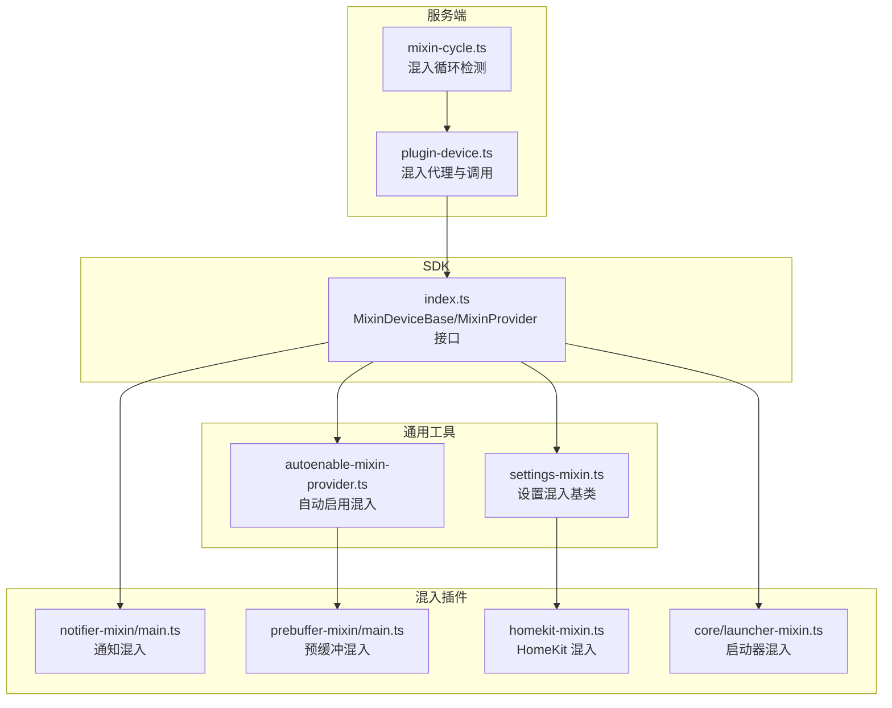
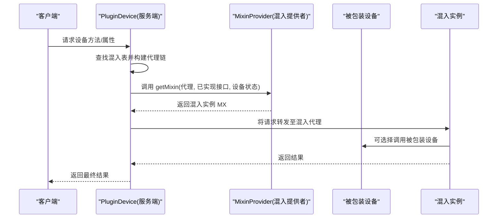
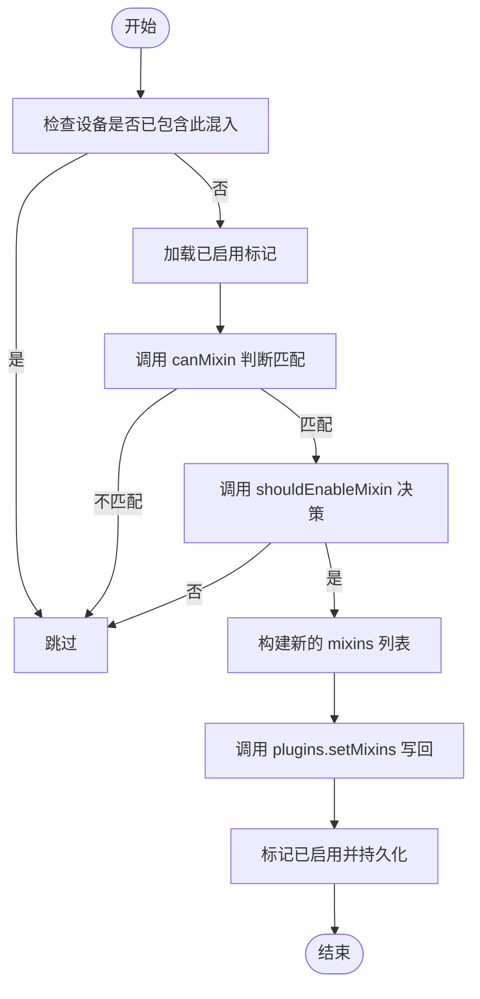
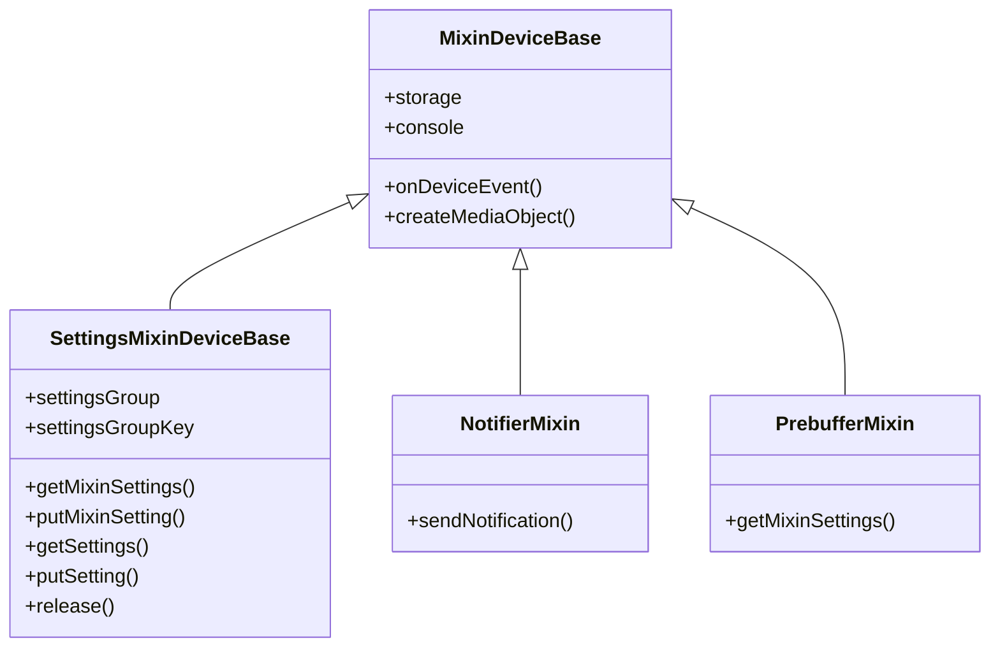
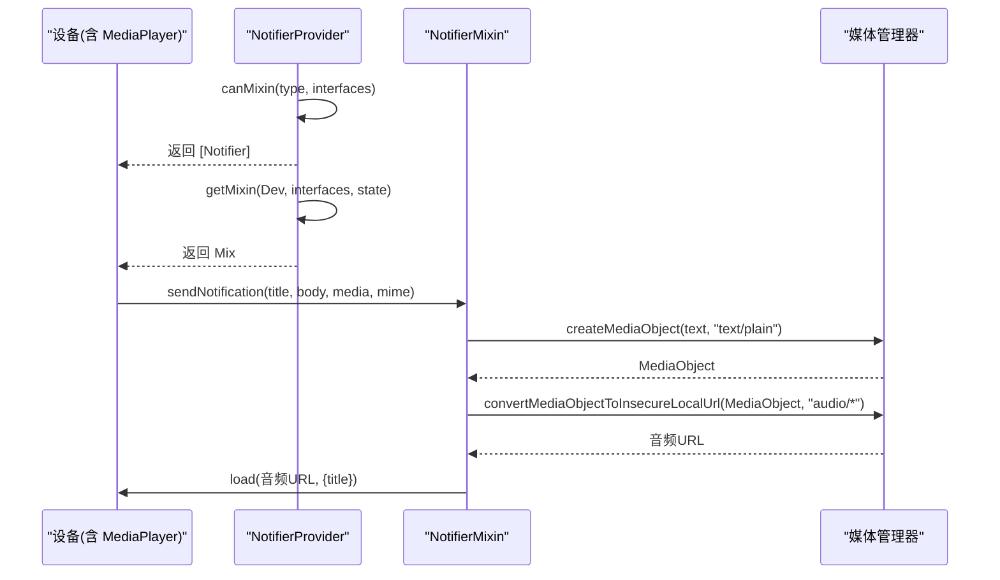
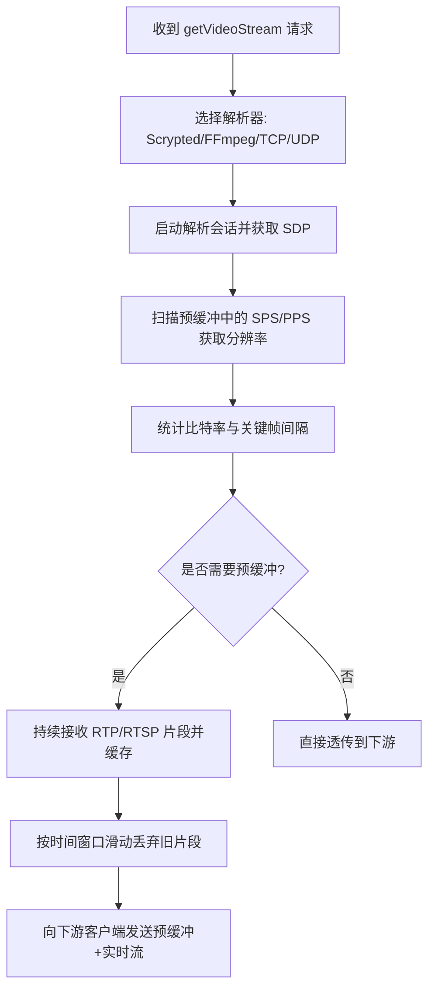
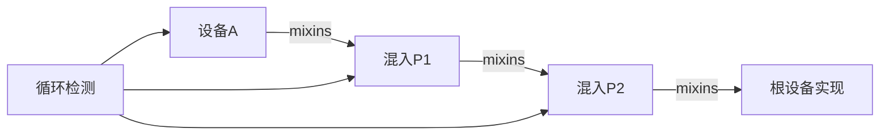

# 混入插件开发

<cite>
**本文引用的文件**
- [autoenable-mixin-provider.ts](file://common/src/autoenable-mixin-provider.ts)
- [settings-mixin.ts（通用）](file://common/src/settings-mixin.ts)
- [settings-mixin.ts（SDK）](file://sdk/src/settings-mixin.ts)
- [main.ts（通知混入）](file://plugins/notifier-mixin/src/main.ts)
- [main.ts（预缓冲混入）](file://plugins/prebuffer-mixin/src/main.ts)
- [launcher-mixin.ts](file://plugins/core/src/launcher-mixin.ts)
- [homekit-mixin.ts](file://plugins/homekit/src/homekit-mixin.ts)
- [index.ts（SDK 设备基类与混入）](file://sdk/src/index.ts)
- [plugin-device.ts（混入代理与调用）](file://server/src/plugin/plugin-device.ts)
- [mixin-cycle.ts（混入循环检测）](file://server/src/mixin/mixin-cycle.ts)
- [stream-settings.ts（预缓冲流设置）](file://plugins/prebuffer-mixin/src/stream-settings.ts)
- [README.md](file://README.md)
</cite>

## 目录
1. [简介](#简介)
2. [项目结构](#项目结构)
3. [核心组件](#核心组件)
4. [架构总览](#架构总览)
5. [组件详解](#组件详解)
6. [依赖关系分析](#依赖关系分析)
7. [性能考量](#性能考量)
8. [故障排查指南](#故障排查指南)
9. [结论](#结论)
10. [附录](#附录)

## 简介
本指南面向希望在 Scrypted 中开发“混入（Mixin）”插件的开发者，系统讲解混入模式的设计理念与实现原理，涵盖以下主题：
- 功能增强与设备装饰器模式：通过 MixinProvider 为现有设备动态注入新接口或行为，不改变根设备实现。
- 插件组合机制：多混入链式叠加，形成“代理叠加”的调用路径，最终由宿主设备实现具体能力。
- 自动启用混入：基于设备类型与接口特征的自动匹配与启用策略。
- 设置混入：为混入设备提供独立设置项，支持分组、键前缀隔离与持久化。
- 生命周期管理：初始化顺序、依赖关系、资源清理与循环检测。
- 实战示例：通知混入、预缓冲混入等常用场景。
- 调试技巧与性能优化建议。

## 项目结构
Scrypted 的混入能力由 SDK、通用工具与多个插件共同构成：
- SDK 层提供 MixinDeviceBase、MixinProvider 接口与混入基础能力。
- 通用层提供 AutoenableMixinProvider、SettingsMixinDeviceBase 等可复用基类。
- 典型混入插件：通知混入、预缓冲混入、HomeKit 混入、启动器混入等。

图表来源
- [index.ts（SDK 设备基类与混入）:90-289](file://sdk/src/index.ts#L90-L289)
- [autoenable-mixin-provider.ts:1-85](file://common/src/autoenable-mixin-provider.ts#L1-L85)
- [settings-mixin.ts（通用）:1-88](file://common/src/settings-mixin.ts#L1-L88)
- [main.ts（通知混入）:1-64](file://plugins/notifier-mixin/src/main.ts#L1-L64)
- [main.ts（预缓冲混入）:1-800](file://plugins/prebuffer-mixin/src/main.ts#L1-L800)
- [homekit-mixin.ts:1-53](file://plugins/homekit/src/homekit-mixin.ts#L1-L53)
- [launcher-mixin.ts:1-31](file://plugins/core/src/launcher-mixin.ts#L1-L31)
- [plugin-device.ts（混入代理与调用）:136-311](file://server/src/plugin/plugin-device.ts#L136-L311)
- [mixin-cycle.ts（混入循环检测）:1-32](file://server/src/mixin/mixin-cycle.ts#L1-L32)

章节来源
- [index.ts（SDK 设备基类与混入）:90-289](file://sdk/src/index.ts#L90-L289)
- [README.md:1-59](file://README.md#L1-L59)

## 核心组件
- MixinDeviceBase：混入设备的基类，封装对被包装设备的访问、存储、日志、事件上报与设备状态读写。
- MixinProvider：混入提供者接口，负责判断是否能为某设备创建混入，以及返回混入实例。
- AutoenableMixinProvider：自动启用混入的基类，监听系统设备描述变更，按条件自动为设备启用混入。
- SettingsMixinDeviceBase：设置混入基类，统一处理混入设置项的合并、键名前缀与持久化。

章节来源
- [index.ts（SDK 设备基类与混入）:90-289](file://sdk/src/index.ts#L90-L289)
- [autoenable-mixin-provider.ts:1-85](file://common/src/autoenable-mixin-provider.ts#L1-L85)
- [settings-mixin.ts（SDK）:1-87](file://sdk/src/settings-mixin.ts#L1-L87)
- [settings-mixin.ts（通用）:1-88](file://common/src/settings-mixin.ts#L1-L88)

## 架构总览
混入的运行时架构如下：
- 客户端/服务端通过 RPC 访问设备代理。
- 当设备存在混入列表时，服务端会按顺序构建混入代理链，最终调用到根设备实现。
- 每个混入可以新增接口（如 Notifier、Settings），并拦截或增强方法调用。
- 若混入抛错，系统会抑制该混入的接口暴露，避免影响整体可用性。

图表来源
- [plugin-device.ts（混入代理与调用）:136-311](file://server/src/plugin/plugin-device.ts#L136-L311)
- [index.ts（SDK 设备基类与混入）:90-289](file://sdk/src/index.ts#L90-L289)

## 组件详解

### AutoenableMixinProvider：自动启用混入
AutoenableMixinProvider 提供自动启用混入的能力：
- 在构造函数中订阅系统设备描述变更事件，遍历当前系统设备，尝试为每个设备启用混入。
- 判断逻辑：若设备已包含该混入 ID、已标记“已启用”、无法匹配 canMixin 条件或 shouldEnableMixin 返回否，则跳过。
- 启用流程：计算新的 mixins 数组（可前置或追加），调用 plugins.setMixins 写回，并持久化“已启用”标记。
- 令牌机制：使用 autoIncludeToken 避免重复启用。

图表来源
- [autoenable-mixin-provider.ts:51-81](file://common/src/autoenable-mixin-provider.ts#L51-L81)

章节来源
- [autoenable-mixin-provider.ts:1-85](file://common/src/autoenable-mixin-provider.ts#L1-L85)

### SettingsMixinDeviceBase：设置混入
SettingsMixinDeviceBase 为混入设备提供统一的设置项合并与持久化机制：
- 构造阶段注册 Settings 事件，确保 UI 能刷新设置项。
- getMixinSettings：返回混入自定义设置项；getSettings：合并被包装设备与混入设置项，混入项键名以 groupKey 前缀隔离，group 默认继承混入组。
- putMixinSetting：接收来自 UI 的设置更新，未成功时触发 Settings 事件以刷新 UI。
- release：释放时注销 Settings 事件。

图表来源
- [settings-mixin.ts（SDK）:10-86](file://sdk/src/settings-mixin.ts#L10-L86)
- [main.ts（通知混入）:19-47](file://plugins/notifier-mixin/src/main.ts#L19-L47)
- [main.ts（预缓冲混入）:282-458](file://plugins/prebuffer-mixin/src/main.ts#L282-L458)

章节来源
- [settings-mixin.ts（SDK）:1-87](file://sdk/src/settings-mixin.ts#L1-L87)
- [settings-mixin.ts（通用）:1-88](file://common/src/settings-mixin.ts#L1-L88)

### 通知混入（Notifier Mixin）
通知混入为具备 MediaPlayer 接口的设备增加 Notifier 能力：
- canMixin：仅当设备实现 MediaPlayer 时返回 Notifier。
- getMixin：返回 NotifierMixin 实例，内部将 sendNotification 转发给 MediaPlayer.load。
- 文本转音频：使用媒体管理器将文本转换为本地可播放的音频 URL，避免重复转换，提升并发效率。

图表来源
- [main.ts（通知混入）:49-64](file://plugins/notifier-mixin/src/main.ts#L49-L64)

章节来源
- [main.ts（通知混入）:1-64](file://plugins/notifier-mixin/src/main.ts#L1-L64)

### 预缓冲混入（Prebuffer Mixin）
预缓冲混入为视频设备提供预取与转码能力，显著降低首次播放延迟：
- 自动启用：继承 AutoenableMixinProvider，按设备类型与接口特征自动启用。
- 设置混入：继承 SettingsMixinDeviceBase，提供丰富的流参数、解析器选择、FFmpeg 参数等设置项。
- 流管理：根据 advertisedMediaStreamOptions 选择合适的解析器（Scrypted/FFmpeg TCP/UDP），维护预缓冲队列，按时间窗口滑动丢弃旧数据。
- 电池与充电：监听 Battery/Charger 接口，低电量或未充电时限制后台预缓冲。
- 事件与刷新：对云流定期刷新令牌，检测分辨率、编解码器与关键帧间隔，动态提示优化配置。

图表来源
- [main.ts（预缓冲混入）:460-719](file://plugins/prebuffer-mixin/src/main.ts#L460-L719)
- [stream-settings.ts（预缓冲流设置）:43-190](file://plugins/prebuffer-mixin/src/stream-settings.ts#L43-L190)

章节来源
- [main.ts（预缓冲混入）:1-800](file://plugins/prebuffer-mixin/src/main.ts#L1-L800)
- [stream-settings.ts（预缓冲流设置）:1-200](file://plugins/prebuffer-mixin/src/stream-settings.ts#L1-L200)

### HomeKit 混入（HomeKit Mixin）
HomeKit 混入为设备提供独立的配对与桥接设置：
- 继承 SettingsMixinDeviceBase，使用 StorageSettings 管理配对信息、二维码、端口等设置。
- 支持“独立配件模式”，切换后会请求重启以生效。
- 通过 onMixinEvent 通知 UI 刷新设置。

章节来源
- [homekit-mixin.ts:1-53](file://plugins/homekit/src/homekit-mixin.ts#L1-L53)

### 启动器混入（Launcher Mixin）
为非内置/非 API 类型设备添加启动器入口图标与链接，便于快速访问设备页面。

章节来源
- [launcher-mixin.ts:1-31](file://plugins/core/src/launcher-mixin.ts#L1-L31)

## 依赖关系分析
- 混入链构建：服务端根据设备 mixins 列表，逐个调用 MixinProvider.getMixin 构建代理链，最终由最外层混入决定是否透传到被包装设备。
- 循环检测：通过广度优先遍历混入依赖，检测是否存在回到自身的环路，防止无限递归。
- 错误隔离：任一混入抛错时，系统会抑制其接口暴露，避免影响其他混入与设备功能。

图表来源
- [plugin-device.ts（混入代理与调用）:136-311](file://server/src/plugin/plugin-device.ts#L136-L311)
- [mixin-cycle.ts（混入循环检测）:12-32](file://server/src/mixin/mixin-cycle.ts#L12-L32)

章节来源
- [plugin-device.ts（混入代理与调用）:78-311](file://server/src/plugin/plugin-device.ts#L78-L311)
- [mixin-cycle.ts（混入循环检测）:1-32](file://server/src/mixin/mixin-cycle.ts#L1-L32)

## 性能考量
- 预缓冲窗口管理：采用时间窗口滑动丢弃旧片段，避免内存无限增长；必要时重分配数组以减少碎片。
- 解析器选择：优先使用 Scrypted 自研解析器（TCP/UDP），在兼容性不足时回退到 FFmpeg；对 RTMP 自动重打包为 RTSP。
- 并发优化：文本转音频使用记忆化缓存，避免重复 TTS；媒体对象转换尽量复用本地 URL。
- 电池与充电：低电量或未充电时限制后台预缓冲，降低能耗与发热。
- 设置项刷新：设置变更后主动触发 Settings 事件，避免 UI 缓存导致的陈旧显示。

章节来源
- [main.ts（预缓冲混入）:696-747](file://plugins/prebuffer-mixin/src/main.ts#L696-L747)
- [main.ts（通知混入）:8-17](file://plugins/notifier-mixin/src/main.ts#L8-L17)

## 故障排查指南
- 混入未生效
  - 检查 AutoenableMixinProvider 的 canMixin 与 shouldEnableMixin 是否返回期望值。
  - 确认设备 mixins 列表中未包含该混入 ID，且未被标记“已启用”。
- 设置项不显示或不生效
  - 确保 SettingsMixinDeviceBase 的 getMixinSettings 返回了设置项，且键名前缀正确。
  - 使用 putMixinSetting 处理设置更新，失败时触发 Settings 事件刷新 UI。
- 方法调用异常
  - 混入抛错会被系统捕获并抑制其接口暴露，检查控制台日志定位问题。
  - 确保混入代理链顺序正确，必要时调整 mixins 顺序。
- 循环依赖
  - 使用循环检测工具定位环路，避免混入互相依赖导致崩溃。

章节来源
- [autoenable-mixin-provider.ts:51-81](file://common/src/autoenable-mixin-provider.ts#L51-L81)
- [settings-mixin.ts（SDK）:25-86](file://sdk/src/settings-mixin.ts#L25-L86)
- [plugin-device.ts（混入代理与调用）:245-311](file://server/src/plugin/plugin-device.ts#L245-L311)
- [mixin-cycle.ts（混入循环检测）:12-32](file://server/src/mixin/mixin-cycle.ts#L12-L32)

## 结论
Scrypted 的混入机制通过 MixinProvider 与 MixinDeviceBase，实现了对设备能力的无侵入增强与组合。借助 AutoenableMixinProvider 与 SettingsMixinDeviceBase，开发者可以快速实现自动启用与设置管理；结合预缓冲与通知等混入插件实践，可显著提升用户体验与系统性能。遵循本文的生命周期管理、依赖关系与性能优化建议，可帮助你构建稳定可靠的混入插件。

## 附录
- 开发环境与调试
  - 可参考仓库 README 中的 VS Code 调试与命令行部署方式，直接在运行的 Scrypted 服务器上热更新插件。
- 相关接口与类型
  - MixinProvider、MixinDeviceBase、Settings 等接口定义位于 SDK 层，混入代理与调用逻辑位于服务端插件设备模块。

章节来源
- [README.md:17-59](file://README.md#L17-L59)
- [index.ts（SDK 设备基类与混入）:90-289](file://sdk/src/index.ts#L90-L289)
- [plugin-device.ts（混入代理与调用）:136-311](file://server/src/plugin/plugin-device.ts#L136-L311)