# DeviceProvider 接口实现

<cite>
**本文档引用的文件**
- [types.input.ts](file://sdk/types/src/types.input.ts)
- [main.ts](file://plugins/chromecast/src/main.ts)
- [main.ts](file://plugins/core/src/main.ts)
- [main.ts](file://plugins/onvif/src/main.ts)
- [main.ts](file://plugins/dummy-switch/src/main.ts)
- [provider-plugin.ts](file://common/src/provider-plugin.ts)
</cite>

## 目录
1. [简介](#简介)
2. [项目结构](#项目结构)
3. [核心组件](#核心组件)
4. [架构概览](#架构概览)
5. [详细组件分析](#详细组件分析)
6. [依赖关系分析](#依赖关系分析)
7. [性能考虑](#性能考虑)
8. [故障排除指南](#故障排除指南)
9. [结论](#结论)

## 简介

DeviceProvider 接口是 Scrypted 生态系统中的核心抽象，用于管理设备发现、设备实例化和设备生命周期管理。该接口允许插件以统一的方式向 Scrypted 平台报告和管理设备，实现了设备与平台之间的松耦合集成。

在 Scrypted 中，DeviceProvider 接口扮演着设备管理器的角色，负责：
- 设备发现：扫描和识别网络中的设备
- 设备实例化：创建和管理设备实例
- 设备释放：清理和销毁设备资源
- 设备状态管理：维护设备的运行时状态

## 项目结构

Scrypted 项目采用模块化的插件架构，DeviceProvider 接口的实现分布在多个插件中：

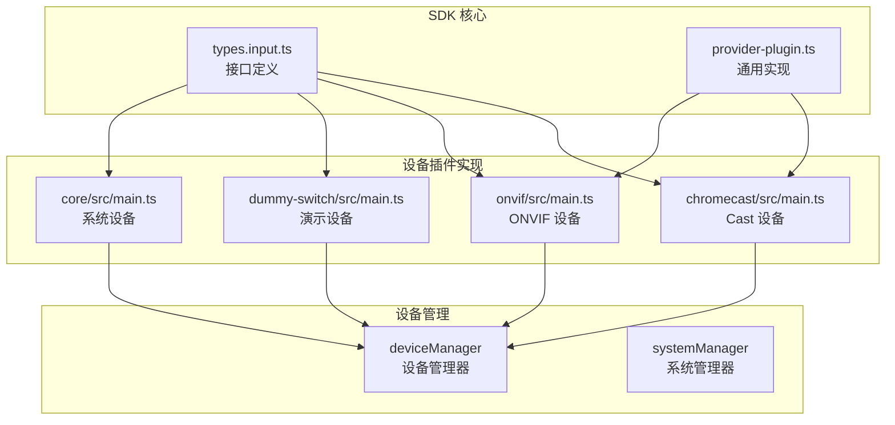

**图表来源**
- [types.input.ts:1275-1288](file://sdk/types/src/types.input.ts#L1275-L1288)
- [main.ts:463-595](file://plugins/chromecast/src/main.ts#L463-L595)
- [main.ts:334-622](file://plugins/onvif/src/main.ts#L334-L622)

**章节来源**
- [types.input.ts:1275-1474](file://sdk/types/src/types.input.ts#L1275-L1474)
- [main.ts:1-595](file://plugins/chromecast/src/main.ts#L1-595)

## 核心组件

### DeviceProvider 接口定义

DeviceProvider 接口是设备管理的核心抽象，定义了设备生命周期管理的基本方法：

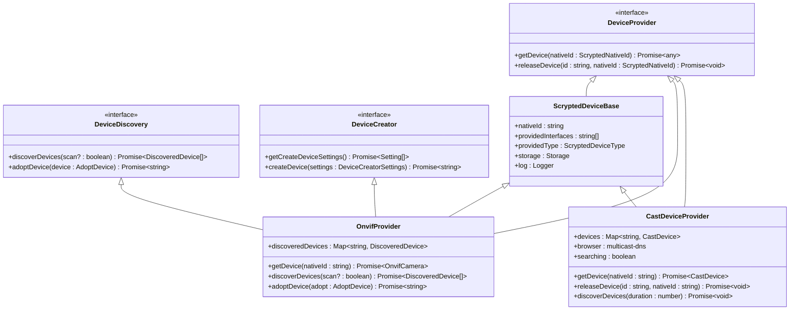

**图表来源**
- [types.input.ts:1275-1349](file://sdk/types/src/types.input.ts#L1275-L1349)
- [main.ts:463-595](file://plugins/chromecast/src/main.ts#L463-L595)
- [main.ts:334-622](file://plugins/onvif/src/main.ts#L334-L622)

### 设备发现机制

Scrypted 支持多种设备发现方式，每种方式都有其特定的应用场景：

#### 主动扫描模式
主动扫描通过定时查询或轮询机制主动发现设备：

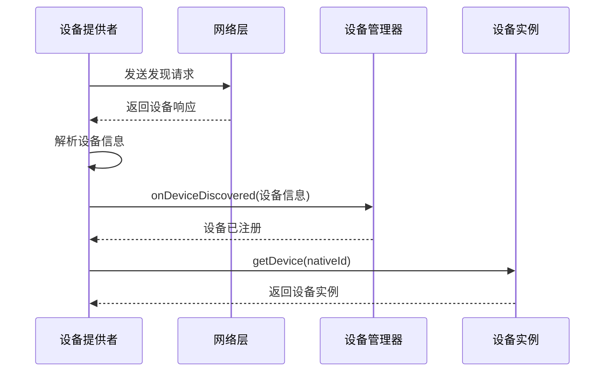

**图表来源**
- [main.ts:574-591](file://plugins/chromecast/src/main.ts#L574-L591)
- [main.ts:358-437](file://plugins/onvif/src/main.ts#L358-L437)

#### 被动监听模式
被动监听通过事件驱动的方式响应设备变化：

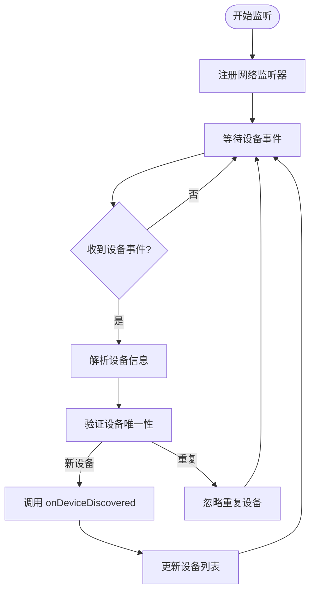

**图表来源**
- [main.ts:479-522](file://plugins/chromecast/src/main.ts#L479-L522)
- [main.ts:358-437](file://plugins/onvif/src/main.ts#L358-L437)

#### 配置驱动模式
配置驱动通过用户输入的配置信息直接创建设备：

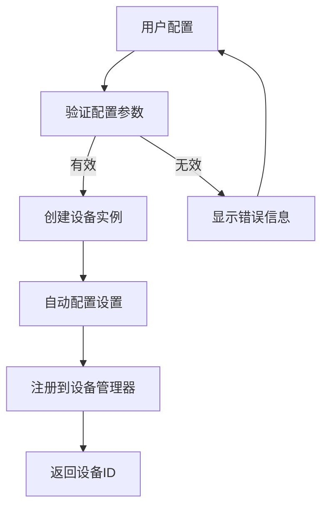

**图表来源**
- [main.ts:465-543](file://plugins/onvif/src/main.ts#L465-L543)
- [main.ts:727-781](file://plugins/amcrest/src/main.ts#L727-L781)

**章节来源**
- [types.input.ts:1337-1349](file://sdk/types/src/types.input.ts#L1337-L1349)
- [main.ts:463-595](file://plugins/chromecast/src/main.ts#L463-L595)
- [main.ts:334-622](file://plugins/onvif/src/main.ts#L334-L622)

## 架构概览

Scrypted 的 DeviceProvider 架构采用了分层设计，确保了良好的可扩展性和维护性：

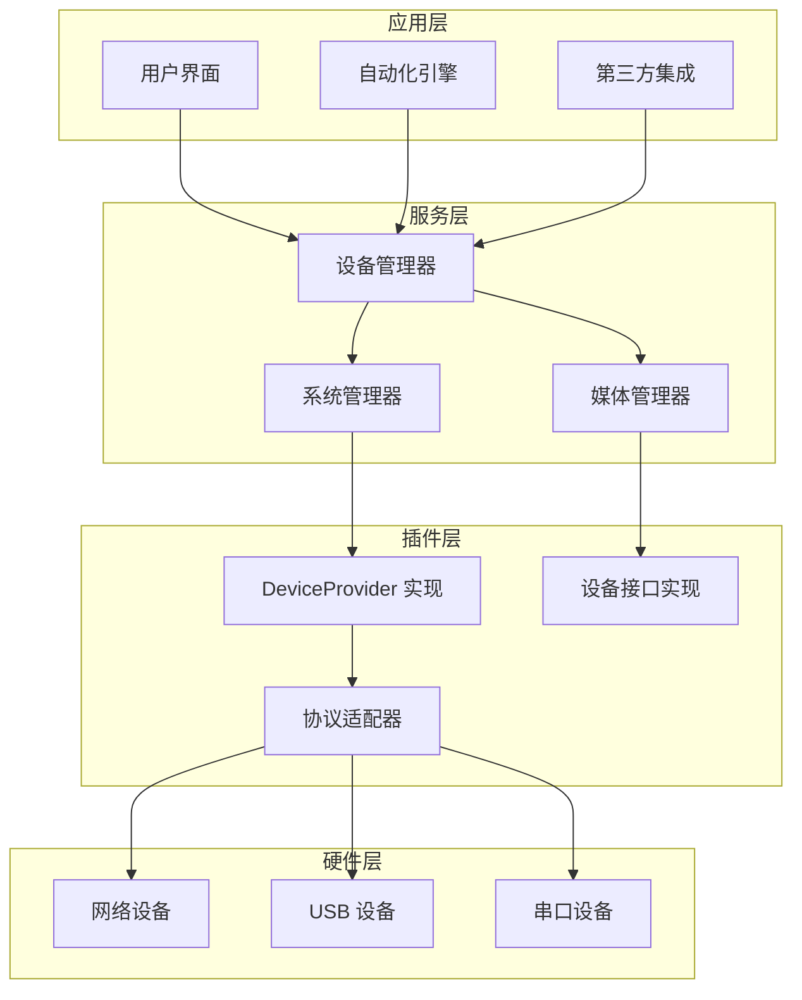

**图表来源**
- [main.ts:27-414](file://plugins/core/src/main.ts#L27-L414)
- [types.input.ts:1275-1288](file://sdk/types/src/types.input.ts#L1275-L1288)

## 详细组件分析

### Chromecast 设备提供者

Chromecast 插件展示了典型的基于 mDNS 的设备发现实现：

#### 设备发现流程

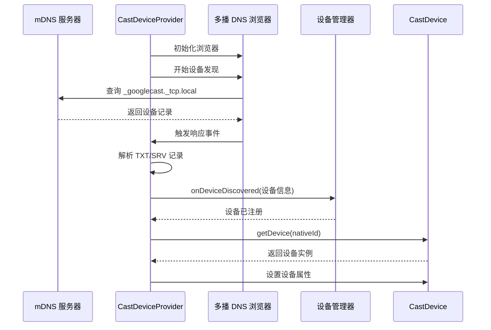

**图表来源**
- [main.ts:469-525](file://plugins/chromecast/src/main.ts#L469-L525)
- [main.ts:527-559](file://plugins/chromecast/src/main.ts#L527-L559)

#### 设备实例化过程

CastDeviceProvider 展示了完整的设备实例化流程：

| 步骤 | 操作 | 说明 |
|------|------|------|
| 1 | 设备发现 | 通过 mDNS 发现 Chromecast 设备 |
| 2 | 设备注册 | 调用 `onDeviceDiscovered` 注册设备 |
| 3 | 实例创建 | 在 `getDevice` 中创建 CastDevice 实例 |
| 4 | 属性设置 | 设置设备的主机地址等属性 |
| 5 | 状态管理 | 维护设备连接状态 |

**章节来源**
- [main.ts:463-595](file://plugins/chromecast/src/main.ts#L463-L595)

### ONVIF 设备提供者

ONVIF 插件提供了最完整的 DeviceDiscovery 和 DeviceCreator 实现：

#### 设备发现实现

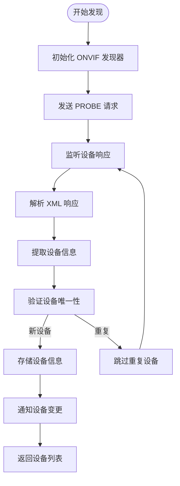

**图表来源**
- [main.ts:358-437](file://plugins/onvif/src/main.ts#L358-L437)
- [main.ts:580-600](file://plugins/onvif/src/main.ts#L580-L600)

#### 设备创建流程

ONVIF 提供者支持两种设备创建方式：

1. **自动配置创建**：自动探测和配置设备参数
2. **手动配置创建**：通过用户输入配置设备

**章节来源**
- [main.ts:334-622](file://plugins/onvif/src/main.ts#L334-L622)

### 系统设备提供者

Core 插件展示了系统级设备的实现模式：

#### 内部设备注册

系统设备通过 `onDeviceDiscovered` 直接注册到设备管理器：

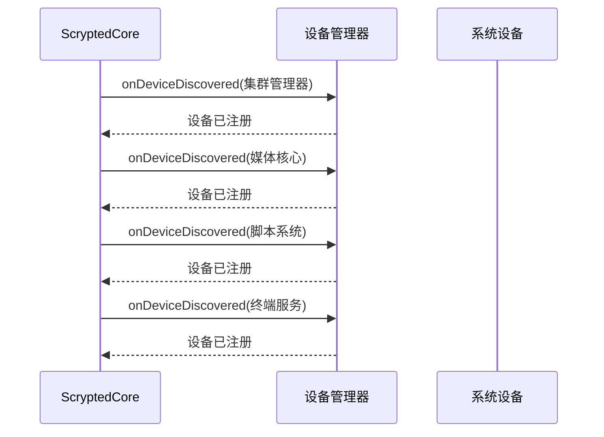

**图表来源**
- [main.ts:112-171](file://plugins/core/src/main.ts#L112-L171)

**章节来源**
- [main.ts:27-414](file://plugins/core/src/main.ts#L27-L414)

### 演示设备提供者

Dummy-switch 插件提供了最简单的 DeviceProvider 实现示例：

#### 设备创建流程

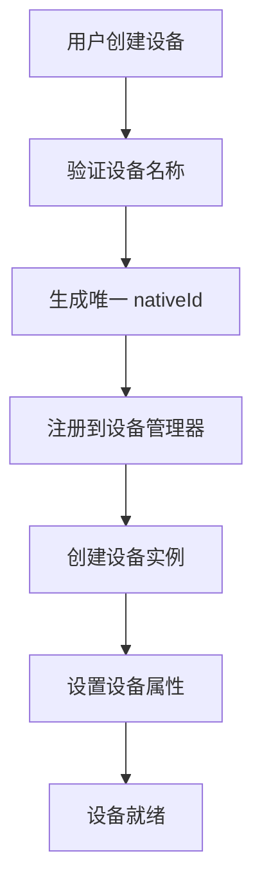

**图表来源**
- [main.ts:186-207](file://plugins/dummy-switch/src/main.ts#L186-L207)

**章节来源**
- [main.ts:138-231](file://plugins/dummy-switch/src/main.ts#L138-L231)

## 依赖关系分析

DeviceProvider 实现之间存在复杂的依赖关系：

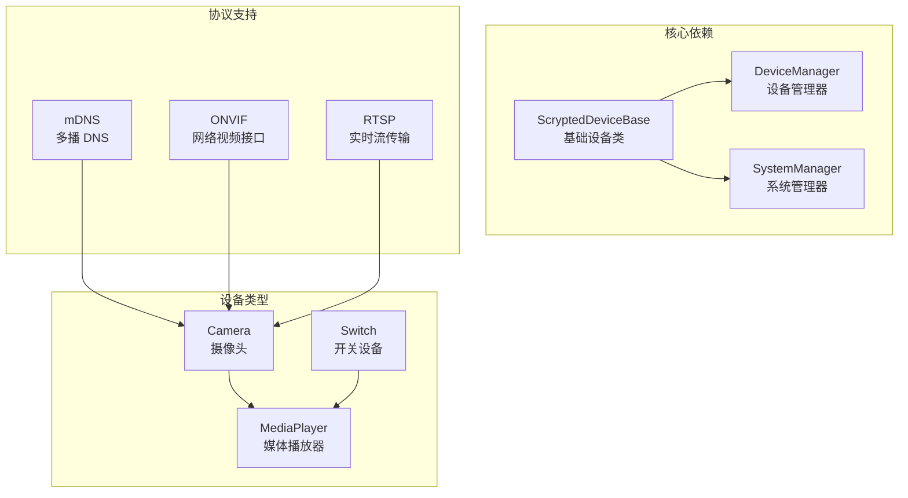

**图表来源**
- [main.ts:1-595](file://plugins/chromecast/src/main.ts#L1-595)
- [main.ts:1-622](file://plugins/onvif/src/main.ts#L1-622)

**章节来源**
- [provider-plugin.ts:1-99](file://common/src/provider-plugin.ts#L1-99)

## 性能考虑

### 设备发现优化

1. **并发发现**：使用多线程或异步操作并行发现多个设备
2. **缓存策略**：缓存已发现的设备信息，避免重复查询
3. **超时控制**：合理设置网络请求超时时间
4. **去重机制**：确保同一设备不会被重复发现

### 内存管理

1. **实例池**：复用设备实例而不是频繁创建销毁
2. **垃圾回收**：及时清理不再使用的设备引用
3. **资源监控**：监控内存使用情况，防止内存泄漏

### 网络优化

1. **批量操作**：支持批量设备发现和注册
2. **增量更新**：只更新发生变化的设备信息
3. **连接复用**：复用网络连接减少开销

## 故障排除指南

### 常见问题及解决方案

#### 设备无法发现
- **检查网络连接**：确认设备与控制器在同一网络
- **验证端口开放**：确保必要的网络端口已开放
- **检查防火墙设置**：确认防火墙没有阻止设备通信

#### 设备实例化失败
- **验证 nativeId 唯一性**：确保每个设备有唯一的标识符
- **检查权限设置**：确认有足够的权限访问设备
- **查看日志信息**：分析错误日志定位问题

#### 设备释放异常
- **资源清理**：确保所有网络连接和文件句柄都已关闭
- **回调处理**：正确处理异步操作的完成回调
- **异常捕获**：捕获并处理可能发生的异常

### 调试技巧

1. **启用详细日志**：增加日志级别获取更多信息
2. **使用开发者工具**：利用浏览器开发者工具调试
3. **单元测试**：编写测试用例验证关键功能
4. **性能分析**：使用性能分析工具识别瓶颈

**章节来源**
- [provider-plugin.ts:17-33](file://common/src/provider-plugin.ts#L17-L33)

## 结论

DeviceProvider 接口为 Scrypted 生态系统提供了强大的设备管理能力。通过标准化的接口定义和灵活的实现模式，开发者可以轻松地集成各种类型的设备。

### 最佳实践总结

1. **遵循接口规范**：严格按照 DeviceProvider 接口定义实现
2. **错误处理**：完善的错误处理和异常恢复机制
3. **性能优化**：关注性能影响，避免阻塞操作
4. **资源管理**：正确的资源分配和释放
5. **测试覆盖**：充分的单元测试和集成测试

### 未来发展方向

1. **协议扩展**：支持更多设备协议和标准
2. **智能化管理**：引入 AI/ML 技术优化设备管理
3. **云集成**：增强云端服务的集成能力
4. **安全强化**：提升设备通信和数据的安全性

通过深入理解和正确实现 DeviceProvider 接口，开发者可以构建出稳定、高效、易维护的设备管理解决方案。