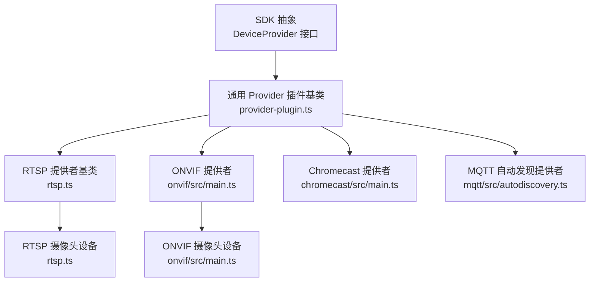
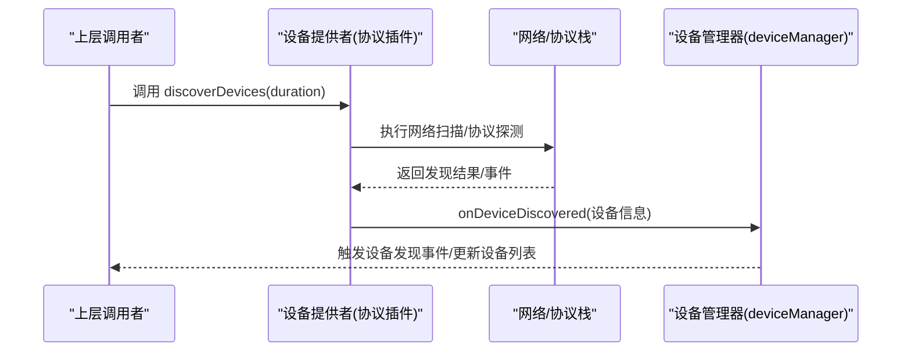
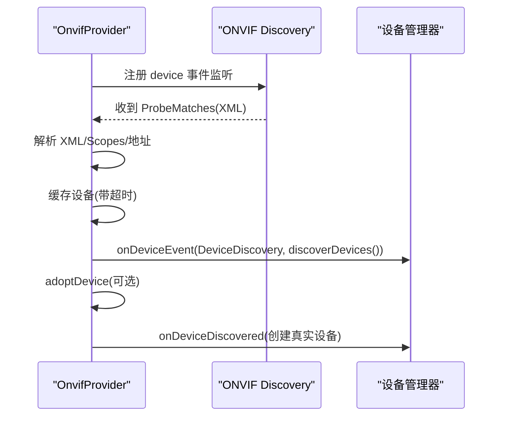
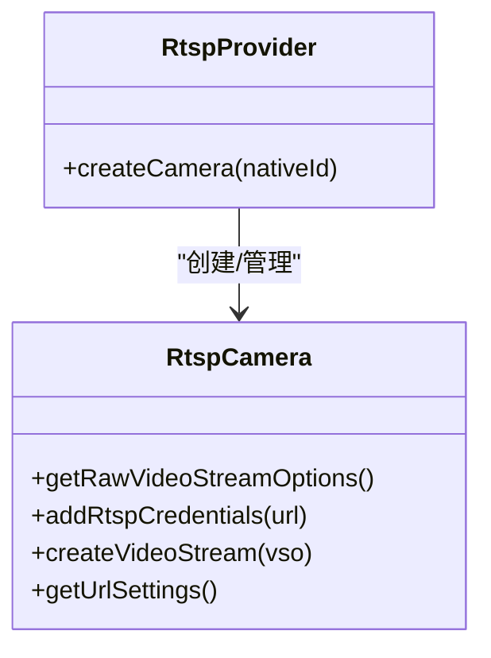
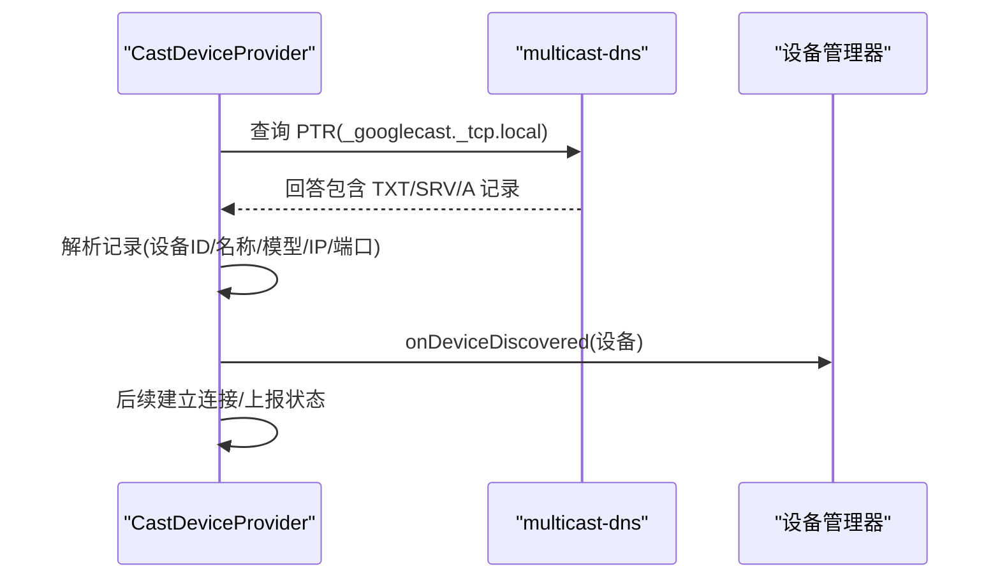
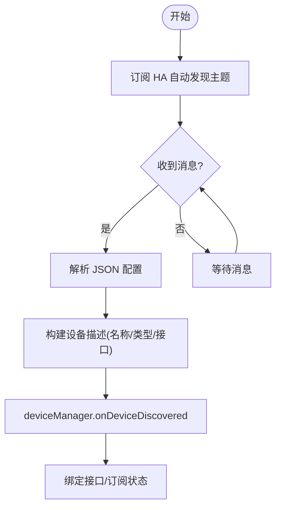
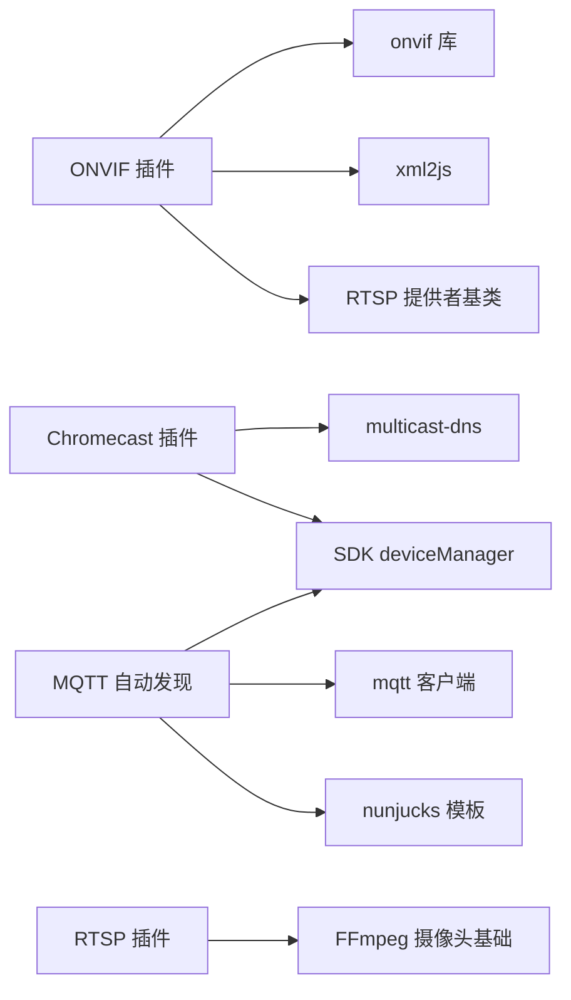

# 设备发现机制

<cite>
**本文引用的文件**
- [common/src/provider-plugin.ts](file://common/src/provider-plugin.ts)
- [plugins/rtsp/src/rtsp.ts](file://plugins/rtsp/src/rtsp.ts)
- [plugins/rtsp/src/main.ts](file://plugins/rtsp/src/main.ts)
- [plugins/onvif/src/main.ts](file://plugins/onvif/src/main.ts)
- [plugins/chromecast/src/main.ts](file://plugins/chromecast/src/main.ts)
- [plugins/mqtt/src/autodiscovery.ts](file://plugins/mqtt/src/autodiscovery.ts)
</cite>

## 目录
1. [引言](#引言)
2. [项目结构](#项目结构)
3. [核心组件](#核心组件)
4. [架构总览](#架构总览)
5. [详细组件分析](#详细组件分析)
6. [依赖关系分析](#依赖关系分析)
7. [性能考量](#性能考量)
8. [故障排查指南](#故障排查指南)
9. [结论](#结论)
10. [附录](#附录)

## 引言
本文件系统性阐述 Scrypted 的设备发现机制，覆盖网络扫描、协议探测与设备枚举等策略；详解 discoverDevices 方法的实现模式（主动与被动）、超时处理、结果过滤与排序；并结合 ONVIF、RTSP、Chromecast、MQTT 自动发现等实际插件，给出可复用的实现范式与最佳实践。同时涵盖网络协议支持、并发控制策略与发现结果缓存管理，帮助开发者快速实现自定义发现逻辑并优化性能。

## 项目结构
Scrypted 将“发现”能力抽象在 SDK 层，具体实现由各协议插件完成。核心结构要点：
- SDK 抽象：DeviceProvider 接口定义 discoverDevices 能力，供上层统一调用。
- 协议插件：如 ONVIF、RTSP、Chromecast、MQTT 等各自实现 discoverDevices 或通过事件驱动触发发现。
- 发现结果上报：通过 deviceManager.onDeviceDiscovered 上报新设备，触发 UI 与自动化流程。

图表来源
- [common/src/provider-plugin.ts:35-44](file://common/src/provider-plugin.ts#L35-L44)
- [plugins/rtsp/src/rtsp.ts:378-383](file://plugins/rtsp/src/rtsp.ts#L378-L383)
- [plugins/onvif/src/main.ts:334-463](file://plugins/onvif/src/main.ts#L334-L463)
- [plugins/chromecast/src/main.ts:463-592](file://plugins/chromecast/src/main.ts#L463-L592)
- [plugins/mqtt/src/autodiscovery.ts:76-209](file://plugins/mqtt/src/autodiscovery.ts#L76-L209)

章节来源
- [common/src/provider-plugin.ts:1-99](file://common/src/provider-plugin.ts#L1-99)
- [plugins/rtsp/src/rtsp.ts:1-383](file://plugins/rtsp/src/rtsp.ts#L1-L383)
- [plugins/onvif/src/main.ts:1-622](file://plugins/onvif/src/main.ts#L1-L622)
- [plugins/chromecast/src/main.ts:1-595](file://plugins/chromecast/src/main.ts#L1-L595)
- [plugins/mqtt/src/autodiscovery.ts:1-757](file://plugins/mqtt/src/autodiscovery.ts#L1-L757)

## 核心组件
- DeviceProvider 与 discoverDevices：SDK 定义的统一入口，要求实现 discoverDevices(duration) 返回发现结果或触发事件上报。
- Provider 基类与实例化：通用 Provider 插件基类提供默认空实现，便于按需覆盖。
- 协议提供者：
  - ONVIF 提供者：基于 onvif 库的 Discovery 事件，解析 ProbeMatches 并缓存待采用设备。
  - RTSP 提供者：作为摄像头提供者基类，配合 FFmpeg 摄像头基础能力。
  - Chromecast 提供者：使用 multicast-dns 查询 _googlecast._tcp.local，解析 TXT/SRV/A 记录后上报设备。
  - MQTT 自动发现提供者：订阅 Home Assistant MQTT 自动发现主题，解析配置后动态创建设备。

章节来源
- [common/src/provider-plugin.ts:35-44](file://common/src/provider-plugin.ts#L35-L44)
- [plugins/onvif/src/main.ts:334-463](file://plugins/onvif/src/main.ts#L334-L463)
- [plugins/rtsp/src/rtsp.ts:378-383](file://plugins/rtsp/src/rtsp.ts#L378-L383)
- [plugins/chromecast/src/main.ts:463-592](file://plugins/chromecast/src/main.ts#L463-L592)
- [plugins/mqtt/src/autodiscovery.ts:76-209](file://plugins/mqtt/src/autodiscovery.ts#L76-L209)

## 架构总览
下图展示了“发现”在系统中的位置与交互路径：上层通过 DeviceProvider 调用 discoverDevices，协议插件执行网络扫描/协议探测，最终通过 deviceManager.onDeviceDiscovered 上报设备。

图表来源
- [common/src/provider-plugin.ts:35-44](file://common/src/provider-plugin.ts#L35-L44)
- [plugins/onvif/src/main.ts:580-600](file://plugins/onvif/src/main.ts#L580-L600)
- [plugins/chromecast/src/main.ts:574-591](file://plugins/chromecast/src/main.ts#L574-L591)
- [plugins/mqtt/src/autodiscovery.ts:144-155](file://plugins/mqtt/src/autodiscovery.ts#L144-L155)

## 详细组件分析

### ONVIF 设备发现
- 主动发现：通过 onvif.Discovery.probe() 发起探针请求。
- 被动发现：监听 onvif.Discovery 的 device 事件，解析 XML 响应，提取设备名、IP、端口、Scopes 等信息。
- 结果缓存：以 Map 存储已发现设备，带超时清理；每次发现事件触发后，通过 onDeviceEvent 上报当前所有已发现设备。
- adoptDevice：从缓存中取出设备，填充 IP/HTTP 端口，必要时自动配置参数后创建设备。

图表来源
- [plugins/onvif/src/main.ts:358-437](file://plugins/onvif/src/main.ts#L358-L437)
- [plugins/onvif/src/main.ts:580-600](file://plugins/onvif/src/main.ts#L580-L600)
- [plugins/onvif/src/main.ts:602-618](file://plugins/onvif/src/main.ts#L602-L618)

章节来源
- [plugins/onvif/src/main.ts:334-463](file://plugins/onvif/src/main.ts#L334-L463)
- [plugins/onvif/src/main.ts:580-600](file://plugins/onvif/src/main.ts#L580-L600)
- [plugins/onvif/src/main.ts:602-618](file://plugins/onvif/src/main.ts#L602-L618)

### RTSP 设备发现
- RTSP 提供者作为摄像头提供者基类，负责生成媒体流选项与设备设置项；其 discoverDevices 默认为空实现，通常由上层或其它插件触发发现。
- RTSP 摄像头设备支持多路流、URL 设置、认证注入等，适合在已知地址场景下直接创建设备。

图表来源
- [plugins/rtsp/src/rtsp.ts:378-383](file://plugins/rtsp/src/rtsp.ts#L378-L383)
- [plugins/rtsp/src/rtsp.ts:21-145](file://plugins/rtsp/src/rtsp.ts#L21-L145)

章节来源
- [plugins/rtsp/src/rtsp.ts:1-383](file://plugins/rtsp/src/rtsp.ts#L1-L383)
- [plugins/rtsp/src/main.ts:1-8](file://plugins/rtsp/src/main.ts#L1-L8)

### Chromecast 设备发现
- 使用 multicast-dns 查询 _googlecast._tcp.local，解析 TXT/SRV/A 记录获取设备 ID、名称、模型、IP、端口。
- 通过 deviceManager.onDeviceDiscovered 上报设备，后续可建立 Cast 连接进行播放控制。

图表来源
- [plugins/chromecast/src/main.ts:479-522](file://plugins/chromecast/src/main.ts#L479-L522)
- [plugins/chromecast/src/main.ts:574-591](file://plugins/chromecast/src/main.ts#L574-L591)

章节来源
- [plugins/chromecast/src/main.ts:463-592](file://plugins/chromecast/src/main.ts#L463-L592)

### MQTT 自动发现
- 订阅 homeassistant MQTT 自动发现主题，解析 config，动态创建设备并绑定接口。
- 通过 deviceManager.onDeviceDiscovered 上报设备，支持在线状态、亮度、颜色温度、HSV、开关、门锁、传感器等接口的自动映射。

图表来源
- [plugins/mqtt/src/autodiscovery.ts:85-187](file://plugins/mqtt/src/autodiscovery.ts#L85-L187)
- [plugins/mqtt/src/autodiscovery.ts:144-155](file://plugins/mqtt/src/autodiscovery.ts#L144-L155)

章节来源
- [plugins/mqtt/src/autodiscovery.ts:76-209](file://plugins/mqtt/src/autodiscovery.ts#L76-L209)

## 依赖关系分析
- ONVIF 插件依赖 onvif 库与 xml2js 解析 XML；依赖 RTSP 提供者基类以复用摄像头能力。
- Chromecast 插件依赖 multicast-dns；依赖 SDK 的 deviceManager 与 endpointManager。
- MQTT 自动发现插件依赖 mqtt 客户端与 nunjucks 模板渲染；依赖 SDK 的 deviceManager。
- RTSP 插件依赖 FFmpeg 摄像头基础能力，提供媒体流 URL 生成与认证注入。

图表来源
- [plugins/onvif/src/main.ts:1-14](file://plugins/onvif/src/main.ts#L1-L14)
- [plugins/chromecast/src/main.ts:1-8](file://plugins/chromecast/src/main.ts#L1-L8)
- [plugins/mqtt/src/autodiscovery.ts:1-11](file://plugins/mqtt/src/autodiscovery.ts#L1-L11)
- [plugins/rtsp/src/rtsp.ts:1-6](file://plugins/rtsp/src/rtsp.ts#L1-L6)

章节来源
- [plugins/onvif/src/main.ts:1-14](file://plugins/onvif/src/main.ts#L1-L14)
- [plugins/chromecast/src/main.ts:1-8](file://plugins/chromecast/src/main.ts#L1-L8)
- [plugins/mqtt/src/autodiscovery.ts:1-11](file://plugins/mqtt/src/autodiscovery.ts#L1-L11)
- [plugins/rtsp/src/rtsp.ts:1-6](file://plugins/rtsp/src/rtsp.ts#L1-L6)

## 性能考量
- 并发控制
  - ONVIF：使用单个 Discovery 实例监听设备事件，避免重复扫描；对每个发现设备设置超时清理，防止内存泄漏。
  - Chromecast：定时多次查询 PTR，降低漏报概率；仅在首次启动时初始化搜索，避免重复启动。
  - MQTT：订阅固定前缀主题，按需绑定设备，减少无效消息处理。
- 超时与重试
  - ONVIF：设备缓存带 5 分钟超时，闲置超过阈值会销毁监听并重置。
  - RTSP：构造视频流选项时使用超时 Promise，避免长时间阻塞。
- 结果缓存
  - ONVIF：Map 缓存已发现设备，合并重复设备；adoptDevice 后移除缓存。
  - MQTT：按 nativeId 去重，支持节点 ID 组合多接口设备。
- 网络开销
  - ONVIF：仅在需要时发送 Probe 请求；Chromecast：合理设置查询间隔。
  - RTSP：尽量使用已知地址直连，减少额外探测。

章节来源
- [plugins/onvif/src/main.ts:334-437](file://plugins/onvif/src/main.ts#L334-L437)
- [plugins/onvif/src/main.ts:424-427](file://plugins/onvif/src/main.ts#L424-L427)
- [plugins/onvif/src/main.ts:580-600](file://plugins/onvif/src/main.ts#L580-L600)
- [plugins/chromecast/src/main.ts:574-591](file://plugins/chromecast/src/main.ts#L574-L591)
- [plugins/rtsp/src/rtsp.ts:361-366](file://plugins/rtsp/src/rtsp.ts#L361-L366)

## 故障排查指南
- ONVIF 设备未出现
  - 检查网络是否允许组播/UDP；确认防火墙放行端口；验证设备是否正确响应 Probe。
  - 查看控制台日志中“discovery error”与“Discovery Reply”输出。
  - 确认 adoptDevice 是否成功，缓存是否被清理。
- Chromecast 设备未发现
  - 确认本地网络 mDNS 是否可用；检查查询是否发出且收到回答。
  - 核对 TXT/SRV/A 记录解析是否完整。
- MQTT 自动发现无设备
  - 确认 homeassistant 自动发现主题前缀与订阅一致；检查 config JSON 是否有效。
  - 关注“unhandled component”或“no config”提示。
- RTSP 设备无法拉流
  - 检查 URL 与认证信息；确认端口与协议；查看媒体流选项构造是否超时。

章节来源
- [plugins/onvif/src/main.ts:374-376](file://plugins/onvif/src/main.ts#L374-L376)
- [plugins/onvif/src/main.ts:404-405](file://plugins/onvif/src/main.ts#L404-L405)
- [plugins/chromecast/src/main.ts:497-511](file://plugins/chromecast/src/main.ts#L497-L511)
- [plugins/mqtt/src/autodiscovery.ts:111-114](file://plugins/mqtt/src/autodiscovery.ts#L111-L114)
- [plugins/rtsp/src/rtsp.ts:361-366](file://plugins/rtsp/src/rtsp.ts#L361-L366)

## 结论
Scrypted 的设备发现机制以 SDK 抽象为核心，通过协议插件实现多样化的发现策略：ONVIF 的协议探测、Chromecast 的 mDNS 查询、MQTT 的自动发现以及 RTSP 的直连配置。通过事件驱动与缓存管理，系统在保证实时性的同时兼顾性能与稳定性。开发者可参考上述实现范式，快速扩展新的发现协议与优化现有策略。

## 附录
- discoverDevices 方法实现模式
  - 主动发现：显式发起网络请求（如 ONVIF Probe、Chromecast 查询）。
  - 被动发现：监听协议事件（如 ONVIF device、Chromecast response），解析后上报。
  - 结果处理：统一通过 deviceManager.onDeviceDiscovered 上报；必要时进行去重、过滤与排序。
- 自定义发现实现建议
  - 明确发现来源（网络扫描/协议事件/外部服务）与边界（超时、重试、并发）。
  - 使用缓存与超时清理，避免重复上报与资源泄漏。
  - 对异常进行捕获与降级，确保不影响主流程。
  - 参考现有插件的 discoverDevices 与 adoptDevice 模式，保持一致性。