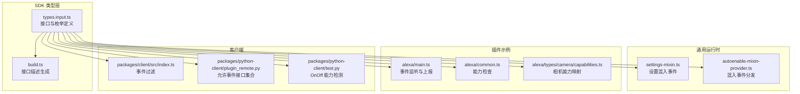
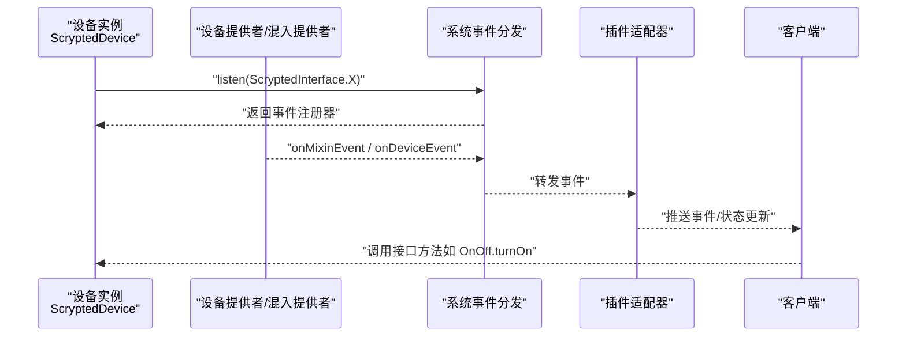
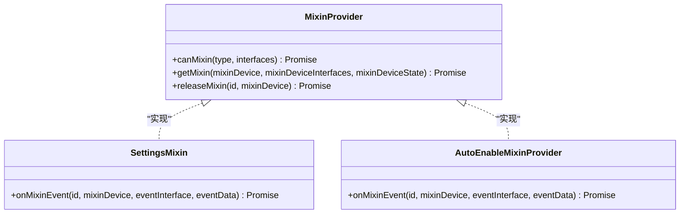
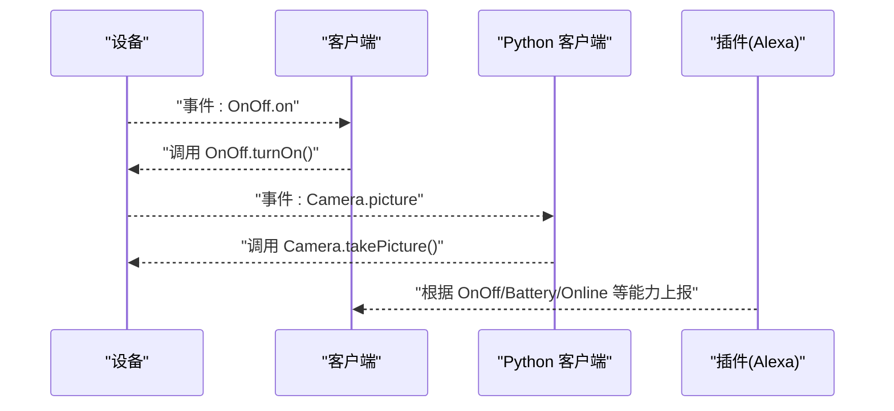
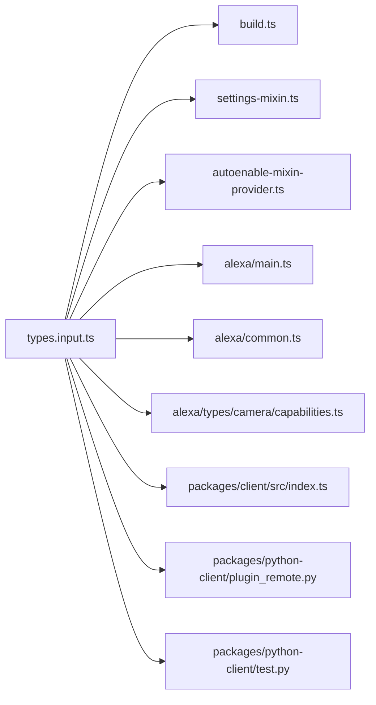

# 设备接口实现

<cite>
**本文引用的文件**
- [sdk/types/src/types.input.ts](file://sdk/types/src/types.input.ts)
- [sdk/types/src/build.ts](file://sdk/types/src/build.ts)
- [common/src/settings-mixin.ts](file://common/src/settings-mixin.ts)
- [common/src/autoenable-mixin-provider.ts](file://common/src/autoenable-mixin-provider.ts)
- [plugins/alexa/src/main.ts](file://plugins/alexa/src/main.ts)
- [plugins/alexa/src/common.ts](file://plugins/alexa/src/common.ts)
- [plugins/alexa/src/types/camera/capabilities.ts](file://plugins/alexa/src/types/camera/capabilities.ts)
- [packages/client/src/index.ts](file://packages/client/src/index.ts)
- [packages/python-client/plugin_remote.py](file://packages/python-client/plugin_remote.py)
- [packages/python-client/test.py](file://packages/python-client/test.py)
</cite>

## 目录
1. [引言](#引言)
2. [项目结构](#项目结构)
3. [核心组件](#核心组件)
4. [架构总览](#架构总览)
5. [详细组件分析](#详细组件分析)
6. [依赖分析](#依赖分析)
7. [性能考虑](#性能考虑)
8. [故障排查指南](#故障排查指南)
9. [结论](#结论)
10. [附录](#附录)

## 引言
本文件面向 Scrypted 插件开发者，系统化阐述 ScryptedInterface 枚举中关键设备接口的设计与实现要点，覆盖以下主题：
- 接口声明与方法/属性定义
- 事件订阅与触发机制
- 混入（Mixin）增强与多接口设备组合
- 接口冲突处理与版本兼容策略
- 实现最佳实践与调试技巧

目标是帮助你在不直接阅读源码的情况下，也能准确理解并实现符合 Scrypted 规范的设备接口。

## 项目结构
围绕设备接口的核心类型与工具位于 SDK 类型定义模块；混入与插件侧的事件监听在通用模块与插件示例中体现；客户端与 Python 客户端展示了接口使用方式。

**图表来源**
- [sdk/types/src/types.input.ts](file://sdk/types/src/types.input.ts)
- [sdk/types/src/build.ts](file://sdk/types/src/build.ts)
- [common/src/settings-mixin.ts](file://common/src/settings-mixin.ts)
- [common/src/autoenable-mixin-provider.ts](file://common/src/autoenable-mixin-provider.ts)
- [plugins/alexa/src/main.ts](file://plugins/alexa/src/main.ts)
- [plugins/alexa/src/common.ts](file://plugins/alexa/src/common.ts)
- [plugins/alexa/src/types/camera/capabilities.ts](file://plugins/alexa/src/types/camera/capabilities.ts)
- [packages/client/src/index.ts](file://packages/client/src/index.ts)
- [packages/python-client/plugin_remote.py](file://packages/python-client/plugin_remote.py)
- [packages/python-client/test.py](file://packages/python-client/test.py)

**章节来源**
- [sdk/types/src/types.input.ts](file://sdk/types/src/types.input.ts)
- [sdk/types/src/build.ts](file://sdk/types/src/build.ts)

## 核心组件
- ScryptedInterface 枚举：统一声明所有设备可实现的接口名称，如 OnOff、Brightness、Camera、Sensors、Notifier、VideoCamera、Lock、SecuritySystem 等。
- 接口契约：每个接口对应一组方法与属性，例如 OnOff 提供开关控制方法与状态布尔值；Camera 提供拍照与图片选项查询；VideoCamera 提供视频流获取与选项查询；Sensors 提供多传感器键值对；Lock 提供加锁/解锁与状态；SecuritySystem 提供布防/撤防与状态；等等。
- 事件系统：设备通过 ScryptedDevice.listen 订阅特定接口或属性变更事件；事件细节由 EventDetails 描述，包含事件接口名、时间戳、属性名等。
- 混入（Mixin）：MixinProvider 可为现有设备动态注入新接口，settings-mixin 在启用 Settings 接口时会触发 onMixinEvent 通知系统。

**章节来源**
- [sdk/types/src/types.input.ts](file://sdk/types/src/types.input.ts)
- [common/src/settings-mixin.ts](file://common/src/settings-mixin.ts)

## 架构总览
下图展示了从设备到插件再到客户端的事件流转路径，以及混入增强的参与点。

**图表来源**
- [sdk/types/src/types.input.ts](file://sdk/types/src/types.input.ts)
- [common/src/autoenable-mixin-provider.ts](file://common/src/autoenable-mixin-provider.ts)
- [common/src/settings-mixin.ts](file://common/src/settings-mixin.ts)
- [packages/client/src/index.ts](file://packages/client/src/index.ts)

## 详细组件分析

### ScryptedInterface.OnOff
- 功能：提供基本的开关控制能力。
- 方法与属性：
  - turnOn()/turnOff() 控制方法
  - on?: boolean 状态属性
- 事件与订阅：可通过 listen(ScryptedInterface.OnOff) 订阅状态变化；客户端与插件侧均可见该事件。
- 典型实现要点：
  - 状态同步：在 turnOn/turnOff 后更新内部状态，并确保后续查询返回一致结果。
  - 幂等性：重复调用 turnOn/turnOff 应保持幂等。
- 示例参考：
  - 客户端侧事件过滤与处理：[packages/client/src/index.ts](file://packages/client/src/index.ts)
  - Python 客户端能力检测：[packages/python-client/test.py](file://packages/python-client/test.py)

**章节来源**
- [sdk/types/src/types.input.ts](file://sdk/types/src/types.input.ts)
- [packages/client/src/index.ts](file://packages/client/src/index.ts)
- [packages/python-client/test.py](file://packages/python-client/test.py)

### ScryptedInterface.Brightness
- 功能：提供亮度调节能力（0-100）。
- 方法与属性：
  - setBrightness(number) 设置亮度
  - brightness?: number 当前亮度
- 实现建议：
  - 边界校验：确保传入值在 0-100 区间内。
  - 状态回写：setBrightness 后应更新 brightness 属性，保证查询一致性。
- 适用场景：灯泡、显示器背光等。

**章节来源**
- [sdk/types/src/types.input.ts](file://sdk/types/src/types.input.ts)

### ScryptedInterface.Camera 与 ScryptedInterface.VideoCamera
- Camera：提供 takePicture(options) 与 getPictureOptions()，用于抓拍静态图片与图片选项。
- VideoCamera：提供 getVideoStream(options) 与 getVideoStreamOptions()，用于获取实时视频流及可用流配置。
- 实现要点：
  - 图片/视频流需支持转换与本地 URL 导出（MediaConverter/MediaManager）。
  - 流选项应包含容器、编码、分辨率、帧率、比特率等参数，便于客户端自适应。
- 事件与订阅：
  - 可通过 listen(ScryptedInterface.Camera 或 VideoCamera) 订阅相关事件。
  - 某些插件（如 Alexa）会基于设备是否具备 ObjectDetector/MotionSensor 等接口来决定能力上报。

**章节来源**
- [sdk/types/src/types.input.ts](file://sdk/types/src/types.input.ts)
- [plugins/alexa/src/types/camera/capabilities.ts](file://plugins/alexa/src/types/camera/capabilities.ts)

### ScryptedInterface.Sensors 与传感器族
- Sensors：提供多传感器键值对 sensors: Record<string, Sensor>。
- Sensor：包含 name、value、unit 字段，用于表达单一传感器指标。
- 传感器族接口（示例）：Thermometer、HumiditySensor、MotionSensor、AudioSensor、BinarySensor、TamperSensor、PowerSensor、AmbientLightSensor、OccupancySensor、FloodSensor、UltravioletSensor、LuminanceSensor、PositionSensor、PM10Sensor、PM25Sensor、VOCSensor、NOXSensor、CO2Sensor、AirQualitySensor、AirPurifier、FilterMaintenance 等。
- 实现建议：
  - 使用 Sensors 统一聚合多个指标，避免分散接口导致客户端适配复杂。
  - 对于数值型指标，建议提供单位与可读性良好的字符串表示。
- 事件与订阅：
  - 可按接口或属性粒度订阅，denoise 参数可用于去噪，减少抖动事件。

**章节来源**
- [sdk/types/src/types.input.ts](file://sdk/types/src/types.input.ts)

### ScryptedInterface.Lock 与 ScryptedInterface.SecuritySystem
- Lock：提供 lock()/unlock() 与 lockState?: LockState 状态。
- SecuritySystem：提供 armSecuritySystem()/disarmSecuritySystem() 与 securitySystemState?: SecuritySystemState。
- 实现建议：
  - LockState 与 SecuritySystemMode 需与 UI/生态保持一致。
  - 支持 supportedModes 与 obstruction 等字段，提升客户端体验。

**章节来源**
- [sdk/types/src/types.input.ts](file://sdk/types/src/types.input.ts)

### 混入（Mixin）与多接口设备
- 混入提供者（MixinProvider）：
  - canMixin(type, interfaces) 返回可提供的新接口列表
  - getMixin(mixinDevice, mixinDeviceInterfaces, mixinDeviceState) 创建混入实例
  - releaseMixin(id, mixinDevice) 释放资源
- settings-mixin：
  - 在启用 Settings 接口时，通过 onMixinEvent 通知系统，确保客户端能正确感知设置项变更。
- autoenable-mixin-provider：
  - 基于事件接口过滤与自动启用逻辑，避免不必要的混入开销。

**图表来源**
- [sdk/types/src/types.input.ts](file://sdk/types/src/types.input.ts)
- [common/src/settings-mixin.ts](file://common/src/settings-mixin.ts)
- [common/src/autoenable-mixin-provider.ts](file://common/src/autoenable-mixin-provider.ts)

**章节来源**
- [sdk/types/src/types.input.ts](file://sdk/types/src/types.input.ts)
- [common/src/settings-mixin.ts](file://common/src/settings-mixin.ts)
- [common/src/autoenable-mixin-provider.ts](file://common/src/autoenable-mixin-provider.ts)

### 事件系统与客户端交互
- 事件订阅：
  - ScryptedDevice.listen(event, callback) 支持按接口或属性订阅
  - EventListenerOptions 可指定 denoise/watch/mixinId 等行为
- 客户端侧：
  - packages/client/src/index.ts 中对 ScryptedDevice 事件进行过滤与处理
  - Python 客户端 plugin_remote.py 限制允许的事件接口集合
- 插件侧：
  - plugins/alexa/src/main.ts 展示了如何根据设备接口能力（如 OnOff/Battery/Online/ObjectDetector/MotionSensor）决定上报与事件处理

**图表来源**
- [packages/client/src/index.ts](file://packages/client/src/index.ts)
- [packages/python-client/plugin_remote.py](file://packages/python-client/plugin_remote.py)
- [plugins/alexa/src/main.ts](file://plugins/alexa/src/main.ts)

**章节来源**
- [sdk/types/src/types.input.ts](file://sdk/types/src/types.input.ts)
- [packages/client/src/index.ts](file://packages/client/src/index.ts)
- [packages/python-client/plugin_remote.py](file://packages/python-client/plugin_remote.py)
- [plugins/alexa/src/main.ts](file://plugins/alexa/src/main.ts)

## 依赖分析
- 类型与描述生成：
  - build.ts 通过解析 types.input.ts 中的接口定义，生成接口属性与方法枚举，以及 DeviceState 结构，用于运行时反射与 Python SDK 生成。
- 运行时事件：
  - settings-mixin 与 autoenable-mixin-provider 依赖 onMixinEvent/onDeviceEvent 机制，确保混入生效与事件分发。
- 生态适配：
  - Alexa 插件通过检查 OnOff、Battery、Online、ObjectDetector、MotionSensor 等接口，决定能力映射与上报策略。

**图表来源**
- [sdk/types/src/types.input.ts](file://sdk/types/src/types.input.ts)
- [sdk/types/src/build.ts](file://sdk/types/src/build.ts)
- [common/src/settings-mixin.ts](file://common/src/settings-mixin.ts)
- [common/src/autoenable-mixin-provider.ts](file://common/src/autoenable-mixin-provider.ts)
- [plugins/alexa/src/main.ts](file://plugins/alexa/src/main.ts)
- [plugins/alexa/src/common.ts](file://plugins/alexa/src/common.ts)
- [plugins/alexa/src/types/camera/capabilities.ts](file://plugins/alexa/src/types/camera/capabilities.ts)
- [packages/client/src/index.ts](file://packages/client/src/index.ts)
- [packages/python-client/plugin_remote.py](file://packages/python-client/plugin_remote.py)
- [packages/python-client/test.py](file://packages/python-client/test.py)

**章节来源**
- [sdk/types/src/build.ts](file://sdk/types/src/build.ts)
- [sdk/types/src/types.input.ts](file://sdk/types/src/types.input.ts)

## 性能考虑
- 去抖与被动监听：
  - 使用 EventListenerOptions.denoise 减少频繁抖动事件，降低带宽与 CPU 开销。
  - 使用 watch 选项避免轮询，仅被动接收事件。
- 流媒体与预缓冲：
  - VideoCamera/Camera 的流与图片请求支持超时与批量刷新提示，有助于优化用户体验与资源占用。
- 混入启用策略：
  - autoenable-mixin-provider 基于事件接口过滤，避免无谓的混入加载。

**章节来源**
- [sdk/types/src/types.input.ts](file://sdk/types/src/types.input.ts)
- [common/src/autoenable-mixin-provider.ts](file://common/src/autoenable-mixin-provider.ts)

## 故障排查指南
- 事件未到达客户端：
  - 检查事件接口是否在 allowedEventInterfaces 列表中（Python 客户端）
  - 确认设备是否正确调用 onMixinEvent/onDeviceEvent
- 能力上报异常（如 Alexa）：
  - 确保设备 interfaces 包含所需接口（OnOff/Battery/Online/ObjectDetector/MotionSensor），并在 canMixin/capabilities 映射中正确声明
- 状态不一致：
  - 确保接口方法执行后及时更新对应属性，避免查询与实际状态不符
- 多接口冲突：
  - 合理拆分职责，优先使用 MixinProvider 注入能力，避免在同一设备上重复实现相同语义的接口

**章节来源**
- [packages/python-client/plugin_remote.py](file://packages/python-client/plugin_remote.py)
- [common/src/settings-mixin.ts](file://common/src/settings-mixin.ts)
- [plugins/alexa/src/common.ts](file://plugins/alexa/src/common.ts)
- [plugins/alexa/src/types/camera/capabilities.ts](file://plugins/alexa/src/types/camera/capabilities.ts)

## 结论
Scrypted 的设备接口体系以 ScryptedInterface 枚举为核心，配合接口契约、事件系统与混入机制，实现了高度模块化与可扩展的设备抽象。遵循本文的实现原则与最佳实践，可以高效地为各类设备提供一致且可靠的接口能力，并在多生态平台（如 Alexa）中稳定运行。

## 附录

### 接口清单与典型用途速览
- OnOff：开关控制
- Brightness：亮度调节
- Camera/VideoCamera：拍照与视频流
- Sensors：多指标传感器聚合
- Lock/SecuritySystem：门锁与安防
- Notifier：消息通知通道
- StartStop/Pause/Dock：清洁类设备控制
- TemperatureSetting/Thermometer/HumiditySensor：温控与环境监测
- Microphone/AudioVolumeControl/Intercom/Display：音频输入输出与播放
- ObjectDetector/ObjectDetection：智能检测
- Settings：设备配置项
- Refresh：周期性刷新
- Online/Battery/Charger：在线与电量状态
- BinarySensor/TamperSensor/PowerSensor/AudioSensor/MotionSensor/AmbientLightSensor/OccupancySensor/FloodSensor/UltravioletSensor/LuminanceSensor/PositionSensor/PM10Sensor/PM25Sensor/VOCSensor/NOXSensor/CO2Sensor/AirQualitySensor/AirPurifier/FilterMaintenance：各类传感器

**章节来源**
- [sdk/types/src/types.input.ts](file://sdk/types/src/types.input.ts)