# 设备插件开发

<cite>
**本文引用的文件**
- [sdk/src/index.ts](file://sdk/src/index.ts)
- [common/src/devices.ts](file://common/src/devices.ts)
- [common/src/provider-plugin.ts](file://common/src/provider-plugin.ts)
- [common/src/settings-mixin.ts](file://common/src/settings-mixin.ts)
- [sdk/types/src/types.input.ts](file://sdk/types/src/types.input.ts)
- [plugins/dummy-switch/src/main.ts](file://plugins/dummy-switch/src/main.ts)
- [plugins/ffmpeg-camera/src/main.ts](file://plugins/ffmpeg-camera/src/main.ts)
- [plugins/onvif/src/main.ts](file://plugins/onvif/src/main.ts)
- [server/src/runtime.ts](file://server/src/runtime.ts)
- [server/src/plugin/system.ts](file://server/src/plugin/system.ts)
</cite>

## 目录
1. [简介](#简介)
2. [项目结构](#项目结构)
3. [核心组件](#核心组件)
4. [架构总览](#架构总览)
5. [详细组件分析](#详细组件分析)
6. [依赖关系分析](#依赖关系分析)
7. [性能考虑](#性能考虑)
8. [故障排查指南](#故障排查指南)
9. [结论](#结论)
10. [附录](#附录)

## 简介
本技术文档面向 Scrypted 设备插件开发者，系统讲解设备插件的核心概念与实现路径，涵盖 DeviceProvider 接口、设备发现机制、设备状态管理、生命周期管理（从注册到销毁）、设备接口暴露（ScryptedInterface）与配置设置（Settings）管理，并通过具体插件示例（摄像头、传感器、开关）演示开发实践。同时提供调试技巧、性能优化建议与常见问题解决方案。

## 项目结构
Scrypted 仓库采用多包结构，SDK 提供统一的类型与运行时能力；common 提供通用工具；plugins 目录下包含各类设备插件示例；server 提供服务端运行时与系统事件管理。

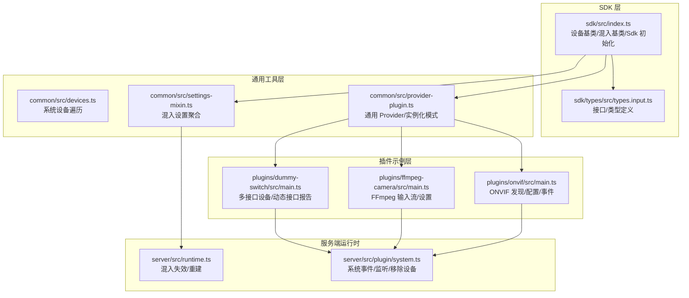

**图表来源**
- [sdk/src/index.ts:1-297](file://sdk/src/index.ts#L1-L297)
- [sdk/types/src/types.input.ts:1-1200](file://sdk/types/src/types.input.ts#L1-L1200)
- [common/src/devices.ts:1-6](file://common/src/devices.ts#L1-L6)
- [common/src/provider-plugin.ts:1-99](file://common/src/provider-plugin.ts#L1-L99)
- [common/src/settings-mixin.ts:1-88](file://common/src/settings-mixin.ts#L1-L88)
- [plugins/dummy-switch/src/main.ts:1-231](file://plugins/dummy-switch/src/main.ts#L1-L231)
- [plugins/ffmpeg-camera/src/main.ts:1-155](file://plugins/ffmpeg-camera/src/main.ts#L1-L155)
- [plugins/onvif/src/main.ts:1-622](file://plugins/onvif/src/main.ts#L1-L622)
- [server/src/runtime.ts:512-549](file://server/src/runtime.ts#L512-L549)
- [server/src/plugin/system.ts:207-235](file://server/src/plugin/system.ts#L207-L235)

**章节来源**
- [sdk/src/index.ts:1-297](file://sdk/src/index.ts#L1-L297)
- [sdk/types/src/types.input.ts:1-1200](file://sdk/types/src/types.input.ts#L1-L1200)
- [common/src/devices.ts:1-6](file://common/src/devices.ts#L1-L6)
- [common/src/provider-plugin.ts:1-99](file://common/src/provider-plugin.ts#L1-L99)
- [common/src/settings-mixin.ts:1-88](file://common/src/settings-mixin.ts#L1-L88)
- [plugins/dummy-switch/src/main.ts:1-231](file://plugins/dummy-switch/src/main.ts#L1-L231)
- [plugins/ffmpeg-camera/src/main.ts:1-155](file://plugins/ffmpeg-camera/src/main.ts#L1-L155)
- [plugins/onvif/src/main.ts:1-622](file://plugins/onvif/src/main.ts#L1-L622)
- [server/src/runtime.ts:512-549](file://server/src/runtime.ts#L512-L549)
- [server/src/plugin/system.ts:207-235](file://server/src/plugin/system.ts#L207-L235)

## 核心组件
- 设备基类与混入基类：提供存储、日志、媒体对象创建、设备状态懒加载与事件上报能力。
- Provider 与实例化模式：支持一次性 Provider 与可实例化 Provider 模式，动态注册设备。
- 设置聚合与混入设置：将设备自身设置与混入设置合并，统一对外暴露。
- 类型与接口：ScryptedInterface 定义了设备能力边界，如 OnOff、Lock、Camera、VideoCamera、Intercom 等。

**章节来源**
- [sdk/src/index.ts:10-167](file://sdk/src/index.ts#L10-L167)
- [sdk/types/src/types.input.ts:16-50](file://sdk/types/src/types.input.ts#L16-L50)
- [common/src/provider-plugin.ts:6-98](file://common/src/provider-plugin.ts#L6-L98)
- [common/src/settings-mixin.ts:11-87](file://common/src/settings-mixin.ts#L11-L87)

## 架构总览
Scrypted 插件通过 DeviceProvider 向系统注册设备，设备实现所需 ScryptedInterface 能力并通过 Settings 暴露配置项。系统通过 DeviceManager 统一管理设备状态与事件，Server 运行时负责混入表重建与事件分发。

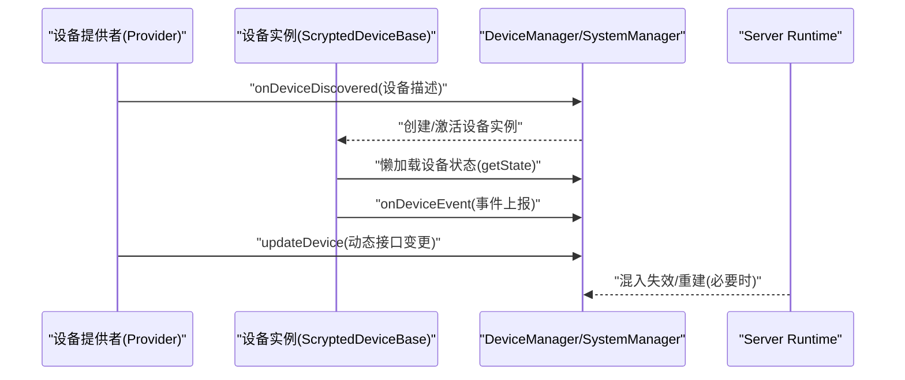

**图表来源**
- [sdk/src/index.ts:54-70](file://sdk/src/index.ts#L54-L70)
- [common/src/provider-plugin.ts:22-43](file://common/src/provider-plugin.ts#L22-L43)
- [server/src/runtime.ts:512-542](file://server/src/runtime.ts#L512-L542)

## 详细组件分析

### 设备基类与混入基类
- ScryptedDeviceBase：提供 storage、log、console、createMediaObject、onDeviceEvent、设备状态懒加载与属性代理（读写）。
- MixinDeviceBase：用于混入场景，持有 mixinDevice、mixinProviderNativeId、mixinDeviceInterfaces，支持混入设置与事件转发。

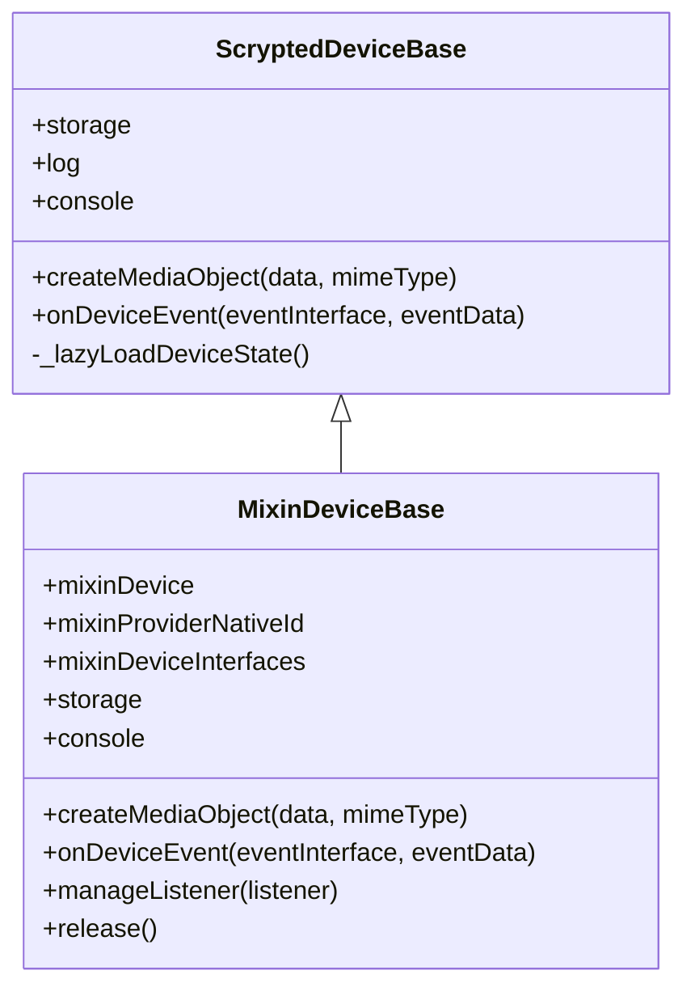

**图表来源**
- [sdk/src/index.ts:10-167](file://sdk/src/index.ts#L10-L167)

**章节来源**
- [sdk/src/index.ts:10-167](file://sdk/src/index.ts#L10-L167)

### Provider 与实例化模式
- AddProvider/InstancedProvider：通过 Settings 触发 onDeviceDiscovered 注册新设备；InstancedProvider 将自身作为 DeviceProvider 暴露，便于按需实例化。
- enableInstanceableProviderMode/createInstanceableProviderPlugin：迁移现有 Provider 到可实例化模式，批量注册子设备。

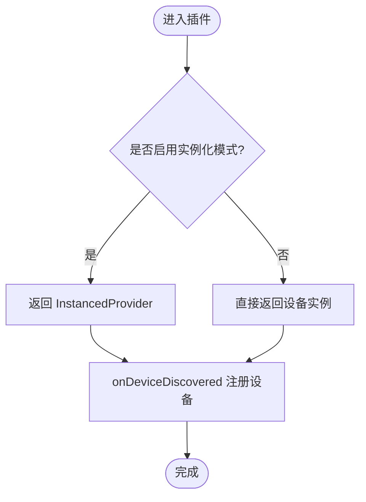

**图表来源**
- [common/src/provider-plugin.ts:52-98](file://common/src/provider-plugin.ts#L52-L98)

**章节来源**
- [common/src/provider-plugin.ts:6-98](file://common/src/provider-plugin.ts#L6-L98)

### 设置聚合与混入设置
- SettingsMixinDeviceBase：将混入设备设置与自身设置合并，自动为混入设置添加组前缀，统一由 Settings 接口暴露。

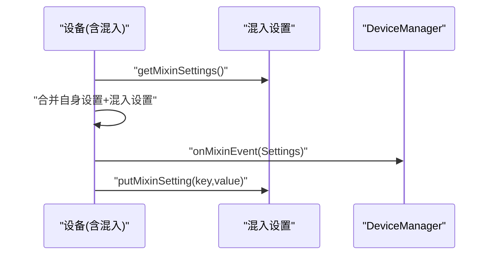

**图表来源**
- [common/src/settings-mixin.ts:26-87](file://common/src/settings-mixin.ts#L26-L87)

**章节来源**
- [common/src/settings-mixin.ts:11-87](file://common/src/settings-mixin.ts#L11-L87)

### 设备发现机制
- ONVIF 插件：基于 onvif.Discovery 探测网络设备，解析 XAddrs/Scopes，构造 DiscoveredDevice 并通过 discoverDevices 暴露给用户。
- 远程插件：从远端系统拉取设备列表，过滤后逐个 onDeviceDiscovered，再批量 onDevicesChanged。

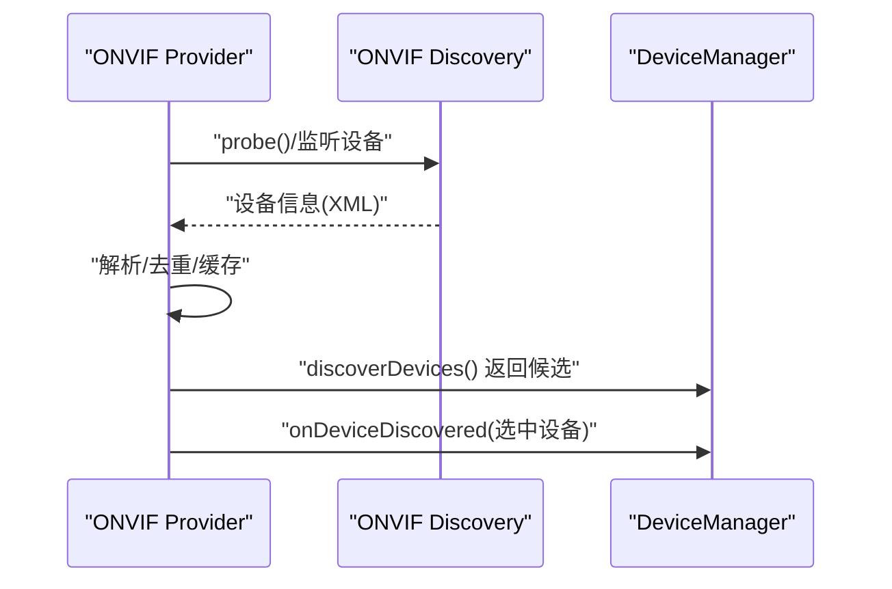

**图表来源**
- [plugins/onvif/src/main.ts:358-437](file://plugins/onvif/src/main.ts#L358-L437)
- [plugins/remote/src/main.ts:256-318](file://plugins/remote/src/main.ts#L256-L318)

**章节来源**
- [plugins/onvif/src/main.ts:334-622](file://plugins/onvif/src/main.ts#L334-L622)
- [plugins/remote/src/main.ts:256-318](file://plugins/remote/src/main.ts#L256-L318)

### 设备状态管理与事件
- ScryptedDeviceBase 在访问状态属性时懒加载设备状态，未发现设备时会给出提示。
- onDeviceEvent/onMixinEvent 用于向系统上报事件，驱动 UI 与自动化更新。

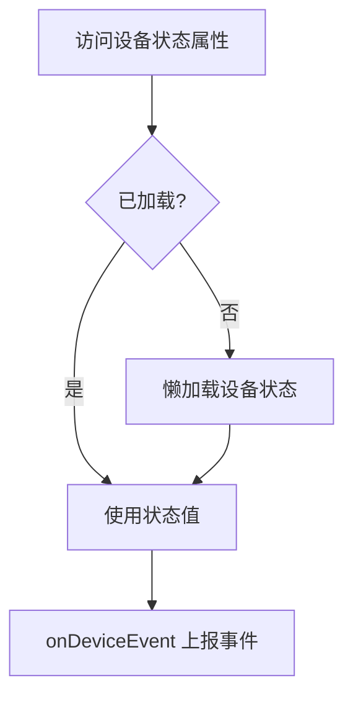

**图表来源**
- [sdk/src/index.ts:54-70](file://sdk/src/index.ts#L54-L70)
- [sdk/src/index.ts:170-204](file://sdk/src/index.ts#L170-L204)

**章节来源**
- [sdk/src/index.ts:54-70](file://sdk/src/index.ts#L54-L70)
- [sdk/src/index.ts:170-204](file://sdk/src/index.ts#L170-L204)

### 生命周期管理（注册到销毁）
- 注册：Provider 调用 onDeviceDiscovered/onDevicesChanged 注册设备与子设备。
- 动态变更：updateDevice/updateDevice 接口动态增删设备接口或类型。
- 销毁：系统移除设备时触发清理逻辑（例如停止定时器、关闭连接），混入释放时调用 release。

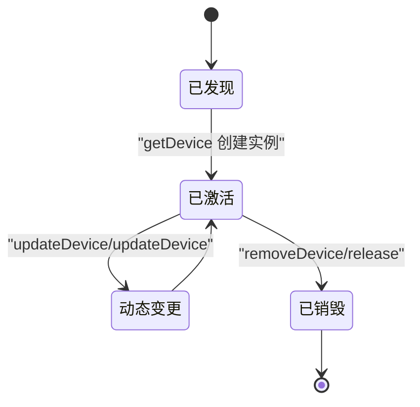

**图表来源**
- [common/src/provider-plugin.ts:22-43](file://common/src/provider-plugin.ts#L22-L43)
- [common/src/settings-mixin.ts:84-87](file://common/src/settings-mixin.ts#L84-L87)
- [server/src/plugin/system.ts:229-231](file://server/src/plugin/system.ts#L229-L231)

**章节来源**
- [common/src/provider-plugin.ts:22-43](file://common/src/provider-plugin.ts#L22-L43)
- [common/src/settings-mixin.ts:84-87](file://common/src/settings-mixin.ts#L84-L87)
- [server/src/plugin/system.ts:229-231](file://server/src/plugin/system.ts#L229-L231)

### 设备接口实现与暴露（ScryptedInterface）
- 基础能力：OnOff、StartStop、Lock、Thermometer、HumiditySensor、Notifier 等。
- 媒体能力：Camera、VideoCamera、Microphone、Intercom、Display、VideoRecorder 等。
- 配置能力：VideoCameraConfiguration、VideoTextOverlays、PanTiltZoom 等。

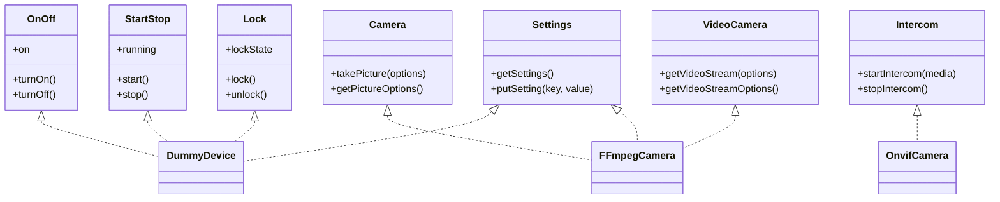

**图表来源**
- [sdk/types/src/types.input.ts:164-726](file://sdk/types/src/types.input.ts#L164-L726)
- [plugins/dummy-switch/src/main.ts:9-136](file://plugins/dummy-switch/src/main.ts#L9-L136)
- [plugins/ffmpeg-camera/src/main.ts:17-142](file://plugins/ffmpeg-camera/src/main.ts#L17-L142)
- [plugins/onvif/src/main.ts:16-332](file://plugins/onvif/src/main.ts#L16-L332)

**章节来源**
- [sdk/types/src/types.input.ts:164-726](file://sdk/types/src/types.input.ts#L164-L726)
- [plugins/dummy-switch/src/main.ts:9-136](file://plugins/dummy-switch/src/main.ts#L9-L136)
- [plugins/ffmpeg-camera/src/main.ts:17-142](file://plugins/ffmpeg-camera/src/main.ts#L17-L142)
- [plugins/onvif/src/main.ts:16-332](file://plugins/onvif/src/main.ts#L16-L332)

### 设备配置与设置管理（Settings）
- StorageSettings：以声明式方式定义配置项（标题、描述、默认值、类型、选项等），自动持久化与 UI 渲染。
- SettingsMixinDeviceBase：将混入设置与设备设置合并，统一暴露。

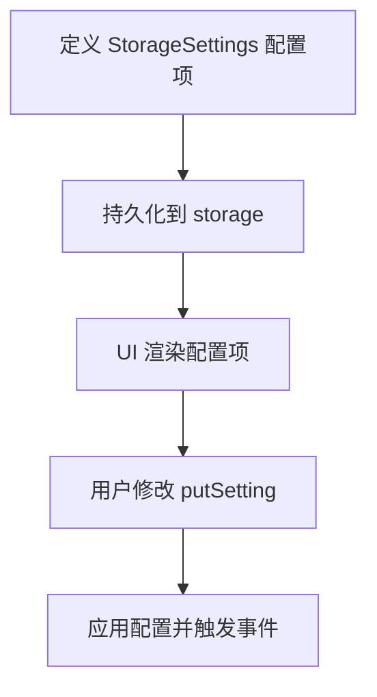

**图表来源**
- [plugins/dummy-switch/src/main.ts:11-58](file://plugins/dummy-switch/src/main.ts#L11-L58)
- [plugins/ffmpeg-camera/src/main.ts:18-38](file://plugins/ffmpeg-camera/src/main.ts#L18-L38)
- [common/src/settings-mixin.ts:26-87](file://common/src/settings-mixin.ts#L26-L87)

**章节来源**
- [plugins/dummy-switch/src/main.ts:11-58](file://plugins/dummy-switch/src/main.ts#L11-L58)
- [plugins/ffmpeg-camera/src/main.ts:18-38](file://plugins/ffmpeg-camera/src/main.ts#L18-L38)
- [common/src/settings-mixin.ts:26-87](file://common/src/settings-mixin.ts#L26-L87)

### 具体插件开发示例

#### 示例一：摄像头（FFmpeg 摄像头）
- 功能要点：通过 StorageSettings 配置 FFmpeg 输入参数，动态生成多个视频流选项；根据设置决定是否暴露 Intercom。
- 关键点：parseDoubleQuotedArguments 解析输入参数；createFFmpegMediaObject 创建媒体对象；getUrlSettings/getOtherSettings 暴露配置。

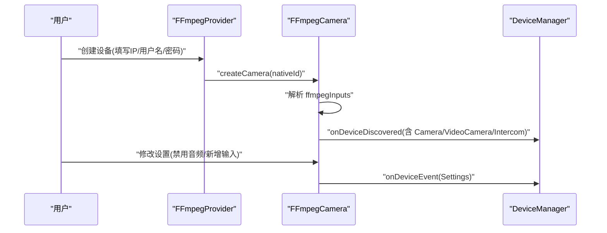

**图表来源**
- [plugins/ffmpeg-camera/src/main.ts:17-142](file://plugins/ffmpeg-camera/src/main.ts#L17-L142)
- [plugins/ffmpeg-camera/src/main.ts:144-155](file://plugins/ffmpeg-camera/src/main.ts#L144-L155)

**章节来源**
- [plugins/ffmpeg-camera/src/main.ts:17-142](file://plugins/ffmpeg-camera/src/main.ts#L17-L142)
- [plugins/ffmpeg-camera/src/main.ts:144-155](file://plugins/ffmpeg-camera/src/main.ts#L144-L155)

#### 示例二：传感器与开关（Dummy Switch）
- 功能要点：动态组合 OnOff、StartStop、Lock、MotionSensor、BinarySensor、OccupancySensor 等接口；通过 StorageSettings 控制行为与复位时间。
- 关键点：reportInterfaces 动态上报接口；turnOn/turnOff 更新多类状态；getCreateDeviceSettings 支持创建时命名。

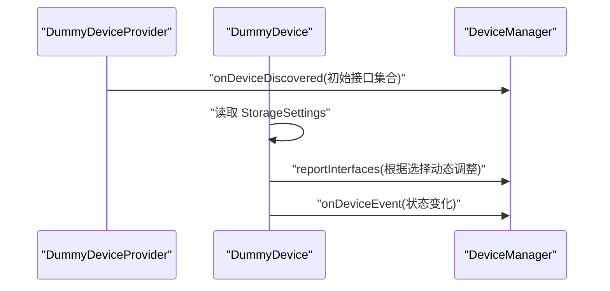

**图表来源**
- [plugins/dummy-switch/src/main.ts:138-228](file://plugins/dummy-switch/src/main.ts#L138-L228)
- [plugins/dummy-switch/src/main.ts:71-85](file://plugins/dummy-switch/src/main.ts#L71-L85)

**章节来源**
- [plugins/dummy-switch/src/main.ts:138-228](file://plugins/dummy-switch/src/main.ts#L138-L228)
- [plugins/dummy-switch/src/main.ts:71-85](file://plugins/dummy-switch/src/main.ts#L71-L85)

#### 示例三：ONVIF 摄像头
- 功能要点：自动发现设备、获取设备信息、配置码流、事件订阅、OSD 文字叠加、双向对讲。
- 关键点：getConstructedVideoStreamOptions 获取 RTSP 流；updateDevice 动态增删接口；putSetting 自动配置与两步音频开关。

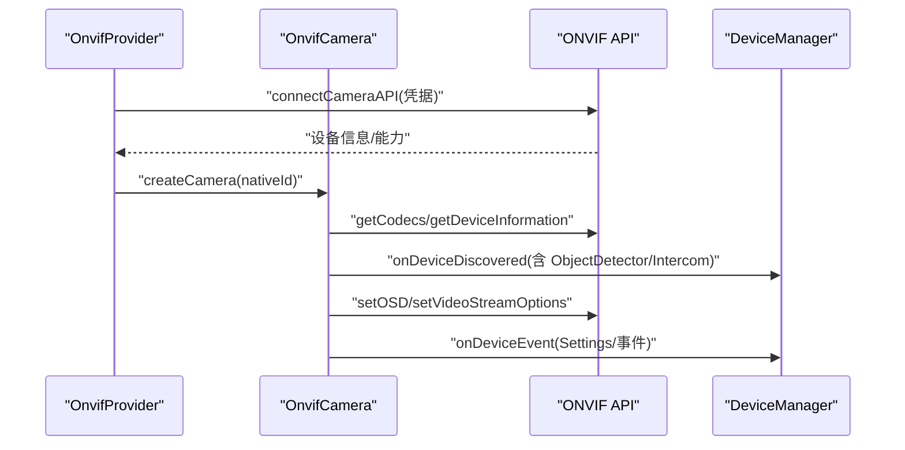

**图表来源**
- [plugins/onvif/src/main.ts:16-332](file://plugins/onvif/src/main.ts#L16-L332)
- [plugins/onvif/src/main.ts:334-622](file://plugins/onvif/src/main.ts#L334-L622)

**章节来源**
- [plugins/onvif/src/main.ts:16-332](file://plugins/onvif/src/main.ts#L16-L332)
- [plugins/onvif/src/main.ts:334-622](file://plugins/onvif/src/main.ts#L334-L622)

## 依赖关系分析
- SDK 层依赖 types.input.ts 中的接口与类型定义，为所有插件提供统一能力入口。
- Provider 与设备实现依赖 common 工具（devices.ts、provider-plugin.ts、settings-mixin.ts）。
- 插件通过 server 运行时进行混入表维护与事件传播。

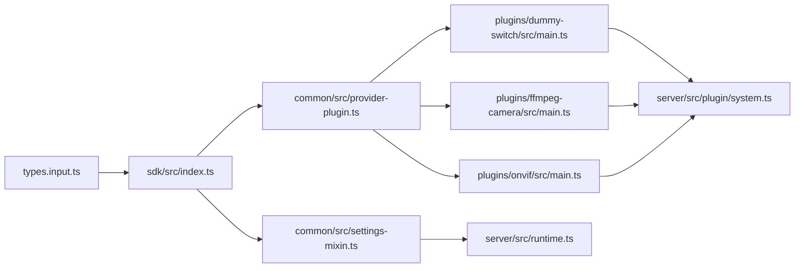

**图表来源**
- [sdk/types/src/types.input.ts:1-1200](file://sdk/types/src/types.input.ts#L1-L1200)
- [sdk/src/index.ts:1-297](file://sdk/src/index.ts#L1-L297)
- [common/src/provider-plugin.ts:1-99](file://common/src/provider-plugin.ts#L1-L99)
- [common/src/settings-mixin.ts:1-88](file://common/src/settings-mixin.ts#L1-L88)
- [plugins/dummy-switch/src/main.ts:1-231](file://plugins/dummy-switch/src/main.ts#L1-L231)
- [plugins/ffmpeg-camera/src/main.ts:1-155](file://plugins/ffmpeg-camera/src/main.ts#L1-L155)
- [plugins/onvif/src/main.ts:1-622](file://plugins/onvif/src/main.ts#L1-L622)
- [server/src/plugin/system.ts:207-235](file://server/src/plugin/system.ts#L207-L235)
- [server/src/runtime.ts:512-549](file://server/src/runtime.ts#L512-L549)

**章节来源**
- [sdk/types/src/types.input.ts:1-1200](file://sdk/types/src/types.input.ts#L1-L1200)
- [sdk/src/index.ts:1-297](file://sdk/src/index.ts#L1-L297)
- [common/src/provider-plugin.ts:1-99](file://common/src/provider-plugin.ts#L1-L99)
- [common/src/settings-mixin.ts:1-88](file://common/src/settings-mixin.ts#L1-L88)
- [plugins/dummy-switch/src/main.ts:1-231](file://plugins/dummy-switch/src/main.ts#L1-L231)
- [plugins/ffmpeg-camera/src/main.ts:1-155](file://plugins/ffmpeg-camera/src/main.ts#L1-L155)
- [plugins/onvif/src/main.ts:1-622](file://plugins/onvif/src/main.ts#L1-L622)
- [server/src/plugin/system.ts:207-235](file://server/src/plugin/system.ts#L207-L235)
- [server/src/runtime.ts:512-549](file://server/src/runtime.ts#L512-L549)

## 性能考虑
- 懒加载设备状态：避免在构造阶段进行昂贵操作，仅在首次访问时加载。
- 批量设备变更：优先使用 onDevicesChanged 聚合更新，减少多次注册带来的开销。
- 混入失效与重建：当混入设置变化时，运行时会失效相关混入并重建，应尽量避免频繁变更设置。
- 媒体对象转换：优先使用 createFFmpegMediaObject 等工厂方法，避免重复编解码。
- 事件去噪：合理使用 EventListenerOptions 的 denoise/watch 参数，降低无效回调。

[本节为通用指导，无需特定文件引用]

## 故障排查指南
- 设备状态不可用：若设备尚未被 onDeviceDiscovered 或 onDevicesChanged 注册，访问状态属性会提示不可用。请检查 Provider 的注册流程。
- 设置无法保存：确认 Settings 实现正确，且 StorageSettings 的 key 与类型匹配；混入设置需带前缀。
- ONVIF 设备无码流：检查 getCodecs 是否返回有效配置；必要时执行自动配置；确认网络连通性与凭据。
- 混入设置冲突：使用 SettingsMixinDeviceBase 合并设置，确保 key 不冲突；变更后触发 onMixinEvent 刷新 UI。
- 设备移除失败：确认系统已调用 removeDevice；混入设备需在 release 中清理资源。

**章节来源**
- [sdk/src/index.ts:170-204](file://sdk/src/index.ts#L170-L204)
- [common/src/settings-mixin.ts:26-87](file://common/src/settings-mixin.ts#L26-L87)
- [plugins/onvif/src/main.ts:161-183](file://plugins/onvif/src/main.ts#L161-L183)
- [server/src/plugin/system.ts:229-231](file://server/src/plugin/system.ts#L229-L231)

## 结论
通过统一的 SDK、Provider 模式与 Settings/混入机制，Scrypted 为设备插件提供了清晰的扩展点与强大的生态能力。开发者可快速实现摄像头、传感器、开关等设备，并通过动态接口与配置管理满足复杂业务需求。遵循懒加载、批量变更与事件去噪等最佳实践，可显著提升插件性能与稳定性。

[本节为总结，无需特定文件引用]

## 附录

### 常用接口与类型速查
- 设备基础：ScryptedDevice、DeviceManager、SystemManager
- 能力接口：OnOff、StartStop、Lock、Camera、VideoCamera、Intercom、Thermometer、HumiditySensor、Notifier、Settings、VideoCameraConfiguration、VideoTextOverlays、PanTiltZoom
- 设置工具：StorageSettings、SettingsMixinDeviceBase

**章节来源**
- [sdk/types/src/types.input.ts:16-50](file://sdk/types/src/types.input.ts#L16-L50)
- [sdk/types/src/types.input.ts:164-1131](file://sdk/types/src/types.input.ts#L164-L1131)