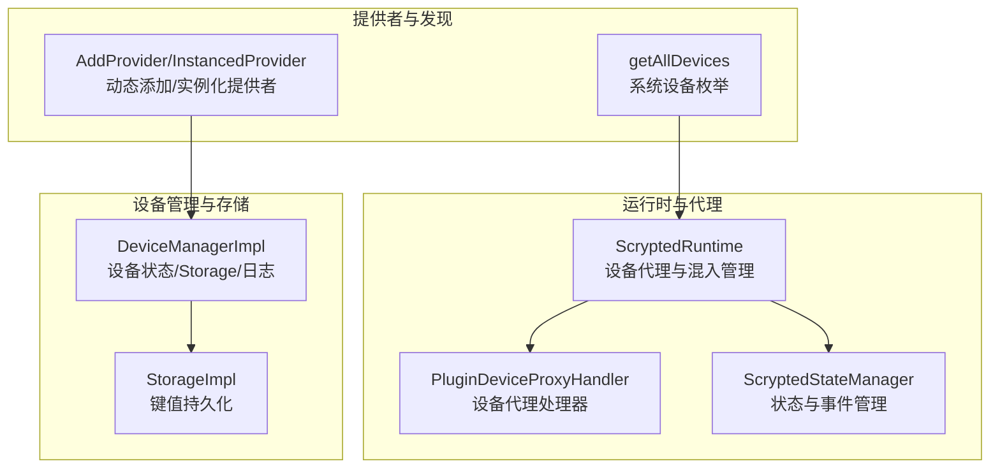
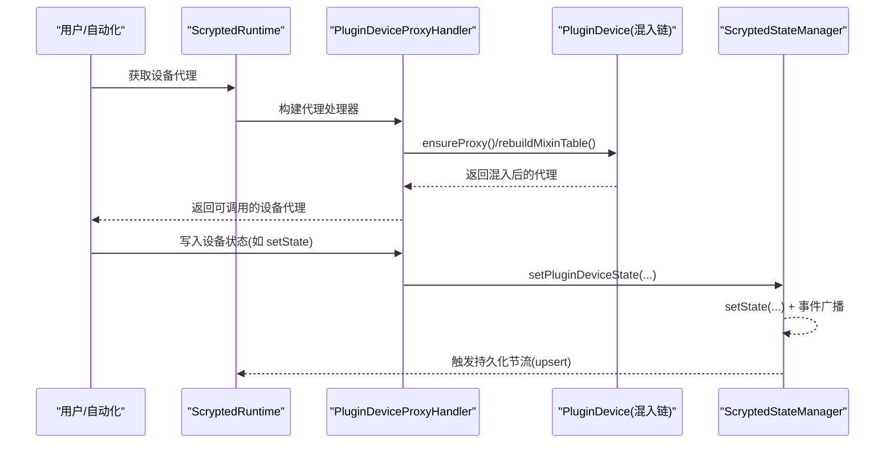
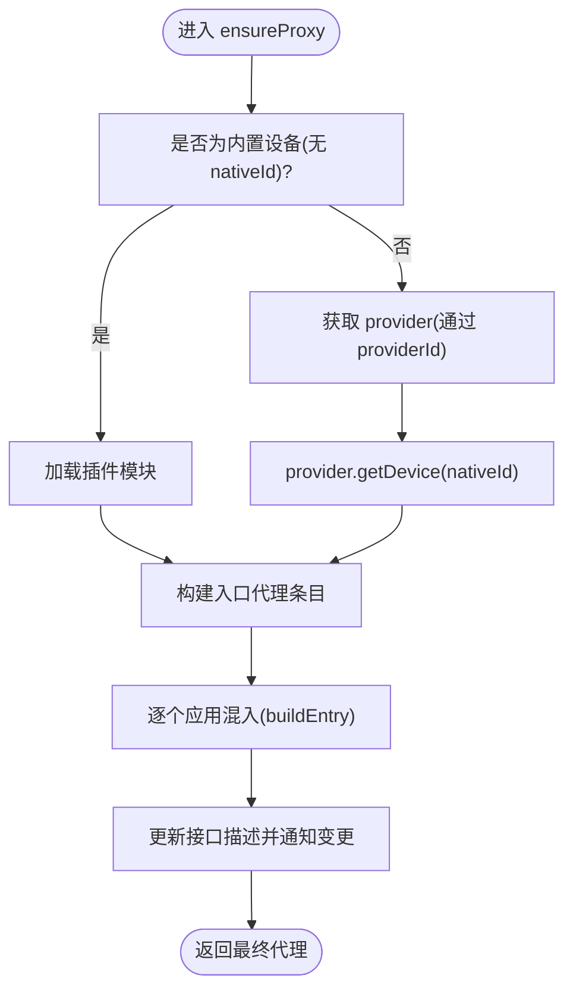
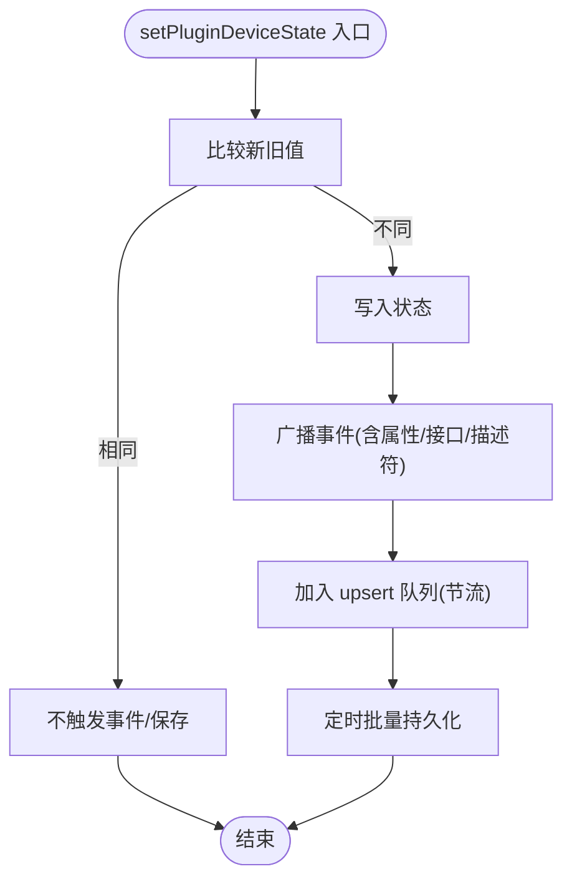
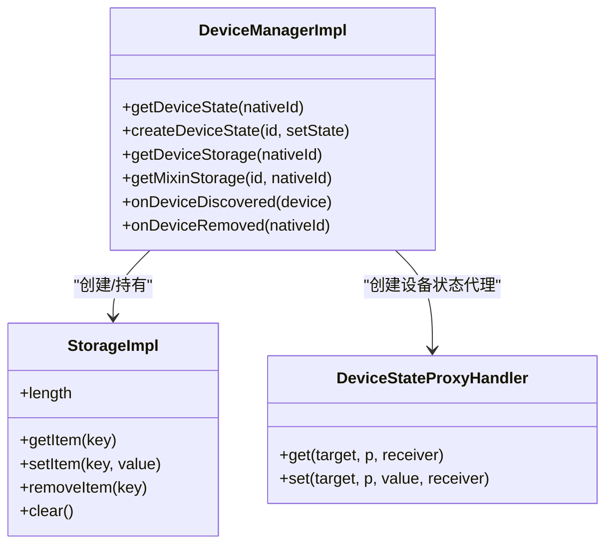
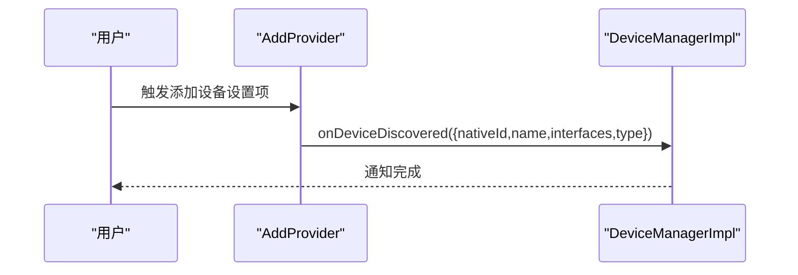
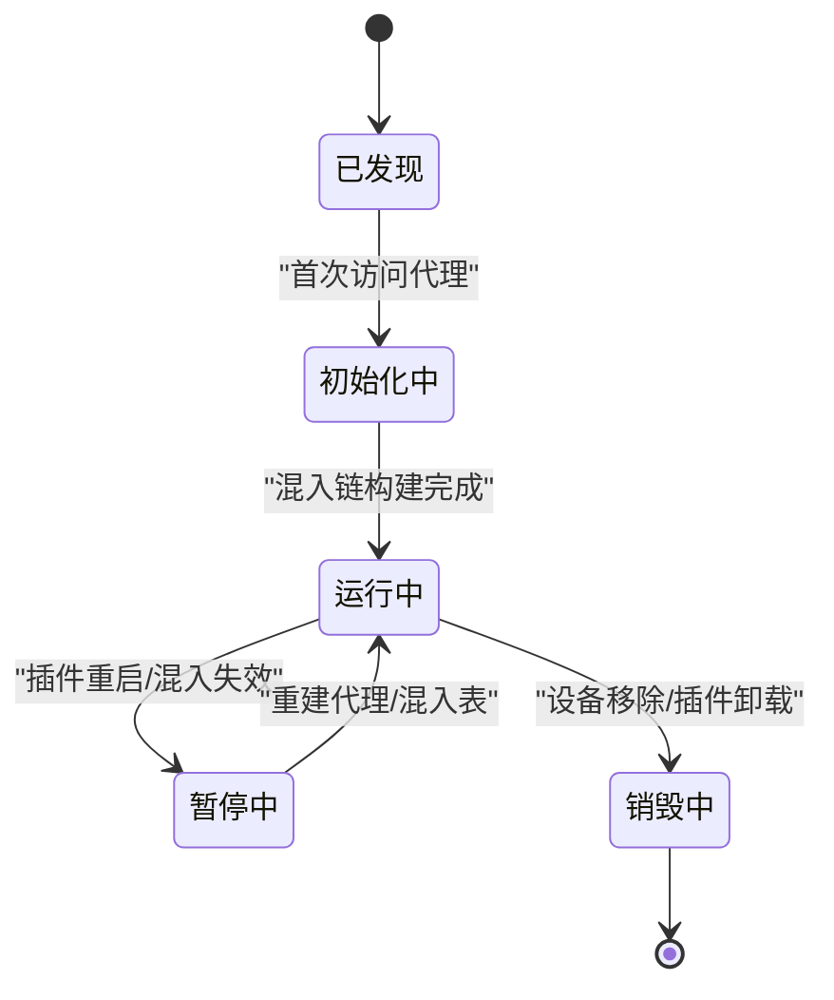
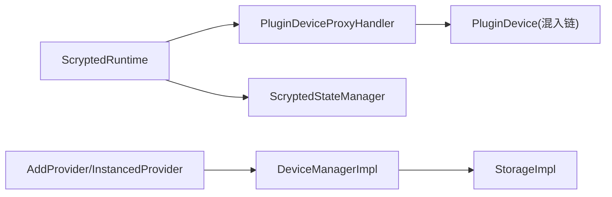

# 设备生命周期管理

<cite>
**本文引用的文件**
- [server/src/plugin/device.ts](file://server/src/plugin/device.ts)
- [server/src/plugin/plugin-device.ts](file://server/src/plugin/plugin-device.ts)
- [server/src/state.ts](file://server/src/state.ts)
- [server/src/runtime.ts](file://server/src/runtime.ts)
- [common/src/provider-plugin.ts](file://common/src/provider-plugin.ts)
- [common/src/devices.ts](file://common/src/devices.ts)
</cite>

## 目录
1. [简介](#简介)
2. [项目结构](#项目结构)
3. [核心组件](#核心组件)
4. [架构总览](#架构总览)
5. [详细组件分析](#详细组件分析)
6. [依赖关系分析](#依赖关系分析)
7. [性能考量](#性能考量)
8. [故障排查指南](#故障排查指南)
9. [结论](#结论)
10. [附录](#附录)

## 简介
本文件系统性阐述 Scrypted 的设备生命周期管理，覆盖从“发现与注册”到“初始化、运行、暂停、恢复、销毁”的全链路流程；解释状态管理（持久化、同步、变更通知）、设备实例创建与销毁（nativeId 生成与管理、缓存与复用、内存泄漏防护）；并给出设计模式、性能优化与故障恢复策略。内容以代码为依据，配合图示帮助读者快速建立对系统行为的理解。

## 项目结构
围绕设备生命周期的关键模块分布如下：
- 运行时与代理层：负责设备代理构建、混入（mixin）组合、事件与刷新控制
- 状态管理层：统一维护设备状态、事件广播、持久化触发
- 设备管理器与存储：提供设备状态访问、Storage 访问、日志记录
- 提供者插件工具：支持动态添加设备、实例化提供者模式迁移

**图表来源**
- [server/src/runtime.ts:64-800](file://server/src/runtime.ts#L64-L800)
- [server/src/plugin/plugin-device.ts:31-486](file://server/src/plugin/plugin-device.ts#L31-L486)
- [server/src/state.ts:10-287](file://server/src/state.ts#L10-L287)
- [server/src/plugin/device.ts:86-262](file://server/src/plugin/device.ts#L86-L262)
- [common/src/provider-plugin.ts:6-99](file://common/src/provider-plugin.ts#L6-L99)
- [common/src/devices.ts:3-6](file://common/src/devices.ts#L3-L6)

**章节来源**
- [server/src/runtime.ts:64-800](file://server/src/runtime.ts#L64-L800)
- [server/src/plugin/plugin-device.ts:31-486](file://server/src/plugin/plugin-device.ts#L31-L486)
- [server/src/state.ts:10-287](file://server/src/state.ts#L10-L287)
- [server/src/plugin/device.ts:86-262](file://server/src/plugin/device.ts#L86-L262)
- [common/src/provider-plugin.ts:6-99](file://common/src/provider-plugin.ts#L6-L99)
- [common/src/devices.ts:3-6](file://common/src/devices.ts#L3-L6)

## 核心组件
- 设备代理与混入管理
  - 通过代理处理器在调用方法时按需构建混入链，并在混入变更时重建混入表，确保接口描述与可用能力实时更新。
- 状态管理与事件通知
  - 统一的状态写入会触发事件广播与持久化节流保存，支持属性级事件与描述符级变更通知。
- 设备管理器与存储
  - 提供设备状态访问、Storage 访问、日志记录；Storage 实现基于 Proxy，支持前缀隔离与自动持久化。
- 动态添加与实例化提供者
  - 支持通过设置项触发新设备发现，或启用实例化提供者模式，将现有设备迁移到独立控制器下。

**章节来源**
- [server/src/plugin/plugin-device.ts:31-486](file://server/src/plugin/plugin-device.ts#L31-L486)
- [server/src/state.ts:10-287](file://server/src/state.ts#L10-L287)
- [server/src/plugin/device.ts:86-262](file://server/src/plugin/device.ts#L86-L262)
- [common/src/provider-plugin.ts:6-99](file://common/src/provider-plugin.ts#L6-L99)

## 架构总览
设备生命周期由“运行时”驱动，围绕“设备代理”与“状态管理”两条主线展开。设备代理负责将上层调用路由到具体实现（含混入），状态管理负责状态写入、事件广播与持久化。

**图表来源**
- [server/src/runtime.ts:784-800](file://server/src/runtime.ts#L784-L800)
- [server/src/plugin/plugin-device.ts:136-218](file://server/src/plugin/plugin-device.ts#L136-L218)
- [server/src/state.ts:102-119](file://server/src/state.ts#L102-L119)

## 详细组件分析

### 设备代理与混入管理（PluginDeviceProxyHandler）
- 职责
  - 在首次访问或混入变更时，按需从提供者获取设备对象，并逐个应用混入，形成最终代理。
  - 维护混入表，支持部分失效与增量重建，避免全量重建带来的开销。
  - 暴露查询接口能力、刷新能力、事件监听等。
- 关键流程
  - ensureProxy：根据设备类型选择直接加载或通过 DeviceProvider 获取。
  - rebuildMixinTable：对比旧混入表，定位最后一个有效混入，仅对后续混入进行增量重建。
  - invalidateEntry：释放混入提供者的 mixin，防止资源泄漏。
  - applyMixin/findMethod/findMixin：在混入链中查找方法或接口实现。

**图表来源**
- [server/src/plugin/plugin-device.ts:136-218](file://server/src/plugin/plugin-device.ts#L136-L218)

**章节来源**
- [server/src/plugin/plugin-device.ts:31-486](file://server/src/plugin/plugin-device.ts#L31-L486)

### 状态管理与事件通知（ScryptedStateManager）
- 职责
  - 统一写入设备状态，比较新旧值后决定是否发出事件。
  - 将状态变更与属性事件广播给订阅者；对描述符变更单独通知。
  - 对设备状态持久化采用节流策略，降低频繁写入开销。
- 关键点
  - setPluginDeviceState：写入状态并触发事件；若非设备接口事件则记录日志。
  - notifyInterfaceEventFromMixin：混入事件的来源识别与事件名拼接。
  - listenDevice：对实现 Refresh 接口的设备，按频率轮询刷新。
  - refreshThrottles：对同设备同接口的多次刷新请求进行节流合并。

**图表来源**
- [server/src/state.ts:102-119](file://server/src/state.ts#L102-L119)
- [server/src/state.ts:13-30](file://server/src/state.ts#L13-L30)

**章节来源**
- [server/src/state.ts:10-287](file://server/src/state.ts#L10-L287)

### 设备管理器与存储（DeviceManagerImpl/StorageImpl）
- 职责
  - 提供设备状态访问（只读/可写）、Storage 访问、日志记录。
  - StorageImpl 基于 Proxy，支持前缀隔离（如 mixin:xxx:），自动持久化与长度统计。
- 关键点
  - DeviceStateProxyHandler：拦截状态读写，写入时调用 setState 并触发状态变更。
  - StorageImpl：setItem/removeItem 等操作会同步写回底层存储并触发持久化。

**图表来源**
- [server/src/plugin/device.ts:86-262](file://server/src/plugin/device.ts#L86-L262)

**章节来源**
- [server/src/plugin/device.ts:86-262](file://server/src/plugin/device.ts#L86-L262)

### 动态添加与实例化提供者（AddProvider/InstancedProvider）
- 职责
  - 通过设置项触发新设备发现，生成随机 nativeId 并上报系统。
  - 支持实例化提供者模式迁移：将现有设备迁移到新的控制器下，保留配置并重启插件。
- 关键点
  - enableInstanceableProviderMode：遍历现有设备，逐一上报到新的提供者；迁移本地存储键值；标记实例化模式并退出进程。
  - createInstanceableProviderPlugin：在实例化模式下返回 InstancedProvider，否则返回单实例插件。

**图表来源**
- [common/src/provider-plugin.ts:11-33](file://common/src/provider-plugin.ts#L11-L33)

**章节来源**
- [common/src/provider-plugin.ts:6-99](file://common/src/provider-plugin.ts#L6-L99)

### 设备实例创建与销毁（nativeId 管理、缓存与复用、内存泄漏防护）
- nativeId 生成与管理
  - 添加设备时使用随机字符串作为 nativeId，保证唯一性。
  - 实例化提供者模式下，将原设备的 nativeId 与新提供者关联，便于后续迁移与管理。
- 缓存与复用
  - 运行时对设备代理进行缓存（devices 映射），避免重复构建。
  - 混入表缓存与增量重建，减少不必要的重载。
- 内存泄漏防护
  - 释放混入时调用 provider.releaseMixin，等待短暂时间后移除引用，确保最终事件处理完毕。
  - 混入失效时主动清理已释放的混入条目，避免残留引用。
  - 混入存储的清理：当设备不存在时，自动删除其对应的 mixin 键空间。

**章节来源**
- [server/src/plugin/plugin-device.ts:50-85](file://server/src/plugin/plugin-device.ts#L50-L85)
- [server/src/plugin/device.ts:137-151](file://server/src/plugin/device.ts#L137-L151)

### 生命周期阶段与控制流
- 注册与发现
  - 通过 onDeviceDiscovered 上报设备信息（含 nativeId、名称、类型、接口集合）。
- 初始化
  - 首次访问设备代理时，ensureProxy 构建混入链；随后通过代理进行方法调用。
- 运行
  - 状态写入经由状态管理器广播事件；Storage 写入触发持久化。
- 暂停与恢复
  - 插件重启或混入变更时，invalidatePluginDevice/invalidatePluginMixins 使代理失效并重建；混入表增量重建保障最小化影响。
- 销毁
  - 设备移除时，onDeviceRemoved 通知运行时；StorageImpl 清理对应键空间；混入释放与失效清理防止泄漏。

**图表来源**
- [server/src/runtime.ts:476-542](file://server/src/runtime.ts#L476-L542)
- [server/src/plugin/plugin-device.ts:78-133](file://server/src/plugin/plugin-device.ts#L78-L133)

## 依赖关系分析
- 运行时依赖
  - 通过 PluginDeviceProxyHandler 构建设备代理，依赖 PluginHost 与 DeviceProvider。
  - 通过 ScryptedStateManager 统一管理状态与事件，依赖 EventRegistry。
- 存储依赖
  - DeviceManagerImpl 依赖 StorageImpl，后者依赖底层存储接口与持久化策略。
- 提供者依赖
  - AddProvider/InstancedProvider 依赖 DeviceManagerImpl 的设备发现与迁移能力。

**图表来源**
- [server/src/runtime.ts:64-800](file://server/src/runtime.ts#L64-L800)
- [server/src/plugin/plugin-device.ts:31-486](file://server/src/plugin/plugin-device.ts#L31-L486)
- [server/src/state.ts:10-287](file://server/src/state.ts#L10-L287)
- [server/src/plugin/device.ts:86-262](file://server/src/plugin/device.ts#L86-L262)
- [common/src/provider-plugin.ts:6-99](file://common/src/provider-plugin.ts#L6-L99)

**章节来源**
- [server/src/runtime.ts:64-800](file://server/src/runtime.ts#L64-L800)
- [server/src/plugin/plugin-device.ts:31-486](file://server/src/plugin/plugin-device.ts#L31-L486)
- [server/src/state.ts:10-287](file://server/src/state.ts#L10-L287)
- [server/src/plugin/device.ts:86-262](file://server/src/plugin/device.ts#L86-L262)
- [common/src/provider-plugin.ts:6-99](file://common/src/provider-plugin.ts#L6-L99)

## 性能考量
- 混入增量重建
  - 通过 lastValidMixinId 定位混入链断点，仅重建后续混入，避免全量重建。
- 刷新节流
  - 合并短时间内多次刷新请求，按设备刷新频率睡眠后再执行，降低网络与设备压力。
- 状态持久化节流
  - 使用 throttle 批量 upsert，减少频繁写盘。
- 代理缓存
  - 设备代理与混入表缓存，避免重复构建。

**章节来源**
- [server/src/plugin/plugin-device.ts:90-133](file://server/src/plugin/plugin-device.ts#L90-L133)
- [server/src/state.ts:13-30](file://server/src/state.ts#L13-L30)
- [server/src/state.ts:193-250](file://server/src/state.ts#L193-L250)

## 故障排查指南
- 设备不可用
  - 检查代理处理器的 ensureProxy 是否抛错；确认 provider 是否存在且返回设备对象。
- 混入错误
  - 混入失败时会记录错误并跳过该混入接口；检查 canMixin 返回值与 getMixin 实现。
- 状态不更新
  - 确认 setPluginDeviceState 是否被调用；检查事件广播与持久化节流是否生效。
- 插件崩溃
  - 运行时会自动重启插件并重建设备代理；观察日志中的重启提示。
- 存储异常
  - 检查 StorageImpl 的 setItem/removeItem 是否正确写入；确认前缀隔离与清理逻辑。

**章节来源**
- [server/src/plugin/plugin-device.ts:296-311](file://server/src/plugin/plugin-device.ts#L296-L311)
- [server/src/state.ts:78-100](file://server/src/state.ts#L78-L100)
- [server/src/runtime.ts:644-689](file://server/src/runtime.ts#L644-L689)
- [server/src/plugin/device.ts:249-260](file://server/src/plugin/device.ts#L249-L260)

## 结论
Scrypted 的设备生命周期管理以“代理+混入+状态管理”为核心，通过增量重建、刷新节流与持久化节流等策略，在功能灵活性与性能之间取得平衡。动态添加与实例化提供者模式进一步增强了设备管理的可扩展性。遵循本文的设计模式与最佳实践，可在复杂场景下稳定地管理设备的全生命周期。

## 附录
- 常用路径参考
  - 设备代理构建与混入：[server/src/plugin/plugin-device.ts:136-218](file://server/src/plugin/plugin-device.ts#L136-L218)
  - 状态写入与事件广播：[server/src/state.ts:102-119](file://server/src/state.ts#L102-L119)
  - 设备状态访问与 Storage：[server/src/plugin/device.ts:105-136](file://server/src/plugin/device.ts#L105-L136)
  - 动态添加与实例化提供者：[common/src/provider-plugin.ts:11-99](file://common/src/provider-plugin.ts#L11-L99)
  - 系统设备枚举：[common/src/devices.ts:3-6](file://common/src/devices.ts#L3-L6)