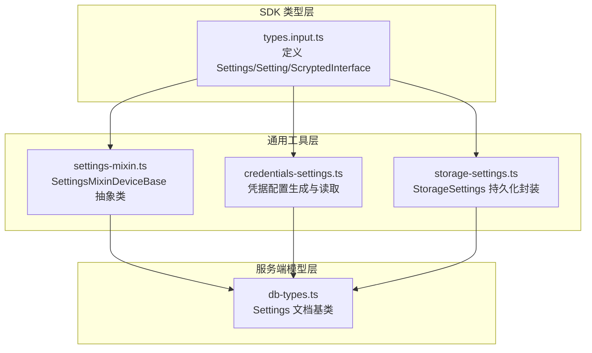
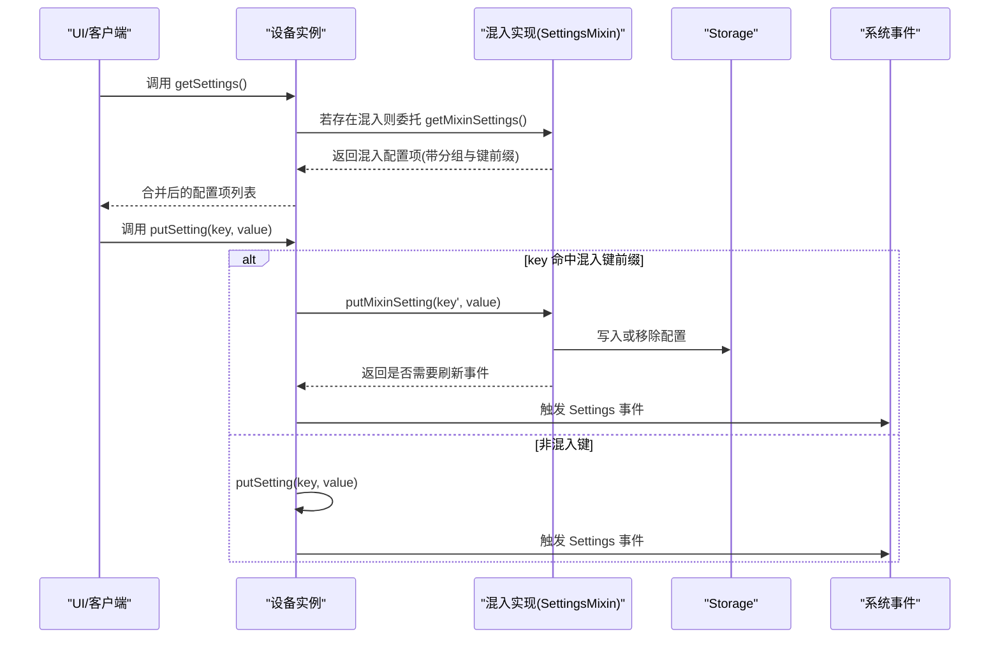
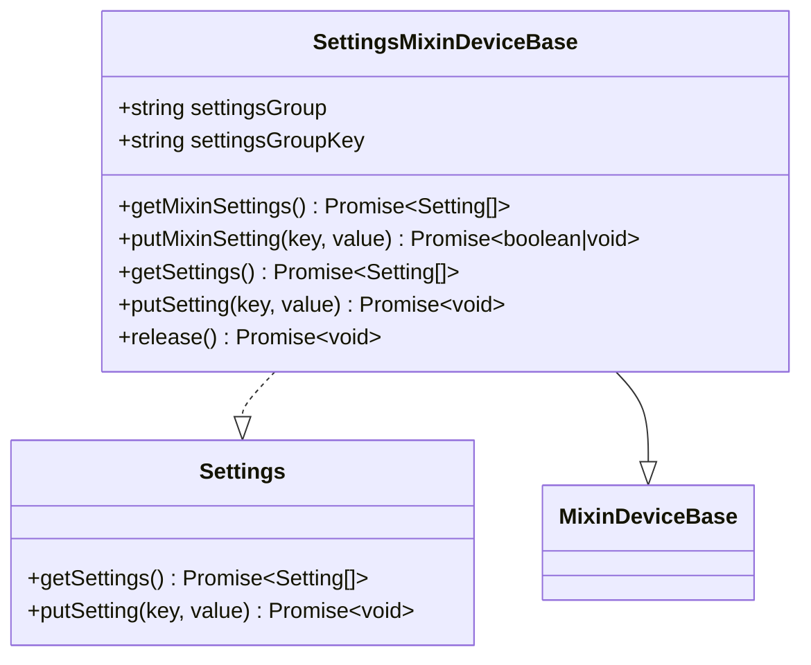
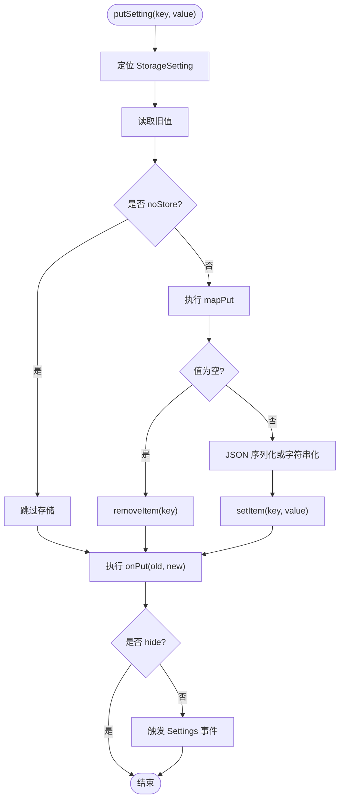
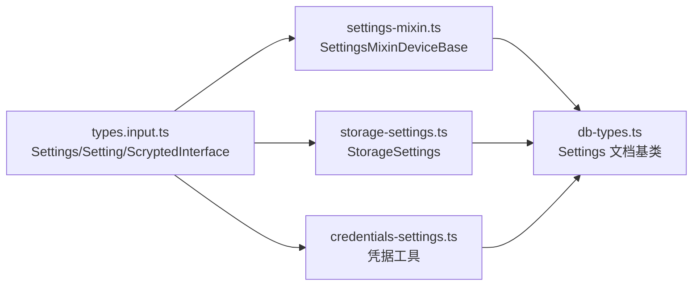

# 设备配置与设置管理

<cite>
**本文引用的文件**
- [common/src/settings-mixin.ts](file://common/src/settings-mixin.ts)
- [sdk/src/settings-mixin.ts](file://sdk/src/settings-mixin.ts)
- [common/src/credentials-settings.ts](file://common/src/credentials-settings.ts)
- [sdk/src/storage-settings.ts](file://sdk/src/storage-settings.ts)
- [sdk/types/src/types.input.ts](file://sdk/types/src/types.input.ts)
- [server/src/db-types.ts](file://server/src/db-types.ts)
</cite>

## 目录
1. [简介](#简介)
2. [项目结构](#项目结构)
3. [核心组件](#核心组件)
4. [架构总览](#架构总览)
5. [详细组件分析](#详细组件分析)
6. [依赖关系分析](#依赖关系分析)
7. [性能考量](#性能考量)
8. [故障排查指南](#故障排查指南)
9. [结论](#结论)
10. [附录](#附录)

## 简介
本文件面向 Scrypted 插件开发者与系统集成者，系统性阐述设备配置与设置管理的技术实现与最佳实践。重点覆盖以下方面：
- Settings 接口的职责与使用：getSettings 配置项定义、putSetting 配置更新处理。
- SettingsMixin 的使用模式：分组配置合并、键空间隔离、事件通知。
- 配置项类型与属性：Setting 接口字段、验证规则、显示格式与交互行为。
- 凭据安全管理：用户名/密码存储、敏感信息保护、凭据轮换策略。
- 配置管理实现示例：定义配置界面、处理配置变更、导入导出策略。
- 安全考虑、用户体验优化与配置迁移策略。

## 项目结构
围绕“配置与设置”的核心代码主要分布在 SDK 类型定义、通用工具与服务端数据模型中：
- SDK 类型定义：定义 Settings 接口、Setting 结构与 ScryptedInterface 枚举。
- 通用工具：SettingsMixin 抽象类（提供分组与键前缀隔离）、凭据工具函数、基于 Storage 的配置持久化封装。
- 服务端数据模型：Settings 文档基类（用于系统级配置存储）。

图表来源
- [sdk/types/src/types.input.ts:1461-1466](file://sdk/types/src/types.input.ts#L1461-L1466)
- [sdk/types/src/types.input.ts:2315-2365](file://sdk/types/src/types.input.ts#L2315-L2365)
- [sdk/types/src/types.input.ts:2382-2486](file://sdk/types/src/types.input.ts#L2382-L2486)
- [common/src/settings-mixin.ts:1-88](file://common/src/settings-mixin.ts#L1-L88)
- [common/src/credentials-settings.ts:1-37](file://common/src/credentials-settings.ts#L1-L37)
- [sdk/src/storage-settings.ts:1-197](file://sdk/src/storage-settings.ts#L1-L197)
- [server/src/db-types.ts:9-11](file://server/src/db-types.ts#L9-L11)

章节来源
- [sdk/types/src/types.input.ts:1461-1466](file://sdk/types/src/types.input.ts#L1461-L1466)
- [sdk/types/src/types.input.ts:2315-2365](file://sdk/types/src/types.input.ts#L2315-L2365)
- [sdk/types/src/types.input.ts:2382-2486](file://sdk/types/src/types.input.ts#L2382-L2486)
- [common/src/settings-mixin.ts:1-88](file://common/src/settings-mixin.ts#L1-L88)
- [common/src/credentials-settings.ts:1-37](file://common/src/credentials-settings.ts#L1-L37)
- [sdk/src/storage-settings.ts:1-197](file://sdk/src/storage-settings.ts#L1-L197)
- [server/src/db-types.ts:9-11](file://server/src/db-types.ts#L9-L11)

## 核心组件
- Settings 接口：定义设备配置的统一访问入口，提供 getSettings 获取配置项列表与 putSetting 更新单个配置项。
- Setting 结构：描述配置项的元数据（键、标题、分组、子分组、描述、占位符、类型、范围、只读、可选值、图标、组合框、设备过滤器、多值、即时应用、控制台、当前值等）。
- SettingsMixinDeviceBase：在混入（Mixin）场景下，将“被混入设备”的配置与“混入方”提供的配置合并，并通过键前缀隔离命名空间，同时负责设置变更后的事件通知。
- StorageSettings：以 Storage 为后端的配置持久化抽象，支持类型解析、默认值、映射转换、JSON 序列化、隐藏字段、回调钩子等。
- 凭据工具：提供标准用户名/密码配置项生成与读取，便于插件快速实现安全凭据管理。

章节来源
- [sdk/types/src/types.input.ts:1461-1466](file://sdk/types/src/types.input.ts#L1461-L1466)
- [sdk/types/src/types.input.ts:2315-2365](file://sdk/types/src/types.input.ts#L2315-L2365)
- [common/src/settings-mixin.ts:11-87](file://common/src/settings-mixin.ts#L11-L87)
- [sdk/src/storage-settings.ts:81-196](file://sdk/src/storage-settings.ts#L81-L196)
- [common/src/credentials-settings.ts:11-36](file://common/src/credentials-settings.ts#L11-L36)

## 架构总览
下图展示了 Settings 接口在设备生命周期中的调用流程与事件传播：

图表来源
- [common/src/settings-mixin.ts:26-82](file://common/src/settings-mixin.ts#L26-L82)
- [sdk/src/storage-settings.ts:154-177](file://sdk/src/storage-settings.ts#L154-L177)

## 详细组件分析

### Settings 接口与 Setting 字段
- 接口职责
  - getSettings：返回设备配置项数组，供 UI 渲染配置界面。
  - putSetting：更新指定键的配置值。
- Setting 字段要点
  - 键与分组：key、group、subgroup 用于组织与分组显示。
  - 显示与交互：title、description、placeholder、icon/icons、immediate、console。
  - 类型与约束：type（字符串、密码、数字、布尔、设备、整数、按钮、路径、接口、HTML、文本域、日期/时间/日期时间、星期、时间区间/日期区间/日期时间区间、单选/面板、脚本）、range（数值/时间范围）、choices（可选值列表）、combobox（组合框）、multiple（多值）。
  - 过滤与设备选择：deviceFilter（字符串或函数）、device 类型值解析。
  - 行为标志：readonly、radioGroups、immediate、console。
  - 当前值：value（由实现决定如何读取）。

章节来源
- [sdk/types/src/types.input.ts:1461-1466](file://sdk/types/src/types.input.ts#L1461-L1466)
- [sdk/types/src/types.input.ts:2315-2365](file://sdk/types/src/types.input.ts#L2315-L2365)

### SettingsMixin 使用模式
- 分组与键前缀
  - 将混入方的配置项统一归入 settingsGroup，并以 settingsGroupKey 作为键前缀，避免与主设备配置键冲突。
- 合并策略
  - 先加载被混入设备的配置，再加载混入方配置；若任一加载失败，记录错误项到“Errors”分组，保证 UI 可见问题。
- 更新处理
  - putSetting 时判断键是否以 settingsGroupKey 前缀开头，命中则交由混入方处理；否则委托给被混入设备。
  - 混入方返回未处理时，触发一次 Settings 事件以刷新 UI。
- 生命周期
  - 构造时注册 Settings 混入事件；release 时注销。

图表来源
- [common/src/settings-mixin.ts:11-87](file://common/src/settings-mixin.ts#L11-L87)

章节来源
- [common/src/settings-mixin.ts:11-87](file://common/src/settings-mixin.ts#L11-L87)
- [sdk/src/settings-mixin.ts:10-86](file://sdk/src/settings-mixin.ts#L10-L86)

### StorageSettings 持久化封装
- 值访问与默认值
  - 通过属性访问器 values[key] 读写；hasValue[key] 判断是否存在。
  - 支持 defaultValue 与 persistedDefaultValue；首次读取时自动回填持久化默认值。
- 类型解析与序列化
  - parseValue 统一解析字符串到布尔/数字/整数/数组/设备/JSON 等类型；对象值自动 JSON 序列化。
- 回调与映射
  - onGet/onPut、mapGet/mapPut 提供读取/写入前后钩子与映射转换。
- 隐藏字段与动态可见性
  - hide 或 options.hide 回调控制字段是否显示。
- 事件通知
  - 非隐藏字段写入后触发 Settings 事件，驱动 UI 刷新。

图表来源
- [sdk/src/storage-settings.ts:154-177](file://sdk/src/storage-settings.ts#L154-L177)
- [sdk/src/storage-settings.ts:179-191](file://sdk/src/storage-settings.ts#L179-L191)

章节来源
- [sdk/src/storage-settings.ts:81-196](file://sdk/src/storage-settings.ts#L81-L196)

### 凭据安全与凭据轮换
- 凭据配置生成
  - getCredentialsSettings 生成标准用户名/密码配置项，从设备存储读取当前值。
- 存储与显示
  - 密码类型字段在 UI 中掩码显示；凭据保存于设备存储。
- 安全建议
  - 仅在必要时保存明文凭据；优先采用短期令牌或 OAuth。
  - 对外暴露的凭据应限制作用域与有效期，定期轮换。
  - 在 UI 中提供“清除凭据”按钮，删除存储中的敏感字段。
- 凭据轮换流程
  - 新增临时凭据 → 写入存储 → 触发 Settings 事件 → UI 刷新 → 删除旧凭据（可选）。

章节来源
- [common/src/credentials-settings.ts:11-36](file://common/src/credentials-settings.ts#L11-L36)

### 配置项类型与验证规则
- 类型与范围
  - 数字/整数：可通过 range 设置允许范围；非法值回退默认值。
  - 时间/日期/日期时间：支持单值与区间类型（timerange/daterange/datetimerange），UI 提供相应控件。
  - 多值：multiple 为真时，值为数组。
  - 设备类型：deviceFilter 可限制可选设备集合；解析时支持原始字符串或系统解析。
- 显示与交互
  - choices + combobox 控制下拉选择；radioGroups 支持单选面板布局。
  - immediate 标记促使 UI 立即应用；console 标记打开控制台。
- 验证与回退
  - 解析失败或越界时，回退到默认值或空值，避免异常状态。

章节来源
- [sdk/types/src/types.input.ts:2315-2365](file://sdk/types/src/types.input.ts#L2315-L2365)
- [sdk/src/storage-settings.ts:5-58](file://sdk/src/storage-settings.ts#L5-L58)

### 配置导入与导出
- 导出
  - 通过 getSettings 获取当前配置项快照，按 key/value 输出；对 deviceFilter 等函数需序列化为字符串以便传输。
- 导入
  - 逐项 putSetting 写入；注意类型转换与默认值回退；对不可见字段（hide）可跳过。
- 迁移策略
  - 版本化配置键（如添加后缀或前缀），在导入时检测并迁移旧键到新键。
  - 对已废弃字段提供映射转换（mapGet/mapPut）或 onGet 动态修正。

章节来源
- [sdk/src/storage-settings.ts:129-151](file://sdk/src/storage-settings.ts#L129-L151)
- [sdk/src/storage-settings.ts:162-177](file://sdk/src/storage-settings.ts#L162-L177)

## 依赖关系分析
- Settings 接口与 Setting 结构由 SDK 类型定义提供，所有实现均遵循该契约。
- SettingsMixinDeviceBase 依赖 MixinDeviceBase 与 deviceManager 的混入事件机制。
- StorageSettings 依赖系统 Storage 与 systemManager（设备 ID 解析）。
- 服务端 Settings 文档基类为系统级配置提供持久化能力。

图表来源
- [sdk/types/src/types.input.ts:1461-1466](file://sdk/types/src/types.input.ts#L1461-L1466)
- [sdk/types/src/types.input.ts:2315-2365](file://sdk/types/src/types.input.ts#L2315-L2365)
- [sdk/types/src/types.input.ts:2382-2486](file://sdk/types/src/types.input.ts#L2382-L2486)
- [common/src/settings-mixin.ts:1-88](file://common/src/settings-mixin.ts#L1-L88)
- [sdk/src/storage-settings.ts:1-197](file://sdk/src/storage-settings.ts#L1-L197)
- [common/src/credentials-settings.ts:1-37](file://common/src/credentials-settings.ts#L1-L37)
- [server/src/db-types.ts:9-11](file://server/src/db-types.ts#L9-L11)

章节来源
- [sdk/types/src/types.input.ts:1461-1466](file://sdk/types/src/types.input.ts#L1461-L1466)
- [sdk/types/src/types.input.ts:2315-2365](file://sdk/types/src/types.input.ts#L2315-L2365)
- [sdk/types/src/types.input.ts:2382-2486](file://sdk/types/src/types.input.ts#L2382-L2486)
- [common/src/settings-mixin.ts:1-88](file://common/src/settings-mixin.ts#L1-L88)
- [sdk/src/storage-settings.ts:1-197](file://sdk/src/storage-settings.ts#L1-L197)
- [common/src/credentials-settings.ts:1-37](file://common/src/credentials-settings.ts#L1-L37)
- [server/src/db-types.ts:9-11](file://server/src/db-types.ts#L9-L11)

## 性能考量
- 合并配置的异步并发：getSettings 并行获取主设备与混入配置，减少等待时间。
- 键前缀与事件：通过前缀隔离避免重复事件；非混入键直接委托，降低分支开销。
- 存储序列化：对象值 JSON 序列化仅在必要时进行；null 值直接 remove，避免无效存储。
- 默认值与映射：在读取时一次性完成类型解析与映射，避免多次计算。

## 故障排查指南
- 配置加载失败
  - 现象：出现“Errors”分组的错误项。
  - 排查：检查混入实现的 getMixinSettings 是否抛错；确认主设备 getSettings 是否可用。
- 配置更新无响应
  - 现象：修改后 UI 未刷新。
  - 排查：确认 putSetting 的键是否命中混入前缀；混入实现返回值是否导致未触发事件；确保非隐藏字段写入后会触发事件。
- 凭据不生效
  - 现象：登录失败或鉴权异常。
  - 排查：确认凭据已写入存储；检查类型是否为 password；确认轮换后旧凭据已被清理。

章节来源
- [common/src/settings-mixin.ts:34-47](file://common/src/settings-mixin.ts#L34-L47)
- [common/src/settings-mixin.ts:56-68](file://common/src/settings-mixin.ts#L56-L68)
- [sdk/src/storage-settings.ts:174-177](file://sdk/src/storage-settings.ts#L174-L177)
- [common/src/credentials-settings.ts:11-36](file://common/src/credentials-settings.ts#L11-L36)

## 结论
Scrypted 的配置与设置管理通过标准化的 Settings 接口与丰富的 Setting 字段，结合 SettingsMixin 的分组与键前缀隔离、StorageSettings 的类型解析与持久化封装，以及凭据工具的安全实践，形成了可扩展、可维护且用户友好的配置体系。开发者应遵循类型与范围约束、合理使用回调与映射、重视凭据安全与事件通知，以实现高质量的设备配置体验。

## 附录
- 系统级 Settings 文档基类：用于系统配置的持久化存储，可作为插件参考实现。

章节来源
- [server/src/db-types.ts:9-11](file://server/src/db-types.ts#L9-L11)