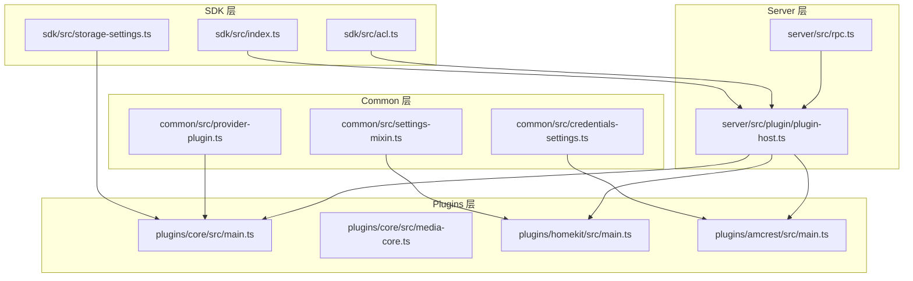
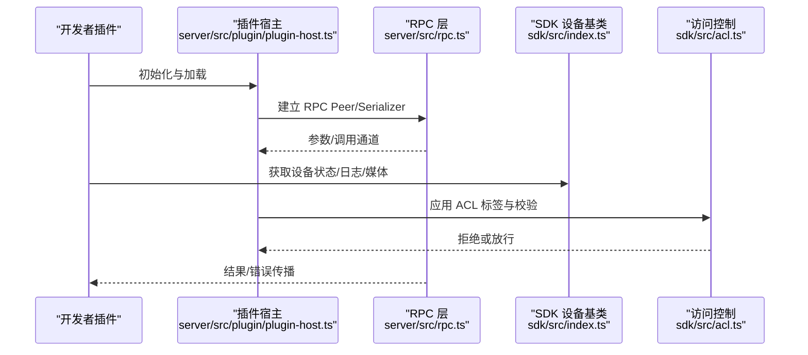
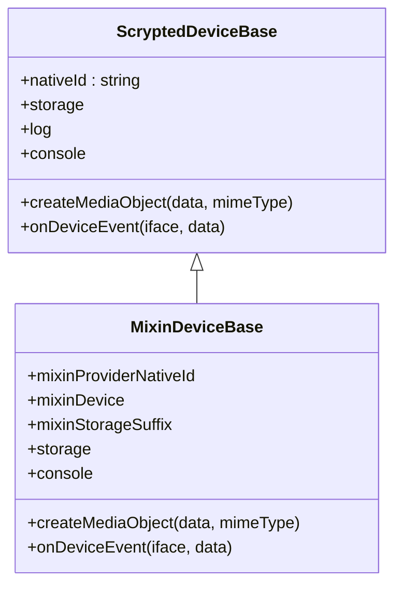
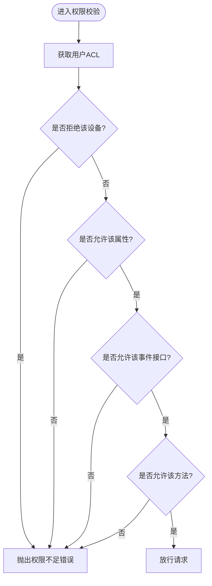
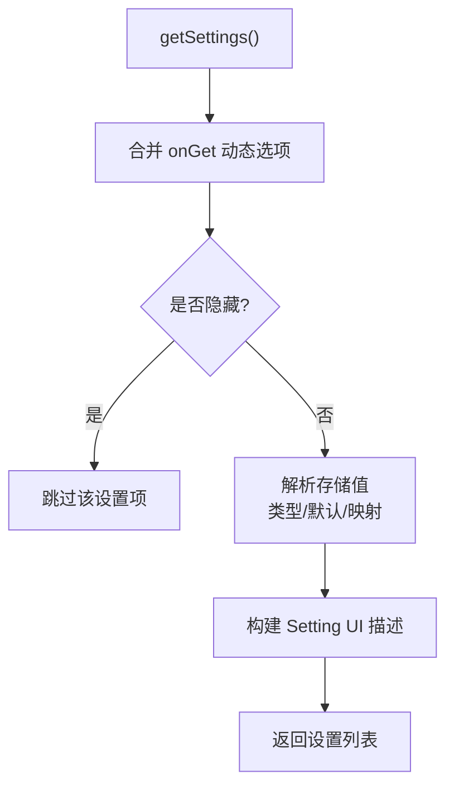
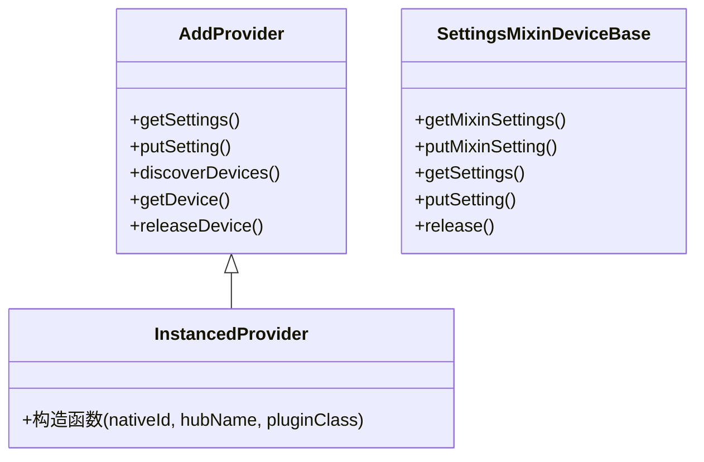
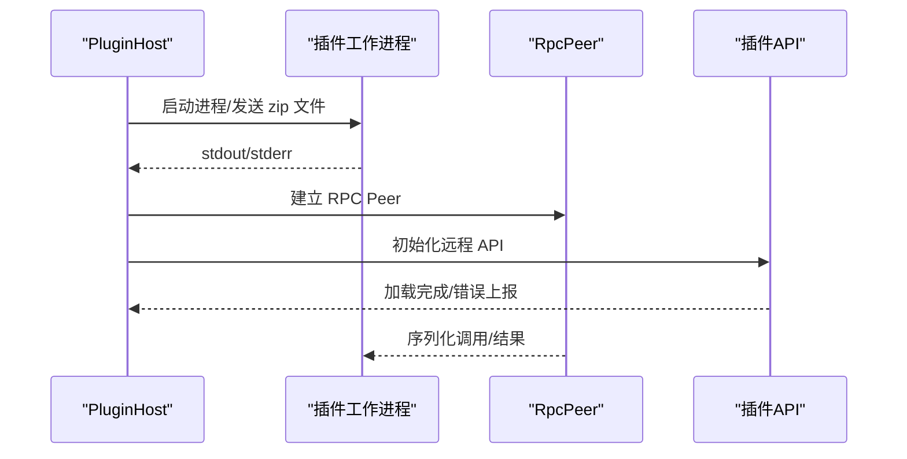
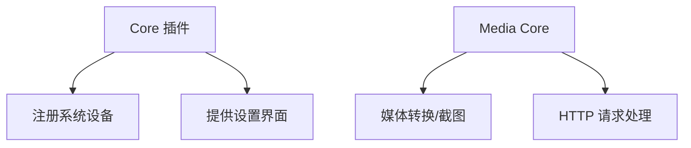
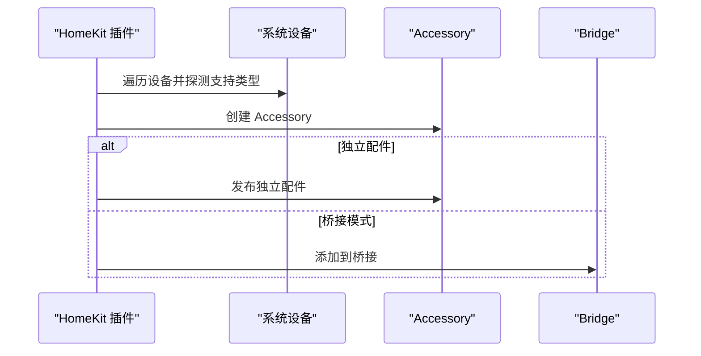
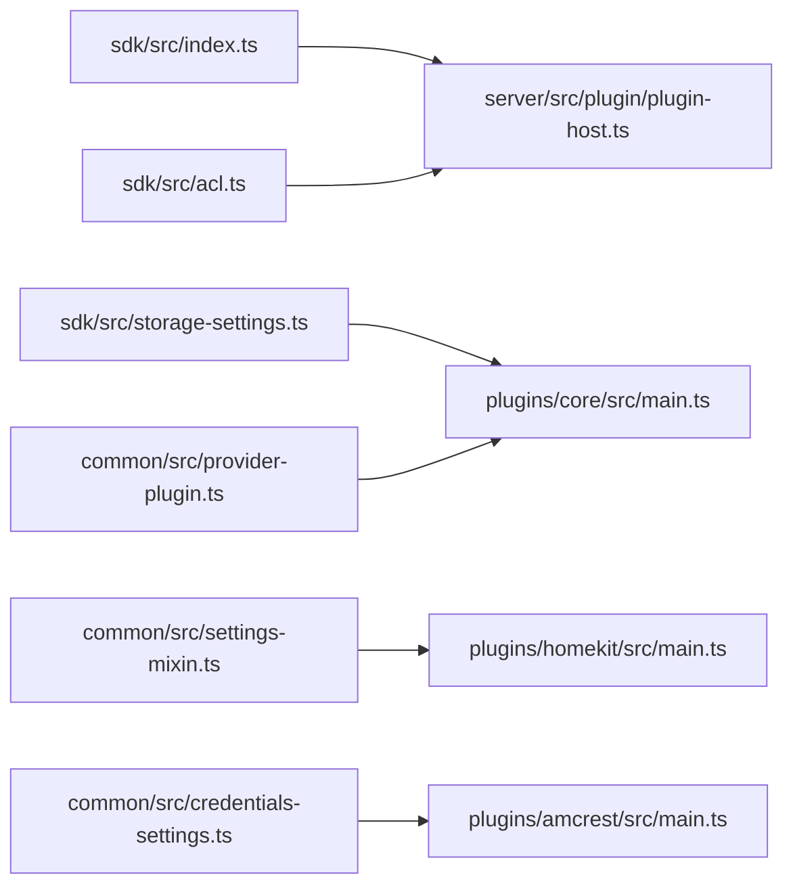

# 最佳实践与安全指南

<cite>
**本文档引用的文件**
- [README.md](file://README.md)
- [sdk/package.json](file://sdk/package.json)
- [sdk/src/index.ts](file://sdk/src/index.ts)
- [sdk/src/acl.ts](file://sdk/src/acl.ts)
- [sdk/src/storage-settings.ts](file://sdk/src/storage-settings.ts)
- [common/src/provider-plugin.ts](file://common/src/provider-plugin.ts)
- [common/src/credentials-settings.ts](file://common/src/credentials-settings.ts)
- [common/src/settings-mixin.ts](file://common/src/settings-mixin.ts)
- [server/src/plugin/plugin-host.ts](file://server/src/plugin/plugin-host.ts)
- [server/src/rpc.ts](file://server/src/rpc.ts)
- [plugins/core/src/main.ts](file://plugins/core/src/main.ts)
- [plugins/core/src/media-core.ts](file://plugins/core/src/media-core.ts)
- [plugins/homekit/src/main.ts](file://plugins/homekit/src/main.ts)
- [plugins/amcrest/src/main.ts](file://plugins/amcrest/src/main.ts)
</cite>

## 目录
1. [简介](#简介)
2. [项目结构](#项目结构)
3. [核心组件](#核心组件)
4. [架构总览](#架构总览)
5. [详细组件分析](#详细组件分析)
6. [依赖关系分析](#依赖关系分析)
7. [性能考量](#性能考量)
8. [故障排查指南](#故障排查指南)
9. [结论](#结论)
10. [附录](#附录)

## 简介
本指南面向 Scrypted 插件开发者，系统阐述插件架构设计最佳实践、安全性考虑、性能优化、代码质量保障、维护与升级策略以及用户体验优化，并提供社区协作与开源贡献的指导原则。内容基于仓库中的 SDK、服务器端插件宿主、核心插件与典型设备插件实现进行提炼总结。

## 项目结构
Scrypted 采用多包（monorepo）结构，核心由以下部分组成：
- SDK：提供插件开发所需的运行时 API、设备基类、ACL、设置持久化等能力
- Server：运行时宿主，负责插件生命周期、RPC 通信、访问控制、集群与健康检查
- Common：通用工具与混入（Mixin）模式支持
- Plugins：各类设备与服务插件，如 HomeKit、Amcrest、Core 内核功能等
- Packages：辅助工具与第三方集成封装

**图表来源**
- [sdk/src/index.ts:1-297](file://sdk/src/index.ts#L1-L297)
- [sdk/src/acl.ts:1-153](file://sdk/src/acl.ts#L1-L153)
- [sdk/src/storage-settings.ts:1-197](file://sdk/src/storage-settings.ts#L1-L197)
- [server/src/plugin/plugin-host.ts:1-506](file://server/src/plugin/plugin-host.ts#L1-L506)
- [server/src/rpc.ts:1-858](file://server/src/rpc.ts#L1-L858)
- [common/src/provider-plugin.ts:1-99](file://common/src/provider-plugin.ts#L1-L99)
- [common/src/credentials-settings.ts:1-37](file://common/src/credentials-settings.ts#L1-L37)
- [common/src/settings-mixin.ts:1-88](file://common/src/settings-mixin.ts#L1-L88)
- [plugins/core/src/main.ts:1-414](file://plugins/core/src/main.ts#L1-L414)
- [plugins/core/src/media-core.ts:1-145](file://plugins/core/src/media-core.ts#L1-L145)
- [plugins/homekit/src/main.ts:1-487](file://plugins/homekit/src/main.ts#L1-L487)
- [plugins/amcrest/src/main.ts:1-826](file://plugins/amcrest/src/main.ts#L1-L826)

**章节来源**
- [README.md:1-59](file://README.md#L1-L59)
- [sdk/package.json:1-62](file://sdk/package.json#L1-L62)

## 核心组件
- 设备基类与状态管理：通过 SDK 的设备基类提供懒加载设备状态、日志、媒体对象创建、事件分发等能力，确保插件以统一方式访问系统资源。
- 访问控制与权限：SDK 提供接口级 ACL 定义与合并机制，结合服务器端 RPC 层对连接进行 ACL 标签绑定与拒绝策略。
- 设置持久化：StorageSettings 封装了类型解析、默认值、映射读取与写入、隐藏字段、设备过滤器等，简化插件设置 UI 与存储逻辑。
- 插件宿主与 RPC：服务器端插件宿主负责插件进程生命周期、健康检查、Engine.IO/WebSocket 连接、RPC 序列化与反序列化、错误传播与回收。
- Provider/Mixin 模式：Provider 负责发现与创建设备；Mixin 为已有设备添加功能扩展；SettingsMixin 统一混入设置的分组与键空间。

**章节来源**
- [sdk/src/index.ts:10-204](file://sdk/src/index.ts#L10-L204)
- [sdk/src/acl.ts:1-153](file://sdk/src/acl.ts#L1-L153)
- [sdk/src/storage-settings.ts:81-196](file://sdk/src/storage-settings.ts#L81-L196)
- [server/src/plugin/plugin-host.ts:38-506](file://server/src/plugin/plugin-host.ts#L38-L506)
- [server/src/rpc.ts:285-800](file://server/src/rpc.ts#L285-L800)
- [common/src/provider-plugin.ts:6-99](file://common/src/provider-plugin.ts#L6-L99)
- [common/src/settings-mixin.ts:11-87](file://common/src/settings-mixin.ts#L11-L87)

## 架构总览
下图展示了从插件到服务器、再到设备与外部系统的交互路径，以及关键的安全与性能控制点。

**图表来源**
- [server/src/plugin/plugin-host.ts:122-274](file://server/src/plugin/plugin-host.ts#L122-L274)
- [server/src/rpc.ts:285-800](file://server/src/rpc.ts#L285-L800)
- [sdk/src/index.ts:10-71](file://sdk/src/index.ts#L10-L71)
- [sdk/src/acl.ts:25-121](file://sdk/src/acl.ts#L25-L121)

## 详细组件分析

### 设备基类与状态管理（ScryptedDeviceBase）
- 特性
  - 懒加载设备状态属性，避免未发现设备时的空引用
  - 统一日志、存储、媒体对象创建与事件分发入口
  - 支持 MixinDeviceBase 的混入场景，隔离混入存储与事件
- 最佳实践
  - 在使用设备状态前先确保设备已发现
  - 使用 createMediaObject 创建媒体对象并标注 sourceId，便于追踪来源
  - 通过 onDeviceEvent 发布事件，避免直接修改系统状态

**图表来源**
- [sdk/src/index.ts:10-167](file://sdk/src/index.ts#L10-L167)

**章节来源**
- [sdk/src/index.ts:10-204](file://sdk/src/index.ts#L10-L204)

### 访问控制与权限（ACL）
- 接口描述符与权限模型
  - 通过接口描述符聚合方法、属性与接口集合
  - 用户级 ACL 合并与设备粒度拒绝判断
- 运行时校验
  - 对设备、属性、事件、接口、方法分别进行拒绝判定
  - 缓存与去抖机制降低频繁查询开销
- 安全建议
  - 明确声明插件暴露的接口与方法
  - 对敏感操作（如重启、配置变更）启用细粒度 ACL
  - 避免在 ACL 未生效时执行高风险操作

**图表来源**
- [sdk/src/acl.ts:25-121](file://sdk/src/acl.ts#L25-L121)

**章节来源**
- [sdk/src/acl.ts:1-153](file://sdk/src/acl.ts#L1-L153)

### 设置持久化与 UI（StorageSettings）
- 类型解析与默认值
  - 自动解析布尔、数字、整数、数组、设备引用与 JSON 字段
  - 支持 persistedDefaultValue 与 defaultValue 双重默认策略
- 映射与隐藏
  - mapGet/mapPut 允许对存储值进行转换
  - hide 与动态隐藏函数控制 UI 可见性
- 最佳实践
  - 将复杂设置拆分为多个 StorageSetting，避免单个设置过于臃肿
  - 使用 onGet 动态生成可选项与设备过滤器
  - 对敏感字段（密码）使用 type=password 并避免明文存储

**图表来源**
- [sdk/src/storage-settings.ts:129-151](file://sdk/src/storage-settings.ts#L129-L151)

**章节来源**
- [sdk/src/storage-settings.ts:1-197](file://sdk/src/storage-settings.ts#L1-L197)

### Provider 与实例化模式（Provider/Mixin）
- Provider 模式
  - AddProvider/InstancedProvider 支持动态添加设备与实例化模式切换
  - 通过 deviceManager.onDeviceDiscovered 注册设备
- Mixin 模式
  - SettingsMixinDeviceBase 统一混入设置的分组与键空间，避免冲突
  - onMixinEvent 通知 UI 更新设置面板
- 最佳实践
  - Provider 负责设备发现与创建；Mixin 负责功能增强
  - 实例化模式下，确保本地存储迁移与实例隔离

**图表来源**
- [common/src/provider-plugin.ts:6-99](file://common/src/provider-plugin.ts#L6-L99)
- [common/src/settings-mixin.ts:11-87](file://common/src/settings-mixin.ts#L11-L87)

**章节来源**
- [common/src/provider-plugin.ts:1-99](file://common/src/provider-plugin.ts#L1-L99)
- [common/src/settings-mixin.ts:1-88](file://common/src/settings-mixin.ts#L1-L88)

### 插件宿主与 RPC（PluginHost/RPC）
- 插件宿主职责
  - 解压与加载插件包、启动工作进程、建立 Engine.IO/WebSocket 连接
  - 健康检查与自动重启、日志转发、控制台服务
  - ACL 标签绑定与 RPC Peer 初始化
- RPC 层特性
  - 代理对象序列化/反序列化、错误包装、弱引用与终结器
  - 单向方法、异步迭代器、参数获取与结果回传
- 性能与稳定性
  - 定期垃圾回收触发、超时与心跳检测
  - 大消息缓冲区限制与压缩配置

**图表来源**
- [server/src/plugin/plugin-host.ts:122-274](file://server/src/plugin/plugin-host.ts#L122-L274)
- [server/src/rpc.ts:285-800](file://server/src/rpc.ts#L285-L800)

**章节来源**
- [server/src/plugin/plugin-host.ts:1-506](file://server/src/plugin/plugin-host.ts#L1-L506)
- [server/src/rpc.ts:1-858](file://server/src/rpc.ts#L1-L858)

### 核心插件与媒体核心（Core/Media）
- Core 插件
  - 提供系统设备（集群、脚本、终端、REPL、用户等）与设置界面
  - 释放通道与更新机制（Docker 镜像标签与重启）
- Media Core
  - 作为 BufferConverter 与 HTTP 请求处理器，提供截图与媒体流转换
  - 本地 URL 与 RequestMediaObject 的桥接

**图表来源**
- [plugins/core/src/main.ts:27-394](file://plugins/core/src/main.ts#L27-L394)
- [plugins/core/src/media-core.ts:9-145](file://plugins/core/src/media-core.ts#L9-L145)

**章节来源**
- [plugins/core/src/main.ts:1-414](file://plugins/core/src/main.ts#L1-L414)
- [plugins/core/src/media-core.ts:1-145](file://plugins/core/src/media-core.ts#L1-L145)

### HomeKit 插件（混入与发布）
- 混入与自动启用
  - 自动为支持的设备启用 HomeKit 混入，支持独立配件与桥接模式
  - mDNS 广告器选择与接口绑定
- 最佳实践
  - 严格区分独立配件与桥接模式的配对与发布流程
  - 对慢速网络客户端提供降级流策略

**图表来源**
- [plugins/homekit/src/main.ts:60-487](file://plugins/homekit/src/main.ts#L60-L487)

**章节来源**
- [plugins/homekit/src/main.ts:1-487](file://plugins/homekit/src/main.ts#L1-L487)

### Amcrest 插件（设备实现范式）
- 设备能力
  - RTSP 流、事件监听、智能检测、两步音频（Amcrest/ONVIF）、录制回放
  - 自动配置与设备信息采集
- 最佳实践
  - 将协议细节封装为客户端，避免在设备类中散落网络调用
  - 对事件流与音频流采用异步处理与资源清理

**章节来源**
- [plugins/amcrest/src/main.ts:1-826](file://plugins/amcrest/src/main.ts#L1-L826)

## 依赖关系分析
- SDK 与 Server 的耦合
  - SDK 通过运行时注入获取设备管理器、媒体管理器、系统管理器等
  - Server 通过 PluginHost 与 RPC 层对接 SDK 的运行时 API
- 插件与通用层
  - Provider/Mixin 与 SettingsMixin 为插件提供统一的扩展与设置模型
  - Credentials Settings 提供凭据存储的 UI 与读取封装

**图表来源**
- [sdk/src/index.ts:206-296](file://sdk/src/index.ts#L206-L296)
- [server/src/plugin/plugin-host.ts:1-506](file://server/src/plugin/plugin-host.ts#L1-L506)
- [plugins/core/src/main.ts:1-414](file://plugins/core/src/main.ts#L1-L414)
- [plugins/homekit/src/main.ts:1-487](file://plugins/homekit/src/main.ts#L1-L487)
- [plugins/amcrest/src/main.ts:1-826](file://plugins/amcrest/src/main.ts#L1-L826)
- [common/src/provider-plugin.ts:1-99](file://common/src/provider-plugin.ts#L1-L99)
- [common/src/settings-mixin.ts:1-88](file://common/src/settings-mixin.ts#L1-L88)
- [common/src/credentials-settings.ts:1-37](file://common/src/credentials-settings.ts#L1-L37)

**章节来源**
- [sdk/package.json:1-62](file://sdk/package.json#L1-L62)

## 性能考量
- 内存管理
  - 启用定期垃圾回收触发，避免长时间运行导致内存泄漏
  - 使用弱引用与终结器回收远端代理对象
- 异步处理
  - 优先使用异步 API，避免阻塞 RPC 线程
  - 对大消息传输启用压缩与缓冲区上限
- 缓存策略
  - 对频繁查询的 ACL 与设置采用去抖与缓存
  - 对设备信息与配置采用本地存储与失效策略
- 资源复用
  - 复用媒体转换器与网络客户端
  - 对插件进程与连接进行健康检查与自动重启

**章节来源**
- [server/src/rpc.ts:1-27](file://server/src/rpc.ts#L1-L27)
- [server/src/plugin/plugin-host.ts:38-506](file://server/src/plugin/plugin-host.ts#L38-L506)
- [sdk/src/acl.ts:124-153](file://sdk/src/acl.ts#L124-L153)
- [sdk/src/storage-settings.ts:129-151](file://sdk/src/storage-settings.ts#L129-L151)

## 故障排查指南
- 插件加载失败
  - 查看宿主日志与告警，确认 zip 解压、远程初始化与模块加载阶段的错误
  - 检查插件包的 scrypted.runtime 与运行时环境
- RPC 错误与超时
  - 关注 RPCResultError 的堆栈与对端标识，定位具体调用方法
  - 检查序列化上下文与传输安全类型
- 权限拒绝
  - 核对 ACL 标签与设备/属性/接口/方法的允许列表
  - 确认用户访问控制是否被正确合并与缓存

**章节来源**
- [server/src/plugin/plugin-host.ts:226-274](file://server/src/plugin/plugin-host.ts#L226-L274)
- [server/src/rpc.ts:229-240](file://server/src/rpc.ts#L229-L240)
- [sdk/src/acl.ts:126-152](file://sdk/src/acl.ts#L126-L152)

## 结论
通过遵循本文档的架构设计、安全与性能最佳实践，结合 SDK 与服务器端能力，开发者可以构建稳定、可维护且高性能的 Scrypted 插件。建议在开发过程中始终关注：
- 模块化与职责分离（Provider/Mixin/Settings）
- 明确的访问控制与输入验证
- 异步与资源管理的正确性
- 渐进式测试与持续集成
- 向后兼容与版本演进策略

## 附录
- 开发与调试
  - 使用 VS Code 调试插件与服务器，支持热部署与断点调试
  - 通过 CLI 工具构建与部署插件
- 社区与贡献
  - 参与社区讨论与问题反馈，遵循开源协作规范
  - 提交 PR 前确保通过单元/集成测试与代码审查

**章节来源**
- [README.md:15-59](file://README.md#L15-L59)
- [sdk/package.json:13-28](file://sdk/package.json#L13-L28)