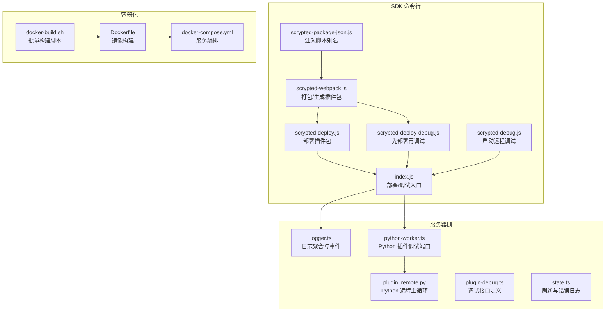
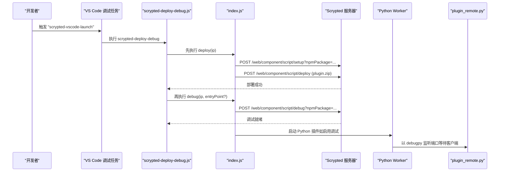
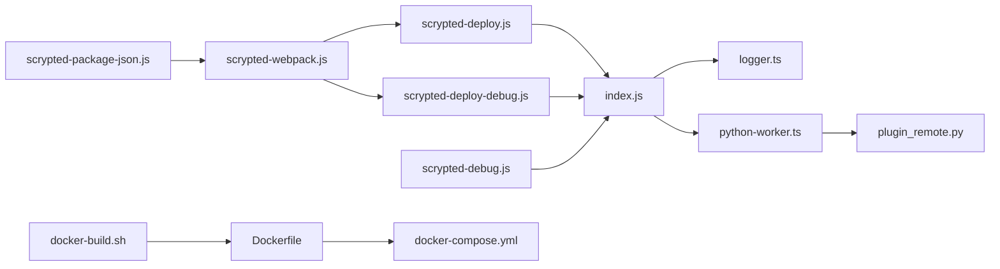

# 调试与部署

<cite>
**本文引用的文件**
- [sdk/bin/scrypted-debug.js](file://sdk/bin/scrypted-debug.js)
- [sdk/bin/scrypted-deploy.js](file://sdk/bin/scrypted-deploy.js)
- [sdk/bin/scrypted-deploy-debug.js](file://sdk/bin/scrypted-deploy-debug.js)
- [sdk/bin/index.js](file://sdk/bin/index.js)
- [sdk/bin/scrypted-webpack.js](file://sdk/bin/scrypted-webpack.js)
- [sdk/bin/scrypted-package-json.js](file://sdk/bin/scrypted-package-json.js)
- [server/src/logger.ts](file://server/src/logger.ts)
- [install/docker/docker-compose.yml](file://install/docker/docker-compose.yml)
- [install/docker/Dockerfile](file://install/docker/Dockerfile)
- [install/docker/docker-build.sh](file://install/docker/docker-build.sh)
- [server/src/plugin/plugin-debug.ts](file://server/src/plugin/plugin-debug.ts)
- [server/src/plugin/runtime/python-worker.ts](file://server/src/plugin/runtime/python-worker.ts)
- [plugins/homekit/src/types/camera/camera-debug-mode-storage.ts](file://plugins/homekit/src/types/camera/camera-debug-mode-storage.ts)
- [server/src/state.ts](file://server/src/state.ts)
- [server/python/plugin_remote.py](file://server/python/plugin_remote.py)
</cite>

## 目录
1. [简介](#简介)
2. [项目结构](#项目结构)
3. [核心组件](#核心组件)
4. [架构总览](#架构总览)
5. [详细组件分析](#详细组件分析)
6. [依赖关系分析](#依赖关系分析)
7. [性能考虑](#性能考虑)
8. [故障排查指南](#故障排查指南)
9. [结论](#结论)
10. [附录](#附录)

## 简介
本指南面向 Scrypted 插件开发者，系统讲解如何在 VS Code 中进行插件调试、使用内置调试与部署脚本、利用日志系统进行问题定位、以及完成从本地到生产环境（含 Docker）的部署流程。同时覆盖打包与分发、版本与依赖管理、兼容性检查、性能分析与优化建议，以及常见问题的诊断与解决路径。

## 项目结构
本仓库为 Scrypted 核心与插件生态的集合，调试与部署相关的入口主要集中在 SDK 的命令行工具与服务器侧运行时。下图给出与“调试与部署”直接相关的模块关系概览。

图表来源
- [sdk/bin/index.js:1-171](file://sdk/bin/index.js#L1-L171)
- [sdk/bin/scrypted-debug.js:1-23](file://sdk/bin/scrypted-debug.js#L1-L23)
- [sdk/bin/scrypted-deploy.js:1-21](file://sdk/bin/scrypted-deploy.js#L1-L21)
- [sdk/bin/scrypted-deploy-debug.js:1-24](file://sdk/bin/scrypted-deploy-debug.js#L1-L24)
- [sdk/bin/scrypted-webpack.js:101-149](file://sdk/bin/scrypted-webpack.js#L101-L149)
- [sdk/bin/scrypted-package-json.js:1-19](file://sdk/bin/scrypted-package-json.js#L1-L19)
- [server/src/logger.ts:1-93](file://server/src/logger.ts#L1-L93)
- [server/src/plugin/runtime/python-worker.ts:36-68](file://server/src/plugin/runtime/python-worker.ts#L36-L68)
- [server/python/plugin_remote.py:1151-1189](file://server/python/plugin_remote.py#L1151-L1189)
- [server/src/plugin/plugin-debug.ts:1-5](file://server/src/plugin/plugin-debug.ts#L1-L5)
- [server/src/state.ts:221-267](file://server/src/state.ts#L221-L267)
- [install/docker/docker-compose.yml:1-169](file://install/docker/docker-compose.yml#L1-L169)
- [install/docker/Dockerfile:1-22](file://install/docker/Dockerfile#L1-L22)
- [install/docker/docker-build.sh:1-19](file://install/docker/docker-build.sh#L1-L19)

章节来源
- [sdk/bin/index.js:1-171](file://sdk/bin/index.js#L1-L171)
- [install/docker/docker-compose.yml:1-169](file://install/docker/docker-compose.yml#L1-L169)

## 核心组件
- SDK 部署/调试入口：负责读取当前插件的 package.json，构造目标主机地址，调用服务器端 Web 接口完成部署或触发调试。
- 打包工具：统一通过 scrypted-webpack 生成插件 zip 包，供部署使用。
- 日志系统：提供设备级日志聚合、事件广播与清理能力，便于问题定位。
- Python 插件调试：在启用调试模式时，Python 工作进程以 debugpy 模式监听指定端口，支持 VS Code 远程调试。
- 容器化部署：提供 Dockerfile、docker-compose.yml 与构建脚本，支撑本地与生产环境部署。

章节来源
- [sdk/bin/index.js:52-133](file://sdk/bin/index.js#L52-L133)
- [sdk/bin/index.js:135-166](file://sdk/bin/index.js#L135-L166)
- [sdk/bin/scrypted-webpack.js:101-149](file://sdk/bin/scrypted-webpack.js#L101-L149)
- [server/src/logger.ts:19-92](file://server/src/logger.ts#L19-L92)
- [server/src/plugin/runtime/python-worker.ts:44-68](file://server/src/plugin/runtime/python-worker.ts#L44-L68)

## 架构总览
下图展示一次“先部署后调试”的典型流程，包括 VS Code 脚本触发、SDK 命令行、服务器端接口与 Python 插件调试端口的交互。

图表来源
- [sdk/bin/scrypted-deploy-debug.js:11-24](file://sdk/bin/scrypted-deploy-debug.js#L11-L24)
- [sdk/bin/index.js:52-133](file://sdk/bin/index.js#L52-L133)
- [sdk/bin/index.js:135-166](file://sdk/bin/index.js#L135-L166)
- [server/src/plugin/runtime/python-worker.ts:44-68](file://server/src/plugin/runtime/python-worker.ts#L44-L68)
- [server/python/plugin_remote.py:1151-1189](file://server/python/plugin_remote.py#L1151-L1189)

## 详细组件分析

### VS Code 调试配置与断点调试
- 使用场景
  - 在 VS Code 中通过 npm 脚本触发“先部署后调试”，自动完成打包、部署与远程调试初始化。
  - 对 Python 插件，可在启用调试模式时由服务器侧注入 debugpy 监听端口，实现断点调试。
- 关键要点
  - VS Code 调试任务会调用 scrypted-deploy-debug 脚本，该脚本内部顺序执行部署与调试。
  - 若插件为 Python 类型且服务器侧检测到需要调试，Python 工作进程将以 debugpy 模式启动并监听指定端口。
  - 可在 VS Code 中附加到该端口进行断点调试；日志可通过服务器侧日志系统查看。

章节来源
- [sdk/bin/scrypted-deploy-debug.js:11-24](file://sdk/bin/scrypted-deploy-debug.js#L11-L24)
- [server/src/plugin/runtime/python-worker.ts:44-68](file://server/src/plugin/runtime/python-worker.ts#L44-L68)
- [server/src/plugin/plugin-debug.ts:1-5](file://server/src/plugin/plugin-debug.ts#L1-L5)

### Scrypted 内置调试工具与参数
- scrypted-debug
  - 功能：向服务器发送调试请求，触发浏览器端调试界面准备。
  - 参数：目标 IP（可带端口，默认 10443），可选入口文件（用于快速启动）。
- scrypted-deploy
  - 功能：将当前插件打包并部署到目标服务器。
  - 参数：目标 IP（可带端口）。
- scrypted-deploy-debug
  - 功能：先部署，再触发调试。
  - 参数：目标 IP（可带端口），可选入口文件。
- SDK 入口 index.js
  - 解析 package.json 获取 npm 包名，构造服务器端调试/部署 URL。
  - 通过登录凭据认证，POST 请求完成操作；异常时打印响应体辅助诊断。

章节来源
- [sdk/bin/scrypted-debug.js:10-22](file://sdk/bin/scrypted-debug.js#L10-L22)
- [sdk/bin/scrypted-deploy.js:11-20](file://sdk/bin/scrypted-deploy.js#L11-L20)
- [sdk/bin/scrypted-deploy-debug.js:11-23](file://sdk/bin/scrypted-deploy-debug.js#L11-L23)
- [sdk/bin/index.js:135-166](file://sdk/bin/index.js#L135-L166)
- [sdk/bin/index.js:52-133](file://sdk/bin/index.js#L52-L133)

### 日志记录最佳实践
- 日志级别与输出
  - 服务器侧提供 Logger 类，支持按路径与标题聚合日志，输出到控制台并发出事件。
  - 插件可通过 sdk.log 或设备级日志接口写入，便于在 Web UI 或日志面板中查看。
- 调试信息与错误追踪
  - 刷新与状态更新失败等异常会被记录为错误级别日志，便于定位。
  - 可结合日志清理与告警清除接口，避免历史噪声干扰。
- 实战建议
  - 在关键路径（如设备发现、媒体转换、网络请求）打点日志。
  - 对异常分支输出明确的上下文信息（如接口名、参数摘要）。
  - 使用设备级日志命名空间区分不同功能模块。

章节来源
- [server/src/logger.ts:19-92](file://server/src/logger.ts#L19-L92)
- [server/src/state.ts:221-267](file://server/src/state.ts#L221-L267)

### 插件部署流程
- 本地开发环境
  - 通过 scrypted-webpack 生成插件包（dist/out 目录下的 plugin.zip）。
  - 使用 scrypted-deploy 将包部署到目标服务器；或使用 scrypted-deploy-debug 一键完成部署与调试。
- 生产环境
  - 使用 docker-compose 编排服务，镜像由 Dockerfile 构建，支持多平台变体（full/lite/nvidia/intel 等）。
  - 可通过环境变量控制 DNS、NVR 存储卷、硬件直通设备等。
- Docker 容器部署
  - Dockerfile 通过 npx 安装并启动 scrypted 服务，设置工作目录与启动命令。
  - docker-compose.yml 提供默认数据库卷、网络模式与更新服务（watchtower）。
  - docker-build.sh 支持批量构建基础镜像与完整镜像。

章节来源
- [sdk/bin/scrypted-webpack.js:101-149](file://sdk/bin/scrypted-webpack.js#L101-L149)
- [sdk/bin/scrypted-deploy.js:52-133](file://sdk/bin/scrypted-deploy.js#L52-L133)
- [install/docker/Dockerfile:1-22](file://install/docker/Dockerfile#L1-22)
- [install/docker/docker-compose.yml:20-169](file://install/docker/docker-compose.yml#L20-L169)
- [install/docker/docker-build.sh:1-19](file://install/docker/docker-build.sh#L1-L19)

### 打包与分发、版本与兼容性
- 打包
  - 通过 scrypted-webpack 统一生成插件 zip，供部署使用。
- 分发
  - 通过 SDK 的部署接口将包推送到目标服务器；服务器端会校验与安装。
- 版本管理
  - 通过 package.json 的 scripts 注入常用命令别名，便于 CI/本地统一执行。
- 兼容性检查
  - 服务器端会加载自定义接口描述符，若加载失败会输出警告，避免因类型不匹配导致运行时异常。

章节来源
- [sdk/bin/scrypted-webpack.js:101-149](file://sdk/bin/scrypted-webpack.js#L101-L149)
- [sdk/bin/index.js:52-133](file://sdk/bin/index.js#L52-L133)
- [sdk/bin/scrypted-package-json.js:4-18](file://sdk/bin/scrypted-package-json.js#L4-L18)
- [sdk/src/index.ts:269-289](file://sdk/src/index.ts#L269-L289)

### 性能分析与优化
- 内存与 GC
  - Python 插件主循环中定期触发垃圾回收，有助于降低长期运行的内存占用。
- 网络与 I/O
  - 容器镜像设置 DNS 以提升 npm 等网络访问稳定性；建议在本地网络不佳时调整。
- 设备刷新与节流
  - 状态刷新存在节流机制，避免频繁刷新造成抖动与资源浪费；异常会记录为错误级别日志。

章节来源
- [server/python/plugin_remote.py:1174-1178](file://server/python/plugin_remote.py#L1174-L1178)
- [install/docker/Dockerfile:12-15](file://install/docker/Dockerfile#L12-L15)
- [server/src/state.ts:221-267](file://server/src/state.ts#L221-L267)

## 依赖关系分析
- SDK 命令行工具依赖
  - scrypted-debug/deploy/deploy-debug 均依赖 index.js 的部署/调试函数。
  - scrypted-webpack 生成插件包，供 deploy 使用。
  - scrypted-package-json 注入脚本别名，简化 VS Code 调试任务。
- 服务器侧依赖
  - Python 插件调试通过 debugpy 注入，监听端口等待 VS Code 附加。
  - 日志系统为插件提供统一的日志通道与事件通知。
- 容器化依赖
  - Dockerfile 依赖 Docker Compose 的服务编排与环境变量。

图表来源
- [sdk/bin/scrypted-package-json.js:4-18](file://sdk/bin/scrypted-package-json.js#L4-L18)
- [sdk/bin/scrypted-webpack.js:101-149](file://sdk/bin/scrypted-webpack.js#L101-L149)
- [sdk/bin/scrypted-deploy.js:52-133](file://sdk/bin/scrypted-deploy.js#L52-L133)
- [sdk/bin/scrypted-deploy-debug.js:11-24](file://sdk/bin/scrypted-deploy-debug.js#L11-L24)
- [sdk/bin/scrypted-debug.js:10-22](file://sdk/bin/scrypted-debug.js#L10-L22)
- [sdk/bin/index.js:52-133](file://sdk/bin/index.js#L52-L133)
- [server/src/logger.ts:19-92](file://server/src/logger.ts#L19-L92)
- [server/src/plugin/runtime/python-worker.ts:44-68](file://server/src/plugin/runtime/python-worker.ts#L44-L68)
- [server/python/plugin_remote.py:1151-1189](file://server/python/plugin_remote.py#L1151-L1189)
- [install/docker/Dockerfile:1-22](file://install/docker/Dockerfile#L1-L22)
- [install/docker/docker-compose.yml:20-169](file://install/docker/docker-compose.yml#L20-L169)
- [install/docker/docker-build.sh:1-19](file://install/docker/docker-build.sh#L1-L19)

## 性能考虑
- Python 插件
  - 主循环内周期性触发垃圾回收，减少内存泄漏风险。
  - 可根据负载情况调整刷新频率与节流策略。
- 网络与 DNS
  - 容器镜像显式设置 DNS，避免本地 DNS 不稳定影响包下载与更新。
- 日志开销
  - 容器日志驱动默认关闭，避免过多日志对存储造成压力；必要时可临时开启文件日志辅助诊断。

章节来源
- [server/python/plugin_remote.py:1174-1178](file://server/python/plugin_remote.py#L1174-L1178)
- [install/docker/docker-compose.yml:123-131](file://install/docker/docker-compose.yml#L123-L131)
- [install/docker/Dockerfile:12-15](file://install/docker/Dockerfile#L12-L15)

## 故障排查指南
- 部署失败
  - 确认已执行打包命令生成插件包；检查服务器登录凭据是否正确；关注返回的错误信息与响应体。
- 调试无法连接
  - 确认已执行调试脚本；检查服务器端调试接口是否返回成功；对于 Python 插件，确认 debugpy 端口已监听。
- 日志无输出
  - 检查设备级日志命名空间与标题；确认日志级别设置；必要时清理历史日志。
- 容器启动异常
  - 检查 DNS 设置、卷挂载与设备直通配置；确认网络模式与安全选项符合预期。

章节来源
- [sdk/bin/index.js:52-133](file://sdk/bin/index.js#L52-L133)
- [sdk/bin/index.js:135-166](file://sdk/bin/index.js#L135-L166)
- [server/src/logger.ts:55-92](file://server/src/logger.ts#L55-L92)
- [install/docker/docker-compose.yml:123-169](file://install/docker/docker-compose.yml#L123-L169)

## 结论
通过 SDK 内置的部署与调试脚本、统一的打包流程、完善的日志系统与容器化编排，开发者可以高效地完成插件的本地调试、部署与运维。建议在开发过程中遵循日志规范、合理设置刷新节流、关注网络与 DNS 配置，并在 Python 插件场景下充分利用 debugpy 断点调试能力，以获得更佳的开发体验与问题定位效率。

## 附录
- VS Code 调试任务建议
  - 使用 npm 脚本触发 scrypted-deploy-debug，自动完成部署与调试初始化。
- Python 插件调试
  - 在启用调试模式时，Python 工作进程会以 debugpy 监听端口，VS Code 可直接附加。
- 日志与诊断
  - 结合设备级日志与服务器侧日志事件，快速定位异常；必要时清理历史日志与告警。