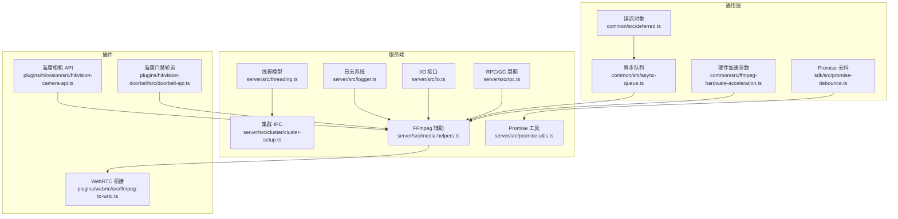
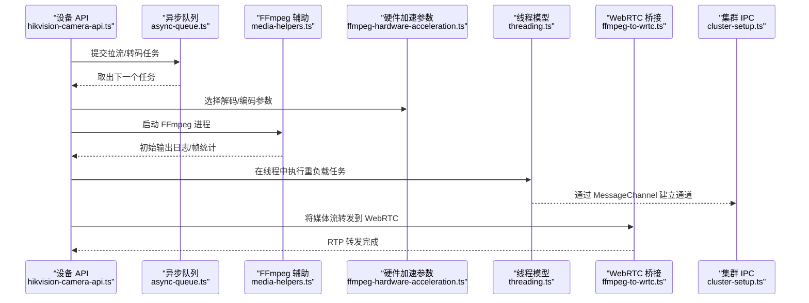
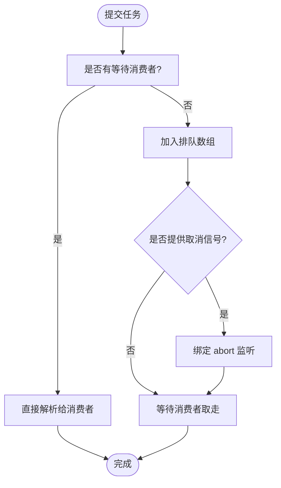
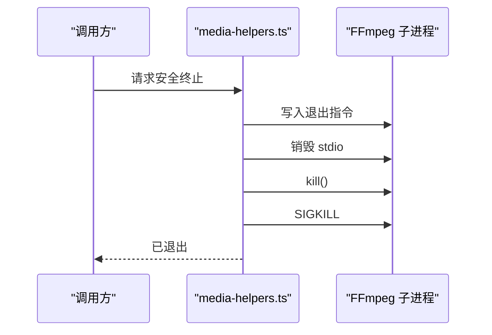
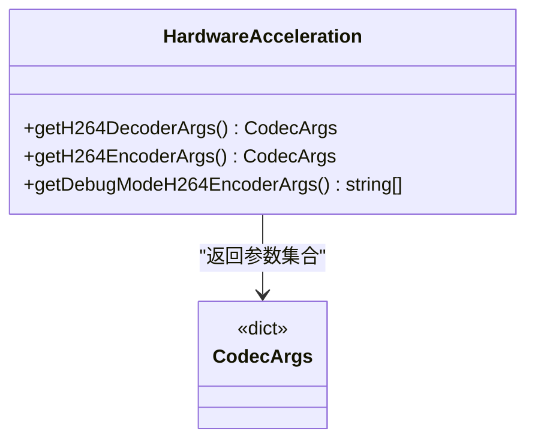
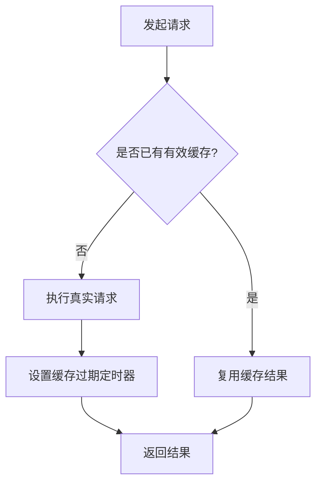
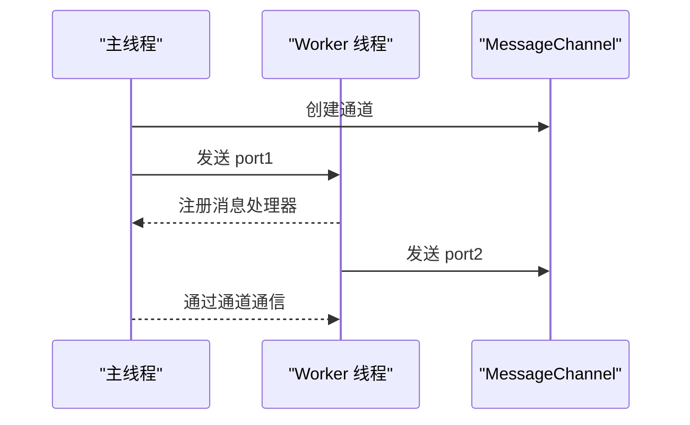
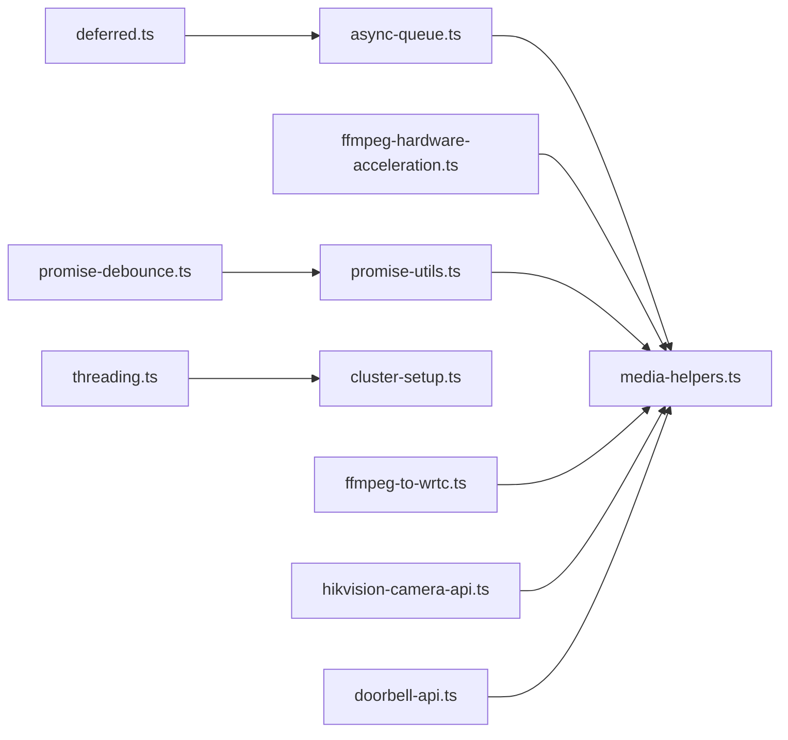

# 性能问题分析

<cite>
**本文引用的文件**
- [ffmpeg-hardware-acceleration.ts](file://common/src/ffmpeg-hardware-acceleration.ts)
- [media-helpers.ts](file://server/src/media-helpers.ts)
- [async-queue.ts](file://common/src/async-queue.ts)
- [deferred.ts](file://common/src/deferred.ts)
- [promise-utils.ts](file://server/src/promise-utils.ts)
- [promise-debounce.ts](file://sdk/src/promise-debounce.ts)
- [threading.ts](file://server/src/threading.ts)
- [logger.ts](file://server/src/logger.ts)
- [rpc.ts](file://server/src/rpc.ts)
- [io.ts](file://server/src/io.ts)
- [sleep.ts](file://common/src/sleep.ts)
- [cluster-setup.ts](file://server/src/cluster/cluster-setup.ts)
- [ffmpeg-to-wrtc.ts](file://plugins/webrtc/src/ffmpeg-to-wrtc.ts)
- [hikvision-camera-api.ts](file://plugins/hikvision/src/hikvision-camera-api.ts)
- [doorbell-api.ts](file://plugins/hikvision-doorbell/src/doorbell-api.ts)
</cite>

## 目录
1. [简介](#简介)
2. [项目结构](#项目结构)
3. [核心组件](#核心组件)
4. [架构总览](#架构总览)
5. [详细组件分析](#详细组件分析)
6. [依赖关系分析](#依赖关系分析)
7. [性能考量](#性能考量)
8. [故障排查指南](#故障排查指南)
9. [结论](#结论)
10. [附录](#附录)

## 简介
本指南面向 Scrypted 的性能问题分析与优化，覆盖系统资源监控、应用性能指标、瓶颈识别、媒体处理（FFmpeg）优化、硬件加速配置、并发与线程管理、I/O 性能、缓存与预加载策略、以及持续性能监控与基准测试最佳实践。文档以仓库中的实际代码为依据，结合可视化图示帮助读者快速定位问题并实施改进。

## 项目结构
Scrypted 采用多包/多插件结构，核心性能相关能力分布在以下模块：
- 媒体与硬件加速：common/src/ffmpeg-hardware-acceleration.ts
- FFmpeg 生命周期与日志：server/src/media-helpers.ts
- 并发与异步队列：common/src/async-queue.ts、common/src/deferred.ts
- Promise 缓存与去抖：server/src/promise-utils.ts、sdk/src/promise-debounce.ts
- 线程与 IPC：server/src/threading.ts、server/src/cluster/cluster-setup.ts
- 日志与告警：server/src/logger.ts
- RPC 与 GC 周期：server/src/rpc.ts
- I/O 抽象：server/src/io.ts
- 插件侧媒体桥接：plugins/webrtc/src/ffmpeg-to-wrtc.ts
- 设备 API 与轮询：plugins/hikvision/src/hikvision-camera-api.ts、plugins/hikvision-doorbell/src/doorbell-api.ts

图表来源
- [async-queue.ts:1-242](file://common/src/async-queue.ts#L1-L242)
- [deferred.ts:1-32](file://common/src/deferred.ts#L1-L32)
- [ffmpeg-hardware-acceleration.ts:1-147](file://common/src/ffmpeg-hardware-acceleration.ts#L1-L147)
- [promise-utils.ts:1-97](file://server/src/promise-utils.ts#L1-L97)
- [promise-debounce.ts:1-14](file://sdk/src/promise-debounce.ts#L1-L14)
- [threading.ts:1-100](file://server/src/threading.ts#L1-L100)
- [cluster-setup.ts:202-241](file://server/src/cluster/cluster-setup.ts#L202-L241)
- [media-helpers.ts:1-98](file://server/src/media-helpers.ts#L1-L98)
- [logger.ts:1-93](file://server/src/logger.ts#L1-L93)
- [io.ts:1-26](file://server/src/io.ts#L1-L26)
- [rpc.ts:1-53](file://server/src/rpc.ts#L1-L53)
- [ffmpeg-to-wrtc.ts:398-426](file://plugins/webrtc/src/ffmpeg-to-wrtc.ts#L398-L426)
- [hikvision-camera-api.ts:612-647](file://plugins/hikvision/src/hikvision-camera-api.ts#L612-L647)
- [doorbell-api.ts:901-1055](file://plugins/hikvision-doorbell/src/doorbell-api.ts#L901-L1055)

章节来源
- [ffmpeg-hardware-acceleration.ts:1-147](file://common/src/ffmpeg-hardware-acceleration.ts#L1-L147)
- [media-helpers.ts:1-98](file://server/src/media-helpers.ts#L1-L98)
- [async-queue.ts:1-242](file://common/src/async-queue.ts#L1-L242)
- [deferred.ts:1-32](file://common/src/deferred.ts#L1-L32)
- [promise-utils.ts:1-97](file://server/src/promise-utils.ts#L1-L97)
- [promise-debounce.ts:1-14](file://sdk/src/promise-debounce.ts#L1-L14)
- [threading.ts:1-100](file://server/src/threading.ts#L1-L100)
- [cluster-setup.ts:202-241](file://server/src/cluster/cluster-setup.ts#L202-L241)
- [logger.ts:1-93](file://server/src/logger.ts#L1-L93)
- [io.ts:1-26](file://server/src/io.ts#L1-L26)
- [rpc.ts:1-53](file://server/src/rpc.ts#L1-L53)
- [ffmpeg-to-wrtc.ts:398-426](file://plugins/webrtc/src/ffmpeg-to-wrtc.ts#L398-L426)
- [hikvision-camera-api.ts:612-647](file://plugins/hikvision/src/hikvision-camera-api.ts#L612-L647)
- [doorbell-api.ts:901-1055](file://plugins/hikvision-doorbell/src/doorbell-api.ts#L901-L1055)

## 核心组件
- 异步队列与延迟对象：用于串行化任务、避免并发竞争、支持取消信号，降低 CPU 争用与内存峰值。
- FFmpeg 辅助：安全终止、初始输出过滤、参数打印脱敏，便于诊断卡顿、崩溃与参数错误。
- 硬件加速参数：按平台自动选择解码/编码器，减少 CPU 占用，提升吞吐。
- Promise 工具：超时、单例缓存、去抖，避免重复计算与抖动。
- 线程与集群：基于 worker_threads 的线程封装与 IPC，支持跨线程任务与连接复用。
- 日志与告警：集中式日志收集与清理，辅助定位异常与热点路径。
- I/O 抽象：统一 socket 事件模型，便于观察背压与 drain。
- RPC/GC 周期：周期性触发全局 GC，缓解长生命周期对象泄漏。

章节来源
- [async-queue.ts:1-242](file://common/src/async-queue.ts#L1-L242)
- [deferred.ts:1-32](file://common/src/deferred.ts#L1-L32)
- [media-helpers.ts:1-98](file://server/src/media-helpers.ts#L1-L98)
- [ffmpeg-hardware-acceleration.ts:1-147](file://common/src/ffmpeg-hardware-acceleration.ts#L1-L147)
- [promise-utils.ts:1-97](file://server/src/promise-utils.ts#L1-L97)
- [threading.ts:1-100](file://server/src/threading.ts#L1-L100)
- [logger.ts:1-93](file://server/src/logger.ts#L1-L93)
- [io.ts:1-26](file://server/src/io.ts#L1-L26)
- [rpc.ts:1-53](file://server/src/rpc.ts#L1-L53)

## 架构总览
下图展示媒体处理与并发控制在系统中的交互路径，从设备 API 到 FFmpeg，再到 WebRTC 输出与集群 IPC。

图表来源
- [hikvision-camera-api.ts:612-647](file://plugins/hikvision/src/hikvision-camera-api.ts#L612-L647)
- [async-queue.ts:1-242](file://common/src/async-queue.ts#L1-L242)
- [ffmpeg-hardware-acceleration.ts:1-147](file://common/src/ffmpeg-hardware-acceleration.ts#L1-L147)
- [media-helpers.ts:1-98](file://server/src/media-helpers.ts#L1-L98)
- [threading.ts:1-100](file://server/src/threading.ts#L1-L100)
- [cluster-setup.ts:202-241](file://server/src/cluster/cluster-setup.ts#L202-L241)
- [ffmpeg-to-wrtc.ts:398-426](file://plugins/webrtc/src/ffmpeg-to-wrtc.ts#L398-L426)

## 详细组件分析

### 组件一：异步队列与并发控制
- 功能要点
  - 支持入队/出队、可选取消信号、迭代器消费、清空与结束。
  - 通过等待队列与排队数组实现 FIFO，避免无界增长导致内存膨胀。
  - 结合 AbortSignal 实现“快速失败”，降低无效工作堆积。
- 性能影响
  - 控制并发度，避免同时启动过多媒体处理进程。
  - 配合超时与去抖，防止抖动与重复计算。
- 典型用法
  - 将设备轮询、RTSP 拉流、FFmpeg 启动等放入队列，串行化执行。
  - 对高频变更（如分辨率、码率）进行去抖，合并请求。

图表来源
- [async-queue.ts:48-83](file://common/src/async-queue.ts#L48-L83)

章节来源
- [async-queue.ts:1-242](file://common/src/async-queue.ts#L1-L242)
- [deferred.ts:1-32](file://common/src/deferred.ts#L1-L32)

### 组件二：FFmpeg 生命周期与日志
- 功能要点
  - 安全终止：先写入退出指令，再销毁 stdio，最后强制 SIGKILL，确保外部协议（如 RTSP TEARDOWN）得到处理。
  - 初始输出过滤：仅在检测到帧或尺寸信息后才停止高频日志，降低 I/O 压力。
  - 参数脱敏：对输入 URL 中的凭据进行脱敏打印，避免泄露。
- 性能影响
  - 避免僵尸进程与句柄泄漏，降低资源占用。
  - 减少日志噪声，提高可观测性与诊断效率。
- 典型用法
  - 所有媒体子进程均通过该辅助函数管理生命周期。
  - 在调试阶段可启用“噪音模式”查看更多细节。

图表来源
- [media-helpers.ts:11-38](file://server/src/media-helpers.ts#L11-L38)

章节来源
- [media-helpers.ts:1-98](file://server/src/media-helpers.ts#L1-L98)

### 组件三：硬件加速参数与编码器选择
- 功能要点
  - 按平台返回可用的解码器与编码器参数集合，自动选择 CUDA/CUVID/VAAPI/QSV/VideoToolbox 等。
  - 提供调试模式编码参数（低延迟、简化像素格式），便于性能对比。
- 性能影响
  - 使用硬件加速显著降低 CPU 占用，提升并发处理能力。
  - 不当的编码器/像素格式会引发兼容性与性能问题。
- 典型用法
  - 在媒体会话初始化时根据设备能力与平台特性选择最优参数。
  - 与异步队列配合，避免同时开启多个高负载编码任务。

图表来源
- [ffmpeg-hardware-acceleration.ts:49-131](file://common/src/ffmpeg-hardware-acceleration.ts#L49-L131)

章节来源
- [ffmpeg-hardware-acceleration.ts:1-147](file://common/src/ffmpeg-hardware-acceleration.ts#L1-L147)

### 组件四：Promise 工具与缓存/去抖
- 功能要点
  - 单例 Promise：在缓存期内复用结果，避免重复请求。
  - 超时：对长时间未响应的任务进行中断，释放资源。
  - 去抖：合并高频请求，减少重复计算。
- 性能影响
  - 显著降低重复 I/O 与计算开销，改善响应曲线。
  - 与异步队列结合，形成“请求合并 + 串行化”的双重优化。
- 典型用法
  - 设备状态查询、配置读取、API 轮询等场景。

图表来源
- [promise-utils.ts:6-22](file://server/src/promise-utils.ts#L6-L22)
- [promise-debounce.ts:1-14](file://sdk/src/promise-debounce.ts#L1-L14)

章节来源
- [promise-utils.ts:1-97](file://server/src/promise-utils.ts#L1-L97)
- [promise-debounce.ts:1-14](file://sdk/src/promise-debounce.ts#L1-L14)

### 组件五：线程与集群 IPC
- 功能要点
  - 基于 worker_threads 的新线程封装，支持模块注入与参数传递。
  - 集群内通过 MessageChannel 建立跨线程连接，避免主线程阻塞。
- 性能影响
  - 将重负载任务迁移至独立线程，提升吞吐与稳定性。
  - IPC 建立需同步协调，避免重复连接与死锁。
- 典型用法
  - 多路媒体转码、复杂图像处理、外部协议桥接等。

图表来源
- [threading.ts:68-99](file://server/src/threading.ts#L68-L99)
- [cluster-setup.ts:202-241](file://server/src/cluster/cluster-setup.ts#L202-L241)

章节来源
- [threading.ts:1-100](file://server/src/threading.ts#L1-L100)
- [cluster-setup.ts:202-241](file://server/src/cluster/cluster-setup.ts#L202-L241)

### 组件六：日志与 I/O 观测
- 功能要点
  - 集中式日志收集与清理，支持按时间窗口裁剪。
  - I/O 抽象定义了连接、消息、错误、drain 等事件，便于观测背压。
- 性能影响
  - 合理的日志级别与裁剪策略可降低磁盘与内存压力。
  - 通过 drain 事件可及时发现下游拥塞。
- 典型用法
  - 在媒体处理关键节点打点，记录耗时与缓冲状态。

章节来源
- [logger.ts:1-93](file://server/src/logger.ts#L1-L93)
- [io.ts:1-26](file://server/src/io.ts#L1-L26)

### 组件七：RPC 与垃圾回收
- 功能要点
  - 周期性检查远程对象创建/回收计数，必要时触发全局 GC。
- 性能影响
  - 防止长生命周期对象累积导致内存膨胀。
- 典型用法
  - 在长时间运行的服务中启用周期 GC。

章节来源
- [rpc.ts:1-53](file://server/src/rpc.ts#L1-L53)

### 组件八：媒体桥接与参数选择（WebRTC）
- 功能要点
  - 根据输入的音视频选项动态选择 RTP 轨道，启动转发进程。
  - 高级档位包含多种 Profile 与编码参数组合，适配不同设备能力。
- 性能影响
  - 合理选择编码器与参数可显著降低 CPU 与带宽占用。
- 典型用法
  - 在设备能力探测后，选择最合适的编码参数集。

章节来源
- [ffmpeg-to-wrtc.ts:398-426](file://plugins/webrtc/src/ffmpeg-to-wrtc.ts#L398-L426)

### 组件九：设备轮询与并发保护
- 功能要点
  - 海康门禁轮询方法通过标志位避免并发执行，失败时可重试一次。
  - 海康相机 API 提供报警能力查询与设置，XML 解析与转换。
- 性能影响
  - 轮询间隔与并发保护可避免设备过载与网络拥塞。
- 典型用法
  - 将轮询频率与超时参数化，结合去抖与缓存。

章节来源
- [doorbell-api.ts:901-1055](file://plugins/hikvision-doorbell/src/doorbell-api.ts#L901-L1055)
- [hikvision-camera-api.ts:612-647](file://plugins/hikvision/src/hikvision-camera-api.ts#L612-L647)

## 依赖关系分析
- 组件耦合
  - 异步队列与延迟对象紧密协作，前者负责调度，后者负责单次解析。
  - FFmpeg 辅助贯穿媒体处理链路，被设备 API、WebRTC 桥接广泛依赖。
  - 硬件加速参数为 FFmpeg 提供平台化优化入口。
  - Promise 工具与去抖为高频操作提供缓存与合并能力。
  - 线程与集群 IPC 为重负载任务提供隔离与扩展。
- 外部依赖
  - worker_threads、child_process、engine.io 等原生模块直接影响性能与稳定性。
- 循环依赖
  - 当前文件间未见明显循环导入；若新增桥接模块需谨慎引入反向依赖。

图表来源
- [async-queue.ts:1-242](file://common/src/async-queue.ts#L1-L242)
- [deferred.ts:1-32](file://common/src/deferred.ts#L1-L32)
- [media-helpers.ts:1-98](file://server/src/media-helpers.ts#L1-L98)
- [ffmpeg-hardware-acceleration.ts:1-147](file://common/src/ffmpeg-hardware-acceleration.ts#L1-L147)
- [promise-utils.ts:1-97](file://server/src/promise-utils.ts#L1-L97)
- [promise-debounce.ts:1-14](file://sdk/src/promise-debounce.ts#L1-L14)
- [threading.ts:1-100](file://server/src/threading.ts#L1-L100)
- [cluster-setup.ts:202-241](file://server/src/cluster/cluster-setup.ts#L202-L241)
- [ffmpeg-to-wrtc.ts:398-426](file://plugins/webrtc/src/ffmpeg-to-wrtc.ts#L398-L426)
- [hikvision-camera-api.ts:612-647](file://plugins/hikvision/src/hikvision-camera-api.ts#L612-L647)
- [doorbell-api.ts:901-1055](file://plugins/hikvision-doorbell/src/doorbell-api.ts#L901-L1055)

## 性能考量
- 系统资源监控
  - 使用进程级 CPU/内存/IO 监控工具（如 top、htop、iotop、pidstat）结合容器监控（如 cAdvisor/Prometheus）观察整体负载。
  - 结合日志系统的日志量裁剪与 I/O 事件监听，定位异常抖动。
- 应用性能指标
  - 关键指标：FFmpeg 启动耗时、帧率、丢帧率、队列长度、线程池饱和度、RPC 对象创建/回收速率。
  - 通过日志打点与 I/O drain 事件评估背压与缓冲水位。
- 瓶颈识别
  - CPU 瓶颈：优先启用硬件加速参数，减少软件编码；检查线程池与队列长度。
  - I/O 瓶颈：关注磁盘与网络 I/O，结合 FFmpeg 初始输出过滤减少日志压力。
  - 内存瓶颈：启用周期 GC，检查长生命周期对象与未释放的句柄。
- 媒体处理优化
  - 选择合适解码/编码器，避免不兼容的像素格式与 Profile。
  - 合理设置码率、分辨率与 GOP，降低瞬时负载。
- 并发与线程
  - 使用异步队列串行化高成本任务，结合去抖与缓存合并请求。
  - 通过线程隔离重负载任务，避免主线程阻塞。
- I/O 优化
  - 通过 I/O 事件模型观察 drain，及时限速或分片发送。
  - 对频繁的设备轮询设置合理的超时与重试策略。
- 缓存与预加载
  - 使用单例 Promise 与去抖合并高频请求，提升缓存命中率。
  - 对设备能力与配置进行预热缓存，减少冷启动开销。

[本节为通用指导，无需特定文件来源]

## 故障排查指南
- FFmpeg 卡顿/崩溃
  - 使用安全终止流程，确保外部协议正确断开。
  - 开启初始输出过滤，聚焦关键日志，避免噪声干扰。
  - 对输入 URL 参数进行脱敏打印，便于问题复现。
- 线程与 IPC 死锁
  - 检查 MessageChannel 建立顺序与去重逻辑，避免重复连接。
  - 确保线程退出时关闭端口，避免悬挂引用。
- 资源泄漏
  - 启用周期 GC，观察远程对象创建/回收计数。
  - 检查异步队列是否正确结束，避免挂起的 Deferred。
- I/O 背压
  - 监听 drain 事件，必要时降低发送速率或增加缓冲。
  - 对频繁轮询的设备设置超时与重试，避免阻塞主流程。
- 设备轮询冲突
  - 使用并发保护标志位，避免重复轮询。
  - 对失败场景进行一次性重试，避免无限重试导致资源耗尽。

章节来源
- [media-helpers.ts:11-38](file://server/src/media-helpers.ts#L11-L38)
- [cluster-setup.ts:202-241](file://server/src/cluster/cluster-setup.ts#L202-L241)
- [rpc.ts:1-53](file://server/src/rpc.ts#L1-L53)
- [async-queue.ts:85-95](file://common/src/async-queue.ts#L85-L95)
- [io.ts:1-26](file://server/src/io.ts#L1-L26)
- [doorbell-api.ts:992-1042](file://plugins/hikvision-doorbell/src/doorbell-api.ts#L992-L1042)

## 结论
通过对异步队列、FFmpeg 生命周期、硬件加速、Promise 工具、线程与 IPC、日志与 I/O、RPC/GC 等关键组件的系统化分析，可以构建一套完整的性能问题诊断与优化体系。建议在生产环境中：
- 默认启用硬件加速与缓存去抖；
- 使用异步队列串行化高成本任务；
- 通过日志与 I/O 事件观测背压；
- 启用周期 GC 与线程隔离；
- 对设备轮询与外部 API 调用设置超时与重试。

[本节为总结，无需特定文件来源]

## 附录
- 性能基准测试建议
  - 媒体处理：固定分辨率/码率/帧率，测量 CPU 占用、内存峰值、丢帧率、启动时间。
  - 并发场景：逐步增加并发任务数，记录队列长度、线程饱和度、响应时间。
  - I/O 场景：模拟磁盘与网络压力，观察 drain 与缓冲变化。
- 持续性能监控最佳实践
  - 将关键指标接入监控系统，设置阈值告警。
  - 定期进行回归测试，确保升级不会引入性能退化。
  - 对热点路径打点，建立性能基线与回归报告。

[本节为通用指导，无需特定文件来源]