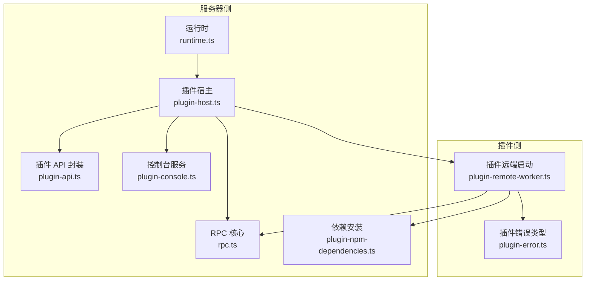
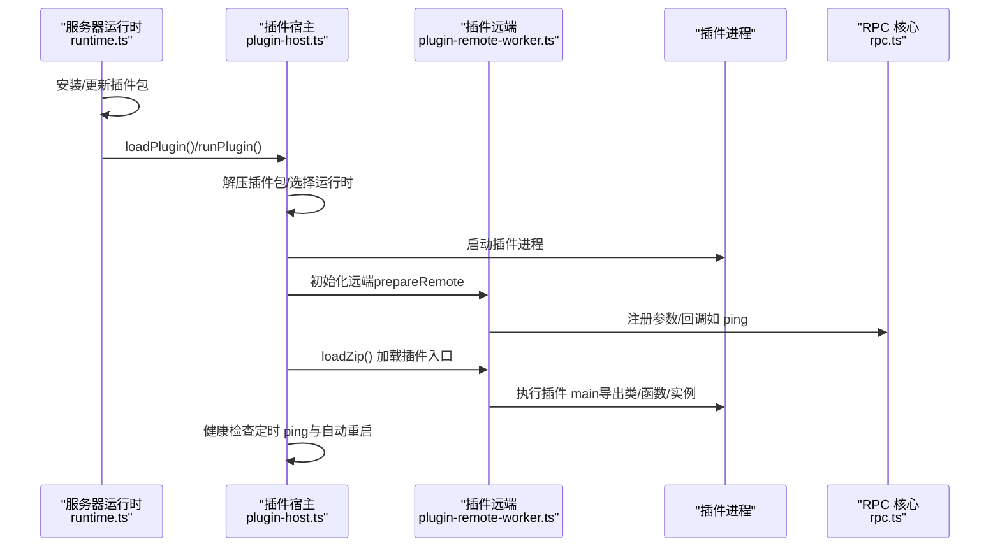
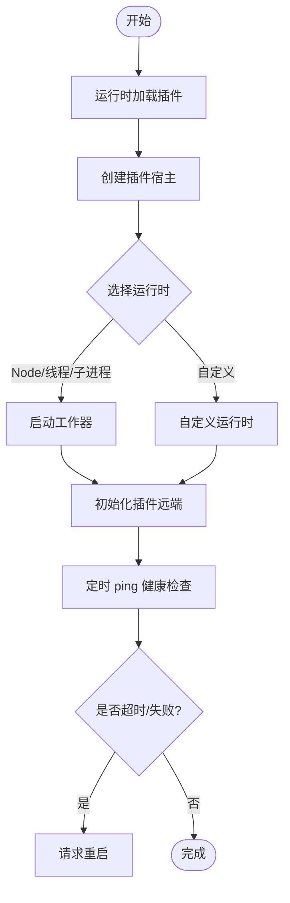
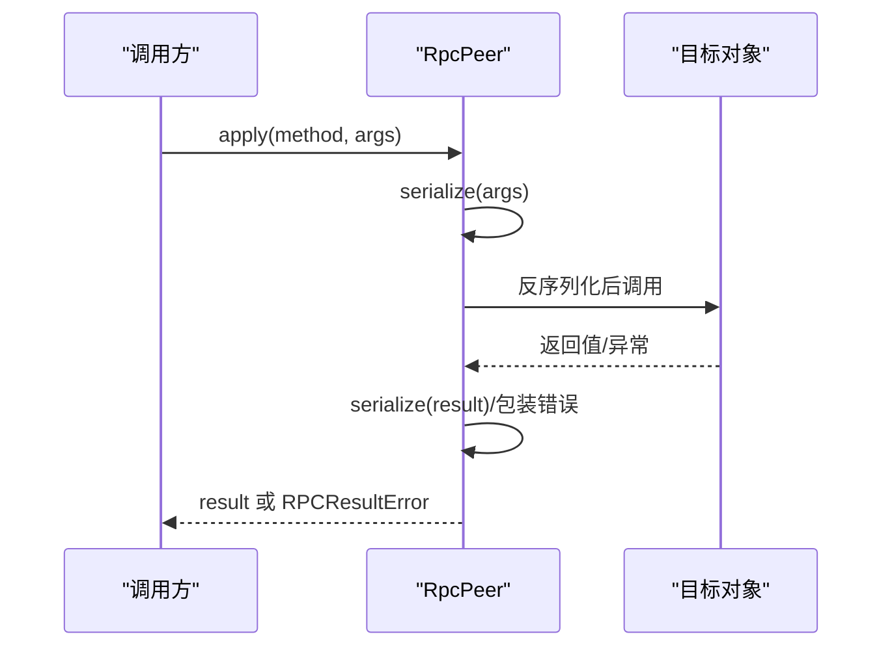
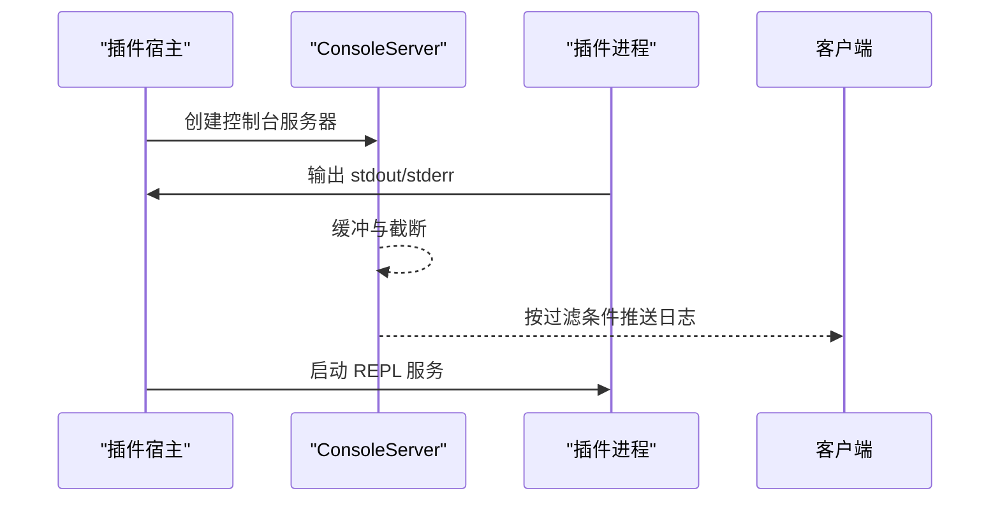
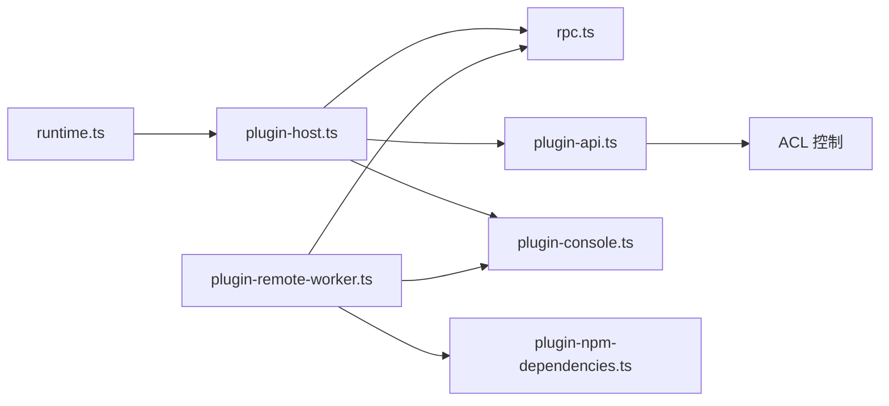

# 插件问题排查

<cite>
**本文引用的文件**
- [runtime.ts](file://server/src/runtime.ts)
- [plugin-host.ts](file://server/src/plugin/plugin-host.ts)
- [plugin-remote-worker.ts](file://server/src/plugin/plugin-remote-worker.ts)
- [plugin-api.ts](file://server/src/plugin/plugin-api.ts)
- [rpc.ts](file://server/src/rpc.ts)
- [plugin-npm-dependencies.ts](file://server/src/plugin/plugin-npm-dependencies.ts)
- [plugin-console.ts](file://server/src/plugin/plugin-console.ts)
- [plugin-error.ts](file://server/src/plugin/plugin-error.ts)
- [plugin-device.ts](file://server/src/plugin/plugin-device.ts)
- [plugin-pip.py](file://server/python/plugin_pip.py)
- [diagnostics/README.md](file://plugins/diagnostics/README.md)
- [scrypted-server-main.ts](file://server/src/scrypted-server-main.ts)
</cite>

## 目录
1. [简介](#简介)
2. [项目结构](#项目结构)
3. [核心组件](#核心组件)
4. [架构总览](#架构总览)
5. [详细组件分析](#详细组件分析)
6. [依赖关系分析](#依赖关系分析)
7. [性能考量](#性能考量)
8. [故障排查指南](#故障排查指南)
9. [结论](#结论)
10. [附录](#附录)

## 简介
本指南面向 Scrypted 插件开发者与运维人员，聚焦于插件在安装、加载、运行、通信、配置与性能等方面的常见问题与系统化排查方法。内容覆盖：
- 插件加载失败：依赖检查、版本兼容、权限与环境变量、运行时选择
- 插件 API 调用错误：接口签名与参数校验、返回值处理、ACL 控制
- 崩溃与异常：堆栈跟踪、未捕获异常、源码映射、日志定位
- 插件间通信：RPC 序列化、参数获取、超时与健康检查
- 配置与设置：配置文件校验、默认值、存储一致性
- 性能问题：执行时间、内存与 GC、并发与队列
- 开发调试：断点、REPL、控制台、自动重启策略

## 项目结构
Scrypted 的插件系统由“服务器运行时”和“插件宿主”两部分组成：
- 服务器运行时负责插件生命周期管理、设备代理、HTTP/WebSocket/Engine.IO 接入、RPC 通道与序列化、日志与告警、集群与健康检查。
- 插件宿主负责启动插件进程（Node/线程/子进程/自定义运行时）、解压与准备插件包、建立 RPC 远端、注入 API、处理控制台输出与 REPL。

图示来源
- [runtime.ts:620-760](file://server/src/runtime.ts#L620-L760)
- [plugin-host.ts:122-224](file://server/src/plugin/plugin-host.ts#L122-L224)
- [plugin-remote-worker.ts:41-120](file://server/src/plugin/plugin-remote-worker.ts#L41-L120)
- [rpc.ts:285-456](file://server/src/rpc.ts#L285-L456)
- [plugin-api.ts:15-81](file://server/src/plugin/plugin-api.ts#L15-L81)
- [plugin-console.ts:181-331](file://server/src/plugin/plugin-console.ts#L181-L331)
- [plugin-npm-dependencies.ts:45-122](file://server/src/plugin/plugin-npm-dependencies.ts#L45-L122)

章节来源
- [runtime.ts:620-760](file://server/src/runtime.ts#L620-L760)
- [plugin-host.ts:122-224](file://server/src/plugin/plugin-host.ts#L122-L224)

## 核心组件
- 运行时（ScryptedRuntime）
  - 负责插件安装、加载、重启、设备代理失效与混入重建、HTTP/WebSocket/Engine.IO 入口、日志与告警、集群对象转发。
- 插件宿主（PluginHost）
  - 解压插件包、选择运行时（Node/线程/子进程/自定义）、建立 RPC Peer、初始化远端、健康检查与自动重启、IO/WebSocket 处理。
- 插件远端（startPluginRemote）
  - 在插件进程中安装可选原生依赖、准备模块路径、注册源码映射、创建 REPL、fork 子工作器、暴露服务端口。
- RPC 核心（RpcPeer/RPCResultError）
  - 提供跨进程/线程的代理调用、序列化/反序列化、错误包装、参数获取、异步迭代器支持。
- 插件 API 封装（PluginAPIProxy）
  - 对外提供设备状态变更、事件监听、媒体管理、组件访问、重启请求、接口描述符更新；并内置 ACL 拦截。
- 控制台（ConsoleServer）
  - 将插件 stdout/stderr 通过网络转发到服务器，支持按设备/混入过滤与缓冲截断。
- 依赖安装（installOptionalDependencies）
  - 基于 ABI/平台/架构生成 node-pre-gyp 目录，仅安装 optionalDependencies 并清理旧目录。

章节来源
- [runtime.ts:620-760](file://server/src/runtime.ts#L620-L760)
- [plugin-host.ts:122-224](file://server/src/plugin/plugin-host.ts#L122-L224)
- [plugin-remote-worker.ts:111-210](file://server/src/plugin/plugin-remote-worker.ts#L111-L210)
- [rpc.ts:285-456](file://server/src/rpc.ts#L285-L456)
- [plugin-api.ts:71-158](file://server/src/plugin/plugin-api.ts#L71-L158)
- [plugin-console.ts:181-331](file://server/src/plugin/plugin-console.ts#L181-L331)
- [plugin-npm-dependencies.ts:45-122](file://server/src/plugin/plugin-npm-dependencies.ts#L45-L122)

## 架构总览
下图展示一次典型的插件加载流程：服务器下载/解析插件包 → 创建插件宿主 → 启动插件进程 → 初始化远端 → 注册设备/事件 → 建立健康检查与自动重启。

图示来源
- [runtime.ts:691-720](file://server/src/runtime.ts#L691-L720)
- [plugin-host.ts:276-328](file://server/src/plugin/plugin-host.ts#L276-L328)
- [plugin-remote-worker.ts:111-210](file://server/src/plugin/plugin-remote-worker.ts#L111-L210)
- [rpc.ts:476-486](file://server/src/rpc.ts#L476-L486)

章节来源
- [runtime.ts:691-720](file://server/src/runtime.ts#L691-L720)
- [plugin-host.ts:276-328](file://server/src/plugin/plugin-host.ts#L276-L328)

## 详细组件分析

### 组件一：插件加载与健康检查
- 关键点
  - 运行时负责卸载旧宿主、失效设备代理、创建新宿主并注册自动重启。
  - 插件宿主选择运行时（Node/线程/子进程/自定义），建立 RPC Peer，并启动健康检查（每 30 秒 ping，超过 60 秒无响应则请求重启）。
  - 插件远端在插件进程内安装可选原生依赖、注册源码映射、创建 REPL，确保异常堆栈可读。
- 常见问题定位
  - “插件未启动/卡住”：查看健康检查日志与自动重启触发记录。
  - “运行时不支持”：抛出 UnsupportedRuntimeError，需检查 package.json 的 runtime 字段。
  - “依赖安装失败”：查看 optionalDependencies 安装日志与退出码。

图示来源
- [runtime.ts:691-720](file://server/src/runtime.ts#L691-L720)
- [plugin-host.ts:330-463](file://server/src/plugin/plugin-host.ts#L330-L463)
- [plugin-remote-worker.ts:111-210](file://server/src/plugin/plugin-remote-worker.ts#L111-L210)

章节来源
- [runtime.ts:691-720](file://server/src/runtime.ts#L691-L720)
- [plugin-host.ts:330-463](file://server/src/plugin/plugin-host.ts#L330-L463)

### 组件二：RPC 调用与序列化
- 关键点
  - RpcPeer 提供代理调用、参数序列化/反序列化、错误包装（RPCResultError）、参数获取（getParam）、异步迭代器支持。
  - 插件 API 封装（PluginAPIProxy）对设备事件、状态变更、组件访问进行 ACL 拦截与统一管理。
- 常见问题定位
  - “接口签名不匹配”：检查目标对象是否存在对应方法或属性。
  - “参数无法序列化”：关注 RpcPeer.isTransportSafe 与自定义序列化器。
  - “错误未正确传播”：确认 createErrorResult 与 deserializeError 的使用。

图示来源
- [rpc.ts:152-220](file://server/src/rpc.ts#L152-L220)
- [rpc.ts:476-513](file://server/src/rpc.ts#L476-L513)
- [plugin-api.ts:71-158](file://server/src/plugin/plugin-api.ts#L71-L158)

章节来源
- [rpc.ts:152-220](file://server/src/rpc.ts#L152-L220)
- [rpc.ts:476-513](file://server/src/rpc.ts#L476-L513)
- [plugin-api.ts:71-158](file://server/src/plugin/plugin-api.ts#L71-L158)

### 组件三：控制台与调试
- 关键点
  - ConsoleServer 将插件 stdout/stderr 通过网络转发，支持按设备/混入过滤与缓冲截断。
  - 插件远端在启动后注册源码映射，捕获未处理异常与拒绝，写入日志。
  - 支持 REPL 服务端口，便于开发调试。
- 常见问题定位
  - “看不到插件日志”：检查 ConsoleServer 是否成功连接、端口是否可达。
  - “堆栈不可读”：确认源码映射已安装且存在 .map 文件。
  - “REPL 不可用”：确认插件已加载并返回 REPL 端口。

图示来源
- [plugin-console.ts:181-331](file://server/src/plugin/plugin-console.ts#L181-L331)
- [plugin-remote-worker.ts:175-207](file://server/src/plugin/plugin-remote-worker.ts#L175-L207)

章节来源
- [plugin-console.ts:181-331](file://server/src/plugin/plugin-console.ts#L181-L331)
- [plugin-remote-worker.ts:175-207](file://server/src/plugin/plugin-remote-worker.ts#L175-L207)

### 组件四：依赖与运行时
- 关键点
  - installOptionalDependencies 基于 ABI/平台/架构生成 node-pre-gyp 目录，仅安装 optionalDependencies 并清理旧目录。
  - Python 依赖安装脚本会移除旧目录以避免冲突。
  - 运行时选择逻辑来自 package.json 的 scrypted.runtime 或自定义运行时标记。
- 常见问题定位
  - “原生模块编译失败”：检查平台/ABI/Electron 版本匹配与 npm 配置。
  - “Python 依赖未生效”：确认 .installed.txt 与当前 requirements 是否一致。

章节来源
- [plugin-npm-dependencies.ts:45-122](file://server/src/plugin/plugin-npm-dependencies.ts#L45-L122)
- [plugin-pip.py:26-43](file://server/python/plugin_pip.py#L26-L43)
- [plugin-host.ts:330-360](file://server/src/plugin/plugin-host.ts#L330-L360)

## 依赖关系分析
- 运行时依赖插件宿主与 RPC 核心，负责设备代理与 HTTP/WebSocket 入口。
- 插件宿主依赖运行时提供的环境变量与卷目录，负责运行时选择与健康检查。
- 插件远端依赖 RPC 核心与控制台服务，负责模块加载、REPL 与源码映射。
- 插件 API 封装依赖 ACL 控制，统一对外接口。

图示来源
- [runtime.ts:620-760](file://server/src/runtime.ts#L620-L760)
- [plugin-host.ts:122-224](file://server/src/plugin/plugin-host.ts#L122-L224)
- [rpc.ts:285-456](file://server/src/rpc.ts#L285-L456)
- [plugin-api.ts:71-158](file://server/src/plugin/plugin-api.ts#L71-L158)
- [plugin-console.ts:181-331](file://server/src/plugin/plugin-console.ts#L181-L331)
- [plugin-npm-dependencies.ts:45-122](file://server/src/plugin/plugin-npm-dependencies.ts#L45-L122)

章节来源
- [runtime.ts:620-760](file://server/src/runtime.ts#L620-L760)
- [plugin-host.ts:122-224](file://server/src/plugin/plugin-host.ts#L122-L224)

## 性能考量
- 执行时间监控
  - 使用服务器侧日志与插件控制台输出，结合 RPC 调用耗时统计（pendingResults 计数）。
- 内存与 GC
  - 启用周期性垃圾回收（startPeriodicGarbageCollection），观察远程代理数量与 pending 结果。
- 并发与队列
  - 使用 Promise 工具（singletonPromise、timeoutPromise、createPromiseDebouncer）降低重复请求与超时风险。
- 资源使用
  - 通过 ConsoleServer 缓冲与截断避免日志风暴；合理设置 maxHttpBufferSize 与 ping 超时。

章节来源
- [rpc.ts:1-27](file://server/src/rpc.ts#L1-L27)
- [promise-utils.ts:1-96](file://server/src/promise-utils.ts#L1-L96)
- [plugin-host.ts:45-58](file://server/src/plugin/plugin-host.ts#L45-L58)

## 故障排查指南

### 一、插件加载失败
- 依赖检查
  - 查看 optionalDependencies 安装日志与退出码；确认平台/ABI/Electron 匹配。
  - 清理旧依赖目录，避免冲突。
- 版本兼容
  - 确认 package.json 中 runtime 与 scrypted.runtime 设置；若为自定义运行时，确保标签匹配。
  - 核对最小核心版本要求与 @scrypted/core 安装情况。
- 权限与环境
  - 检查插件卷目录权限与磁盘空间；确认 npm/exec 环境变量。
- 运行时选择
  - 若抛出 UnsupportedRuntimeError，修改 package.json 或更换运行时。

章节来源
- [plugin-npm-dependencies.ts:45-122](file://server/src/plugin/plugin-npm-dependencies.ts#L45-L122)
- [plugin-pip.py:26-43](file://server/python/plugin_pip.py#L26-L43)
- [runtime.ts:226-246](file://server/src/runtime.ts#L226-L246)
- [plugin-host.ts:330-360](file://server/src/plugin/plugin-host.ts#L330-L360)

### 二、插件 API 调用错误
- 接口签名验证
  - 确认目标对象存在对应方法；检查 RpcPeer.getIteratorNext 与 asyncIterator 行为。
- 参数检查
  - 使用 RpcPeer.isTransportSafe 判断参数是否可直接传输；必要时实现自定义序列化器。
- 返回值处理
  - 捕获 RPCResultError 并解析堆栈；检查 createErrorResult 与 deserializeError。
- ACL 控制
  - PluginAPIProxy 会在受控场景拒绝事件/设备访问，检查 ACL 配置。

章节来源
- [rpc.ts:152-220](file://server/src/rpc.ts#L152-L220)
- [rpc.ts:476-513](file://server/src/rpc.ts#L476-L513)
- [plugin-api.ts:71-158](file://server/src/plugin/plugin-api.ts#L71-L158)

### 三、插件崩溃与异常
- 堆栈跟踪分析
  - 插件远端安装 source-map-support，确保异常包含源码映射；查看未捕获异常与未处理拒绝日志。
- 异常捕获
  - 检查 process.removeAllListeners 后的异常捕获与日志上报。
- 错误日志解读
  - 使用 ConsoleServer 与服务器日志交叉比对；关注“plugin failed to start/loaded”、“uncaughtException/unhandledRejection”。

章节来源
- [plugin-remote-worker.ts:175-207](file://server/src/plugin/plugin-remote-worker.ts#L175-L207)
- [plugin-console.ts:181-331](file://server/src/plugin/plugin-console.ts#L181-L331)

### 四、插件间通信问题
- RPC 调用失败
  - 检查 RpcPeer.kill 状态与 pendingResults 冻结；确认 oneway 方法与异步迭代器行为。
- 消息序列化错误
  - 关注 serializeError 与 deserializeError；排查自定义构造名与序列化器映射。
- 连接超时
  - 健康检查（ping）超时触发自动重启；调整 ping 超时与心跳间隔。

章节来源
- [rpc.ts:439-456](file://server/src/rpc.ts#L439-L456)
- [rpc.ts:548-568](file://server/src/rpc.ts#L548-L568)
- [plugin-host.ts:276-328](file://server/src/plugin/plugin-host.ts#L276-L328)

### 五、插件配置与设置问题
- 配置文件验证
  - 检查 README.md 是否存在于插件包中；若存在则自动添加 Readme 接口。
- 参数校验
  - 使用 PluginDevice 代理的 getPluginJson 与 getState 获取接口/属性；核对 providedInterfaces。
- 默认值检查
  - 通过 stateManager.refresh 触发刷新；核对 providedName/room/type 默认推断。

章节来源
- [runtime.ts:620-642](file://server/src/runtime.ts#L620-L642)
- [plugin-device.ts:440-470](file://server/src/plugin/plugin-device.ts#L440-L470)

### 六、插件性能问题
- 执行时间监控
  - 通过日志与控制台输出评估关键路径耗时；使用 timeoutPromise 限制操作。
- 资源使用分析
  - 观察远程代理数量与 pending 结果计数；启用周期性 GC。
- 并发处理能力
  - 使用 Promise 工具减少重复请求；合理设置缓冲与超时。

章节来源
- [rpc.ts:1-27](file://server/src/rpc.ts#L1-L27)
- [promise-utils.ts:1-96](file://server/src/promise-utils.ts#L1-L96)
- [plugin-host.ts:45-58](file://server/src/plugin/plugin-host.ts#L45-L58)

### 七、开发调试技巧与快速修复
- 断点与调试
  - 通过 /web/component/script/debug 触发等待调试会话；设置 inspect 端口。
- REPL
  - 确认插件远端创建 REPL 服务端口；在插件加载后可用。
- 快速修复清单
  - 重新安装 optionalDependencies；清理旧依赖目录；
  - 检查 package.json runtime 与标签；
  - 触发自动重启（requestRestart）；
  - 核对 ACL 与接口描述符。

章节来源
- [scrypted-server-main.ts:497-520](file://server/src/scrypted-server-main.ts#L497-L520)
- [plugin-remote-worker.ts:420-424](file://server/src/plugin/plugin-remote-worker.ts#L420-L424)
- [plugin-host.ts:330-463](file://server/src/plugin/plugin-host.ts#L330-L463)

## 结论
通过对插件加载、RPC 通信、控制台与调试、依赖与运行时、配置与性能等维度的系统化梳理，可以高效定位并解决大多数插件问题。建议在日常维护中：
- 建立标准化的日志与控制台输出规范；
- 使用健康检查与自动重启机制；
- 在开发阶段充分利用 REPL 与源码映射；
- 对关键路径进行超时与重试策略设计。

## 附录
- 诊断插件：可参考诊断插件的说明，用于系统与设备诊断。
- 常用工具
  - ConsoleServer：日志查看与过滤
  - RPCResultError：错误传播与解析
  - Promise 工具：超时、去抖、单例

章节来源
- [diagnostics/README.md:1-3](file://plugins/diagnostics/README.md#L1-L3)
- [plugin-console.ts:181-331](file://server/src/plugin/plugin-console.ts#L181-L331)
- [rpc.ts:229-240](file://server/src/rpc.ts#L229-L240)
- [promise-utils.ts:1-96](file://server/src/promise-utils.ts#L1-L96)