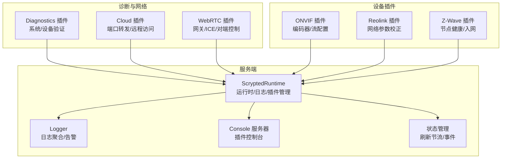
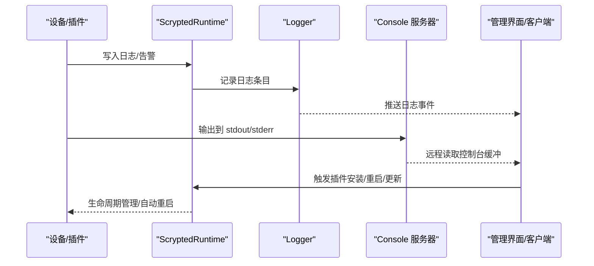
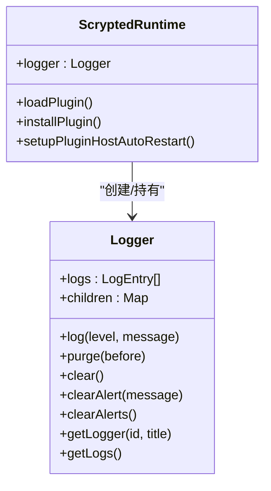
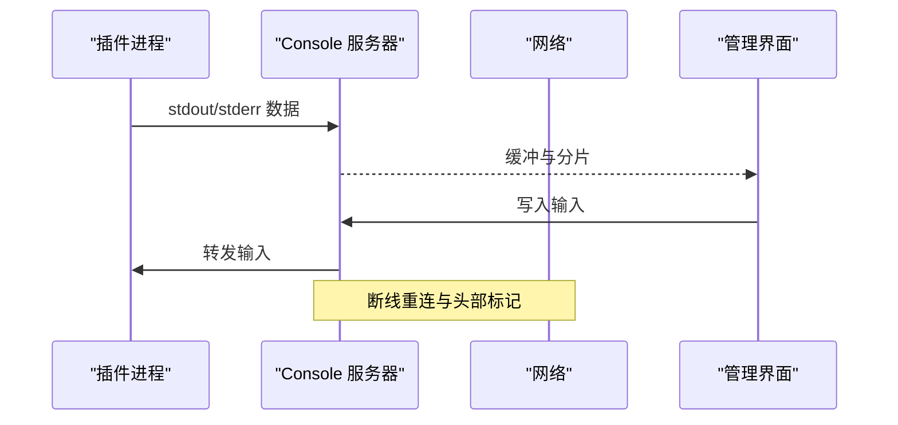
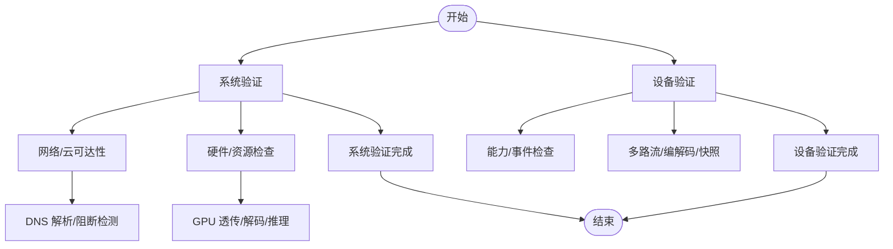
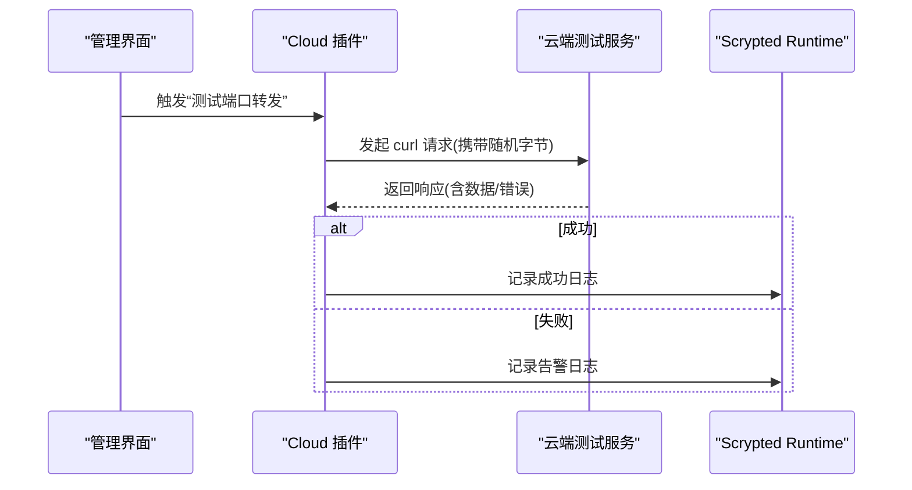
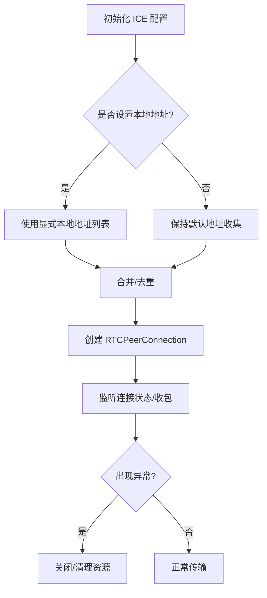
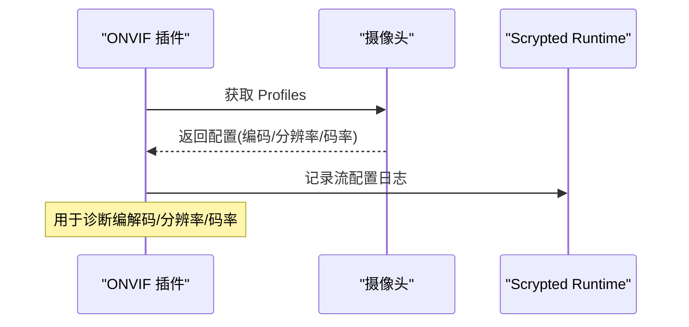
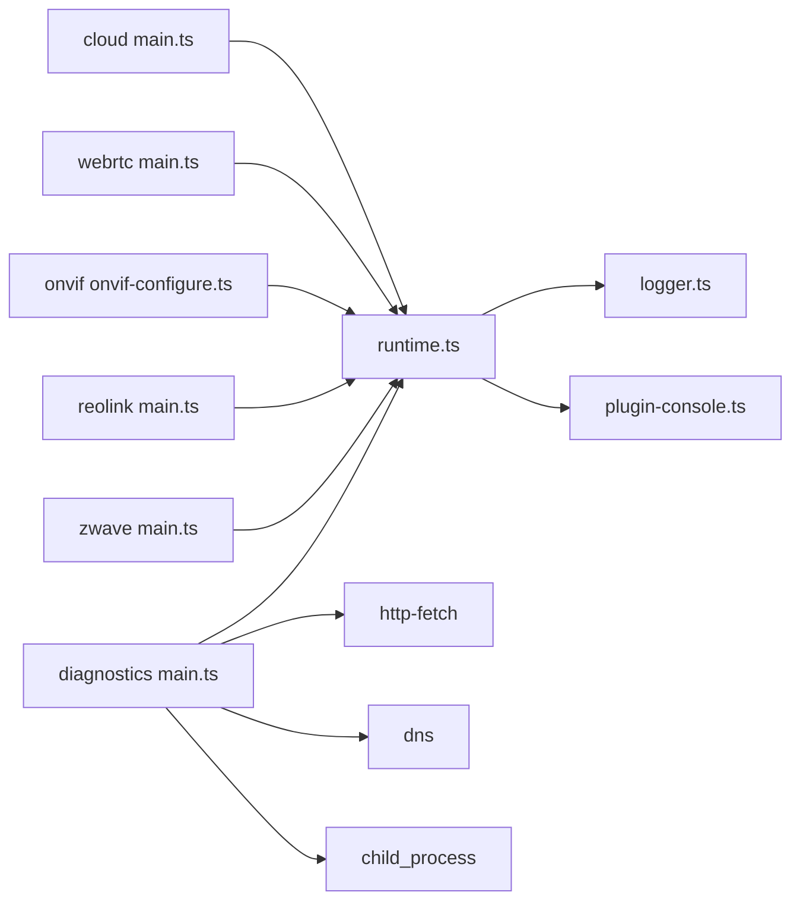

# 故障排除指南

<cite>
**本文引用的文件**   
- [README.md](file://README.md)
- [logger.ts](file://server/src/logger.ts)
- [runtime.ts](file://server/src/runtime.ts)
- [plugin-console.ts](file://server/src/plugin/plugin-console.ts)
- [device.ts](file://server/src/plugin/device.ts)
- [main.ts（诊断插件）](file://plugins/diagnostics/src/main.ts)
- [README.md（云插件）](file://plugins/cloud/README.md)
- [main.ts（云插件）](file://plugins/cloud/src/main.ts)
- [main.ts（WebRTC 插件）](file://plugins/webrtc/src/main.ts)
- [main.ts（Reolink 插件）](file://plugins/reolink/src/main.ts)
- [main.ts（Z-Wave 插件）](file://plugins/zwave/src/main.ts)
- [onvif-configure.ts](file://plugins/onvif/src/onvif-configure.ts)
- [wrtc-to-rtsp.ts](file://plugins/webrtc/src/wrtc-to-rtsp.ts)
- [state.ts](file://server/src/state.ts)
</cite>

## 目录
1. [简介](#简介)
2. [项目结构](#项目结构)
3. [核心组件](#核心组件)
4. [架构总览](#架构总览)
5. [详细组件分析](#详细组件分析)
6. [依赖关系分析](#依赖关系分析)
7. [性能考量](#性能考量)
8. [故障排除指南](#故障排除指南)
9. [结论](#结论)
10. [附录](#附录)

## 简介
本指南面向 Scrypted 用户与运维人员，提供系统性的故障排除方法，覆盖日志分析、性能监控、错误定位、网络诊断、设备兼容性、插件问题以及预防性维护。文档基于仓库中的服务端日志系统、诊断插件、云插件、WebRTC 插件、设备插件等源码进行归纳总结，并给出可操作的排查步骤与可视化流程图。

## 项目结构
Scrypted 采用多插件架构：服务端负责运行时、RPC、日志与设备状态管理；各设备厂商或协议通过插件接入；诊断与云/网络相关能力由专用插件提供。

图表来源
- [runtime.ts:64-176](file://server/src/runtime.ts#L64-L176)
- [logger.ts:19-91](file://server/src/logger.ts#L19-L91)
- [plugin-console.ts:64-179](file://server/src/plugin/plugin-console.ts#L64-L179)
- [main.ts（诊断插件）:25-775](file://plugins/diagnostics/src/main.ts#L25-L775)
- [README.md（云插件）:1-69](file://plugins/cloud/README.md#L1-L69)
- [main.ts（WebRTC 插件）:230-269](file://plugins/webrtc/src/main.ts#L230-L269)
- [onvif-configure.ts:178-202](file://plugins/onvif/src/onvif-configure.ts#L178-L202)
- [main.ts（Reolink 插件）:1076-1103](file://plugins/reolink/src/main.ts#L1076-L1103)
- [main.ts（Z-Wave 插件）:478-509](file://plugins/zwave/src/main.ts#L478-L509)

章节来源
- [README.md:1-59](file://README.md#L1-L59)
- [runtime.ts:64-176](file://server/src/runtime.ts#L64-L176)

## 核心组件
- 日志系统：统一记录日志、生成告警、支持按路径/标题聚合与清理。
- 运行时：插件生命周期管理、自动重启、HTTP 插件通道、CORS/安全头。
- 控制台：将插件输出重定向到服务端缓冲与远端读取。
- 诊断插件：系统与设备连通性、媒体流、对象检测、GPU 加速、外部资源可达性等自检。
- 云插件：端口转发测试、路由器模式、防火墙与 DNS 检查。
- WebRTC 插件：ICE 地址收集、TURN/STUN 配置、对端会话控制。
- 设备插件：ONVIF 编码器配置、Reolink 网络参数修正、Z-Wave 节点健康与入网。

章节来源
- [logger.ts:19-91](file://server/src/logger.ts#L19-L91)
- [runtime.ts:64-176](file://server/src/runtime.ts#L64-L176)
- [plugin-console.ts:64-179](file://server/src/plugin/plugin-console.ts#L64-L179)
- [main.ts（诊断插件）:25-775](file://plugins/diagnostics/src/main.ts#L25-L775)
- [README.md（云插件）:1-69](file://plugins/cloud/README.md#L1-L69)
- [main.ts（WebRTC 插件）:230-269](file://plugins/webrtc/src/main.ts#L230-L269)
- [onvif-configure.ts:178-202](file://plugins/onvif/src/onvif-configure.ts#L178-L202)
- [main.ts（Reolink 插件）:1076-1103](file://plugins/reolink/src/main.ts#L1076-L1103)
- [main.ts（Z-Wave 插件）:478-509](file://plugins/zwave/src/main.ts#L478-L509)

## 架构总览
下图展示日志与插件控制台在系统中的位置与交互：

图表来源
- [runtime.ts:155-175](file://server/src/runtime.ts#L155-L175)
- [logger.ts:33-46](file://server/src/logger.ts#L33-L46)
- [plugin-console.ts:181-331](file://server/src/plugin/plugin-console.ts#L181-L331)

## 详细组件分析

### 日志系统与告警
- 日志结构：包含时间戳、级别、路径、标题与消息。
- 告警生成：当日志级别为特定值时写入存储并通知状态管理。
- 清理策略：定期清理旧日志，避免无限增长。
- 设备日志：每个设备/插件拥有独立 Logger 实例，支持按路径聚合查询。

图表来源
- [logger.ts:19-91](file://server/src/logger.ts#L19-L91)
- [runtime.ts:620-720](file://server/src/runtime.ts#L620-L720)

章节来源
- [logger.ts:19-91](file://server/src/logger.ts#L19-L91)
- [runtime.ts:155-175](file://server/src/runtime.ts#L155-L175)

### 插件控制台与远程调试
- 将插件 stdout/stderr 重定向到服务端缓冲，支持按设备/混入过滤。
- 支持远程读取与写入，便于在管理界面查看实时日志与输入命令。
- 提供设备与混入控制台，区分不同来源输出。

图表来源
- [plugin-console.ts:64-179](file://server/src/plugin/plugin-console.ts#L64-L179)
- [plugin-console.ts:181-331](file://server/src/plugin/plugin-console.ts#L181-L331)

章节来源
- [plugin-console.ts:64-179](file://server/src/plugin/plugin-console.ts#L64-L179)
- [plugin-console.ts:181-331](file://server/src/plugin/plugin-console.ts#L181-L331)

### 诊断插件：系统与设备验证
- 系统验证：安装环境、主机 OS、公网/私网地址、时间同步、CPU/内存、GPU 透传、云服务可达性、DNS 解析、外部资源访问、GPU 解码与推理链路。
- 设备验证：能力检查、运动/按键事件、快照与多路流、音频编解码、低分辨率流、云相机提示、未使用流提醒。
- 结果以带颜色的控制台输出，便于快速识别风险项。

图表来源
- [main.ts（诊断插件）:386-771](file://plugins/diagnostics/src/main.ts#L386-L771)
- [main.ts（诊断插件）:177-384](file://plugins/diagnostics/src/main.ts#L177-L384)

章节来源
- [main.ts（诊断插件）:25-775](file://plugins/diagnostics/src/main.ts#L25-L775)

### 云插件：端口转发与远程访问
- 端口转发模式：路由器转发、UPnP 自动配置、手动指定端口。
- 测试流程：向云端发起测试请求，比对随机字节，确认外网可达。
- 防火墙与 DNS：确保主机防火墙放行端口，域名解析包含有效地址族。

图表来源
- [main.ts（云插件）:449-473](file://plugins/cloud/src/main.ts#L449-L473)
- [README.md（云插件）:16-45](file://plugins/cloud/README.md#L16-L45)

章节来源
- [main.ts（云插件）:449-484](file://plugins/cloud/src/main.ts#L449-L484)
- [README.md（云插件）:1-69](file://plugins/cloud/README.md#L1-L69)

### WebRTC 插件：ICE/对端控制与调试
- ICE 地址策略：优先使用本地地址集合，必要时禁用默认收集，显式提供额外地址。
- 客户端/服务端配置：支持自定义 TURN/STUN 与 RTC 配置。
- 对端会话：建立 RTCPeerConnection，跟踪首帧到达时间与 NALU 类型，异常时清理资源。

图表来源
- [main.ts（WebRTC 插件）:589-622](file://plugins/webrtc/src/main.ts#L589-L622)
- [wrtc-to-rtsp.ts:49-142](file://plugins/webrtc/src/wrtc-to-rtsp.ts#L49-L142)

章节来源
- [main.ts（WebRTC 插件）:230-269](file://plugins/webrtc/src/main.ts#L230-L269)
- [main.ts（WebRTC 插件）:589-622](file://plugins/webrtc/src/main.ts#L589-L622)
- [wrtc-to-rtsp.ts:49-142](file://plugins/webrtc/src/wrtc-to-rtsp.ts#L49-L142)

### 设备兼容性：ONVIF/Reolink/Z-Wave
- ONVIF：从设备读取 Profiles，映射视频/音频编解码、分辨率、码率、关键帧间隔等，用于诊断流配置。
- Reolink：根据设备网络状态自动调整 HTTPS/RTMP/RTSP/ONVIF 开关，打印检查日志辅助定位。
- Z-Wave：节点健康降级逻辑，区分 Live/QueryLive/QueryDead/Dead，记录日志并更新在线状态。

图表来源
- [onvif-configure.ts:178-202](file://plugins/onvif/src/onvif-configure.ts#L178-L202)

章节来源
- [onvif-configure.ts:178-202](file://plugins/onvif/src/onvif-configure.ts#L178-L202)
- [main.ts（Reolink 插件）:1076-1103](file://plugins/reolink/src/main.ts#L1076-L1103)
- [main.ts（Z-Wave 插件）:478-509](file://plugins/zwave/src/main.ts#L478-L509)

## 依赖关系分析
- 运行时依赖日志模块生成告警并通知状态管理。
- 控制台依赖网络端口与集群监听，实现远端读写。
- 诊断插件依赖媒体管理、HTTP 请求、DNS 查询与子进程执行。
- 云插件依赖 HTTP 请求与端口转发测试。
- WebRTC 插件依赖 ICE/对端控制与 RTSP 转发。

图表来源
- [runtime.ts:64-176](file://server/src/runtime.ts#L64-L176)
- [logger.ts:19-91](file://server/src/logger.ts#L19-L91)
- [plugin-console.ts:64-179](file://server/src/plugin/plugin-console.ts#L64-L179)
- [main.ts（诊断插件）:12-12](file://plugins/diagnostics/src/main.ts#L12-L12)
- [main.ts（云插件）:449-473](file://plugins/cloud/src/main.ts#L449-L473)
- [main.ts（WebRTC 插件）:230-269](file://plugins/webrtc/src/main.ts#L230-L269)
- [onvif-configure.ts:178-202](file://plugins/onvif/src/onvif-configure.ts#L178-L202)
- [main.ts（Reolink 插件）:1076-1103](file://plugins/reolink/src/main.ts#L1076-L1103)
- [main.ts（Z-Wave 插件）:478-509](file://plugins/zwave/src/main.ts#L478-L509)

章节来源
- [runtime.ts:64-176](file://server/src/runtime.ts#L64-L176)
- [plugin-console.ts:64-179](file://server/src/plugin/plugin-console.ts#L64-L179)
- [main.ts（诊断插件）:12-12](file://plugins/diagnostics/src/main.ts#L12-L12)

## 性能考量
- 刷新节流：对设备刷新接口进行尾部刷新与去抖，避免频繁调用导致的性能问题。
- 日志清理：定时清理旧日志，防止内存占用持续增长。
- 媒体处理：诊断插件对 GPU 解码与推理链路进行验证，帮助定位硬件加速与模型执行瓶颈。

章节来源
- [state.ts:221-267](file://server/src/state.ts#L221-L267)
- [runtime.ts:172-175](file://server/src/runtime.ts#L172-L175)
- [main.ts（诊断插件）:654-743](file://plugins/diagnostics/src/main.ts#L654-L743)

## 故障排除指南

### 一、日志分析与使用
- 日志级别与含义
  - a：告警（触发告警存储与通知）
  - 其他：常规日志（如 i/d/w/e/v 等）
- 日志位置与查看
  - 服务端日志：标准输出与告警存储；可通过管理界面查看。
  - 插件日志：通过控制台服务器远端读取，支持按设备/混入过滤。
- 关键日志信息解读
  - 设备/插件路径：用于定位具体来源。
  - 时间戳：协助复现与关联事件。
  - 告警标识：唯一 ID，便于检索与清理。

章节来源
- [logger.ts:11-17](file://server/src/logger.ts#L11-L17)
- [logger.ts:33-46](file://server/src/logger.ts#L33-L46)
- [runtime.ts:155-170](file://server/src/runtime.ts#L155-L170)
- [plugin-console.ts:181-331](file://server/src/plugin/plugin-console.ts#L181-L331)

### 二、设备连接失败
- 常见原因
  - 网络不可达/路由未转发、端口被防火墙拦截。
  - 设备认证失败（用户名/密码/令牌）。
  - 协议不匹配（ONVIF/RTSP/WebRTC 等）。
- 排查步骤
  - 使用诊断插件验证系统网络与云可达性。
  - 在设备插件中检查日志，确认认证与握手阶段是否报错。
  - 对于 ONVIF：读取 Profiles 并核对编解码/分辨率/码率。
  - 对于 Reolink：根据日志提示调整 HTTPS/RTMP/RTSP/ONVIF 开关。
  - 对于 Z-Wave：检查节点健康状态与入网流程日志。

章节来源
- [main.ts（诊断插件）:414-461](file://plugins/diagnostics/src/main.ts#L414-L461)
- [onvif-configure.ts:178-202](file://plugins/onvif/src/onvif-configure.ts#L178-L202)
- [main.ts（Reolink 插件）:1076-1103](file://plugins/reolink/src/main.ts#L1076-L1103)
- [main.ts（Z-Wave 插件）:478-509](file://plugins/zwave/src/main.ts#L478-L509)

### 三、媒体流中断
- 常见原因
  - 编解码不匹配、关键帧间隔过大、音频编解码不一致。
  - 低分辨率流配置不当、云相机回源导致质量差。
  - 网络不稳定（WebRTC ICE/RTSP/TCP）。
- 排查步骤
  - 使用诊断插件验证多路流与编解码，关注警告提示。
  - 检查流选项中视频/音频编解码与码率控制。
  - 对于 WebRTC：确认 ICE 地址列表与 TURN/STUN 配置，观察首帧到达与 NALU 类型。
  - 对于 RTSP：检查传输方式与端口，必要时切换 TCP。

章节来源
- [main.ts（诊断插件）:288-383](file://plugins/diagnostics/src/main.ts#L288-L383)
- [main.ts（WebRTC 插件）:589-622](file://plugins/webrtc/src/main.ts#L589-L622)
- [wrtc-to-rtsp.ts:49-142](file://plugins/webrtc/src/wrtc-to-rtsp.ts#L49-L142)

### 四、插件崩溃与加载失败
- 常见原因
  - 不支持的运行时版本、依赖缺失、权限不足。
  - 插件异常抛出，运行时自动重启并记录错误。
- 排查步骤
  - 查看设备日志（插件设备），确认加载/重启日志与错误堆栈。
  - 若为“不支持运行时”，需升级或更换插件版本。
  - 使用控制台服务器查看插件 stderr 输出，定位异常。

章节来源
- [runtime.ts:691-720](file://server/src/runtime.ts#L691-L720)
- [device.ts:23-53](file://server/src/plugin/device.ts#L23-L53)
- [plugin-console.ts:333-351](file://server/src/plugin/plugin-console.ts#L333-L351)

### 五、性能下降
- 常见表现
  - CPU 占用高、内存增长、I/O 瓶颈。
- 排查步骤
  - 使用诊断插件验证 CPU/内存/GPU 透传与解码/推理链路。
  - 检查日志清理定时任务是否正常，避免日志膨胀。
  - 关注设备刷新节流，减少不必要的频繁刷新。

章节来源
- [main.ts（诊断插件）:498-514](file://plugins/diagnostics/src/main.ts#L498-L514)
- [main.ts（诊断插件）:654-743](file://plugins/diagnostics/src/main.ts#L654-L743)
- [runtime.ts:172-175](file://server/src/runtime.ts#L172-L175)
- [state.ts:221-267](file://server/src/state.ts#L221-L267)

### 六、网络问题诊断
- 端口转发与防火墙
  - 使用云插件“测试端口转发”按钮验证外网可达性。
  - 确认路由器端口转发规则与主机防火墙放行。
- NAT 与 DNS
  - 检查域名解析结果，排除 0.0.0.0 阻断。
  - WebRTC 中 ICE 地址策略与 TURN/STUN 配置。
- 代理与反代
  - 自定义域名需正确反代至转发端口。

章节来源
- [README.md（云插件）:16-45](file://plugins/cloud/README.md#L16-L45)
- [main.ts（云插件）:449-473](file://plugins/cloud/src/main.ts#L449-L473)
- [main.ts（WebRTC 插件）:230-269](file://plugins/webrtc/src/main.ts#L230-L269)

### 七、设备兼容性问题
- 协议不匹配
  - ONVIF：读取 Profiles 并核对编解码/分辨率/码率。
  - Reolink：依据日志自动调整网络开关。
- 认证失败
  - 检查设备凭据与令牌有效期，查看认证阶段日志。
- 功能缺失
  - 诊断插件提示启用软件运动检测或调整流配置。

章节来源
- [onvif-configure.ts:178-202](file://plugins/onvif/src/onvif-configure.ts#L178-L202)
- [main.ts（Reolink 插件）:1076-1103](file://plugins/reolink/src/main.ts#L1076-L1103)
- [main.ts（诊断插件）:227-383](file://plugins/diagnostics/src/main.ts#L227-L383)

### 八、插件相关问题
- 插件加载失败
  - 查看设备日志与运行时错误，必要时重新安装。
- API 调用错误
  - 检查插件控制台 stderr，定位异常堆栈。
- 功能异常
  - 使用诊断插件验证设备能力与流配置，结合日志定位。

章节来源
- [runtime.ts:691-720](file://server/src/runtime.ts#L691-L720)
- [plugin-console.ts:333-351](file://server/src/plugin/plugin-console.ts#L333-L351)
- [main.ts（诊断插件）:177-384](file://plugins/diagnostics/src/main.ts#L177-L384)

### 九、预防性维护与最佳实践
- 定期运行诊断插件，关注警告与过期插件提示。
- 保持系统时间准确，避免证书与鉴权问题。
- 合理配置流参数（编解码/码率/关键帧），避免与客户端不兼容。
- 为 WebRTC 配置 TURN/STUN，提升跨网络连通性。
- 及时清理日志与缓存，避免磁盘与内存压力。

章节来源
- [main.ts（诊断插件）:386-771](file://plugins/diagnostics/src/main.ts#L386-L771)
- [runtime.ts:172-175](file://server/src/runtime.ts#L172-L175)
- [main.ts（WebRTC 插件）:230-269](file://plugins/webrtc/src/main.ts#L230-L269)

## 结论
通过日志系统、控制台、诊断插件与网络/设备插件的协同，Scrypted 提供了从系统到设备、从网络到媒体流的全链路故障排除能力。遵循本文提供的步骤与流程，可高效定位并解决大多数常见问题，并通过预防性维护维持系统稳定与高性能。

## 附录
- 快速入口
  - 系统验证：在诊断插件中执行“验证系统”。
  - 设备验证：选择目标设备后执行“验证设备”。
  - 端口转发测试：在云插件中点击“测试端口转发”。