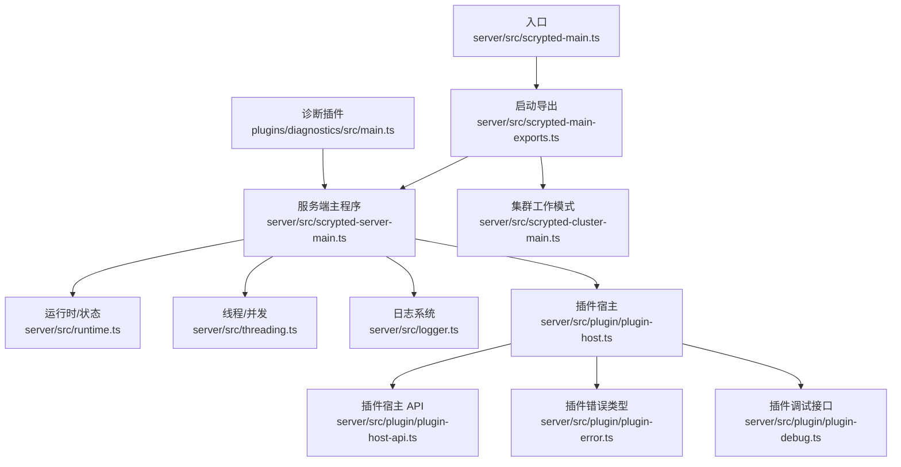
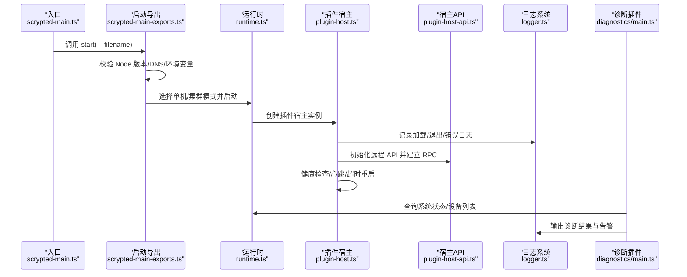
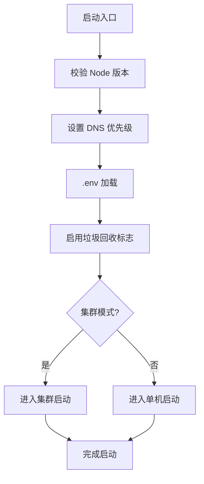
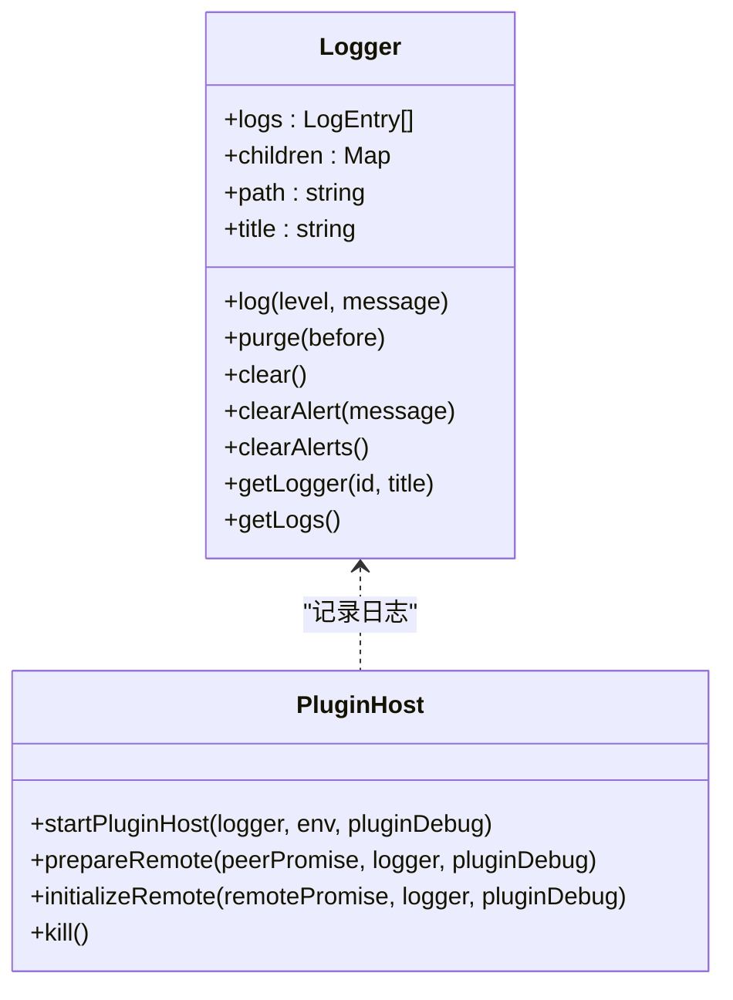
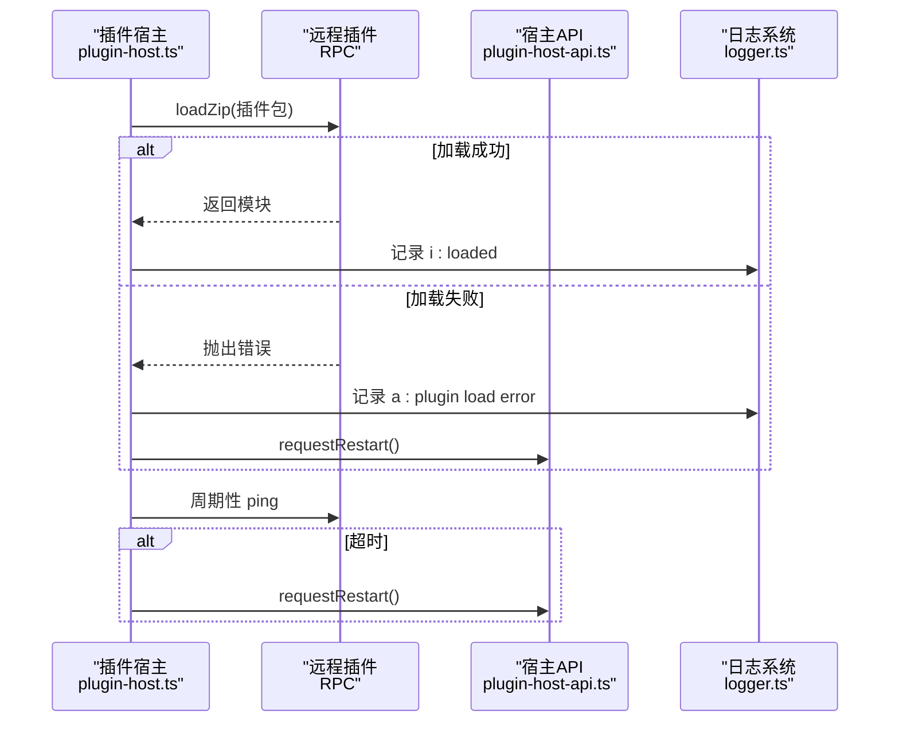
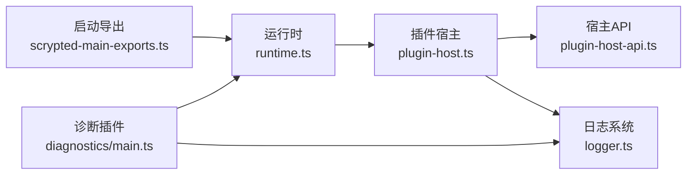

# 系统问题诊断

<cite>
**本文引用的文件**
- [README.md](file://README.md)
- [server/src/logger.ts](file://server/src/logger.ts)
- [server/src/scrypted-main-exports.ts](file://server/src/scrypted-main-exports.ts)
- [server/src/scrypted-main.ts](file://server/src/scrypted-main.ts)
- [server/src/plugin/plugin-error.ts](file://server/src/plugin/plugin-error.ts)
- [server/src/plugin/plugin-debug.ts](file://server/src/plugin/plugin-debug.ts)
- [plugins/diagnostics/src/main.ts](file://plugins/diagnostics/src/main.ts)
- [server/src/plugin/plugin-host.ts](file://server/src/plugin/plugin-host.ts)
- [server/src/plugin/plugin-host-api.ts](file://server/src/plugin/plugin-host-api.ts)
- [server/src/runtime.ts](file://server/src/runtime.ts)
- [server/src/threading.ts](file://server/src/threading.ts)
</cite>

## 目录
1. [简介](#简介)
2. [项目结构](#项目结构)
3. [核心组件](#核心组件)
4. [架构总览](#架构总览)
5. [详细组件分析](#详细组件分析)
6. [依赖分析](#依赖分析)
7. [性能考虑](#性能考虑)
8. [故障排除指南](#故障排除指南)
9. [结论](#结论)
10. [附录](#附录)

## 简介
本指南面向 Scrypted 系统管理员与开发者，聚焦于系统级问题的诊断与修复，涵盖启动失败、内存泄漏、进程崩溃、日志系统使用、系统资源监控、插件系统问题（加载失败、API 调用错误、插件间通信）、线程与并发问题（死锁、竞态条件、资源竞争）、系统配置问题（权限、环境变量、配置校验）以及预防性维护与健康检查清单。文档以代码库为依据，结合实际源码路径与流程图示，帮助快速定位与解决问题。

## 项目结构
Scrypted 采用多包组织方式：服务端运行时位于 server/，SDK 与类型定义在 sdk/，大量插件位于 plugins/，通用工具与公共模块在 common/。系统入口通过 server/src/scrypted-main.ts 调用 server/src/scrypted-main-exports.ts 的启动逻辑；日志系统由 server/src/logger.ts 提供；插件宿主与生命周期管理在 server/src/plugin/* 中实现；诊断能力由 plugins/diagnostics/src/main.ts 提供。

**图表来源**
- [server/src/scrypted-main.ts:1-4](file://server/src/scrypted-main.ts#L1-L4)
- [server/src/scrypted-main-exports.ts:17-84](file://server/src/scrypted-main-exports.ts#L17-L84)
- [server/src/logger.ts:19-92](file://server/src/logger.ts#L19-L92)
- [server/src/plugin/plugin-host.ts:38-224](file://server/src/plugin/plugin-host.ts#L38-L224)
- [server/src/plugin/plugin-host-api.ts:13-47](file://server/src/plugin/plugin-host-api.ts#L13-L47)
- [plugins/diagnostics/src/main.ts:25-775](file://plugins/diagnostics/src/main.ts#L25-L775)

**章节来源**
- [README.md:1-59](file://README.md#L1-L59)
- [server/src/scrypted-main.ts:1-4](file://server/src/scrypted-main.ts#L1-L4)
- [server/src/scrypted-main-exports.ts:17-84](file://server/src/scrypted-main-exports.ts#L17-L84)

## 核心组件
- 启动与运行时
  - 入口与启动：server/src/scrypted-main.ts 调用启动导出；启动导出负责 Node 版本校验、DNS 解析顺序、.env 加载、垃圾回收策略、集群/单机模式选择，并挂接未捕获异常与未处理拒绝的处理逻辑。
  - 运行时与线程：runtime.ts 提供系统状态、设备与插件管理；threading.ts 提供线程模型与并发控制基础。
- 日志系统
  - server/src/logger.ts 实现 Logger 类，支持父子日志器、事件发射、告警清理、日志聚合与排序，用于统一记录系统与插件日志。
- 插件系统
  - server/src/plugin/plugin-host.ts 管理插件生命周期、RPC 通道、健康检查、重启策略、标准输出/错误流转发到控制台服务器。
  - server/src/plugin/plugin-host-api.ts 提供插件宿主对外 API，包括设备事件、存储、属性设置、重启请求、CORS 设置等。
  - 错误与调试：plugin-error.ts 定义插件错误基类；plugin-debug.ts 定义调试等待与调试端口。
- 诊断能力
  - plugins/diagnostics/src/main.ts 提供系统与设备验证流程，覆盖安装环境、网络连通性、时间同步、媒体编解码、GPU 加速、外部资源访问等。

**章节来源**
- [server/src/scrypted-main-exports.ts:17-84](file://server/src/scrypted-main-exports.ts#L17-L84)
- [server/src/runtime.ts](file://server/src/runtime.ts)
- [server/src/threading.ts](file://server/src/threading.ts)
- [server/src/logger.ts:19-92](file://server/src/logger.ts#L19-L92)
- [server/src/plugin/plugin-host.ts:38-224](file://server/src/plugin/plugin-host.ts#L38-L224)
- [server/src/plugin/plugin-host-api.ts:13-47](file://server/src/plugin/plugin-host-api.ts#L13-L47)
- [server/src/plugin/plugin-error.ts:1-3](file://server/src/plugin/plugin-error.ts#L1-L3)
- [server/src/plugin/plugin-debug.ts:1-5](file://server/src/plugin/plugin-debug.ts#L1-L5)
- [plugins/diagnostics/src/main.ts:25-775](file://plugins/diagnostics/src/main.ts#L25-L775)

## 架构总览
下图展示从启动到插件加载、日志记录与健康检查的整体流程，映射到具体源码文件。

**图表来源**
- [server/src/scrypted-main.ts:1-4](file://server/src/scrypted-main.ts#L1-L4)
- [server/src/scrypted-main-exports.ts:17-84](file://server/src/scrypted-main-exports.ts#L17-L84)
- [server/src/plugin/plugin-host.ts:38-224](file://server/src/plugin/plugin-host.ts#L38-L224)
- [server/src/plugin/plugin-host-api.ts:13-47](file://server/src/plugin/plugin-host-api.ts#L13-L47)
- [server/src/logger.ts:19-92](file://server/src/logger.ts#L19-L92)
- [plugins/diagnostics/src/main.ts:25-775](file://plugins/diagnostics/src/main.ts#L25-L775)

## 详细组件分析

### 启动与运行时（启动失败排查）
- 关键点
  - Node 版本要求与 DNS 解析顺序调整，避免 IPv6 网络导致的解析异常。
  - .env 加载与垃圾回收标志注入，确保运行时参数正确。
  - 未处理拒绝与插件错误的区分处理，避免误报致命错误。
  - 集群/单机模式选择，影响后续组件初始化。
- 排查步骤
  - 检查 Node 版本是否满足最低要求。
  - 查看启动日志中 DNS 解析顺序与 .env 加载情况。
  - 观察启动阶段的未处理拒绝是否被归类为 RPCResultError 或 PluginError。
  - 如启用集群，确认集群模式初始化成功。

**图表来源**
- [server/src/scrypted-main-exports.ts:36-73](file://server/src/scrypted-main-exports.ts#L36-L73)
- [server/src/scrypted-main-exports.ts:75-83](file://server/src/scrypted-main-exports.ts#L75-L83)

**章节来源**
- [server/src/scrypted-main-exports.ts:17-84](file://server/src/scrypted-main-exports.ts#L17-L84)

### 日志系统（日志级别、文件位置、关键信息解读）
- 组件职责
  - Logger 支持父子日志器、事件发射、告警清理、日志聚合与排序。
  - 插件宿主将插件 stdout/stderr 重定向至控制台服务器，并转发到 Logger。
- 使用建议
  - 在系统与插件层面均开启日志，关注 e/w/i 等级别差异。
  - 利用 getLogs 获取聚合日志，按时间排序便于回溯。
  - 清理过期日志与告警，避免日志膨胀。
- 关键信息解读
  - 插件“加载失败”通常伴随“plugin load error”或“plugin failed to start in a timely manner”等日志。
  - 插件“退出/错误”会记录退出码与信号，结合 stderr 输出定位原因。

**图表来源**
- [server/src/logger.ts:19-92](file://server/src/logger.ts#L19-L92)
- [server/src/plugin/plugin-host.ts:428-462](file://server/src/plugin/plugin-host.ts#L428-L462)

**章节来源**
- [server/src/logger.ts:19-92](file://server/src/logger.ts#L19-L92)
- [server/src/plugin/plugin-host.ts:428-462](file://server/src/plugin/plugin-host.ts#L428-L462)

### 插件系统（加载失败、API 错误、通信问题）
- 加载失败
  - 现象：日志出现“plugin failed to load”“plugin load error”，或长时间无响应触发“plugin failed to start in a timely manner”。
  - 排查：检查插件 zip 包完整性、运行时类型匹配、依赖安装、环境变量与卷挂载。
- API 调用错误
  - 现象：RPCResultError 或 PluginError 导致未处理拒绝被判定为非致命。
  - 排查：区分 RPCResultError 与 PluginError，前者可忽略，后者需查看插件侧日志。
- 插件间通信
  - 现象：心跳超时、连接断开、事件丢失。
  - 排查：检查健康检查间隔、ACL/CORS 设置、Engine.IO/WebSocket 连接状态。

**图表来源**
- [server/src/plugin/plugin-host.ts:248-274](file://server/src/plugin/plugin-host.ts#L248-L274)
- [server/src/plugin/plugin-host.ts:307-325](file://server/src/plugin/plugin-host.ts#L307-L325)
- [server/src/plugin/plugin-host-api.ts:186-190](file://server/src/plugin/plugin-host-api.ts#L186-L190)
- [server/src/plugin/plugin-error.ts:1-3](file://server/src/plugin/plugin-error.ts#L1-L3)

**章节来源**
- [server/src/plugin/plugin-host.ts:248-274](file://server/src/plugin/plugin-host.ts#L248-L274)
- [server/src/plugin/plugin-host.ts:307-325](file://server/src/plugin/plugin-host.ts#L307-L325)
- [server/src/plugin/plugin-host-api.ts:186-190](file://server/src/plugin/plugin-host-api.ts#L186-L190)
- [server/src/plugin/plugin-error.ts:1-3](file://server/src/plugin/plugin-error.ts#L1-L3)

### 线程与并发（死锁、竞态、资源竞争）
- 线程模型
  - 运行时与线程模块提供并发基础，插件宿主通过 RPC Peer 与 Worker 交互，避免直接共享状态。
- 常见问题
  - 插件侧阻塞导致心跳超时，触发自动重启。
  - 多插件同时访问共享资源引发竞态，应通过队列或互斥保护。
- 排查建议
  - 结合日志时间戳定位高延迟操作。
  - 使用诊断插件验证媒体流与编码器行为，减少资源竞争。

**章节来源**
- [server/src/threading.ts](file://server/src/threading.ts)
- [server/src/runtime.ts](file://server/src/runtime.ts)
- [server/src/plugin/plugin-host.ts:289-325](file://server/src/plugin/plugin-host.ts#L289-L325)

### 系统配置（权限、环境变量、配置校验）
- 环境变量
  - 启动导出加载 .env；部分平台通过环境变量传递兼容文件与 Docker Flavor。
- 权限与卷
  - 插件宿主确保插件卷存在并准备 zip；容器场景需确保 GPU 设备与内核模块可见。
- 配置校验
  - 诊断插件对安装环境、CPU/内存、云服务可达性、外部资源访问、GPU 加速等进行系统性验证。

**章节来源**
- [server/src/scrypted-main-exports.ts:71-73](file://server/src/scrypted-main-exports.ts#L71-L73)
- [server/src/plugin/plugin-host.ts:131-144](file://server/src/plugin/plugin-host.ts#L131-L144)
- [plugins/diagnostics/src/main.ts:397-407](file://plugins/diagnostics/src/main.ts#L397-L407)
- [plugins/diagnostics/src/main.ts:518-526](file://plugins/diagnostics/src/main.ts#L518-L526)

## 依赖分析
- 组件耦合
  - 启动导出与运行时强耦合，决定后续组件初始化路径。
  - 插件宿主依赖运行时状态、RPC 序列化、日志系统与控制台服务器。
  - 诊断插件依赖系统管理器与媒体管理器，形成对系统与设备的横切验证。
- 外部依赖
  - Node.js 版本、DNS 解析、.env 文件、FFmpeg 可执行路径、GPU 设备节点。

**图表来源**
- [server/src/scrypted-main-exports.ts:75-83](file://server/src/scrypted-main-exports.ts#L75-L83)
- [server/src/plugin/plugin-host.ts:38-224](file://server/src/plugin/plugin-host.ts#L38-L224)
- [server/src/plugin/plugin-host-api.ts:13-47](file://server/src/plugin/plugin-host-api.ts#L13-L47)
- [plugins/diagnostics/src/main.ts:25-775](file://plugins/diagnostics/src/main.ts#L25-L775)

**章节来源**
- [server/src/scrypted-main-exports.ts:75-83](file://server/src/scrypted-main-exports.ts#L75-L83)
- [server/src/plugin/plugin-host.ts:38-224](file://server/src/plugin/plugin-host.ts#L38-L224)
- [server/src/plugin/plugin-host-api.ts:13-47](file://server/src/plugin/plugin-host-api.ts#L13-L47)
- [plugins/diagnostics/src/main.ts:25-775](file://plugins/diagnostics/src/main.ts#L25-L775)

## 性能考虑
- 垃圾回收与内存
  - 启动导出显式注入 GC 标志，便于手动触发与观察内存峰值。
- 编解码与 GPU
  - 诊断插件验证 GPU 解码与变换链路，建议优先使用硬件加速。
- 网络与 I/O
  - 诊断插件验证外部资源访问与 DNS 解析，避免阻塞与降级。

**章节来源**
- [server/src/scrypted-main-exports.ts:31-34](file://server/src/scrypted-main-exports.ts#L31-L34)
- [plugins/diagnostics/src/main.ts:655-743](file://plugins/diagnostics/src/main.ts#L655-L743)

## 故障排除指南

### 启动失败
- 步骤
  - 检查 Node 版本与 DNS 优先级。
  - 查看 .env 是否正确加载。
  - 观察启动阶段未处理拒绝是否为 RPCResultError/PluginError。
  - 如启用集群，确认集群初始化成功。
- 关联源码
  - [server/src/scrypted-main-exports.ts:36-73](file://server/src/scrypted-main-exports.ts#L36-L73)
  - [server/src/scrypted-main-exports.ts:75-83](file://server/src/scrypted-main-exports.ts#L75-L83)

**章节来源**
- [server/src/scrypted-main-exports.ts:36-73](file://server/src/scrypted-main-exports.ts#L36-L73)
- [server/src/scrypted-main-exports.ts:75-83](file://server/src/scrypted-main-exports.ts#L75-L83)

### 内存泄漏
- 步骤
  - 启用 GC 标志并定期触发，观察堆内存峰值。
  - 关注插件侧大对象分配与媒体缓冲区使用。
  - 使用诊断插件验证媒体流与编解码器行为。
- 关联源码
  - [server/src/scrypted-main-exports.ts:31-34](file://server/src/scrypted-main-exports.ts#L31-L34)
  - [plugins/diagnostics/src/main.ts:655-743](file://plugins/diagnostics/src/main.ts#L655-L743)

**章节来源**
- [server/src/scrypted-main-exports.ts:31-34](file://server/src/scrypted-main-exports.ts#L31-L34)
- [plugins/diagnostics/src/main.ts:655-743](file://plugins/diagnostics/src/main.ts#L655-L743)

### 进程崩溃
- 步骤
  - 查看插件退出码与信号，结合 stderr 输出。
  - 检查健康检查与心跳，确认是否因超时被重启。
  - 对比 RPCResultError 与 PluginError，定位错误来源。
- 关联源码
  - [server/src/plugin/plugin-host.ts:453-460](file://server/src/plugin/plugin-host.ts#L453-L460)
  - [server/src/plugin/plugin-host.ts:307-325](file://server/src/plugin/plugin-host.ts#L307-L325)
  - [server/src/plugin/plugin-error.ts:1-3](file://server/src/plugin/plugin-error.ts#L1-L3)

**章节来源**
- [server/src/plugin/plugin-host.ts:453-460](file://server/src/plugin/plugin-host.ts#L453-L460)
- [server/src/plugin/plugin-host.ts:307-325](file://server/src/plugin/plugin-host.ts#L307-L325)
- [server/src/plugin/plugin-error.ts:1-3](file://server/src/plugin/plugin-error.ts#L1-L3)

### 日志系统使用
- 步骤
  - 通过 Logger 获取子日志器，订阅 log 事件。
  - 使用 getLogs 聚合日志并按时间排序。
  - 清理过期日志与告警，避免日志膨胀。
- 关联源码
  - [server/src/logger.ts:19-92](file://server/src/logger.ts#L19-L92)
  - [server/src/plugin/plugin-host.ts:436-446](file://server/src/plugin/plugin-host.ts#L436-L446)

**章节来源**
- [server/src/logger.ts:19-92](file://server/src/logger.ts#L19-L92)
- [server/src/plugin/plugin-host.ts:436-446](file://server/src/plugin/plugin-host.ts#L436-L446)

### 系统资源监控
- 步骤
  - 使用诊断插件验证 CPU 数量、内存容量、云服务可达性、外部资源访问与 DNS。
  - 在容器场景检查 GPU 设备节点与内核模块可见性。
- 关联源码
  - [plugins/diagnostics/src/main.ts:397-407](file://plugins/diagnostics/src/main.ts#L397-L407)
  - [plugins/diagnostics/src/main.ts:518-526](file://plugins/diagnostics/src/main.ts#L518-L526)
  - [plugins/diagnostics/src/main.ts:615-652](file://plugins/diagnostics/src/main.ts#L615-L652)

**章节来源**
- [plugins/diagnostics/src/main.ts:397-407](file://plugins/diagnostics/src/main.ts#L397-L407)
- [plugins/diagnostics/src/main.ts:518-526](file://plugins/diagnostics/src/main.ts#L518-L526)
- [plugins/diagnostics/src/main.ts:615-652](file://plugins/diagnostics/src/main.ts#L615-L652)

### 插件系统问题
- 插件加载失败
  - 检查 zip 包完整性、运行时类型、依赖安装与环境变量。
  - 关注“plugin load error”与“plugin failed to start in a timely manner”。
- API 调用错误
  - 区分 RPCResultError 与 PluginError，前者可忽略。
- 插件间通信
  - 检查健康检查、ACL/CORS 与连接状态。
- 关联源码
  - [server/src/plugin/plugin-host.ts:248-274](file://server/src/plugin/plugin-host.ts#L248-L274)
  - [server/src/plugin/plugin-host.ts:307-325](file://server/src/plugin/plugin-host.ts#L307-L325)
  - [server/src/plugin/plugin-host-api.ts:186-190](file://server/src/plugin/plugin-host-api.ts#L186-L190)
  - [server/src/plugin/plugin-error.ts:1-3](file://server/src/plugin/plugin-error.ts#L1-L3)

**章节来源**
- [server/src/plugin/plugin-host.ts:248-274](file://server/src/plugin/plugin-host.ts#L248-L274)
- [server/src/plugin/plugin-host.ts:307-325](file://server/src/plugin/plugin-host.ts#L307-L325)
- [server/src/plugin/plugin-host-api.ts:186-190](file://server/src/plugin/plugin-host-api.ts#L186-L190)
- [server/src/plugin/plugin-error.ts:1-3](file://server/src/plugin/plugin-error.ts#L1-L3)

### 线程与并发问题
- 步骤
  - 关注心跳超时与自动重启，定位阻塞点。
  - 使用诊断插件验证媒体流与编解码器，减少资源竞争。
- 关联源码
  - [server/src/plugin/plugin-host.ts:289-325](file://server/src/plugin/plugin-host.ts#L289-L325)
  - [plugins/diagnostics/src/main.ts:655-743](file://plugins/diagnostics/src/main.ts#L655-L743)

**章节来源**
- [server/src/plugin/plugin-host.ts:289-325](file://server/src/plugin/plugin-host.ts#L289-L325)
- [plugins/diagnostics/src/main.ts:655-743](file://plugins/diagnostics/src/main.ts#L655-L743)

### 系统配置问题
- 步骤
  - 检查 .env 加载与环境变量（如 Docker Flavor、兼容文件）。
  - 确认插件卷与 zip 准备、GPU 设备节点可见。
  - 使用诊断插件验证安装环境、CPU/内存、云服务与外部资源。
- 关联源码
  - [server/src/scrypted-main-exports.ts:71-73](file://server/src/scrypted-main-exports.ts#L71-L73)
  - [server/src/plugin/plugin-host.ts:131-144](file://server/src/plugin/plugin-host.ts#L131-L144)
  - [plugins/diagnostics/src/main.ts:397-407](file://plugins/diagnostics/src/main.ts#L397-L407)
  - [plugins/diagnostics/src/main.ts:518-526](file://plugins/diagnostics/src/main.ts#L518-L526)

**章节来源**
- [server/src/scrypted-main-exports.ts:71-73](file://server/src/scrypted-main-exports.ts#L71-L73)
- [server/src/plugin/plugin-host.ts:131-144](file://server/src/plugin/plugin-host.ts#L131-L144)
- [plugins/diagnostics/src/main.ts:397-407](file://plugins/diagnostics/src/main.ts#L397-L407)
- [plugins/diagnostics/src/main.ts:518-526](file://plugins/diagnostics/src/main.ts#L518-L526)

### 预防性维护与健康检查清单
- 定期执行
  - 系统验证：安装环境、主机 OS、公网/私网地址、时间同步、CPU/内存、GPU 加速、云服务与外部资源可达性。
  - 设备验证：能力检测、运动事件、最近动作、快照与多路流、音频编解码一致性。
- 关联源码
  - [plugins/diagnostics/src/main.ts:386-771](file://plugins/diagnostics/src/main.ts#L386-L771)

**章节来源**
- [plugins/diagnostics/src/main.ts:386-771](file://plugins/diagnostics/src/main.ts#L386-L771)

## 结论
通过结合启动导出、运行时、日志系统、插件宿主与诊断插件的源码路径，可以系统性地定位与解决 Scrypted 的启动失败、内存泄漏、进程崩溃、插件问题与配置问题。建议将诊断插件作为日常健康检查工具，配合日志系统与资源监控，持续保障系统稳定运行。

## 附录
- 开发与调试参考
  - README 提供 VS Code 调试插件与服务器的参考流程，便于本地开发与问题复现。

**章节来源**
- [README.md:17-58](file://README.md#L17-L58)