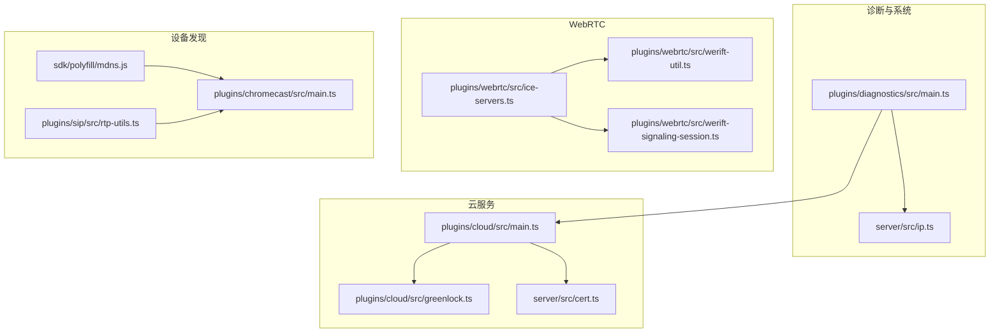
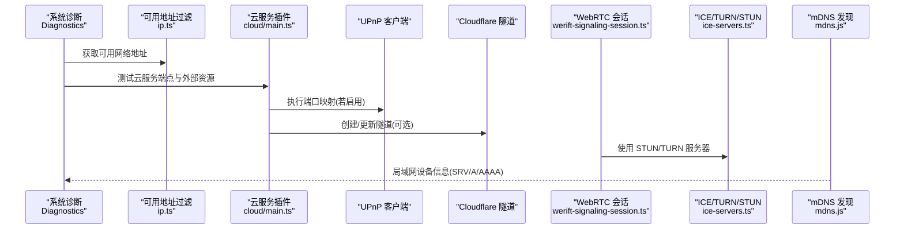
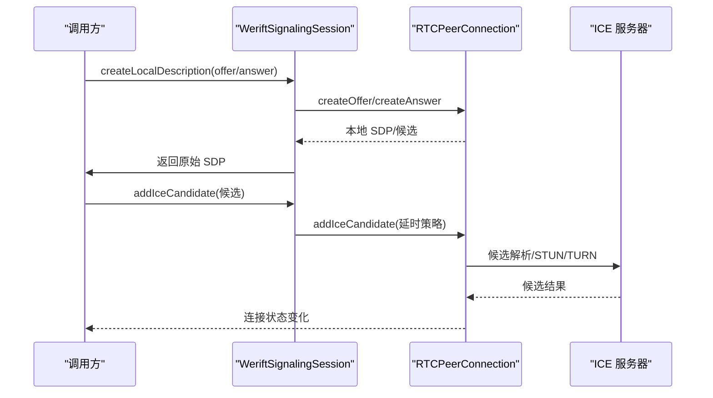
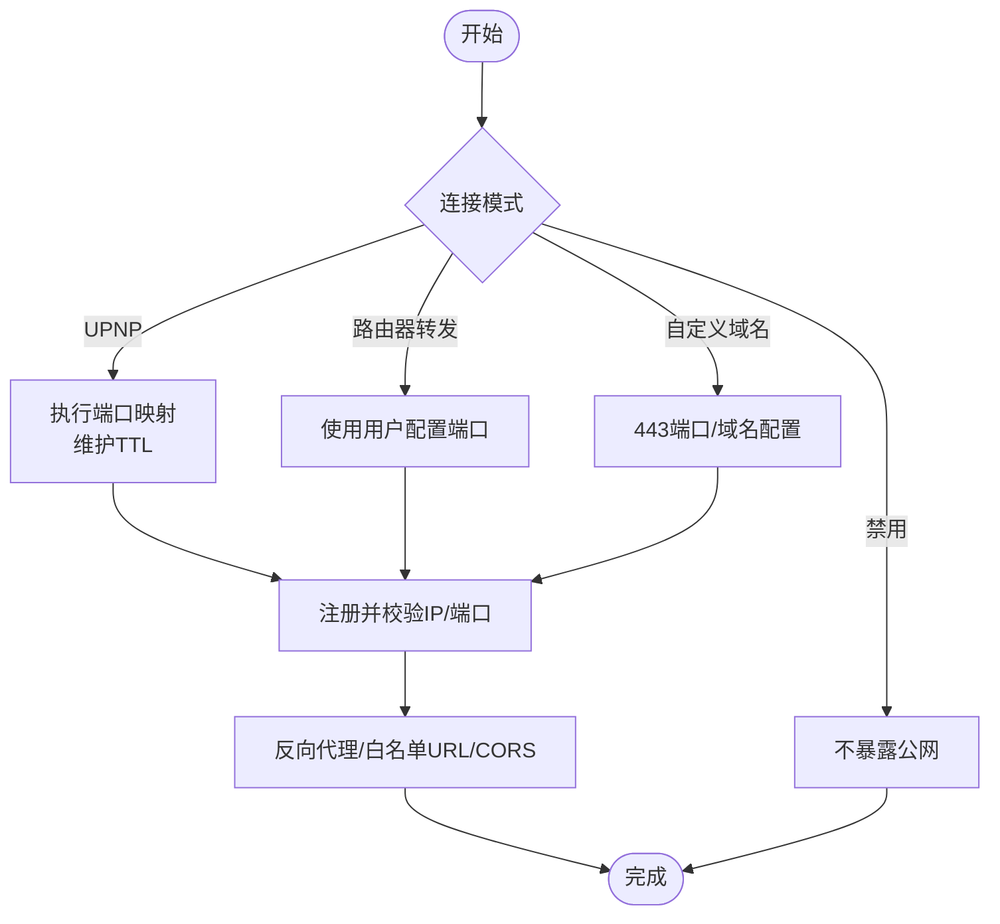
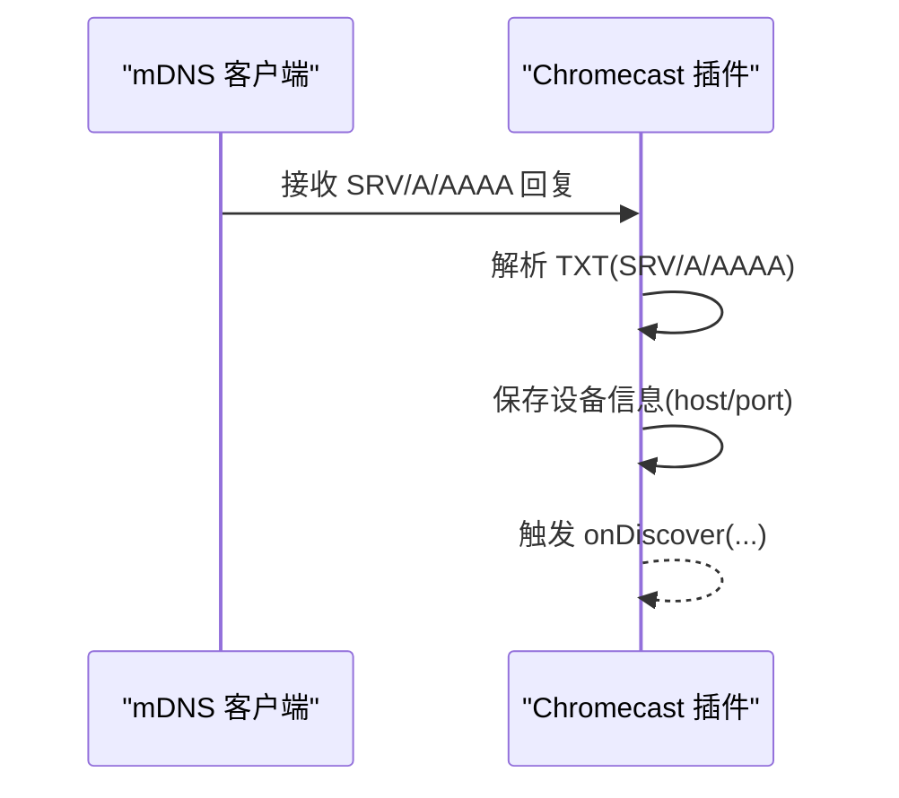
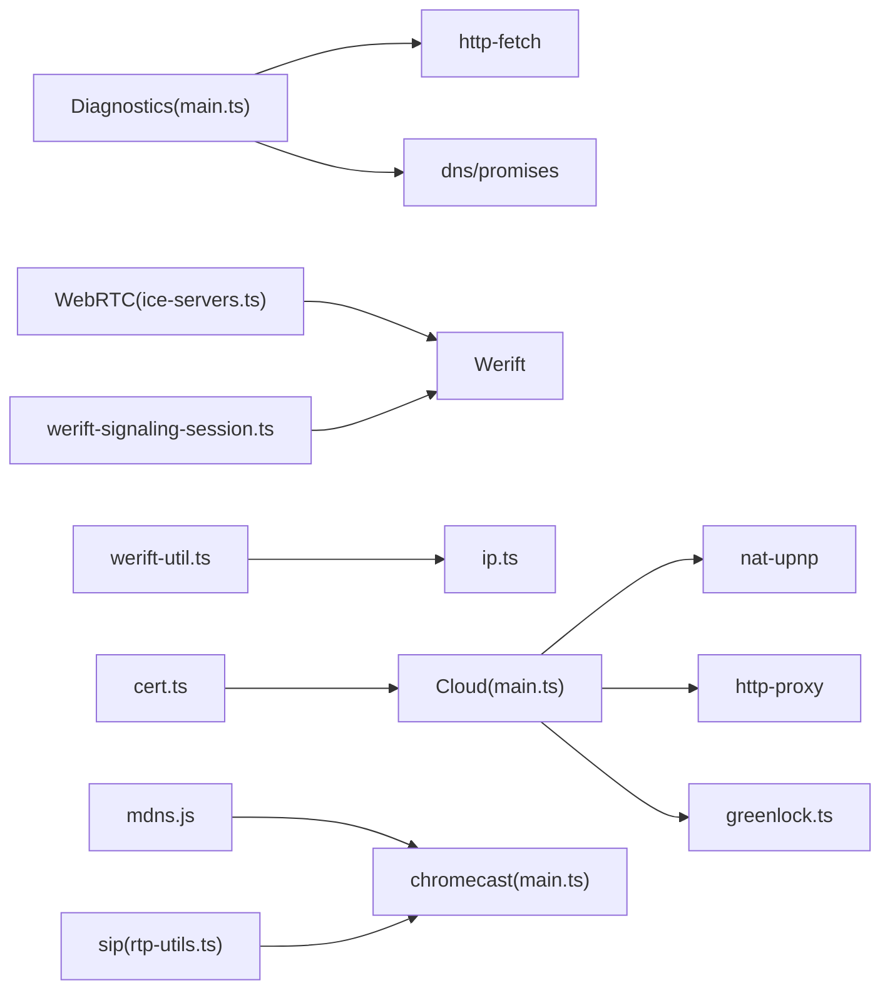

# 网络连接问题

<cite>
**本文引用的文件**
- [plugins/diagnostics/src/main.ts](file://plugins/diagnostics/src/main.ts)
- [server/src/ip.ts](file://server/src/ip.ts)
- [plugins/webrtc/src/ice-servers.ts](file://plugins/webrtc/src/ice-servers.ts)
- [plugins/webrtc/src/werift-util.ts](file://plugins/webrtc/src/werift-util.ts)
- [plugins/webrtc/src/werift-signaling-session.ts](file://plugins/webrtc/src/werift-signaling-session.ts)
- [plugins/cloud/src/main.ts](file://plugins/cloud/src/main.ts)
- [plugins/cloud/src/greenlock.ts](file://plugins/cloud/src/greenlock.ts)
- [server/src/cert.ts](file://server/src/cert.ts)
- [sdk/polyfill/mdns.js](file://sdk/polyfill/mdns.js)
- [plugins/chromecast/src/main.ts](file://plugins/chromecast/src/main.ts)
- [plugins/sip/src/rtp-utils.ts](file://plugins/sip/src/rtp-utils.ts)
</cite>

## 目录
1. [简介](#简介)
2. [项目结构](#项目结构)
3. [核心组件](#核心组件)
4. [架构总览](#架构总览)
5. [详细组件分析](#详细组件分析)
6. [依赖关系分析](#依赖关系分析)
7. [性能考虑](#性能考虑)
8. [故障排除指南](#故障排除指南)
9. [结论](#结论)
10. [附录](#附录)

## 简介
本指南面向 Scrypted 的网络连接问题，覆盖连通性与端口检查、DNS 解析验证、防火墙与路由器配置（端口转发、NAT 穿透、UPnP）、WebRTC 连接诊断（ICE 候选、STUN/TURN、网络拓扑）、云服务连接（证书、域名、代理）、设备发现与局域网通信（mDNS、IP 冲突、网络隔离）、以及网络性能分析（带宽、延迟、丢包）。文档基于仓库中的实际实现进行归纳，并提供可操作的排障步骤与预防建议。

## 项目结构
围绕网络连接的关键模块分布如下：
- 诊断与系统健康：plugins/diagnostics/src/main.ts 提供系统级连通性、时间同步、外部资源访问、DNS 检测等验证流程。
- 本地地址与可用网络接口过滤：server/src/ip.ts 提供可用网络地址筛选逻辑，用于识别公网/私网/回环/链路本地等地址。
- WebRTC 信令与 ICE：plugins/webrtc/src 下的 ice-servers.ts、werift-util.ts、werift-signaling-session.ts 实现 STUN/TURN 服务器配置、候选收集与本地网络判断。
- 云服务与远程访问：plugins/cloud/src/main.ts 实现 UPnP 端口映射、Cloudflare 隧道、自定义域名与证书、反向代理与 CORS 设置；greenlock.ts 支持 DuckDNS + ACME 自动签发；server/src/cert.ts 提供自签名证书生成。
- 设备发现与局域网通信：sdk/polyfill/mdns.js 聚合 mdns 库；plugins/chromecast/src/main.ts 展示 SRV/A/AAAA 记录解析；plugins/sip/src/rtp-utils.ts 展示 STUN 绑定请求发送。

**图表来源**
- [plugins/diagnostics/src/main.ts:386-775](file://plugins/diagnostics/src/main.ts#L386-L775)
- [server/src/ip.ts:1-107](file://server/src/ip.ts#L1-L107)
- [plugins/webrtc/src/ice-servers.ts:1-50](file://plugins/webrtc/src/ice-servers.ts#L1-L50)
- [plugins/webrtc/src/werift-util.ts:1-88](file://plugins/webrtc/src/werift-util.ts#L1-L88)
- [plugins/webrtc/src/werift-signaling-session.ts:1-92](file://plugins/webrtc/src/werift-signaling-session.ts#L1-L92)
- [plugins/cloud/src/main.ts:1-800](file://plugins/cloud/src/main.ts#L1-L800)
- [plugins/cloud/src/greenlock.ts:1-58](file://plugins/cloud/src/greenlock.ts#L1-L58)
- [server/src/cert.ts:1-102](file://server/src/cert.ts#L1-L102)
- [sdk/polyfill/mdns.js:1-1](file://sdk/polyfill/mdns.js#L1-L1)
- [plugins/chromecast/src/main.ts:488-527](file://plugins/chromecast/src/main.ts#L488-L527)
- [plugins/sip/src/rtp-utils.ts:47-101](file://plugins/sip/src/rtp-utils.ts#L47-L101)

**章节来源**
- [plugins/diagnostics/src/main.ts:386-775](file://plugins/diagnostics/src/main.ts#L386-L775)
- [server/src/ip.ts:1-107](file://server/src/ip.ts#L1-L107)

## 核心组件
- 系统网络健康检测：通过 httpFetch 对外网服务进行 IPv4/IPv6 地址探测、系统时间同步校验、云服务端点可达性、外部资源访问与 DNS 阻断检测。
- 可用网络地址过滤：对回环、链路本地、文档/保留/基准测试等地址进行屏蔽，区分 IPv4 嵌入式 IPv6，过滤临时 IPv6 地址，仅保留“可用”地址集合。
- WebRTC ICE/STUN/TURN：内置 STUN/TURN 服务器列表，支持 Werift 配置转换；在添加 relay/srflx 候选时引入延时策略；提供本地网络判断工具。
- 云服务与远程访问：UPnP 端口映射、Cloudflare 隧道、自定义域名与证书、反向代理与 CORS、短生命周期 URL 白名单。
- 设备发现与局域网通信：mDNS 封装、Chromecast SRV/A/AAAA 记录解析、SIP RTP/RTCP STUN 请求。

**章节来源**
- [plugins/diagnostics/src/main.ts:414-484](file://plugins/diagnostics/src/main.ts#L414-L484)
- [server/src/ip.ts:48-106](file://server/src/ip.ts#L48-L106)
- [plugins/webrtc/src/ice-servers.ts:1-50](file://plugins/webrtc/src/ice-servers.ts#L1-L50)
- [plugins/webrtc/src/werift-util.ts:53-87](file://plugins/webrtc/src/werift-util.ts#L53-L87)
- [plugins/cloud/src/main.ts:444-535](file://plugins/cloud/src/main.ts#L444-L535)
- [sdk/polyfill/mdns.js:1-1](file://sdk/polyfill/mdns.js#L1-L1)
- [plugins/chromecast/src/main.ts:488-527](file://plugins/chromecast/src/main.ts#L488-L527)
- [plugins/sip/src/rtp-utils.ts:47-101](file://plugins/sip/src/rtp-utils.ts#L47-L101)

## 架构总览
下图展示从系统到云服务、WebRTC 信令与设备发现的网络路径与关键交互点。

**图表来源**
- [plugins/diagnostics/src/main.ts:414-484](file://plugins/diagnostics/src/main.ts#L414-L484)
- [server/src/ip.ts:67-106](file://server/src/ip.ts#L67-L106)
- [plugins/cloud/src/main.ts:475-535](file://plugins/cloud/src/main.ts#L475-L535)
- [plugins/webrtc/src/werift-signaling-session.ts:24-92](file://plugins/webrtc/src/werift-signaling-session.ts#L24-L92)
- [plugins/webrtc/src/ice-servers.ts:37-49](file://plugins/webrtc/src/ice-servers.ts#L37-L49)
- [sdk/polyfill/mdns.js:1-1](file://sdk/polyfill/mdns.js#L1-L1)

## 详细组件分析

### WebRTC 连接诊断
- STUN/TURN 服务器配置：内置 STUN/TURN 服务器与 Google STUN，支持 Werift 配置转换。
- ICE 候选处理：对 relay/srflx 候选类型增加延时，避免在本地网络场景误选远端候选；记录本地/远端地址族与网络范围，辅助判断是否处于同一局域网。
- 会话建立：在 offer/answer 创建与设置过程中订阅本地候选事件，确保候选及时注入。

**图表来源**
- [plugins/webrtc/src/werift-signaling-session.ts:24-92](file://plugins/webrtc/src/werift-signaling-session.ts#L24-L92)
- [plugins/webrtc/src/werift-util.ts:53-87](file://plugins/webrtc/src/werift-util.ts#L53-L87)
- [plugins/webrtc/src/ice-servers.ts:37-49](file://plugins/webrtc/src/ice-servers.ts#L37-L49)

**章节来源**
- [plugins/webrtc/src/ice-servers.ts:1-50](file://plugins/webrtc/src/ice-servers.ts#L1-L50)
- [plugins/webrtc/src/werift-util.ts:1-88](file://plugins/webrtc/src/werift-util.ts#L1-L88)
- [plugins/webrtc/src/werift-signaling-session.ts:1-92](file://plugins/webrtc/src/werift-signaling-session.ts#L1-L92)

### 云服务连接与远程访问
- 连接模式：默认、UPNP、路由器转发、自定义域名、禁用。
- UPnP：根据系统本地地址进行端口映射，维护映射 TTL；失败时提示启用路由器 UPnP 或改为手动转发。
- 自定义域名：支持 443 端口直连，结合 DuckDNS + ACME 自动签发或 Cloudflare 隧道；短生命周期 URL 白名单机制。
- 反向代理：本地 127.0.0.1 监听，通过 http-proxy 转发至目标；设置 CORS 与自定义响应头。
- 证书：自签名证书生成与版本管理，保证有效期与兼容性。

**图表来源**
- [plugins/cloud/src/main.ts:475-535](file://plugins/cloud/src/main.ts#L475-L535)
- [plugins/cloud/src/main.ts:914-930](file://plugins/cloud/src/main.ts#L914-L930)
- [plugins/cloud/src/greenlock.ts:10-58](file://plugins/cloud/src/greenlock.ts#L10-L58)
- [server/src/cert.ts:17-101](file://server/src/cert.ts#L17-L101)

**章节来源**
- [plugins/cloud/src/main.ts:67-238](file://plugins/cloud/src/main.ts#L67-L238)
- [plugins/cloud/src/main.ts:444-535](file://plugins/cloud/src/main.ts#L444-L535)
- [plugins/cloud/src/main.ts:914-930](file://plugins/cloud/src/main.ts#L914-L930)
- [plugins/cloud/src/greenlock.ts:1-58](file://plugins/cloud/src/greenlock.ts#L1-L58)
- [server/src/cert.ts:1-102](file://server/src/cert.ts#L1-L102)

### 设备发现与局域网通信
- mDNS 封装：通过 polyfill 引入 mdns，便于跨平台环境下的服务发现。
- Chromecast 发现：解析 TXT/SRV/A/AAAA 记录，提取设备 ID、名称、模型、主机与端口，写入设备存储。
- SIP RTP/RTCP：支持 STUN 绑定请求，区分 ICE 完整与简化的场景，分别采用正式请求或直接发送方式。

**图表来源**
- [sdk/polyfill/mdns.js:1-1](file://sdk/polyfill/mdns.js#L1-L1)
- [plugins/chromecast/src/main.ts:488-527](file://plugins/chromecast/src/main.ts#L488-L527)

**章节来源**
- [sdk/polyfill/mdns.js:1-1](file://sdk/polyfill/mdns.js#L1-L1)
- [plugins/chromecast/src/main.ts:488-527](file://plugins/chromecast/src/main.ts#L488-L527)
- [plugins/sip/src/rtp-utils.ts:47-101](file://plugins/sip/src/rtp-utils.ts#L47-L101)

## 依赖关系分析
- 诊断模块依赖 httpFetch 进行外部连通性测试，依赖 dns/promises 进行域名解析与阻断检测。
- WebRTC 模块依赖 werift 库与 ICE 服务器配置，利用本地网络判断工具辅助诊断。
- 云服务模块依赖 nat-upnp、cloudflared、http-proxy、Greenlock 等库，实现端口映射、隧道与证书管理。
- 设备发现模块依赖 mdns 与具体协议解析（如 Chromecast 的 SRV/A/AAAA）。

**图表来源**
- [plugins/diagnostics/src/main.ts:12-12](file://plugins/diagnostics/src/main.ts#L12-L12)
- [plugins/webrtc/src/ice-servers.ts:1-1](file://plugins/webrtc/src/ice-servers.ts#L1-L1)
- [plugins/webrtc/src/werift-util.ts:1-3](file://plugins/webrtc/src/werift-util.ts#L1-L3)
- [plugins/webrtc/src/werift-signaling-session.ts:1-4](file://plugins/webrtc/src/werift-signaling-session.ts#L1-L4)
- [plugins/cloud/src/main.ts:1-26](file://plugins/cloud/src/main.ts#L1-L26)
- [plugins/cloud/src/greenlock.ts:1-8](file://plugins/cloud/src/greenlock.ts#L1-L8)
- [server/src/cert.ts:1-5](file://server/src/cert.ts#L1-L5)
- [sdk/polyfill/mdns.js:1-1](file://sdk/polyfill/mdns.js#L1-L1)
- [plugins/chromecast/src/main.ts:488-527](file://plugins/chromecast/src/main.ts#L488-L527)
- [plugins/sip/src/rtp-utils.ts:47-101](file://plugins/sip/src/rtp-utils.ts#L47-L101)

**章节来源**
- [plugins/diagnostics/src/main.ts:12-12](file://plugins/diagnostics/src/main.ts#L12-L12)
- [plugins/cloud/src/main.ts:1-26](file://plugins/cloud/src/main.ts#L1-L26)

## 性能考虑
- 带宽与延迟：通过系统诊断模块对云服务端点与外部资源进行超时与状态码检查，间接反映网络质量。
- DNS 解析：对多个域名进行 A/AAAA 解析，检测是否存在 0.0.0.0（DNS 污染/阻断）。
- WebRTC 候选选择：在 relay/srflx 候选上引入延时，避免在本地网络场景中优先选择远端候选，减少不必要的延迟与丢包。
- 代理与并发：云服务反向代理使用高并发 http.Agent，有助于提升并发请求的稳定性与吞吐。

**章节来源**
- [plugins/diagnostics/src/main.ts:615-652](file://plugins/diagnostics/src/main.ts#L615-L652)
- [plugins/webrtc/src/werift-signaling-session.ts:70-91](file://plugins/webrtc/src/werift-signaling-session.ts#L70-L91)
- [plugins/cloud/src/main.ts:914-930](file://plugins/cloud/src/main.ts#L914-L930)

## 故障排除指南

### 一、基本网络诊断
- 连通性测试
  - 使用系统诊断模块对云服务端点与外部资源进行访问测试，确认 IPv4/IPv6 可达性与 DNS 解析正常。
  - 若返回状态码 ≥ 400 或超时，检查网络策略、代理、DNS 设置。
- 系统时间同步
  - 通过获取 HTTP 头部日期字段与本地时间对比，若差异超过阈值，需校准系统时间（NTP）。
- DNS 解析验证
  - 对关键域名执行 A/AAAA 解析，若出现 0.0.0.0，可能存在 DNS 污染或运营商劫持，建议更换 DNS 或使用加密 DNS。

**章节来源**
- [plugins/diagnostics/src/main.ts:414-484](file://plugins/diagnostics/src/main.ts#L414-L484)
- [plugins/diagnostics/src/main.ts:615-652](file://plugins/diagnostics/src/main.ts#L615-L652)

### 二、防火墙与路由器配置
- 端口转发
  - 在“路由器转发”模式下，确保内部端口正确映射到 Scrypted 服务端口；在“自定义域名”模式下，使用 443 端口并通过 SSL 代理终止。
  - 若使用 UPnP，确认路由器已启用 UPNP，否则改为手动端口映射或禁用该模式以避免错误提示。
- NAT 穿透与 UPnP
  - 若 UPNP 映射失败，检查路由器设置、端口占用与 ACL；必要时关闭 UPNP 并改为静态端口映射。
- 短生命周期 URL 与白名单
  - 云服务提供短生命周期 URL 白名单机制，确保在未启用 SSL 域名时仍可安全访问本地资源。

**章节来源**
- [plugins/cloud/src/main.ts:475-535](file://plugins/cloud/src/main.ts#L475-L535)
- [plugins/cloud/src/main.ts:914-930](file://plugins/cloud/src/main.ts#L914-L930)

### 三、WebRTC 连接问题
- ICE 候选收集
  - 检查本地候选事件是否触发，确认 offer/answer 成功设置；若无候选，检查 STUN/TURN 服务器可达性与网络策略。
- STUN/TURN 服务器
  - 使用内置 STUN/TURN 列表进行测试；若网络受限，考虑更换 TURN 服务器或调整网络策略。
- 网络拓扑
  - 使用本地网络判断工具，确认远端地址是否位于同一局域网；若误选 relay/srflx 候选导致延迟升高，可优化路由或调整候选优先级。

**章节来源**
- [plugins/webrtc/src/werift-signaling-session.ts:24-92](file://plugins/webrtc/src/werift-signaling-session.ts#L24-L92)
- [plugins/webrtc/src/werift-util.ts:53-87](file://plugins/webrtc/src/werift-util.ts#L53-L87)
- [plugins/webrtc/src/ice-servers.ts:37-49](file://plugins/webrtc/src/ice-servers.ts#L37-L49)

### 四、云服务连接问题
- 证书配置
  - 若使用自定义域名，确保证书有效且与域名匹配；可通过 Greenlock 自动签发 DuckDNS 证书，或使用 Cloudflare 隧道。
- 域名解析
  - 检查域名 A/AAAA 记录是否正确解析到服务器地址；若解析异常，修正 DNS 记录或等待缓存生效。
- 代理设置
  - 反向代理已启用 Keep-Alive 与高并发，若出现连接异常，检查上游服务状态与代理日志。

**章节来源**
- [plugins/cloud/src/greenlock.ts:10-58](file://plugins/cloud/src/greenlock.ts#L10-L58)
- [server/src/cert.ts:17-101](file://server/src/cert.ts#L17-L101)
- [plugins/cloud/src/main.ts:914-930](file://plugins/cloud/src/main.ts#L914-L930)

### 五、设备发现与局域网通信
- mDNS 广播
  - 确认 mDNS 服务可用，设备广播正常；若发现异常，检查本地网络与防火墙策略。
- IP 地址冲突与网络隔离
  - 使用可用地址过滤逻辑识别回环、链路本地、保留/文档/基准测试等不可用地址，避免误判；若设备无法被发现，检查 VLAN/子网隔离与 ACL。
- Chromecast/SIP 设备
  - 检查 SRV/A/AAAA 记录解析是否完整；对于 SIP 设备，确认 STUN 绑定请求成功，区分 ICE 完整与简化场景。

**章节来源**
- [server/src/ip.ts:48-106](file://server/src/ip.ts#L48-L106)
- [sdk/polyfill/mdns.js:1-1](file://sdk/polyfill/mdns.js#L1-L1)
- [plugins/chromecast/src/main.ts:488-527](file://plugins/chromecast/src/main.ts#L488-L527)
- [plugins/sip/src/rtp-utils.ts:47-101](file://plugins/sip/src/rtp-utils.ts#L47-L101)

### 六、网络性能问题
- 带宽与延迟
  - 通过系统诊断对外部端点进行超时与状态检查，评估网络质量；若存在高延迟，结合 WebRTC 候选策略与网络拓扑进行优化。
- 丢包率分析
  - 结合 WebRTC 连接状态与候选类型，定位是否因 relay/srflx 候选导致传输不稳定；必要时调整网络路由或启用更稳定的候选。

**章节来源**
- [plugins/diagnostics/src/main.ts:615-652](file://plugins/diagnostics/src/main.ts#L615-L652)
- [plugins/webrtc/src/werift-signaling-session.ts:70-91](file://plugins/webrtc/src/werift-signaling-session.ts#L70-L91)

## 结论
本指南基于 Scrypted 代码库中的实际实现，提供了从系统健康、云服务、WebRTC 到设备发现的全链路网络连接排障方法。建议按“先基础后高级”的顺序进行：先验证连通性与 DNS，再检查防火墙与路由器配置，随后针对 WebRTC 与云服务进行专项诊断，最后结合设备发现与性能分析进行优化。通过遵循本文提供的步骤与预防措施，可显著降低网络问题对系统运行的影响。

## 附录
- 快速修复清单
  - 校正系统时间（NTP）
  - 更换 DNS 或启用加密 DNS
  - 启用路由器 UPNP 或配置静态端口映射
  - 检查 mDNS 服务与防火墙策略
  - 验证 STUN/TURN 服务器可达性
  - 更新自定义域名证书或 Cloudflare 隧道
  - 使用可用地址过滤逻辑识别不可用地址
  - 优化 WebRTC 候选策略与网络拓扑