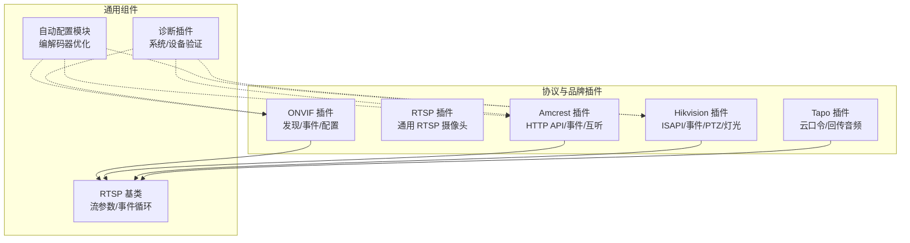
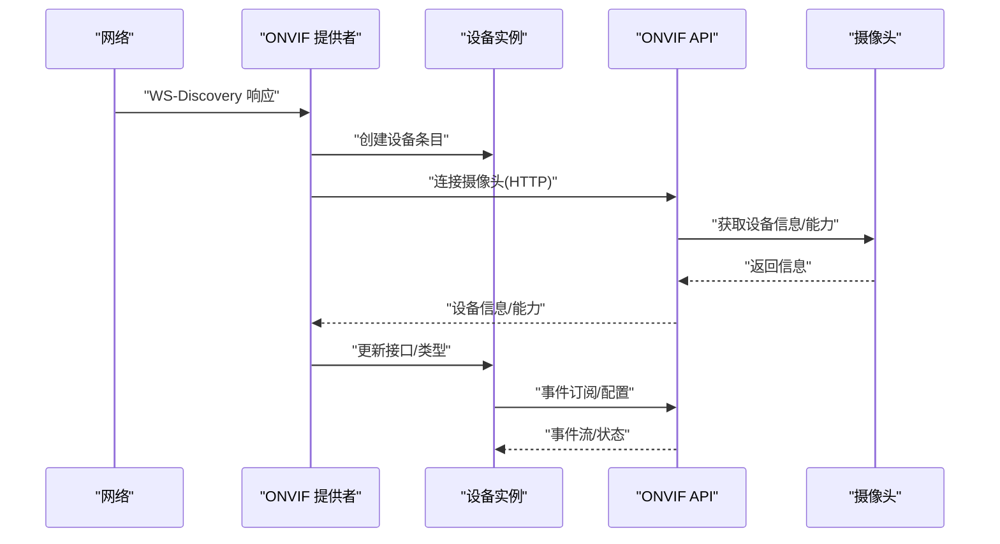
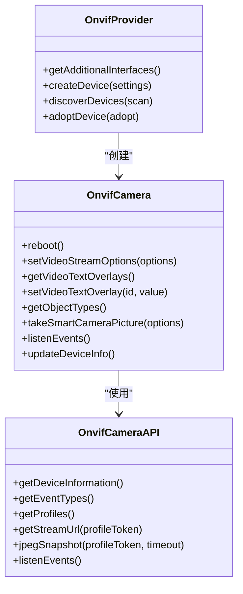
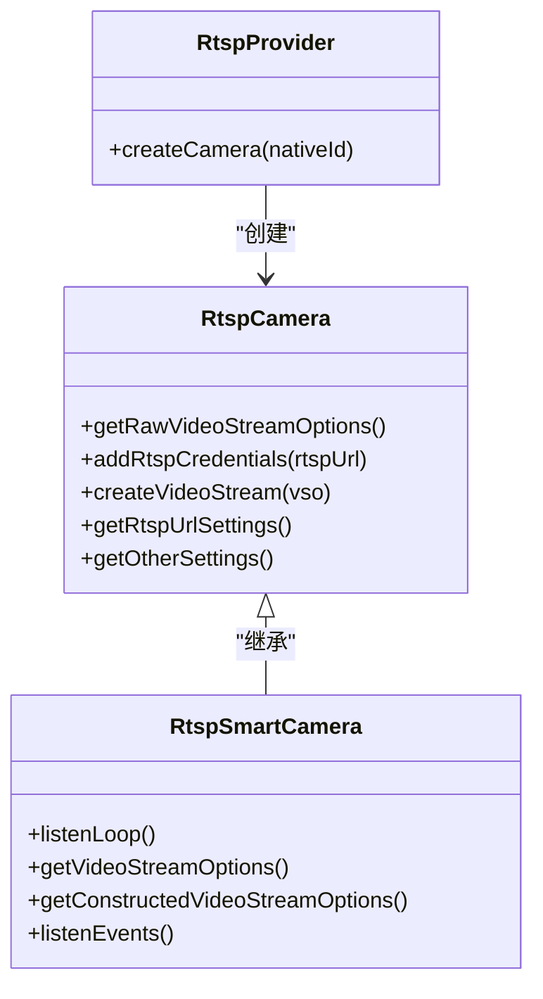
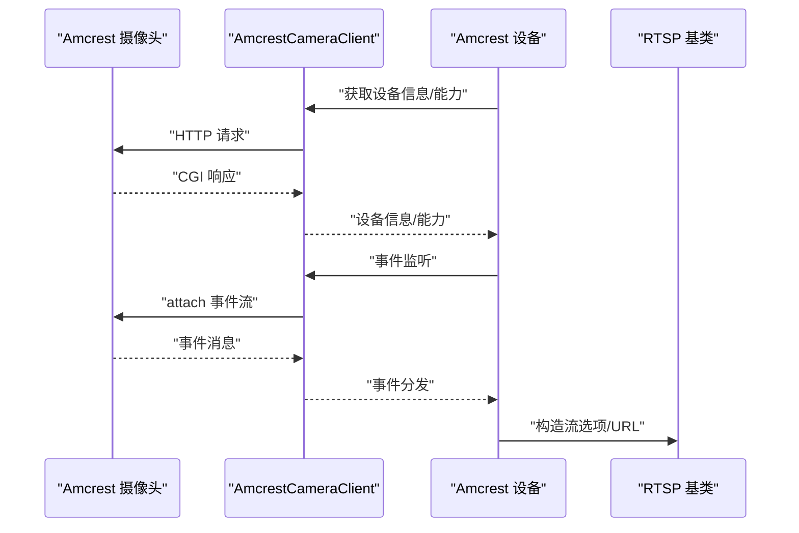
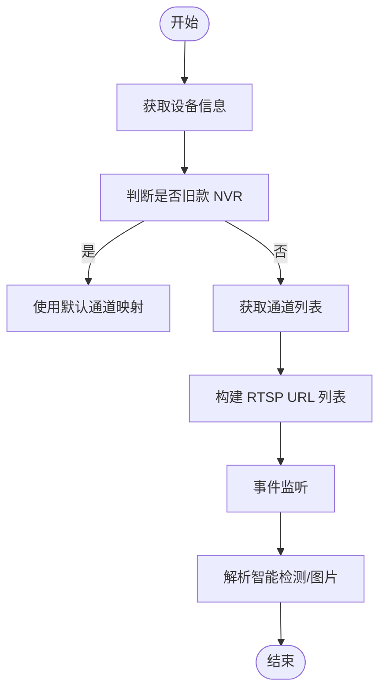
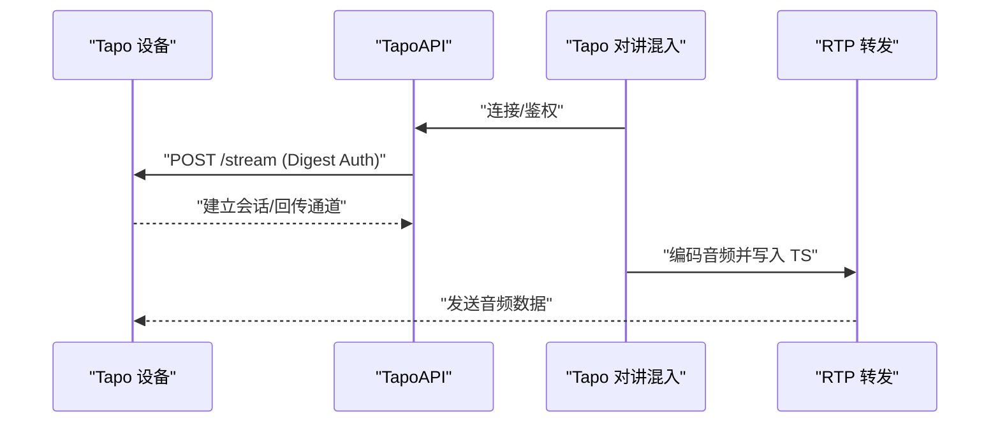
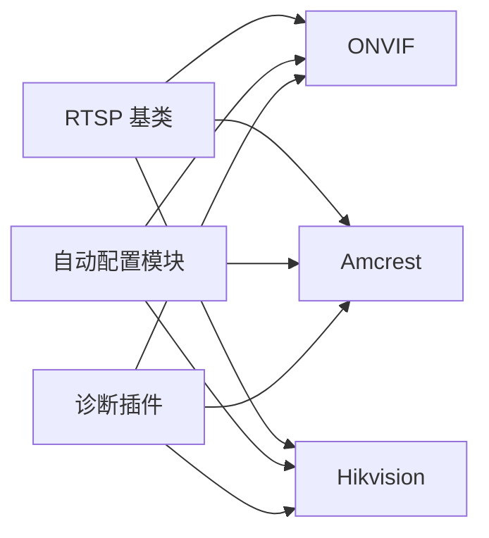

# 设备兼容性问题

<cite>
**本文档引用的文件**
- [README.md](file://README.md)
- [plugins/onvif/src/main.ts](file://plugins/onvif/src/main.ts)
- [plugins/onvif/src/onvif-api.ts](file://plugins/onvif/src/onvif-api.ts)
- [plugins/rtsp/src/main.ts](file://plugins/rtsp/src/main.ts)
- [plugins/rtsp/src/rtsp.ts](file://plugins/rtsp/src/rtsp.ts)
- [plugins/amcrest/src/main.ts](file://plugins/amcrest/src/main.ts)
- [plugins/amcrest/src/amcrest-api.ts](file://plugins/amcrest/src/amcrest-api.ts)
- [plugins/hikvision/src/main.ts](file://plugins/hikvision/src/main.ts)
- [plugins/hikvision/src/hikvision-camera-api.ts](file://plugins/hikvision/src/hikvision-camera-api.ts)
- [plugins/tapo/src/main.ts](file://plugins/tapo/src/main.ts)
- [plugins/tapo/src/tapo-api.ts](file://plugins/tapo/src/tapo-api.ts)
- [common/src/autoconfigure-codecs.ts](file://common/src/autoconfigure-codecs.ts)
- [plugins/diagnostics/src/main.ts](file://plugins/diagnostics/src/main.ts)
</cite>

## 目录
1. [简介](#简介)
2. [项目结构](#项目结构)
3. [核心组件](#核心组件)
4. [架构总览](#架构总览)
5. [详细组件分析](#详细组件分析)
6. [依赖关系分析](#依赖关系分析)
7. [性能考虑](#性能考虑)
8. [故障排除指南](#故障排除指南)
9. [结论](#结论)
10. [附录](#附录)

## 简介
本指南面向 Scrypted 平台的设备兼容性问题，提供系统化的故障排除方法与最佳实践。内容涵盖设备发现与连接失败诊断、协议识别（ONVIF、RTSP、HTTP API）、认证验证、设备响应检查、功能缺失排查、固件升级与兼容性评估、配置问题诊断、设备老化与性能退化处理，以及兼容性测试流程。

## 项目结构
Scrypted 采用多插件架构，不同厂商与协议通过独立插件适配。ONVIF、RTSP、Amcrest、Hikvision、Tapo 等插件分别负责对应协议或品牌的设备接入；Diagnostics 插件提供系统与设备级验证工具；自动配置模块提供统一的编解码器优化流程。

**图表来源**
- [plugins/onvif/src/main.ts:334-622](file://plugins/onvif/src/main.ts#L334-L622)
- [plugins/rtsp/src/rtsp.ts:153-383](file://plugins/rtsp/src/rtsp.ts#L153-L383)
- [plugins/amcrest/src/main.ts:25-704](file://plugins/amcrest/src/main.ts#L25-L704)
- [plugins/hikvision/src/main.ts:32-704](file://plugins/hikvision/src/main.ts#L32-L704)
- [plugins/tapo/src/main.ts:1-141](file://plugins/tapo/src/main.ts#L1-L141)
- [common/src/autoconfigure-codecs.ts:43-210](file://common/src/autoconfigure-codecs.ts#L43-L210)
- [plugins/diagnostics/src/main.ts:25-775](file://plugins/diagnostics/src/main.ts#L25-L775)

**章节来源**
- [README.md:1-59](file://README.md#L1-L59)

## 核心组件
- ONVIF 插件：负责设备发现（WS-Discovery）、事件订阅、编码器配置、OSD 文字叠加、重启、两路对讲（ONVIF/门铃事件）。
- RTSP 插件：提供通用 RTSP 摄像头接入，支持 URL 覆盖、端口覆盖、凭据注入、事件监听循环与超时重启。
- Amcrest 插件：基于 HTTP CGI 的设备管理，支持事件监听（含 Dahua 特例）、连续录制、水印/文字叠加、两路对讲（Amcrest/ONVIF）。
- Hikvision 插件：基于 ISAPI 的设备管理，支持事件监听、智能检测、PTZ 控制、补光灯控制、两路对讲（Hikvision/ONVIF）。
- Tapo 插件：基于云口令的回传音频通道，使用自定义协议与 MPEG-TS 写入。
- 自动配置模块：统一的编解码器优化流程，按分辨率/帧率/码率/关键帧间隔等策略自动配置。
- 诊断插件：系统与设备级验证，包括网络连通性、时间同步、GPU 加速、流媒体质量、音频编解码一致性等。

**章节来源**
- [plugins/onvif/src/main.ts:16-332](file://plugins/onvif/src/main.ts#L16-L332)
- [plugins/rtsp/src/rtsp.ts:153-376](file://plugins/rtsp/src/rtsp.ts#L153-L376)
- [plugins/amcrest/src/main.ts:25-704](file://plugins/amcrest/src/main.ts#L25-L704)
- [plugins/hikvision/src/main.ts:32-704](file://plugins/hikvision/src/main.ts#L32-L704)
- [plugins/tapo/src/main.ts:8-81](file://plugins/tapo/src/main.ts#L8-L81)
- [common/src/autoconfigure-codecs.ts:43-210](file://common/src/autoconfigure-codecs.ts#L43-L210)
- [plugins/diagnostics/src/main.ts:25-775](file://plugins/diagnostics/src/main.ts#L25-L775)

## 架构总览
下图展示设备发现与连接的关键流程，从发现到认证再到事件与流媒体建立。

**图表来源**
- [plugins/onvif/src/main.ts:358-437](file://plugins/onvif/src/main.ts#L358-L437)
- [plugins/onvif/src/onvif-api.ts:53-92](file://plugins/onvif/src/onvif-api.ts#L53-L92)

## 详细组件分析

### ONVIF 组件分析
- 发现机制：解析 WS-Discovery 响应，提取 XAddr、名称、MAC、型号等信息，去重后触发设备发现事件。
- 认证与配置：通过 HTTP 连接摄像头，获取设备信息、能力集，支持事件订阅与编码器配置。
- 功能扩展：支持门铃事件、两路对讲（ONVIF）、OSD 文字叠加、重启等。

**图表来源**
- [plugins/onvif/src/main.ts:16-332](file://plugins/onvif/src/main.ts#L16-L332)
- [plugins/onvif/src/onvif-api.ts:53-399](file://plugins/onvif/src/onvif-api.ts#L53-L399)

**章节来源**
- [plugins/onvif/src/main.ts:334-622](file://plugins/onvif/src/main.ts#L334-L622)
- [plugins/onvif/src/onvif-api.ts:53-399](file://plugins/onvif/src/onvif-api.ts#L53-L399)

### RTSP 组件分析
- 基类职责：统一处理 RTSP URL、用户名/密码注入、视频流选项、事件监听循环与超时重启。
- 智能摄像头：在基类基础上实现事件监听、流选项构造、截图等。

**图表来源**
- [plugins/rtsp/src/rtsp.ts:21-376](file://plugins/rtsp/src/rtsp.ts#L21-L376)
- [plugins/rtsp/src/main.ts:3-7](file://plugins/rtsp/src/main.ts#L3-L7)

**章节来源**
- [plugins/rtsp/src/rtsp.ts:21-376](file://plugins/rtsp/src/rtsp.ts#L21-L376)
- [plugins/rtsp/src/main.ts:3-7](file://plugins/rtsp/src/main.ts#L3-L7)

### Amcrest 组件分析
- HTTP API：通过 CGI 接口进行设备信息查询、事件监听、连续录制、水印/文字叠加、两路对讲（Amcrest/ONVIF）。
- 事件模型：解析事件边界与消息体，映射为 Motion/Audio/门铃/人脸/人体/车辆等事件。
- 编解码器配置：根据摄像头能力动态设置分辨率、帧率、码率、GOP、音频编码等。

**图表来源**
- [plugins/amcrest/src/main.ts:25-704](file://plugins/amcrest/src/main.ts#L25-L704)
- [plugins/amcrest/src/amcrest-api.ts:161-349](file://plugins/amcrest/src/amcrest-api.ts#L161-L349)

**章节来源**
- [plugins/amcrest/src/main.ts:25-704](file://plugins/amcrest/src/main.ts#L25-L704)
- [plugins/amcrest/src/amcrest-api.ts:161-349](file://plugins/amcrest/src/amcrest-api.ts#L161-L349)

### Hikvision 组件分析
- ISAPI：通过 ISAPI 接口进行设备信息、事件、PTZ、补光灯、两路对讲等操作。
- 事件与智能检测：支持 VMD/区域检测/入场/出场/场检测等事件，并解析智能检测图片。
- 通道与分辨率：支持多通道配置，按摄像头编号与通道组合生成 RTSP URL。

**图表来源**
- [plugins/hikvision/src/main.ts:353-415](file://plugins/hikvision/src/main.ts#L353-L415)
- [plugins/hikvision/src/hikvision-camera-api.ts:179-284](file://plugins/hikvision/src/hikvision-camera-api.ts#L179-L284)

**章节来源**
- [plugins/hikvision/src/main.ts:32-704](file://plugins/hikvision/src/main.ts#L32-L704)
- [plugins/hikvision/src/hikvision-camera-api.ts:63-757](file://plugins/hikvision/src/hikvision-camera-api.ts#L63-L757)

### Tapo 组件分析
- 云口令认证：基于 Digest Auth 与密钥交换，建立双向音频回传通道。
- 音频回传：使用 MPEG-TS 写入与 RTP 推送，实现对讲音频传输。

**图表来源**
- [plugins/tapo/src/main.ts:8-81](file://plugins/tapo/src/main.ts#L8-L81)
- [plugins/tapo/src/tapo-api.ts:23-67](file://plugins/tapo/src/tapo-api.ts#L23-L67)

**章节来源**
- [plugins/tapo/src/main.ts:8-81](file://plugins/tapo/src/main.ts#L8-L81)
- [plugins/tapo/src/tapo-api.ts:16-157](file://plugins/tapo/src/tapo-api.ts#L16-L157)

## 依赖关系分析
- ONVIF 插件依赖 RTSP 基类以复用流与事件逻辑。
- Amcrest/Hikvision 插件均依赖 RTSP 基类，同时各自封装 HTTP API。
- 自动配置模块被 ONVIF/Amcrest/Hikvision 插件调用，统一优化编解码器。
- 诊断插件跨插件收集设备与系统状态，输出验证结果。

**图表来源**
- [plugins/rtsp/src/rtsp.ts:153-383](file://plugins/rtsp/src/rtsp.ts#L153-L383)
- [plugins/onvif/src/main.ts:16-332](file://plugins/onvif/src/main.ts#L16-L332)
- [plugins/amcrest/src/main.ts:25-704](file://plugins/amcrest/src/main.ts#L25-L704)
- [plugins/hikvision/src/main.ts:32-704](file://plugins/hikvision/src/main.ts#L32-L704)
- [common/src/autoconfigure-codecs.ts:43-210](file://common/src/autoconfigure-codecs.ts#L43-L210)
- [plugins/diagnostics/src/main.ts:25-775](file://plugins/diagnostics/src/main.ts#L25-L775)

**章节来源**
- [plugins/rtsp/src/rtsp.ts:153-383](file://plugins/rtsp/src/rtsp.ts#L153-L383)
- [common/src/autoconfigure-codecs.ts:43-210](file://common/src/autoconfigure-codecs.ts#L43-L210)
- [plugins/diagnostics/src/main.ts:25-775](file://plugins/diagnostics/src/main.ts#L25-L775)

## 性能考虑
- 自动配置策略：按分辨率优先选择最高可用分辨率，限制帧率至 20fps，合理设置码率与 GOP，确保低延迟与高兼容性。
- 多子流设计：本地/远程/低分辨率三路流推荐，避免 unused streams。
- 音频编解码一致性：统一为 pcm_mulaw/aac/opus，减少转码开销。
- GPU 加速：NVR 环境建议启用 VA-API/NVDEC 硬件解码与转换，提升吞吐量。

**章节来源**
- [common/src/autoconfigure-codecs.ts:43-210](file://common/src/autoconfigure-codecs.ts#L43-L210)
- [plugins/diagnostics/src/main.ts:334-383](file://plugins/diagnostics/src/main.ts#L334-L383)

## 故障排除指南

### 设备发现与连接失败
- ONVIF 发现
  - 检查网络连通性与防火墙，确认设备支持 WS-Discovery。
  - 查看发现日志，确认 XAddr、名称、MAC、型号解析是否成功。
  - 若重复或已存在，检查 nativeId 去重逻辑。
- RTSP 连接
  - 核对 RTSP URL、用户名/密码、端口覆盖设置。
  - 观察事件监听循环是否正常重启（错误/关闭/空闲超时）。
- Amcrest/Hikvision
  - 使用 HTTP API 获取设备信息与能力，确认端口与认证正确。
  - 检查事件监听边界与内容类型，确保 multipart/boundary 正确。

**章节来源**
- [plugins/onvif/src/main.ts:358-437](file://plugins/onvif/src/main.ts#L358-L437)
- [plugins/rtsp/src/rtsp.ts:173-226](file://plugins/rtsp/src/rtsp.ts#L173-L226)
- [plugins/amcrest/src/amcrest-api.ts:227-349](file://plugins/amcrest/src/amcrest-api.ts#L227-L349)
- [plugins/hikvision/src/hikvision-camera-api.ts:179-284](file://plugins/hikvision/src/hikvision-camera-api.ts#L179-L284)

### 协议识别与认证验证
- ONVIF
  - 通过 getCapabilities/getEventProperties 判断事件订阅能力与事件类型。
  - 使用 getProfiles/getStreamUri 获取可用 Profile 与 RTSP URL。
- Amcrest
  - 通过 CGI 查询设备信息、事件类型、通道配置。
  - 两路对讲探测：checkTwoWayAudio 返回是否支持。
- Hikvision
  - 通过 ISAPI 获取设备信息、事件、PTZ 能力、补光灯能力。
  - 两路对讲探测：checkTwoWayAudio 返回 Speaker 是否可用。
- Tapo
  - 通过 Digest Auth 与 key-exchange 建立回传通道，校验云口令。

**章节来源**
- [plugins/onvif/src/onvif-api.ts:248-323](file://plugins/onvif/src/onvif-api.ts#L248-L323)
- [plugins/amcrest/src/amcrest-api.ts:191-208](file://plugins/amcrest/src/amcrest-api.ts#L191-L208)
- [plugins/hikvision/src/hikvision-camera-api.ts:101-108](file://plugins/hikvision/src/hikvision-camera-api.ts#L101-L108)
- [plugins/tapo/src/tapo-api.ts:23-67](file://plugins/tapo/src/tapo-api.ts#L23-L67)

### 设备响应检查
- 截图与流媒体
  - ONVIF：jpegSnapshot/getSnapshotUri；若不支持则回退到视频流。
  - Amcrest/Hikvision：ISAPI/CGI 截图接口。
  - 校验截图尺寸与 Sharp 解析元数据有效性。
- 事件响应
  - ONVIF：事件主题解析、Motion/Audio/Binary/RuleEngine 等事件映射。
  - Amcrest：事件边界解析、SmartMotion/FaceDetection 等事件分发。
  - Hikvision：XML 事件解析、智能检测图片与事件联动。

**章节来源**
- [plugins/onvif/src/onvif-api.ts:336-364](file://plugins/onvif/src/onvif-api.ts#L336-L364)
- [plugins/amcrest/src/main.ts:437-439](file://plugins/amcrest/src/main.ts#L437-L439)
- [plugins/hikvision/src/main.ts:294-297](file://plugins/hikvision/src/main.ts#L294-L297)
- [plugins/onvif/src/onvif-api.ts:94-169](file://plugins/onvif/src/onvif-api.ts#L94-L169)
- [plugins/amcrest/src/amcrest-api.ts:321-344](file://plugins/amcrest/src/amcrest-api.ts#L321-L344)
- [plugins/hikvision/src/hikvision-camera-api.ts:262-274](file://plugins/hikvision/src/hikvision-camera-api.ts#L262-L274)

### 功能缺失排查
- 能力检测
  - ONVIF：getCapabilities/getEventProperties 判断事件订阅与对象检测能力。
  - Amcrest/Hikvision：CGI/ISAPI 查询能力，确认是否启用相关功能。
- 功能降级与替代
  - ONVIF：若不支持 JPEG 快照，回退到视频流截图。
  - Amcrest/Hikvision：两路对讲优先 ONVIF，否则回退到原生协议。
- 设置项
  - 检查“自动配置”按钮是否执行，必要时手动调整编解码器参数。

**章节来源**
- [plugins/onvif/src/main.ts:107-132](file://plugins/onvif/src/main.ts#L107-L132)
- [plugins/onvif/src/onvif-api.ts:292-323](file://plugins/onvif/src/onvif-api.ts#L292-L323)
- [common/src/autoconfigure-codecs.ts:3-15](file://common/src/autoconfigure-codecs.ts#L3-L15)

### 固件升级与兼容性
- 固件版本检查
  - ONVIF：getDeviceInformation 获取固件版本。
  - Amcrest/Hikvision：CGI/ISAPI 获取设备型号/序列号/固件。
- 兼容性矩阵
  - Hikvision 旧款 NVR 不支持通道能力检查，需使用默认通道映射。
  - Amcrest MaxExtraStream 限制实际可用子流数量。
- 升级风险评估
  - 自动配置可能要求手动调整码率类型（CBR/VBR）等参数。
  - 诊断插件可验证时间同步、公网可达性、GPU 加速可用性。

**章节来源**
- [plugins/onvif/src/onvif-api.ts:366-370](file://plugins/onvif/src/onvif-api.ts#L366-L370)
- [plugins/hikvision/src/main.ts:340-351](file://plugins/hikvision/src/main.ts#L340-L351)
- [plugins/amcrest/src/amcrest-api.ts:544-601](file://plugins/amcrest/src/amcrest-api.ts#L544-L601)
- [plugins/diagnostics/src/main.ts:435-453](file://plugins/diagnostics/src/main.ts#L435-L453)

### 配置问题诊断
- IP/端口/凭据
  - 核对 IP 地址、HTTP/RTSP 端口覆盖、用户名/密码。
  - RTSP 基类会注入空密码时的尾随冒号，避免 FFmpeg 认证失败。
- 安全设置
  - ONVIF/Amcrest/Hikvision 均使用 rejectUnauthorized=false 的 HTTP 访问，注意证书与中间人风险。
- 两路对讲
  - Tapo 需配置云口令；Amcrest/Hikvision/ONVIF 需确认设备支持相应协议。

**章节来源**
- [plugins/rtsp/src/rtsp.ts:48-67](file://plugins/rtsp/src/rtsp.ts#L48-L67)
- [plugins/onvif/src/onvif-api.ts:69-79](file://plugins/onvif/src/onvif-api.ts#L69-L79)
- [plugins/amcrest/src/amcrest-api.ts:171-181](file://plugins/amcrest/src/amcrest-api.ts#L171-L181)
- [plugins/hikvision/src/hikvision-camera-api.ts:75-85](file://plugins/hikvision/src/hikvision-camera-api.ts#L75-L85)

### 老化与性能退化
- 缓存清理
  - 清理设备信息缓存（如 ONVIF Profiles、Hikvision 通道列表），重新获取最新能力。
- 配置重置
  - 重置编解码器配置，重新执行自动配置流程。
- 硬件检查
  - 诊断插件验证 GPU 设备、VA-API/NVDEC 可用性，确保硬件加速开启。

**章节来源**
- [plugins/onvif/src/onvif-api.ts:234-240](file://plugins/onvif/src/onvif-api.ts#L234-L240)
- [plugins/hikvision/src/main.ts:353-394](file://plugins/hikvision/src/main.ts#L353-L394)
- [plugins/diagnostics/src/main.ts:517-526](file://plugins/diagnostics/src/main.ts#L517-L526)

### 兼容性测试与最佳实践
- 系统验证
  - 安装方式、主机 OS、IPv4/IPv6 地址、系统时间、云服务可达性、CPU/内存、GPU 设备。
- 设备验证
  - 能力检测（Motion/Binary）、最近事件、截图质量、多路流可用性与编解码一致性、音频编解码推荐值。
- 最佳实践
  - 使用自动配置模块统一优化编解码器。
  - 保持系统与插件更新，移除废弃插件。
  - 在 NVR 环境启用硬件解码与转换，提升性能。

**章节来源**
- [plugins/diagnostics/src/main.ts:386-771](file://plugins/diagnostics/src/main.ts#L386-L771)
- [common/src/autoconfigure-codecs.ts:43-210](file://common/src/autoconfigure-codecs.ts#L43-L210)

## 结论
通过统一的 RTSP 基类、自动配置模块与诊断插件，Scrypted 能够在多协议/多品牌环境下提供一致的设备接入体验。遇到兼容性问题时，建议按“发现—认证—能力—事件—流媒体”的顺序逐层排查，并结合自动配置与诊断工具快速定位根因。

## 附录
- ONVIF 协议要点
  - 事件订阅：createPullPointSubscription，支持 WSPullPoint。
  - 编码器配置：getVideoEncoderConfigurationOptions/setVideoEncoderConfiguration。
  - 快照：getSnapshotUri/jpegSnapshot。
- Amcrest 协议要点
  - 事件：eventManager.attach 与 multipart 边界解析。
  - 通道与编解码：getConfigCaps/getConfig/encode.cgi。
- Hikvision 协议要点
  - 事件：ISAPI Event/notification/alertStream。
  - PTZ/补光灯：ISAPI PTZCtrl/Image channels。
- Tapo 协议要点
  - 云口令 Digest Auth、key-exchange、回传音频通道。

**章节来源**
- [plugins/onvif/src/onvif-api.ts:266-290](file://plugins/onvif/src/onvif-api.ts#L266-L290)
- [plugins/onvif/src/onvif-api.ts:176-232](file://plugins/onvif/src/onvif-api.ts#L176-L232)
- [plugins/onvif/src/onvif-api.ts:358-364](file://plugins/onvif/src/onvif-api.ts#L358-L364)
- [plugins/amcrest/src/amcrest-api.ts:227-349](file://plugins/amcrest/src/amcrest-api.ts#L227-L349)
- [plugins/amcrest/src/amcrest-api.ts:447-542](file://plugins/amcrest/src/amcrest-api.ts#L447-L542)
- [plugins/hikvision/src/hikvision-camera-api.ts:179-284](file://plugins/hikvision/src/hikvision-camera-api.ts#L179-L284)
- [plugins/hikvision/src/hikvision-camera-api.ts:686-757](file://plugins/hikvision/src/hikvision-camera-api.ts#L686-L757)
- [plugins/tapo/src/tapo-api.ts:23-67](file://plugins/tapo/src/tapo-api.ts#L23-L67)