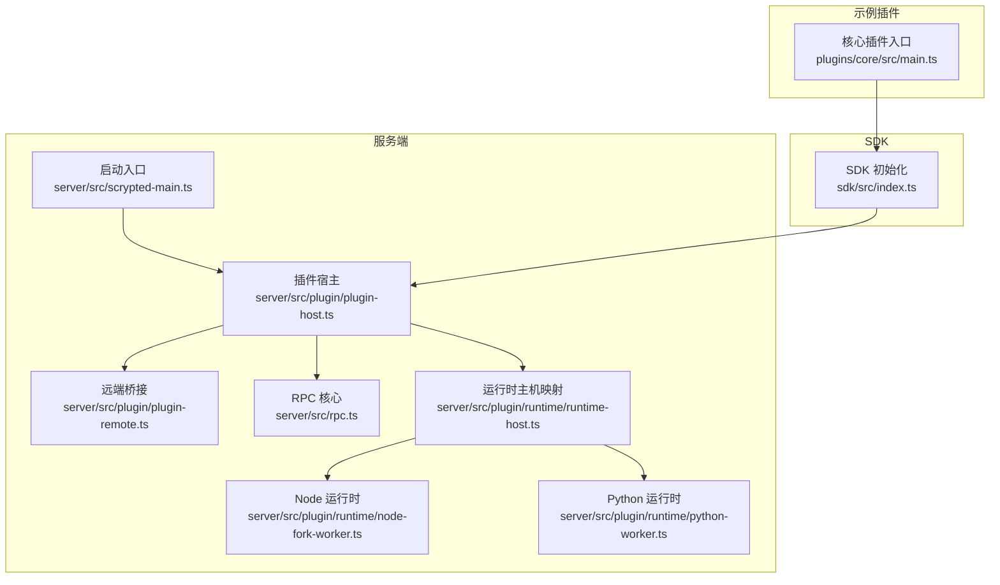
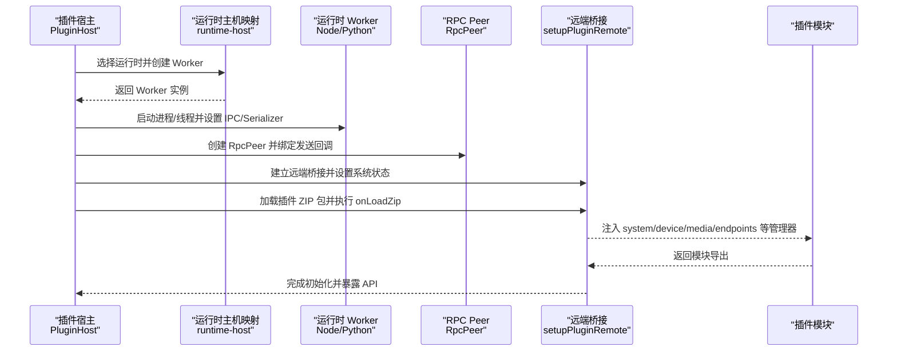
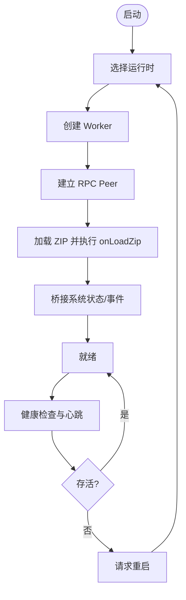
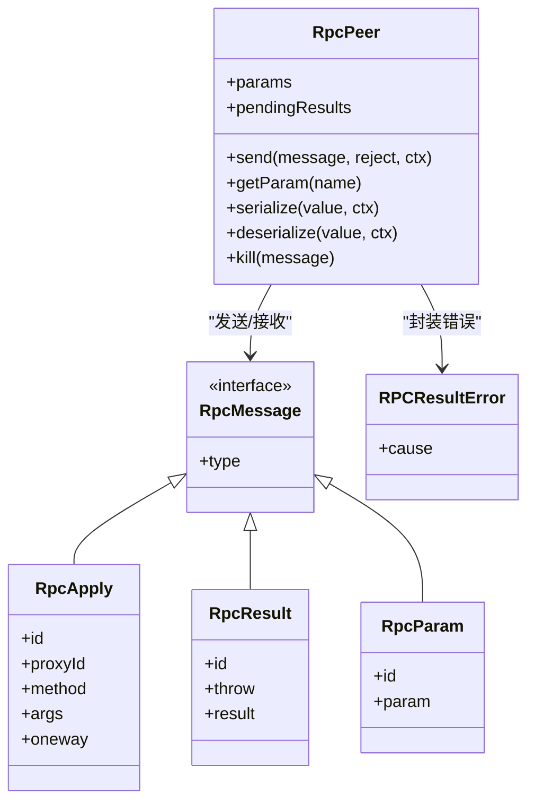
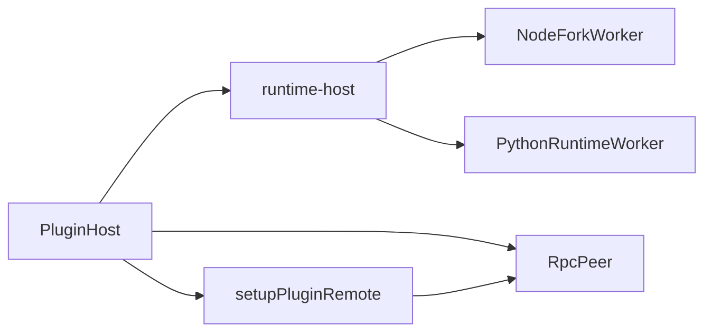

# 插件系统架构

<cite>
**本文引用的文件**
- [README.md](file://README.md)
- [server/src/scrypted-main.ts](file://server/src/scrypted-main.ts)
- [sdk/src/index.ts](file://sdk/src/index.ts)
- [server/src/plugin/plugin-host.ts](file://server/src/plugin/plugin-host.ts)
- [server/src/plugin/runtime/runtime-host.ts](file://server/src/plugin/runtime/runtime-host.ts)
- [server/src/plugin/descriptor.ts](file://server/src/plugin/descriptor.ts)
- [server/src/plugin/plugin-remote.ts](file://server/src/plugin/plugin-remote.ts)
- [packages/rpc/src/index.ts](file://packages/rpc/src/index.ts)
- [server/src/rpc.ts](file://server/src/rpc.ts)
- [server/src/plugin/runtime/node-fork-worker.ts](file://server/src/plugin/runtime/node-fork-worker.ts)
- [server/src/plugin/runtime/python-worker.ts](file://server/src/plugin/runtime/python-worker.ts)
- [plugins/core/src/main.ts](file://plugins/core/src/main.ts)
</cite>

## 目录
1. [简介](#简介)
2. [项目结构](#项目结构)
3. [核心组件](#核心组件)
4. [架构总览](#架构总览)
5. [组件详解](#组件详解)
6. [依赖关系分析](#依赖关系分析)
7. [性能考量](#性能考量)
8. [故障排除指南](#故障排除指南)
9. [结论](#结论)
10. [附录](#附录)

## 简介
本文件系统性阐述 Scrypted 插件系统的架构与实现，覆盖模块化设计理念、插件接口与生命周期、动态加载机制、运行时隔离策略（进程/线程/内存）、RPC 通信原理（序列化、远程过程调用、错误与超时）、插件描述符与配置管理（能力声明、依赖解析、版本兼容）、最佳实践（性能、资源、安全），以及部署、调试与故障排除流程。

## 项目结构
Scrypted 采用多包与多插件并存的组织方式：服务端位于 server/，SDK 位于 sdk/，各类插件位于 plugins/*/，通用工具与公共库在 common/ 与 packages/*。插件系统的核心由服务端的插件宿主、运行时适配器、RPC 框架与插件侧 SDK 共同构成。

图示来源
- [server/src/scrypted-main.ts:1-4](file://server/src/scrypted-main.ts#L1-L4)
- [server/src/plugin/plugin-host.ts:122-224](file://server/src/plugin/plugin-host.ts#L122-L224)
- [server/src/plugin/plugin-remote.ts:13-92](file://server/src/plugin/plugin-remote.ts#L13-L92)
- [server/src/rpc.ts:285-400](file://server/src/rpc.ts#L285-L400)
- [server/src/plugin/runtime/runtime-host.ts:9-17](file://server/src/plugin/runtime/runtime-host.ts#L9-L17)
- [server/src/plugin/runtime/node-fork-worker.ts:31-77](file://server/src/plugin/runtime/node-fork-worker.ts#L31-L77)
- [server/src/plugin/runtime/python-worker.ts:14-44](file://server/src/plugin/runtime/python-worker.ts#L14-L44)
- [sdk/src/index.ts:214-293](file://sdk/src/index.ts#L214-L293)
- [plugins/core/src/main.ts:27-414](file://plugins/core/src/main.ts#L27-L414)

章节来源
- [README.md:1-59](file://README.md#L1-L59)
- [server/src/scrypted-main.ts:1-4](file://server/src/scrypted-main.ts#L1-L4)
- [server/src/plugin/plugin-host.ts:122-224](file://server/src/plugin/plugin-host.ts#L122-L224)
- [server/src/plugin/runtime/runtime-host.ts:9-17](file://server/src/plugin/runtime/runtime-host.ts#L9-L17)
- [server/src/plugin/plugin-remote.ts:13-92](file://server/src/plugin/plugin-remote.ts#L13-L92)
- [server/src/rpc.ts:285-400](file://server/src/rpc.ts#L285-L400)
- [server/src/plugin/runtime/node-fork-worker.ts:31-77](file://server/src/plugin/runtime/node-fork-worker.ts#L31-L77)
- [server/src/plugin/runtime/python-worker.ts:14-44](file://server/src/plugin/runtime/python-worker.ts#L14-L44)
- [sdk/src/index.ts:214-293](file://sdk/src/index.ts#L214-L293)
- [plugins/core/src/main.ts:27-414](file://plugins/core/src/main.ts#L27-L414)

## 核心组件
- 启动与入口
  - 服务端通过入口脚本启动主流程，随后初始化插件宿主与运行时。
- 插件宿主（PluginHost）
  - 负责解压插件包、选择运行时、建立 RPC Peer、准备远端桥接、处理健康检查与重启、暴露 Engine.IO 接口等。
- 远端桥接（setupPluginRemote/attachPluginRemote）
  - 在宿主与插件之间建立双向可序列化的对象代理，屏蔽跨进程/跨语言边界。
- RPC 核心（RpcPeer/RpcMessage）
  - 实现 apply/result/finalize/param 等消息类型，支持函数调用、结果返回、反序列化与错误包装。
- 运行时适配（runtime-host）
  - 将“node”“python”“custom”等运行时映射到具体 Worker 类型。
- Node/Python Worker
  - 分别负责以子进程方式承载插件，建立 IPC 或流式传输通道，并注册序列化器。
- SDK（Scrypted SDK）
  - 提供设备基类、Mixin 设备基类、状态访问器、日志/媒体/系统管理器注入，以及 SDK 初始化逻辑。

章节来源
- [server/src/scrypted-main.ts:1-4](file://server/src/scrypted-main.ts#L1-L4)
- [server/src/plugin/plugin-host.ts:38-224](file://server/src/plugin/plugin-host.ts#L38-L224)
- [server/src/plugin/plugin-remote.ts:13-92](file://server/src/plugin/plugin-remote.ts#L13-L92)
- [server/src/rpc.ts:285-400](file://server/src/rpc.ts#L285-L400)
- [server/src/plugin/runtime/runtime-host.ts:9-17](file://server/src/plugin/runtime/runtime-host.ts#L9-L17)
- [server/src/plugin/runtime/node-fork-worker.ts:31-77](file://server/src/plugin/runtime/node-fork-worker.ts#L31-L77)
- [server/src/plugin/runtime/python-worker.ts:14-44](file://server/src/plugin/runtime/python-worker.ts#L14-L44)
- [sdk/src/index.ts:10-71](file://sdk/src/index.ts#L10-L71)

## 架构总览
下图展示从服务端到插件的完整调用链：宿主选择运行时、启动 Worker、建立 RPC Peer、加载插件模块、桥接系统状态与事件、并通过 Engine.IO 对外提供 API。

图示来源
- [server/src/plugin/plugin-host.ts:330-463](file://server/src/plugin/plugin-host.ts#L330-L463)
- [server/src/plugin/runtime/runtime-host.ts:9-17](file://server/src/plugin/runtime/runtime-host.ts#L9-L17)
- [server/src/plugin/runtime/node-fork-worker.ts:79-96](file://server/src/plugin/runtime/node-fork-worker.ts#L79-L96)
- [server/src/plugin/runtime/python-worker.ts:182-194](file://server/src/plugin/runtime/python-worker.ts#L182-L194)
- [server/src/plugin/plugin-remote.ts:109-318](file://server/src/plugin/plugin-remote.ts#L109-L318)

章节来源
- [server/src/plugin/plugin-host.ts:330-463](file://server/src/plugin/plugin-host.ts#L330-L463)
- [server/src/plugin/runtime/runtime-host.ts:9-17](file://server/src/plugin/runtime/runtime-host.ts#L9-L17)
- [server/src/plugin/runtime/node-fork-worker.ts:79-96](file://server/src/plugin/runtime/node-fork-worker.ts#L79-L96)
- [server/src/plugin/runtime/python-worker.ts:182-194](file://server/src/plugin/runtime/python-worker.ts#L182-L194)
- [server/src/plugin/plugin-remote.ts:109-318](file://server/src/plugin/plugin-remote.ts#L109-L318)

## 组件详解

### 模块化设计与生命周期
- 模块化理念
  - 插件以 ZIP 形式分发，服务端解压后按需加载；运行时可选 node/python/custom，分别对应不同 Worker。
  - SDK 为插件提供统一的设备/系统/媒体/端点管理器，屏蔽底层差异。
- 生命周期
  - 启动：选择运行时 → 创建 Worker → 建立 RPC → 加载 ZIP → 初始化模块。
  - 运行：桥接系统状态与事件，处理 Engine.IO 请求，定期健康检查。
  - 退出：清理 Peer、关闭 Worker、销毁控制台与 IO 连接。

图示来源
- [server/src/plugin/plugin-host.ts:330-463](file://server/src/plugin/plugin-host.ts#L330-L463)
- [server/src/plugin/plugin-remote.ts:281-318](file://server/src/plugin/plugin-remote.ts#L281-L318)

章节来源
- [server/src/plugin/plugin-host.ts:330-463](file://server/src/plugin/plugin-host.ts#L330-L463)
- [server/src/plugin/plugin-remote.ts:281-318](file://server/src/plugin/plugin-remote.ts#L281-L318)

### 动态加载机制
- ZIP 解压与缓存
  - 服务端根据 ZIP 的哈希值决定是否解压与缓存，避免重复开销。
- 运行时选择
  - 依据 package.json 中的 scrypted.runtime 字段或自定义运行时接口选择 Worker。
- 远端桥接
  - 通过 getRemote 参数在宿主与插件间建立可序列化对象代理，确保方法调用与事件通知跨边界透明。

章节来源
- [server/src/plugin/plugin-host.ts:134-144](file://server/src/plugin/plugin-host.ts#L134-L144)
- [server/src/plugin/plugin-host.ts:333-344](file://server/src/plugin/plugin-host.ts#L333-L344)
- [server/src/plugin/plugin-remote.ts:122-123](file://server/src/plugin/plugin-remote.ts#L122-L123)

### 运行时隔离策略
- 进程隔离
  - Node 使用 child_process.fork，Python 使用子进程，二者均与宿主进程分离，具备独立的 GC 与资源空间。
- 线程池与线程
  - Node 支持线程模式标记，便于在特定场景下复用线程资源。
- 内存限制
  - 代码未显式设置内存上限；建议通过外部容器/进程管理器进行资源约束。

章节来源
- [server/src/plugin/runtime/node-fork-worker.ts:31-77](file://server/src/plugin/runtime/node-fork-worker.ts#L31-L77)
- [server/src/plugin/runtime/python-worker.ts:14-44](file://server/src/plugin/runtime/python-worker.ts#L14-L44)

### RPC 通信机制
- 消息模型
  - apply：调用远端对象方法；result：返回结果或错误；finalize：释放远端代理；param：参数查询。
- 序列化与反序列化
  - RpcPeer 支持 JSON 可传输类型与自定义序列化器（如 Buffer、WebSocket、Socket）；错误类型被包装为 RPCResultError。
- 调用与异步迭代
  - 支持普通方法与异步迭代器；对 oneway 方法直接发送不等待结果。
- 错误与超时
  - RPCResultError 统一封装错误栈与消息；Peer 提供 kill 与 pendingResults 冻结机制，防止僵尸调用。

图示来源
- [server/src/rpc.ts:285-400](file://server/src/rpc.ts#L285-L400)
- [server/src/rpc.ts:47-80](file://server/src/rpc.ts#L47-L80)
- [server/src/rpc.ts:229-240](file://server/src/rpc.ts#L229-L240)

章节来源
- [server/src/rpc.ts:285-400](file://server/src/rpc.ts#L285-L400)
- [server/src/rpc.ts:47-80](file://server/src/rpc.ts#L47-L80)
- [server/src/rpc.ts:229-240](file://server/src/rpc.ts#L229-L240)

### 插件描述符与配置管理
- 描述符作用
  - 描述符用于声明设备接口的方法与属性集合，校验插件可用方法与属性，避免非法调用。
- 能力声明与校验
  - 通过接口集合过滤可用方法/属性；对设备 ID 属性变更等特殊事件进行处理。
- 配置与依赖
  - package.json 的 scrypted 字段决定运行时与 Python 版本等；SDK 初始化会合并自定义接口描述。

章节来源
- [server/src/plugin/descriptor.ts:1-36](file://server/src/plugin/descriptor.ts#L1-L36)
- [sdk/src/index.ts:269-293](file://sdk/src/index.ts#L269-L293)

### 插件侧 SDK 与开发体验
- 设备基类与 Mixin
  - 提供 ScryptedDeviceBase 与 MixinDeviceBase，自动注入 storage/log/console/media 等上下文。
- 状态懒加载与属性访问器
  - 通过 getter/setter 懒加载设备状态，避免未发现设备时的异常。
- 调试与部署
  - 支持 VS Code 调试、命令行构建与部署；README 提供示例流程。

章节来源
- [sdk/src/index.ts:10-71](file://sdk/src/index.ts#L10-L71)
- [sdk/src/index.ts:169-204](file://sdk/src/index.ts#L169-L204)
- [README.md:17-59](file://README.md#L17-L59)

### 示例：核心插件（Core）
- 核心插件作为系统内置组件，提供集群、媒体、脚本、终端、REPL、控制台等服务。
- 通过设备发现与路由处理对外提供 HTTP 与设备能力。

章节来源
- [plugins/core/src/main.ts:27-414](file://plugins/core/src/main.ts#L27-L414)

## 依赖关系分析
- 组件耦合
  - PluginHost 与 runtime-host 弱耦合，通过 Map 映射运行时到 Worker；与 RpcPeer 强耦合，负责消息转发与序列化。
  - PluginRemote 与 RpcPeer 协作，负责系统状态与事件的桥接。
- 外部依赖
  - Node Worker 依赖 child_process 与高级序列化；Python Worker 依赖可移植 Python 与流式序列化。
- 循环依赖
  - 未见明显循环依赖；RpcPeer 作为核心枢纽，被各组件依赖但不反向依赖。

图示来源
- [server/src/plugin/runtime/runtime-host.ts:9-17](file://server/src/plugin/runtime/runtime-host.ts#L9-L17)
- [server/src/plugin/runtime/node-fork-worker.ts:31-77](file://server/src/plugin/runtime/node-fork-worker.ts#L31-L77)
- [server/src/plugin/runtime/python-worker.ts:14-44](file://server/src/plugin/runtime/python-worker.ts#L14-L44)
- [server/src/plugin/plugin-host.ts:330-463](file://server/src/plugin/plugin-host.ts#L330-L463)
- [server/src/plugin/plugin-remote.ts:13-92](file://server/src/plugin/plugin-remote.ts#L13-L92)

章节来源
- [server/src/plugin/runtime/runtime-host.ts:9-17](file://server/src/plugin/runtime/runtime-host.ts#L9-L17)
- [server/src/plugin/runtime/node-fork-worker.ts:31-77](file://server/src/plugin/runtime/node-fork-worker.ts#L31-L77)
- [server/src/plugin/runtime/python-worker.ts:14-44](file://server/src/plugin/runtime/python-worker.ts#L14-L44)
- [server/src/plugin/plugin-host.ts:330-463](file://server/src/plugin/plugin-host.ts#L330-L463)
- [server/src/plugin/plugin-remote.ts:13-92](file://server/src/plugin/plugin-remote.ts#L13-L92)

## 性能考量
- 序列化优化
  - RpcPeer 默认仅对 JSON 可传输类型与已注册序列化器进行高效传输，减少不必要的拷贝。
- 垃圾回收
  - 提供周期性 GC 触发机制，降低长生命周期进程中的内存占用。
- 异步迭代与 Oneway 调用
  - 对高吞吐事件流使用 oneway 方法，避免阻塞等待。
- 资源隔离
  - 进程级隔离天然带来资源边界；建议结合容器/进程组限制 CPU/内存。

章节来源
- [server/src/rpc.ts:1-27](file://server/src/rpc.ts#L1-L27)
- [server/src/rpc.ts:84-220](file://server/src/rpc.ts#L84-L220)

## 故障排除指南
- 插件无法启动
  - 检查运行时选择与环境变量（如 SCRYPTED_PYTHON_PATH），确认 ZIP 解压与缓存路径存在。
- 心跳失败/频繁重启
  - 查看健康检查定时器与 lastPong 时间，确认插件未卡死或阻塞。
- RPC 错误
  - 关注 RPCResultError 的堆栈信息，定位序列化/反序列化问题或方法不存在。
- 调试
  - Node：VS Code 断点；Python：debugpy；命令行使用 scrypted-deploy 调试端口。

章节来源
- [server/src/plugin/plugin-host.ts:289-325](file://server/src/plugin/plugin-host.ts#L289-L325)
- [server/src/rpc.ts:229-240](file://server/src/rpc.ts#L229-L240)
- [README.md:17-59](file://README.md#L17-L59)

## 结论
Scrypted 插件系统通过清晰的运行时抽象、强健的 RPC 通信与严格的描述符校验，实现了高扩展性与可维护性。其进程级隔离与可插拔的序列化器设计，既保证了安全性，也为多语言生态提供了便利。建议在生产环境中配合容器/进程组进行资源限制，并遵循 SDK 最佳实践以获得稳定性能与良好开发体验。

## 附录
- 部署与调试
  - 使用 README 提供的 VS Code 与命令行流程进行本地调试与部署。
- 版本与兼容
  - 通过 SDK 初始化阶段合并自定义接口描述，确保类型与能力声明一致。

章节来源
- [README.md:17-59](file://README.md#L17-L59)
- [sdk/src/index.ts:269-293](file://sdk/src/index.ts#L269-L293)