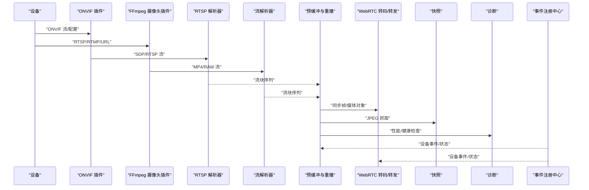
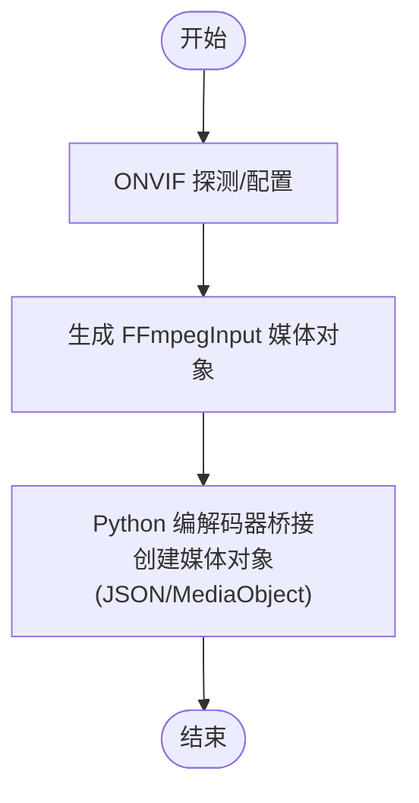
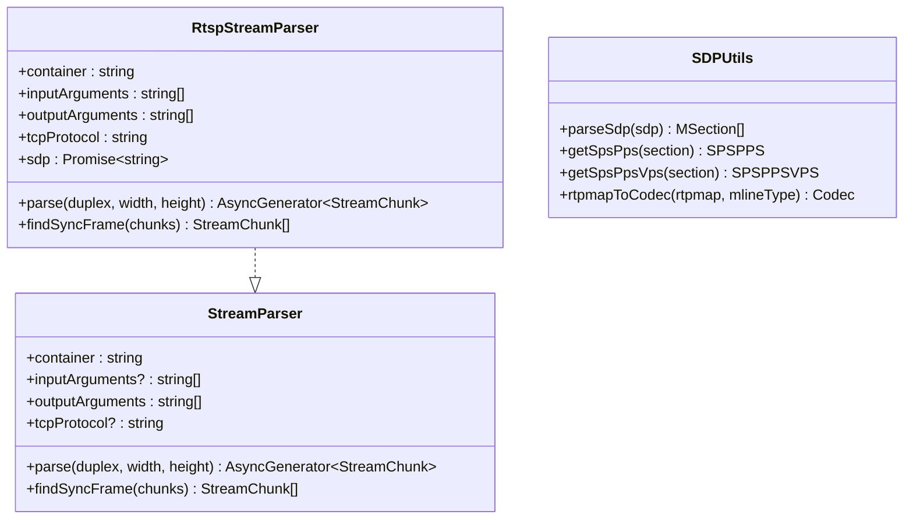
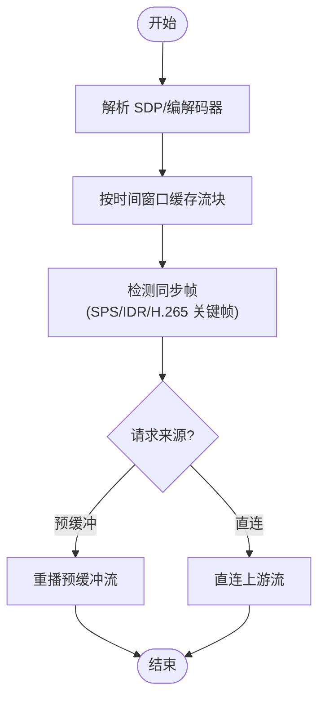
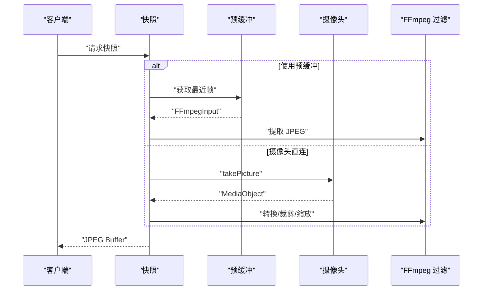
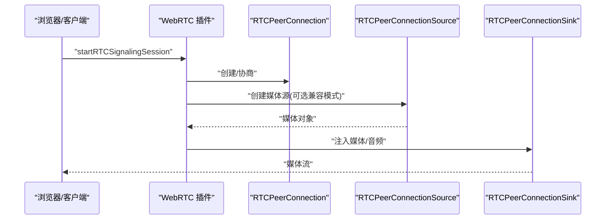
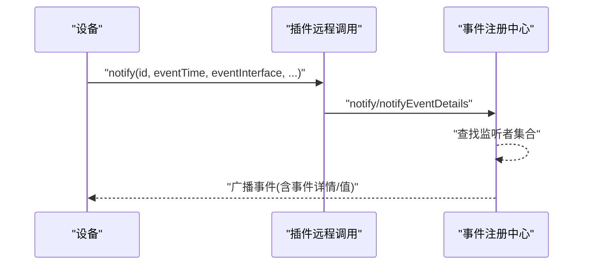
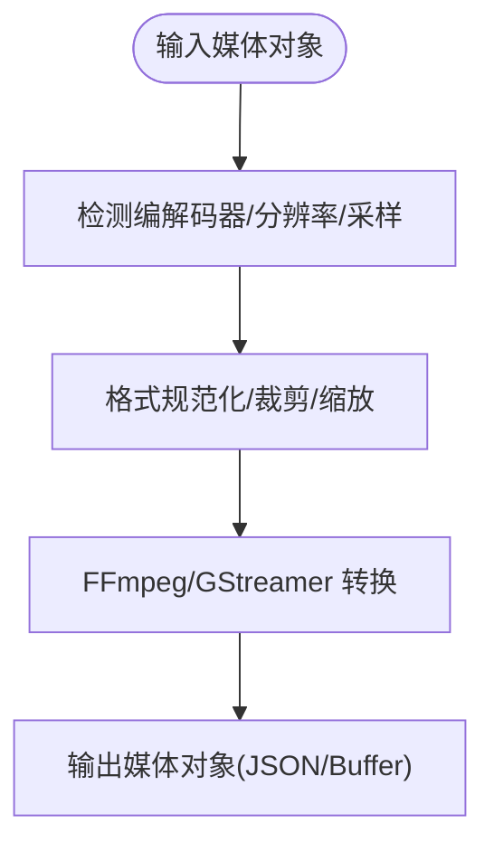
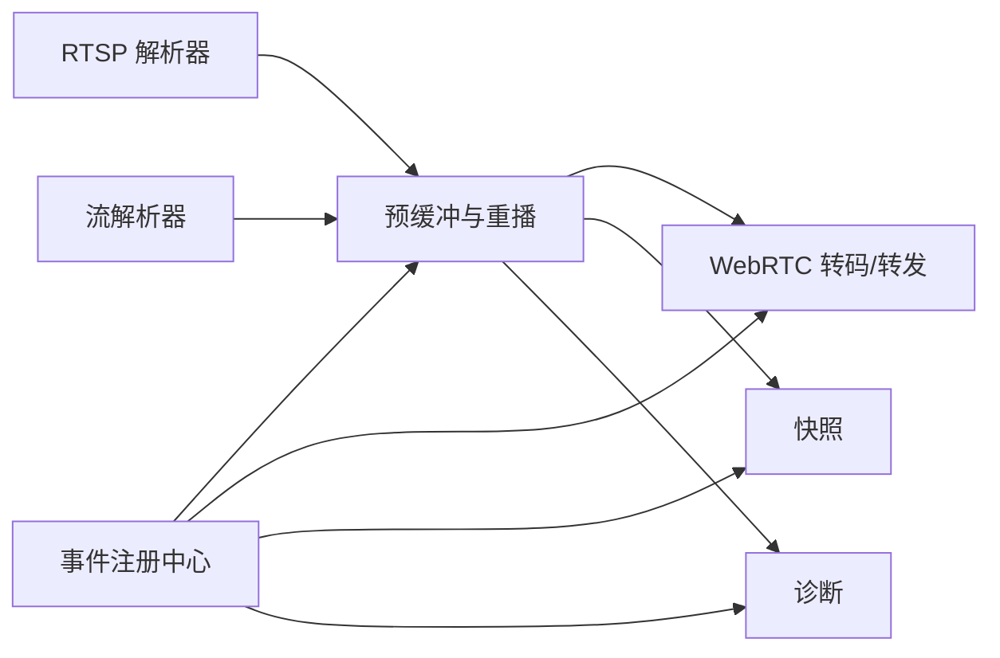

# 数据流设计

<cite>
**本文引用的文件**
- [event-registry.ts](file://server/src/event-registry.ts)
- [plugin-remote.ts](file://server/src/plugin/plugin-remote.ts)
- [media-helpers.ts](file://server/src/media-helpers.ts)
- [rtsp-server.ts](file://common/src/rtsp-server.ts)
- [stream-parser.ts](file://common/src/stream-parser.ts)
- [prebuffer-mixin/main.ts](file://plugins/prebuffer-mixin/src/main.ts)
- [ffmpeg-camera/main.ts](file://plugins/ffmpeg-camera/src/main.ts)
- [snapshot/main.ts](file://plugins/snapshot/src/main.ts)
- [webrtc/main.ts](file://plugins/webrtc/src/main.ts)
- [diagnostics/main.ts](file://plugins/diagnostics/src/main.ts)
- [gstreamer.py](file://plugins/python-codecs/src/gstreamer.py)
- [onvif-configure.ts](file://plugins/onvif/src/onvif-configure.ts)
- [sdp-utils.ts](file://common/src/sdp-utils.ts)
- [promise-debounce.ts](file://sdk/src/promise-debounce.ts)
- [async-queue.ts](file://common/src/async-queue.ts)
</cite>

## 目录
1. [引言](#引言)
2. [项目结构](#项目结构)
3. [核心组件](#核心组件)
4. [架构总览](#架构总览)
5. [组件详解](#组件详解)
6. [依赖关系分析](#依赖关系分析)
7. [性能考量](#性能考量)
8. [故障排查指南](#故障排查指南)
9. [结论](#结论)
10. [附录](#附录)

## 引言
本文件面向 Scrypted 的数据流设计，系统性阐述从设备采集到媒体处理、路由与存储的全链路机制；覆盖视频解码/转码/编码、缓存策略、事件驱动传播、格式标准化与编解码器选择、性能监控与诊断、优化策略与错误恢复等主题。目标是帮助开发者与运维人员建立对数据流的统一认知，并提供可操作的优化与排障建议。

## 项目结构
Scrypted 采用多插件与服务协同的架构：设备侧通过插件提供输入（如 RTSP/RTMP/FFmpeg/ONVIF 等），核心服务负责事件分发、媒体对象转换与生命周期管理，前端或客户端通过 RPC/HTTP 访问媒体与控制接口。关键模块分布如下：
- 通用工具层：RTSP 解析、SDP 解析、流解析器、异步队列、媒体辅助函数
- 核心服务层：事件注册中心、插件远程调用、媒体管理辅助
- 插件层：预缓冲与重播、FFmpeg 摄像头、快照、WebRTC、诊断、ONVIF 配置、Python 编解码器桥接等
- SDK 层：SDK 提供媒体对象、设置、事件监听等抽象

```mermaid
graph TB
subgraph "设备与采集"
DEV["设备/摄像头"]
ONVIF["ONVIF 插件"]
FFMPEGCAM["FFmpeg 摄像头插件"]
end
subgraph "通用工具"
RTPSP["RTSP 解析器"]
SDPU["SDP 工具"]
STRPAR["流解析器"]
ASQ["异步队列"]
end
subgraph "核心服务"
EVREG["事件注册中心"]
PRREM["插件远程调用"]
MEDH["媒体辅助"]
end
subgraph "插件与功能"
PREBUF["预缓冲与重播"]
SNAP["快照"]
WEBRTC["WebRTC 转码/转发"]
DIAG["诊断"]
PYCODEC["Python 编解码器桥接"]
end
DEV --> ONVIF
DEV --> FFMPEGCAM
ONVIF --> RTPSP
FFMPEGCAM --> STRPAR
RTPSP --> PREBUF
STRPAR --> PREBUF
PREBUF --> WEBRTC
PREBUF --> SNAP
PREBUF --> DIAG
PYCODEC --> WEBRTC
EVREG <- --> PRREM
MEDH --> PREBUF
MEDH --> WEBRTC
MEDH --> SNAP
```

图示来源
- [rtsp-server.ts:279-333](file://common/src/rtsp-server.ts#L279-L333)
- [stream-parser.ts:6-31](file://common/src/stream-parser.ts#L6-L31)
- [prebuffer-mixin/main.ts:460-719](file://plugins/prebuffer-mixin/src/main.ts#L460-L719)
- [ffmpeg-camera/main.ts:110-125](file://plugins/ffmpeg-camera/src/main.ts#L110-L125)
- [event-registry.ts:39-104](file://server/src/event-registry.ts#L39-L104)
- [plugin-remote.ts:238-273](file://server/src/plugin/plugin-remote.ts#L238-L273)
- [media-helpers.ts:1-98](file://server/src/media-helpers.ts#L1-L98)
- [webrtc/main.ts:159-190](file://plugins/webrtc/src/main.ts#L159-L190)
- [snapshot/main.ts:164-318](file://plugins/snapshot/src/main.ts#L164-L318)
- [diagnostics/main.ts:227-384](file://plugins/diagnostics/src/main.ts#L227-L384)
- [gstreamer.py:294-323](file://plugins/python-codecs/src/gstreamer.py#L294-L323)

章节来源
- [rtsp-server.ts:1-1235](file://common/src/rtsp-server.ts#L1-L1235)
- [stream-parser.ts:1-108](file://common/src/stream-parser.ts#L1-L108)
- [prebuffer-mixin/main.ts:1-800](file://plugins/prebuffer-mixin/src/main.ts#L1-L800)
- [ffmpeg-camera/main.ts:1-155](file://plugins/ffmpeg-camera/src/main.ts#L1-L155)
- [event-registry.ts:39-104](file://server/src/event-registry.ts#L39-L104)
- [plugin-remote.ts:238-273](file://server/src/plugin/plugin-remote.ts#L238-L273)
- [media-helpers.ts:1-98](file://server/src/media-helpers.ts#L1-L98)
- [webrtc/main.ts:1-776](file://plugins/webrtc/src/main.ts#L1-L776)
- [snapshot/main.ts:1-870](file://plugins/snapshot/src/main.ts#L1-L870)
- [diagnostics/main.ts:1-775](file://plugins/diagnostics/src/main.ts#L1-L775)
- [gstreamer.py:239-323](file://plugins/python-codecs/src/gstreamer.py#L239-L323)

## 核心组件
- 事件注册中心：负责设备事件的订阅、通知与去噪，支持系统级与设备级事件分发。
- 插件远程调用：封装事件上报、状态更新与系统交互，确保跨进程边界的一致性。
- 媒体辅助：提供 FFmpeg 安全退出、日志过滤与参数打印等能力，保障媒体子进程稳定。
- RTSP/流解析器：统一解析 RTSP/MP4/RTP 等协议，生成可消费的流块序列。
- 预缓冲与重播：在云端/边缘侧缓存关键帧窗口，提供低延迟回放与同步帧定位。
- 快照：从预缓冲或摄像头抓取 JPEG，支持裁剪、缩放与错误降级。
- WebRTC：将媒体流转换为 WebRTC，支持兼容模式与 ICE/TURN 配置。
- 诊断：系统与设备健康检查、性能验证、外部资源可达性与 GPU 加速验证。
- Python 编解码器桥接：通过 GStreamer/FFmpeg 将图像/视频对象转换为 Scrypted 可消费的媒体对象。
- ONVIF 配置：自动探测/配置编码参数，映射到 FFmpeg/Scrypted 参数。
- SDP 工具：解析音频/视频编解码器、SPS/PPS/VPS、RTP 映射等。

章节来源
- [event-registry.ts:39-104](file://server/src/event-registry.ts#L39-L104)
- [plugin-remote.ts:238-273](file://server/src/plugin/plugin-remote.ts#L238-L273)
- [media-helpers.ts:1-98](file://server/src/media-helpers.ts#L1-L98)
- [rtsp-server.ts:279-333](file://common/src/rtsp-server.ts#L279-L333)
- [stream-parser.ts:6-31](file://common/src/stream-parser.ts#L6-L31)
- [prebuffer-mixin/main.ts:460-719](file://plugins/prebuffer-mixin/src/main.ts#L460-L719)
- [snapshot/main.ts:164-318](file://plugins/snapshot/src/main.ts#L164-L318)
- [webrtc/main.ts:159-190](file://plugins/webrtc/src/main.ts#L159-L190)
- [diagnostics/main.ts:227-384](file://plugins/diagnostics/src/main.ts#L227-L384)
- [gstreamer.py:294-323](file://plugins/python-codecs/src/gstreamer.py#L294-L323)
- [onvif-configure.ts:49-202](file://plugins/onvif/src/onvif-configure.ts#L49-L202)
- [sdp-utils.ts:183-411](file://common/src/sdp-utils.ts#L183-L411)

## 架构总览
下图展示从设备采集到媒体消费的关键路径：设备输出经由插件转换为媒体对象，再由解析器/预缓冲模块进行处理，最终通过 WebRTC 或本地流暴露给消费者；事件通过事件注册中心广播，状态变更触发通知。



图示来源
- [rtsp-server.ts:279-333](file://common/src/rtsp-server.ts#L279-L333)
- [stream-parser.ts:6-31](file://common/src/stream-parser.ts#L6-L31)
- [prebuffer-mixin/main.ts:460-719](file://plugins/prebuffer-mixin/src/main.ts#L460-L719)
- [webrtc/main.ts:159-190](file://plugins/webrtc/src/main.ts#L159-L190)
- [snapshot/main.ts:164-318](file://plugins/snapshot/src/main.ts#L164-L318)
- [diagnostics/main.ts:227-384](file://plugins/diagnostics/src/main.ts#L227-L384)
- [event-registry.ts:39-104](file://server/src/event-registry.ts#L39-L104)

## 组件详解

### 设备数据采集与媒体对象生成
- ONVIF 插件：自动探测编码参数，映射到 FFmpeg/Scrypted 参数，生成媒体流选项。
- FFmpeg 摄像头插件：解析用户输入的 FFmpeg 参数，生成 FFmpegInput 媒体对象。
- Python 编解码器桥接：将图像/视频对象转换为 Scrypted 可消费的媒体对象，支持格式/尺寸回调。



图示来源
- [onvif-configure.ts:70-202](file://plugins/onvif/src/onvif-configure.ts#L70-L202)
- [ffmpeg-camera/main.ts:110-125](file://plugins/ffmpeg-camera/src/main.ts#L110-L125)
- [gstreamer.py:294-323](file://plugins/python-codecs/src/gstreamer.py#L294-L323)

章节来源
- [onvif-configure.ts:49-202](file://plugins/onvif/src/onvif-configure.ts#L49-L202)
- [ffmpeg-camera/main.ts:110-125](file://plugins/ffmpeg-camera/src/main.ts#L110-L125)
- [gstreamer.py:294-323](file://plugins/python-codecs/src/gstreamer.py#L294-L323)

### 媒体处理与路由（RTSP/MP4/流解析）
- RTSP 解析器：解析 SDP，识别视频/音频编解码器与关键帧类型，生成同步帧定位。
- 流解析器：统一输出参数、解析 MP4 片段、生成起始帧与流块序列。
- SDP 工具：解析音频/视频编解码器、RTP 映射、SPS/PPS/VPS。



图示来源
- [rtsp-server.ts:279-333](file://common/src/rtsp-server.ts#L279-L333)
- [stream-parser.ts:6-31](file://common/src/stream-parser.ts#L6-L31)
- [sdp-utils.ts:183-411](file://common/src/sdp-utils.ts#L183-L411)

章节来源
- [rtsp-server.ts:279-333](file://common/src/rtsp-server.ts#L279-L333)
- [stream-parser.ts:6-31](file://common/src/stream-parser.ts#L6-L31)
- [sdp-utils.ts:183-411](file://common/src/sdp-utils.ts#L183-L411)

### 预缓冲与重播（缓存策略与同步帧）
- 预缓冲窗口：按时间窗口缓存 RTSP/RTMP 流块，支持检测关键帧（SPS/IDR/H.265 关键帧相关）以实现同步帧定位。
- 重播路由：根据请求选择预缓冲或直连上游，支持隐私模式与合成流源切换。
- 设置项：解析分辨率/码率/编解码器/关键帧间隔，提供 FFmpeg 输入/输出参数自定义。



图示来源
- [prebuffer-mixin/main.ts:230-280](file://plugins/prebuffer-mixin/src/main.ts#L230-L280)
- [prebuffer-mixin/main.ts:460-719](file://plugins/prebuffer-mixin/src/main.ts#L460-L719)

章节来源
- [prebuffer-mixin/main.ts:230-280](file://plugins/prebuffer-mixin/src/main.ts#L230-L280)
- [prebuffer-mixin/main.ts:460-719](file://plugins/prebuffer-mixin/src/main.ts#L460-L719)

### 快照与图像处理
- 快照来源：优先使用预缓冲（可选隐私模式）、其次摄像头直连、最后回退到预缓冲。
- 图像处理：支持裁剪、缩放、按纵横比约束、模糊/亮度调整、文本叠加等。
- 错误降级：超时/不可用时生成带背景的错误图像，避免长时间等待。



图示来源
- [snapshot/main.ts:164-318](file://plugins/snapshot/src/main.ts#L164-L318)
- [snapshot/main.ts:420-503](file://plugins/snapshot/src/main.ts#L420-L503)

章节来源
- [snapshot/main.ts:164-318](file://plugins/snapshot/src/main.ts#L164-L318)
- [snapshot/main.ts:420-503](file://plugins/snapshot/src/main.ts#L420-L503)

### WebRTC 转码与转发
- 信令通道：支持原生信令透传或代理/转码模式，按客户端需求选择。
- 转码与兼容：可启用最大兼容模式，强制参考编解码器；支持 Opus 音频、TURN/STUN 配置。
- 连接管理：基于数据通道的 RPC 对象连接，支持连接生命周期管理与清理。



图示来源
- [webrtc/main.ts:114-143](file://plugins/webrtc/src/main.ts#L114-L143)
- [webrtc/main.ts:159-190](file://plugins/webrtc/src/main.ts#L159-L190)
- [webrtc/main.ts:305-366](file://plugins/webrtc/src/main.ts#L305-L366)

章节来源
- [webrtc/main.ts:114-143](file://plugins/webrtc/src/main.ts#L114-L143)
- [webrtc/main.ts:159-190](file://plugins/webrtc/src/main.ts#L159-L190)
- [webrtc/main.ts:305-366](file://plugins/webrtc/src/main.ts#L305-L366)

### 事件驱动的数据传播
- 事件注册：按设备 ID 与事件接口聚合监听者，支持系统级与设备级事件。
- 通知机制：区分有状态变更与无状态事件，避免噪声；支持 mixinId 区分混入事件。
- 插件远程调用：将事件写入系统状态并触发事件注册中心通知。



图示来源
- [plugin-remote.ts:238-273](file://server/src/plugin/plugin-remote.ts#L238-L273)
- [event-registry.ts:39-104](file://server/src/event-registry.ts#L39-L104)

章节来源
- [plugin-remote.ts:238-273](file://server/src/plugin/plugin-remote.ts#L238-L273)
- [event-registry.ts:39-104](file://server/src/event-registry.ts#L39-L104)

### 数据转换与格式标准化
- 编解码器选择：ONVIF 到 FFmpeg 编解码器映射，SDP 解析音频/视频编解码器与采样参数。
- 格式适配：GStreamer/FFmpeg 后处理管线，支持格式规范化（如 RGB/NV12/GRAY8）与裁剪/缩放。
- 性能优化：异步队列、去抖与缓存、参数化 FFmpeg 输入/输出前缀，降低启动与转换开销。



图示来源
- [onvif-configure.ts:49-202](file://plugins/onvif/src/onvif-configure.ts#L49-L202)
- [sdp-utils.ts:183-411](file://common/src/sdp-utils.ts#L183-L411)
- [gstreamer.py:239-282](file://plugins/python-codecs/src/gstreamer.py#L239-L282)

章节来源
- [onvif-configure.ts:49-202](file://plugins/onvif/src/onvif-configure.ts#L49-L202)
- [sdp-utils.ts:183-411](file://common/src/sdp-utils.ts#L183-L411)
- [gstreamer.py:239-282](file://plugins/python-codecs/src/gstreamer.py#L239-L282)

## 依赖关系分析
- 组件耦合：预缓冲与重播依赖 RTSP/流解析器；WebRTC 依赖预缓冲与媒体对象；快照依赖预缓冲或摄像头；诊断依赖媒体与系统状态。
- 外部依赖：FFmpeg、GStreamer、ONVIF、WebRTC/Werift、Sharp/Vips 等。
- 循环依赖：未见直接循环；事件注册中心通过回调解耦广播与接收方。



图示来源
- [rtsp-server.ts:279-333](file://common/src/rtsp-server.ts#L279-L333)
- [stream-parser.ts:6-31](file://common/src/stream-parser.ts#L6-L31)
- [prebuffer-mixin/main.ts:460-719](file://plugins/prebuffer-mixin/src/main.ts#L460-L719)
- [webrtc/main.ts:159-190](file://plugins/webrtc/src/main.ts#L159-L190)
- [snapshot/main.ts:164-318](file://plugins/snapshot/src/main.ts#L164-L318)
- [diagnostics/main.ts:227-384](file://plugins/diagnostics/src/main.ts#L227-L384)
- [event-registry.ts:39-104](file://server/src/event-registry.ts#L39-L104)

章节来源
- [rtsp-server.ts:279-333](file://common/src/rtsp-server.ts#L279-L333)
- [stream-parser.ts:6-31](file://common/src/stream-parser.ts#L6-L31)
- [prebuffer-mixin/main.ts:460-719](file://plugins/prebuffer-mixin/src/main.ts#L460-L719)
- [webrtc/main.ts:159-190](file://plugins/webrtc/src/main.ts#L159-L190)
- [snapshot/main.ts:164-318](file://plugins/snapshot/src/main.ts#L164-L318)
- [diagnostics/main.ts:227-384](file://plugins/diagnostics/src/main.ts#L227-L384)
- [event-registry.ts:39-104](file://server/src/event-registry.ts#L39-L104)

## 性能考量
- 媒体子进程稳定性：安全退出、日志过滤、参数脱敏打印，减少噪音与资源泄漏风险。
- 队列与去抖：异步队列保证有序消费，去抖与缓存减少重复计算与网络请求。
- 编解码器与参数：推荐 H.264 视频与 PCM_MULAW/AAC/Opus 音频；合理设置关键帧间隔与码率控制。
- GPU 加速：诊断模块验证 GPU 解码/变换可用性，结合硬件加速可显著提升性能。
- 网络与 NAT：TURN/STUN 配置与 IPv4/IPv6 地址校验，确保 WebRTC 连通性。

章节来源
- [media-helpers.ts:1-98](file://server/src/media-helpers.ts#L1-L98)
- [async-queue.ts:1-242](file://common/src/async-queue.ts#L1-L242)
- [promise-debounce.ts:1-14](file://sdk/src/promise-debounce.ts#L1-L14)
- [diagnostics/main.ts:654-744](file://plugins/diagnostics/src/main.ts#L654-L744)

## 故障排查指南
- 事件噪声与状态变更：确认事件接口白名单与 changed 标记，避免无状态事件风暴。
- FFmpeg 日志与参数：开启日志过滤与参数打印，定位启动失败与参数问题。
- 预缓冲与重播：检查解析器类型（Scrypted/FFmpeg TCP/UDP）、关键帧检测与预缓冲窗口大小。
- 快照失败：启用预缓冲快照回退、裁剪/缩放参数校验、错误图像降级。
- WebRTC 连接：检查 TURN/STUN 配置、ICE 候选过滤、兼容模式与编解码器匹配。
- 诊断验证：系统安装环境、CPU/内存、GPU 设备、云服务可达性、外部资源 DNS 与访问性。

章节来源
- [event-registry.ts:39-104](file://server/src/event-registry.ts#L39-L104)
- [media-helpers.ts:40-97](file://server/src/media-helpers.ts#L40-L97)
- [prebuffer-mixin/main.ts:460-719](file://plugins/prebuffer-mixin/src/main.ts#L460-L719)
- [snapshot/main.ts:164-318](file://plugins/snapshot/src/main.ts#L164-L318)
- [webrtc/main.ts:558-631](file://plugins/webrtc/src/main.ts#L558-L631)
- [diagnostics/main.ts:386-771](file://plugins/diagnostics/src/main.ts#L386-L771)

## 结论
Scrypted 的数据流设计以“事件驱动 + 媒体对象 + 多插件协同”为核心，通过 RTSP/流解析器与预缓冲机制实现稳定的媒体处理与路由；快照与 WebRTC 提供多样化的消费场景；诊断与媒体辅助保障系统健康与性能。遵循推荐的编解码器与参数配置、合理利用缓存与去抖、以及完善的事件与错误处理，可获得高可靠与高性能的数据流体验。

## 附录
- 关键流程图与类图已在相应章节中给出，便于快速定位实现细节与依赖关系。
- 代码片段路径以“文件:行号”形式标注，便于进一步查阅具体实现。